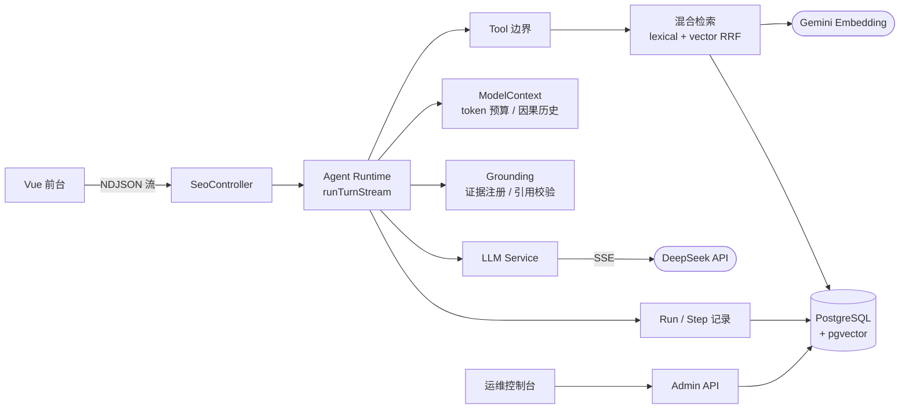

<div align="center">

# TypeScript Agent Runtime

**从零手写的全栈 AI Agent 运行时 —— 不依赖 LangChain / Workflow 引擎，每一行编排逻辑都可读、可测、可审计。**

流式对话 · 有界 Agent Loop · Tool Calling · Token 级上下文工程 · pgvector 混合检索 · 服务端校验的证据引用


</div>

## 这是什么

一个完整闭环的 AI SEO 问答 Agent：用户在 Web 前台提问，Runtime 在服务端预算内编排模型采样与工具调用，从 pgvector 索引中做混合检索，最终产出**每条引用都经过服务端校验**的带证据回答——全过程持久化为可审计的 Run / Step 轨迹，并配有独立的运维控制台。

它不是又一个框架 Demo。所有编排（采样轮次、工具执行、上下文预算、终态提交、引用校验）都是显式 TypeScript 代码，这也是它作为 Agent 工程学习样本的价值：**没有任何一步藏在黑盒里**。

## 架构



一次带引用回答的完整生命周期：

```text
用户提问
  -> 创建 AgentRun，解析模型与输入预算（本地 DeepSeek tokenizer 精确估算）
  -> 因果历史选择进入 ModelContext（COMPLETED-only、token 预算内）
  -> 模型采样（SSE 流式）
       -> 触发 retrieve_article_context 工具
       -> Gemini query embedding + pgvector 余弦检索 + lexical RRF 融合
       -> 证据注册：签发 Run 级不透明 citationKey，正文对模型扣留
  -> structured finalization：模型必须调用 submit_grounded_answer 提交答案与引用
  -> 服务端逐条校验 citationKey 与引用文本（fail-closed）
  -> Message / Grounding / Step / Run 单事务原子落库
  -> 前台渲染回答 + 可追溯的来源卡片
```

## 核心能力

| 能力 | 实现 |
| --- | --- |
| 有界 Agent Loop | 服务端策略约束：默认 ≤3 轮采样、≤2 次 Tool Call、10 分钟 Run deadline |
| 流式输出 | Abort 感知的 NDJSON 增量流，中止 / 半包 / 消息版本竞态全部有守卫 |
| Tool Calling | 类型化定义、注册表、参数校验、执行隔离、超时与取消传播、按 Run 白名单 |
| 上下文工程 | 每 Run 独立 `ModelContext`，模型感知预算 + 动态历史选择 + Observation 治理 |
| RAG 检索 | 确定性 HTML 分块、版本化 Embedding profile、精确余弦 + RRF(k=60) 混合 |
| 证据引用 | 引用是服务端校验的结构化事实，不是模型随手写的 Markdown `[1]` |
| 可靠性 | Run 剩余预算传导到 DB statement timeout；晚到结果 fencing；终态原子提交 |
| 可观测性 | 每次采样的输入 / 输出 / 预算决策 / 错误持久化；Admin 端 Run Trace 与检索审计 |

## 工程原则

- **显式控制流** —— 编排逻辑就在 TypeScript 里，不藏在 workflow 引擎背后。
- **模型输出不可信** —— 工具名、参数、引用 key 全部先校验再执行，检索正文以 untrusted data 隔离注入。
- **分层消息模型** —— UI Message ≠ 模型输入 ≠ 运行事件 ≠ 持久化轨迹，各自独立契约。
- **预算而非上限** —— Provider 容量只是天花板，模型实际看到什么由应用策略决定。
- **终态所有权** —— 晚到的 Abort / deadline / DB 结果不能覆盖已确立的终态；COMMIT 结果不确定时如实暴露，不伪造成功。
- **证据驱动演进** —— 550+ 项测试（含真实 PostgreSQL / pgvector / SDK 传输层集成测试）先行，能力后加。

## 快速开始

要求：Node.js `^20.19.0` 或 `>=22.12.0`、pnpm `10.32.1`、Docker、DeepSeek API Key、Gemini API Key（检索链路用）。

```bash
corepack enable
pnpm install
cp .env.example .env                                          # 填入 LLM_API_KEY / GEMINI_API_KEY
docker compose up -d postgres                                 # 含 pgvector 的主库
pnpm prisma:generate
pnpm prisma:migrate
node --env-file=.env --import tsx apps/api/scripts/seed.ts    # 灌入 68 篇 Demo 文章（幂等）
pnpm --filter @agent/api index:articles -- --mode=incremental # 构建向量索引（调真实 Gemini）
pnpm dev
```

| 应用 | 地址 |
| --- | --- |
| Web 前台 | `http://localhost:5173` |
| 运维控制台 | `http://localhost:5174` |
| API | `http://localhost:3000/api` |

seed 与 index 是检索 / 引用链路可用的前提：跳过它们普通聊天仍可用，但 `retrieve_article_context` 会因缺少 active index 而 fail closed。自装 PostgreSQL 必须带 pgvector 扩展；从旧 `postgres:16-alpine` 卷升级时建议重置卷重建（musl→glibc collation 差异），开发数据可由 seed / index 完整重建。

完整环境变量见 [`.env.example`](./.env.example)；常用验证：`pnpm typecheck`、`pnpm lint`、`pnpm --filter @agent/api test:*`（14 个按边界拆分的测试入口）。

## 目录结构

```text
apps/
  api/        NestJS API：Agent Runtime、模型适配、Tool、检索与索引、Prisma 边界
  web/        Vue 3 对话前台（流式渲染 + 来源卡片）
  admin/      运维控制台（Run Trace / 检索审计）
packages/
  contracts/  前后端共享协议与类型（编译期防漂移）
prisma/       PostgreSQL schema、pgvector migration、fixtures 与 seed
docs/         路线图、任务归档、研究沉淀与工作日志
```

## 更多文档

阶段路线见 [`docs/roadmap.md`](./docs/roadmap.md)，任务归档见 [`docs/tasks/`](./docs/tasks/README.md)，架构决策与推进记录见 [`docs/work-log.md`](./docs/work-log.md)。项目按 8 个阶段迭代完成：多轮流式对话 → 有界 Agent Loop → 上下文工程 → Grounded Retrieval，全部经 Issue / PR / 双重 Review 收口。
