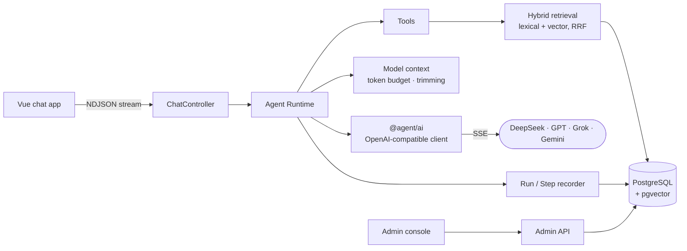

<div align="center">

# TypeScript Agent Runtime

<h3>Agents you can actually read.</h3>

A production-minded AI agent runtime in plain TypeScript.<br/>
No LangChain. No LangGraph. No workflow engine. Just the loop, the edge cases, and the tests.

**English** · [简体中文](./README.zh-CN.md)

[](https://github.com/mufeiyu-ayu/agent/stargazers)


[Why](#why-this-exists) · [Highlights](#highlights) · [The loop](#the-whole-loop-in-one-screen) · [Quick start](#quick-start) · [Learn from it](#learn-agent-engineering-from-it) · [Roadmap](#roadmap)

</div>

---

## Why this exists

Most agent tutorials end at "call the model in a `while` loop". Real agents break after that point:

- the model writes half an answer, then asks for **two tools at once**;
- the tool arguments get **cut off** because the output hit its token limit;
- the user **closes the tab** while a tool is still running;
- a request fails, gets retried, and a **late result tries to overwrite** a run that already ended.

Frameworks hide these decisions behind abstractions. This project handles every one of them in explicit, tested TypeScript, so you can open a file and see exactly what happens.

<div align="center">

| ~5,000 | 700+ | 80+ | 80+ |
| :---: | :---: | :---: | :---: |
| lines of runtime code | tests | merged PRs | closed issues |

</div>

## Highlights

### 🛑 One run, one final state

User aborts, deadlines, and late database results all race for the final state, and only the first one wins. The message, the steps, and the run are committed in a single transaction. When the commit outcome is uncertain, the system reports it instead of faking success.

### 🧭 Every step on the record

Each run is stored as a sequence of steps: history loading, every model call, every tool call, and the final answer. The admin console shows a timeline with token usage, latency, finish reasons, failure causes, and (optionally) a debug capture of the request and response exchanged with the provider.

### 📏 Context engineering with real token budgets

Each run gets its own model context. Tokens are estimated with a local DeepSeek tokenizer (an approximation for other model families), history is trimmed oldest-first in question–answer pairs to fit the budget, and tool output is treated as untrusted data with its own size limits.

### 🔌 OpenAI-compatible providers

DeepSeek's official API and OpenAI-compatible relays (GPT / Grok / Gemini) share one configuration. Gemini called directly through Google's endpoint can't continue a tool call yet (thought signatures aren't sent back). Providers and models are managed in the admin console, API keys are encrypted with AES-256-GCM, and per-family protocol differences live in one compat table.

### 🧪 Built like production, documented like a course

Non-trivial changes start as an issue with current-code facts, out-of-scope items, and numbered acceptance criteria, then land through a PR with a local review and a per-criterion acceptance record. Small single-concern fixes may go straight to master after a local review, and the work log records every one of them. The history reads like a textbook of real agent problems.

## The whole loop in one screen

A simplified view of the core loop in [`agent-runtime.service.ts`](./apps/api/src/agent-runtime/agent-runtime.service.ts):

```ts
for (let round = 1; round <= policy.maxSamplingRounds; round++) {
  const input = planner.plan(context, budget) // what the model sees this round
  const decision = await streamModelSampling(llm.chatStream(input))

  if (decision.type === 'final_answer')
    break

  // Too many tool calls? Reject the whole batch before anything runs.
  if (toolCallCount + decision.calls.length > policy.maxToolCalls)
    throw new AgentLoopLimitExceededError()

  for (const call of decision.calls) { // several calls per turn, in order
    const result = await tools.invoke(call) // validate args, time out, cap output
    context.appendToolExchange(call, result) // fed back as untrusted data
  }
}
```

The real version adds streaming deltas, abort and deadline handling, and step recording. It is still one file you can read top to bottom.

## How it works



| Layer | What it does |
| --- | --- |
| `apps/api` | NestJS API: agent runtime, tools, retrieval and indexing, model provider config |
| `apps/web` | Vue 3 chat app with streaming Markdown |
| `apps/admin` | Admin console: overview, conversations, run trace, model providers |
| `packages/ai` | Framework-free model client: stream adapter, retries, errors (no Nest, no Prisma) |
| `packages/contracts` | Types shared by frontend and backend |

## Quick start

You need Node.js `^20.19.0` or `>=22.12.0`, pnpm `10.32.1`, Docker, an API key for any OpenAI-compatible model provider, and a Gemini API key for the retrieval pipeline.

```bash
corepack enable && pnpm install
cp .env.example .env              # set AGENT_SECRET_KEY (openssl rand -hex 32) and GEMINI_API_KEY
docker compose up -d postgres     # PostgreSQL with pgvector
pnpm prisma:generate && pnpm prisma:migrate
pnpm dev
```

Then open the admin console at `http://localhost:5174`, go to the model provider page (「模型接入」), add a provider and a model, and mark it visible. Chat at `http://localhost:5173`.

<details>
<summary>Enable retrieval (demo articles + vector index)</summary>

```bash
node --env-file=.env --import tsx apps/api/scripts/seed.ts     # load 68 demo articles (idempotent)
pnpm --filter @agent/api index:articles -- --mode=incremental  # build the vector index (calls Gemini)
```

Without these, plain chat still works, and the retrieval tool fails closed because there is no active index. If you run PostgreSQL yourself, it needs the pgvector extension. See [`.env.example`](./.env.example) for every setting.

</details>

## Learn agent engineering from it

Follow one request from the HTTP call to the database, in this order:

| # | Read | You'll understand |
| --- | --- | --- |
| 1 | [`chat.controller.ts`](./apps/api/src/chat/chat.controller.ts) | How a closed browser tab becomes an abort signal |
| 2 | [`agent-runtime.service.ts`](./apps/api/src/agent-runtime/agent-runtime.service.ts) | The main loop: sample, dispatch, run tools, continue, finish |
| 3 | [`sampling-context-planner.ts`](./apps/api/src/agent-runtime/context/sampling-context-planner.ts) | What the model sees each round, and what gets dropped first |
| 4 | [`openai-completions-stream.ts`](./packages/ai/src/api/openai-completions-stream.ts) | How a provider's stream becomes clean events |
| 5 | [`agent-run-recorder.service.ts`](./apps/api/src/agent-runtime/lifecycle/agent-run-recorder.service.ts) | Final-state ownership and atomic commits |

Try to answer these before reading the code. Every answer has a test:

1. The model writes some text, then calls two tools in the same turn. What happens?
2. The output hits its token limit mid-arguments. Do the tools still run?
3. The user closes the page while a tool is running. Who writes the final state?
4. How is a 429 before the response starts handled differently from a connection that drops mid-stream?

## When to use a framework instead

Use LangChain, LangGraph, or the Vercel AI SDK when you want to ship quickly and are happy with their abstractions. Use this project when you want to **understand and own** the loop: to learn how agents behave under real failure modes, or as a reference for building your own runtime. It is a working system, not a library you install.

## Roadmap

Done: streaming chat, a bounded agent loop, multiple tool calls per turn, context engineering, multi-provider support, and an admin console.

Next, each triggered by real usage:

- **A real workload**: validate the loop on real conversations, then use it daily inside an internal data workbench, with sandboxed tools running in containers
- **Durable runs**: keep working after the page closes, and resume after a restart
- **Approvals**: ask before tools with side effects run
- Later: **replay** from stored records, **compaction** for long conversations, and **scheduled jobs**

## Project docs

Design notes, phase write-ups, and every issue spec are written in Chinese:

- [Phase archives](./docs/tasks/completed/): goals, trade-offs, and lessons from each phase
- [Closed issues](https://github.com/mufeiyu-ayu/agent/issues?q=is%3Aissue+is%3Aclosed): real engineering specs with acceptance criteria
- [Pi reference notes](./docs/research/pi-reference/README.md): an architecture comparison with the open-source agent [Pi](https://github.com/earendil-works/pi)
- [Task board](./docs/tasks/README.md) and [roadmap](./docs/roadmap.md)

## Support

If this project helped you understand how agents really work, **a star is the best way to say so** ⭐

Questions and bug reports are welcome in [issues](https://github.com/mufeiyu-ayu/agent/issues). The admin console's visual design draws on vue-vben-admin (see [`apps/admin/THIRD_PARTY_NOTICES.md`](./apps/admin/THIRD_PARTY_NOTICES.md)).

[](https://star-history.com/#mufeiyu-ayu/agent&Date)
