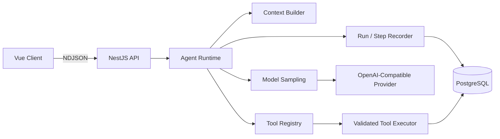

<div align="center">

# TypeScript Agent Runtime

**An observable TypeScript runtime for building streaming, tool-using AI agents.**

Explicit orchestration for model sampling, tool execution, state transitions, and durable run traces.


</div>

## Overview

TypeScript Agent Runtime is a full-stack reference implementation of an explicit, inspectable agent execution loop. It keeps model messages, user-visible messages, runtime events, and persisted execution records as separate concerns.

The current runtime can stream a direct answer or execute one validated tool call, append the resulting observation to model input, and perform a bounded second sampling to produce the final response. The Tool Registry contains two read-only Article tools, `search_articles` and `get_article_detail`, while the current Runtime only exposes and allows `search_articles` during model-driven execution.

Runtime configuration is now separated into shared product limits, typed provider model profiles, validated application defaults and hard limits, Agent history policy, and per-tool Observation budgets. The next mainline task will evolve the fixed two-sampling special case into a bounded sequential single-agent loop without introducing a general workflow framework.

## Highlights

| Capability | Implementation |
| --- | --- |
| Agent orchestration | Explicit model sampling, tool execution, and final-answer boundaries |
| Streaming | Abort-aware NDJSON responses with incremental assistant deltas |
| Tool calling | Typed definitions, registry lookup, argument validation, executor isolation, and per-run allowlisting |
| Tool safety | Risk gates, approval metadata, execution timeouts, cancellation propagation, and per-tool Observation budgets |
| Runtime configuration | Typed DeepSeek profiles, fail-fast environment validation, application output limits, and stable history policy |
| Persistence | Conversations, messages, Agent Runs, and ordered Agent Steps in PostgreSQL |
| Model integration | OpenAI-compatible Chat Completions client with normalized stream events |
| Runtime traces | Durable input, output, status, timing, and error snapshots for every step |
| User interfaces | Vue chat client and an operator console shell with trace-oriented views |

## Architecture



The operator console is currently backed by typed mock data while its read-only Run and Step query API remains an independent planned task.

## Current Runtime Lifecycle

```text
User Input
   │
   ▼
Create Agent Run ──► Load Conversation Context
   │
   ▼
Model Sampling
   ├──► Final Answer ──► Stream Response ──► Complete Run
   │
   └──► Tool Call
           │
           ▼
       Validate & Execute
           │
           ▼
       Append Observation
           │
           ▼
       Second Sampling ──► Stream Final Answer ──► Complete Run
```

Every execution is represented as one `AgentRun` containing ordered `AgentStep` records such as:

```text
receive_user_message
load_conversation_history
model_sampling
tool_execution
model_sampling
assistant_output
```

## Design Principles

- **Explicit control flow** — orchestration remains visible in TypeScript instead of being hidden behind a workflow engine.
- **Untrusted model output** — tool names and arguments are validated before backend execution.
- **Durable facts over transient deltas** — streamed events are not treated as persisted truth.
- **Separated message layers** — UI messages, model input items, and runtime events have different contracts.
- **Cooperative cancellation** — request aborts propagate through model sampling, tool execution, and persistence boundaries.
- **Bounded execution** — model and tool calls are always limited by server-owned policies.
- **Validated configuration** — provider capability, application defaults, hard limits, and environment overrides remain distinct and fail fast when invalid.
- **Evidence-driven evolution** — future Agent capabilities are planned only after the current stage produces code and test evidence.

## Repository Structure

```text
apps/
  api/        NestJS API, Agent Runtime, model adapters, and tools
  web/        Vue chat application
  admin/      Operator console and trace-oriented run views
packages/
  contracts/  Shared TypeScript contracts and runtime product limits
prisma/       PostgreSQL schema, migrations, and seed data
docs/         Architecture notes, task history, and roadmap
```

## Getting Started

### Requirements

- Node.js `^20.19.0` or `>=22.12.0`
- pnpm `10.32.1`
- PostgreSQL
- An OpenAI-compatible Chat Completions endpoint

### Setup

```bash
corepack enable
pnpm install
cp .env.example .env
```

Configure the model provider and database connection in `.env`, then initialize Prisma:

```bash
pnpm prisma:generate
pnpm prisma:migrate
```

Start all applications:

```bash
pnpm dev
```

| Application | URL |
| --- | --- |
| Web client | `http://localhost:5173` |
| Operator console | `http://localhost:5174` |
| API | `http://localhost:3000/api` |

## Configuration

| Variable | Required | Default | Description |
| --- | --- | --- | --- |
| `LLM_API_KEY` | Yes | — | API key for the configured model provider |
| `LLM_BASE_URL` | Yes | — | OpenAI-compatible API base URL, including `/v1` |
| `LLM_MODEL` | Yes | — | Supported model identifier used for chat completions |
| `LLM_CHAT_REQUEST_TIMEOUT_MS` | No | `60000` | Timeout for non-streaming provider chat requests |
| `LLM_STREAM_TIMEOUT_MS` | No | `600000` | Timeout for streaming provider requests |
| `LLM_DEFAULT_MAX_OUTPUT_TOKENS` | No | `65536` | Default application output budget |
| `LLM_APPLICATION_MAX_OUTPUT_TOKENS` | No | `131072` | Application hard limit for output tokens |
| `SEO_CHAT_HISTORY_LIMIT` | No | `40` | Number of recent `COMPLETED` messages loaded into model history |
| `DATABASE_URL` | Yes | — | PostgreSQL connection string |
| `PORT` | No | `3000` | API port |

Optional numeric environment values must be strict positive decimal integers. Invalid values or inconsistent output limits fail during application initialization rather than being silently clamped.

## Development Commands

| Command | Description |
| --- | --- |
| `pnpm dev` | Start the API, web client, and operator console |
| `pnpm dev:api` | Start the NestJS API |
| `pnpm dev:api:watch` | Start the API in watch mode |
| `pnpm dev:web` | Start the Vue chat client |
| `pnpm dev:admin` | Start the operator console |
| `pnpm typecheck` | Type-check all applications and packages |
| `pnpm lint` | Lint the workspace |
| `pnpm --filter @agent/api test:llm-config` | Test model profiles, runtime config, fail-fast assembly, and provider request limits |
| `pnpm --filter @agent/api test:model-stream` | Test model stream adaptation and sampling |
| `pnpm --filter @agent/api test:tools` | Test tool contracts, execution, and observation handling |
| `pnpm --filter @agent/api test:tool-loop` | Test the current bounded one-tool runtime behavior and history policy |
| `pnpm --filter @agent/api test:seo-service` | Build shared contracts and test SEO service plus DTO limits |
| `pnpm --filter @agent/api test:agent-recorder` | Test Run and Step persistence invariants |

## Project Status

Available now:

- Persistent conversations and messages
- Streaming responses and stop-generation handling
- Agent Run and Agent Step recording
- OpenAI-compatible stream normalization
- A bounded one-tool / two-sampling loop
- Timeout-aware and abort-aware tool execution
- Two registered read-only Article tools: `search_articles` and `get_article_detail`
- Per-run tool allowlisting that prevents globally registered but unexposed tools from executing
- Shared 64K user-message limit for API and Web
- Stable history loading of the latest 40 `COMPLETED` messages
- Typed DeepSeek model profiles and fail-fast runtime configuration
- Application output defaults and hard limits separated from provider maximums
- Per-tool Observation budgets: Search 16K, Detail 64K, global hard limit 128K
- Static operator views for Run and Step traces

Current next task:

- Bounded sequential single-agent loop
- Model-driven `search_articles -> get_article_detail -> final answer` execution
- Server-owned sampling and tool-call limits
- DeepSeek thinking-mode continuation across tool calls
- Explicit success, failure, timeout, abort, and limit terminal semantics
- Agent behavior tests for direct, one-tool, and multi-tool paths

No stage after this is pre-numbered. The next learning direction will be selected from real project evidence after the bounded Agent Loop is completed and accepted.

See the [project roadmap](./docs/roadmap.md) and [documentation index](./docs/README.md) for implementation details.