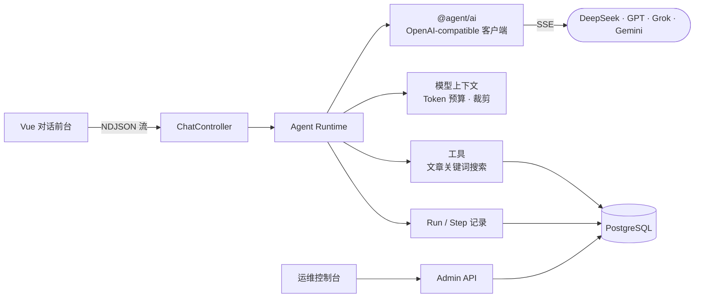

<div align="center">

# TypeScript Agent Runtime

<h3>读得懂的 Agent。</h3>

一个按生产标准写的 AI Agent 运行时，纯 TypeScript。<br/>
不用 LangChain，不用 LangGraph，不用 workflow 引擎。只有循环本身、边界情况和测试。

[English](./README.md) · **简体中文**

[](https://github.com/mufeiyu-ayu/agent/stargazers)


[为什么做](#为什么做这个项目) · [亮点](#亮点) · [主循环](#一屏看完整个循环) · [快速开始](#快速开始) · [学习路线](#拿它学-agent-工程) · [路线](#路线)

</div>

---

## 为什么做这个项目

大多数 Agent 教程停在「把模型调用放进 `while` 循环」。真实的 Agent 恰恰是从这之后开始出问题：

- 模型写了半段回答，接着**同时要调两个工具**；
- 输出撞上 Token 上限，工具参数**被截断**；
- 工具还在跑，用户**关掉了页面**；
- 请求失败、重试，结果**晚到的结果想覆盖**一个已经结束的 Run。

框架把这些决策藏在抽象后面。这个项目把每一种情况都写成显式、带测试的 TypeScript，打开文件就能看到到底发生了什么。

<div align="center">

| ~5,000 | 450+ | 80+ | 80+ |
| :---: | :---: | :---: | :---: |
| 行运行时代码 | 个测试 | 个已合并 PR | 个已关闭 Issue |

</div>

## 亮点

### 🛑 一次 Run，只有一个终态

用户中止、deadline、晚到的数据库结果都在抢终态，只有第一个生效。消息、Step 和 Run 在同一个事务里提交。提交结果不确定时如实报告，不伪装成功。

### 🧭 每一步都有记录

每次 Run 都存成一串 Step：加载历史、每次模型调用、每次工具调用、最终回答。管理台按时间线展示 Token 用量、耗时、结束原因和失败原因，还可以打开开关，看到与模型服务商往来的请求与响应的调试抓取。

### 📏 按真实 Token 预算做上下文工程

每次 Run 有独立的模型上下文。Token 用本地 DeepSeek tokenizer 估算（其他家族按它近似），超预算时从最旧的历史开始按问答对裁剪，工具输出按不可信数据处理并有单独的长度上限。

### 🔌 接 OpenAI-compatible 服务商

DeepSeek 官方 API 和 OpenAI-compatible 中转站（GPT / Grok / Gemini）用同一套配置。经 Google 官方端点直连的 Gemini 暂时不能续接 Tool Call（没有回传 thought signature）。服务商和模型在管理台里管理，API Key 用 AES-256-GCM 加密入库，各家族的协议差异收在一张 compat 表里。

### 🧪 按生产标准做，按课程标准记

正式改动从一个 Issue 开始，写清当前代码事实、不做什么和逐条验收标准，经本地 review 后以 PR 合入，并留下逐条验收记录。单一关注点的小修可以在本地 review 后直接合入 master，每一笔都记在工作记录里。整段提交历史读起来就是一本真实 Agent 问题的教材。

## 一屏看完整个循环

[`agent-runtime.service.ts`](./apps/api/src/agent-runtime/agent-runtime.service.ts) 主循环的简化版：

```ts
for (let round = 1; round <= policy.maxSamplingRounds; round++) {
  const input = planner.plan(context, budget) // 这一轮模型能看到什么
  const decision = await streamModelSampling(llm.chatStream(input))

  if (decision.type === 'final_answer')
    break

  // 工具调用超预算？在执行任何一个之前整批拒绝。
  if (toolCallCount + decision.calls.length > policy.maxToolCalls)
    throw new AgentLoopLimitExceededError()

  for (const call of decision.calls) { // 一轮多个调用，按顺序执行
    const result = await tools.invoke(call) // 校验参数、超时、限制输出长度
    context.appendToolExchange(call, result) // 作为不可信数据回喂给模型
  }
}
```

真实代码还要处理流式 delta、中止与 deadline、Step 记录，但仍然是一个能从头读到尾的文件。

## 架构



| 模块 | 做什么 |
| --- | --- |
| `apps/api` | NestJS API：Agent Runtime、工具、模型接入配置 |
| `apps/web` | Vue 3 对话前台，流式 Markdown 渲染 |
| `apps/admin` | 运维控制台：概览、会话记录、Run Trace、模型接入 |
| `packages/ai` | 不依赖框架的模型客户端：流适配、重试、错误（零 Nest、零 Prisma） |
| `packages/contracts` | 前后端共享的类型 |

## 快速开始

需要 Node.js `^24.11.0`（LTS）、pnpm `10.32.1`、Docker 和任意一家 OpenAI-compatible 模型服务商的 API Key。

```bash
corepack enable && pnpm install
cp .env.example .env              # 填 AGENT_SECRET_KEY（openssl rand -hex 32）
docker compose up -d postgres     # PostgreSQL（镜像自带 pgvector，早期迁移要建这个扩展）
pnpm prisma:generate && pnpm prisma:migrate
pnpm dev
```

然后打开管理台 `http://localhost:5174`，在「模型接入」页添加服务商和模型，并勾选「前台可见」，就可以在 `http://localhost:5173` 对话了。

<details>
<summary>灌入 Demo 文章（供 search_articles 工具查询）</summary>

```bash
node --env-file=.env --import tsx apps/api/scripts/seed.ts     # 灌入 68 篇 Demo 文章（幂等）
```

不灌也能正常聊天，只是 `search_articles` 查不到文章。自己装 PostgreSQL 必须带 pgvector 扩展，早期迁移要建它。全部配置见 [`.env.example`](./.env.example)。

</details>

## 拿它学 Agent 工程

跟着一次请求，从 HTTP 入口一路走到数据库，按这个顺序读：

| # | 读什么 | 看懂什么 |
| --- | --- | --- |
| 1 | [`chat.controller.ts`](./apps/api/src/chat/chat.controller.ts) | 用户关掉页面怎样变成 Abort 信号 |
| 2 | [`agent-runtime.service.ts`](./apps/api/src/agent-runtime/agent-runtime.service.ts) | 主循环：采样、分派、执行工具、续轮、收尾 |
| 3 | [`sampling-context-planner.ts`](./apps/api/src/agent-runtime/context/sampling-context-planner.ts) | 模型每轮看到什么，超预算时先删谁 |
| 4 | [`openai-completions-stream.ts`](./packages/ai/src/api/openai-completions-stream.ts) | 服务商的流怎样变成干净的事件 |
| 5 | [`agent-run-recorder.service.ts`](./apps/api/src/agent-runtime/lifecycle/agent-run-recorder.service.ts) | 终态所有权与原子提交 |

读代码前先猜答案，每个答案都有对应的测试：

1. 模型先写一段话，再在同一轮调用两个工具，会发生什么？
2. 输出在工具参数写到一半时撞上 Token 上限，工具还会执行吗？
3. 工具执行中用户关掉了页面，终态由谁写入？
4. 响应开始之前的 429，和流进行到一半时连接断开，处理有什么不同？

## 什么时候该用框架

想快速交付、也接受框架的抽象，就用 LangChain、LangGraph 或 Vercel AI SDK。想**看懂并掌控**这个循环，想知道 Agent 在真实故障下怎么表现，或者想找一个自研运行时的参照，就用这个项目。它是一个能跑的完整系统，不是一个装上就用的库。

## 路线

已完成：流式对话、有界 Agent Loop、同轮多工具调用、上下文工程、多模型接入、运维控制台。

接下来的每一项都由真实使用触发：

- **真实负载**：先用真实对话验证循环，再在一个内部数据工作台里日常使用，工具在容器沙箱里运行
- **持久运行**：关掉页面后继续跑，进程重启后能接上
- **审批**：有副作用的工具先问再执行
- 更后面：从落库记录**回放**、长对话**压缩**与**定时任务**

## 项目文档

- [阶段归档](./docs/tasks/completed/)：每个阶段的目标、取舍与踩过的坑
- [已关闭的 Issue](https://github.com/mufeiyu-ayu/agent/issues?q=is%3Aissue+is%3Aclosed)：带验收标准的真实工程规格
- [Pi 参考知识库](./docs/research/pi-reference/README.md)：对照开源 Agent [Pi](https://github.com/earendil-works/pi) 的架构研究
- [任务看板](./docs/tasks/README.md) 与 [路线](./docs/roadmap.md)

## 支持

如果这个项目帮你弄懂了 Agent 到底怎么跑，**点一个 Star 是最直接的支持** ⭐

问题和 bug 欢迎提到 [Issue](https://github.com/mufeiyu-ayu/agent/issues)。管理台的视觉设计参考了 vue-vben-admin（见 [`apps/admin/THIRD_PARTY_NOTICES.md`](./apps/admin/THIRD_PARTY_NOTICES.md)）。

[](https://star-history.com/#mufeiyu-ayu/agent&Date)
