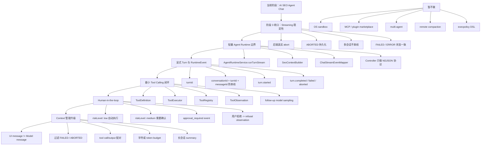
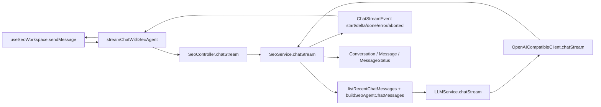
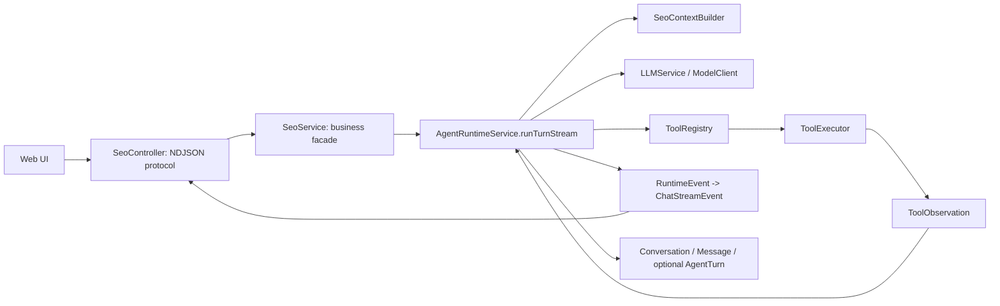

# AI SEO Agent 迁移路线思维导图

```mermaid
flowchart TD
  A["当前阶段：AI SEO Agent Chat"] --> B["阶段 3 收口：Streaming 稳定性"]
  B --> C["轻量 Agent Runtime 边界"]
  C --> D["显式 Turn 与 RuntimeEvent"]
  D --> E["最小 Tool Calling 闭环"]
  E --> F["Human-in-the-loop"]
  F --> G["Context 管理升级"]

  B --> B1["后端真实 abort"]
  B --> B2["ABORTED 持久化"]
  B --> B3["多会话不串线"]
  B --> B4["FAILED / ERROR 状态一致"]

  C --> C1["AgentRuntimeService.runTurnStream"]
  C --> C2["SeoContextBuilder"]
  C --> C3["ChatStreamEventMapper"]
  C --> C4["Controller 只做 NDJSON 协议"]

  D --> D1["turnId"]
  D --> D2["conversationId + turnId + messageId 防串线"]
  D --> D3["turn.started"]
  D --> D4["turn.completed / failed / aborted"]

  E --> E1["ToolDefinition"]
  E --> E2["ToolExecutor"]
  E --> E3["ToolRegistry"]
  E --> E4["ToolObservation"]
  E --> E5["follow-up model sampling"]

  F --> F1["riskLevel: low 自动执行"]
  F --> F2["riskLevel: medium 需要确认"]
  F --> F3["approval_required event"]
  F --> F4["用户拒绝 -> refusal observation"]

  G --> G1["UI message != Model message"]
  G --> G2["过滤 FAILED / ABORTED"]
  G --> G3["tool call/output 配对"]
  G --> G4["字符或 token budget"]
  G --> G5["长会话 summary"]

  H["暂不做"] --> H1["OS sandbox"]
  H --> H2["MCP / plugin marketplace"]
  H --> H3["multi-agent"]
  H --> H4["remote compaction"]
  H --> H5["execpolicy DSL"]
```

## 当前代码映射

```mermaid
flowchart LR
  UI["useSeoWorkspace.sendMessage"] --> Client["streamChatWithSeoAgent"]
  Client --> Controller["SeoController.chatStream"]
  Controller --> Service["SeoService.chatStream"]
  Service --> Context["listRecentChatMessages + buildSeoAgentChatMessages"]
  Context --> LLM["LLMService.chatStream"]
  LLM --> Provider["OpenAICompatibleClient.chatStream"]
  Provider --> Service
  Service --> Events["ChatStreamEvent start/delta/done/error/aborted"]
  Events --> Client
  Client --> UI
  Service --> DB["Conversation / Message / MessageStatus"]
```

## 迁移后的建议形态

```mermaid
flowchart LR
  UI["Web UI"] --> API["SeoController: NDJSON protocol"]
  API --> Seo["SeoService: business facade"]
  Seo --> Runtime["AgentRuntimeService.runTurnStream"]
  Runtime --> Context["SeoContextBuilder"]
  Runtime --> Model["LLMService / ModelClient"]
  Runtime --> Tools["ToolRegistry"]
  Tools --> Executor["ToolExecutor"]
  Executor --> Observation["ToolObservation"]
  Observation --> Runtime
  Runtime --> Mapper["RuntimeEvent -> ChatStreamEvent"]
  Mapper --> API
  Runtime --> Store["Conversation / Message / optional AgentTurn"]
```

核心迁移原则：

- 不改变用户体验，先改变内部边界。
- 不引入新协议，继续用 NDJSON。
- 不保存所有 delta，保存最终事实。
- 不一开始做 MCP，先做内置工具闭环。
- 不一开始做 OS sandbox，先做 human-in-the-loop。
