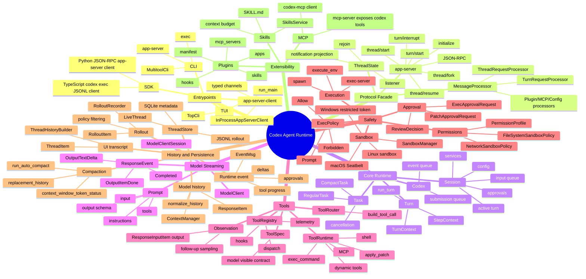

# Codex Runtime 架构思维导图

## 阅读提示

这张图的重点不是模块数量，而是几个关键分界：

- Entrypoints 只负责输入和展示，不跑 Agent loop。
- app-server 是协议门面，不是第二套 runtime。
- core runtime 通过 queue/event 处理异步 turn。
- tool spec、router、registry、runtime 是四层，不应该混成一个函数。
- UI transcript、model history、runtime event、rollout 是四种不同数据。
- permission approval 与 sandbox 解决的是不同风险。
