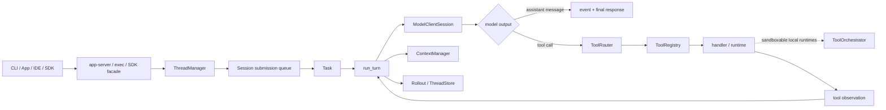

# Codex Agent 架构研究

本目录研究的是 Codex 作为一个成熟 Agent 系统的架构思想，而不是 Rust 语法，也不是桌面 UI 的仿制教程。

## 一句话结论

Codex 的价值不在于“会调用很多工具”，而在于它把一次 Agent 工作拆成了可组合、可中断、可恢复、可观察、受约束的运行系统：

```text
Client / SDK / CLI
  -> stable protocol facade
  -> Thread lifecycle
  -> Turn + Task runtime
  -> model sampling
  -> tool routing and execution
  -> observation back to model history
  -> follow-up sampling
  -> event stream + durable facts
```

当前 AI SEO Agent 应学习这些边界，但要将“本地客户端 Agent”翻译成“服务端云 Agent”：

- `app-server JSON-RPC` 的思想，翻译为稳定的 Nest API / stream contract。
- 本地 `Thread` 的思想，翻译为带所有权和租户边界的 `Conversation`。
- `Turn / Task / Item / Event` 的分层思想，按职责映射到 `AgentRun / runner / model items / AgentStep / RuntimeEvent`，而不是一一改名。
- shell sandbox 的思想，先翻译为业务工具权限、参数校验、超时和审计。
- rollout 的思想，翻译为 PostgreSQL 中可恢复的关键事实和事件投影。
- 多入口共享 runtime 的思想，翻译为 Web、定时任务、Webhook 都复用同一个 Agent application service。

## 架构总览



## 研究文档

| 文档 | 重点 |
| --- | --- |
| [research-method.md](./research-method.md) | 证据范围、可靠性等级和维护方法 |
| [research-progress.md](./research-progress.md) | 13 个架构域的批次覆盖状态和额度检查 |
| [architecture-report.md](./architecture-report.md) | 宏观架构、核心主链、设计动机和迁移结论 |
| [architecture-learning-checklist.md](./architecture-learning-checklist.md) | 完整学习清单，可用于逐项打勾 |
| [source-reading-map.md](./source-reading-map.md) | 真实源码入口和推荐阅读顺序 |
| [feedback-and-diagnostics.md](./feedback-and-diagnostics.md) | Feedback consent、诊断 enrich、artifact 上传与隐私边界 |
| [assistant-directives.md](./assistant-directives.md) | Assistant magic directives、产品投影与 Git metadata 观察边界 |
| [workspace-command-and-git-status.md](./workspace-command-and-git-status.md) | Workspace command port、Git/PR probe、缓存与远端一致性 |
| [doctor-diagnostics.md](./doctor-diagnostics.md) | Doctor report模型、并发check、fallback、redaction与support artifact |
| [rollout-state-reconciliation.md](./rollout-state-reconciliation.md) | Rollout/State DB双索引、read-only audit与partial scan语义 |
| [config-diagnostics.md](./config-diagnostics.md) | Layer provenance、typed config path、TOML span与安全渲染 |
| [review-mode.md](./review-mode.md) | Review target、inline/detached、隔离 evaluator、结果可信度与 durable receipt |
| [thread-fork-rollback-and-replay.md](./thread-fork-rollback-and-replay.md) | Append-only rollback、历史重放、terminal-ID fork 与 world-state 边界 |
| [thread-history-pagination.md](./thread-history-pagination.md) | Turns/Items 分页、双向 cursor、live/durable merge 与 projection completeness |
| [thread-archive-delete-lifecycle.md](./thread-archive-delete-lifecycle.md) | Thread archive/delete subtree、跨存储partial commit与删除回执 |
| [thread-history-injection.md](./thread-history-injection.md) | Raw history injection、角色信任、active task竞态、幂等与提交回执 |
| [turn-input-admission-and-cancellation.md](./turn-input-admission-and-cancellation.md) | Turn start/steer/interrupt admission、身份归属、pending queue与取消竞态 |
| [thread-metadata-projection.md](./thread-metadata-projection.md) | Name/title/preview/Git/recency多源投影、repair与dual-write边界 |
| [server-request-routing.md](./server-request-routing.md) | 反向JSON-RPC、responder authority、pending replay、resolved tombstone与Turn清理 |
| [tool-call-execution-pipeline.md](./tool-call-execution-pipeline.md) | Tool Call识别、Step快照、并发/顺序Observation、hook、取消与唯一终态 |
| [tool-argument-streaming.md](./tool-argument-streaming.md) | Custom tool参数增量解析、provisional preview、节流、最终校验与恢复边界 |
| [tool-output-contract.md](./tool-output-contract.md) | Tool结果的模型/telemetry/hook/Code Mode四视图、截断与provenance |
| [model-transport-attempts.md](./model-transport-attempts.md) | ModelClient/Turn/推理/传输attempt分层、增量WebSocket、partial stream重试与HTTP降级 |
| [rollout-write-durability.md](./rollout-write-durability.md) | LiveThread到JSONL/SQLite投影的queue、flush、torn write、recovery与durability边界 |
| [request-permissions-lifecycle.md](./request-permissions-lifecycle.md) | Typed capability请求、Core求交、Turn/Session grant、环境隔离与后续sandbox消费 |
| [current-project-gap-analysis.md](./current-project-gap-analysis.md) | 当前项目不是“缺什么功能”，而是缺哪些运行系统能力 |
| [cloud-agent-mapping.md](./cloud-agent-mapping.md) | 客户端概念到云端 NestJS 架构的转换规则 |
| [terminology-map.md](./terminology-map.md) | Thread、Turn、Item、Run、Step 等概念对照 |
| [research-closeout.md](./research-closeout.md) | 快照、覆盖范围、图表、校验和剩余问题（收尾时生成） |

## 当前研究快照

本知识库以 `main@ab6a7eb87cc8a816c88b86c44cf291e251ed2136` 为事实基线。完整 commit 元数据、周额度协议和证据分级见 [研究方法](./research-method.md)，本轮完成度见 [研究进度](./research-progress.md)。旧快照 `626147f72` 只作为历史比较点，不再支撑“当前实现”结论。

## 最值得优先学习的十项能力

1. 稳定协议与内部事件分离。
2. Thread、Turn、Task、Item 的生命周期分层。
3. 模型输出驱动的 Tool Loop，而不是业务代码硬编码流程。
4. Tool spec、router、registry、runtime、policy 分层。
5. UI transcript、model history、runtime event、durable log 分离。
6. 中断、失败、重试、续跑和幂等的明确语义。
7. 只持久化可恢复事实，不把每个文本 delta 都当数据库事实。
8. Approval、permission、sandbox 三个概念分开。
9. 核心 runtime 被多个入口复用，而不是每个入口复制一套 Agent loop。
10. 测试围绕协议、状态机和失败边界，而不仅是 happy path。

## 明确不照搬的内容

- Rust 实现语言和 crate 拆分粒度。
- TUI 渲染细节和终端进程管理。
- 操作系统级 shell sandbox 的具体实现。
- Codex 专属的代码编辑、Git diff 和本地文件工具。
- 当前阶段直接引入 MCP、插件市场或 Multi-agent。
- 把 Codex 的 `Item` 类型一比一复制进当前数据库。

学习目标是掌握设计约束，再用 TypeScript、NestJS、PostgreSQL 和 Vue 做出适合云端业务 Agent 的版本。
