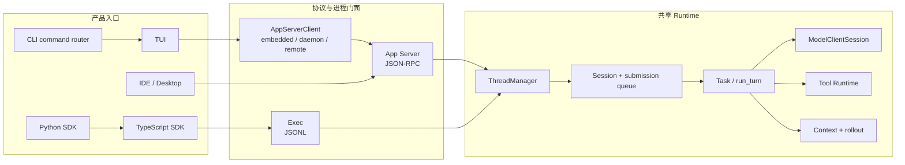
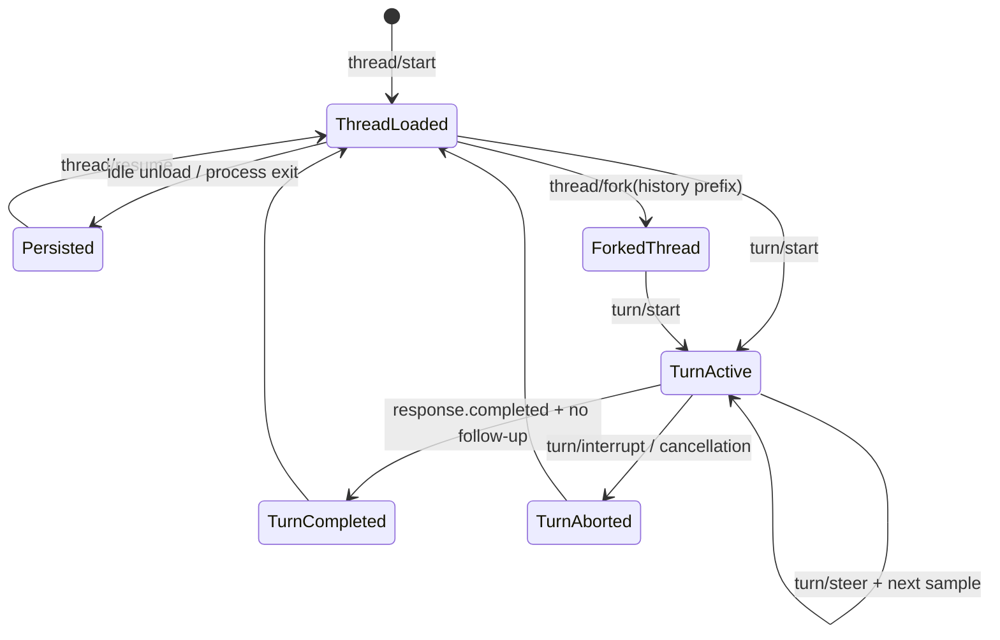
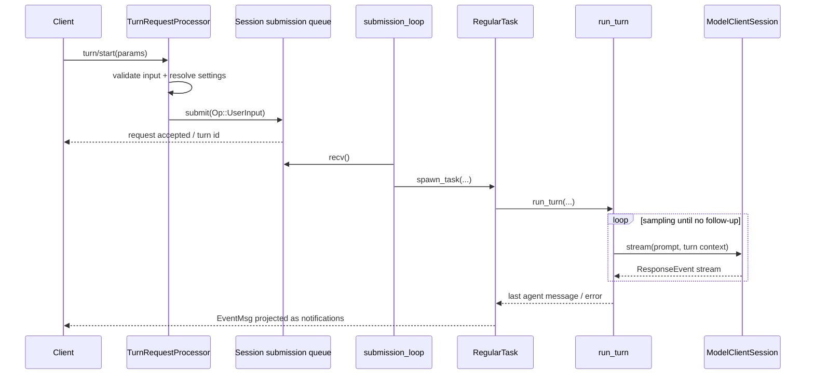
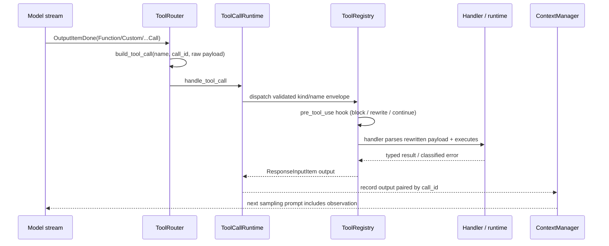
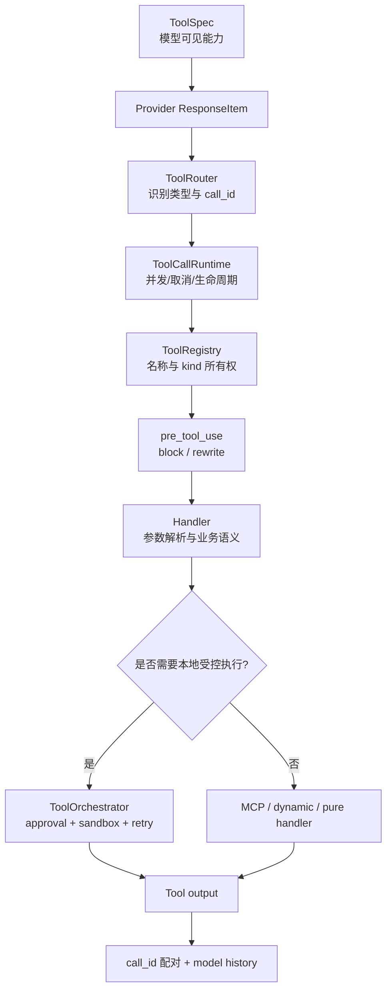
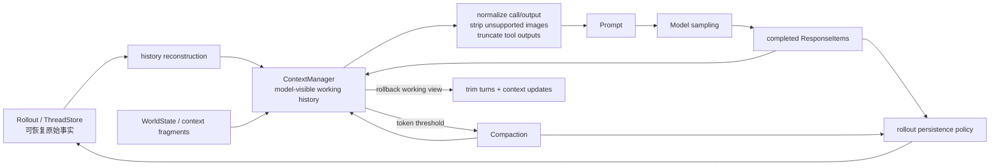
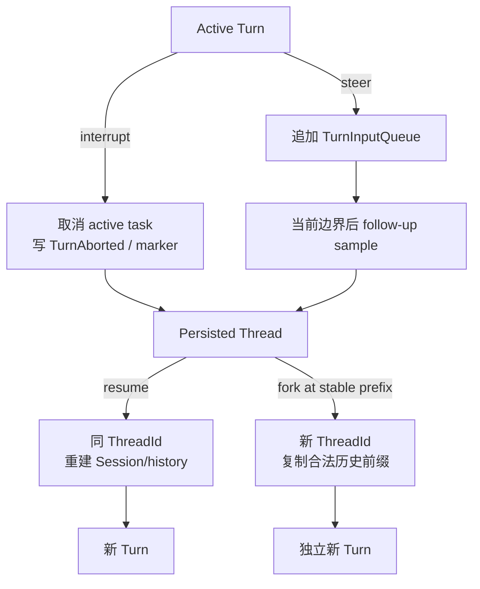
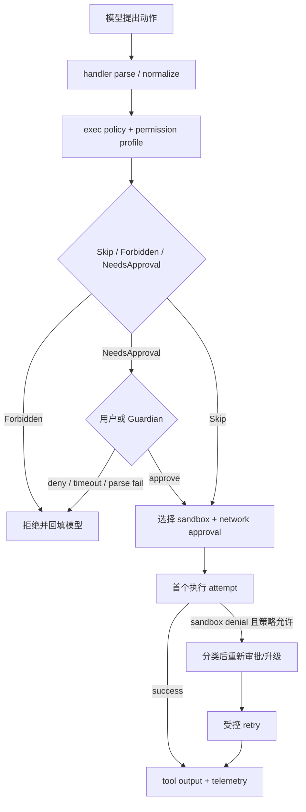
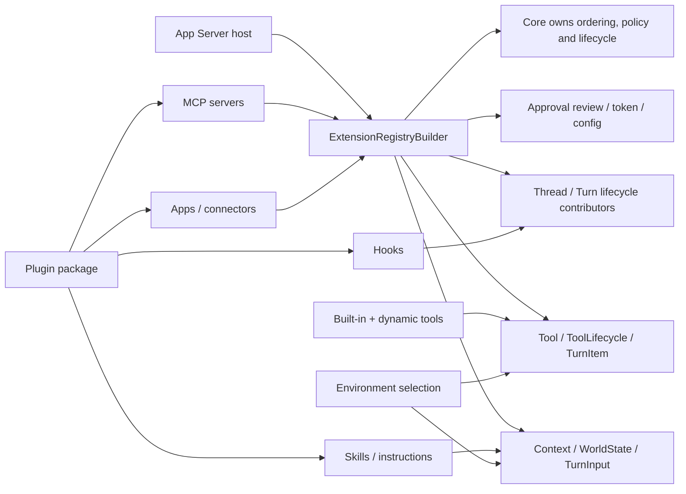
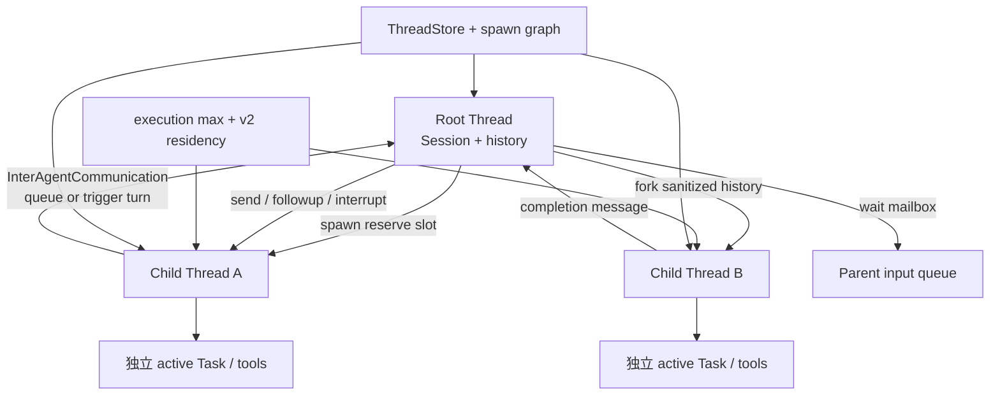

# Codex Agent 架构详细报告

## 1. 报告目的

本报告回答的不是“Codex 有哪些文件”，而是：

- 一个成熟 Agent Runtime 需要哪些稳定边界？
- Codex 为什么把一次模型调用扩展成 Thread / Turn / Task / Item / Event？
- 当前 AI SEO Agent 已经走到哪里？
- 哪些设计应迁移到云端 NestJS 项目，哪些不应照搬？

研究基于本地 Codex fork `ab6a7eb87cc8a816c88b86c44cf291e251ed2136` 与当前项目研究起点 `5f2ad11f2c65425e84392e81048364d55ec626ef`。每个领域按“源码事实—架构解释—迁移建议”组织；完整取证规则见 [research-method.md](./research-method.md)。

## 2. 执行摘要

Codex 可以被理解为一个事件驱动、工具增强、可持续运行的 Agent Runtime。它把多个产品入口收敛到共同核心，并围绕以下不变量组织系统：

1. 用户看到的 Thread 与一次执行的 Turn 分开。
2. 协议对象与内部运行对象分开。
3. 模型只提出工具调用；系统拥有执行权。
4. 工具调用结果必须回到 model history，才能形成 Agent loop。
5. model history、UI transcript、runtime event、durable log 不是同一种数据。
6. 中断、失败、审批、权限和 sandbox 都有独立语义。
7. 持久化服务于恢复和审计，不服务于复制每个流式 delta。
8. 核心 runtime 被 CLI、App、IDE、SDK 等多个入口复用。
9. 状态机和协议靠大量聚焦测试保护。

当前 AI SEO Agent 已经具备第 1、2、5、6、7 项的一部分基础，但仍然是“单次文本采样 Runtime”，还没有真正进入“模型—工具—Observation—再次采样”的 Agent loop。

## 3. Codex 的宏观分层

**源码事实**：`codex` CLI 分派交互 TUI、`exec` 与 `app-server`；当前 TUI 通过 `AppServerClient` 连接 embedded、local daemon 或 remote app-server。app-server 再持有 `ThreadManager`，把版本化请求映射到 core。TypeScript SDK 启动 Codex executable 的 `exec` JSONL 门面；Python SDK 启动 pinned Codex binary 的 `app-server` stdio JSON-RPC 门面。两者都没有复制 Rust Agent loop。



**架构解释**：复用的是生命周期、状态机和副作用所有权，不要求所有产品都使用同一种传输。TUI 改为 app-server client 进一步证明 UI 不是 canonical runtime。

**迁移建议**：NestJS 项目应让 Web、同步 API、定时任务和 Webhook 共用一个 application runtime；无需复制 JSON-RPC、Rust crate 粒度或本地进程拓扑。

| 层 | Codex 职责 | 当前项目对应 | 迁移判断 |
| --- | --- | --- | --- |
| 产品入口 | CLI、TUI、App、IDE、SDK | Vue Web、未来定时任务/Webhook | 多入口共享 runtime 的思想值得学 |
| 协议门面 | app-server JSON-RPC、exec JSONL、SDK types | Nest Controller、contracts、NDJSON | 不复制 JSON-RPC，学习稳定 contract |
| 生命周期 | ThreadManager、Thread、Turn、Task | Conversation、AgentRun、AgentStep | 已有基础，需补状态不变量 |
| Agent loop | `run_turn`、sampling、follow-up | `AgentRuntimeService` | 当前只采样一次，Tool loop 是最近缺口 |
| 模型适配 | ModelClientSession、ResponseEvent | LLMService、OpenAICompatibleClient | 需从文本 delta 升级为结构化 provider event |
| 工具体系 | spec、router、registry、runtime、orchestrator | 尚未实现 | 当前最高优先级 |
| 上下文 | ContextManager、token budget、compaction | SeoContextBuilder + 固定 12 条 history | 需从拼数组升级为上下文策略 |
| 持久化 | rollout、ThreadStore、state db | PostgreSQL Message/Run/Step | 需补恢复、幂等和查询投影 |
| 安全 | approval、permissions、sandbox、execpolicy | 尚无通用策略 | 先做业务权限和审批，不做 OS sandbox |
| 扩展 | skills、plugins、MCP、hooks | 尚无 | 内置工具稳定后再学习 |
| 协作 | child threads、agent control、mailbox | 尚无 | 单 Agent 稳定后再进入 |
| 质量 | telemetry、protocol tests、state tests、snapshots | typecheck/lint，无测试文件 | 测试是明显短板，应提前补齐 |

## 4. 核心主链路

### 4.1 客户端连接与协议初始化

Codex app-server 先完成连接级 `initialize`，再接受 thread / turn 请求。协议层负责：

- 请求、响应与通知的结构。
- client capability 协商。
- 稳定方法名和版本化类型。
- 把内部事件映射成客户端可理解的 item / delta / completion。

这说明协议门面不能直接等同于 runtime。当前项目已经用 `seo-chat-stream-event.mapper.ts` 将 `AgentRuntimeEvent` 映射为 `ChatStreamEvent`，方向正确；后续加入工具事件时，也应先扩内部事件，再谨慎决定是否暴露给前端。

关键源码与测试：

- `codex-rs/cli/src/main.rs`：`main` 对 TUI、Exec、AppServer 的命令分派。
- `codex-rs/tui/src/lib.rs`：`AppServerTarget`、`start_app_server`，选择 embedded / local daemon / remote。
- `codex-rs/app-server-protocol/src/protocol/common.rs`
- `codex-rs/app-server/src/message_processor.rs`
- `codex-rs/app-server/src/request_processors/initialize_processor.rs`
- `codex-rs/app-server/src/bespoke_event_handling.rs`
- `codex-rs/app-server/tests/suite/v2/initialize.rs`
- `codex-rs/cli/src/main.rs` 内 app-server transport/auth 参数测试。

### 4.2 Thread 生命周期

Thread 是长期工作线，负责承载多次 Turn 和可恢复历史。`ThreadManager` 负责创建、恢复、fork、加载和管理活跃线程；`Codex::spawn` 创建真正的 Session 运行态。

```text
thread/start
  -> ThreadRequestProcessor
  -> ThreadManager.start_thread_with_options
  -> spawn_thread_with_source
  -> Codex::spawn
  -> Session + submission/event channels + persistence
```



图中的 Thread 是长期身份；Turn 是一次活动边界；Response Item 是历史内容；`EventMsg` 与 app-server notification 是状态变化的投影。设计不变量是：一个 Session 同时最多一个 active Task，`TurnCompleted` 与 `TurnAborted` 不应同时成为同一 Turn 的最终事实。

设计价值：

- Thread 身份与进程内 Session 实例分离。
- 一个持久化 Thread 可以被 unload，再 resume。
- fork 明确表达“复制历史后形成新工作线”，而不是修改原历史。
- archive/delete/read/list 属于 Thread 资源管理，不混进 Turn 执行。

当前快照还把 **Goal** 建模为 Thread 级长期目标，而不是 Turn 或隐藏 prompt。`thread/goal/set|get|clear` 经 `ThreadGoalRequestProcessor` 调用 `GoalService`；Goal 保存 objective、status、token budget、tokens/time usage，并具有 Active、Paused、Blocked、UsageLimited、BudgetLimited、Complete 状态。`GoalExtension` 通过 thread/turn/tool/token contributors 计量进度、注入 continuation，并把 `ThreadGoalUpdated` 写为 durable event。Goal resume 后从 state 重新挂接 runtime，和某一次 active Turn 的内存状态分离。

**架构解释**：Thread 是身份与历史容器，Goal 是可替换的长期意图/预算状态，Turn 是一次执行。Goal 不能被当作模型 chain-of-thought；Goal 状态变化必须由 API/tool/lifecycle policy 决定并可恢复。

当前项目 `Conversation` 已经是最小 Thread，但还缺：所有权、归档、恢复语义、并发控制和运行中的 Thread 状态投影。

关键源码与测试：

- `codex-rs/core/src/thread_manager.rs`：`ThreadManager::start_thread_with_options`、`resume_thread_with_history`、`fork_thread_from_history`、`spawn_subagent`。
- `codex-rs/app-server/src/request_processors/thread_processor.rs`
- `codex-rs/thread-store/src/store.rs`：`ThreadStore`。
- `codex-rs/app-server/tests/suite/v2/thread_start.rs`：正常创建及配置/环境失败。
- `codex-rs/app-server/tests/suite/v2/thread_resume.rs`、`thread_fork.rs`：恢复、历史前缀、未物化/ephemeral 边界。
- `codex-rs/core/src/thread_manager_tests.rs`：active/stopped resume 与 interrupted fork snapshot。
- `codex-rs/app-server/src/request_processors/thread_goal_processor.rs`：Goal 协议门面与 snapshot notification。
- `codex-rs/ext/goal/src/api.rs`、`extension.rs`、`runtime.rs`、`tool.rs`：Goal state、计量与 typed extension。
- `codex-rs/ext/goal/tests/goal_extension_backend.rs`：create/update、并行 tool 计量、error/usage limit、resume/clear。
- `codex-rs/app-server/tests/suite/v2/thread_resume.rs`：paused/budget-limited Goal 的 resume 与持久化边界。

### 4.3 Turn 进入 submission queue

`turn/start` 不直接调用模型。`TurnRequestProcessor::turn_start` / `turn_start_inner` 先校验、映射输入，并允许 `TurnStartParams.model` 等 thread settings 覆盖，再把 `Op::UserInput` 提交给 Session queue。

```text
turn/start params
  -> validate and map input
  -> Op::UserInput
  -> submit
  -> submission_loop
  -> user_input_or_turn
  -> RegularTask
```



设计不变量是：协议请求只负责提交操作，active Task 的启动、中断和终态由 Session 串行所有者决定；模型 transport 不能直接决定产品层 Turn 状态。

为什么需要 queue：

- 中断、steer、approval response、tool response 都是运行期间可能到来的操作。
- runtime 需要单一顺序点维护 active turn 状态。
- 客户端请求生命周期不应直接等于模型请求生命周期。
- 后续可做背压、调度、公平性和并发限制。

当前项目的 HTTP 请求仍直接持有整个 async generator 生命周期。学习 queue 的重点不是立刻上消息队列，而是先建立“请求进入”和“运行执行”之间的可替换边界。

关键源码与测试：

- `codex-rs/app-server/src/request_processors/turn_processor.rs`：`TurnRequestProcessor::turn_start_inner` 构造并提交 `Op::UserInput`。
- `codex-rs/core/src/session/handlers.rs`：`submission_loop` 是 `Op` 的顺序消费点。
- `codex-rs/core/src/tasks/regular.rs`：`RegularTask::run`。
- `codex-rs/core/src/session/turn.rs`：`run_turn`、`try_run_sampling_request`。
- `codex-rs/app-server/tests/suite/v2/turn_start.rs`、`turn_steer.rs`、`turn_interrupt.rs`。
- `codex-rs/core/tests/suite/abort_tasks.rs`：长工具中断、历史记录与 `<turn_aborted>` 恢复标记。

### 4.4 Task 与 Turn 的分工

Codex 用 `RegularTask` 承接普通 Turn。Task 负责：

- 发送 TurnStarted。
- 准备或复用模型 session。
- 调用 `run_turn`。
- 处理运行中追加的输入。
- 返回最后的 agent message。

`run_turn` 则负责一次 Turn 内的循环、上下文、采样、工具续跑、压缩和完成条件。

Turn 内部还有两层快照：`TurnContext` 固定本 Turn 的 model、provider、approval/permission、cwd 等运行配置；`StepContext` 在每次 sampling 前捕获当时可用的 environments、selected capability roots、MCP runtime/tool list 和 `AGENTS.md`。同一 Turn 的后续 sampling 可以看见新就绪能力，但一次 sampling 广告的工具与实际执行使用同一个 Step snapshot。

**架构解释**：Step 不是数据库 `AgentStep` 的同义词。Codex StepContext 是 request-scoped capability snapshot，用来防止“模型看到的工具”和“执行时的工具”在同一次采样中漂移。

这种分层避免一个巨型 service 同时处理请求接入、调度、上下文、模型协议、工具执行和持久化。当前 `AgentRuntimeService.runTurnStream()` 已经开始承担 Task + Turn 两层职责，后续功能增多时应拆出明确的 `AgentTurnRunner` 或等价内部边界，但不要在 Tool Calling 第一小步就过早抽象。

关键源码：

- `codex-rs/core/src/tasks/regular.rs`：`RegularTask` / `SessionTask::run`。
- `codex-rs/core/src/session/turn.rs`：`run_turn`。
- `codex-rs/core/src/session/turn_context.rs`：`TurnContext`。
- `codex-rs/core/src/session/step_context.rs`：`StepContext` 与固定 MCP tool snapshot。
- `codex-rs/app-server/tests/suite/v2/selected_capability_stack.rs`：能力在两次 sampling 间变为可用，但 step 内保持一致。

### 4.5 Model Sampling 与 Agent loop

成熟 Agent 与普通 Chat 的关键差别在于：模型输出工具调用时，Turn 不结束。

```text
build prompt
  -> ModelClientSession::stream
  -> ResponseEvent stream
  -> assistant message ? complete candidate
  -> tool call ? dispatch tool
  -> record tool output into history
  -> needs_follow_up = true
  -> next sampling request
```

`run_turn` 的外层循环根据 `needs_follow_up` 决定是否继续采样。工具调用、服务端 `end_turn=false`、运行中追加输入，都可能要求继续。

当前项目的 `LLMService.chatStream()` 只 yield 文本字符串，导致 runtime 看不到 tool call、finish reason 或 usage。阶段 5 必须先升级 LLM 边界，让上层接收结构化事件，再实现 Tool loop。

该内部 contract 应只有一个故障所有者：`ModelStreamEvent` 只表达正常 text/tool/usage/completed 值；provider/network/abort 从 async iterator throw，runtime 再分类为唯一终态。OpenAI-compatible Chat Completions 还应显式请求 `include_usage`，容纳 finish reason 后到达的 `choices=[]` usage-only chunk，并在 usage 后合成唯一 completed。

当前快照还明确了一个容易遗漏的边界：`ModelClientSession` 是 **turn-scoped**，在同一 Turn 的多次采样间复用 WebSocket、sticky routing 与连接状态，但不能跨 Turn 复用，否则会把 `previous_response_id` 等 transport 状态泄漏给下一 Turn。

关键源码与测试：

- `codex-rs/core/src/client.rs`：`ModelClient`、`ModelClientSession`、`new_session`、SSE/WebSocket stream 与 retry。
- `codex-rs/codex-api/src/common.rs`：`ResponseEvent`。
- `codex-rs/core/src/session/turn.rs`：`run_turn`、`try_run_sampling_request`、`SamplingRequestResult`。
- `codex-rs/core/src/stream_events_utils.rs`：完成 item 到 runtime/UI item 的映射。
- `codex-rs/core/src/client_tests.rs`：认证刷新、WebSocket handshake、metadata 与失败路径。
- `codex-rs/core/tests/suite/pending_input.rs`：steer/mailbox 触发 follow-up 的边界测试。

### 4.6 Tool Call 处理

**源码事实**：完成的 provider item 先被识别为路由信封，再由 turn-scoped `ToolCallRuntime` 查询 registry。handler 在真正执行时解析/验证自己的 payload；结果统一转换成与 `call_id` 配对的 `ResponseInputItem`，写入历史并令 `needs_follow_up = true`。



**架构解释**：Tool call 不是 RPC 直通。模型只能提出带 raw arguments 的候选动作；registry/handler/policy 保留解释、验证和执行权。hook 改写发生在 registry dispatch 中，但改写后仍回到具体 handler 的 payload 解析与 ToolOrchestrator/policy，不获得绕过安全层的捷径。

模型输出先由 `ToolRouter::build_tool_call` 转换为内部 `ToolCall { tool_name, call_id, payload }`，再通过 registry 找到确定性 runtime。这里的 `ToolCall` 是路由信封：普通 function payload 仍含 raw JSON arguments，并不自动等于“已按具体工具 schema 验证”。Tool 结果作为 `ResponseInputItem` 写回 conversation history，触发下一次采样。

重要边界：

1. **ToolSpec**：模型可见契约。
2. **ToolRouter**：识别 provider output 并生成未验证的路由调用信封。
3. **ToolRegistry**：工具名到 runtime 的确定性映射，拒绝重复注册。
4. **Tool handler/runtime**：参数解析、业务执行、结果序列化。
5. **ToolOrchestrator**：为 shell、apply_patch、unified exec 等需要 sandbox/approval 的本地 runtime 编排审批、sandbox、特定 retry/elevation 和 telemetry；它不是所有 registry handler 的全局必经层。
6. **Observation**：回填给模型的结构化结果。

Tool search 也是同一闭环的特殊工具：client-executed `ResponseItem::ToolSearchCall` 被 router 解析为 `ToolPayload::ToolSearch`，`ToolSearchHandler` 在当前 step 的可加载 catalog 上检索并返回 `ToolSearchOutput` / loadable specs，下一轮模型才获得新增工具。它解决“大 catalog 不应全部塞进 prompt”，不改变 registry 和 policy 的最终执行权。

参数流式增量只用于可选预览。`try_run_sampling_request` 在 `OutputItemAdded` 时向 runtime 申请 `ToolArgumentDiffConsumer`；例如 apply-patch consumer 将 partial input 解析成 `PatchApplyUpdated`。真正 dispatch 仍等待 `OutputItemDone` 和完整 payload，partial arguments 不能触发副作用。



设计不变量是：spec 暴露、名称路由、参数验证、副作用授权、执行与 observation 配对属于不同责任；`ToolOrchestrator` 只覆盖实现 `ToolRuntime` 的本地受控执行，不是所有工具的万能中间件。

当前阶段 5 文档已经提出 `ToolDefinition / ToolRegistry / ToolExecutor`，方向正确。还应显式补上 `UnvalidatedToolCallEnvelope -> ValidatedToolInvocation`、`ToolResult/Observation` 和 provider event adapter，否则 registry 只是一个孤立容器，raw arguments 也可能绕过验证。

关键源码与测试：

- `codex-rs/tools/src/tool_spec.rs`：`ToolSpec`。
- `codex-rs/core/src/tools/router.rs`：`ToolCall`、`ToolRouter::build_tool_call` 与 dispatch。
- `codex-rs/core/src/tools/parallel.rs`：`ToolCallRuntime`、取消与 ordered future。
- `codex-rs/core/src/tools/registry.rs`：`ToolRegistry::dispatch_any_with_terminal_outcome`、pre/post hooks 与 handler。
- `codex-rs/core/src/tools/orchestrator.rs`：本地 `ToolRuntime` 的 approval/sandbox/attempt。
- `codex-rs/core/src/tools/handlers/tool_search.rs`：deferred catalog search 与 loadable specs。
- `codex-rs/core/src/tools/handlers/apply_patch.rs`：`ApplyPatchArgumentDiffConsumer` 只生成预览事件。
- `codex-rs/core/src/tools/router_tests.rs`、`registry_tests.rs`：unsupported/kind/parallel/hook contract。
- `codex-rs/core/tests/suite/tool_harness.rs`：正常执行与 malformed payload。
- `codex-rs/core/tests/suite/hooks.rs`：执行前阻断、shell/apply_patch/function input rewrite。
- `codex-rs/core/tests/suite/plugins.rs`、`tools/handlers/mcp_search_tests.rs`：tool search provenance 与 catalog metadata。

### 4.7 并行工具与顺序一致性

**源码事实**：Session submission 使用有界 `async_channel`，`active_turn` 只容纳一个 active Task；steer、mailbox 与其他 pending input 进入 `TurnInputQueue`。一次 sampling 内，声明可并行的工具可提前创建 future，但 `FuturesOrdered` 在 response completion 前 drain，并以可预测顺序把 output 写回 history。每个 tool future 继承 child `CancellationToken`，terminal lifecycle 通过原子标志避免完成与 aborted 双发。

这背后的学习点不是“越并行越好”，而是：

- 工具必须声明是否安全并行。
- 共享状态更新需要顺序和原子性。
- 并行执行结果写回模型时仍要保证 call/output 配对。
- 中断要能传播到所有 in-flight tool。

当前 SEO Agent 第一版只应顺序执行一个只读工具。等单工具 loop、错误语义和 step 记录稳定后，再实现有界并行。

测试证据：`core/tests/suite/tool_parallelism.rs` 覆盖并行启动、mixed tools 与结果分组；`core/src/tools/parallel.rs` 的模块测试覆盖 dispatch 前取消、handler 已完成后的取消和等待 runtime cleanup 的 aborted 生命周期。

`core/src/session/tests.rs::submission_loop_channel_close_aborts_active_turn_before_thread_stop_lifecycle` 证明 channel 关闭时先取消 active Turn 再停止 Thread；`core/tests/suite/pending_input.rs` 证明 steer/mailbox 只能在合法 sampling 边界触发 follow-up；`app-server/tests/suite/v2/thread_unsubscribe.rs` 证明客户端 unsubscribe 不等于取消正在运行的 Turn。

**架构解释**：背压存在于 submission/runtime channel 与 agent 容量边界，不能简单推导为“所有内部 channel 都有界”；app-server listener 仍有 unbounded channel，因此 slow consumer 的产品级治理是另一层问题。

### 4.8 Runtime Event 与 UI Item

Codex 区分：

- provider 的 `ResponseEvent`
- core 的 `EventMsg`
- app-server 的 notification
- UI 的 `TurnItem`
- rollout 的持久化 item

Item 与 Event 不是同义词：Item 是有身份、内容和完成形态的语义对象；Event/notification 描述 item 或 turn 的 started/delta/completed 等生命周期。`ResponseEvent::OutputItemDone(item)` 恰好说明“事件携带一个完成 item”，不是把两层合并。

这种分层避免 provider chunk 直接污染产品协议。当前项目已具备 `LLM delta -> AgentRuntimeEvent -> ChatStreamEvent -> Vue state` 的最小版本，但内部事件仍只有文本生命周期。工具阶段应先增加内部工具事实，外部是否展示另行决策。

### 4.9 ContextManager 与历史不变量



设计不变量是：durable append-only facts、恢复投影与当前模型窗口不是同一份数组；compaction/rollback 可以改变 model view，但必须保留足以恢复、审计和继续配对的事实。

Codex 的 ContextManager 不只是“截取最近 N 条”，它负责：

- 保存 model-visible ResponseItem。
- 估算 token 使用。
- 规范化 call/output 配对。
- 移除孤立 tool output。
- 根据模型能力移除图片。
- 截断过大的 tool output。
- rollback 时维护 context baseline。
- 记录 world state diff。

关键不变量：每个 tool call 必须有对应 output，每个 output 必须能找到 call。这个不变量应成为当前项目阶段 5 的测试重点。

关键源码与测试：

- `codex-rs/core/src/context_manager/history.rs`：`ContextManager`、`normalize_history`、rollback/token 视图。
- `codex-rs/core/src/context_manager/normalize.rs`：补 call output、移除 orphan output、图片能力归一化。
- `codex-rs/core/src/context/world_state`：跨 Turn 的可替换 context fragments。
- `codex-rs/core/src/context_manager/history_tests.rs`：call/output 成对删除、图片、截断、rollback/context update。
- `codex-rs/core/tests/suite/truncation.rs`：tool/MCP output 上限与只截断一次。

### 4.10 Token 预算与 Compaction

Codex 在每次采样后收集 token 状态，达到阈值且仍需 follow-up 时执行 compaction，再继续 Turn。它把 compaction 视为 runtime 能力，而不是 UI 的“清空聊天”。

当前项目固定读取最近 12 条消息，简单但无法回答：

- system prompt、历史、tool output 各占多少预算？
- 一个超长 tool output 如何处理？
- 压缩后保留哪些业务事实？
- summary 是否能被审计和替换？

因此 Context 阶段应从预算模型开始，而不是直接做复杂摘要算法。

当前快照还把 token-budget compaction 统一建模为 `ContextCompaction` 生命周期：manual 与 inline auto-compaction 都运行 compact hooks、建立新 window，并在 follow-up 前复位预算。`core/tests/suite/token_budget.rs` 验证阈值、hooks、新 window 和 mid-turn follow-up；`compact_resume_fork.rs` 验证压缩后 resume/fork 得到相同 model history view。

### 4.11 Durable Facts 与 Rollout

**源码事实**：`rollout::policy::is_persisted_rollout_item` 明确筛选 durable facts。高频 delta、approval request、临时 begin、warning 和大部分 UI 状态不写入；Response Item、Turn start/complete/abort、token、goal、settings、compaction、world state 与 turn context 构成恢复输入。`ThreadStore` 是 storage-neutral trait，负责 create/resume/append/persist/flush/load/list；local、in-memory 或远端实现必须共享 rollout persistence policy。

当前快照同时支持 `ThreadHistoryMode::Legacy` 与 `Paginated`：legacy 依赖部分旧 EventMsg；paginated 以完成的 `TurnItem` 投影历史。`app-server-protocol/protocol/thread_history_projection.rs` 负责投影，不应让 UI notification 反向成为 canonical history。

当前项目将 `Message`、`AgentRun`、`AgentStep` 落 PostgreSQL，方向正确。但未来工具 loop 需要决定：

- 工具 call arguments 是否作为 step input 持久化？
- output 是否需要脱敏、截断或外部存储？
- 每次模型采样是一个 step 还是 attempt？
- 重试后如何避免重复副作用？
- 服务重启后如何识别僵尸 RUNNING？

其中 provider transport retry、Agent sampling follow-up 和 tool execution retry 必须分开。可靠性阶段只记录 idempotent/version/attempt 并默认执行一次；直到 durable checkpoint、幂等键和“工具可能已成功”的 outcome reconciliation 成立后，恢复阶段才能安全决定第二 attempt。

关键源码与测试：

- `codex-rs/rollout/src/policy.rs`：`is_persisted_rollout_item` / `should_persist_*`。
- `codex-rs/rollout/src/recorder.rs`：append、flush 与失败传播。
- `codex-rs/thread-store/src/store.rs`：`ThreadStore` trait。
- `codex-rs/app-server-protocol/src/protocol/thread_history_projection.rs`：paginated history 投影。
- `codex-rs/rollout/src/recorder_tests.rs`：append/flush/损坏与持久化失败。
- `codex-rs/core/src/session/rollout_reconstruction_tests.rs`、`compact_resume_fork.rs`：恢复与历史合法性。
- `codex-rs/app-server-protocol/src/protocol/thread_history_projection_tests.rs`：Item/Turn 投影边界。

### 4.12 中断、Steer、Resume 与 Fork

这四个概念不能混为一个“继续聊天”按钮：

- interrupt：停止当前 Turn。
- steer：当前 Turn 尚未结束时追加输入。
- resume：重新加载已有 Thread 并继续新 Turn。
- fork：复制一段历史形成新 Thread。



设计不变量是：interrupt 改变当前 Turn 终态；steer 只进入当前 Turn 的输入队列；resume 保留 Thread 身份；fork 必须产生新身份且不回写源历史。mid-turn fork 会先物化/截断到合法边界，不能复制半个无 output 的工具调用。

当前项目已支持浏览器断开触发 AbortSignal，并把 Message / Run / Step 收为 `ABORTED`。这是 interrupt 的基础。下一步应先处理服务端重启和重复请求，再考虑 steer/fork；否则只增加 API 名称，没有一致性基础。

### 4.13 Approval、Permission 与 Sandbox

Codex 的 ToolOrchestrator 对使用它的本地 sandbox runtime 明确先决定 Approval，再选择 sandbox 执行，失败后是否升级也有独立策略。不要把这条局部执行路线描述为所有 Codex 工具的统一全局管线；MCP 等 handler 有各自路径。

```text
tool call
  -> permission / policy decision
  -> approval if required
  -> sandbox selection
  -> first attempt
  -> classified failure
  -> optional re-approval / retry
```



设计不变量是：模型、hook 或工具输入都不能自行扩大 permission profile；approval 是一次动作决策，sandbox 是强制执行边界，exec policy 是规则判断，Guardian 是可选 reviewer。任何输入改写都必须在最终执行参数上重新经过 handler 和 policy。

云端 SEO Agent 的翻译：

- permission：用户/租户是否能用这个工具、访问这份资源。
- approval：有外部副作用的动作是否获得本次确认。
- isolation：HTTP 超时、出站域名、凭证隔离、worker 权限和容器边界。

现在不执行 shell，因此无需照搬 OS sandbox，但不能因此跳过鉴权、审批和审计。

关键源码与测试：

- `codex-rs/core/src/config/permissions.rs`：permission profile 编译与继承。
- `codex-rs/core/src/exec_policy.rs`：命令规则与 approval requirement。
- `codex-rs/core/src/tools/approvals.rs`：用户/Guardian reviewer 选择。
- `codex-rs/core/src/tools/orchestrator.rs`：approval、sandbox、network approval 与 retry。
- `codex-rs/core/src/tools/sandboxing.rs`
- `codex-rs/core/src/guardian`：风险审查、失败关闭与拒绝 circuit breaker。
- `codex-rs/core/src/config/permissions_tests.rs`、`exec_policy_tests.rs`、`tools/sandboxing_tests.rs`。
- `codex-rs/core/tests/suite/request_permissions.rs`：临时 grant 的 scope、拒绝与跨 Turn 边界。
- `codex-rs/core/tests/suite/guardian_review.rs`：允许复用与拒绝回填。

### 4.14 扩展系统

**源码事实**：Codex 支持 built-in tools、dynamic tools、MCP、skills、plugins、hooks、Apps、Environments，以及新的 typed `ExtensionRegistry`。registry 允许 host 按注册顺序贡献 thread/turn lifecycle、config、token usage、skill invocation、context/world state、MCP server、turn input、tool、tool lifecycle、turn item 与 approval review；扩展拿到稳定 ID 和私有 `ExtensionData`，而不是随意持有整个 Session。



设计不变量是：扩展只能贡献自己拥有的能力，host 保留排序、冲突处理、权限和生命周期控制；Plugin 是分发/组合单元，Skill 是指令资源，MCP 是外部工具/资源协议，Hook 是生命周期拦截，App/Environment 是能力来源，不能互换术语。

1. 内置工具验证最小闭环。
2. registry 和统一 result contract 稳定。
3. 外部工具协议接入。
4. 可复用指令包和生命周期 hook。
5. 插件分发、版本和信任策略。

当前项目到第 1 步都未完成，所以 MCP 和插件系统应明确放到后期。

关键源码与测试：

- `codex-rs/ext/extension-api/src/registry.rs`、`contributors.rs`：typed registry 与贡献点。
- `codex-rs/core/src/tools/spec_plan.rs`、`handlers/dynamic.rs`、`handlers/mcp.rs`、`handlers/extension_tools.rs`：工具汇合。
- `codex-rs/core/src/context/world_state`：Apps/Plugins 等动态上下文投影。
- `codex-rs/hooks/src`、`codex-rs/plugin/src`、`codex-rs/core/src/skills.rs`、`environment_selection.rs`。
- `codex-rs/ext/extension-api/tests/registry.rs`：所有 contributor category 与注册顺序。
- `codex-rs/core/tests/suite/hooks.rs`、`rmcp_client.rs`、`plugins.rs`，以及 app-server 的 skills/plugins/hooks/dynamic-tools tests。

### 4.15 Multi-agent

**源码事实**：Codex 的 subagent 是独立 Thread，有 `parent_thread_id` / spawn graph、自己的 Session/history/permission inheritance、执行容量与 v2 residency。`AgentControl` 负责 spawn/resume/send/interrupt/list，spawn 可从空上下文或父历史的 full/last-N snapshot 开始；fork 前先 materialize/flush 父 rollout，并清除不应继承的 usage hints。v2 的 `InterAgentCommunication` 可只入队 mailbox，也可触发 Turn；child completion 会向直接 parent 入队消息。



设计不变量是：工具并行共享一个 Turn/context；Multi-agent 则创建独立 Thread 和执行容量。子 Agent 的 permission/environment 可以继承或收窄，但模型不能借 spawn 扩权；parent/child 消息是持久化通信事实，不等于共享可变 history。

迁移前置条件：

- 单 Agent tool loop 稳定。
- Run/Step 可恢复。
- 工具权限可继承或收窄。
- 并发和成本预算可控。
- 父子任务结果有确定 contract。

因此 Multi-agent 是学习路线后段，而不是阶段 5 的延伸任务。

测试证据：`codex-rs/core/src/agent/control_tests.rs` 覆盖 fork 清洗、flush-before-snapshot、max threads、slot release、child completion 和 v2 parent mail；`codex-rs/core/src/agent/control/execution_tests.rs` 与 `residency_tests.rs` 覆盖运行容量与 idle eviction；`codex-rs/core/tests/suite/pending_input.rs` 覆盖 mailbox 在 reasoning/commentary 边界触发 follow-up。

### 4.16 SDK 与多入口共享 Runtime

Codex SDK 复用已有 runtime 和协议，不在 SDK 内重新实现 Agent loop。当前项目未来若增加：

- 定时 SEO 巡检
- webhook 触发任务
- 内部运营批处理
- 第三方 SDK

这些入口都应调用同一个 application runtime，而不是复制 `LLMService.chatStream()`。

当前项目已经存在一个具体反例：同步 `SeoService.chat()` 直接调用 `LLMService.chat()`，streaming 入口才走 `AgentRuntimeService`。Tool loop 阶段必须让同步接口消费同一个 turn runner 到 terminal，或明确禁用 tool mode；不能维持两套 context、persistence 和错误语义。

### 4.17 测试与可观测性

Codex 的架构可信度很大程度来自测试密度：core、app-server、rollout、SDK 都有聚焦测试。测试覆盖协议、状态机、工具路由、并发、中断、压缩、持久化和失败路径。

当前项目只有 typecheck 和 lint，没有任何 `.test` / `.spec` 文件。这意味着阶段 5 如果直接实现 Tool Calling，会在最需要状态机保护时继续扩大无测试代码。

建议在 Tool Contract 阶段先建立：

- 纯函数单元测试。
- fake LLM event stream。
- fake tool executor。
- runtime 状态机集成测试。
- NDJSON contract 测试。
- recorder transaction 测试。

**源码事实**：可观测性并非单一日志模块。`ModelClientSession` 记录 transport retry/usage；`try_run_sampling_request` 建立 receiving/handle_response spans；ToolRegistry/Orchestrator 记录 tool name、call id、sandbox、decision source、result 与延迟；`TurnTimingState` 维护 TTFT、sampling/tool/profile 时间；rollout persistence 有独立 metrics；app-server notifications 还会进入 analytics reducer。trace-safe 与 log-only target 在 OTEL provider 中分开，避免把任意日志自动当可导出 trace。

质量保护分四层：protocol 序列化/投影 tests，模块状态单测，使用 fake Responses/MCP 的 core/app-server integration suite，以及 snapshot tests。`core/tests/common/responses.rs` 和 streaming SSE helpers 让复杂状态机无需真实 provider 即可复现失败顺序。

### 4.18 产品层投影：Core Event 不是 UI Canonical State

**源码事实**：Core 的 `EventMsg` 由 `app-server/src/bespoke_event_handling.rs` 转成版本化 `ServerNotification`。`ItemStarted` / delta / `ItemCompleted` 描述展示生命周期；durable paginated history 则由 `thread_history_projection::project_rollout_line` 从 `TurnStarted`、`TurnComplete`、`TurnAborted` 与完成的 `TurnItem` 无状态投影。unsubscribe 只移除连接订阅，不停止 active Turn。

**架构解释**：实时 notification、当前连接缓存与 canonical rollout 是三层状态。重连客户端应从 Thread history/status 恢复，再继续订阅增量；不能把“最后收到的 delta”当完成事实，也不能把 analytics reducer 反向当业务状态所有者。

关键证据：

- `codex-rs/core/src/event_mapping.rs`：内部 item/event 兼容映射。
- `codex-rs/app-server/src/bespoke_event_handling.rs`：Core event 到 notification。
- `codex-rs/app-server-protocol/src/protocol/thread_history_projection.rs`：paginated rollout 到 Thread/Turn/Item change set。
- `thread_history_projection_tests.rs`：completed/failed/aborted/item 投影与无 turn-id abort 忽略。
- `app-server/tests/suite/v2/thread_unsubscribe.rs`、`thread_read.rs`、`thread_status.rs`：连接与 canonical state 边界。

## 5. 当前项目最应该吸收的架构原则

### 原则一：对外协议稳定，内部事件可演进

Tool Calling 第一版可以保持现有 `start/delta/done/error/aborted` 不变，只把工具事件记录到 Run/Step。等 UI 真需要展示过程，再新增版本化事件。

但“类型形状不变”不等于 streaming 行为完全兼容：若为避免 mixed text/tool call 泄漏而把一轮文本缓冲到 terminal 后再 replay，首 token 延迟和实时性已经变化，必须在验收中明确记录。mixed assistant text 即使不进 UI，也要保留在 model history 的 assistant tool-call item 中。

### 原则二：先建立单 Agent loop，再做扩展

```text
model event
  -> build unvalidated call envelope
  -> lookup + parse + schema validate invocation
  -> execute one tool
  -> persist step
  -> append observation
  -> sample again
  -> final assistant message
```

这是当前唯一 P0 架构闭环。

### 原则三：Provider adapter 不泄漏到 Runtime

Runtime 应看到项目自己的 `ModelStreamEvent`，而不是 OpenAI SDK chunk。这样未来才能替换 DeepSeek、OpenAI 或其他兼容实现。

### 原则四：持久化状态机必须可证明

每个 Run、Step、Message 最终必须到达终态；异常收口不能靠“finally 应该会执行”的想象，要靠测试和恢复任务证明。

### 原则五：权限从工具元数据开始

即使第一版只有只读工具，也应给 definition 加最小 metadata：`version`、`riskLevel`、`sideEffect`、`timeoutMs`、`requiresApproval`、`idempotent`。第一版值可以简单，但边界要存在。

Observation 仍是不可信数据。网页或外部工具返回的“忽略之前指令”等内容只能保持 tool-result role，不能升级为 system/developer instruction；授权、审批、租户 scope 和副作用限制始终由 server policy 执行。raw Error/cause 即使只进日志，也必须限长、脱敏，不能把 stack、raw arguments/result 整体展开。

### 原则六：云端隔离优先于本地 sandbox

最先学习的是用户身份、租户资源范围、凭证隔离、超时和审计，而不是 macOS/Linux sandbox 系统调用。

## 6. 不应照搬 Codex 的部分

| Codex 能力 | 不直接照搬的原因 | 当前项目替代 |
| --- | --- | --- |
| app-server JSON-RPC 全量协议 | 当前只有 Web 客户端，Nest HTTP 足够 | 保持 REST + NDJSON，内部事件独立 |
| rollout JSONL | 云端需要查询、权限和事务 | PostgreSQL 保存 canonical facts |
| shell / patch 工具 | SEO Agent 当前不需任意代码执行 | 先做只读 SEO 业务工具 |
| OS sandbox | 没有不可信本地进程 | 先做服务权限、超时、出站限制 |
| TUI item 系统 | 产品是 Vue Web | 只借鉴 item lifecycle 和事件映射 |
| Plugin marketplace | 运维和信任成本过高 | 内置 registry -> MCP adapter，逐步演进 |
| Multi-agent v2 | 单 Agent 尚无 tool loop | 后期以独立 child run 实验 |
| 全部 Codex Item 类型 | 业务语义不匹配 | 定义最小 ToolCall/Observation/Approval 类型 |

## 7. 推荐优先级

| 优先级 | 架构主题 | 原因 |
| --- | --- | --- |
| P0 | 测试基座、ModelStreamEvent、Tool Contract、单工具 loop | 构成真正 Agent 的最小闭环 |
| P1 | Tool step 持久化、错误分类、审批、Context 预算 | 保证闭环可观察、可控 |
| P2 | 幂等、恢复、并发、可观测性、多租户 | 云端可靠性基础 |
| P3 | MCP/skills/hooks、Multi-agent | 建立在稳定单 Agent 之上 |

## 8. 最终判断

当前项目不是要“变成 Codex”，而是要借 Codex 学会把模型能力装进一个可靠运行系统。下一阶段的成功标准也不应只是“模型能调用函数”，而应是：

> 一次工具增强的 AgentRun，从用户输入、模型提出 Tool Call、后端执行、Observation 回填、再次采样到最终回复，全链路有稳定类型、确定状态、持久化事实、失败语义和自动化测试。

这条闭环完成后，Context、Approval、Recovery、Observability 和 Multi-agent 才有可靠的承载体。
