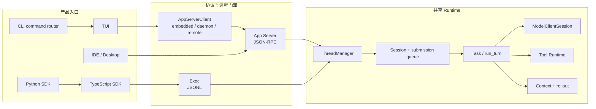
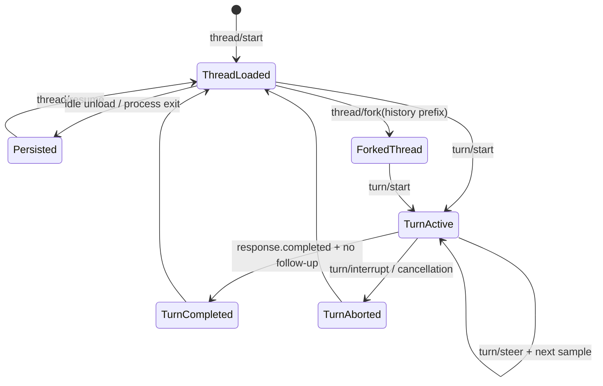
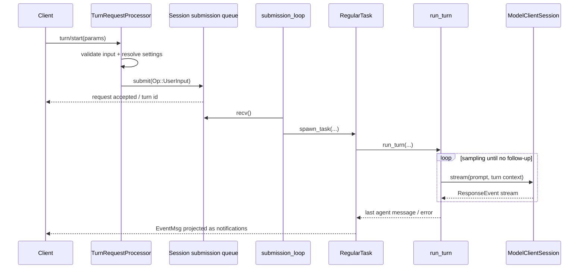
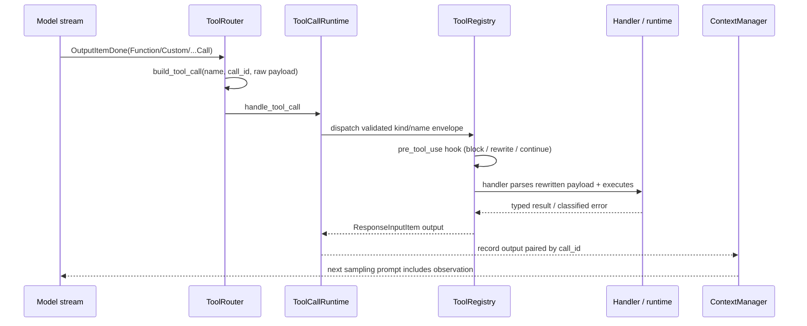
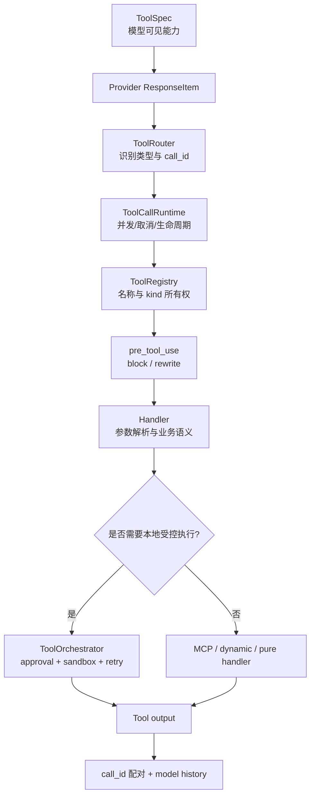
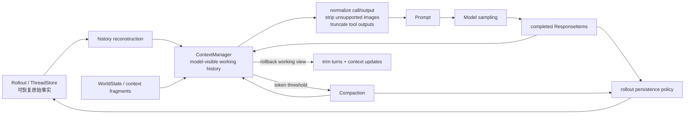
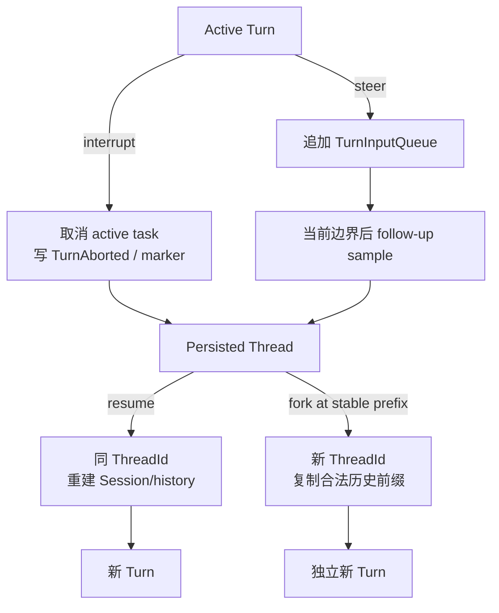
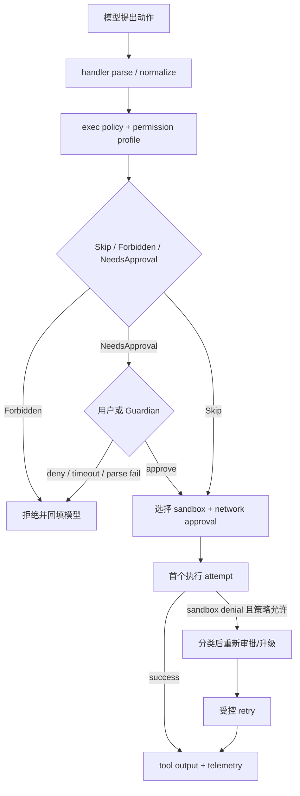
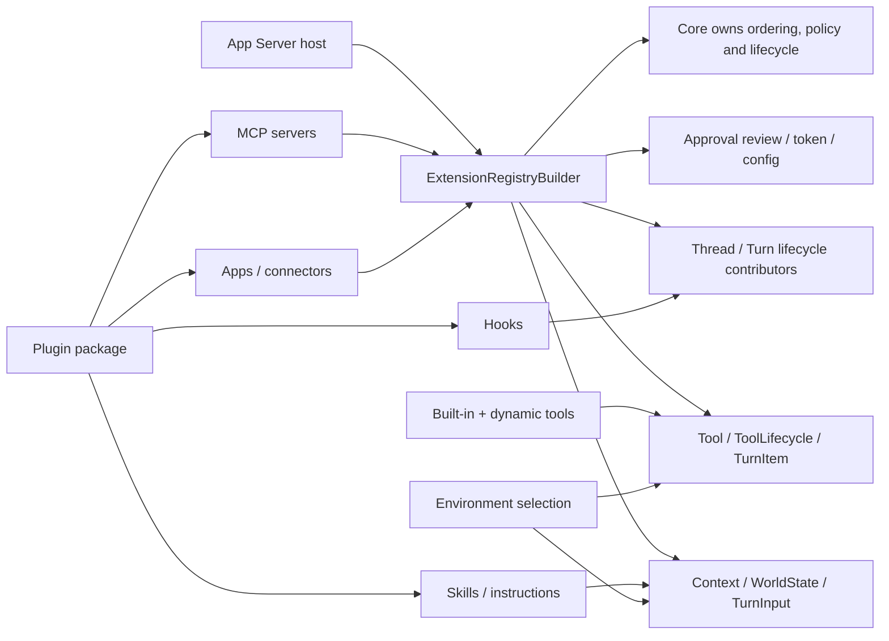
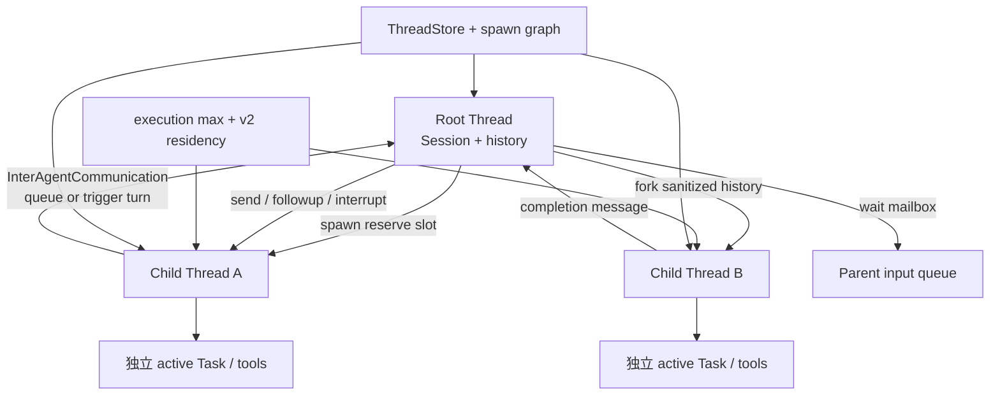

# Codex Agent 架构详细报告

## 1. 报告目的

本报告回答的不是“Codex 有哪些文件”，而是：

- 一个成熟 Agent Runtime 需要哪些稳定边界？
- Codex 为什么把一次模型调用扩展成 Thread / Turn / Task / Item / Event？
- 当前 AI SEO Agent 已经走到哪里？
- 哪些设计应迁移到云端 NestJS 项目，哪些不应照搬？

研究基于本地 Codex fork `ab6a7eb87cc8a816c88b86c44cf291e251ed2136` 与当前项目研究起点 `5f2ad11f2c65425e84392e81048364d55ec626ef`。每个领域按“源码事实—架构解释—迁移建议”组织；完整取证规则见 [research-method.md](./research-method.md)。

## 2. 执行摘要

Codex 可以被理解为一个事件驱动、工具增强、可持续运行的 Agent Runtime。它把多个产品入口收敛到共同核心，并围绕以下不变量组织系统：

1. 用户看到的 Thread 与一次执行的 Turn 分开。
2. 协议对象与内部运行对象分开。
3. 模型只提出工具调用；系统拥有执行权。
4. 工具调用结果必须回到 model history，才能形成 Agent loop。
5. model history、UI transcript、runtime event、durable log 不是同一种数据。
6. 中断、失败、审批、权限和 sandbox 都有独立语义。
7. 持久化服务于恢复和审计，不服务于复制每个流式 delta。
8. 核心 runtime 被 CLI、App、IDE、SDK 等多个入口复用。
9. 状态机和协议靠大量聚焦测试保护。

当前 AI SEO Agent 已经具备第 1、2、5、6、7 项的一部分基础，但仍然是“单次文本采样 Runtime”，还没有真正进入“模型—工具—Observation—再次采样”的 Agent loop。

## 3. Codex 的宏观分层

**源码事实**：`codex` CLI 分派交互 TUI、`exec` 与 `app-server`；当前 TUI 通过 `AppServerClient` 连接 embedded、local daemon 或 remote app-server。app-server 再持有 `ThreadManager`，把版本化请求映射到 core。TypeScript SDK 启动 Codex executable 的 `exec` JSONL 门面；Python SDK 启动 pinned Codex binary 的 `app-server` stdio JSON-RPC 门面。两者都没有复制 Rust Agent loop。



**架构解释**：复用的是生命周期、状态机和副作用所有权，不要求所有产品都使用同一种传输。TUI 改为 app-server client 进一步证明 UI 不是 canonical runtime。

**迁移建议**：NestJS 项目应让 Web、同步 API、定时任务和 Webhook 共用一个 application runtime；无需复制 JSON-RPC、Rust crate 粒度或本地进程拓扑。

| 层 | Codex 职责 | 当前项目对应 | 迁移判断 |
| --- | --- | --- | --- |
| 产品入口 | CLI、TUI、App、IDE、SDK | Vue Web、未来定时任务/Webhook | 多入口共享 runtime 的思想值得学 |
| 协议门面 | app-server JSON-RPC、exec JSONL、SDK types | Nest Controller、contracts、NDJSON | 不复制 JSON-RPC，学习稳定 contract |
| 生命周期 | ThreadManager、Thread、Turn、Task | Conversation、AgentRun、AgentStep | 已有基础，需补状态不变量 |
| Agent loop | `run_turn`、sampling、follow-up | `AgentRuntimeService` | 当前只采样一次，Tool loop 是最近缺口 |
| 模型适配 | ModelClientSession、ResponseEvent | LLMService、OpenAICompatibleClient | 需从文本 delta 升级为结构化 provider event |
| 工具体系 | spec、router、registry、runtime、orchestrator | 尚未实现 | 当前最高优先级 |
| 上下文 | ContextManager、token budget、compaction | SeoContextBuilder + 固定 12 条 history | 需从拼数组升级为上下文策略 |
| 持久化 | rollout、ThreadStore、state db | PostgreSQL Message/Run/Step | 需补恢复、幂等和查询投影 |
| 安全 | approval、permissions、sandbox、execpolicy | 尚无通用策略 | 先做业务权限和审批，不做 OS sandbox |
| 扩展 | skills、plugins、MCP、hooks | 尚无 | 内置工具稳定后再学习 |
| 协作 | child threads、agent control、mailbox | 尚无 | 单 Agent 稳定后再进入 |
| 质量 | telemetry、protocol tests、state tests、snapshots | typecheck/lint，无测试文件 | 测试是明显短板，应提前补齐 |

## 4. 核心主链路

### 4.1 客户端连接与协议初始化

Codex app-server 先完成连接级 `initialize`，再接受 thread / turn 请求。协议层负责：

- 请求、响应与通知的结构。
- client capability 协商。
- 稳定方法名和版本化类型。
- 把内部事件映射成客户端可理解的 item / delta / completion。

这说明协议门面不能直接等同于 runtime。当前项目已经用 `seo-chat-stream-event.mapper.ts` 将 `AgentRuntimeEvent` 映射为 `ChatStreamEvent`，方向正确；后续加入工具事件时，也应先扩内部事件，再谨慎决定是否暴露给前端。

关键源码与测试：

- `codex-rs/cli/src/main.rs`：`main` 对 TUI、Exec、AppServer 的命令分派。
- `codex-rs/tui/src/lib.rs`：`AppServerTarget`、`start_app_server`，选择 embedded / local daemon / remote。
- `codex-rs/app-server-protocol/src/protocol/common.rs`
- `codex-rs/app-server/src/message_processor.rs`
- `codex-rs/app-server/src/request_processors/initialize_processor.rs`
- `codex-rs/app-server/src/bespoke_event_handling.rs`
- `codex-rs/app-server/tests/suite/v2/initialize.rs`
- `codex-rs/cli/src/main.rs` 内 app-server transport/auth 参数测试。

### 4.2 Thread 生命周期

Thread 是长期工作线，负责承载多次 Turn 和可恢复历史。`ThreadManager` 负责创建、恢复、fork、加载和管理活跃线程；`Codex::spawn` 创建真正的 Session 运行态。

```text
thread/start
  -> ThreadRequestProcessor
  -> ThreadManager.start_thread_with_options
  -> spawn_thread_with_source
  -> Codex::spawn
  -> Session + submission/event channels + persistence
```



图中的 Thread 是长期身份；Turn 是一次活动边界；Response Item 是历史内容；`EventMsg` 与 app-server notification 是状态变化的投影。设计不变量是：一个 Session 同时最多一个 active Task，`TurnCompleted` 与 `TurnAborted` 不应同时成为同一 Turn 的最终事实。

设计价值：

- Thread 身份与进程内 Session 实例分离。
- 一个持久化 Thread 可以被 unload，再 resume。
- fork 明确表达“复制历史后形成新工作线”，而不是修改原历史。
- archive/delete/read/list 属于 Thread 资源管理，不混进 Turn 执行。

当前快照还把 **Goal** 建模为 Thread 级长期目标，而不是 Turn 或隐藏 prompt。`thread/goal/set|get|clear` 经 `ThreadGoalRequestProcessor` 调用 `GoalService`；Goal 保存 objective、status、token budget、tokens/time usage，并具有 Active、Paused、Blocked、UsageLimited、BudgetLimited、Complete 状态。`GoalExtension` 通过 thread/turn/tool/token contributors 计量进度、注入 continuation，并把 `ThreadGoalUpdated` 写为 durable event。Goal resume 后从 state 重新挂接 runtime，和某一次 active Turn 的内存状态分离。

**架构解释**：Thread 是身份与历史容器，Goal 是可替换的长期意图/预算状态，Turn 是一次执行。Goal 不能被当作模型 chain-of-thought；Goal 状态变化必须由 API/tool/lifecycle policy 决定并可恢复。

当前项目 `Conversation` 已经是最小 Thread，但还缺：所有权、归档、恢复语义、并发控制和运行中的 Thread 状态投影。

关键源码与测试：

- `codex-rs/core/src/thread_manager.rs`：`ThreadManager::start_thread_with_options`、`resume_thread_with_history`、`fork_thread_from_history`、`spawn_subagent`。
- `codex-rs/app-server/src/request_processors/thread_processor.rs`
- `codex-rs/thread-store/src/store.rs`：`ThreadStore`。
- `codex-rs/app-server/tests/suite/v2/thread_start.rs`：正常创建及配置/环境失败。
- `codex-rs/app-server/tests/suite/v2/thread_resume.rs`、`thread_fork.rs`：恢复、历史前缀、未物化/ephemeral 边界。
- `codex-rs/core/src/thread_manager_tests.rs`：active/stopped resume 与 interrupted fork snapshot。
- `codex-rs/app-server/src/request_processors/thread_goal_processor.rs`：Goal 协议门面与 snapshot notification。
- `codex-rs/ext/goal/src/api.rs`、`extension.rs`、`runtime.rs`、`tool.rs`：Goal state、计量与 typed extension。
- `codex-rs/ext/goal/tests/goal_extension_backend.rs`：create/update、并行 tool 计量、error/usage limit、resume/clear。
- `codex-rs/app-server/tests/suite/v2/thread_resume.rs`：paused/budget-limited Goal 的 resume 与持久化边界。

### 4.3 Turn 进入 submission queue

`turn/start` 不直接调用模型。`TurnRequestProcessor::turn_start` / `turn_start_inner` 先校验、映射输入，并允许 `TurnStartParams.model` 等 thread settings 覆盖，再把 `Op::UserInput` 提交给 Session queue。

```text
turn/start params
  -> validate and map input
  -> Op::UserInput
  -> submit
  -> submission_loop
  -> user_input_or_turn
  -> RegularTask
```



设计不变量是：协议请求只负责提交操作，active Task 的启动、中断和终态由 Session 串行所有者决定；模型 transport 不能直接决定产品层 Turn 状态。

为什么需要 queue：

- 中断、steer、approval response、tool response 都是运行期间可能到来的操作。
- runtime 需要单一顺序点维护 active turn 状态。
- 客户端请求生命周期不应直接等于模型请求生命周期。
- 后续可做背压、调度、公平性和并发限制。

当前项目的 HTTP 请求仍直接持有整个 async generator 生命周期。学习 queue 的重点不是立刻上消息队列，而是先建立“请求进入”和“运行执行”之间的可替换边界。

关键源码与测试：

- `codex-rs/app-server/src/request_processors/turn_processor.rs`：`TurnRequestProcessor::turn_start_inner` 构造并提交 `Op::UserInput`。
- `codex-rs/core/src/session/handlers.rs`：`submission_loop` 是 `Op` 的顺序消费点。
- `codex-rs/core/src/tasks/regular.rs`：`RegularTask::run`。
- `codex-rs/core/src/session/turn.rs`：`run_turn`、`try_run_sampling_request`。
- `codex-rs/app-server/tests/suite/v2/turn_start.rs`、`turn_steer.rs`、`turn_interrupt.rs`。
- `codex-rs/core/tests/suite/abort_tasks.rs`：长工具中断、历史记录与 `<turn_aborted>` 恢复标记。

### 4.4 Task 与 Turn 的分工

Codex 用 `RegularTask` 承接普通 Turn。Task 负责：

- 发送 TurnStarted。
- 准备或复用模型 session。
- 调用 `run_turn`。
- 处理运行中追加的输入。
- 返回最后的 agent message。

`run_turn` 则负责一次 Turn 内的循环、上下文、采样、工具续跑、压缩和完成条件。

Turn 内部还有两层快照：`TurnContext` 固定本 Turn 的 model、provider、approval/permission、cwd 等运行配置；`StepContext` 在每次 sampling 前捕获当时可用的 environments、selected capability roots、MCP runtime/tool list 和 `AGENTS.md`。同一 Turn 的后续 sampling 可以看见新就绪能力，但一次 sampling 广告的工具与实际执行使用同一个 Step snapshot。

**架构解释**：Step 不是数据库 `AgentStep` 的同义词。Codex StepContext 是 request-scoped capability snapshot，用来防止“模型看到的工具”和“执行时的工具”在同一次采样中漂移。

这种分层避免一个巨型 service 同时处理请求接入、调度、上下文、模型协议、工具执行和持久化。当前 `AgentRuntimeService.runTurnStream()` 已经开始承担 Task + Turn 两层职责，后续功能增多时应拆出明确的 `AgentTurnRunner` 或等价内部边界，但不要在 Tool Calling 第一小步就过早抽象。

关键源码：

- `codex-rs/core/src/tasks/regular.rs`：`RegularTask` / `SessionTask::run`。
- `codex-rs/core/src/session/turn.rs`：`run_turn`。
- `codex-rs/core/src/session/turn_context.rs`：`TurnContext`。
- `codex-rs/core/src/session/step_context.rs`：`StepContext` 与固定 MCP tool snapshot。
- `codex-rs/app-server/tests/suite/v2/selected_capability_stack.rs`：能力在两次 sampling 间变为可用，但 step 内保持一致。

### 4.5 Model Sampling 与 Agent loop

成熟 Agent 与普通 Chat 的关键差别在于：模型输出工具调用时，Turn 不结束。

```text
build prompt
  -> ModelClientSession::stream
  -> ResponseEvent stream
  -> assistant message ? complete candidate
  -> tool call ? dispatch tool
  -> record tool output into history
  -> needs_follow_up = true
  -> next sampling request
```

`run_turn` 的外层循环根据 `needs_follow_up` 决定是否继续采样。工具调用、服务端 `end_turn=false`、运行中追加输入，都可能要求继续。

当前项目的 `LLMService.chatStream()` 只 yield 文本字符串，导致 runtime 看不到 tool call、finish reason 或 usage。阶段 5 必须先升级 LLM 边界，让上层接收结构化事件，再实现 Tool loop。

该内部 contract 应只有一个故障所有者：`ModelStreamEvent` 只表达正常 text/tool/usage/completed 值；provider/network/abort 从 async iterator throw，runtime 再分类为唯一终态。OpenAI-compatible Chat Completions 还应显式请求 `include_usage`，容纳 finish reason 后到达的 `choices=[]` usage-only chunk，并在 usage 后合成唯一 completed。

当前快照还明确了一个容易遗漏的边界：`ModelClientSession` 是 **turn-scoped**，在同一 Turn 的多次采样间复用 WebSocket、sticky routing 与连接状态，但不能跨 Turn 复用，否则会把 `previous_response_id` 等 transport 状态泄漏给下一 Turn。

关键源码与测试：

- `codex-rs/core/src/client.rs`：`ModelClient`、`ModelClientSession`、`new_session`、SSE/WebSocket stream 与 retry。
- `codex-rs/codex-api/src/common.rs`：`ResponseEvent`。
- `codex-rs/core/src/session/turn.rs`：`run_turn`、`try_run_sampling_request`、`SamplingRequestResult`。
- `codex-rs/core/src/stream_events_utils.rs`：完成 item 到 runtime/UI item 的映射。
- `codex-rs/core/src/client_tests.rs`：认证刷新、WebSocket handshake、metadata 与失败路径。
- `codex-rs/core/tests/suite/pending_input.rs`：steer/mailbox 触发 follow-up 的边界测试。

### 4.6 Tool Call 处理

**源码事实**：完成的 provider item 先被识别为路由信封，再由 turn-scoped `ToolCallRuntime` 查询 registry。handler 在真正执行时解析/验证自己的 payload；结果统一转换成与 `call_id` 配对的 `ResponseInputItem`，写入历史并令 `needs_follow_up = true`。



**架构解释**：Tool call 不是 RPC 直通。模型只能提出带 raw arguments 的候选动作；registry/handler/policy 保留解释、验证和执行权。hook 改写发生在 registry dispatch 中，但改写后仍回到具体 handler 的 payload 解析与 ToolOrchestrator/policy，不获得绕过安全层的捷径。

模型输出先由 `ToolRouter::build_tool_call` 转换为内部 `ToolCall { tool_name, call_id, payload }`，再通过 registry 找到确定性 runtime。这里的 `ToolCall` 是路由信封：普通 function payload 仍含 raw JSON arguments，并不自动等于“已按具体工具 schema 验证”。Tool 结果作为 `ResponseInputItem` 写回 conversation history，触发下一次采样。

重要边界：

1. **ToolSpec**：模型可见契约。
2. **ToolRouter**：识别 provider output 并生成未验证的路由调用信封。
3. **ToolRegistry**：工具名到 runtime 的确定性映射，拒绝重复注册。
4. **Tool handler/runtime**：参数解析、业务执行、结果序列化。
5. **ToolOrchestrator**：为 shell、apply_patch、unified exec 等需要 sandbox/approval 的本地 runtime 编排审批、sandbox、特定 retry/elevation 和 telemetry；它不是所有 registry handler 的全局必经层。
6. **Observation**：回填给模型的结构化结果。

Tool search 也是同一闭环的特殊工具：client-executed `ResponseItem::ToolSearchCall` 被 router 解析为 `ToolPayload::ToolSearch`，`ToolSearchHandler` 在当前 step 的可加载 catalog 上检索并返回 `ToolSearchOutput` / loadable specs，下一轮模型才获得新增工具。它解决“大 catalog 不应全部塞进 prompt”，不改变 registry 和 policy 的最终执行权。

参数流式增量只用于可选预览。`try_run_sampling_request` 在 `OutputItemAdded` 时向 runtime 申请 `ToolArgumentDiffConsumer`；例如 apply-patch consumer 将 partial input 解析成 `PatchApplyUpdated`。真正 dispatch 仍等待 `OutputItemDone` 和完整 payload，partial arguments 不能触发副作用。



设计不变量是：spec 暴露、名称路由、参数验证、副作用授权、执行与 observation 配对属于不同责任；`ToolOrchestrator` 只覆盖实现 `ToolRuntime` 的本地受控执行，不是所有工具的万能中间件。

当前阶段 5 文档已经提出 `ToolDefinition / ToolRegistry / ToolExecutor`，方向正确。还应显式补上 `UnvalidatedToolCallEnvelope -> ValidatedToolInvocation`、`ToolResult/Observation` 和 provider event adapter，否则 registry 只是一个孤立容器，raw arguments 也可能绕过验证。

关键源码与测试：

- `codex-rs/tools/src/tool_spec.rs`：`ToolSpec`。
- `codex-rs/core/src/tools/router.rs`：`ToolCall`、`ToolRouter::build_tool_call` 与 dispatch。
- `codex-rs/core/src/tools/parallel.rs`：`ToolCallRuntime`、取消与 ordered future。
- `codex-rs/core/src/tools/registry.rs`：`ToolRegistry::dispatch_any_with_terminal_outcome`、pre/post hooks 与 handler。
- `codex-rs/core/src/tools/orchestrator.rs`：本地 `ToolRuntime` 的 approval/sandbox/attempt。
- `codex-rs/core/src/tools/handlers/tool_search.rs`：deferred catalog search 与 loadable specs。
- `codex-rs/core/src/tools/handlers/apply_patch.rs`：`ApplyPatchArgumentDiffConsumer` 只生成预览事件。
- `codex-rs/core/src/tools/router_tests.rs`、`registry_tests.rs`：unsupported/kind/parallel/hook contract。
- `codex-rs/core/tests/suite/tool_harness.rs`：正常执行与 malformed payload。
- `codex-rs/core/tests/suite/hooks.rs`：执行前阻断、shell/apply_patch/function input rewrite。
- `codex-rs/core/tests/suite/plugins.rs`、`tools/handlers/mcp_search_tests.rs`：tool search provenance 与 catalog metadata。

### 4.7 并行工具与顺序一致性

**源码事实**：Session submission 使用有界 `async_channel`，`active_turn` 只容纳一个 active Task；steer、mailbox 与其他 pending input 进入 `TurnInputQueue`。一次 sampling 内，声明可并行的工具可提前创建 future，但 `FuturesOrdered` 在 response completion 前 drain，并以可预测顺序把 output 写回 history。每个 tool future 继承 child `CancellationToken`，terminal lifecycle 通过原子标志避免完成与 aborted 双发。

这背后的学习点不是“越并行越好”，而是：

- 工具必须声明是否安全并行。
- 共享状态更新需要顺序和原子性。
- 并行执行结果写回模型时仍要保证 call/output 配对。
- 中断要能传播到所有 in-flight tool。

当前 SEO Agent 第一版只应顺序执行一个只读工具。等单工具 loop、错误语义和 step 记录稳定后，再实现有界并行。

测试证据：`core/tests/suite/tool_parallelism.rs` 覆盖并行启动、mixed tools 与结果分组；`core/src/tools/parallel.rs` 的模块测试覆盖 dispatch 前取消、handler 已完成后的取消和等待 runtime cleanup 的 aborted 生命周期。

`core/src/session/tests.rs::submission_loop_channel_close_aborts_active_turn_before_thread_stop_lifecycle` 证明 channel 关闭时先取消 active Turn 再停止 Thread；`core/tests/suite/pending_input.rs` 证明 steer/mailbox 只能在合法 sampling 边界触发 follow-up；`app-server/tests/suite/v2/thread_unsubscribe.rs` 证明客户端 unsubscribe 不等于取消正在运行的 Turn。

**架构解释**：背压存在于 submission/runtime channel 与 agent 容量边界，不能简单推导为“所有内部 channel 都有界”；app-server listener 仍有 unbounded channel，因此 slow consumer 的产品级治理是另一层问题。

### 4.8 Runtime Event 与 UI Item

Codex 区分：

- provider 的 `ResponseEvent`
- core 的 `EventMsg`
- app-server 的 notification
- UI 的 `TurnItem`
- rollout 的持久化 item

Item 与 Event 不是同义词：Item 是有身份、内容和完成形态的语义对象；Event/notification 描述 item 或 turn 的 started/delta/completed 等生命周期。`ResponseEvent::OutputItemDone(item)` 恰好说明“事件携带一个完成 item”，不是把两层合并。

这种分层避免 provider chunk 直接污染产品协议。当前项目已具备 `LLM delta -> AgentRuntimeEvent -> ChatStreamEvent -> Vue state` 的最小版本，但内部事件仍只有文本生命周期。工具阶段应先增加内部工具事实，外部是否展示另行决策。

### 4.9 ContextManager 与历史不变量



设计不变量是：durable append-only facts、恢复投影与当前模型窗口不是同一份数组；compaction/rollback 可以改变 model view，但必须保留足以恢复、审计和继续配对的事实。

Codex 的 ContextManager 不只是“截取最近 N 条”，它负责：

- 保存 model-visible ResponseItem。
- 估算 token 使用。
- 规范化 call/output 配对。
- 移除孤立 tool output。
- 根据模型能力移除图片。
- 截断过大的 tool output。
- rollback 时维护 context baseline。
- 记录 world state diff。

关键不变量：每个 tool call 必须有对应 output，每个 output 必须能找到 call。这个不变量应成为当前项目阶段 5 的测试重点。

关键源码与测试：

- `codex-rs/core/src/context_manager/history.rs`：`ContextManager`、`normalize_history`、rollback/token 视图。
- `codex-rs/core/src/context_manager/normalize.rs`：补 call output、移除 orphan output、图片能力归一化。
- `codex-rs/core/src/context/world_state`：跨 Turn 的可替换 context fragments。
- `codex-rs/core/src/context_manager/history_tests.rs`：call/output 成对删除、图片、截断、rollback/context update。
- `codex-rs/core/tests/suite/truncation.rs`：tool/MCP output 上限与只截断一次。

### 4.10 Token 预算与 Compaction

Codex 在每次采样后收集 token 状态，达到阈值且仍需 follow-up 时执行 compaction，再继续 Turn。它把 compaction 视为 runtime 能力，而不是 UI 的“清空聊天”。

当前项目固定读取最近 12 条消息，简单但无法回答：

- system prompt、历史、tool output 各占多少预算？
- 一个超长 tool output 如何处理？
- 压缩后保留哪些业务事实？
- summary 是否能被审计和替换？

因此 Context 阶段应从预算模型开始，而不是直接做复杂摘要算法。

当前快照还把 token-budget compaction 统一建模为 `ContextCompaction` 生命周期：manual 与 inline auto-compaction 都运行 compact hooks、建立新 window，并在 follow-up 前复位预算。`core/tests/suite/token_budget.rs` 验证阈值、hooks、新 window 和 mid-turn follow-up；`compact_resume_fork.rs` 验证压缩后 resume/fork 得到相同 model history view。

### 4.11 Durable Facts 与 Rollout

**源码事实**：`rollout::policy::is_persisted_rollout_item` 明确筛选 durable facts。高频 delta、approval request、临时 begin、warning 和大部分 UI 状态不写入；Response Item、Turn start/complete/abort、token、goal、settings、compaction、world state 与 turn context 构成恢复输入。`ThreadStore` 是 storage-neutral trait，负责 create/resume/append/persist/flush/load/list；local、in-memory 或远端实现必须共享 rollout persistence policy。

当前快照同时支持 `ThreadHistoryMode::Legacy` 与 `Paginated`：legacy 依赖部分旧 EventMsg；paginated 以完成的 `TurnItem` 投影历史。`app-server-protocol/protocol/thread_history_projection.rs` 负责投影，不应让 UI notification 反向成为 canonical history。

当前项目将 `Message`、`AgentRun`、`AgentStep` 落 PostgreSQL，方向正确。但未来工具 loop 需要决定：

- 工具 call arguments 是否作为 step input 持久化？
- output 是否需要脱敏、截断或外部存储？
- 每次模型采样是一个 step 还是 attempt？
- 重试后如何避免重复副作用？
- 服务重启后如何识别僵尸 RUNNING？

其中 provider transport retry、Agent sampling follow-up 和 tool execution retry 必须分开。可靠性阶段只记录 idempotent/version/attempt 并默认执行一次；直到 durable checkpoint、幂等键和“工具可能已成功”的 outcome reconciliation 成立后，恢复阶段才能安全决定第二 attempt。

关键源码与测试：

- `codex-rs/rollout/src/policy.rs`：`is_persisted_rollout_item` / `should_persist_*`。
- `codex-rs/rollout/src/recorder.rs`：append、flush 与失败传播。
- `codex-rs/thread-store/src/store.rs`：`ThreadStore` trait。
- `codex-rs/app-server-protocol/src/protocol/thread_history_projection.rs`：paginated history 投影。
- `codex-rs/rollout/src/recorder_tests.rs`：append/flush/损坏与持久化失败。
- `codex-rs/core/src/session/rollout_reconstruction_tests.rs`、`compact_resume_fork.rs`：恢复与历史合法性。
- `codex-rs/app-server-protocol/src/protocol/thread_history_projection_tests.rs`：Item/Turn 投影边界。

### 4.12 中断、Steer、Resume 与 Fork

这四个概念不能混为一个“继续聊天”按钮：

- interrupt：停止当前 Turn。
- steer：当前 Turn 尚未结束时追加输入。
- resume：重新加载已有 Thread 并继续新 Turn。
- fork：复制一段历史形成新 Thread。



设计不变量是：interrupt 改变当前 Turn 终态；steer 只进入当前 Turn 的输入队列；resume 保留 Thread 身份；fork 必须产生新身份且不回写源历史。mid-turn fork 会先物化/截断到合法边界，不能复制半个无 output 的工具调用。

当前项目已支持浏览器断开触发 AbortSignal，并把 Message / Run / Step 收为 `ABORTED`。这是 interrupt 的基础。下一步应先处理服务端重启和重复请求，再考虑 steer/fork；否则只增加 API 名称，没有一致性基础。

### 4.13 Approval、Permission 与 Sandbox

Codex 的 ToolOrchestrator 对使用它的本地 sandbox runtime 明确先决定 Approval，再选择 sandbox 执行，失败后是否升级也有独立策略。不要把这条局部执行路线描述为所有 Codex 工具的统一全局管线；MCP 等 handler 有各自路径。

```text
tool call
  -> permission / policy decision
  -> approval if required
  -> sandbox selection
  -> first attempt
  -> classified failure
  -> optional re-approval / retry
```



设计不变量是：模型、hook 或工具输入都不能自行扩大 permission profile；approval 是一次动作决策，sandbox 是强制执行边界，exec policy 是规则判断，Guardian 是可选 reviewer。任何输入改写都必须在最终执行参数上重新经过 handler 和 policy。

云端 SEO Agent 的翻译：

- permission：用户/租户是否能用这个工具、访问这份资源。
- approval：有外部副作用的动作是否获得本次确认。
- isolation：HTTP 超时、出站域名、凭证隔离、worker 权限和容器边界。

现在不执行 shell，因此无需照搬 OS sandbox，但不能因此跳过鉴权、审批和审计。

关键源码与测试：

- `codex-rs/core/src/config/permissions.rs`：permission profile 编译与继承。
- `codex-rs/core/src/exec_policy.rs`：命令规则与 approval requirement。
- `codex-rs/core/src/tools/approvals.rs`：用户/Guardian reviewer 选择。
- `codex-rs/core/src/tools/orchestrator.rs`：approval、sandbox、network approval 与 retry。
- `codex-rs/core/src/tools/sandboxing.rs`
- `codex-rs/core/src/guardian`：风险审查、失败关闭与拒绝 circuit breaker。
- `codex-rs/core/src/config/permissions_tests.rs`、`exec_policy_tests.rs`、`tools/sandboxing_tests.rs`。
- `codex-rs/core/tests/suite/request_permissions.rs`：临时 grant 的 scope、拒绝与跨 Turn 边界。
- `codex-rs/core/tests/suite/guardian_review.rs`：允许复用与拒绝回填。

### 4.14 扩展系统

**源码事实**：Codex 支持 built-in tools、dynamic tools、MCP、skills、plugins、hooks、Apps、Environments，以及新的 typed `ExtensionRegistry`。registry 允许 host 按注册顺序贡献 thread/turn lifecycle、config、token usage、skill invocation、context/world state、MCP server、turn input、tool、tool lifecycle、turn item 与 approval review；扩展拿到稳定 ID 和私有 `ExtensionData`，而不是随意持有整个 Session。



设计不变量是：扩展只能贡献自己拥有的能力，host 保留排序、冲突处理、权限和生命周期控制；Plugin 是分发/组合单元，Skill 是指令资源，MCP 是外部工具/资源协议，Hook 是生命周期拦截，App/Environment 是能力来源，不能互换术语。

1. 内置工具验证最小闭环。
2. registry 和统一 result contract 稳定。
3. 外部工具协议接入。
4. 可复用指令包和生命周期 hook。
5. 插件分发、版本和信任策略。

当前项目到第 1 步都未完成，所以 MCP 和插件系统应明确放到后期。

关键源码与测试：

- `codex-rs/ext/extension-api/src/registry.rs`、`contributors.rs`：typed registry 与贡献点。
- `codex-rs/core/src/tools/spec_plan.rs`、`handlers/dynamic.rs`、`handlers/mcp.rs`、`handlers/extension_tools.rs`：工具汇合。
- `codex-rs/core/src/context/world_state`：Apps/Plugins 等动态上下文投影。
- `codex-rs/hooks/src`、`codex-rs/plugin/src`、`codex-rs/core/src/skills.rs`、`environment_selection.rs`。
- `codex-rs/ext/extension-api/tests/registry.rs`：所有 contributor category 与注册顺序。
- `codex-rs/core/tests/suite/hooks.rs`、`rmcp_client.rs`、`plugins.rs`，以及 app-server 的 skills/plugins/hooks/dynamic-tools tests。

### 4.15 Multi-agent

**源码事实**：Codex 的 subagent 是独立 Thread，有 `parent_thread_id` / spawn graph、自己的 Session/history/permission inheritance、执行容量与 v2 residency。`AgentControl` 负责 spawn/resume/send/interrupt/list，spawn 可从空上下文或父历史的 full/last-N snapshot 开始；fork 前先 materialize/flush 父 rollout，并清除不应继承的 usage hints。v2 的 `InterAgentCommunication` 可只入队 mailbox，也可触发 Turn；child completion 会向直接 parent 入队消息。



设计不变量是：工具并行共享一个 Turn/context；Multi-agent 则创建独立 Thread 和执行容量。子 Agent 的 permission/environment 可以继承或收窄，但模型不能借 spawn 扩权；parent/child 消息是持久化通信事实，不等于共享可变 history。

迁移前置条件：

- 单 Agent tool loop 稳定。
- Run/Step 可恢复。
- 工具权限可继承或收窄。
- 并发和成本预算可控。
- 父子任务结果有确定 contract。

因此 Multi-agent 是学习路线后段，而不是阶段 5 的延伸任务。

测试证据：`codex-rs/core/src/agent/control_tests.rs` 覆盖 fork 清洗、flush-before-snapshot、max threads、slot release、child completion 和 v2 parent mail；`codex-rs/core/src/agent/control/execution_tests.rs` 与 `residency_tests.rs` 覆盖运行容量与 idle eviction；`codex-rs/core/tests/suite/pending_input.rs` 覆盖 mailbox 在 reasoning/commentary 边界触发 follow-up。

### 4.16 SDK 与多入口共享 Runtime

Codex SDK 复用已有 runtime 和协议，不在 SDK 内重新实现 Agent loop。当前项目未来若增加：

- 定时 SEO 巡检
- webhook 触发任务
- 内部运营批处理
- 第三方 SDK

这些入口都应调用同一个 application runtime，而不是复制 `LLMService.chatStream()`。

当前项目已经存在一个具体反例：同步 `SeoService.chat()` 直接调用 `LLMService.chat()`，streaming 入口才走 `AgentRuntimeService`。Tool loop 阶段必须让同步接口消费同一个 turn runner 到 terminal，或明确禁用 tool mode；不能维持两套 context、persistence 和错误语义。

### 4.17 测试与可观测性

Codex 的架构可信度很大程度来自测试密度：core、app-server、rollout、SDK 都有聚焦测试。测试覆盖协议、状态机、工具路由、并发、中断、压缩、持久化和失败路径。

当前项目只有 typecheck 和 lint，没有任何 `.test` / `.spec` 文件。这意味着阶段 5 如果直接实现 Tool Calling，会在最需要状态机保护时继续扩大无测试代码。

建议在 Tool Contract 阶段先建立：

- 纯函数单元测试。
- fake LLM event stream。
- fake tool executor。
- runtime 状态机集成测试。
- NDJSON contract 测试。
- recorder transaction 测试。

**源码事实**：可观测性并非单一日志模块。`ModelClientSession` 记录 transport retry/usage；`try_run_sampling_request` 建立 receiving/handle_response spans；ToolRegistry/Orchestrator 记录 tool name、call id、sandbox、decision source、result 与延迟；`TurnTimingState` 维护 TTFT、sampling/tool/profile 时间；rollout persistence 有独立 metrics；app-server notifications 还会进入 analytics reducer。trace-safe 与 log-only target 在 OTEL provider 中分开，避免把任意日志自动当可导出 trace。

质量保护分四层：protocol 序列化/投影 tests，模块状态单测，使用 fake Responses/MCP 的 core/app-server integration suite，以及 snapshot tests。`core/tests/common/responses.rs` 和 streaming SSE helpers 让复杂状态机无需真实 provider 即可复现失败顺序。

### 4.18 产品层投影：Core Event 不是 UI Canonical State

**源码事实**：Core 的 `EventMsg` 由 `app-server/src/bespoke_event_handling.rs` 转成版本化 `ServerNotification`。`ItemStarted` / delta / `ItemCompleted` 描述展示生命周期；durable paginated history 则由 `thread_history_projection::project_rollout_line` 从 `TurnStarted`、`TurnComplete`、`TurnAborted` 与完成的 `TurnItem` 无状态投影。unsubscribe 只移除连接订阅，不停止 active Turn。

**架构解释**：实时 notification、当前连接缓存与 canonical rollout 是三层状态。重连客户端应从 Thread history/status 恢复，再继续订阅增量；不能把“最后收到的 delta”当完成事实，也不能把 analytics reducer 反向当业务状态所有者。

关键证据：

- `codex-rs/core/src/event_mapping.rs`：内部 item/event 兼容映射。
- `codex-rs/app-server/src/bespoke_event_handling.rs`：Core event 到 notification。
- `codex-rs/app-server-protocol/src/protocol/thread_history_projection.rs`：paginated rollout 到 Thread/Turn/Item change set。
- `thread_history_projection_tests.rs`：completed/failed/aborted/item 投影与无 turn-id abort 忽略。
- `app-server/tests/suite/v2/thread_unsubscribe.rs`、`thread_read.rs`、`thread_status.rs`：连接与 canonical state 边界。

### 4.19 App Server 并发协议：按资源串行，而不是全局串行

**源码事实**：`ClientRequest` 的协议定义同时声明请求参数、稳定/实验状态和 `serialization_scope()`。scope 不是一个布尔锁，而是带资源标识的枚举：全局配置、Thread、ThreadPath、命令进程、通用进程、模糊搜索会话、文件监听与 MCP OAuth 各自形成队列键。`GlobalSharedRead` 与同名 `Global` 共用资源键，但前者以 shared read 进入队列；没有 scope 的请求直接并发执行。连接级 `ConnectionRpcGate` 仍包裹每个已初始化请求，因此“资源顺序”和“连接关闭/请求取消”是两个独立维度。

```text
ClientRequest
  -> initialized / experimental capability check
  -> serialization_scope()
      -> None: spawn concurrently
      -> key + SharedRead/Exclusive
          -> RequestSerializationQueues
          -> ConnectionRpcGate
          -> request processor
```

这避免了两个相反错误：把所有 RPC 放进单一全局队列会让无关 Thread 互相阻塞；完全并发又会让同一 Thread 的 resume、goal、interrupt 或同一配置资源的读写失序。`thread_or_path` 还处理尚未物化 Thread 只有 rollout path 的阶段，使冷恢复和已加载 Thread 能落到可比较的资源所有权上。

**重连顺序不变量**：运行中 Thread 的 `resume response` 不是先读 history、再另行订阅。它被封装为 `ThreadListenerCommand::SendThreadResumeResponse`，在 listener 上下文内读取 `active_turn_snapshot()`、组装历史、检查 pending unload、把 connection 加入订阅并发送响应。Goal 更新/清除、server request resolution 也进入同一 listener command 流，从而与 resume 建立明确先后关系。unsubscribe 只移除连接；只有 Thread 同时“无订阅者且 inactive”超过延迟，才取消待处理回调、shutdown、移除 watch 并发出 `thread/closed`。

**能力协商不变量**：`initialize` 必须先完成；实验请求只有连接声明 `experimentalApi` 后才能执行。`optOutNotificationMethods` 是逐连接的通知过滤，不改变 Runtime 或 durable history。`mcpServerOpenaiFormElicitation` 和 attestation 也属于客户端能力，不能由服务端从客户端名称猜测。

关键证据与失败测试：

- `codex-rs/app-server-protocol/src/protocol/common.rs`：scope 宏、资源键提取和 experimental 标注。
- `codex-rs/app-server/src/request_serialization.rs`：shared read / exclusive 队列与连接 gate。
- `codex-rs/app-server/src/message_processor.rs`：initialized、experimental 与调度入口。
- `codex-rs/app-server/src/thread_state.rs`、`request_processors/thread_lifecycle.rs`：listener generation、原子 resume/subscribe、延迟 unload。
- `app-server-protocol` 的 scope tests 覆盖 keyed/unkeyed 请求；`thread_resume.rs` 覆盖运行中重连、pending approval 重放、历史冲突和关闭中拒绝；`thread_unsubscribe.rs` 与 `thread_status.rs` 覆盖连接退出不终止 Turn、通知 opt-out 与 status 生命周期。

映射到当前项目：未来若支持同一会话多客户端、后台 Run 或管理端控制，不应先造一个全局 mutex。应先列出资源所有者（Conversation、AgentRun、Tool approval、全局 provider config），只对会改变同一资源状态的命令串行；读取可在证明快照一致后共享。

### 4.20 模型传输：三种状态寿命与两层重试

`ModelClient` 看似只是 provider client，实际刻意分开三种寿命：

| 状态 | 寿命 | 例子 | 不能越界的原因 |
| --- | --- | --- | --- |
| Session | Codex Thread/Session | provider、auth、conversation id、WebSocket→HTTP fallback 开关 | fallback 后继续反复尝试 WS 会制造抖动 |
| Turn | `ModelClientSession` | WS connection、last request/response、`x-codex-turn-state` | sticky routing token 跨 Turn 会路由到错误服务端状态 |
| Sampling attempt | 单次 request/stream | inference trace attempt、SSE/WS telemetry、已完成 output items | retry 必须能区分失败、取消与完成 |

**增量请求不是“有 response id 就用”**。只有上次 response 已完成、当前 input 以前次 input 加前次 output 为前缀，并且 model、instructions、tools、tool choice、reasoning、store、service tier、text 等上下文字段一致时，才发送 `previous_response_id + delta input`。任一条件不满足、上次 response 报错或连接重建，都会退回 full `response.create`。`client_metadata` 和 stream delivery options 不参与上下文等价判断，因为它们描述本次传输而非 server-side response context。

**preconnect 与 prewarm 不同**：preconnect 只建立连接，不发送 prompt；v2 prewarm 发送 `generate=false` 并等待 `Completed`，为首个真实请求建立可复用 response id，但不记为模型推理 trace。若真实请求沿用这个未追踪的 response id，inference trace 仍记录逻辑上的完整 request，而不是线上压缩后的 delta，保证 rollout 可审计。

**两层失败恢复**：

1. 建连/首请求遇到 `401` 时，auth manager 可以刷新一次认证并重建 client setup；`426 Upgrade Required` 明确切到 HTTP。
2. 已进入 sampling loop 后，只有 `CodexErr::is_retryable()` 的 stream 错误进入有上限的 backoff。WS retry 预算耗尽时先激活一次 session-scoped HTTP fallback、清零计数并继续；HTTP 预算也耗尽才把错误返回。`ContextWindowExceeded` 与 `UsageLimitReached` 不重试，前者把 token 状态标 full，后者先保存 rate-limit snapshot。

`map_response_events` 使用有界 channel 把 provider stream 转成 Core `ResponseStream`：收集 `OutputItemDone` 作为本次 attempt 的可审计输出；只有 `Completed` 才发布 `LastResponse` 供下一次增量；consumer drop 记录 cancelled，provider error 记录 failed，stream 无 `Completed` 则由 sampling 层判为断流。这样“收到一些 delta”不会错误地晋升成可复用完成事实。

关键测试：

- `client_websockets.rs::responses_websocket_uses_incremental_create_on_prefix` 与 non-prefix/non-input-field variants 证明增量判定。
- `responses_websocket_v2_after_error_uses_full_create_without_previous_response_id` 证明失败后清除 server-side continuation 假设。
- `responses_websocket_connection_limit_error_reconnects_and_completes` 证明连接级错误可在预算内重连。
- preconnect/prewarm、session drop、turn metadata、rate limit 与 terminal error tests 证明传输优化不改变逻辑请求。
- `client.rs::incomplete_response_emits_content_filter_error_message` 与 `history_dedupes_streamed_and_final_messages_across_turns` 保护断流错误和 streamed/final 去重。

映射到当前项目：`OpenAICompatibleClient` 可以先只实现 HTTP SSE，但 `LLMService` 必须把 provider error 分类为“不可重试业务错误 / 可重试传输错误 / 用户取消”，并让 AgentRuntime 拥有 retry 上限。不要在 axios/fetch adapter、Runtime 和 Controller 各重试一次；三层相乘会重复扣费，也无法证明已落盘的 delta 属于哪次 attempt。

### 4.21 持久化写屏障：JSONL 事实先于 SQLite 索引

Codex 本地持久化不是把同一份状态随意双写到 JSONL 和 SQLite，而是给两者不同职责：rollout JSONL 保存可恢复的顺序事实，state DB 保存列表、搜索、Goal 等派生/运营状态。`LocalThreadStore::append_items` 先把按 history mode 过滤后的 canonical items 交给 `RolloutRecorder`，随后等待 `flush()`；只有 flush 成功后，`LiveThread` 才更新 metadata。因此 SQLite 不会宣称存在一个 JSONL 尚未接受的 live append。

```text
canonical RolloutItem
  -> bounded writer queue
  -> pending_items
  -> JSONL write + file flush       durable barrier
  -> metadata/state DB update       searchable projection

startup / repair
  -> scan JSONL metadata
  -> leased backfill + watermark
  -> state DB becomes readable
```

**延迟物化**：新 Thread 创建 recorder 时只预计算路径和 `SessionMeta`，不会立刻创建空文件。首批可持久化 item 到来后，`persist/flush/shutdown` 才创建目录、写 metadata 和 pending items。空而未使用的会话因此不会污染 thread list；`persist()` 可重复调用。

**失败不丢后缀**：writer 独占 file handle，通过容量 256 的 channel 接收命令。item 先进入 `pending_items`，只有单条写成功才从队首移除并推进 ordinal。I/O 失败会丢弃 handle、保留未写 suffix，再 reopen 重试一次；二次失败通过 barrier ack 返回，但 writer 仍可接受未来的 flush/shutdown 重试。background task 真正终止时，`terminal_failure` 被 recorder clones 读取，避免 channel closed 把根因抹成泛化错误。

**Paginated ordinal 是追加序列，不是假定连续数组**：新文件从 0 开始；resume 时先从首条 `SessionMeta` 判 history mode，再用 8 KiB 逆向 scanner 找最后一条可解析 JSONL，下一 ordinal 取 `last + 1`。中间 gap 合法，尾部坏 JSON 可跳过，非换行结尾会先补换行；`u64` overflow 在写入前失败。这样 crash 留下的坏尾部不会覆盖既有事实，也不会把历史长度误当序号。

**State DB 启动门**：初始化 SQLite、迁移后，进程必须通过 rollout metadata backfill gate 才拿到 handle。backfill 用单例 row、lease、watermark 和 completed 状态支持多进程竞争与断点续作；超时会让初始化失败，而不是暴露半填充索引。thread list/read 在 DB 缺失、查询失败或 path stale 时有带 telemetry 的 filesystem scan/repair fallback。

**损坏恢复是定点的**：只在 SQLite 明确返回 corruption/not-a-database code 或 message 时，入口层才把出错数据库及其 sidecars 移入唯一 backup 目录后重建；“database locked/busy”不算 corruption，路径字符串里含 `corrupt` 也不算。state、logs、goals、memories 是独立数据库，恢复一个不应顺带删除其余数据。

关键测试：

- `rollout/src/recorder_tests.rs`：deferred materialization、persist retry、writer reopen、ordinal gap/坏尾/overflow、stale path repair。
- `reverse_jsonl_scanner_tests.rs`：坏 JSON 后继续、EOF 无换行、空行和跨 8 KiB chunk record。
- `thread-store/src/local/live_writer.rs` 的 flush barrier 保证 SQLite 不超前。
- `rollout/src/state_db_tests.rs`、`metadata_tests.rs` 与 `state/src/runtime/backfill.rs`：单 worker lease、watermark、缺失 singleton 修复、startup completion gate。
- `state/src/runtime/recovery_tests.rs`：仅备份目标 DB、区分 corruption 与 lock、保留其他 runtime DB。

映射到当前项目：当前 Prisma transaction 能保证单库 Run/Step/Message 原子性，但未来若增加事件日志或对象存储，必须指定一个 canonical writer 和显式 barrier。不能先提交 `AgentStep=COMPLETED`，再异步写 tool output；进程崩溃时会得到“步骤完成但 observation 不存在”的不可恢复状态。

### 4.22 安全决策组合：扩展建议、权限交集、执行强制

Codex 的安全不是一条 `if approved`，而是多个不同可信度的决策源按固定顺序组合：

```text
model proposes tool input
  -> PreToolUse hook: block / validated rewrite / context
  -> exec policy + approval policy
  -> user or Guardian review
  -> PermissionProfile + sandbox selection
  -> managed network decision
  -> handler executes
  -> PostToolUse hook: filter model-visible result / context
```

**Hook 不是最终安全边界**：PreToolUse 任一明确 deny 会阻止 handler；多个 rewrite 以“实际最后完成的 hook”为准，而不是配置顺序，然后必须经过对应 handler 的 `with_updated_hook_input` 重新解析。hook 输出 JSON 无法解析、使用不支持字段或 serialization 失败时会标记 hook failed，但工具流程 fail-open；因此真正的禁止必须仍由 exec policy、approval、PermissionProfile 或 sandbox 强制。PostToolUse 发生在 handler 成功之后，它的 block 只能拒绝/替换交给模型的 result，不能声称已经撤销文件或进程副作用。

**动态权限只取交集**：`request_permissions` 先把相对路径解析到所选 environment 的 cwd，正规化 additional permissions，并拒绝空请求或未知/非本机 environment。`Never` 或 granular policy 禁用该能力时自动返回空权限。客户端/Guardian 回应即使给得更多，也要与“模型原始请求”求交集；`strict_auto_review + Session scope` 被降为无授权，避免一次自动评审产生跨 Turn 长期权力。

授权按 scope 进入不同所有者：Turn grant 写入发起请求的 `TurnState`，Session grant 才写入 `SessionState`；response 到达时以 pending call id 取回原始 request/environment，unmatched id 被忽略。即使 active Turn 已推进，代码仍持有 originating turn state，避免异步 approval 把权限误授给后来 Turn。

**Sandbox escalation 不是盲目重跑**：Orchestrator 先计算 `Skip / Forbidden / NeedsApproval`，再选首个 sandbox。只有错误确认为 `SandboxErr::Denied`、tool 声明可 escalation、policy 允许 unsandboxed 或可解释的 network prompt 时，才构造第二次 attempt。strict auto-review 的首轮批准只覆盖 sandboxed attempt，绕过 sandbox 必须再评审；普通已批准请求仅在明确的 bypass 条件下复用，避免同一 call 重复弹窗。

**网络授权比 host 字符串更细**：pending/session key 包含 environment、lowercase host、protocol、port；相同 key 的并发请求共享 owner decision，不同端口或 environment 不合并。managed proxy 把 blocked request 归因到 execution registration；多 active call 且无法归因时不会猜测。Immediate mode 在命令返回前 finalize，Deferred mode 把 cancellation/outcome 句柄带到后续消费点；用户 deny 与 policy deny 都会使工具结果失败。

**Guardian 是隔离的自动 reviewer**：review session 固定 read-only、`AskForApproval::Never`，关闭 hooks、skills instructions、memories、MCP、apps、plugins、web search、multi-agent/code mode 等非必要能力，并有 90 秒 deadline。timeout、执行失败或 malformed structured output 均 fail closed。为避免模型反复请求形成拒绝循环，同一 Turn 连续 3 次 denial，或最近 50 次 review 中累计 10 次 denial，会只触发一次 Turn interrupt；一次非 denial 只重置连续计数，不抹去滑动窗口。

关键测试：

- `hooks/events/pre_tool_use.rs`：deny、last-completed rewrite、invalid output fail-open；`post_tool_use.rs` 与 ToolRegistry 证明 post block 不撤销执行。
- `session/tests.rs` 与 `session/tests/guardian_tests.rs`：pending call id、originating Turn、权限交集、session cwd materialization、granular auto-deny、Guardian cancellation/strict review。
- `tools/sandboxing_tests.rs` 与 Orchestrator tests：granular prompt、policy skip、deny-read、首轮/二轮 sandbox。
- `tools/network_approval_tests.rs`：host/protocol/port/environment key、waiter dedupe、attribution ambiguity、deferred idempotent finish。
- `guardian/tests.rs`：3 次连续、50 中 10 次窗口、review config 能力收缩与 timeout。

映射到当前项目：第一版 Tool Calling 不需要复制 Guardian，但必须把 `ToolDefinition` 的副作用等级、approval requirement、运行时权限和 handler 输入验证放在模型之外。若以后增加 hook，明确标注它是可观测/策略扩展还是强制安全控制；不能让一个配置错误就 fail-open 的 hook 成为唯一授权层。

### 4.23 Typed Extension：扩展点由生命周期所有者定义

Codex 的 `ExtensionRegistry` 不注册一个万能 `onEvent(any)`，而是把宿主愿意开放的能力拆成 typed contributors：Thread/Turn lifecycle、config、token usage、skill invocation、context、MCP server、turn input、native tool、tool lifecycle、turn item 与 approval review。Builder 完成后 registry 不可变，运行中只读取固定 contributor 序列，避免插件在半个 Turn 中动态改写扩展拓扑。

**状态按宿主生命周期分箱**：`ExtensionData` 是以 Rust `TypeId` 为 key 的 attachment map，Session、Thread、Turn 各有独立实例和 `level_id`。值以 `Arc<dyn Any + Send + Sync>` 保存，同类型一个槽；`get_or_init` 在锁内只初始化一次。`ExtensionDataInit` 用于宿主在 Thread 构造前冻结输入，clone 共享已有值，但它不是持久化层。扩展若要跨进程恢复，仍必须在 lifecycle gate 中显式 rehydrate/flush，不能误以为 attachment 自动写进 rollout。

**贡献合并规则不是统一的**：

- Context、turn item 与 lifecycle contributors 按注册顺序全部执行。
- approval review 是 first-claim：第一个返回 `Some(ReviewDecision)` 的 contributor 短路后续 reviewer。
- MCP overlay 按注册顺序应用，同名后写覆盖前写，也可显式 Remove；selected plugin 必须携带 package provenance/selection order。
- TurnItem contributor 可顺序修改 canonical item；单个 contributor 返回错误只记录 warning，后续仍执行。
- ToolLifecycle 只观察 host 已接受的 call，不拿 payload，也不负责 rewrite；`Aborted` 可能没有对应 start，因此观察者不能假定严格二元配对。

**Thread-scoped 与 request-scoped 输入分开**：ContextContributor 有稳定 thread context、变化的 turn context 和 world-state 三个入口；TurnInputContributor 得到本次 user input 与 environment 摘要。MCP 的 global resolution 没有 thread fallback，step resolution 只暴露当前可用 environment IDs。这个 API 形状迫使扩展说明“我的数据在何时有效”，比传整个 `Session` 给插件更容易审计。

**流式 Item 的代价显式化**：存在 TurnItem contributors 时，Runtime 会暂缓把 streaming item 直接当最终投影，完成后按顺序执行贡献。否则 contributor 若在 `ItemCompleted` 才修改内容，客户端可能已经看到无法撤回的旧 delta。扩展能力因此会影响首屏实时性，不能把它当零成本 middleware。

关键测试与事实：

- `ext/extension-api/tests/registry.rs`：所有 contributor 类别、注册顺序与 approval first-claim。
- `tests/state.rs`：typed replace/remove、并发单次 init、scope 隔离、panic 后 mutex poison recovery。
- `core/src/session/tests.rs`：Thread/Turn lifecycle gate、context/prompt order、MCP contribution 与 config change。
- `stream_events_utils_tests.rs`：TurnItem contributors 只在指定 policy 运行、失败隔离与最终 item 修改。
- `tool_lifecycle` tests 覆盖 Direct/CodeMode source、Blocked/Failed/Aborted，以及 cancellation 先于 start 的边界。

映射到当前项目：短期不需要公共 plugin API，但 `AgentRuntime` 内部可以借鉴 typed contributor 思路：分别定义 tool registry、context contributor、run observer，而不是一个能修改所有状态的“AgentPlugin”。每个 extension point 应先写清执行顺序、失败策略、状态寿命和是否能改变 canonical facts。

### 4.24 Multi-agent V2：身份、驻留、执行是三套容量

`AgentControl` 不是全局 agent singleton，而是每棵 root Thread 树最多一个 control plane；root 与所有 child 共享同一个 `SessionId`、AgentRegistry、V2Residency、AgentExecutionLimiter 和 rollout budget。它只以 `Weak<ThreadManagerState>` 回指全局 manager，避免 `ThreadManager → Thread → Session → AgentControl → ThreadManager` 的引用环。

需要分清三种“agent 数量”：

| 维度 | 所有者 | 保护对象 | 释放/淘汰条件 |
| --- | --- | --- | --- |
| 身份与树 | `AgentRegistry` | task path、nickname、parent/child metadata、spawn reservation | 关闭/死亡后显式 release；reservation 未 commit 时 Drop 回滚 |
| 内存驻留 | `V2Residency` | 已加载的 V2 child `CodexThread` | LRU；仅 terminal、无 active Turn、无 pending mailbox 才可 unload |
| 同时执行 | `AgentExecutionLimiter` | 正在运行的 V2 subagent Turn | task guard Drop 释放；root、V1、queue-only mail 不计入 |

这三者不能合并成一个 semaphore：已完成但需接收 follow-up 的 child 可以占身份、不占执行；被 LRU unload 的 completed child 仍可从 rollout 恢复；一个已加载 idle child 不应阻止另一个 child 运行。V2 residency reservation 还把 `residents + pending_slots` 一起计数，并用 RAII slot 防止 spawn/resume 失败泄漏容量。

**恢复有资格条件**：`ensure_v2_agent_loaded` 先确认 registry 认识该 id，再读 stored Thread，要求 rollout 明确标记 V2，预留 residency 后用原 session source、parent、environment 和 exec policy 恢复。同一 id 已被并发加载时把它视为成功并 touch LRU。源码测试同时记录一个重要限制：某些 interrupted V2 agent 在被 residency eviction 后可能无法再恢复，调用方不能把“ThreadNotFound”自动解释为从未创建。

**fork 不是复制所有 rollout line**：fork 前强制 parent materialize + flush；child history 只保留 system/developer/user、final assistant、SessionMeta/必要 Event/Compaction，以及在 full-history 时可复用的 TurnContext/WorldState。tool calls、outputs、reasoning、旧 inter-agent mail 和 UI-oriented items 被过滤。`LastNTurns` 截断后必须首 Turn 重建 reference context；full-history 才能沿 parent durable baseline 做 diff。V2 默认 full fork，因此禁止同时改 role/model/reasoning；partial/no fork 才允许对子配置应用这些 override。

**mailbox 有 answer boundary**：

- `send_message` 生成 queue-only communication，不启动 idle child Turn。
- `followup_task` 设置 `trigger_turn=true`，会检查执行容量，但不能以 root 为 target。
- 两者先确保 V2 target 已加载，再通过同一个 `Op::InterAgentCommunication` 入口入队。
- child 的 completion notification 是 queue-only，每个完成 Turn 各发一次；interrupted Turn 不伪装成 completion。

InputQueue 把 user steer 保存在 active Turn state，把 inter-agent mail 保存在 session mailbox。Agent 已输出 final answer 后，`MailboxDeliveryPhase::NextTurn` 阻止迟到 mail 延长已完成语义；显式 steer 会重新开放本 Turn 的 mailbox drain。`wait_agent` 监听的是 activity watch，只报告 mailbox/steer/timeout，不把 child 完成文本偷偷当自己的 tool result。

**V1/V2 不是兼容别名**：V1 的 depth limit、completion watcher、close/resume graph 与 V2 的 task path、residency、follow-up mailbox 不同；测试明确 V2 spawn 忽略旧 `agent_max_depth`。迁移代码不能用一个 `if feature` 只换 tool name，却沿用 V1 的资源或恢复假设。

关键测试：

- `agent/control/execution_tests.rs`：V2 subagent active Turn 计数，root/V1 不计。
- `agent/control/residency_tests.rs`：LRU unload、root 保护、interrupted eviction 限制。
- `agent/registry_tests.rs`：spawn reservation commit/drop、task path/nickname 与 capacity。
- `multi_agents_tests.rs`：fork 参数、task target、queue-only/follow-up、每 Turn completion、interrupt、wait 与 V1/V2 depth 差异。
- `session/tests.rs` 的 mailbox tests：answer boundary、steer reopen、stale defer 不覆盖新 steer、FIFO drain。

映射到当前项目：现在不该引入 Multi-agent。若未来确有需要，第一步不是 `Promise.all` 多个 LLM call，而是先把 AgentRun 的身份、持久化、active execution、可恢复 residency 和 message delivery 分开建模；否则“最多 4 个 agent”究竟限制费用、内存还是历史节点会始终含混。

### 4.25 Context 是可修复的模型投影，不是消息数组

`ContextManager` 同时维护五类状态：按时间排序的 `ResponseItem`、rewrite 版本号、token usage、`reference_context_item` 和 world-state baseline。后两者都是“下次如何产生 diff”的缓存，不是历史本身；compaction、rollback 或移除旧项后若无法证明 baseline 仍存在于 surviving history，就必须清空并在下一 Turn 全量注入。

**进入 history 与发给模型是两步**：`record_items` 只接受 API message 形状，并在写入时截断 function/custom tool output；`for_prompt` 在 snapshot 上做最终 normalization：为缺 output 的 call 插入合成结果，删除没有 call 的 client output，并按新模型 input modality 剥离消息和 tool output 中的 image。Debug tests 对部分非法 pairing 会主动 panic 暴露内部 bug，release path 仍以生成合法 prompt 为目标。

移除最旧 item 不能直接 `shift()`：如果它属于 call/output pair，counterpart 一并删除。rollback 的“Turn”边界也不只是 role=user；结构化 inter-agent assistant instruction 是新指令边界，legacy 普通 assistant 不是。rollback 还向前清理紧邻的 contextual developer/user update，但不越过首个真实 Turn 破坏 session prefix；若清掉了混合 persistent/contextual developer bundle，reference baseline 同时失效。

**WorldState 与 TurnContext 是两套 diff**：WorldState 首次写 full snapshot，之后基于上次 snapshot 生成 merge patch 和 model-visible fragments；任意 history replace 会清 baseline，避免 patch 应用在不存在的 base 上。TurnContext reference 则描述 cwd、权限、协作模式等设置基线。两者可以同时变化，不能用“上一条 developer message”模糊代替。

**token 不是只相信最后一次 usage**：provider 的 `last_token_usage` 已覆盖到最后 model item，但其后的 user steer/tool output 还没进入该 usage，需要本地估算；若服务端未声明 reasoning 已包含，还要加上旧 Turn 的 encrypted reasoning estimate。image data URL、encrypted output 等使用专门估算，避免 base64 大小直接当模型 token。所有估算都是近似下界，full context window 仍是硬停止线。

`AutoCompactTokenLimitScope` 有两种预算：`Total` 对 active context 总量计数；`BodyAfterPrefix` 记录新 window 的 prefill baseline，只对其后增长量应用 auto-compact 阈值，同时仍检查完整 context window。`tokens_until_compaction` 取 scoped remaining 与 full-window remaining 的较小值。

**Compaction 有三种实现但一个生命周期**：

- Local/remote summarization：保留最近真实 user messages（总预算 20k tokens）并追加 summary。
- Token-budget compaction：不调用模型摘要，直接开启新 context window，但仍发 `ContextCompaction` item 和 pre/post compact hooks。
- Model switch pre-compaction：comp compatibility hash 改变，或从大窗口模型降到小窗口且当前历史装不下时，优先用 previous model compact，必要时在满足 provider/auth 条件下用 current model fallback。

位置不变量比 summary 文案更关键：pre-turn/manual compaction 使用 `DoNotInject`，替换后清 reference，下一 regular Turn 全量注入；mid-turn 使用 `BeforeLastUserMessage`，把 initial context 插在最后真实 user message之前，若没有真实 user 则放在 summary/compaction item 前，保证模型训练期望的 summary 仍是最后一项。compaction 中若 provider 报 context exceeded，会从最老 history 开始删，并通过 pair-aware removal 保住 call/output 合法性；只剩一项仍失败才终止。

每次替换记录 `CompactedItem` 的 replacement history、window number、first/previous/current window id，再重新计算 token usage。窗口身份让“第几次压缩”和“当前 token baseline”可恢复，不靠进程内计数猜测。

关键测试：

- `context_manager/history_tests.rs`：pair repair/orphan removal、rollback prefix、mixed bundle baseline、image modality、tail token 与 output truncation。
- world-state tests：首次 full、后续 patch、history rewrite 后 full reinjection。
- `compact_tests.rs`：user 选择预算、summary-last、initial context 位置、model switch message 与 legacy warning 过滤。
- session/turn tests：BodyAfterPrefix、comp hash、model downshift、pre/mid-turn compaction 和失败 fallback。

映射到当前项目：现有 `SeoContextBuilderService` 适合继续做业务上下文，但 AgentRuntime 需要另一个 model-history owner，负责 call/output pairing、retry attempt、truncate/compact 与 durable facts。不要让 UI `Message[]` 同时承担 provider request、stream delta 和恢复历史三种角色。

### 4.26 Tool 并发：执行可并行，Observation 顺序仍确定

一个 sampling response 可以产生多个 tool calls，但 Codex 没有简单地对所有 call `join_all`。`ToolCallRuntime` 为本次 Step 持有一个 `RwLock`：声明 `supports_parallel_tool_calls` 的 handler 取得 read guard，可彼此并发；未声明的 handler 取得 write guard，会等现有并行 call 结束并阻止新的 call 进入。默认是串行，只有 registry 中真实存在且 handler 明确 opt-in 才并行；同名但 namespace 不同不会错误继承能力。

```text
model output order:  call A -> call B -> call C
execution gate:      A(read) || B(read) -> C(write)
completion order:    B -> A -> C
history observation: output A -> output B -> output C
```

确定性来自两处：模型的 tool call item 在 handler 启动前立即写 history/rollout；每个执行 future 按出现顺序放进 `FuturesOrdered`。底层完成可乱序，但 `drain_in_flight` 按原 call 顺序写 output，随后才发下一次 sampling。这样 provider 看到的 call/output 序列稳定，TurnDiff 和外部副作用仍可真实并行。

`ToolCallRuntime` 捕获的是“广告这些 tools 的 StepContext”，而不是执行完成时重新读取当前 config。动态 MCP/tool search/permission 可能在后续 Step 改变，但已被模型选中的 call 必须由原快照路由，否则会出现 spec 与 handler 不一致的 TOCTOU。

**取消需要唯一 terminal outcome**：dispatch task 与 cancel branch 共享 `AtomicBool`。若 handler 已完成，即使 lifecycle contributor 还在运行，最终仍是 Completed；若取消先赢，普通 handler task被 abort，并生成带同一 call id 的 `AbortedToolOutput`，维持 pairing。声明 `waits_for_runtime_cancellation` 的 process handler会收到 token并完成资源清理，但 cancel branch预先取得 terminal ownership，最终只发一次 Aborted，而不会再发 Completed/Failed。

取消发生在 execution gate 前时，timing 明确 `execution_started=false`、handler duration 为 0，所有耗时归 dispatch；CodeMode 内嵌 call 不另发 direct timing，避免父 cell 与子 tool 重复计时。Fatal handler error上升为 Turn error，普通 parse/policy/tool error转换为 `success=false` 的 output交回模型，仍满足 call/output 合约。

**argument delta 只是预览**：stream 中 `ToolCallInputDelta` 只有在当前 call id 与 handler 提供的 `ToolArgumentDiffConsumer` 匹配时才转成协议事件；`OutputItemDone` 到来时 consumer finish。实际执行始终使用 provider 完成后的 canonical arguments，并再次经过 parse、hook rewrite、approval 和 handler validation，不能根据半截 JSON 提前执行。

等待所有 in-flight tools 后才发送 token count，是为了避免 `request_user_input` 等工具仍在等人时 UI 收到误导性的“继续进展”事件；即使 Turn 此时被 cancel，已收到的 provider usage 仍先持久化。TurnDiff 也在 tools drain 后汇总，保证看到完整文件副作用。

关键测试：

- `tools/router_tests.rs`：namespace、MCP handler opt-in、无 handler 默认 false、extension tool 可见/可执行。
- `tools/parallel.rs` tests：gate 前取消 timing、handler 完成与 cancel 竞态、等待 runtime cleanup、terminal lifecycle exactly-once。
- `tools/registry_tests.rs`：hook rewrite、tool lifecycle outcome、typed CodeMode result。
- session/turn integration tests：多 call 完成乱序但 output 有序、cancel 后合成 output、token count 与 TurnDiff 时序。

映射到当前项目：第一版可以完全串行。准备并行时，`ToolDefinition` 增加显式 `supportsParallel`，Runtime 仍按 model call order提交 `AgentStep`/observation；不要把“数据库 promise 返回顺序”当对话顺序。对文件写、shell 和需要 approval 的工具，除非证明资源隔离，否则保持 exclusive。

### 4.27 ActiveTurn：任务所有权比 Tokio handle 更重要

`submission_loop` 是每个 Thread 的单消费者控制面：所有 `Op` 依次 dispatch，但 Task 自身在后台运行，因此 approval、interrupt、steer 和 tool response 不会被长 sampling 阻塞。channel 关闭也不是静默退出；若没有显式 `Shutdown`，loop 仍依次 teardown runtime、发 ThreadStop lifecycle、shutdown persistence。

`ActiveTurn` 不是一个 `JoinHandle`，而是 `{ task: Option<RunningTask>, turn_state: Arc<Mutex<TurnState>> }`。`task=None` 有真实语义：idle work 正在预留 Turn，或 task 已完成但 terminal lifecycle 尚在收口。多处用 `Arc::ptr_eq(turn_state)` 验证仍在操作同一代 Turn，防止旧 task 的迟到 finish 清掉新 task。

**新 user input 优先 steer，而非默认 replace**：入口先建立/应用本次 Turn settings，再尝试注入 active Regular task。只有没有 active task 才 spawn 新 `RegularTask`；Review/Compact 明确不可 steer，expected turn id 不匹配也拒绝。steer 将 additional context 与 user input 原子加入该 TurnState，并重新开放 mailbox delivery。RegularTask 外层循环在一次 `run_turn` 返回后仍检查 pending input；有新输入就以同一 TurnContext 再跑一次，而不是伪造第二个并发 Turn。

`spawn_task` 用于真正的新 workflow，先以 `Replaced` abort 当前 task、清 connector selection，再安装新 task。start 时先抓 token baseline、清 Guardian breaker、把 session mailbox 中允许消费的 items 转移到 TurnState、发 extension start lifecycle，最后才创建 RunningTask；V2 execution guard 与 task handle同寿命。

**完成路径先 durable，再 terminal**：task `run()` 返回后先 `flush_rollout()`，失败会发 warning且 writer继续重试；只有 token 未 cancel 才调用统一 `on_task_finished`。finish 先从 active slot 取走 task并 detach自己的 handle，再把尚未 sampling 的 pending input经过 hook 写入 history，计算本 Turn token delta/profile，发 TurnComplete/TurnAborted，最后仅在 turn_state identity 仍匹配时清 ActiveTurn和发 ThreadIdle。terminal event后再次 flush，因为之前的 barrier不包含刚追加的 terminal line。

**中断路径给清理一个短窗口**：先从 active slot拿走所有权并 cancel token，最多等待 100ms让 task/tool观察取消，然后强制 abort Tokio task，再调用 task-specific `abort()`。之后按配置写 interrupted-history marker并 flush，再发 `TurnAborted` 并再次 flush。pending approval/user-input holders 要在 task观察到 cancellation 后才清，否则等待中的 tool 会先得到“拒绝”并把它误写成正常 model observation。

`Interrupted` 与 `Replaced` 的后续调度不同：用户 interrupt 后若 mailbox 中有 trigger-turn work，可以立即启动新 regular Turn；replace 是新 workflow自己接管。按 turn id 的 `abort_turn_if_active` 只在 id匹配时取得所有权，Guardian等异步控制不会误杀后来 Turn。

**自动 idle work 用两阶段 reservation**：extension 想在 idle 时启动 Turn，必须同时满足无 active、非 Plan mode、没有更高优先级 trigger-turn mail。代码先放一个 task=None的 ActiveTurn reservation，构造 context后再次检查 mail/plan/busy，再以 identity确认 reservation没被别人夺走；失败会清自己的 reservation并把 pending work重新交给 scheduler。这是典型的“检查—异步准备—再验证”模式。

关键测试：

- submission loop channel-close tests：active Turn先 abort，再 ThreadStop，再 persistence shutdown。
- spawn/abort tests：graceful与强制取消、marker before TurnAborted、terminal event flush。
- steer tests：无 active、turn id mismatch、Review/Compact拒绝、pending loop继续。
- idle reservation tests：busy、Plan、trigger mail竞争，失败不把输入注入错误 Turn。
- task finish tests：剩余 pending input lifecycle、stale task不清新 ActiveTurn、ThreadIdle顺序。

映射到当前项目：`AgentRuntimeService` 后续应有明确的 active-run ownership token或版本号。仅靠 `AbortController` 无法判断迟到 promise属于哪个 Run；数据库 terminal 更新、stream done 和下一请求开始会产生同类竞态。Run结束必须有“flush Steps/Message → terminal Run → stream terminal”的明确屏障。

### 4.28 ThreadHistory 有两条投影路径，不能混用

Codex 同时支持 legacy event-rich rollout 与 paginated canonical rollout，因此产品历史有两种算法：

| 输入格式 | 投影器 | 是否有状态 | 处理内容 |
| --- | --- | --- | --- |
| Legacy / live stream | `ThreadHistoryBuilder` | 有：turns、current turn、item index | begin/end、delta、旧 ResponseItem、review/compaction compatibility |
| Paginated | `project_rollout_line` | 单 line 无状态 | TurnStarted/Complete/Aborted + canonical `ItemCompleted(TurnItem)` |

Paginated projector刻意忽略 raw ResponseItem、Compacted、TurnContext、WorldState 和大多数 EventMsg。因为新格式已把完成的产品 Item作为 canonical record，再重放 exec begin/end 或 text delta会制造重复/中间态。调用者按 ordinal顺序逐 line投影，并在存储层独立维护某 item的 first/latest timestamp。

**Legacy builder 是兼容 reducer**：旧 rollout 可能没有显式 TurnStarted，于是 user message会创建 implicit Turn，id用 rollout index稳定合成；空 implicit Turn通常丢弃，但 compaction-only Turn通过 `saw_compaction` 保留。显式 TurnStarted永远关闭前 Turn并使用真实 id。legacy hook prompt还可能藏在 ResponseItem user message里，因此 builder单独解析这种形状。

**异步完成按 turn id归属**：PTY command可能在新 Turn开始后才发 ExecCommandEnd；builder先查 current id，再查已完成 turns，将同 id item upsert到原 Turn。找不到目标 id的 turn-scoped item会 warning并丢弃，而不是污染当前 Turn。TurnComplete/Abort也优先精确匹配：迟到的旧 Turn terminal会更新旧 Turn但不关闭新 active Turn；只有为兼容无 id/未知 id旧事件，stateful builder才回退到 current。paginated无状态 projector对 `TurnAborted(turn_id=None)`直接忽略，因为它无法安全猜目标。

**Item 是 snapshot upsert，不是 append-only UI row**：exec、file change、MCP、dynamic tool等 begin/approval/end共享 item id，后事件替换同 Turn中的 snapshot。`active_turn_snapshot()`因此可在运行中 resume时带出最新 in-progress file/command状态；客户端不必重放所有 delta才能画当前卡片。

**ChangeSet 为增量存储设计**：builder可为单 event/rollout item返回 changed items、changed turns、removed turn ids。批量 accumulator保留第一次变更出现的位置，但同 `(turn_id,item_id)` 或 turn id只留最新 snapshot；rollback一旦移除 Turn，会删除该 batch中此前积累的 item/turn changes，最终不会同时说“更新 T”和“删除 T”。rollback后 item counter也按 surviving items重新计算。

Error与terminal同样有所有权：只有 `affects_turn_status()` 的 Error才把 current Turn标 Failed；之后 TurnComplete不会把 Failed洗回 Completed。rollback自身失败等 out-of-turn Error不应创建/污染 Turn。canonical paginated TurnComplete若携带 error，stateless projector直接产出 Failed snapshot，避免依赖前序 Error是否被保留。

关键测试：

- `thread_history_projection_tests.rs`：无前置状态的 lifecycle/failed/item投影、无 id abort/context record忽略。
- `thread_history.rs` tests：late exec归原 Turn、unknown id丢弃、late complete/abort不关闭 active、compaction-only、review无 TurnStarted、rollback。
- changed snapshot tests：streaming同 item覆盖、turn metadata覆盖、dedupe顺序、removed Turn清理本批变化。
- running resume tests：pending command/file approval与active snapshot重放。

映射到当前项目：AgentStep是系统事实，前端 Tool card是产品投影。若第一版只持久化完成Step，恢复可用无状态投影；若要恢复in-progress卡片，就需要一个明确的stateful reducer。不要一边保存delta、一边保存最终snapshot，恢复时却把两者都append成两张卡。

### 4.29 App Server 连接：入站 RPC、出站事件和待决请求是三种所有权

App Server 把一条连接拆成两份状态：processor loop 持有 `ConnectionState`（初始化能力与 RPC gate），outbound loop 持有 `OutboundConnectionState`（writer、慢客户端断连 token 与发送过滤快照）。两者只通过 control channel 和共享的 atomic/RwLock 快照同步，慢 writer 不会直接阻塞入站请求调度。

**Initialize 是一次性状态提交，不只是握手响应**：每条连接用 `OnceLock<InitializedConnectionSessionState>` 固化 experimental API、notification opt-out、attestation、client name/version 等能力。重复 initialize 与 initialize 前的普通请求都会得到 `invalid_request`。WebSocket 路径先发送 initialize response，再把 capability 快照镜像给 outbound router，排入 config warning 与 remote-control snapshot，注册 connection capability，最后才把 `outbound_initialized` 置为 true；broadcast 只选择该 flag 已开启的连接。因此“能处理 RPC”和“能接收全局广播”是两个有意分开的阶段。进程内 embedder 没有 transport loop，才由 shared handler 直接完成 outbound-ready。

**断连先关 admission，再异步清理资源**：transport 收到 close 后立刻从 processor connection map 移除连接、关闭 `ConnectionRpcGate` 并通知 outbound router删 writer。已经取得 gate token 的 handler允许完成；还在资源序列化队列中的 future即使以后轮到，也不会被 poll。cleanup task最多等 30 秒 drain，再分别清理 request tracing context、file watch、command/process handle和 thread listener。迟到 response会投递到已删除连接并被 router丢弃，而不会重新广播。进程优雅退出会等待所有 gate、cleanup、后台任务和 Thread；强制退出才 abort cleanup。

`ConnectionRpcGate` 与资源序列化队列解决的是不同竞态：前者回答“此连接还允许开始新 RPC 吗”，后者回答“同一 Thread/配置/进程资源上的操作能否同时执行”。因此一个已断连请求可以在全局队列中被跳过，而后续来自活连接的同 key 请求仍继续，不能用每连接 queue替代资源 queue。

**两类 request id 不能混淆**：

- client → server 的入站请求用 `(ConnectionId, RequestId)` 做稳定 key。相同 JSON-RPC id可在不同连接同时存在；response/error只回原连接，trace context在终态发送或连接关闭时移除。
- server → client 的 approval/user-input 请求使用进程全局递增 `RequestId`，callback按该 id唯一登记，可携带 `ThreadId`。运行中 resume会按 id排序把该 Thread 的未决请求重放给新连接；第一个 response/error原子 `remove_entry` 并唤醒 waiter，重复或迟到响应只 warning。Turn transition按 Thread批量取消并用结构化 reason结束 waiter。

这也暴露出当前快照的一条边界：peer response进入 `process_response` 后只按全局 request id取 callback，没有校验“响应连接是否曾是目标连接”。全局单调 id降低偶然碰撞，first-response-wins支持多连接重放，但它不是连接级授权证明；若未来把互不信任的租户放进同一 App Server进程，必须把 responder connection纳入 pending request ownership，或在 transport边界完成等价隔离。

**通知是连接投影，不是 durable fact**：broadcast只发给已初始化连接；experimental notification按 capability过滤，客户端还可按 method opt-out。command approval中的 experimental字段也会按连接剥离。过滤发生在 outbound router，不能反向改变 Core history。可断连 transport使用 `try_send`：单连接 writer队列满时主动断开慢客户端，避免其拖住全局广播；无 disconnect能力的 in-process/stdio writer则保留 await背压。

关键测试与事实：

- `connection_rpc_gate.rs`：close不等待、shutdown等待 in-flight、late future完全不 poll。
- `request_serialization.rs`：closed-gate item被跳过但同 key后续活请求继续，shared-read批处理与 exclusive FIFO。
- `outgoing_message.rs`：入站 response按连接路由并清 trace context；断连只清该连接 context；Thread pending request有序重放与批量取消。
- `transport_tests.rs`：未初始化连接不收 broadcast、notification opt-out/experimental capability过滤、approval字段降级，以及慢 WebSocket queue满后断连。
- `lib.rs` transport loop：initialize镜像顺序、unknown connection消息丢弃、close后的异步 cleanup和 graceful/forced shutdown分叉。

映射到当前项目：NestJS 第一版即使只有 HTTP/SSE，也应区分 request correlation、conversation subscription和pending tool approval三种所有权。SSE断开只能卸载连接投影，不能删除 `AgentRun` durable facts；approval若允许重连重放，就必须有全局唯一 id、Thread/Run scope、first-terminal原子更新和过期策略，不能把一个 controller里的 Promise resolver当事实来源。

### 4.30 MCP Runtime：配置可以热换，正在执行的 Step 不能换底座

Codex 的 MCP 不是一个全局 mutable client map。每个 Step 持有 `Arc<McpRuntimeSnapshot>`，其中冻结本次可见的 config、`McpConnectionManager`、runtime cwd/environment和available environment ids。Thread检测到extension contribution、selected environment、connector snapshot或显式refresh变化时，在 `mcp_projection_lock` 内构建并发布新snapshot；已开始的Step继续引用旧manager，直到最后一个snapshot handle释放才取消旧startup token和client。这样工具spec、approval metadata与实际call始终来自同一代runtime。

并非每个输入变化都重启server：若available environment ids变化，但没有enabled MCP server依赖该环境，且resolved server catalog与connector snapshot相同，Runtime只发布一个复用旧manager的新snapshot。反之先计算effective servers、auth status和runtime context，再并发启动各client，旧manager仍可服务in-flight call。`mcp_refresh_cleanup`集成测试明确验证refresh不会杀死正在执行的旧server call。

**Catalog 是多来源解析结果，不是直接覆盖 HashMap**：config、兼容内置Codex Apps、loaded plugin、selected-plugin registration与typed extension overlay共同形成catalog。extension Set/Remove带contributor id和全局action order；selected plugin还保留package provenance与selection order。冲突被记录并产生确定resolved outcome。global control-plane config没有Thread originator/环境fallback，active Step projection才接收Thread extension data、originator和精确可用环境，防止跨Thread泄漏动态server。

**Startup failure不等于工具立刻消失**：manager为每个enabled server立即发Starting，再独立产出Ready/Failed/Cancelled，最终汇总StartupComplete。`required=true`的server在Session初始化阶段聚合失败并阻止继续；optional server失败只降低能力。Codex Apps可用shared disk/in-process tool cache在client尚未ready或startup失败时先暴露上次工具，并在后台共享single reconnect；hard refresh用fetch ticket保证只有最新accepted结果覆盖cache，失败保留旧cache。普通无cache server的list仍会等待startup。

Tool exposure还有三层过滤：server的enabled/disabled tool filter、MCP `_meta.ui.visibility`是否包含model、以及Codex Apps connector/access policy。启用tool search时这些工具进入deferred catalog，不直接塞进每次provider request；未启用search才全部direct exposure。名称规范化为namespace/tool，并处理非法字符、重复名和legacy `mcp__`前缀，避免模型名碰撞后路由到错误server。

**Tool call沿用Step snapshot做完整决策**：先解析arguments与metadata，计算app/custom/selected-plugin approval mode；被policy禁用时仍产生明确skipped Item。允许后才做approval、OpenAI file argument rewrite、Thread id/trace/sandbox-state meta注入，再由同一snapshot manager按server/tool调用。server声明parallel或tool annotation为read-only时才允许并行。结果按模型image capability清洗；外部context server还可把Thread memory mode标记为polluted，阻止后续把不可信外部内容沉淀为memory。

MCP elicitation也属于active Turn state：pending key是 `(server, request_id)`，发事件前写入holder并标记本Turn请求过用户输入；response优先从当前Turn取，找不到才交给shared manager router。refresh继承旧router与auto-deny状态，因此server换代期间仍能把response送到精确pending request。权限完全禁用时只对空form schema自动accept空对象，有requested fields时不能伪造用户答案。

资源聚合与工具列表的失败策略不同：resources/templates跨server并行、单server分页，重复cursor立即终止该server并保留其他结果；tool call指向未知/failed server直接返回错误。shutdown先cancel startup，再把逐client cleanup放进独立task，所以即使调用shutdown的上层future被abort，stdio child等资源清理仍继续。

关键测试：

- `core/tests/suite/mcp_refresh_cleanup.rs`：新旧Runtime跨refresh共存，in-flight call完成后旧server才退出。
- `connection_manager_tests.rs`：required/optional startup、cache pending/failure/reconnect、single reconnect、shutdown抗caller cancellation、tool name/filter/provenance。
- `mcp_tool_exposure.rs` tests：direct/deferred切换、background recovery在同Turn/后续Turn的可见性。
- `mcp_tool_call_tests.rs`：approval mode、policy block、file rewrite、sandbox meta、auth elicitation、结果清洗与Item事件。
- `session/mcp_tests.rs`：environment projection无效变更复用manager、有效变更refresh、elicitation routing与Guardian review。

映射到当前项目：以后接MCP时不要把它直接塞进singleton `ToolRegistry`并原地refresh。更稳的最小模型是每个Agent Step拿到不可变`ToolRuntimeSnapshot`，新配置只影响后续Step；若要cache工具定义，还要同时记录来源版本、可见性policy和实际executor generation，避免模型看到旧spec却调用新server。

### 4.31 Config 与 Requirements：偏好覆盖和安全约束是两条管线

Codex 没有把“企业配置优先级高”笼统实现为一个最终TOML overlay。`ConfigLayerStack`先合并普通偏好，`ConfigRequirements`再约束合并结果；两者有独立provenance与错误语义。普通config回答“用户最终选择了什么”，requirements回答“这个选择允许到什么范围”。

普通层的precedence从低到高为：MDM、system、enterprise-managed cloud、user base、user profile、从repo root到cwd的多级project `.codex`、session flags、legacy managed file、legacy managed MDM。后层覆盖前层；table递归merge，scalar与array整体替换，key alias在merge前规范化，network domain key还先做host normalization。MDM/enterprise普通层因此可以提供默认值，但真正不可绕过的限制必须进入requirements，而不是依赖“managed”这个名字。

Layer顺序本身是被验证的不变量：整体precedence必须有序，project layer必须沿祖先链root→cwd，同一profile v2允许base user后再叠profile user。每层保存source、version、disabled reason和相对路径base；`origins()`按规范化字段路径记录最终winner。编辑API只改active user/profile layer，然后把非user层和requirements原样带回，不能把effective config反序列化后整份写回用户文件，否则会把系统/项目值偷拷成用户配置。

**Requirements是composition，不是普通覆盖**：大多数字段仍low→high merge并追踪winning/composite source，但有四类领域规则：

- exec prefix rules按高优先级在前追加，而不是数组替换。
- managed hook event groups也高优先级在前追加；当前平台只能有一个managed directory，不同值冲突直接fail closed，另一平台字段只first-fill。
- filesystem `deny_read`跨层做高优先级优先的去重并集，低层不能被高层清空。
- remote sandbox config先在每层内按同一个lazy-resolved hostname求值，再参与合并，避免把不同host分支混成一个配置。

cloud bundle输入是highest-first，构建requirements stack前会reverse成low-first。来源不是装饰信息：constraint error、startup warning、disabled MCP reason、managed policy诊断都携带`RequirementSource`；table由多层拼成时用composite source，避免错误地把整张network/permission表归功于最后一层。

**约束有 normalize、fallback和fatal三种结果**：`Constrained<T>`保存当前合规值以及validator/normalizer。approval、reviewer、permission profile、web search等若configured value不在allow-list，会warning并回退到requirements给出的安全值；若fallback自身也不合法则启动失败。MCP allow-list使用normalizer把不匹配server设为disabled并记录reason，而不是从诊断视图删除。无效requirements、managed hook目录冲突、未知required permission profile、managed/user profile同名、以及`never + 被迫read-only`导致无法请求必要授权等组合直接fatal。

Permission尤其不是单个sandbox枚举：requirements可提供managed profile catalog与allowed/default selection；同名managed/user profile冲突被拒绝，disallowed selection回退并清掉旧active profile identity/workspace roots。之后再追加managed filesystem deny-read和Runtime helper readable roots，重新物化effective `PermissionProfile`并再次通过constraint。若fallback从full access缩到更小权限，还保留原policy中的deny-read限制，不能在转换中意外放宽。

动态refresh也必须重建两条管线：`rebuild_preserving_session_layers`重新获取managed/cloud/project inputs，再把原session flags放回正确precedence并重新应用最新requirements。直接修改已经构造好的`Config`字段会绕过constraint，源码因此明确把早期auth bootstrap限定为少数场景，并警告普通调用必须走完整loader。

关键测试：

- `merge_tests.rs`、`state_tests.rs`：table/array/key alias、field origins、layer排序、nested project与profile-aware user edit。
- `cloud_config_layers_tests.rs`、`cloud_config_bundle_tests.rs`：enterprise层位置、strict unknown field、bundle顺序与路径解析。
- `requirements_layers/stack_tests.rs`：regular merge、composite source、remote host、rule/hook/deny-read专用合并和冲突。
- `core/config/config_tests.rs`：constraint fallback、permission catalog、MCP allow-list、network/filesystem组合与refresh保留session layer。
- `config_loader_tests.rs`：managed/user/project/session加载边界和startup warning。

映射到当前项目：将来若做组织级Agent策略，应把“默认模型/默认工具”与“允许的模型/工具/权限上限”分开建模。前者可以按租户→用户→会话覆盖，后者应做交集/约束并保留source；否则一个请求级override很容易把管理员默认值误当可覆盖偏好，从而绕过安全边界。

### 4.32 Environment：稳定 ID 不足以保证一次 Step 的执行一致性

Codex 把environment分成三层：`EnvironmentManager`是进程级named registry，`ThreadEnvironments`保存Thread选择与共享startup future，`TurnEnvironmentSnapshot`/`StepContext`冻结一次模型请求真正可用的handle。一个environment id用于配置和协议身份，但实际执行必须携带当时捕获的`Arc<Environment>`；否则registry在等待期间upsert同名远端，readiness检查可能来自旧连接、文件操作却落到新连接。

Manager可从local、WebSocket remote、pending URL或Noise rendezvous构造environment。provider snapshot同时声明available list、default和是否注入local；`CODEX_EXEC_SERVER_URL=none`是显式“无执行环境”，不是“回退local”。配置校验拒绝空id、保留名`local`、重复id和不存在的default。remote在注册时可background connect，stdio为避免无用child process保持lazy；pending registration用must-use completion capability，未完成就永远不能连接。

**初次失败与后续断线不是同一恢复语义**：`LazyRemoteExecServerClient.startup`是OnceCell，首次connect所有调用共享，失败对该Environment实例是terminal，不自动反复烧资源。首次成功后`current_client`可在断线时恢复；同一outage的调用共享一个reconnect attempt，失败attempt完成后被清除，因此后续操作仍可再次尝试。fail-fast filesystem view只用现有ready client，不启动、不等待、不reconnect，适合catalog/inspection路径。

Thread selection按environment id去重；相同selection且旧resolution未失败时复用同一个shared future，cwd变化则创建新`TurnEnvironment`并异步构建对应shell snapshot。远端shell通过environment info探测，失败只让shell未知，不抹掉整个environment。默认模式的snapshot等待所有selected environment；Deferred Executor模式非阻塞，把未完成项放进`starting`，使模型可以先使用已ready能力。

```text
Thread selections
  -> shared environment resolution
      -> ready TurnEnvironment --------┐
      -> StartingTurnEnvironment       │
                                       v
StepContext = exact ready handles + starting set + capability roots + MCP generation
```

Deferred Executor下，每个sampling前重新capture StepContext并刷新environment-derived AGENTS.md/world state。starting environment会以`<status>starting</status>`进入模型上下文，同时注册`wait_for_environment`；尚无ready environment时不广告shell/apply_patch/request_permissions等执行工具。模型等待成功后，下一轮sampling重新capture，才会出现该environment的工具。`wait_for_environment`只允许等待本Step snapshot中明确starting的id，不能用任意字符串触发registry连接。

**Capability root也必须绑定handle**：selected root持久化的是`{id, environment_id, PathUri}`，`ResolvedSelectedCapabilityRoot`则额外持有当前Step的Environment Arc，明确禁止持久化。resolve先尊重captured map：ready用原handle，starting直接omit；未在Turn snapshot中的root可从registry找到并为后续Step lazy start，但本Step仍不可用。多个root共享同environment时只检查/启动一次。

Inspection与execution故意分开：`inspect_selected_capability_roots`不启动也不等待，只返回已ready roots和missing/terminal warnings；execution resolve可以触发lazy startup，但不会阻塞当前Step等一个尚未开始的环境。这样“列可用skill/MCP dependency”不会产生隐藏外部副作用，真正使用才建立连接。

Path语义仍在迁移：远端cwd是`PathUri`，但少数MCP/legacy sandbox消费者仍尝试转成本机absolute path，失败时回退host cwd。源码用TODO明确标记这一兼容债；任何新功能若把remote URI强转`PathBuf`，都可能把操作错误路由到本机。

关键测试：

- `environment_selection.rs` tests：selection dedupe/reuse、cwd变化、blocking/non-blocking snapshot、远端shell与失败跳过。
- `exec-server/tests/pending_environment.rs`、`environment.rs`：pending completion、disabled/default校验、startup生命周期。
- `client.rs` tests：single initial attempt、shared reconnect、failed reconnect后可再试、fail-fast行为。
- `selected_capability_roots.rs`：inspect无副作用、starting omit/later ready、captured handle抗registry变化。
- Core session/world-state tests：Deferred Executor下starting→wait→ready、AGENTS.md/world-state更新和多environment工具参数。

映射到当前项目：未来若Agent工具可在本机、容器或远端浏览器执行，`environmentId`只能做选择键，`AgentStep`开始时还要冻结executor generation/capability snapshot。重连可替换transport，但不能让已审批的Step在不知情时换到另一台机器；UI状态、模型工具列表和最终executor必须来自同一快照。

## 5. 当前项目最应该吸收的架构原则

### 原则一：对外协议稳定，内部事件可演进

Tool Calling 第一版可以保持现有 `start/delta/done/error/aborted` 不变，只把工具事件记录到 Run/Step。等 UI 真需要展示过程，再新增版本化事件。

但“类型形状不变”不等于 streaming 行为完全兼容：若为避免 mixed text/tool call 泄漏而把一轮文本缓冲到 terminal 后再 replay，首 token 延迟和实时性已经变化，必须在验收中明确记录。mixed assistant text 即使不进 UI，也要保留在 model history 的 assistant tool-call item 中。

### 原则二：先建立单 Agent loop，再做扩展

```text
model event
  -> build unvalidated call envelope
  -> lookup + parse + schema validate invocation
  -> execute one tool
  -> persist step
  -> append observation
  -> sample again
  -> final assistant message
```

这是当前唯一 P0 架构闭环。

### 原则三：Provider adapter 不泄漏到 Runtime

Runtime 应看到项目自己的 `ModelStreamEvent`，而不是 OpenAI SDK chunk。这样未来才能替换 DeepSeek、OpenAI 或其他兼容实现。

### 原则四：持久化状态机必须可证明

每个 Run、Step、Message 最终必须到达终态；异常收口不能靠“finally 应该会执行”的想象，要靠测试和恢复任务证明。

### 原则五：权限从工具元数据开始

即使第一版只有只读工具，也应给 definition 加最小 metadata：`version`、`riskLevel`、`sideEffect`、`timeoutMs`、`requiresApproval`、`idempotent`。第一版值可以简单，但边界要存在。

Observation 仍是不可信数据。网页或外部工具返回的“忽略之前指令”等内容只能保持 tool-result role，不能升级为 system/developer instruction；授权、审批、租户 scope 和副作用限制始终由 server policy 执行。raw Error/cause 即使只进日志，也必须限长、脱敏，不能把 stack、raw arguments/result 整体展开。

### 原则六：云端隔离优先于本地 sandbox

最先学习的是用户身份、租户资源范围、凭证隔离、超时和审计，而不是 macOS/Linux sandbox 系统调用。

## 6. 不应照搬 Codex 的部分

| Codex 能力 | 不直接照搬的原因 | 当前项目替代 |
| --- | --- | --- |
| app-server JSON-RPC 全量协议 | 当前只有 Web 客户端，Nest HTTP 足够 | 保持 REST + NDJSON，内部事件独立 |
| rollout JSONL | 云端需要查询、权限和事务 | PostgreSQL 保存 canonical facts |
| shell / patch 工具 | SEO Agent 当前不需任意代码执行 | 先做只读 SEO 业务工具 |
| OS sandbox | 没有不可信本地进程 | 先做服务权限、超时、出站限制 |
| TUI item 系统 | 产品是 Vue Web | 只借鉴 item lifecycle 和事件映射 |
| Plugin marketplace | 运维和信任成本过高 | 内置 registry -> MCP adapter，逐步演进 |
| Multi-agent v2 | 单 Agent 尚无 tool loop | 后期以独立 child run 实验 |
| 全部 Codex Item 类型 | 业务语义不匹配 | 定义最小 ToolCall/Observation/Approval 类型 |

## 7. 推荐优先级

| 优先级 | 架构主题 | 原因 |
| --- | --- | --- |
| P0 | 测试基座、ModelStreamEvent、Tool Contract、单工具 loop | 构成真正 Agent 的最小闭环 |
| P1 | Tool step 持久化、错误分类、审批、Context 预算 | 保证闭环可观察、可控 |
| P2 | 幂等、恢复、并发、可观测性、多租户 | 云端可靠性基础 |
| P3 | MCP/skills/hooks、Multi-agent | 建立在稳定单 Agent 之上 |

## 8. 最终判断

当前项目不是要“变成 Codex”，而是要借 Codex 学会把模型能力装进一个可靠运行系统。下一阶段的成功标准也不应只是“模型能调用函数”，而应是：

> 一次工具增强的 AgentRun，从用户输入、模型提出 Tool Call、后端执行、Observation 回填、再次采样到最终回复，全链路有稳定类型、确定状态、持久化事实、失败语义和自动化测试。

这条闭环完成后，Context、Approval、Recovery、Observability 和 Multi-agent 才有可靠的承载体。
