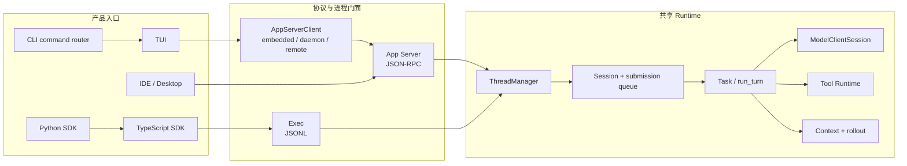
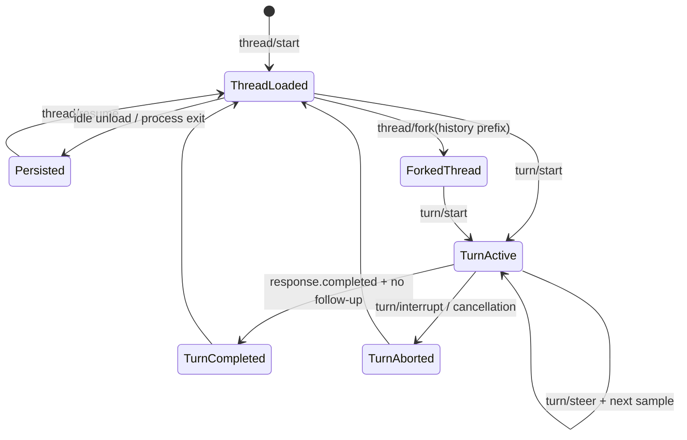
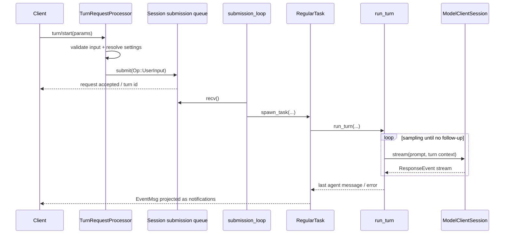
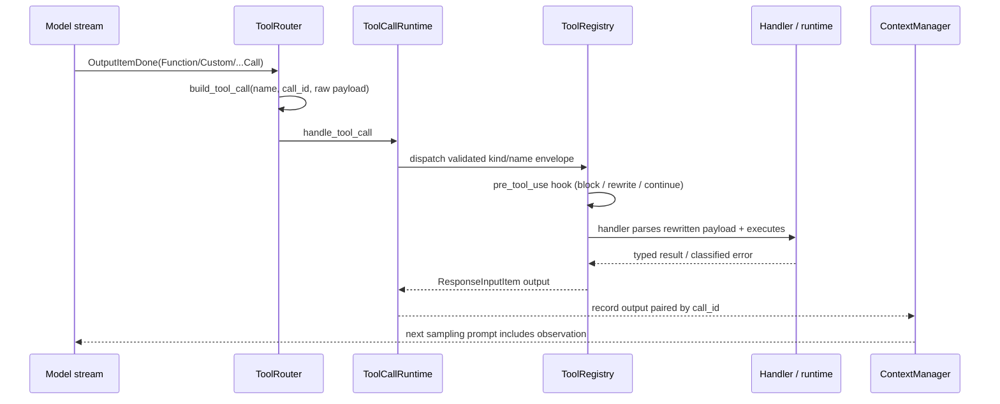
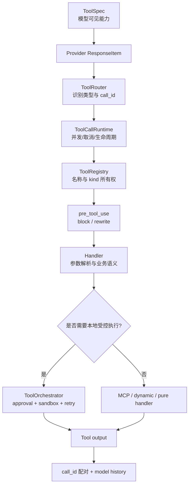
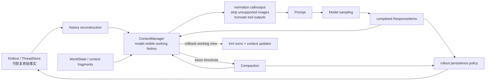
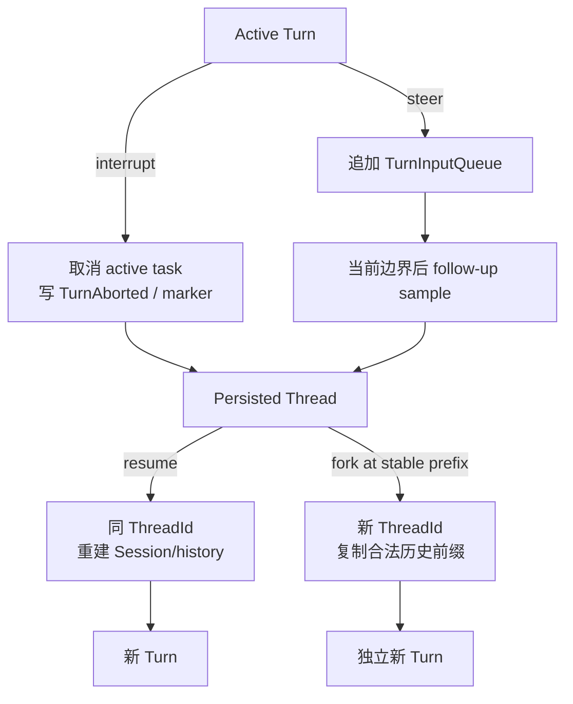
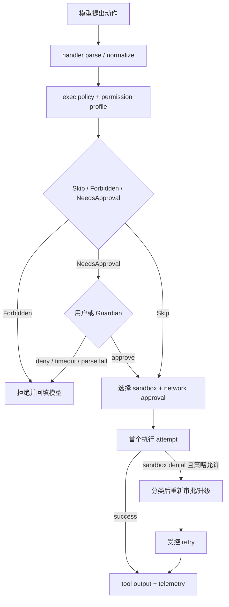
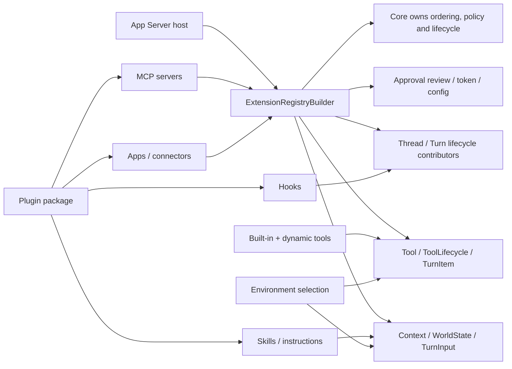
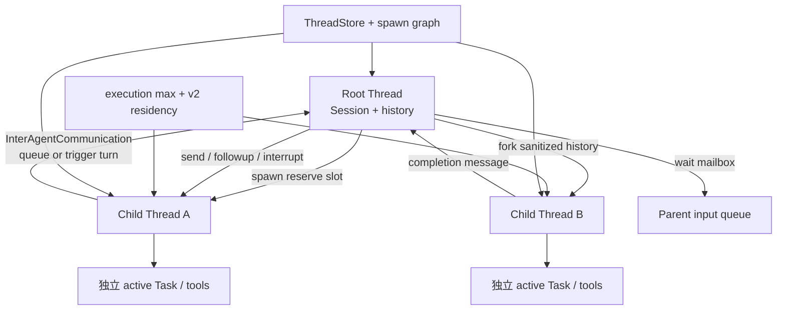

# Codex Agent 架构详细报告

## 1. 报告目的

本报告回答的不是“Codex 有哪些文件”，而是：

- 一个成熟 Agent Runtime 需要哪些稳定边界？
- Codex 为什么把一次模型调用扩展成 Thread / Turn / Task / Item / Event？
- 当前 AI SEO Agent 已经走到哪里？
- 哪些设计应迁移到云端 NestJS 项目，哪些不应照搬？

研究基于本地 Codex fork `ab6a7eb87cc8a816c88b86c44cf291e251ed2136` 与当前项目研究起点 `5f2ad11f2c65425e84392e81048364d55ec626ef`。每个领域按“源码事实—架构解释—迁移建议”组织；完整取证规则见 [research-method.md](./research-method.md)。

## 2. 执行摘要

Codex 可以被理解为一个事件驱动、工具增强、可持续运行的 Agent Runtime。它把多个产品入口收敛到共同核心，并围绕以下不变量组织系统：

1. 用户看到的 Thread 与一次执行的 Turn 分开。
2. 协议对象与内部运行对象分开。
3. 模型只提出工具调用；系统拥有执行权。
4. 工具调用结果必须回到 model history，才能形成 Agent loop。
5. model history、UI transcript、runtime event、durable log 不是同一种数据。
6. 中断、失败、审批、权限和 sandbox 都有独立语义。
7. 持久化服务于恢复和审计，不服务于复制每个流式 delta。
8. 核心 runtime 被 CLI、App、IDE、SDK 等多个入口复用。
9. 状态机和协议靠大量聚焦测试保护。

当前 AI SEO Agent 已经具备第 1、2、5、6、7 项的一部分基础，但仍然是“单次文本采样 Runtime”，还没有真正进入“模型—工具—Observation—再次采样”的 Agent loop。

## 3. Codex 的宏观分层

**源码事实**：`codex` CLI 分派交互 TUI、`exec` 与 `app-server`；当前 TUI 通过 `AppServerClient` 连接 embedded、local daemon 或 remote app-server。app-server 再持有 `ThreadManager`，把版本化请求映射到 core。TypeScript SDK 启动 Codex executable 的 `exec` JSONL 门面；Python SDK 启动 pinned Codex binary 的 `app-server` stdio JSON-RPC 门面。两者都没有复制 Rust Agent loop。



**架构解释**：复用的是生命周期、状态机和副作用所有权，不要求所有产品都使用同一种传输。TUI 改为 app-server client 进一步证明 UI 不是 canonical runtime。

**迁移建议**：NestJS 项目应让 Web、同步 API、定时任务和 Webhook 共用一个 application runtime；无需复制 JSON-RPC、Rust crate 粒度或本地进程拓扑。

| 层 | Codex 职责 | 当前项目对应 | 迁移判断 |
| --- | --- | --- | --- |
| 产品入口 | CLI、TUI、App、IDE、SDK | Vue Web、未来定时任务/Webhook | 多入口共享 runtime 的思想值得学 |
| 协议门面 | app-server JSON-RPC、exec JSONL、SDK types | Nest Controller、contracts、NDJSON | 不复制 JSON-RPC，学习稳定 contract |
| 生命周期 | ThreadManager、Thread、Turn、Task | Conversation、AgentRun、AgentStep | 已有基础，需补状态不变量 |
| Agent loop | `run_turn`、sampling、follow-up | `AgentRuntimeService` | 当前只采样一次，Tool loop 是最近缺口 |
| 模型适配 | ModelClientSession、ResponseEvent | LLMService、OpenAICompatibleClient | 需从文本 delta 升级为结构化 provider event |
| 工具体系 | spec、router、registry、runtime、orchestrator | 尚未实现 | 当前最高优先级 |
| 上下文 | ContextManager、token budget、compaction | SeoContextBuilder + 固定 12 条 history | 需从拼数组升级为上下文策略 |
| 持久化 | rollout、ThreadStore、state db | PostgreSQL Message/Run/Step | 需补恢复、幂等和查询投影 |
| 安全 | approval、permissions、sandbox、execpolicy | 尚无通用策略 | 先做业务权限和审批，不做 OS sandbox |
| 扩展 | skills、plugins、MCP、hooks | 尚无 | 内置工具稳定后再学习 |
| 协作 | child threads、agent control、mailbox | 尚无 | 单 Agent 稳定后再进入 |
| 质量 | telemetry、protocol tests、state tests、snapshots | typecheck/lint，无测试文件 | 测试是明显短板，应提前补齐 |

## 4. 核心主链路

### 4.1 客户端连接与协议初始化

Codex app-server 先完成连接级 `initialize`，再接受 thread / turn 请求。协议层负责：

- 请求、响应与通知的结构。
- client capability 协商。
- 稳定方法名和版本化类型。
- 把内部事件映射成客户端可理解的 item / delta / completion。

这说明协议门面不能直接等同于 runtime。当前项目已经用 `seo-chat-stream-event.mapper.ts` 将 `AgentRuntimeEvent` 映射为 `ChatStreamEvent`，方向正确；后续加入工具事件时，也应先扩内部事件，再谨慎决定是否暴露给前端。

关键源码与测试：

- `codex-rs/cli/src/main.rs`：`main` 对 TUI、Exec、AppServer 的命令分派。
- `codex-rs/tui/src/lib.rs`：`AppServerTarget`、`start_app_server`，选择 embedded / local daemon / remote。
- `codex-rs/app-server-protocol/src/protocol/common.rs`
- `codex-rs/app-server/src/message_processor.rs`
- `codex-rs/app-server/src/request_processors/initialize_processor.rs`
- `codex-rs/app-server/src/bespoke_event_handling.rs`
- `codex-rs/app-server/tests/suite/v2/initialize.rs`
- `codex-rs/cli/src/main.rs` 内 app-server transport/auth 参数测试。

### 4.2 Thread 生命周期

Thread 是长期工作线，负责承载多次 Turn 和可恢复历史。`ThreadManager` 负责创建、恢复、fork、加载和管理活跃线程；`Codex::spawn` 创建真正的 Session 运行态。

```text
thread/start
  -> ThreadRequestProcessor
  -> ThreadManager.start_thread_with_options
  -> spawn_thread_with_source
  -> Codex::spawn
  -> Session + submission/event channels + persistence
```



图中的 Thread 是长期身份；Turn 是一次活动边界；Response Item 是历史内容；`EventMsg` 与 app-server notification 是状态变化的投影。设计不变量是：一个 Session 同时最多一个 active Task，`TurnCompleted` 与 `TurnAborted` 不应同时成为同一 Turn 的最终事实。

设计价值：

- Thread 身份与进程内 Session 实例分离。
- 一个持久化 Thread 可以被 unload，再 resume。
- fork 明确表达“复制历史后形成新工作线”，而不是修改原历史。
- archive/delete/read/list 属于 Thread 资源管理，不混进 Turn 执行。

当前快照还把 **Goal** 建模为 Thread 级长期目标，而不是 Turn 或隐藏 prompt。`thread/goal/set|get|clear` 经 `ThreadGoalRequestProcessor` 调用 `GoalService`；Goal 保存 objective、status、token budget、tokens/time usage，并具有 Active、Paused、Blocked、UsageLimited、BudgetLimited、Complete 状态。`GoalExtension` 通过 thread/turn/tool/token contributors 计量进度、注入 continuation，并把 `ThreadGoalUpdated` 写为 durable event。Goal resume 后从 state 重新挂接 runtime，和某一次 active Turn 的内存状态分离。

**架构解释**：Thread 是身份与历史容器，Goal 是可替换的长期意图/预算状态，Turn 是一次执行。Goal 不能被当作模型 chain-of-thought；Goal 状态变化必须由 API/tool/lifecycle policy 决定并可恢复。

当前项目 `Conversation` 已经是最小 Thread，但还缺：所有权、归档、恢复语义、并发控制和运行中的 Thread 状态投影。

关键源码与测试：

- `codex-rs/core/src/thread_manager.rs`：`ThreadManager::start_thread_with_options`、`resume_thread_with_history`、`fork_thread_from_history`、`spawn_subagent`。
- `codex-rs/app-server/src/request_processors/thread_processor.rs`
- `codex-rs/thread-store/src/store.rs`：`ThreadStore`。
- `codex-rs/app-server/tests/suite/v2/thread_start.rs`：正常创建及配置/环境失败。
- `codex-rs/app-server/tests/suite/v2/thread_resume.rs`、`thread_fork.rs`：恢复、历史前缀、未物化/ephemeral 边界。
- `codex-rs/core/src/thread_manager_tests.rs`：active/stopped resume 与 interrupted fork snapshot。
- `codex-rs/app-server/src/request_processors/thread_goal_processor.rs`：Goal 协议门面与 snapshot notification。
- `codex-rs/ext/goal/src/api.rs`、`extension.rs`、`runtime.rs`、`tool.rs`：Goal state、计量与 typed extension。
- `codex-rs/ext/goal/tests/goal_extension_backend.rs`：create/update、并行 tool 计量、error/usage limit、resume/clear。
- `codex-rs/app-server/tests/suite/v2/thread_resume.rs`：paused/budget-limited Goal 的 resume 与持久化边界。

### 4.3 Turn 进入 submission queue

`turn/start` 不直接调用模型。`TurnRequestProcessor::turn_start` / `turn_start_inner` 先校验、映射输入，并允许 `TurnStartParams.model` 等 thread settings 覆盖，再把 `Op::UserInput` 提交给 Session queue。

```text
turn/start params
  -> validate and map input
  -> Op::UserInput
  -> submit
  -> submission_loop
  -> user_input_or_turn
  -> RegularTask
```



设计不变量是：协议请求只负责提交操作，active Task 的启动、中断和终态由 Session 串行所有者决定；模型 transport 不能直接决定产品层 Turn 状态。

为什么需要 queue：

- 中断、steer、approval response、tool response 都是运行期间可能到来的操作。
- runtime 需要单一顺序点维护 active turn 状态。
- 客户端请求生命周期不应直接等于模型请求生命周期。
- 后续可做背压、调度、公平性和并发限制。

当前项目的 HTTP 请求仍直接持有整个 async generator 生命周期。学习 queue 的重点不是立刻上消息队列，而是先建立“请求进入”和“运行执行”之间的可替换边界。

关键源码与测试：

- `codex-rs/app-server/src/request_processors/turn_processor.rs`：`TurnRequestProcessor::turn_start_inner` 构造并提交 `Op::UserInput`。
- `codex-rs/core/src/session/handlers.rs`：`submission_loop` 是 `Op` 的顺序消费点。
- `codex-rs/core/src/tasks/regular.rs`：`RegularTask::run`。
- `codex-rs/core/src/session/turn.rs`：`run_turn`、`try_run_sampling_request`。
- `codex-rs/app-server/tests/suite/v2/turn_start.rs`、`turn_steer.rs`、`turn_interrupt.rs`。
- `codex-rs/core/tests/suite/abort_tasks.rs`：长工具中断、历史记录与 `<turn_aborted>` 恢复标记。

### 4.4 Task 与 Turn 的分工

Codex 用 `RegularTask` 承接普通 Turn。Task 负责：

- 发送 TurnStarted。
- 准备或复用模型 session。
- 调用 `run_turn`。
- 处理运行中追加的输入。
- 返回最后的 agent message。

`run_turn` 则负责一次 Turn 内的循环、上下文、采样、工具续跑、压缩和完成条件。

Turn 内部还有两层快照：`TurnContext` 固定本 Turn 的 model、provider、approval/permission、cwd 等运行配置；`StepContext` 在每次 sampling 前捕获当时可用的 environments、selected capability roots、MCP runtime/tool list 和 `AGENTS.md`。同一 Turn 的后续 sampling 可以看见新就绪能力，但一次 sampling 广告的工具与实际执行使用同一个 Step snapshot。

**架构解释**：Step 不是数据库 `AgentStep` 的同义词。Codex StepContext 是 request-scoped capability snapshot，用来防止“模型看到的工具”和“执行时的工具”在同一次采样中漂移。

这种分层避免一个巨型 service 同时处理请求接入、调度、上下文、模型协议、工具执行和持久化。当前 `AgentRuntimeService.runTurnStream()` 已经开始承担 Task + Turn 两层职责，后续功能增多时应拆出明确的 `AgentTurnRunner` 或等价内部边界，但不要在 Tool Calling 第一小步就过早抽象。

关键源码：

- `codex-rs/core/src/tasks/regular.rs`：`RegularTask` / `SessionTask::run`。
- `codex-rs/core/src/session/turn.rs`：`run_turn`。
- `codex-rs/core/src/session/turn_context.rs`：`TurnContext`。
- `codex-rs/core/src/session/step_context.rs`：`StepContext` 与固定 MCP tool snapshot。
- `codex-rs/app-server/tests/suite/v2/selected_capability_stack.rs`：能力在两次 sampling 间变为可用，但 step 内保持一致。

### 4.5 Model Sampling 与 Agent loop

成熟 Agent 与普通 Chat 的关键差别在于：模型输出工具调用时，Turn 不结束。

```text
build prompt
  -> ModelClientSession::stream
  -> ResponseEvent stream
  -> assistant message ? complete candidate
  -> tool call ? dispatch tool
  -> record tool output into history
  -> needs_follow_up = true
  -> next sampling request
```

`run_turn` 的外层循环根据 `needs_follow_up` 决定是否继续采样。工具调用、服务端 `end_turn=false`、运行中追加输入，都可能要求继续。

当前项目的 `LLMService.chatStream()` 只 yield 文本字符串，导致 runtime 看不到 tool call、finish reason 或 usage。阶段 5 必须先升级 LLM 边界，让上层接收结构化事件，再实现 Tool loop。

该内部 contract 应只有一个故障所有者：`ModelStreamEvent` 只表达正常 text/tool/usage/completed 值；provider/network/abort 从 async iterator throw，runtime 再分类为唯一终态。OpenAI-compatible Chat Completions 还应显式请求 `include_usage`，容纳 finish reason 后到达的 `choices=[]` usage-only chunk，并在 usage 后合成唯一 completed。

当前快照还明确了一个容易遗漏的边界：`ModelClientSession` 是 **turn-scoped**，在同一 Turn 的多次采样间复用 WebSocket、sticky routing 与连接状态，但不能跨 Turn 复用，否则会把 `previous_response_id` 等 transport 状态泄漏给下一 Turn。

关键源码与测试：

- `codex-rs/core/src/client.rs`：`ModelClient`、`ModelClientSession`、`new_session`、SSE/WebSocket stream 与 retry。
- `codex-rs/codex-api/src/common.rs`：`ResponseEvent`。
- `codex-rs/core/src/session/turn.rs`：`run_turn`、`try_run_sampling_request`、`SamplingRequestResult`。
- `codex-rs/core/src/stream_events_utils.rs`：完成 item 到 runtime/UI item 的映射。
- `codex-rs/core/src/client_tests.rs`：认证刷新、WebSocket handshake、metadata 与失败路径。
- `codex-rs/core/tests/suite/pending_input.rs`：steer/mailbox 触发 follow-up 的边界测试。

### 4.6 Tool Call 处理

**源码事实**：完成的 provider item 先被识别为路由信封，再由 turn-scoped `ToolCallRuntime` 查询 registry。handler 在真正执行时解析/验证自己的 payload；结果统一转换成与 `call_id` 配对的 `ResponseInputItem`，写入历史并令 `needs_follow_up = true`。



**架构解释**：Tool call 不是 RPC 直通。模型只能提出带 raw arguments 的候选动作；registry/handler/policy 保留解释、验证和执行权。hook 改写发生在 registry dispatch 中，但改写后仍回到具体 handler 的 payload 解析与 ToolOrchestrator/policy，不获得绕过安全层的捷径。

模型输出先由 `ToolRouter::build_tool_call` 转换为内部 `ToolCall { tool_name, call_id, payload }`，再通过 registry 找到确定性 runtime。这里的 `ToolCall` 是路由信封：普通 function payload 仍含 raw JSON arguments，并不自动等于“已按具体工具 schema 验证”。Tool 结果作为 `ResponseInputItem` 写回 conversation history，触发下一次采样。

重要边界：

1. **ToolSpec**：模型可见契约。
2. **ToolRouter**：识别 provider output 并生成未验证的路由调用信封。
3. **ToolRegistry**：工具名到 runtime 的确定性映射，拒绝重复注册。
4. **Tool handler/runtime**：参数解析、业务执行、结果序列化。
5. **ToolOrchestrator**：为 shell、apply_patch、unified exec 等需要 sandbox/approval 的本地 runtime 编排审批、sandbox、特定 retry/elevation 和 telemetry；它不是所有 registry handler 的全局必经层。
6. **Observation**：回填给模型的结构化结果。

Tool search 也是同一闭环的特殊工具：client-executed `ResponseItem::ToolSearchCall` 被 router 解析为 `ToolPayload::ToolSearch`，`ToolSearchHandler` 在当前 step 的可加载 catalog 上检索并返回 `ToolSearchOutput` / loadable specs，下一轮模型才获得新增工具。它解决“大 catalog 不应全部塞进 prompt”，不改变 registry 和 policy 的最终执行权。

参数流式增量只用于可选预览。`try_run_sampling_request` 在 `OutputItemAdded` 时向 runtime 申请 `ToolArgumentDiffConsumer`；例如 apply-patch consumer 将 partial input 解析成 `PatchApplyUpdated`。真正 dispatch 仍等待 `OutputItemDone` 和完整 payload，partial arguments 不能触发副作用。



设计不变量是：spec 暴露、名称路由、参数验证、副作用授权、执行与 observation 配对属于不同责任；`ToolOrchestrator` 只覆盖实现 `ToolRuntime` 的本地受控执行，不是所有工具的万能中间件。

当前阶段 5 文档已经提出 `ToolDefinition / ToolRegistry / ToolExecutor`，方向正确。还应显式补上 `UnvalidatedToolCallEnvelope -> ValidatedToolInvocation`、`ToolResult/Observation` 和 provider event adapter，否则 registry 只是一个孤立容器，raw arguments 也可能绕过验证。

关键源码与测试：

- `codex-rs/tools/src/tool_spec.rs`：`ToolSpec`。
- `codex-rs/core/src/tools/router.rs`：`ToolCall`、`ToolRouter::build_tool_call` 与 dispatch。
- `codex-rs/core/src/tools/parallel.rs`：`ToolCallRuntime`、取消与 ordered future。
- `codex-rs/core/src/tools/registry.rs`：`ToolRegistry::dispatch_any_with_terminal_outcome`、pre/post hooks 与 handler。
- `codex-rs/core/src/tools/orchestrator.rs`：本地 `ToolRuntime` 的 approval/sandbox/attempt。
- `codex-rs/core/src/tools/handlers/tool_search.rs`：deferred catalog search 与 loadable specs。
- `codex-rs/core/src/tools/handlers/apply_patch.rs`：`ApplyPatchArgumentDiffConsumer` 只生成预览事件。
- `codex-rs/core/src/tools/router_tests.rs`、`registry_tests.rs`：unsupported/kind/parallel/hook contract。
- `codex-rs/core/tests/suite/tool_harness.rs`：正常执行与 malformed payload。
- `codex-rs/core/tests/suite/hooks.rs`：执行前阻断、shell/apply_patch/function input rewrite。
- `codex-rs/core/tests/suite/plugins.rs`、`tools/handlers/mcp_search_tests.rs`：tool search provenance 与 catalog metadata。

### 4.7 并行工具与顺序一致性

**源码事实**：Session submission 使用有界 `async_channel`，`active_turn` 只容纳一个 active Task；steer、mailbox 与其他 pending input 进入 `TurnInputQueue`。一次 sampling 内，声明可并行的工具可提前创建 future，但 `FuturesOrdered` 在 response completion 前 drain，并以可预测顺序把 output 写回 history。每个 tool future 继承 child `CancellationToken`，terminal lifecycle 通过原子标志避免完成与 aborted 双发。

这背后的学习点不是“越并行越好”，而是：

- 工具必须声明是否安全并行。
- 共享状态更新需要顺序和原子性。
- 并行执行结果写回模型时仍要保证 call/output 配对。
- 中断要能传播到所有 in-flight tool。

当前 SEO Agent 第一版只应顺序执行一个只读工具。等单工具 loop、错误语义和 step 记录稳定后，再实现有界并行。

测试证据：`core/tests/suite/tool_parallelism.rs` 覆盖并行启动、mixed tools 与结果分组；`core/src/tools/parallel.rs` 的模块测试覆盖 dispatch 前取消、handler 已完成后的取消和等待 runtime cleanup 的 aborted 生命周期。

`core/src/session/tests.rs::submission_loop_channel_close_aborts_active_turn_before_thread_stop_lifecycle` 证明 channel 关闭时先取消 active Turn 再停止 Thread；`core/tests/suite/pending_input.rs` 证明 steer/mailbox 只能在合法 sampling 边界触发 follow-up；`app-server/tests/suite/v2/thread_unsubscribe.rs` 证明客户端 unsubscribe 不等于取消正在运行的 Turn。

**架构解释**：背压存在于 submission/runtime channel 与 agent 容量边界，不能简单推导为“所有内部 channel 都有界”；app-server listener 仍有 unbounded channel，因此 slow consumer 的产品级治理是另一层问题。

### 4.8 Runtime Event 与 UI Item

Codex 区分：

- provider 的 `ResponseEvent`
- core 的 `EventMsg`
- app-server 的 notification
- UI 的 `TurnItem`
- rollout 的持久化 item

Item 与 Event 不是同义词：Item 是有身份、内容和完成形态的语义对象；Event/notification 描述 item 或 turn 的 started/delta/completed 等生命周期。`ResponseEvent::OutputItemDone(item)` 恰好说明“事件携带一个完成 item”，不是把两层合并。

这种分层避免 provider chunk 直接污染产品协议。当前项目已具备 `LLM delta -> AgentRuntimeEvent -> ChatStreamEvent -> Vue state` 的最小版本，但内部事件仍只有文本生命周期。工具阶段应先增加内部工具事实，外部是否展示另行决策。

### 4.9 ContextManager 与历史不变量



设计不变量是：durable append-only facts、恢复投影与当前模型窗口不是同一份数组；compaction/rollback 可以改变 model view，但必须保留足以恢复、审计和继续配对的事实。

Codex 的 ContextManager 不只是“截取最近 N 条”，它负责：

- 保存 model-visible ResponseItem。
- 估算 token 使用。
- 规范化 call/output 配对。
- 移除孤立 tool output。
- 根据模型能力移除图片。
- 截断过大的 tool output。
- rollback 时维护 context baseline。
- 记录 world state diff。

关键不变量：每个 tool call 必须有对应 output，每个 output 必须能找到 call。这个不变量应成为当前项目阶段 5 的测试重点。

关键源码与测试：

- `codex-rs/core/src/context_manager/history.rs`：`ContextManager`、`normalize_history`、rollback/token 视图。
- `codex-rs/core/src/context_manager/normalize.rs`：补 call output、移除 orphan output、图片能力归一化。
- `codex-rs/core/src/context/world_state`：跨 Turn 的可替换 context fragments。
- `codex-rs/core/src/context_manager/history_tests.rs`：call/output 成对删除、图片、截断、rollback/context update。
- `codex-rs/core/tests/suite/truncation.rs`：tool/MCP output 上限与只截断一次。

### 4.10 Token 预算与 Compaction

Codex 在每次采样后收集 token 状态，达到阈值且仍需 follow-up 时执行 compaction，再继续 Turn。它把 compaction 视为 runtime 能力，而不是 UI 的“清空聊天”。

当前项目固定读取最近 12 条消息，简单但无法回答：

- system prompt、历史、tool output 各占多少预算？
- 一个超长 tool output 如何处理？
- 压缩后保留哪些业务事实？
- summary 是否能被审计和替换？

因此 Context 阶段应从预算模型开始，而不是直接做复杂摘要算法。

当前快照还把 token-budget compaction 统一建模为 `ContextCompaction` 生命周期：manual 与 inline auto-compaction 都运行 compact hooks、建立新 window，并在 follow-up 前复位预算。`core/tests/suite/token_budget.rs` 验证阈值、hooks、新 window 和 mid-turn follow-up；`compact_resume_fork.rs` 验证压缩后 resume/fork 得到相同 model history view。

### 4.11 Durable Facts 与 Rollout

**源码事实**：`rollout::policy::is_persisted_rollout_item` 明确筛选 durable facts。高频 delta、approval request、临时 begin、warning 和大部分 UI 状态不写入；Response Item、Turn start/complete/abort、token、goal、settings、compaction、world state 与 turn context 构成恢复输入。`ThreadStore` 是 storage-neutral trait，负责 create/resume/append/persist/flush/load/list；local、in-memory 或远端实现必须共享 rollout persistence policy。

当前快照同时支持 `ThreadHistoryMode::Legacy` 与 `Paginated`：legacy 依赖部分旧 EventMsg；paginated 以完成的 `TurnItem` 投影历史。`app-server-protocol/protocol/thread_history_projection.rs` 负责投影，不应让 UI notification 反向成为 canonical history。

当前项目将 `Message`、`AgentRun`、`AgentStep` 落 PostgreSQL，方向正确。但未来工具 loop 需要决定：

- 工具 call arguments 是否作为 step input 持久化？
- output 是否需要脱敏、截断或外部存储？
- 每次模型采样是一个 step 还是 attempt？
- 重试后如何避免重复副作用？
- 服务重启后如何识别僵尸 RUNNING？

其中 provider transport retry、Agent sampling follow-up 和 tool execution retry 必须分开。可靠性阶段只记录 idempotent/version/attempt 并默认执行一次；直到 durable checkpoint、幂等键和“工具可能已成功”的 outcome reconciliation 成立后，恢复阶段才能安全决定第二 attempt。

关键源码与测试：

- `codex-rs/rollout/src/policy.rs`：`is_persisted_rollout_item` / `should_persist_*`。
- `codex-rs/rollout/src/recorder.rs`：append、flush 与失败传播。
- `codex-rs/thread-store/src/store.rs`：`ThreadStore` trait。
- `codex-rs/app-server-protocol/src/protocol/thread_history_projection.rs`：paginated history 投影。
- `codex-rs/rollout/src/recorder_tests.rs`：append/flush/损坏与持久化失败。
- `codex-rs/core/src/session/rollout_reconstruction_tests.rs`、`compact_resume_fork.rs`：恢复与历史合法性。
- `codex-rs/app-server-protocol/src/protocol/thread_history_projection_tests.rs`：Item/Turn 投影边界。

### 4.12 中断、Steer、Resume 与 Fork

这四个概念不能混为一个“继续聊天”按钮：

- interrupt：停止当前 Turn。
- steer：当前 Turn 尚未结束时追加输入。
- resume：重新加载已有 Thread 并继续新 Turn。
- fork：复制一段历史形成新 Thread。



设计不变量是：interrupt 改变当前 Turn 终态；steer 只进入当前 Turn 的输入队列；resume 保留 Thread 身份；fork 必须产生新身份且不回写源历史。mid-turn fork 会先物化/截断到合法边界，不能复制半个无 output 的工具调用。

当前项目已支持浏览器断开触发 AbortSignal，并把 Message / Run / Step 收为 `ABORTED`。这是 interrupt 的基础。下一步应先处理服务端重启和重复请求，再考虑 steer/fork；否则只增加 API 名称，没有一致性基础。

### 4.13 Approval、Permission 与 Sandbox

Codex 的 ToolOrchestrator 对使用它的本地 sandbox runtime 明确先决定 Approval，再选择 sandbox 执行，失败后是否升级也有独立策略。不要把这条局部执行路线描述为所有 Codex 工具的统一全局管线；MCP 等 handler 有各自路径。

```text
tool call
  -> permission / policy decision
  -> approval if required
  -> sandbox selection
  -> first attempt
  -> classified failure
  -> optional re-approval / retry
```



设计不变量是：模型、hook 或工具输入都不能自行扩大 permission profile；approval 是一次动作决策，sandbox 是强制执行边界，exec policy 是规则判断，Guardian 是可选 reviewer。任何输入改写都必须在最终执行参数上重新经过 handler 和 policy。

云端 SEO Agent 的翻译：

- permission：用户/租户是否能用这个工具、访问这份资源。
- approval：有外部副作用的动作是否获得本次确认。
- isolation：HTTP 超时、出站域名、凭证隔离、worker 权限和容器边界。

现在不执行 shell，因此无需照搬 OS sandbox，但不能因此跳过鉴权、审批和审计。

关键源码与测试：

- `codex-rs/core/src/config/permissions.rs`：permission profile 编译与继承。
- `codex-rs/core/src/exec_policy.rs`：命令规则与 approval requirement。
- `codex-rs/core/src/tools/approvals.rs`：用户/Guardian reviewer 选择。
- `codex-rs/core/src/tools/orchestrator.rs`：approval、sandbox、network approval 与 retry。
- `codex-rs/core/src/tools/sandboxing.rs`
- `codex-rs/core/src/guardian`：风险审查、失败关闭与拒绝 circuit breaker。
- `codex-rs/core/src/config/permissions_tests.rs`、`exec_policy_tests.rs`、`tools/sandboxing_tests.rs`。
- `codex-rs/core/tests/suite/request_permissions.rs`：临时 grant 的 scope、拒绝与跨 Turn 边界。
- `codex-rs/core/tests/suite/guardian_review.rs`：允许复用与拒绝回填。

### 4.14 扩展系统

**源码事实**：Codex 支持 built-in tools、dynamic tools、MCP、skills、plugins、hooks、Apps、Environments，以及新的 typed `ExtensionRegistry`。registry 允许 host 按注册顺序贡献 thread/turn lifecycle、config、token usage、skill invocation、context/world state、MCP server、turn input、tool、tool lifecycle、turn item 与 approval review；扩展拿到稳定 ID 和私有 `ExtensionData`，而不是随意持有整个 Session。



设计不变量是：扩展只能贡献自己拥有的能力，host 保留排序、冲突处理、权限和生命周期控制；Plugin 是分发/组合单元，Skill 是指令资源，MCP 是外部工具/资源协议，Hook 是生命周期拦截，App/Environment 是能力来源，不能互换术语。

1. 内置工具验证最小闭环。
2. registry 和统一 result contract 稳定。
3. 外部工具协议接入。
4. 可复用指令包和生命周期 hook。
5. 插件分发、版本和信任策略。

当前项目到第 1 步都未完成，所以 MCP 和插件系统应明确放到后期。

关键源码与测试：

- `codex-rs/ext/extension-api/src/registry.rs`、`contributors.rs`：typed registry 与贡献点。
- `codex-rs/core/src/tools/spec_plan.rs`、`handlers/dynamic.rs`、`handlers/mcp.rs`、`handlers/extension_tools.rs`：工具汇合。
- `codex-rs/core/src/context/world_state`：Apps/Plugins 等动态上下文投影。
- `codex-rs/hooks/src`、`codex-rs/plugin/src`、`codex-rs/core/src/skills.rs`、`environment_selection.rs`。
- `codex-rs/ext/extension-api/tests/registry.rs`：所有 contributor category 与注册顺序。
- `codex-rs/core/tests/suite/hooks.rs`、`rmcp_client.rs`、`plugins.rs`，以及 app-server 的 skills/plugins/hooks/dynamic-tools tests。

### 4.15 Multi-agent

**源码事实**：Codex 的 subagent 是独立 Thread，有 `parent_thread_id` / spawn graph、自己的 Session/history/permission inheritance、执行容量与 v2 residency。`AgentControl` 负责 spawn/resume/send/interrupt/list，spawn 可从空上下文或父历史的 full/last-N snapshot 开始；fork 前先 materialize/flush 父 rollout，并清除不应继承的 usage hints。v2 的 `InterAgentCommunication` 可只入队 mailbox，也可触发 Turn；child completion 会向直接 parent 入队消息。



设计不变量是：工具并行共享一个 Turn/context；Multi-agent 则创建独立 Thread 和执行容量。子 Agent 的 permission/environment 可以继承或收窄，但模型不能借 spawn 扩权；parent/child 消息是持久化通信事实，不等于共享可变 history。

迁移前置条件：

- 单 Agent tool loop 稳定。
- Run/Step 可恢复。
- 工具权限可继承或收窄。
- 并发和成本预算可控。
- 父子任务结果有确定 contract。

因此 Multi-agent 是学习路线后段，而不是阶段 5 的延伸任务。

测试证据：`codex-rs/core/src/agent/control_tests.rs` 覆盖 fork 清洗、flush-before-snapshot、max threads、slot release、child completion 和 v2 parent mail；`codex-rs/core/src/agent/control/execution_tests.rs` 与 `residency_tests.rs` 覆盖运行容量与 idle eviction；`codex-rs/core/tests/suite/pending_input.rs` 覆盖 mailbox 在 reasoning/commentary 边界触发 follow-up。

### 4.16 SDK 与多入口共享 Runtime

Codex SDK 复用已有 runtime 和协议，不在 SDK 内重新实现 Agent loop。当前项目未来若增加：

- 定时 SEO 巡检
- webhook 触发任务
- 内部运营批处理
- 第三方 SDK

这些入口都应调用同一个 application runtime，而不是复制 `LLMService.chatStream()`。

当前项目已经存在一个具体反例：同步 `SeoService.chat()` 直接调用 `LLMService.chat()`，streaming 入口才走 `AgentRuntimeService`。Tool loop 阶段必须让同步接口消费同一个 turn runner 到 terminal，或明确禁用 tool mode；不能维持两套 context、persistence 和错误语义。

### 4.17 测试与可观测性

Codex 的架构可信度很大程度来自测试密度：core、app-server、rollout、SDK 都有聚焦测试。测试覆盖协议、状态机、工具路由、并发、中断、压缩、持久化和失败路径。

当前项目只有 typecheck 和 lint，没有任何 `.test` / `.spec` 文件。这意味着阶段 5 如果直接实现 Tool Calling，会在最需要状态机保护时继续扩大无测试代码。

建议在 Tool Contract 阶段先建立：

- 纯函数单元测试。
- fake LLM event stream。
- fake tool executor。
- runtime 状态机集成测试。
- NDJSON contract 测试。
- recorder transaction 测试。

**源码事实**：可观测性并非单一日志模块。`ModelClientSession` 记录 transport retry/usage；`try_run_sampling_request` 建立 receiving/handle_response spans；ToolRegistry/Orchestrator 记录 tool name、call id、sandbox、decision source、result 与延迟；`TurnTimingState` 维护 TTFT、sampling/tool/profile 时间；rollout persistence 有独立 metrics；app-server notifications 还会进入 analytics reducer。trace-safe 与 log-only target 在 OTEL provider 中分开，避免把任意日志自动当可导出 trace。

质量保护分四层：protocol 序列化/投影 tests，模块状态单测，使用 fake Responses/MCP 的 core/app-server integration suite，以及 snapshot tests。`core/tests/common/responses.rs` 和 streaming SSE helpers 让复杂状态机无需真实 provider 即可复现失败顺序。

### 4.18 产品层投影：Core Event 不是 UI Canonical State

**源码事实**：Core 的 `EventMsg` 由 `app-server/src/bespoke_event_handling.rs` 转成版本化 `ServerNotification`。`ItemStarted` / delta / `ItemCompleted` 描述展示生命周期；durable paginated history 则由 `thread_history_projection::project_rollout_line` 从 `TurnStarted`、`TurnComplete`、`TurnAborted` 与完成的 `TurnItem` 无状态投影。unsubscribe 只移除连接订阅，不停止 active Turn。

**架构解释**：实时 notification、当前连接缓存与 canonical rollout 是三层状态。重连客户端应从 Thread history/status 恢复，再继续订阅增量；不能把“最后收到的 delta”当完成事实，也不能把 analytics reducer 反向当业务状态所有者。

关键证据：

- `codex-rs/core/src/event_mapping.rs`：内部 item/event 兼容映射。
- `codex-rs/app-server/src/bespoke_event_handling.rs`：Core event 到 notification。
- `codex-rs/app-server-protocol/src/protocol/thread_history_projection.rs`：paginated rollout 到 Thread/Turn/Item change set。
- `thread_history_projection_tests.rs`：completed/failed/aborted/item 投影与无 turn-id abort 忽略。
- `app-server/tests/suite/v2/thread_unsubscribe.rs`、`thread_read.rs`、`thread_status.rs`：连接与 canonical state 边界。

### 4.19 App Server 并发协议：按资源串行，而不是全局串行

**源码事实**：`ClientRequest` 的协议定义同时声明请求参数、稳定/实验状态和 `serialization_scope()`。scope 不是一个布尔锁，而是带资源标识的枚举：全局配置、Thread、ThreadPath、命令进程、通用进程、模糊搜索会话、文件监听与 MCP OAuth 各自形成队列键。`GlobalSharedRead` 与同名 `Global` 共用资源键，但前者以 shared read 进入队列；没有 scope 的请求直接并发执行。连接级 `ConnectionRpcGate` 仍包裹每个已初始化请求，因此“资源顺序”和“连接关闭/请求取消”是两个独立维度。

```text
ClientRequest
  -> initialized / experimental capability check
  -> serialization_scope()
      -> None: spawn concurrently
      -> key + SharedRead/Exclusive
          -> RequestSerializationQueues
          -> ConnectionRpcGate
          -> request processor
```

这避免了两个相反错误：把所有 RPC 放进单一全局队列会让无关 Thread 互相阻塞；完全并发又会让同一 Thread 的 resume、goal、interrupt 或同一配置资源的读写失序。`thread_or_path` 还处理尚未物化 Thread 只有 rollout path 的阶段，使冷恢复和已加载 Thread 能落到可比较的资源所有权上。

**重连顺序不变量**：运行中 Thread 的 `resume response` 不是先读 history、再另行订阅。它被封装为 `ThreadListenerCommand::SendThreadResumeResponse`，在 listener 上下文内读取 `active_turn_snapshot()`、组装历史、检查 pending unload、把 connection 加入订阅并发送响应。Goal 更新/清除、server request resolution 也进入同一 listener command 流，从而与 resume 建立明确先后关系。unsubscribe 只移除连接；只有 Thread 同时“无订阅者且 inactive”超过延迟，才取消待处理回调、shutdown、移除 watch 并发出 `thread/closed`。

**能力协商不变量**：`initialize` 必须先完成；实验请求只有连接声明 `experimentalApi` 后才能执行。`optOutNotificationMethods` 是逐连接的通知过滤，不改变 Runtime 或 durable history。`mcpServerOpenaiFormElicitation` 和 attestation 也属于客户端能力，不能由服务端从客户端名称猜测。

关键证据与失败测试：

- `codex-rs/app-server-protocol/src/protocol/common.rs`：scope 宏、资源键提取和 experimental 标注。
- `codex-rs/app-server/src/request_serialization.rs`：shared read / exclusive 队列与连接 gate。
- `codex-rs/app-server/src/message_processor.rs`：initialized、experimental 与调度入口。
- `codex-rs/app-server/src/thread_state.rs`、`request_processors/thread_lifecycle.rs`：listener generation、原子 resume/subscribe、延迟 unload。
- `app-server-protocol` 的 scope tests 覆盖 keyed/unkeyed 请求；`thread_resume.rs` 覆盖运行中重连、pending approval 重放、历史冲突和关闭中拒绝；`thread_unsubscribe.rs` 与 `thread_status.rs` 覆盖连接退出不终止 Turn、通知 opt-out 与 status 生命周期。

映射到当前项目：未来若支持同一会话多客户端、后台 Run 或管理端控制，不应先造一个全局 mutex。应先列出资源所有者（Conversation、AgentRun、Tool approval、全局 provider config），只对会改变同一资源状态的命令串行；读取可在证明快照一致后共享。

### 4.20 模型传输：三种状态寿命与两层重试

`ModelClient` 看似只是 provider client，实际刻意分开三种寿命：

| 状态 | 寿命 | 例子 | 不能越界的原因 |
| --- | --- | --- | --- |
| Session | Codex Thread/Session | provider、auth、conversation id、WebSocket→HTTP fallback 开关 | fallback 后继续反复尝试 WS 会制造抖动 |
| Turn | `ModelClientSession` | WS connection、last request/response、`x-codex-turn-state` | sticky routing token 跨 Turn 会路由到错误服务端状态 |
| Sampling attempt | 单次 request/stream | inference trace attempt、SSE/WS telemetry、已完成 output items | retry 必须能区分失败、取消与完成 |

**增量请求不是“有 response id 就用”**。只有上次 response 已完成、当前 input 以前次 input 加前次 output 为前缀，并且 model、instructions、tools、tool choice、reasoning、store、service tier、text 等上下文字段一致时，才发送 `previous_response_id + delta input`。任一条件不满足、上次 response 报错或连接重建，都会退回 full `response.create`。`client_metadata` 和 stream delivery options 不参与上下文等价判断，因为它们描述本次传输而非 server-side response context。

**preconnect 与 prewarm 不同**：preconnect 只建立连接，不发送 prompt；v2 prewarm 发送 `generate=false` 并等待 `Completed`，为首个真实请求建立可复用 response id，但不记为模型推理 trace。若真实请求沿用这个未追踪的 response id，inference trace 仍记录逻辑上的完整 request，而不是线上压缩后的 delta，保证 rollout 可审计。

**两层失败恢复**：

1. 建连/首请求遇到 `401` 时，auth manager 可以刷新一次认证并重建 client setup；`426 Upgrade Required` 明确切到 HTTP。
2. 已进入 sampling loop 后，只有 `CodexErr::is_retryable()` 的 stream 错误进入有上限的 backoff。WS retry 预算耗尽时先激活一次 session-scoped HTTP fallback、清零计数并继续；HTTP 预算也耗尽才把错误返回。`ContextWindowExceeded` 与 `UsageLimitReached` 不重试，前者把 token 状态标 full，后者先保存 rate-limit snapshot。

`map_response_events` 使用有界 channel 把 provider stream 转成 Core `ResponseStream`：收集 `OutputItemDone` 作为本次 attempt 的可审计输出；只有 `Completed` 才发布 `LastResponse` 供下一次增量；consumer drop 记录 cancelled，provider error 记录 failed，stream 无 `Completed` 则由 sampling 层判为断流。这样“收到一些 delta”不会错误地晋升成可复用完成事实。

关键测试：

- `client_websockets.rs::responses_websocket_uses_incremental_create_on_prefix` 与 non-prefix/non-input-field variants 证明增量判定。
- `responses_websocket_v2_after_error_uses_full_create_without_previous_response_id` 证明失败后清除 server-side continuation 假设。
- `responses_websocket_connection_limit_error_reconnects_and_completes` 证明连接级错误可在预算内重连。
- preconnect/prewarm、session drop、turn metadata、rate limit 与 terminal error tests 证明传输优化不改变逻辑请求。
- `client.rs::incomplete_response_emits_content_filter_error_message` 与 `history_dedupes_streamed_and_final_messages_across_turns` 保护断流错误和 streamed/final 去重。

映射到当前项目：`OpenAICompatibleClient` 可以先只实现 HTTP SSE，但 `LLMService` 必须把 provider error 分类为“不可重试业务错误 / 可重试传输错误 / 用户取消”，并让 AgentRuntime 拥有 retry 上限。不要在 axios/fetch adapter、Runtime 和 Controller 各重试一次；三层相乘会重复扣费，也无法证明已落盘的 delta 属于哪次 attempt。

### 4.21 持久化写屏障：JSONL 事实先于 SQLite 索引

Codex 本地持久化不是把同一份状态随意双写到 JSONL 和 SQLite，而是给两者不同职责：rollout JSONL 保存可恢复的顺序事实，state DB 保存列表、搜索、Goal 等派生/运营状态。`LocalThreadStore::append_items` 先把按 history mode 过滤后的 canonical items 交给 `RolloutRecorder`，随后等待 `flush()`；只有 flush 成功后，`LiveThread` 才更新 metadata。因此 SQLite 不会宣称存在一个 JSONL 尚未接受的 live append。

```text
canonical RolloutItem
  -> bounded writer queue
  -> pending_items
  -> JSONL write + file flush       durable barrier
  -> metadata/state DB update       searchable projection

startup / repair
  -> scan JSONL metadata
  -> leased backfill + watermark
  -> state DB becomes readable
```

**延迟物化**：新 Thread 创建 recorder 时只预计算路径和 `SessionMeta`，不会立刻创建空文件。首批可持久化 item 到来后，`persist/flush/shutdown` 才创建目录、写 metadata 和 pending items。空而未使用的会话因此不会污染 thread list；`persist()` 可重复调用。

**失败不丢后缀**：writer 独占 file handle，通过容量 256 的 channel 接收命令。item 先进入 `pending_items`，只有单条写成功才从队首移除并推进 ordinal。I/O 失败会丢弃 handle、保留未写 suffix，再 reopen 重试一次；二次失败通过 barrier ack 返回，但 writer 仍可接受未来的 flush/shutdown 重试。background task 真正终止时，`terminal_failure` 被 recorder clones 读取，避免 channel closed 把根因抹成泛化错误。

**Paginated ordinal 是追加序列，不是假定连续数组**：新文件从 0 开始；resume 时先从首条 `SessionMeta` 判 history mode，再用 8 KiB 逆向 scanner 找最后一条可解析 JSONL，下一 ordinal 取 `last + 1`。中间 gap 合法，尾部坏 JSON 可跳过，非换行结尾会先补换行；`u64` overflow 在写入前失败。这样 crash 留下的坏尾部不会覆盖既有事实，也不会把历史长度误当序号。

**State DB 启动门**：初始化 SQLite、迁移后，进程必须通过 rollout metadata backfill gate 才拿到 handle。backfill 用单例 row、lease、watermark 和 completed 状态支持多进程竞争与断点续作；超时会让初始化失败，而不是暴露半填充索引。thread list/read 在 DB 缺失、查询失败或 path stale 时有带 telemetry 的 filesystem scan/repair fallback。

**损坏恢复是定点的**：只在 SQLite 明确返回 corruption/not-a-database code 或 message 时，入口层才把出错数据库及其 sidecars 移入唯一 backup 目录后重建；“database locked/busy”不算 corruption，路径字符串里含 `corrupt` 也不算。state、logs、goals、memories 是独立数据库，恢复一个不应顺带删除其余数据。

关键测试：

- `rollout/src/recorder_tests.rs`：deferred materialization、persist retry、writer reopen、ordinal gap/坏尾/overflow、stale path repair。
- `reverse_jsonl_scanner_tests.rs`：坏 JSON 后继续、EOF 无换行、空行和跨 8 KiB chunk record。
- `thread-store/src/local/live_writer.rs` 的 flush barrier 保证 SQLite 不超前。
- `rollout/src/state_db_tests.rs`、`metadata_tests.rs` 与 `state/src/runtime/backfill.rs`：单 worker lease、watermark、缺失 singleton 修复、startup completion gate。
- `state/src/runtime/recovery_tests.rs`：仅备份目标 DB、区分 corruption 与 lock、保留其他 runtime DB。

映射到当前项目：当前 Prisma transaction 能保证单库 Run/Step/Message 原子性，但未来若增加事件日志或对象存储，必须指定一个 canonical writer 和显式 barrier。不能先提交 `AgentStep=COMPLETED`，再异步写 tool output；进程崩溃时会得到“步骤完成但 observation 不存在”的不可恢复状态。

### 4.22 安全决策组合：扩展建议、权限交集、执行强制

Codex 的安全不是一条 `if approved`，而是多个不同可信度的决策源按固定顺序组合：

```text
model proposes tool input
  -> PreToolUse hook: block / validated rewrite / context
  -> exec policy + approval policy
  -> user or Guardian review
  -> PermissionProfile + sandbox selection
  -> managed network decision
  -> handler executes
  -> PostToolUse hook: filter model-visible result / context
```

**Hook 不是最终安全边界**：PreToolUse 任一明确 deny 会阻止 handler；多个 rewrite 以“实际最后完成的 hook”为准，而不是配置顺序，然后必须经过对应 handler 的 `with_updated_hook_input` 重新解析。hook 输出 JSON 无法解析、使用不支持字段或 serialization 失败时会标记 hook failed，但工具流程 fail-open；因此真正的禁止必须仍由 exec policy、approval、PermissionProfile 或 sandbox 强制。PostToolUse 发生在 handler 成功之后，它的 block 只能拒绝/替换交给模型的 result，不能声称已经撤销文件或进程副作用。

**动态权限只取交集**：`request_permissions` 先把相对路径解析到所选 environment 的 cwd，正规化 additional permissions，并拒绝空请求或未知/非本机 environment。`Never` 或 granular policy 禁用该能力时自动返回空权限。客户端/Guardian 回应即使给得更多，也要与“模型原始请求”求交集；`strict_auto_review + Session scope` 被降为无授权，避免一次自动评审产生跨 Turn 长期权力。

授权按 scope 进入不同所有者：Turn grant 写入发起请求的 `TurnState`，Session grant 才写入 `SessionState`；response 到达时以 pending call id 取回原始 request/environment，unmatched id 被忽略。即使 active Turn 已推进，代码仍持有 originating turn state，避免异步 approval 把权限误授给后来 Turn。

**Sandbox escalation 不是盲目重跑**：Orchestrator 先计算 `Skip / Forbidden / NeedsApproval`，再选首个 sandbox。只有错误确认为 `SandboxErr::Denied`、tool 声明可 escalation、policy 允许 unsandboxed 或可解释的 network prompt 时，才构造第二次 attempt。strict auto-review 的首轮批准只覆盖 sandboxed attempt，绕过 sandbox 必须再评审；普通已批准请求仅在明确的 bypass 条件下复用，避免同一 call 重复弹窗。

**网络授权比 host 字符串更细**：pending/session key 包含 environment、lowercase host、protocol、port；相同 key 的并发请求共享 owner decision，不同端口或 environment 不合并。managed proxy 把 blocked request 归因到 execution registration；多 active call 且无法归因时不会猜测。Immediate mode 在命令返回前 finalize，Deferred mode 把 cancellation/outcome 句柄带到后续消费点；用户 deny 与 policy deny 都会使工具结果失败。

**Guardian 是隔离的自动 reviewer**：review session 固定 read-only、`AskForApproval::Never`，关闭 hooks、skills instructions、memories、MCP、apps、plugins、web search、multi-agent/code mode 等非必要能力，并有 90 秒 deadline。timeout、执行失败或 malformed structured output 均 fail closed。为避免模型反复请求形成拒绝循环，同一 Turn 连续 3 次 denial，或最近 50 次 review 中累计 10 次 denial，会只触发一次 Turn interrupt；一次非 denial 只重置连续计数，不抹去滑动窗口。

关键测试：

- `hooks/events/pre_tool_use.rs`：deny、last-completed rewrite、invalid output fail-open；`post_tool_use.rs` 与 ToolRegistry 证明 post block 不撤销执行。
- `session/tests.rs` 与 `session/tests/guardian_tests.rs`：pending call id、originating Turn、权限交集、session cwd materialization、granular auto-deny、Guardian cancellation/strict review。
- `tools/sandboxing_tests.rs` 与 Orchestrator tests：granular prompt、policy skip、deny-read、首轮/二轮 sandbox。
- `tools/network_approval_tests.rs`：host/protocol/port/environment key、waiter dedupe、attribution ambiguity、deferred idempotent finish。
- `guardian/tests.rs`：3 次连续、50 中 10 次窗口、review config 能力收缩与 timeout。

映射到当前项目：第一版 Tool Calling 不需要复制 Guardian，但必须把 `ToolDefinition` 的副作用等级、approval requirement、运行时权限和 handler 输入验证放在模型之外。若以后增加 hook，明确标注它是可观测/策略扩展还是强制安全控制；不能让一个配置错误就 fail-open 的 hook 成为唯一授权层。

### 4.23 Typed Extension：扩展点由生命周期所有者定义

Codex 的 `ExtensionRegistry` 不注册一个万能 `onEvent(any)`，而是把宿主愿意开放的能力拆成 typed contributors：Thread/Turn lifecycle、config、token usage、skill invocation、context、MCP server、turn input、native tool、tool lifecycle、turn item 与 approval review。Builder 完成后 registry 不可变，运行中只读取固定 contributor 序列，避免插件在半个 Turn 中动态改写扩展拓扑。

**状态按宿主生命周期分箱**：`ExtensionData` 是以 Rust `TypeId` 为 key 的 attachment map，Session、Thread、Turn 各有独立实例和 `level_id`。值以 `Arc<dyn Any + Send + Sync>` 保存，同类型一个槽；`get_or_init` 在锁内只初始化一次。`ExtensionDataInit` 用于宿主在 Thread 构造前冻结输入，clone 共享已有值，但它不是持久化层。扩展若要跨进程恢复，仍必须在 lifecycle gate 中显式 rehydrate/flush，不能误以为 attachment 自动写进 rollout。

**贡献合并规则不是统一的**：

- Context、turn item 与 lifecycle contributors 按注册顺序全部执行。
- approval review 是 first-claim：第一个返回 `Some(ReviewDecision)` 的 contributor 短路后续 reviewer。
- MCP overlay 按注册顺序应用，同名后写覆盖前写，也可显式 Remove；selected plugin 必须携带 package provenance/selection order。
- TurnItem contributor 可顺序修改 canonical item；单个 contributor 返回错误只记录 warning，后续仍执行。
- ToolLifecycle 只观察 host 已接受的 call，不拿 payload，也不负责 rewrite；`Aborted` 可能没有对应 start，因此观察者不能假定严格二元配对。

**Thread-scoped 与 request-scoped 输入分开**：ContextContributor 有稳定 thread context、变化的 turn context 和 world-state 三个入口；TurnInputContributor 得到本次 user input 与 environment 摘要。MCP 的 global resolution 没有 thread fallback，step resolution 只暴露当前可用 environment IDs。这个 API 形状迫使扩展说明“我的数据在何时有效”，比传整个 `Session` 给插件更容易审计。

**流式 Item 的代价显式化**：存在 TurnItem contributors 时，Runtime 会暂缓把 streaming item 直接当最终投影，完成后按顺序执行贡献。否则 contributor 若在 `ItemCompleted` 才修改内容，客户端可能已经看到无法撤回的旧 delta。扩展能力因此会影响首屏实时性，不能把它当零成本 middleware。

关键测试与事实：

- `ext/extension-api/tests/registry.rs`：所有 contributor 类别、注册顺序与 approval first-claim。
- `tests/state.rs`：typed replace/remove、并发单次 init、scope 隔离、panic 后 mutex poison recovery。
- `core/src/session/tests.rs`：Thread/Turn lifecycle gate、context/prompt order、MCP contribution 与 config change。
- `stream_events_utils_tests.rs`：TurnItem contributors 只在指定 policy 运行、失败隔离与最终 item 修改。
- `tool_lifecycle` tests 覆盖 Direct/CodeMode source、Blocked/Failed/Aborted，以及 cancellation 先于 start 的边界。

映射到当前项目：短期不需要公共 plugin API，但 `AgentRuntime` 内部可以借鉴 typed contributor 思路：分别定义 tool registry、context contributor、run observer，而不是一个能修改所有状态的“AgentPlugin”。每个 extension point 应先写清执行顺序、失败策略、状态寿命和是否能改变 canonical facts。

### 4.24 Multi-agent V2：身份、驻留、执行是三套容量

`AgentControl` 不是全局 agent singleton，而是每棵 root Thread 树最多一个 control plane；root 与所有 child 共享同一个 `SessionId`、AgentRegistry、V2Residency、AgentExecutionLimiter 和 rollout budget。它只以 `Weak<ThreadManagerState>` 回指全局 manager，避免 `ThreadManager → Thread → Session → AgentControl → ThreadManager` 的引用环。

需要分清三种“agent 数量”：

| 维度 | 所有者 | 保护对象 | 释放/淘汰条件 |
| --- | --- | --- | --- |
| 身份与树 | `AgentRegistry` | task path、nickname、parent/child metadata、spawn reservation | 关闭/死亡后显式 release；reservation 未 commit 时 Drop 回滚 |
| 内存驻留 | `V2Residency` | 已加载的 V2 child `CodexThread` | LRU；仅 terminal、无 active Turn、无 pending mailbox 才可 unload |
| 同时执行 | `AgentExecutionLimiter` | 正在运行的 V2 subagent Turn | task guard Drop 释放；root、V1、queue-only mail 不计入 |

这三者不能合并成一个 semaphore：已完成但需接收 follow-up 的 child 可以占身份、不占执行；被 LRU unload 的 completed child 仍可从 rollout 恢复；一个已加载 idle child 不应阻止另一个 child 运行。V2 residency reservation 还把 `residents + pending_slots` 一起计数，并用 RAII slot 防止 spawn/resume 失败泄漏容量。

**恢复有资格条件**：`ensure_v2_agent_loaded` 先确认 registry 认识该 id，再读 stored Thread，要求 rollout 明确标记 V2，预留 residency 后用原 session source、parent、environment 和 exec policy 恢复。同一 id 已被并发加载时把它视为成功并 touch LRU。源码测试同时记录一个重要限制：某些 interrupted V2 agent 在被 residency eviction 后可能无法再恢复，调用方不能把“ThreadNotFound”自动解释为从未创建。

**fork 不是复制所有 rollout line**：fork 前强制 parent materialize + flush；child history 只保留 system/developer/user、final assistant、SessionMeta/必要 Event/Compaction，以及在 full-history 时可复用的 TurnContext/WorldState。tool calls、outputs、reasoning、旧 inter-agent mail 和 UI-oriented items 被过滤。`LastNTurns` 截断后必须首 Turn 重建 reference context；full-history 才能沿 parent durable baseline 做 diff。V2 默认 full fork，因此禁止同时改 role/model/reasoning；partial/no fork 才允许对子配置应用这些 override。

**mailbox 有 answer boundary**：

- `send_message` 生成 queue-only communication，不启动 idle child Turn。
- `followup_task` 设置 `trigger_turn=true`，会检查执行容量，但不能以 root 为 target。
- 两者先确保 V2 target 已加载，再通过同一个 `Op::InterAgentCommunication` 入口入队。
- child 的 completion notification 是 queue-only，每个完成 Turn 各发一次；interrupted Turn 不伪装成 completion。

InputQueue 把 user steer 保存在 active Turn state，把 inter-agent mail 保存在 session mailbox。Agent 已输出 final answer 后，`MailboxDeliveryPhase::NextTurn` 阻止迟到 mail 延长已完成语义；显式 steer 会重新开放本 Turn 的 mailbox drain。`wait_agent` 监听的是 activity watch，只报告 mailbox/steer/timeout，不把 child 完成文本偷偷当自己的 tool result。

**V1/V2 不是兼容别名**：V1 的 depth limit、completion watcher、close/resume graph 与 V2 的 task path、residency、follow-up mailbox 不同；测试明确 V2 spawn 忽略旧 `agent_max_depth`。迁移代码不能用一个 `if feature` 只换 tool name，却沿用 V1 的资源或恢复假设。

关键测试：

- `agent/control/execution_tests.rs`：V2 subagent active Turn 计数，root/V1 不计。
- `agent/control/residency_tests.rs`：LRU unload、root 保护、interrupted eviction 限制。
- `agent/registry_tests.rs`：spawn reservation commit/drop、task path/nickname 与 capacity。
- `multi_agents_tests.rs`：fork 参数、task target、queue-only/follow-up、每 Turn completion、interrupt、wait 与 V1/V2 depth 差异。
- `session/tests.rs` 的 mailbox tests：answer boundary、steer reopen、stale defer 不覆盖新 steer、FIFO drain。

映射到当前项目：现在不该引入 Multi-agent。若未来确有需要，第一步不是 `Promise.all` 多个 LLM call，而是先把 AgentRun 的身份、持久化、active execution、可恢复 residency 和 message delivery 分开建模；否则“最多 4 个 agent”究竟限制费用、内存还是历史节点会始终含混。

### 4.25 Context 是可修复的模型投影，不是消息数组

`ContextManager` 同时维护五类状态：按时间排序的 `ResponseItem`、rewrite 版本号、token usage、`reference_context_item` 和 world-state baseline。后两者都是“下次如何产生 diff”的缓存，不是历史本身；compaction、rollback 或移除旧项后若无法证明 baseline 仍存在于 surviving history，就必须清空并在下一 Turn 全量注入。

**进入 history 与发给模型是两步**：`record_items` 只接受 API message 形状，并在写入时截断 function/custom tool output；`for_prompt` 在 snapshot 上做最终 normalization：为缺 output 的 call 插入合成结果，删除没有 call 的 client output，并按新模型 input modality 剥离消息和 tool output 中的 image。Debug tests 对部分非法 pairing 会主动 panic 暴露内部 bug，release path 仍以生成合法 prompt 为目标。

移除最旧 item 不能直接 `shift()`：如果它属于 call/output pair，counterpart 一并删除。rollback 的“Turn”边界也不只是 role=user；结构化 inter-agent assistant instruction 是新指令边界，legacy 普通 assistant 不是。rollback 还向前清理紧邻的 contextual developer/user update，但不越过首个真实 Turn 破坏 session prefix；若清掉了混合 persistent/contextual developer bundle，reference baseline 同时失效。

**WorldState 与 TurnContext 是两套 diff**：WorldState 首次写 full snapshot，之后基于上次 snapshot 生成 merge patch 和 model-visible fragments；任意 history replace 会清 baseline，避免 patch 应用在不存在的 base 上。TurnContext reference 则描述 cwd、权限、协作模式等设置基线。两者可以同时变化，不能用“上一条 developer message”模糊代替。

**token 不是只相信最后一次 usage**：provider 的 `last_token_usage` 已覆盖到最后 model item，但其后的 user steer/tool output 还没进入该 usage，需要本地估算；若服务端未声明 reasoning 已包含，还要加上旧 Turn 的 encrypted reasoning estimate。image data URL、encrypted output 等使用专门估算，避免 base64 大小直接当模型 token。所有估算都是近似下界，full context window 仍是硬停止线。

`AutoCompactTokenLimitScope` 有两种预算：`Total` 对 active context 总量计数；`BodyAfterPrefix` 记录新 window 的 prefill baseline，只对其后增长量应用 auto-compact 阈值，同时仍检查完整 context window。`tokens_until_compaction` 取 scoped remaining 与 full-window remaining 的较小值。

**Compaction 有三种实现但一个生命周期**：

- Local/remote summarization：保留最近真实 user messages（总预算 20k tokens）并追加 summary。
- Token-budget compaction：不调用模型摘要，直接开启新 context window，但仍发 `ContextCompaction` item 和 pre/post compact hooks。
- Model switch pre-compaction：comp compatibility hash 改变，或从大窗口模型降到小窗口且当前历史装不下时，优先用 previous model compact，必要时在满足 provider/auth 条件下用 current model fallback。

位置不变量比 summary 文案更关键：pre-turn/manual compaction 使用 `DoNotInject`，替换后清 reference，下一 regular Turn 全量注入；mid-turn 使用 `BeforeLastUserMessage`，把 initial context 插在最后真实 user message之前，若没有真实 user 则放在 summary/compaction item 前，保证模型训练期望的 summary 仍是最后一项。compaction 中若 provider 报 context exceeded，会从最老 history 开始删，并通过 pair-aware removal 保住 call/output 合法性；只剩一项仍失败才终止。

每次替换记录 `CompactedItem` 的 replacement history、window number、first/previous/current window id，再重新计算 token usage。窗口身份让“第几次压缩”和“当前 token baseline”可恢复，不靠进程内计数猜测。

关键测试：

- `context_manager/history_tests.rs`：pair repair/orphan removal、rollback prefix、mixed bundle baseline、image modality、tail token 与 output truncation。
- world-state tests：首次 full、后续 patch、history rewrite 后 full reinjection。
- `compact_tests.rs`：user 选择预算、summary-last、initial context 位置、model switch message 与 legacy warning 过滤。
- session/turn tests：BodyAfterPrefix、comp hash、model downshift、pre/mid-turn compaction 和失败 fallback。

映射到当前项目：现有 `SeoContextBuilderService` 适合继续做业务上下文，但 AgentRuntime 需要另一个 model-history owner，负责 call/output pairing、retry attempt、truncate/compact 与 durable facts。不要让 UI `Message[]` 同时承担 provider request、stream delta 和恢复历史三种角色。

### 4.26 Tool 并发：执行可并行，Observation 顺序仍确定

一个 sampling response 可以产生多个 tool calls，但 Codex 没有简单地对所有 call `join_all`。`ToolCallRuntime` 为本次 Step 持有一个 `RwLock`：声明 `supports_parallel_tool_calls` 的 handler 取得 read guard，可彼此并发；未声明的 handler 取得 write guard，会等现有并行 call 结束并阻止新的 call 进入。默认是串行，只有 registry 中真实存在且 handler 明确 opt-in 才并行；同名但 namespace 不同不会错误继承能力。

```text
model output order:  call A -> call B -> call C
execution gate:      A(read) || B(read) -> C(write)
completion order:    B -> A -> C
history observation: output A -> output B -> output C
```

确定性来自两处：模型的 tool call item 在 handler 启动前立即写 history/rollout；每个执行 future 按出现顺序放进 `FuturesOrdered`。底层完成可乱序，但 `drain_in_flight` 按原 call 顺序写 output，随后才发下一次 sampling。这样 provider 看到的 call/output 序列稳定，TurnDiff 和外部副作用仍可真实并行。

`ToolCallRuntime` 捕获的是“广告这些 tools 的 StepContext”，而不是执行完成时重新读取当前 config。动态 MCP/tool search/permission 可能在后续 Step 改变，但已被模型选中的 call 必须由原快照路由，否则会出现 spec 与 handler 不一致的 TOCTOU。

**取消需要唯一 terminal outcome**：dispatch task 与 cancel branch 共享 `AtomicBool`。若 handler 已完成，即使 lifecycle contributor 还在运行，最终仍是 Completed；若取消先赢，普通 handler task被 abort，并生成带同一 call id 的 `AbortedToolOutput`，维持 pairing。声明 `waits_for_runtime_cancellation` 的 process handler会收到 token并完成资源清理，但 cancel branch预先取得 terminal ownership，最终只发一次 Aborted，而不会再发 Completed/Failed。

取消发生在 execution gate 前时，timing 明确 `execution_started=false`、handler duration 为 0，所有耗时归 dispatch；CodeMode 内嵌 call 不另发 direct timing，避免父 cell 与子 tool 重复计时。Fatal handler error上升为 Turn error，普通 parse/policy/tool error转换为 `success=false` 的 output交回模型，仍满足 call/output 合约。

**argument delta 只是预览**：stream 中 `ToolCallInputDelta` 只有在当前 call id 与 handler 提供的 `ToolArgumentDiffConsumer` 匹配时才转成协议事件；`OutputItemDone` 到来时 consumer finish。实际执行始终使用 provider 完成后的 canonical arguments，并再次经过 parse、hook rewrite、approval 和 handler validation，不能根据半截 JSON 提前执行。

等待所有 in-flight tools 后才发送 token count，是为了避免 `request_user_input` 等工具仍在等人时 UI 收到误导性的“继续进展”事件；即使 Turn 此时被 cancel，已收到的 provider usage 仍先持久化。TurnDiff 也在 tools drain 后汇总，保证看到完整文件副作用。

关键测试：

- `tools/router_tests.rs`：namespace、MCP handler opt-in、无 handler 默认 false、extension tool 可见/可执行。
- `tools/parallel.rs` tests：gate 前取消 timing、handler 完成与 cancel 竞态、等待 runtime cleanup、terminal lifecycle exactly-once。
- `tools/registry_tests.rs`：hook rewrite、tool lifecycle outcome、typed CodeMode result。
- session/turn integration tests：多 call 完成乱序但 output 有序、cancel 后合成 output、token count 与 TurnDiff 时序。

映射到当前项目：第一版可以完全串行。准备并行时，`ToolDefinition` 增加显式 `supportsParallel`，Runtime 仍按 model call order提交 `AgentStep`/observation；不要把“数据库 promise 返回顺序”当对话顺序。对文件写、shell 和需要 approval 的工具，除非证明资源隔离，否则保持 exclusive。

### 4.27 ActiveTurn：任务所有权比 Tokio handle 更重要

`submission_loop` 是每个 Thread 的单消费者控制面：所有 `Op` 依次 dispatch，但 Task 自身在后台运行，因此 approval、interrupt、steer 和 tool response 不会被长 sampling 阻塞。channel 关闭也不是静默退出；若没有显式 `Shutdown`，loop 仍依次 teardown runtime、发 ThreadStop lifecycle、shutdown persistence。

`ActiveTurn` 不是一个 `JoinHandle`，而是 `{ task: Option<RunningTask>, turn_state: Arc<Mutex<TurnState>> }`。`task=None` 有真实语义：idle work 正在预留 Turn，或 task 已完成但 terminal lifecycle 尚在收口。多处用 `Arc::ptr_eq(turn_state)` 验证仍在操作同一代 Turn，防止旧 task 的迟到 finish 清掉新 task。

**新 user input 优先 steer，而非默认 replace**：入口先建立/应用本次 Turn settings，再尝试注入 active Regular task。只有没有 active task 才 spawn 新 `RegularTask`；Review/Compact 明确不可 steer，expected turn id 不匹配也拒绝。steer 将 additional context 与 user input 原子加入该 TurnState，并重新开放 mailbox delivery。RegularTask 外层循环在一次 `run_turn` 返回后仍检查 pending input；有新输入就以同一 TurnContext 再跑一次，而不是伪造第二个并发 Turn。

`spawn_task` 用于真正的新 workflow，先以 `Replaced` abort 当前 task、清 connector selection，再安装新 task。start 时先抓 token baseline、清 Guardian breaker、把 session mailbox 中允许消费的 items 转移到 TurnState、发 extension start lifecycle，最后才创建 RunningTask；V2 execution guard 与 task handle同寿命。

**完成路径先 durable，再 terminal**：task `run()` 返回后先 `flush_rollout()`，失败会发 warning且 writer继续重试；只有 token 未 cancel 才调用统一 `on_task_finished`。finish 先从 active slot 取走 task并 detach自己的 handle，再把尚未 sampling 的 pending input经过 hook 写入 history，计算本 Turn token delta/profile，发 TurnComplete/TurnAborted，最后仅在 turn_state identity 仍匹配时清 ActiveTurn和发 ThreadIdle。terminal event后再次 flush，因为之前的 barrier不包含刚追加的 terminal line。

**中断路径给清理一个短窗口**：先从 active slot拿走所有权并 cancel token，最多等待 100ms让 task/tool观察取消，然后强制 abort Tokio task，再调用 task-specific `abort()`。之后按配置写 interrupted-history marker并 flush，再发 `TurnAborted` 并再次 flush。pending approval/user-input holders 要在 task观察到 cancellation 后才清，否则等待中的 tool 会先得到“拒绝”并把它误写成正常 model observation。

`Interrupted` 与 `Replaced` 的后续调度不同：用户 interrupt 后若 mailbox 中有 trigger-turn work，可以立即启动新 regular Turn；replace 是新 workflow自己接管。按 turn id 的 `abort_turn_if_active` 只在 id匹配时取得所有权，Guardian等异步控制不会误杀后来 Turn。

**自动 idle work 用两阶段 reservation**：extension 想在 idle 时启动 Turn，必须同时满足无 active、非 Plan mode、没有更高优先级 trigger-turn mail。代码先放一个 task=None的 ActiveTurn reservation，构造 context后再次检查 mail/plan/busy，再以 identity确认 reservation没被别人夺走；失败会清自己的 reservation并把 pending work重新交给 scheduler。这是典型的“检查—异步准备—再验证”模式。

关键测试：

- submission loop channel-close tests：active Turn先 abort，再 ThreadStop，再 persistence shutdown。
- spawn/abort tests：graceful与强制取消、marker before TurnAborted、terminal event flush。
- steer tests：无 active、turn id mismatch、Review/Compact拒绝、pending loop继续。
- idle reservation tests：busy、Plan、trigger mail竞争，失败不把输入注入错误 Turn。
- task finish tests：剩余 pending input lifecycle、stale task不清新 ActiveTurn、ThreadIdle顺序。

映射到当前项目：`AgentRuntimeService` 后续应有明确的 active-run ownership token或版本号。仅靠 `AbortController` 无法判断迟到 promise属于哪个 Run；数据库 terminal 更新、stream done 和下一请求开始会产生同类竞态。Run结束必须有“flush Steps/Message → terminal Run → stream terminal”的明确屏障。

### 4.28 ThreadHistory 有两条投影路径，不能混用

Codex 同时支持 legacy event-rich rollout 与 paginated canonical rollout，因此产品历史有两种算法：

| 输入格式 | 投影器 | 是否有状态 | 处理内容 |
| --- | --- | --- | --- |
| Legacy / live stream | `ThreadHistoryBuilder` | 有：turns、current turn、item index | begin/end、delta、旧 ResponseItem、review/compaction compatibility |
| Paginated | `project_rollout_line` | 单 line 无状态 | TurnStarted/Complete/Aborted + canonical `ItemCompleted(TurnItem)` |

Paginated projector刻意忽略 raw ResponseItem、Compacted、TurnContext、WorldState 和大多数 EventMsg。因为新格式已把完成的产品 Item作为 canonical record，再重放 exec begin/end 或 text delta会制造重复/中间态。调用者按 ordinal顺序逐 line投影，并在存储层独立维护某 item的 first/latest timestamp。

**Legacy builder 是兼容 reducer**：旧 rollout 可能没有显式 TurnStarted，于是 user message会创建 implicit Turn，id用 rollout index稳定合成；空 implicit Turn通常丢弃，但 compaction-only Turn通过 `saw_compaction` 保留。显式 TurnStarted永远关闭前 Turn并使用真实 id。legacy hook prompt还可能藏在 ResponseItem user message里，因此 builder单独解析这种形状。

**异步完成按 turn id归属**：PTY command可能在新 Turn开始后才发 ExecCommandEnd；builder先查 current id，再查已完成 turns，将同 id item upsert到原 Turn。找不到目标 id的 turn-scoped item会 warning并丢弃，而不是污染当前 Turn。TurnComplete/Abort也优先精确匹配：迟到的旧 Turn terminal会更新旧 Turn但不关闭新 active Turn；只有为兼容无 id/未知 id旧事件，stateful builder才回退到 current。paginated无状态 projector对 `TurnAborted(turn_id=None)`直接忽略，因为它无法安全猜目标。

**Item 是 snapshot upsert，不是 append-only UI row**：exec、file change、MCP、dynamic tool等 begin/approval/end共享 item id，后事件替换同 Turn中的 snapshot。`active_turn_snapshot()`因此可在运行中 resume时带出最新 in-progress file/command状态；客户端不必重放所有 delta才能画当前卡片。

**ChangeSet 为增量存储设计**：builder可为单 event/rollout item返回 changed items、changed turns、removed turn ids。批量 accumulator保留第一次变更出现的位置，但同 `(turn_id,item_id)` 或 turn id只留最新 snapshot；rollback一旦移除 Turn，会删除该 batch中此前积累的 item/turn changes，最终不会同时说“更新 T”和“删除 T”。rollback后 item counter也按 surviving items重新计算。

Error与terminal同样有所有权：只有 `affects_turn_status()` 的 Error才把 current Turn标 Failed；之后 TurnComplete不会把 Failed洗回 Completed。rollback自身失败等 out-of-turn Error不应创建/污染 Turn。canonical paginated TurnComplete若携带 error，stateless projector直接产出 Failed snapshot，避免依赖前序 Error是否被保留。

关键测试：

- `thread_history_projection_tests.rs`：无前置状态的 lifecycle/failed/item投影、无 id abort/context record忽略。
- `thread_history.rs` tests：late exec归原 Turn、unknown id丢弃、late complete/abort不关闭 active、compaction-only、review无 TurnStarted、rollback。
- changed snapshot tests：streaming同 item覆盖、turn metadata覆盖、dedupe顺序、removed Turn清理本批变化。
- running resume tests：pending command/file approval与active snapshot重放。

映射到当前项目：AgentStep是系统事实，前端 Tool card是产品投影。若第一版只持久化完成Step，恢复可用无状态投影；若要恢复in-progress卡片，就需要一个明确的stateful reducer。不要一边保存delta、一边保存最终snapshot，恢复时却把两者都append成两张卡。

### 4.29 App Server 连接：入站 RPC、出站事件和待决请求是三种所有权

App Server 把一条连接拆成两份状态：processor loop 持有 `ConnectionState`（初始化能力与 RPC gate），outbound loop 持有 `OutboundConnectionState`（writer、慢客户端断连 token 与发送过滤快照）。两者只通过 control channel 和共享的 atomic/RwLock 快照同步，慢 writer 不会直接阻塞入站请求调度。

**Initialize 是一次性状态提交，不只是握手响应**：每条连接用 `OnceLock<InitializedConnectionSessionState>` 固化 experimental API、notification opt-out、attestation、client name/version 等能力。重复 initialize 与 initialize 前的普通请求都会得到 `invalid_request`。WebSocket 路径先发送 initialize response，再把 capability 快照镜像给 outbound router，排入 config warning 与 remote-control snapshot，注册 connection capability，最后才把 `outbound_initialized` 置为 true；broadcast 只选择该 flag 已开启的连接。因此“能处理 RPC”和“能接收全局广播”是两个有意分开的阶段。进程内 embedder 没有 transport loop，才由 shared handler 直接完成 outbound-ready。

**断连先关 admission，再异步清理资源**：transport 收到 close 后立刻从 processor connection map 移除连接、关闭 `ConnectionRpcGate` 并通知 outbound router删 writer。已经取得 gate token 的 handler允许完成；还在资源序列化队列中的 future即使以后轮到，也不会被 poll。cleanup task最多等 30 秒 drain，再分别清理 request tracing context、file watch、command/process handle和 thread listener。迟到 response会投递到已删除连接并被 router丢弃，而不会重新广播。进程优雅退出会等待所有 gate、cleanup、后台任务和 Thread；强制退出才 abort cleanup。

`ConnectionRpcGate` 与资源序列化队列解决的是不同竞态：前者回答“此连接还允许开始新 RPC 吗”，后者回答“同一 Thread/配置/进程资源上的操作能否同时执行”。因此一个已断连请求可以在全局队列中被跳过，而后续来自活连接的同 key 请求仍继续，不能用每连接 queue替代资源 queue。

**两类 request id 不能混淆**：

- client → server 的入站请求用 `(ConnectionId, RequestId)` 做稳定 key。相同 JSON-RPC id可在不同连接同时存在；response/error只回原连接，trace context在终态发送或连接关闭时移除。
- server → client 的 approval/user-input 请求使用进程全局递增 `RequestId`，callback按该 id唯一登记，可携带 `ThreadId`。运行中 resume会按 id排序把该 Thread 的未决请求重放给新连接；第一个 response/error原子 `remove_entry` 并唤醒 waiter，重复或迟到响应只 warning。Turn transition按 Thread批量取消并用结构化 reason结束 waiter。

这也暴露出当前快照的一条边界：peer response进入 `process_response` 后只按全局 request id取 callback，没有校验“响应连接是否曾是目标连接”。全局单调 id降低偶然碰撞，first-response-wins支持多连接重放，但它不是连接级授权证明；若未来把互不信任的租户放进同一 App Server进程，必须把 responder connection纳入 pending request ownership，或在 transport边界完成等价隔离。

**通知是连接投影，不是 durable fact**：broadcast只发给已初始化连接；experimental notification按 capability过滤，客户端还可按 method opt-out。command approval中的 experimental字段也会按连接剥离。过滤发生在 outbound router，不能反向改变 Core history。可断连 transport使用 `try_send`：单连接 writer队列满时主动断开慢客户端，避免其拖住全局广播；无 disconnect能力的 in-process/stdio writer则保留 await背压。

关键测试与事实：

- `connection_rpc_gate.rs`：close不等待、shutdown等待 in-flight、late future完全不 poll。
- `request_serialization.rs`：closed-gate item被跳过但同 key后续活请求继续，shared-read批处理与 exclusive FIFO。
- `outgoing_message.rs`：入站 response按连接路由并清 trace context；断连只清该连接 context；Thread pending request有序重放与批量取消。
- `transport_tests.rs`：未初始化连接不收 broadcast、notification opt-out/experimental capability过滤、approval字段降级，以及慢 WebSocket queue满后断连。
- `lib.rs` transport loop：initialize镜像顺序、unknown connection消息丢弃、close后的异步 cleanup和 graceful/forced shutdown分叉。

映射到当前项目：NestJS 第一版即使只有 HTTP/SSE，也应区分 request correlation、conversation subscription和pending tool approval三种所有权。SSE断开只能卸载连接投影，不能删除 `AgentRun` durable facts；approval若允许重连重放，就必须有全局唯一 id、Thread/Run scope、first-terminal原子更新和过期策略，不能把一个 controller里的 Promise resolver当事实来源。

### 4.30 MCP Runtime：配置可以热换，正在执行的 Step 不能换底座

Codex 的 MCP 不是一个全局 mutable client map。每个 Step 持有 `Arc<McpRuntimeSnapshot>`，其中冻结本次可见的 config、`McpConnectionManager`、runtime cwd/environment和available environment ids。Thread检测到extension contribution、selected environment、connector snapshot或显式refresh变化时，在 `mcp_projection_lock` 内构建并发布新snapshot；已开始的Step继续引用旧manager，直到最后一个snapshot handle释放才取消旧startup token和client。这样工具spec、approval metadata与实际call始终来自同一代runtime。

并非每个输入变化都重启server：若available environment ids变化，但没有enabled MCP server依赖该环境，且resolved server catalog与connector snapshot相同，Runtime只发布一个复用旧manager的新snapshot。反之先计算effective servers、auth status和runtime context，再并发启动各client，旧manager仍可服务in-flight call。`mcp_refresh_cleanup`集成测试明确验证refresh不会杀死正在执行的旧server call。

**Catalog 是多来源解析结果，不是直接覆盖 HashMap**：config、兼容内置Codex Apps、loaded plugin、selected-plugin registration与typed extension overlay共同形成catalog。extension Set/Remove带contributor id和全局action order；selected plugin还保留package provenance与selection order。冲突被记录并产生确定resolved outcome。global control-plane config没有Thread originator/环境fallback，active Step projection才接收Thread extension data、originator和精确可用环境，防止跨Thread泄漏动态server。

**Startup failure不等于工具立刻消失**：manager为每个enabled server立即发Starting，再独立产出Ready/Failed/Cancelled，最终汇总StartupComplete。`required=true`的server在Session初始化阶段聚合失败并阻止继续；optional server失败只降低能力。Codex Apps可用shared disk/in-process tool cache在client尚未ready或startup失败时先暴露上次工具，并在后台共享single reconnect；hard refresh用fetch ticket保证只有最新accepted结果覆盖cache，失败保留旧cache。普通无cache server的list仍会等待startup。

Tool exposure还有三层过滤：server的enabled/disabled tool filter、MCP `_meta.ui.visibility`是否包含model、以及Codex Apps connector/access policy。启用tool search时这些工具进入deferred catalog，不直接塞进每次provider request；未启用search才全部direct exposure。名称规范化为namespace/tool，并处理非法字符、重复名和legacy `mcp__`前缀，避免模型名碰撞后路由到错误server。

**Tool call沿用Step snapshot做完整决策**：先解析arguments与metadata，计算app/custom/selected-plugin approval mode；被policy禁用时仍产生明确skipped Item。允许后才做approval、OpenAI file argument rewrite、Thread id/trace/sandbox-state meta注入，再由同一snapshot manager按server/tool调用。server声明parallel或tool annotation为read-only时才允许并行。结果按模型image capability清洗；外部context server还可把Thread memory mode标记为polluted，阻止后续把不可信外部内容沉淀为memory。

MCP elicitation也属于active Turn state：pending key是 `(server, request_id)`，发事件前写入holder并标记本Turn请求过用户输入；response优先从当前Turn取，找不到才交给shared manager router。refresh继承旧router与auto-deny状态，因此server换代期间仍能把response送到精确pending request。权限完全禁用时只对空form schema自动accept空对象，有requested fields时不能伪造用户答案。

资源聚合与工具列表的失败策略不同：resources/templates跨server并行、单server分页，重复cursor立即终止该server并保留其他结果；tool call指向未知/failed server直接返回错误。shutdown先cancel startup，再把逐client cleanup放进独立task，所以即使调用shutdown的上层future被abort，stdio child等资源清理仍继续。

关键测试：

- `core/tests/suite/mcp_refresh_cleanup.rs`：新旧Runtime跨refresh共存，in-flight call完成后旧server才退出。
- `connection_manager_tests.rs`：required/optional startup、cache pending/failure/reconnect、single reconnect、shutdown抗caller cancellation、tool name/filter/provenance。
- `mcp_tool_exposure.rs` tests：direct/deferred切换、background recovery在同Turn/后续Turn的可见性。
- `mcp_tool_call_tests.rs`：approval mode、policy block、file rewrite、sandbox meta、auth elicitation、结果清洗与Item事件。
- `session/mcp_tests.rs`：environment projection无效变更复用manager、有效变更refresh、elicitation routing与Guardian review。

映射到当前项目：以后接MCP时不要把它直接塞进singleton `ToolRegistry`并原地refresh。更稳的最小模型是每个Agent Step拿到不可变`ToolRuntimeSnapshot`，新配置只影响后续Step；若要cache工具定义，还要同时记录来源版本、可见性policy和实际executor generation，避免模型看到旧spec却调用新server。

### 4.31 Config 与 Requirements：偏好覆盖和安全约束是两条管线

Codex 没有把“企业配置优先级高”笼统实现为一个最终TOML overlay。`ConfigLayerStack`先合并普通偏好，`ConfigRequirements`再约束合并结果；两者有独立provenance与错误语义。普通config回答“用户最终选择了什么”，requirements回答“这个选择允许到什么范围”。

普通层的precedence从低到高为：MDM、system、enterprise-managed cloud、user base、user profile、从repo root到cwd的多级project `.codex`、session flags、legacy managed file、legacy managed MDM。后层覆盖前层；table递归merge，scalar与array整体替换，key alias在merge前规范化，network domain key还先做host normalization。MDM/enterprise普通层因此可以提供默认值，但真正不可绕过的限制必须进入requirements，而不是依赖“managed”这个名字。

Layer顺序本身是被验证的不变量：整体precedence必须有序，project layer必须沿祖先链root→cwd，同一profile v2允许base user后再叠profile user。每层保存source、version、disabled reason和相对路径base；`origins()`按规范化字段路径记录最终winner。编辑API只改active user/profile layer，然后把非user层和requirements原样带回，不能把effective config反序列化后整份写回用户文件，否则会把系统/项目值偷拷成用户配置。

**Requirements是composition，不是普通覆盖**：大多数字段仍low→high merge并追踪winning/composite source，但有四类领域规则：

- exec prefix rules按高优先级在前追加，而不是数组替换。
- managed hook event groups也高优先级在前追加；当前平台只能有一个managed directory，不同值冲突直接fail closed，另一平台字段只first-fill。
- filesystem `deny_read`跨层做高优先级优先的去重并集，低层不能被高层清空。
- remote sandbox config先在每层内按同一个lazy-resolved hostname求值，再参与合并，避免把不同host分支混成一个配置。

cloud bundle输入是highest-first，构建requirements stack前会reverse成low-first。来源不是装饰信息：constraint error、startup warning、disabled MCP reason、managed policy诊断都携带`RequirementSource`；table由多层拼成时用composite source，避免错误地把整张network/permission表归功于最后一层。

**约束有 normalize、fallback和fatal三种结果**：`Constrained<T>`保存当前合规值以及validator/normalizer。approval、reviewer、permission profile、web search等若configured value不在allow-list，会warning并回退到requirements给出的安全值；若fallback自身也不合法则启动失败。MCP allow-list使用normalizer把不匹配server设为disabled并记录reason，而不是从诊断视图删除。无效requirements、managed hook目录冲突、未知required permission profile、managed/user profile同名、以及`never + 被迫read-only`导致无法请求必要授权等组合直接fatal。

Permission尤其不是单个sandbox枚举：requirements可提供managed profile catalog与allowed/default selection；同名managed/user profile冲突被拒绝，disallowed selection回退并清掉旧active profile identity/workspace roots。之后再追加managed filesystem deny-read和Runtime helper readable roots，重新物化effective `PermissionProfile`并再次通过constraint。若fallback从full access缩到更小权限，还保留原policy中的deny-read限制，不能在转换中意外放宽。

动态refresh也必须重建两条管线：`rebuild_preserving_session_layers`重新获取managed/cloud/project inputs，再把原session flags放回正确precedence并重新应用最新requirements。直接修改已经构造好的`Config`字段会绕过constraint，源码因此明确把早期auth bootstrap限定为少数场景，并警告普通调用必须走完整loader。

关键测试：

- `merge_tests.rs`、`state_tests.rs`：table/array/key alias、field origins、layer排序、nested project与profile-aware user edit。
- `cloud_config_layers_tests.rs`、`cloud_config_bundle_tests.rs`：enterprise层位置、strict unknown field、bundle顺序与路径解析。
- `requirements_layers/stack_tests.rs`：regular merge、composite source、remote host、rule/hook/deny-read专用合并和冲突。
- `core/config/config_tests.rs`：constraint fallback、permission catalog、MCP allow-list、network/filesystem组合与refresh保留session layer。
- `config_loader_tests.rs`：managed/user/project/session加载边界和startup warning。

映射到当前项目：将来若做组织级Agent策略，应把“默认模型/默认工具”与“允许的模型/工具/权限上限”分开建模。前者可以按租户→用户→会话覆盖，后者应做交集/约束并保留source；否则一个请求级override很容易把管理员默认值误当可覆盖偏好，从而绕过安全边界。

### 4.32 Environment：稳定 ID 不足以保证一次 Step 的执行一致性

Codex 把environment分成三层：`EnvironmentManager`是进程级named registry，`ThreadEnvironments`保存Thread选择与共享startup future，`TurnEnvironmentSnapshot`/`StepContext`冻结一次模型请求真正可用的handle。一个environment id用于配置和协议身份，但实际执行必须携带当时捕获的`Arc<Environment>`；否则registry在等待期间upsert同名远端，readiness检查可能来自旧连接、文件操作却落到新连接。

Manager可从local、WebSocket remote、pending URL或Noise rendezvous构造environment。provider snapshot同时声明available list、default和是否注入local；`CODEX_EXEC_SERVER_URL=none`是显式“无执行环境”，不是“回退local”。配置校验拒绝空id、保留名`local`、重复id和不存在的default。remote在注册时可background connect，stdio为避免无用child process保持lazy；pending registration用must-use completion capability，未完成就永远不能连接。

**初次失败与后续断线不是同一恢复语义**：`LazyRemoteExecServerClient.startup`是OnceCell，首次connect所有调用共享，失败对该Environment实例是terminal，不自动反复烧资源。首次成功后`current_client`可在断线时恢复；同一outage的调用共享一个reconnect attempt，失败attempt完成后被清除，因此后续操作仍可再次尝试。fail-fast filesystem view只用现有ready client，不启动、不等待、不reconnect，适合catalog/inspection路径。

Thread selection按environment id去重；相同selection且旧resolution未失败时复用同一个shared future，cwd变化则创建新`TurnEnvironment`并异步构建对应shell snapshot。远端shell通过environment info探测，失败只让shell未知，不抹掉整个environment。默认模式的snapshot等待所有selected environment；Deferred Executor模式非阻塞，把未完成项放进`starting`，使模型可以先使用已ready能力。

```text
Thread selections
  -> shared environment resolution
      -> ready TurnEnvironment --------┐
      -> StartingTurnEnvironment       │
                                       v
StepContext = exact ready handles + starting set + capability roots + MCP generation
```

Deferred Executor下，每个sampling前重新capture StepContext并刷新environment-derived AGENTS.md/world state。starting environment会以`<status>starting</status>`进入模型上下文，同时注册`wait_for_environment`；尚无ready environment时不广告shell/apply_patch/request_permissions等执行工具。模型等待成功后，下一轮sampling重新capture，才会出现该environment的工具。`wait_for_environment`只允许等待本Step snapshot中明确starting的id，不能用任意字符串触发registry连接。

**Capability root也必须绑定handle**：selected root持久化的是`{id, environment_id, PathUri}`，`ResolvedSelectedCapabilityRoot`则额外持有当前Step的Environment Arc，明确禁止持久化。resolve先尊重captured map：ready用原handle，starting直接omit；未在Turn snapshot中的root可从registry找到并为后续Step lazy start，但本Step仍不可用。多个root共享同environment时只检查/启动一次。

Inspection与execution故意分开：`inspect_selected_capability_roots`不启动也不等待，只返回已ready roots和missing/terminal warnings；execution resolve可以触发lazy startup，但不会阻塞当前Step等一个尚未开始的环境。这样“列可用skill/MCP dependency”不会产生隐藏外部副作用，真正使用才建立连接。

Path语义仍在迁移：远端cwd是`PathUri`，但少数MCP/legacy sandbox消费者仍尝试转成本机absolute path，失败时回退host cwd。源码用TODO明确标记这一兼容债；任何新功能若把remote URI强转`PathBuf`，都可能把操作错误路由到本机。

关键测试：

- `environment_selection.rs` tests：selection dedupe/reuse、cwd变化、blocking/non-blocking snapshot、远端shell与失败跳过。
- `exec-server/tests/pending_environment.rs`、`environment.rs`：pending completion、disabled/default校验、startup生命周期。
- `client.rs` tests：single initial attempt、shared reconnect、failed reconnect后可再试、fail-fast行为。
- `selected_capability_roots.rs`：inspect无副作用、starting omit/later ready、captured handle抗registry变化。
- Core session/world-state tests：Deferred Executor下starting→wait→ready、AGENTS.md/world-state更新和多environment工具参数。

映射到当前项目：未来若Agent工具可在本机、容器或远端浏览器执行，`environmentId`只能做选择键，`AgentStep`开始时还要冻结executor generation/capability snapshot。重连可替换transport，但不能让已审批的Step在不知情时换到另一台机器；UI状态、模型工具列表和最终executor必须来自同一快照。

### 4.33 Unified Exec：Tool Call 结束不等于 Process 结束

`exec_command`有三种身份：model tool call id标识一次Agent observation，session-level integer process id标识后续`write_stdin`句柄，随机chunk id只标识某次返回的输出块。三者不能互换。长命令初次yield后，tool call可以先返回`process_id`，后台process继续运行；同一个process的后续poll/write产生新的tool call与chunk id，但最终ExecCommandEnd仍归属最初call id和原Turn。

Process id在argument/permission校验前预留，任何早退都显式release。生产用随机1000–99999并检查reservation碰撞，测试用递增id。Sandbox retry复用这个用户可见id，但exec-server实际process id在每个sandboxed attempt追加UUID，避免前一次被拒/迟到cleanup与新attempt冲突。命令开始后若仍alive，manager在等待初次yield之前就把`Arc<UnifiedExecProcess>`存入Session store，因此用户interrupt当前Turn不会因handler future drop而杀死后台任务。

**输出同时服务增量响应与最终事实**：Process内部broadcast原始chunk，并维护可drain的`HeadTailBuffer`。初次exec和每次write/poll只drain“自上次读取后的输出”，最多保留1 MiB对称head/tail并记录中间omitted bytes；之后model output再按`max_output_tokens`与模型truncation policy二次截断。独立stream watcher累计transcript、按UTF-8边界发最多固定数量delta，exit watcher等cancel signal后再给尾部100ms drain窗口，最后用transcript生成唯一ExecCommandEnd。也就是说delta、每次poll body与terminal aggregate是三个投影，不能把任一项单独当完整stdout。

`collect_output_until_deadline`在锁内drain并预注册Notify，避免“检查为空→输出到达→开始等待”的lost wakeup。进程exit后最多再等50ms output-close，解决exit通知先于stdout/stderr reader关闭；若MCP/user elicitation暂停Turn，deadline与post-exit deadline同步延长，不把等待人类的时间算作command yield超时。

**远端执行靠序列恢复，不靠notification可靠性**：exec-server为每个process给output、Exited、Closed分配单调seq，并保留有界输出。client notification可能乱序或lag，`OrderedSessionEvents`先缓存gap后的事件，只按连续seq发布；buffer条目数/字节超限则将session置Failed。发现gap、notification lag或Exited缺sandbox verdict时，Core按`after_seq`调用`process/read`补齐。连接resume后client从每个recoverable process的`last_published_seq`读取，重复seq被丢弃，Closed发布后才移除route。

stdin write需要额外幂等：client为每次write生成单调write id；transport断线重试复用同一id。server在真正把bytes同步送入writer后、任何下一次await之前把id写入每process有界dedupe cache，重复request只回Accepted而不二次输入。signal/terminate设计为可重复；未知或已退出process不会把迟到terminate变成新错误。

本地exec-server区分Starting/Running entry，spawn成功前terminate可删除reservation并使迟到spawn自杀。stdout/stderr都关闭且exit已知后才发Closed，随后保留30秒供重连补读；不是进程一exit就删除。retained output按bytes淘汰旧chunk，`process/read`的`next_seq`仍让客户端识别已经前进的事实。

**后台process有独立资源政策**：Session最多保存64个，达到上限时保护最近8个，先淘汰最旧已退出，否则淘汰最旧未保护live process，并在锁外注销network approval、terminate。`last_used`在poll/write时更新。非TTY unified exec不开放普通stdin，只允许Ctrl-C映射interrupt；TTY才写字节。Session shutdown/显式终止会清store、approval registration和process，不能依赖Turn结束清理。

Deferred network approval与process同寿命：network denial token可能在process exit附近迟到，exit后额外给100ms grace再finish approval；拒绝会给process设置唯一failure并terminate。终态路径在释放store前完成approval，避免后台process已经消失但pending network request仍悬挂。

关键测试：

- `unified_exec/process_manager_tests.rs`：初始yield前store、poll drain、pause deadline、capacity/LRU、interrupt与network denial竞态。
- `head_tail_buffer_tests.rs`、`async_watcher_tests.rs`：head/tail omission、UTF-8 chunk、delta上限、trailing output和single terminal event。
- `exec-server/local_process.rs` tests：Starting取消、late output、Exited/Closed顺序、30秒retention、stdin write dedupe。
- `exec-server/client.rs` 与 `client_recovery_tests.rs`：乱序seq、gap recovery、same write id retry、resume active processes和bounded reorder failure。
- App Server ThreadHistory tests：后台command在新Turn后结束仍upsert回原Turn。

映射到当前项目：Tool Calling第一版可以只执行短命令，但若以后支持background job，必须把`AgentStep`终态与external process终态拆开。至少需要稳定process handle、增量cursor、幂等stdin id、最终terminal event和Session级cleanup；仅保存“exec工具返回了processId”无法在重连后安全恢复。

### 4.34 可观测性：OTEL、产品 Analytics 与 Feedback 不能共用数据契约

Codex 有三条目的不同的观测管线：OTEL用于运维时序与诊断，Analytics把协议事实reduce成产品事件，Feedback在用户明确提交时上传高保真现场。它们共享少量Thread/Turn/call correlation，但可靠性、内容敏感度与生命周期完全不同，不能抽象成一个`track(event:any)`。

| 管线 | 数据形状 | 可靠性 | 内容策略 | 适合用途 |
| --- | --- | --- | --- | --- |
| OTEL metrics/traces/logs | span/event/counter/histogram | batch exporter，进程结束flush | trace-safe与log-only分流 | 延迟、错误率、调用链 |
| Analytics | typed facts → stateful reducer → HTTP events | 256内存队列，full即drop，无重试 | 以计数、状态、metadata为主 | 产品漏斗、功能使用 |
| Feedback | 4 MiB full-fidelity ring +显式附件 | 用户触发，10秒Sentry flush | 可含日志/rollout/诊断 | 个案排障 |

**OTEL先按signal，再按敏感度分流**：log、trace、metrics exporter独立配置，启用`/v1/logs`不会自动把span发到同一endpoint。`codex_otel.log_only`事件只进log exporter；`codex_otel.trace_safe`事件和所有span才进trace exporter。Session event因此常成对发：log版可带MCP server列表、tool arguments/output、可选user prompt和account email，trace版只带数量、长度、类型、成功状态等。`log_user_prompt`默认false，即使log exporter启用也记录`[REDACTED]`与字符数。

这个边界是API约定而非自动DLP：普通span总会进入trace exporter，若调用方把secret写成span field，target filter不会替它删除；用户配置的span attributes也会附到每个span。源码只验证key/tracestate协议合法性，并把无效条目降级为startup warning。因此新埋点必须先决定“可进trace还是只能进log”，不能只依赖exporter配置兜底。

Metrics使用受控tag而不复制event payload；originator等先sanitize，计数/时长同时记录。内建Statsig metrics在release默认开启、debug build解析为None，避免本地开发无意发流量；显式OTLP仍可启用。provider初始化会安装process-global tracer/propagator/metrics，先完整校验再mutate，shutdown与Drop都force flush。

**Analytics是协议旁路reducer**：App Server只把initialize、Thread/Turn关键request/response、approval、Item和terminal notification等typed fact塞入bounded queue。单消费者维护connection→thread→turn→item/review关联，只有thread metadata、resolved config、profile、input image count和terminal状态齐全时才发Turn event；缺context就warning并drop，不猜测。accepted-line fingerprint单独request，app/plugin-used按`(turn,id)`去重，dedupe set到4096会整体清空。

发送只在有Codex backend auth且未显式关闭analytics时发生。每个fact经reducer后同步等待最多10秒HTTP，失败只warning，无disk spool/backoff/retry；queue满也drop。因此Analytics绝不能反向驱动Run状态、计费事实或UI，甚至不能假设每个Turn都有event。debug capture file会以0600 JSONL替代网络发送，用于测试真实payload。

**Feedback故意比Telemetry更敏感**：独立tracing layer忽略调用方`RUST_LOG`，除特定高频timing target外抓全量TRACE到4 MiB tail ring；metadata layer最多保留64个结构化tag。上传可附当前Thread及最多7个最近descendant rollout、Guardian rollout、SQLite feedback logs、Windows sandbox log、redacted doctor report和connectivity diagnostics。proxy环境诊断保留原始值，可能包含用户名/密码，正因为如此UI必须在`include_logs`前展示同意范围。

同意门位于调用方/UI而不在`FeedbackUploadOptions`类型内部；App Server processor只检查`feedback_enabled`与request参数。协议的`extra_log_files: Vec<PathBuf>`会被server进程直接读取并作为附件上传，即使它不是resolved rollout路径。因此当前设计隐含“已初始化App Server client是本机可信控制面”的部署边界；若开放给远程或多租户client，必须移除任意路径参数，改成server生成的attachment id/allow-listed根目录，并把consent proof放进服务端状态。

Feedback上传失败不会影响Thread；path附件单个读取失败独立skip。附件目前没有统一总字节cap，rollout子树只按Thread数限制，因此大文件仍可能放大内存/Sentry envelope。这是排障能力与资源防护之间的明确后续审计点。

关键测试：

- `otel/tests/suite/otel_export_routing_policy.rs`：log-only与trace-safe不会串signal。
- `core/tests/suite/otel.rs`、`session_telemetry` tests：prompt redaction、tool长度/内容分流、token/transport metrics。
- `analytics/client_tests.rs`、`analytics_client_tests.rs`：auth/disable/capture、batch isolation、dedupe与queue输入。
- `analytics/reducer` tests：乱序request/notification、missing context drop、approval与Turn complete join。
- `feedback` tests和TUI consent snapshots：ring cap、tag cap、include_logs附件清单、raw connectivity diagnostics与path MIME。

映射到当前项目：第一版先保证业务日志有`runId/stepId`，再分别设计低敏metrics与显式debug export。不要把stream payload、prompt或tool output默认写进云端trace；也不要让Analytics发送成功成为业务事务的一部分。若提供“一键反馈”，服务端只接受已知artifact id，不接受客户端任意文件路径。

### 4.35 App Server Protocol：版本号不在 URL，兼容性写进类型与能力

App Server wire并非严格JSON-RPC 2.0：Request/Response/Error形状相似，但不发送也不要求`"jsonrpc":"2.0"`。协议只有一个method namespace，`v1`/`v2`是Rust/生成schema的类型分区；同一个`ClientRequest` union同时包含新v2方法和deprecated v1方法。迁移不是切`/v2`endpoint，而是长期让旧method与新method共存、在mapper/response payload处显式兼容。

`client_request_definitions!`是协议的单一登记表：每个method同时声明wire name、params、response、experimental gate、field inspection和serialization scope。宏由此生成typed request/response/payload、JSONRPC转换、response visitor以及TS/JSON schema入口。新增method若只改processor而不进登记表，就不会有稳定反序列化、响应类型、并发规则或SDK schema；新增字段若忘记ExperimentalApi/serde策略，也会绕过capability或破坏旧client。

Request先以宽松`JSONRPCRequest { method, params?: Value, trace? }`解码，再序列化/反序列化成tagged `ClientRequest`。unknown method、缺字段或类型错误统一成为invalid request。多数协议DTO未启用`deny_unknown_fields`，旧server可忽略新client附加字段；对工具arguments等需要严格输入的局部类型才显式deny。兼容性因此是逐类型选择，不能全局打开strict JSON。

**Experimental有运行时与生成时两层门**：Rust binary始终编译experimental method/field。Initialize capability关闭时，入站request在typed params上递归计算`experimental_reason`并拒绝；method级annotation优先，稳定method可用`inspect_params`只在某个optional/nested字段实际出现时拒绝。`Option::Some(empty)`仍算使用该字段，Vec/Map nested则查第一个真正experimental child。

出站notification在每连接router按同一trait整体过滤；稳定approval request里的experimental字段采用专门`strip_experimental_fields`降级，而不是把整个approval丢掉。这种不对称是产品语义要求：可选实时notification可不发，但审批主流程不能因为client较旧而消失。每个新增出站类型都应明确选择“drop whole message、strip field、fallback method”之一。

默认TS/JSON schema还会后处理删除experimental request union arm、experimental字段及只被实验method引用的类型文件；`--experimental`才导出完整树。运行时gate保护server，schema filtering保护普通SDK作者不误用。过滤器需要同时prune unused import/definition；vendored fixture测试重新生成完整file set，比较路径与canonicalized内容，防止删了method却遗留孤儿类型或忘记提交schema。

Fixture canonicalization只用于测试：JSON object排序；仅当array每项都有稳定scalar/ref/title key时才排序，否则保留顺序，避免把tuple schema语义抹掉。TS统一换行、忽略generated banner，解决Windows/生成器噪音。写fixture前先清空目录，确保已删除协议类型不会作为陈旧文件继续发布。

Server→client request也由宏绑定params与typed response decoder。收到plain JSONRPC `result`后，必须根据原pending `ServerRequest` variant解成对应response；错误类型或错误shape不会被当任意JSON交给等待者。client→server response序列化失败则转internal error，并从request context取走trace，保证一个request只有一个终态。

deprecated不是立即删除：legacy `InterruptConversationResponse`甚至作为`ClientResponsePayload`特例保留，Analytics conversion明确忽略它；旧fuzzy search取消保持无serialization scope以维持“新request取消旧request”的历史行为。协议重构必须连同并发和旁路消费者一起审计，不能看到deprecated就机械迁移到统一queue。

关键测试：

- `protocol/common_tests.rs`：wire method/field命名、experimental method/optional/nested field reason、notification gate与稳定Goal反例。
- `tests/schema_fixtures.rs`：TS/JSON完整file set和内容与fresh generation一致。
- `export.rs` tests：union arm/field/type/import pruning，stable/experimental bundle差异。
- `message_processor_tracing_tests.rs`：raw JSONRPC到typed request、invalid request与trace context。
- `outgoing_message.rs` tests：pending request按原variant typed decode、response serialization和字段降级。

映射到当前项目：共享contracts不能只生成TypeScript interface，还要把运行时校验、事件版本、能力协商和兼容测试绑定起来。第一版可用显式`protocolVersion`，但字段级实验功能仍应独立capability；否则任何小字段都迫使整套API升版本，旧前端也无法安全忽略或降级。

### 4.36 Auth：401 恢复是一条有账户身份约束的独立状态机

Codex 没有让每个 HTTP/WS client各自读取 `auth.json`。`AuthManager`持有进程内缓存、认证变更 revision、refresh semaphore、永久失败缓存、agent identity注册状态和可选 external provider；调用方拿到的是某一时刻的 `CodexAuth` 快照。外部文件变化不会被自动监听，只有显式 reload、401 recovery或主动 refresh 路径才会进入缓存。`auth()`会在ChatGPT access token距过期不足5分钟、或距上次refresh超过8天时尝试刷新；主动刷新失败时仍返回旧快照，让真正请求的401路径决定是否恢复，而不是把一次后台刷新故障变成无条件登出。

认证类型比UI里的“API key / ChatGPT”更细：`ApiKey`、`Chatgpt`、内存型`ChatgptAuthTokens`、任意headers、agent identity、personal access token和Bedrock key都能成为实际credential。`auth_mode()`可把若干Bearer形态归一到产品层ChatGPT，`api_auth_mode()`保留准确wire credential；遥测也只记录mode、header是否存在及header名，不记录值。存储可选file、keyring和ephemeral；external ChatGPT auth还会镜像到进程内ephemeral store，使connectors等独立构造的manager看到同一身份，但不会把外部token落盘。

每次Responses HTTP请求或WebSocket建连只创建一个 `UnauthorizedRecovery`，并在loop每轮重新调用 `current_client_setup()`，所以恢复后会重新构造provider、auth header、transport和遥测，而不是只重发带旧header的request。managed ChatGPT状态机是：

```text
401
  -> Reload guarded by expected account id
       -> retry request with current disk/cache snapshot
           -> 401
               -> RefreshToken serialized by semaphore
                    -> persist -> reload cache -> retry request
                         -> 401 -> original unauthorized error
```

第一步即使reload发现内容没变，也仍消费一次恢复phase并允许重试；只有第二次401才向authority refresh。这样另一进程已经更新磁盘token时不必再调用OAuth，而旧token确实失效时最多再进行一次权威刷新。external bearer manager只有`ExternalRefresh`一步；API key、PAT等不提供managed recovery。恢复步骤耗尽后返回原401映射错误，不进入无限循环。`PendingUnauthorizedRetry`把下一请求标为由哪个mode/phase触发，但它只是遥测关联，不改变普通transport/stream retry预算；401恢复发生在建流之前，与断流后的SSE/WS重试是两套状态机。

**账户身份是reload/refresh的安全边界**：recovery创建时捕获expected account id。guarded reload只有磁盘身份仍匹配时才提交新缓存；若期间换成另一账户，返回permanent mismatch，既不覆盖缓存，也不拿新账户refresh token替旧请求续跑。`refresh_token()`在拿到全局semaphore后还会先guarded reload：若别的调用已刷新并改变快照，本调用跳过authority；否则才提交refresh。永久refresh失败也只绑定失败时的exact auth snapshot，认证revision变化后旧失败不再阻塞新凭据。

并发串行化并不等于把失败永久全局缓存。transient authority错误直接返回、后续可再试；permanent failure仅当attempted auth仍是current auth时记录，避免迟到失败污染已经更新的账户。managed refresh先持久化再reload，确保memory与storage从同一反序列化路径重建。logout则best-effort revoke后无论网络结果都清理file/keyring/ephemeral与external auth；“撤销远端失败”不能阻止本地退出。

WebSocket当前只对**建连阶段**401走这条recovery。连接已经建立后，`stream_request`的错误会映射并返回；不会在未知服务端消费状态下自动刷新并重放同一个generation request。`UPGRADE_REQUIRED`则单独降级到HTTP。这是防止把认证恢复误当任意流错误幂等重试的重要边界。

关键测试：

- `login/tests/suite/auth_refresh.rs`：磁盘改变时reload不调用authority、未改变时再refresh、account mismatch、永久/瞬时错误与旧失败失效。
- `login/src/auth/auth_tests.rs`：mode/phase名称、失败按auth snapshot隔离、external bearer缓存与401 refresh、PAT不提供recovery、workspace restriction。
- `core/tests/suite/client.rs::provider_auth_command_refreshes_after_401`：首请求用旧token得401，external refresh后第二请求必须带新token并完成。
- client HTTP/WS实现：每轮重建`ClientSetup`，401 recovery telemetry附着到下一attempt，WS upgrade fallback与建连后stream error分流。

映射到当前项目：不要把access token直接塞进长寿命Axios实例或AgentRun。应由认证管理器提供versioned snapshot，一次request失败后按受限状态机重新解析；恢复必须校验tenant/user identity，并重建header。普通网络重试、stream resume与401 refresh要分开计数，否则既可能用旧token空转，也可能在不安全的位置重复模型请求。

### 4.37 Agent Role：角色不是 Prompt 模板，而是受约束的 Config Layer

Codex 的role声明与role配置故意分成两部分。`AgentRoleConfig`只保存给父Agent选择时看的description、nickname candidates和可选config file；真正的role file在spawn时按完整`ConfigToml`解析，可修改developer instructions、model/reasoning、service tier、skills、sandbox等配置。它因此不是一句persona prompt，而是一份会改变子Thread能力与权限的配置层。

Role来源跟随普通config layer。每一层先读取`[agents.<name>]`声明，再递归发现该层config folder下`agents/**/*.toml`；显式声明已经引用的文件不会重复发现。同一层出现重复最终name会warning并忽略后者。层间按低→高precedence合并：高层role只覆盖自己提供的description/config file/nickname candidates，缺失字段继承低层；role file中的name、description、nickname又覆盖声明metadata，所以一个文件可把声明key重命名为实际role name。

standalone role file必须有非空name、description和developer instructions；旧式`[agents.x] + config_file`允许description来自声明、role file不含developer instructions，以维持兼容。坏文件、空字段、重复role和非法nickname只产生startup warning并丢弃该role，不拖垮整个Session。nickname限制为去空白后唯一的ASCII字母、数字、空格、连字符和下划线，降低协议展示和引用歧义；未配置则从内建名字池预约一个唯一名称。

用户role优先于同名built-in，既影响工具spec展示，也影响spawn实际resolve。工具描述会读取role file，把固定model、reasoning和service tier明确标成不可由spawn参数改变；但这个“locked”不是只靠文案：普通spawn先应用caller请求的model override，再把role作为新的`SessionFlags`层插到已有同名层之后，最后用完整loader重新构造Config并重新应用原requirements。因此role能覆盖CLI/session choice，却不能绕过managed allow-list、permission constraint或其他requirements。

重载时有两个sticky例外：role未显式设置`model_provider`或`service_tier`时，保留父Turn当前已解析的runtime选择，避免重建后悄悄回到持久化默认；role显式设置时则由role获胜。cwd、sandbox helper路径等必要runtime override也重新注入。只把role TOML字段直接赋值到已有Config会漏掉相对路径解析、skills/plugin snapshot、constraint和派生权限，因此实现坚持“插层→effective config→完整load”。

```text
parent Turn config
  -> requested child model / tier
  -> role SessionFlags layer
  -> existing requirements re-applied
  -> runtime overrides + environment/exec-policy inheritance
  -> immutable child Thread config snapshot
```

Full-history fork是例外：V1的`fork_context=true`与V2的`fork_turns=all`拒绝agent type、model和reasoning override，因为保留父历史prompt prefix却更换developer instructions/model会让“历史来自哪个配置”失真。V2默认就是full fork；只有`fork_turns=none`或有限turn fork才可应用新role。resume则从stored Thread恢复agent role/nickname metadata，不按当前父配置重新随机命名。

安全上，role file能改变工具与sandbox，信任等级等同可执行项目配置，而不是普通内容文件。当前发现路径来自有效config layers，加载后requirements仍会收紧权限；若未来允许从远端marketplace安装role，必须先把metadata展示与config生效拆成审核步骤，不能因description看起来无害就自动加载其中的权限设置。

关键测试：

- `core/config/config_tests.rs`：相对路径、file metadata优先、standalone发现、同层重复、跨层字段继承、warning降级与nickname校验。
- `agent/role_tests.rs`：role layer高于既有session flags、provider/tier sticky、requirements保留、sandbox默认字段不被错误物化、skills开关生效。
- `tools/handlers/multi_agents_tests.rs`：full-history fork拒绝role/model覆盖，V2默认full fork语义。
- spawn/control tests：role nickname候选预约、stored role/nickname恢复与child config snapshot。

映射到当前项目：将来若支持“研究员/审核员”Agent模板，应把展示metadata与可执行配置分开。模板生效必须经过同一Config/权限校验器，并在`AgentRun`记录最终effective model、tools、prompt version和policy source；不能只存`roleName`后在恢复时重新读取一份可能已变化的模板。

### 4.38 Skills：Catalog、Authority、Snapshot 与 Prompt Body 是四种不同事实

Codex 的skill链路不是“扫描所有`SKILL.md`然后拼进system prompt”。host loader只读取frontmatter和可选metadata形成catalog；模型平时看到name、description、locator与使用规则，只有本Turn显式选择的skill才读取main prompt body。新skills extension又把来源统一成Host、Executor、Orchestrator和Custom四类authority，每个entry用`(authority, package id)`去重，resource id保持opaque；远端skill不能被调用方假装成本机路径读取。

Host roots来自有效config layers、`$HOME/.agents/skills`、内建system cache、plugin roots、runtime extra roots，以及project root到cwd之间每级`.agents/skills`。项目root marker只从非project层解析，防止仓库自己改变“哪里算仓库边界”并扩大扫描范围。Repo/User/Admin目录可跟随directory symlink，System不跟；hidden directory默认跳过。canonical path用于identity，合并只按相同`SKILL.md`路径去重，不按name删除；plugin manifest会给name加最近有效namespace，降低跨plugin同名冲突。

每个host skill要求frontmatter description，name缺失时用目录名；某些未引号的单行YAML scalar会做有限修复，但任意坏YAML仍报错。可选`agents/openai.yaml`里的interface、dependencies、policy采取fail-open：缺失/损坏不会阻止核心SKILL加载；icon路径必须解析在skill/plugin允许范围。product restriction在catalog进入snapshot前过滤，`allow_implicit_invocation=false`只禁止模型自行路由，不等于禁用显式选择。

Config开关也不是一个最终map：只有User和SessionFlags层的`skills.config`会形成有序enable/disable rules，selector必须二选一为canonical path或name；后规则覆盖前规则。name规则作用于所有同名skill，path规则只作用于一个文件。禁用skill既不进入模型可隐式调用列表，也不能被显式mention选中，但仍保留在完整load outcome供UI诊断。

**Snapshot按消费者寿命不同**：

- Host `SkillsService`按`roots + scope/plugin namespace + skill config rules`缓存immutable snapshot；每个Turn从当时的Config和primary environment filesystem重新取snapshot，role/session局部开关不会因cwd相同串到别的Session。
- App Server本机watcher递归监听非plugin roots，10秒throttle后清cache并发`skills/changed`；当前Turn仍持有旧Arc，下一Turn才看到新内容。remote environment不注册本机watcher。
- Executor selected capability root第一次列出的catalog在Thread内永久缓存；root被视为稳定能力，environment暂时不可用只影响本Step是否投影，不触发内容刷新。
- Orchestrator catalog按MCP resource client generation用OnceCell冻结；generation变化建新cache。resource正文最多缓存100项/8 MiB，超限仍返回本次结果但不缓存。

```text
Host roots --Turn snapshot-----------------------┐
Executor roots --Step world-state snapshot-------+--> merged catalog
Orchestrator --MCP generation snapshot-----------┘       |
                                                         v
explicit path/name selection -> authority-routed read -> bounded SkillInstructions
```

Catalog merge允许不同authority出现同名entry；可靠选择必须用structured `UserInput::Skill`或带locator的link。legacy host plain `$name`只有在enabled skill全局唯一且不与connector slug冲突时生效；extension catalog的plain name当前取第一个enabled match，因此UI应优先产生路径/opaque resource link，不能把name当全局主键。linked app/mcp/plugin mention也不会被误当skill。

Prompt有两级预算。Host catalog旧renderer默认占context window 2%，必要时先尝试root alias缩短路径、截description，最后省略entry并发warning/metrics。统一extension目前对available catalog固定8 KiB、单description最多1024字符；显式skill main prompt也截到8 KiB，name/path分别限256/1024 bytes并发warning。Skills指令要求遇到截断继续读到EOF，因此main prompt注入只是首段，不是“完整skill已加载”的证明；filesystem-backed skill还需用对应environment filesystem继续读，orchestrator则通过`skills.read`按resource读取。

迁移期存在双注入保护：extension成功注入host main prompt后，在Turn store记录normalized path；legacy core仍做mention解析、dependency elicitation和analytics，但过滤同path正文，避免两份`<skill>`进入模型。非host同名skill还会标记对应host path，防止resource skill与旧host副本同时注入。

关键测试：

- `core-skills/loader_tests.rs`、`environment_loader.rs`：root顺序、symlink/hidden策略、namespace、frontmatter repair、metadata fail-open和remote filesystem。
- `core-skills/service_tests.rs`：config-aware cache、product filter、enable/disable rule与implicit path index。
- `ext/skills/tests/skills_extension.rs`：多authority catalog、explicit selection、body截断、orchestrator generation/resource cache和双注入。
- App Server executor/skills list tests与watcher tests：selected root、remote不watch、cache clear和changed notification。

映射到当前项目：Tool Registry以后若扩展成skill，至少分开存catalog metadata、source authority、immutable run snapshot和按需正文。数据库只保存`skillId/version/source`不保存任意本机path；一次AgentRun开始后固定版本，文件更新只影响后续Run。name只用于展示和自然语言匹配，执行与审计必须使用不可歧义id。

### 4.39 TUI：持久化 Thread、事件投影与终端 Scrollback 是三层状态

Codex TUI并不是把App Server notification直接render。`AppEvent`是widget→top-level App的内部命令总线，负责picker、配置持久化、线程切换和退出等进程级动作；`AppCommand`才表达发往某个Thread的用户意图。App Server notification/request先按thread id分为Thread、AppScoped、Global或Invalid，再进入对应thread channel；无效id被丢弃，account/rate limit等app级事件直接更新共享UI，不能误挂到当前对话。

每个Thread有`ThreadEventStore`：server返回的session/turn snapshot、bounded增量buffer、active turn id、composer input state和pending interactive replay状态。当前可见Thread拿走channel receiver实时驱动ChatWidget；切走时receiver和composer归还store，其他Thread继续收事件但不render。再次激活会用canonical turn snapshot重建widget，再replay buffer。这使“哪个Thread在运行”与“用户正在看哪个Thread”分离，footer和快捷键以displayed thread为准。

buffer容量有限，淘汰最旧事件；如果被淘汰的是interactive request，replay state也同步删除。approval、request_user_input、permission和MCP elicitation不能仅靠“request曾出现”判断是否重放：`PendingInteractiveReplayState`同时消费入站request、`ServerRequestResolved`、Item/Turn终态、用户发出的response op和eviction。request_user_input的response只带turn id，所以同Turn多问题按FIFO移除；否则切换回来会重新展示已回答问题。

Session refresh后，旧snapshot中的canonical item会由server全量turns取代，buffer只保留无法从turn history完整恢复的request、hook运行、MCP startup和feedback等旁路事件。rollback则直接替换turns、清buffer/replay/active turn。这个rebase规则避免“全量历史 + 旧增量”重复渲染，同时承认不是所有UI状态都已经进入durable Thread DTO。

**终端显示又有独立commit边界**：`HistoryCell`是可重排的逻辑渲染单元，App保存已提交transcript cells；`ChatWidget.active_cell`是当前可原地变化的exec/tool/hook或stream tail。普通cell可按当前宽度重新生成rich/raw lines，source-backed `AgentMarkdownCell`保留原Markdown和当时cwd，使resize后链接和wrap仍稳定。Ctrl+T transcript overlay展示committed cells外加active cell的render-only缓存；任何原地mutation必须递增revision或提供animation tick，否则overlay会比主viewport陈旧。

Agent文本stream采用stable/tail两区：完整newline source才进入append-only raw source并重render；已稳定行排入scrollback animation queue，未稳定尾部只放active cell。tail起点是`enqueued_stable_len`而不是`emitted_stable_len`，否则“已入队但未显示”的行会同时出现在tail造成重复。finalize从完整raw source重render，提交尚未emitted部分并reset controller，最终source-backed cell才是resize和transcript consolidation的canonical representation。

Markdown table是反例：新row可能改变之前所有column宽度，所以从header开始保持mutable tail直到结构稳定/finalize；非Markdown code fence内的pipe不当table。resize时不做byte→line映射，而以新width全量render，再根据已emitted行数重建pending queue；测试覆盖partial drain、table tail和压缩成更少行时不丢remainder。

动画背压只影响显示速度，不影响协议事实。Smooth每tick提交一行；queue深度或最老年龄越阈值后进入CatchUp批量drain，退出使用hysteresis并有re-entry hold，严重积压可越过hold。两个stream controller的depth相加、age取最大。用户看到的逐字/逐行节奏因此不能用来推断模型仍在生成，也不能把已render行数当server item进度。

App Server client自身若broadcast lag会报告`Lagged { skipped }`；当前TUI记录warning并结束可能悬挂的MCP startup UI，但不会为每类丢失delta做逐项补读。断连则fatal exit。可靠恢复依赖server的Thread/Item canonical snapshot和终态notification，而不是UI buffer；这也暴露一个边界：只存在于非durable delta且未被终态完整覆盖的展示细节可能丢失，所以新增事件必须明确可从snapshot重建，或实现sequence/resync。

关键测试：

- `app/thread_events.rs`与`pending_interactive_replay.rs`：active turn、buffer eviction、resolved/answered request过滤、refresh rebase和rollback。
- `app/app_server_event_targets.rs`、`thread_routing.rs`：thread/app/global路由、inactive approval与切换replay。
- `streaming/controller.rs`、`table_holdback.rs`、`commit_tick.rs`：stable/tail不变量、resize、table、smooth/catch-up和final render等价。
- `history_cell`/`transcript_reflow` snapshots：source-backed markdown、raw/rich、hyperlink、active tail revision与宽度变化。

映射到当前项目：Vue端不要把NDJSON delta直接追加成最终Message文本。Store应分为server canonical run/item、per-run transient stream和render/composer状态；重连先用GET snapshot替换canonical层，再只replay带cursor的缺口。审批是否pending由server事实决定，不能因为弹窗组件还在就认为未回答。

### 4.40 Plugin Marketplace：来源准入、包物化与能力激活是三次不同决策

Codex plugin不是单个动态库，而是可同时声明skills、MCP servers、apps和hooks的资源包。Marketplace只负责列出候选、source和policy；`PluginStore`把选中的版本复制到`$CODEX_HOME/plugins/cache/<marketplace>/<plugin>/<version>`；Config中的`plugins.<name@marketplace>.enabled`才决定runtime是否激活。看到catalog entry、磁盘已安装和当前Thread可调用能力因此是三个不同状态。

Marketplace来源可为local path、Git URL/ref/path或npm。组织requirements可开启`restrict_to_allowed_sources`，允许项是精确Git URL+可选ref、Git hostname regex或normalized local path；无效allow-list编译会让受限策略整体拒绝，而不是忽略坏规则。受限模式安装前还要求marketplace已进入effective user config，配置source通过policy，resolved root与请求path一致；OpenAI managed marketplace另有固定name/path映射。只在listing隐藏不允许源不够，install路径再次验证。

添加Git marketplace时先在staging clone，设置`GIT_TERMINAL_PROMPT=0`避免后台挂交互；支持sparse checkout。验证marketplace manifest和安全name后rename到受控install root，再写user config；写配置失败会尝试把destination移回staging。local source不复制，由canonical path配置直接引用。source allow-list解决“可从哪里拿”，不验证其中每次提交内容；允许floating branch意味着之后upgrade仍可获得不同代码。

安装一个plugin时先从marketplace解析manifest fallback、source、product/install/auth policy，再由`MarketplacePolicy.validate_install`复核。source materialize后，Store要求真实/生成manifest name与marketplace plugin name一致，version只能含安全ASCII segment；复制到同一父目录的temp tree，最后rename切换。已有cache先备份，activation失败尝试rollback；同version更新会替换整棵plugin root，新增version后删除旧版本，若旧高优先级版本删不掉则拒绝假装新版本已active。

Manifest所有资源路径必须以`./`开头、不得含`..`或绝对root，解析后仍需位于plugin root。远端Executor plugin进一步把每个resource绑定`environment_id + PathUri`，构造时拒绝越过selected root。普通目录copy只复制file/dir，symlink等特殊entry不会进入cache；remote tar解压更严格拒绝symlink/hardlink、absolute/parent path和unsupported type，并限制50 MiB下载、250 MiB解压、60秒下载。

Remote plugin安装还有双状态事务：先从认证backend读取detail和download URL，校验remote id、availability、install policy、release version与HTTPS scheme，在本地物化bundle成功后才调用backend enable。backend enable失败时本地cache可残留，但remote installed state仍是激活gate；后台随后刷新remote installed snapshot并发布effective change。这个顺序避免“云端已启用但本地包缺失”，代价是需要垃圾回收无效cache。

**当前信任链不等于内容签名链**：所读remote bundle路径验证HTTPS、backend返回的identity/version和archive结构，但未见对bundle digest或发布者signature的校验；local/Git/npm更依赖source policy和用户选择。HTTPS保证传输端点，不保证后台URL对应内容在下载前后不可替换。高安全部署应让catalog返回不可变digest/签名，在staging校验后再activate，并把source commit SHA、digest和manifest hash写入安装记录。

安装成功后才写user plugin enabled config并上报analytics；若Store成功、config edit失败，cache可能存在但未激活。App Server完成install/uninstall后会重载config、清Plugins/Skills cache并触发MCP OAuth/app auth流程。`PluginsManager`的load cache key包含configured plugins、skill rules和remote catalog状态，且用generation避免clear期间迟到load重新写回旧entry；auth不进cache key，cached package在返回前按当前auth重新裁剪apps/MCP routing。

Product restriction只在marketplace admission/list/install/curated refresh时执行；源码明确假设一个`CODEX_HOME`只服务一个product，runtime不会重新过滤已经进入共享cache/config的plugin。若两个产品共用home，先前准入的插件可能继续暴露能力。这是部署假设，不是每次tool call都验证的安全策略。

关键测试：

- `marketplace_policy_tests.rs`与`marketplace_add` tests：exact/ref/host/local allow-list、拒绝时不clone不写config、destination containment和rollback。
- `store_tests.rs`：name/version验证、atomic replace/rollback、旧版本选择和config失败后的状态。
- `plugin_bundle_archive`、`remote_bundle` tests：tar traversal/link/size、HTTPS/final redirect、download cap与manifest identity。
- App Server plugin install/uninstall/share tests：local/remote状态顺序、admin availability、cache invalidation、MCP/app auth和协议错误。

映射到当前项目：现阶段不要引入plugin marketplace。未来若需要第三方SEO工具，先做server-owned registry；安装记录必须固定source revision/digest，激活另走租户管理员批准，并在Run snapshot记录实际版本。仅用“用户点了安装”同时授权下载、启用工具和发送凭据，边界过宽。

### 4.41 Realtime：语音会话是 Thread 旁路，不是把普通 Turn 换成 WebSocket

Realtime是Thread级单实例manager，内部同时维护transport input task、event fanout task、音频/文本/后台Agent输出channel、handoff状态和session identity。再次start会先从mutex取走旧state，取消并等待旧input/fanout，再建立新连接；结束时用`Arc::ptr_eq(realtime_active)`确认回收的仍是本代Session，旧fanout迟到不能清掉新Session。

App Server的start/append/stop request先load Thread、确保当前connection listener已attach并检查`RealtimeConversation` feature，再提交普通Core `Op`。RPC response只表示op成功入队；真正started、SDP、item、transcript/audio delta、error和closed都以Thread notification返回。WebSocket和WebRTC共享上层状态，但WebRTC走offer→call API→sideband连接，当前AVAS路径强制v1 conversational；text output只允许v2，voice也按version allow-list验证。

输入背压按媒体特性不同：audio queue 256满时直接drop frame并warning，保持麦克风采集不阻塞；text和handoff queue各64，用await施加producer backpressure；output event queue 256满会反压transport reader。音频允许有损，但文本/控制意图不应静默丢弃。所有channel关闭或transport error都会结束input loop，fanout drain已经解析的events后才发closed。

V2 `response.create`本身需要串行状态机：已有default response时新请求只把`pending_create=true`，response done/cancel后再发一次；server返回“active response”竞态也转成pending。它是coalescing boolean而非计数器，多次create意图折叠成一次。用户开始说话时，client用已输出audio frame累计的sample/channel/rate估算`audio_end_ms`，发`conversation.item.truncate`打断对应item；无法解码duration则不伪造truncate位置。

Realtime模型可以请求handoff给普通Codex Agent。fanout把handoff input/transcript XML escape后包装成`<realtime_delegation>`，调用`route_realtime_text_input`进入常规Turn/tool loop；Agent的commentary/final再经handoff channel送回语音Session。V2若已有active handoff又收到新handoff，把新call作为steer：回function output acknowledgement并排队下一response，而不是并行启动第二个后台任务。后台progress只在handoff id仍匹配时发送，旧任务迟到update被drop。

`client_managed_handoffs`关闭Core自动回传；`codex_responses_as_items`可把后台Agent输出作为developer conversation item而非function output。V1/V2的role/prefix/complete ack也不同，源码用`RealtimeOutbound` union集中转换，避免在Agent loop里散布wire版本判断。assistant回传每项限制约1000 token，防止后台长答塞爆低延迟会话。

Session结束可选择把server parser保留的transcript tail送回普通Agent，附上“会话刚结束”的低优先说明；这与实时transcript notification分开，确保最后尚未形成handoff的用户意图仍可落到Thread。但tail channel容量只有1，且该补偿依赖input task正常进入收尾；强制进程退出仍不能保证持久化。

启动上下文最多约5300 token，来自当前Thread可见对话、最近40个Thread按workspace分组和本机目录两层树；它显式排除AGENTS/project-doc/memory summary，且header说明可能陈旧。每section有独立budget、单Turn最多300 token，最新优先，长文本保留头尾。需要注意：当前实现用`info!`记录完整startup context，其中可能含近期用户文本、项目名和目录结构；即使不含API key，也应视为敏感内容，改为shape/count日志或受显式debug consent控制。

```text
mic/text -> bounded realtime input loop <-> realtime backend
                                         |
                                         | handoff request
                                         v
                              regular Thread Turn/tool loop
                                         |
                                         +-- progress/final --> handoff output queue
```

关键测试：

- App Server `v2/realtime_conversation.rs`：WS/WebRTC、feature gate、SDP、text/audio notification、stop closed、handoff tool execution和sideband不被Agent阻塞。
- 同套测试的active response/cancel/steer/progress顺序：response.create coalescing与function output协议。
- `realtime_conversation_tests.rs`：handoff input优先级、XML escape、header/version与active handoff clear。
- `realtime_context_tests.rs`：最新Turn选择、头尾truncate、section budget、workspace tree和total blob行为。

映射到当前项目：Streaming chat先不要与Realtime混为一谈。若以后做语音SEO助手，应把media session作为Conversation旁路，handoff时创建普通AgentRun；音频可丢帧，文本与approval不可丢。启动上下文必须走租户过滤和低敏日志，不能扫全机recent threads后直接写info日志。

### 4.42 Remote Control：Pairing Code 只建立 Client 身份，不缩小 App Server 权限

Remote Control把远端设备的每个`(client_id, stream_id)`映射成普通App Server `ConnectionId`，后续JSONRPC走同一initialize、request gate、approval和Thread路由。它不是独立只读API；一旦backend认可paired client，该client获得该App Server connection可调用的能力。所读路径未展示按remote client进一步裁剪method的capability token，因此配对本质上授予本机Agent控制面访问，必须按高权限设备授权对待。

功能有三道开启门：managed requirements可完全禁用；本地SQLite state DB不可用时不能enable；desired state还区分persisted preference与本进程ephemeral override。持久化key是`(normalized websocket URL, ChatGPT account id, app-server client name)`，换账户不会继承另一个账户的enabled状态。CLI `--enable/--disable`可覆盖本次启动而不改长期偏好，普通enable/disable RPC则先持久化再切desired state。

Remote endpoint严格限制为ChatGPT生产/预发域的HTTPS，只有localhost可HTTP；据此派生enroll/refresh/pair/status和WSS URL，拒绝`chatgpt.com.evil.com`等后缀欺骗。认证只支持带account id的ChatGPT backend auth，request headers会删除provider可能带的多个account header并写入当前选定account。401恢复复用AuthManager有限状态机，且只把自己造成的一个revision标为seen，后续并发账户变化仍会唤醒外层reconnect。

Server enrollment与client pairing分开：App Server先用账户token登记installation，获得`server_id/environment_id/短寿命server token`；SQLite只保存server/environment/name和enabled偏好，不保存server token/expiry，重启后需refresh。Pairing用server token向backend申请普通pairing code或manual code，并校验返回server/environment完全匹配。pair/status必须二选一code；响应后再次核对当前account未变化且desired state仍enabled，避免用户在网络等待期间切账户/关闭remote control却仍接受结果。

pairing与websocket共享`CurrentRemoteControlEnrollment` semaphore，同一时刻只能选定/刷新/替换一个server。token临近5分钟refresh，过期则未refresh成功前禁止pair；401清token后refresh，明确404才替换stale enrollment，generic websocket 404不会轻率删除本地身份。Server token不是client长期身份；已配对client由backend列出和revoke，client management即使remote control当前disabled仍可进行，方便先撤销再重开。

**传输可靠性按虚拟stream实现**：backend client必须先发送initialize，Core才创建Connection；相同client/stream重新initialize会关闭旧Connection。inbound chunk按seq去重，out-of-order/metadata mismatch丢弃并允许从完整序列重放；单wire segment最大150 KiB、重组最大100 MiB/1024段，同时最多128个assembly。这个100 MiB上限对高权限paired client仍偏大，是内存DoS审计点。

Server→client每stream单调seq，消息大于阈值会分段；未ack envelope保存在内存，最多128个后停止从App Server writer取新消息形成背压。断线重连先重发全部未ack，subscribe cursor让backend补发client→server消息；ack可精确到segment。`write_complete`在payload写入WebSocket后完成，不代表remote client已经ack或处理，调用方不能把它当端到端提交。

WebSocket每10秒ping、60秒无pong重连，backoff最高30秒；虚拟client10分钟无活动被关闭，每30秒sweep。Connection close进入普通App Server teardown，所以pending request/approval遵循连接所有权规则；client随后用新stream initialize可建立新Connection。Remote relay只使用TLS/WSS和backend bearer认证，所读protocol envelope是普通JSON/JSONRPC，未见client↔本机端到端内容加密层；因此backend relay处于明文信任边界，而不是只转发opaque ciphertext。

```text
ChatGPT account auth -> enroll server -> short-lived server token -> WSS relay
                                                          |
pair code -> backend client identity -> (client, stream) -> App Server ConnectionId
                                                          -> full connection capabilities
```

关键测试：

- remote control transport tests：persisted/ephemeral/managed state、账户隔离、enroll/refresh/404替换、reconnect与outbound ack。
- `pairing_tests.rs`：token deadline、401恢复、server/environment mismatch、auth切换后丢弃响应和manual code。
- `segment_tests.rs`与websocket state tests：分段大小、乱序/重复、重放、stream invalidation和buffer ack。
- `clients_tests.rs`与App Server v2 tests：list/revoke、单次401 retry、virtual Connection生命周期和RPC路由。

映射到当前项目：不要用短码直接给远程浏览器签发“Agent用户token”。如果以后做远程控制，应把device enrollment、用户登录和Agent权限scope拆开；paired device只得到明确tenant/project/tool集合，所有副作用仍需server审批。中继若不做端到端加密，就必须在威胁模型中声明服务端可见prompt、代码和tool output。

### 4.43 Config Mutation：写入的是可写 Layer，不是屏幕上看到的 Effective Config

App Server 的 `config/read` 同时返回 effective config、每个 key 的 origin 和各 layer；`config/valueWrite` / `config/batchWrite` 却只允许写当前 active user layer。启用 profile v2 时，active user layer 是 profile 文件而非基础 `$CODEX_HOME/config.toml`。即使调用方传了 `filePath`，服务端仍把它与 loader 选出的唯一 writable path 做规范化比较，不允许借协议改 system、project、enterprise 或 managed layer。

每个 layer 的 `version` 不是文件 mtime 或原始文本 hash，而是把解析后的 TOML 转成 key 排序的 canonical JSON，再计算 SHA-256。注释、空白或 table 排版变化不会改变版本；配置语义变化才会。客户端可把上次 read 的 user-layer version 放进 `expectedVersion`，服务端在重新加载完整 layer stack 后比较，不匹配则返回 `ConfigVersionConflict`，要求重新读取再合并。

写入先在内存中的 raw user config 上依次应用全部 edits，再验证三遍边界：raw TOML schema、feature requirements、与其他 layers 合并后的 effective config。任一项失败都不落盘。`Replace`替换目标值；`Upsert`只在新旧值均为 table 时递归合并，否则退化为替换；`null`表示清除路径。legacy `profile` / `profiles` selector被显式拒绝，防止旧配置模型绕过新的profile文件边界。

持久化层重新读取原始文件为`toml_edit::DocumentMut`，因此能保留注释与相邻顺序；一批 `ConfigEdit` 在同一document应用，只在确有变化时序列化一次。symlink链会解析到最终目标，写入用目标同目录临时文件加persist/rename，避免读者看到半个文件；解析失败则报错，不会用新文档覆盖坏文件。删除不存在路径是no-op，也不会无意义改写文件。

成功写入仍不代表新值生效。服务端用修改后的stack重新计算effective值；若更高优先级managed/session/project layer覆盖该key，返回`OkOverridden`、overriding layer和effective value。只返回第一条被覆盖edit，因此batch UI若需要逐项解释，仍应重新`config/read`检查所有origins，而不能把单个metadata外推到整批。

`reloadUserConfig`只存在于batch write：写盘成功后重新构建Config，并逐个调用已加载Thread的`refresh_runtime_config`。刷新失败只warning，写入response仍可能成功；skills/plugins cache则在mutation成功后统一clear。也就是说“文件事务”“当前App Server缓存失效”“所有活跃Thread已刷新”是三个不同完成条件。

**并发边界仍有TOCTOU窗口**：`expectedVersion`检查发生在`load_thread_agnostic_config`之后，真正writer随后再次读取文件并原子替换；两者之间没有跨进程锁或第二次版本比较。它能拒绝客户端读取之前已经发生的修改，但不能保证另一个进程在检查后、落盘前的更新不被覆盖。若Codex需要强多写者语义，应把compare-and-swap放到持久化层，在同一锁/文件事务内再次验证fingerprint。

```text
read layers -> compare expected user version -> apply all edits in memory
            -> validate raw + requirements + effective
            -> reread DocumentMut -> one atomic replace
            -> report override metadata -> clear caches -> optional Thread refresh
```

关键测试：

- `config_manager_service_tests.rs`：注释/顺序保留、空clear no-op、profile写入拒绝、version conflict、active profile path、managed override、Upsert/Replace和requirements冲突。
- `core/src/config/edit.rs` tests：精确path set/clear、table清理、symlink目标、无变化不写和atomic document行为。
- `config/src/fingerprint.rs` / loader tests：canonical key order、稳定layer fingerprint、disabled layer与origin/effective投影。
- `request_processors/config_processor.rs`集成路径：plugin toggle事件、skills/plugins cache invalidation和`reloadUserConfig`对loaded threads的best-effort刷新。

映射到当前项目：未来管理SEO Agent模型、工具和权限配置时，API应返回effective value与provenance，同时只允许写租户/用户自己的layer。更新接口使用语义版本做乐观并发，并在数据库事务中CAS；写成功但被组织策略覆盖要明确返回“已保存但未生效”。不要把缓存清理或运行中Agent热刷新伪装成与配置提交同一个原子事务。

### 4.44 Memories：生成资格、读取能力与遗忘触发是三条独立管线

Codex memories不是把全部对话自动塞进system prompt。写路径在一个符合资格的root session启动时异步触发：ephemeral、sub-agent、feature关闭或state DB缺失都会跳过。启动任务先清理过期raw rows，再查询后端额度；查询失败采取fail-open继续生成，明确达到限制或primary/secondary任一窗口低于配置阈值才停止。它消费用户模型额度，却不阻塞当前Thread初始化。

Phase 1从state DB扫描最近、已idle、`memory_mode=enabled`、legacy history且来自允许interactive source的旧Thread，排除触发本次任务的当前Thread。每个候选先拿带ownership token的一小时lease，单次最多扫描5000、实际claim数由配置限制；8个job并行抽取。失败写入retry backoff，空结构化输出记为`succeeded_no_output`，而不是永远重试“没有可记内容”。

抽取不是复用完整Agent loop，而是创建独立`ModelClient`，JWT-only、低reasoning、严格JSON schema且没有tool execution。rollout先只保留memory-relevant response item与inter-agent communication，丢弃session meta、turn context、world state、event和compaction记录；developer message完全排除，user里的完整AGENTS/skill标记块排除，但environment context和普通tool output仍会进入。序列化后先做secret redaction，再按模型effective window的70%截断头尾；模型输出解析成功后对raw memory、summary和slug再次redact。

这种过滤减少了指令污染，却不是强数据隔离：第三方tool output、用户粘贴的未被secret detector识别的敏感文本以及项目路径仍可能进入memory model和本地文件。Phase 1 prompt明确把rollout当data而非instructions，但安全性仍依赖模型遵守与后处理；高敏部署应在模型调用前做结构化字段allow-list和租户级DLP，而非只依赖prompt。

Phase 2先取得全局单worker lease，再碰共享`~/.codex/memories`。输入按usage count、最近使用/生成时间和retention窗口选top-N；同步`raw_memories.md`和每Thread summary，删除不再入选的summary与过期extension资源。目录本身是一个git baseline workspace，是否需要consolidation由实际git diff决定，DB watermark只做完成簿记，不能把“时间戳没变”当workspace clean。

有diff时启动专用internal consolidation Agent：ephemeral、memory read/write feedback关闭、apps/plugins/MCP/collab/spawn/network关闭、approval=never；managed parent只允许写memory root。若parent显式使用Disabled/External permission profile，代码保留该选择，因而不能宣称consolidator始终由Codex sandbox收紧。运行期间每90秒heartbeat；丢lease、status channel退出或artifact校验失败均不得reset baseline。只有Agent Completed、`MEMORY.md`是文件、`memory_summary.md`首行是`v1`，并再次确认lease后，才删除4 MiB上限的diff artifact、reset git baseline并将精确selected snapshot与watermark标为成功。

读取路径是独立extension。Thread start/config refresh捕获`MemoryTool && use_memories`与`dedicated_tools`；若`memory_summary.md`存在，把最多2500 tokens作为developer policy注入。dedicated mode再注册namespaced list/read/search/ad-hoc-note工具；read单次最多约20000 tokens，search最多200结果，并拒绝`..`、absolute、hidden component和沿途symlink。普通shell仍可读memory root，但额外read-only filesystem policy不扩大write root，shell usage telemetry也只识别解析为known-safe的read/search命令。

模型若使用memory，必须在最终输出尾部生成隐藏citation块。Core在finalize时把markup从用户可见文本剥离，解析文件行范围和rollout UUID，写入结构化`AgentMessage.memory_citation`；有效rollout UUID会更新对应stage-1 output的usage count/time，反过来影响Phase 2 selection。格式畸形的entry会逐行忽略；即使只有不可解析UUID之外的citation entry，Turn仍记为“使用了memory”，但不会更新具体raw row。

`disable_on_external_context`是一条**遗忘资格**规则：tool output声明external、tool search/web search item，或MCP server标记polluting时，Thread变成`polluted`，不再参与Phase 1/Phase 2 selection。若该Thread已在上次successful Phase 2 baseline中，即使早已polluted，再次触发也会enqueue global consolidation，让workspace diff删除其影响。它不是清除当前模型context，也不能证明已经从模型服务端日志或旧git objects消失。

`memory/reset`也不是单数据库事务：先清memory DB rows，再分别清`memories`和legacy `memories_extensions`目录；拒绝symlink root，但第二步失败时DB已经清空、文件可能残留。它保留每个Thread的memory mode。需要强删除语义的产品应设计可重试tombstone/job，并在所有存储层完成后报告最终一致，而不是一个RPC里串行两次best-effort delete。

```text
eligible old rollouts --leased Phase 1--> DB stage1 outputs
                                           | usage-ranked selection
                                           v
external-context pollution ----------> global Phase 2 lease
                                           |
                                  git workspace + locked-down Agent
                                           v
                         MEMORY.md / summary / skills + new baseline
                                           |
                       Thread prompt + scoped tools + hidden citations
                                           +--> usage feedback to selection
```

关键测试：

- `memories/write/startup_tests.rs`、`phase1` tests和state memory tests：root gate、idle/source/history/mode selection、lease/backoff、过滤、strict output与secret redaction。
- `phase2_*_tests.rs`、workspace/storage tests：global lock、usage selection、polluted forgetting、stable ordering、diff cap、heartbeat、sandbox和artifact/baseline提交顺序。
- `ext/memories` local/tool tests：path traversal、hidden/symlink、read token/line cap、search cursor/match window和ad-hoc filename/create-new。
- `stream_events_utils_tests.rs`：citation只在final item结构化、visible text剥离、rollout usage和Turn metric。
- App Server `memory_reset` / `thread_memory_mode_set` tests：DB缺失、目录失败、mode持久化与reset保留mode。

映射到当前项目：短期不要做跨会话自动memory。需要时先把“候选事实抽取”“管理员/用户确认”“运行时检索”“删除/遗忘”分成可审计状态；按tenant加密和过滤，citation必须指向canonical Conversation/Message版本。外部网页参与过的Run不应直接沉淀为可信偏好，删除操作用后台job跨数据库、向量索引与对象存储收敛。

### 4.45 Apply Patch：预览可以是推测，已提交 Delta 必须是事实

Codex同时支持模型原生freeform `apply_patch`工具和从shell/exec命令中拦截的兼容形式。兼容parser只接受直接`apply_patch <body>`，或shell中唯一顶层statement为heredoc（可选`cd ... &&`）；把裸patch当命令会明确报`ImplicitInvocation`，`apply_patch || ...`、pipe、额外命令不会被误当成结构化patch。多environment模式还把`environment_id`放在patch envelope中，路径必须在目标environment自己的filesystem/PathUri语义下解析。

模型参数流式到达时，`StreamingPatchParser`每500ms最多发一份`PatchApplyUpdated`，给UI显示最新结构化changes；最后argument完成会flush pending并验证parser结束。这个事件只代表“目前看起来模型想改什么”，不是权限批准、更不是文件事实。真正执行前，PreToolUse hook还可以重写整个patch；因此approval、runtime和post-hook必须使用重写后的input，UI不能把早期preview当最终审计记录。

验证阶段会解析全部hunk、把相对路径绑定effective cwd，读取delete/update的旧内容并预计算update的新内容与unified diff，形成`ApplyPatchAction`。这让Core freeform路径能在任何写入前发现多数missing file/context错误，并给approval展示精确Add/Delete/Update。但验证与执行之间filesystem仍可变化；runtime会重新解析patch和重新读取旧内容，不把预计算结果当写入CAS。

权限决策覆盖source与move destination全部路径。落在当前effective writable roots内的patch可自动批准，但managed profile仍在platform sandbox执行，因为硬链接可能把看似安全的路径指向root外文件。Disabled/External profile明确不加Codex outer sandbox。root外写入会请求按`(environment_id, path)`缓存的approval并可生成临时additional write roots；Never或granular禁止sandbox escalation时直接拒绝。foreign PathUri当前跳过本地path matching，但managed模式依赖目标平台sandbox fail-closed，这是显式兼容缺口。

真正文件写入**不是事务**。hunk按patch顺序执行：Add可覆盖现有文件；Update写整文件并补结尾换行；Move先写destination（可覆盖），再删除source；Delete只允许文件、非递归。后续hunk失败不会回滚前面已成功的add/update/delete，独立CLI fixture就固定了“先创建文件、后续missing update失败但created仍存在”的语义。原子性不能从一个tool call或一个approval推导出来。

为避免失败被错误显示成“什么都没改”，writer同步累积`AppliedPatchDelta`。每项记录旧/新内容、覆盖目标和move path；失败也随`ApplyPatchFailure`返回已经确定提交的prefix。若write可能先truncate再报ENOSPC、读取旧值失败、symlink/非普通文件或remove结果无法确认，`exact=false`。Runtime在sandbox retry/escalation之间继续append delta；handler无论成功失败都把committed delta交给ToolEmitter和TurnDiffTracker。

这个retry行为尤其需要谨慎：第一次sandbox attempt可能已提交前几个hunk后因权限失败，orchestrator随后审批并重跑完整patch。Add/Update往往幂等地覆盖，但Delete或Move的第二次执行可能因source已经不存在而失败；runtime记录事实，却没有通用rollback或resume-from-hunk机制。审批系统应尽可能在执行前覆盖全部path，不能把“sandbox denied后重试”当无副作用。

TurnDiffTracker不重新读取workspace，而是把精确delta归并成Turn baseline→current净diff，按environment区分同名路径，识别rename与覆盖，并用revision cache避免重复diff。单个diff计算超过100ms会走content-exact粗粒度fallback；任何delta `exact=false`就使tracker整体invalid并不再展示可能错误的净diff。最终diff是UI便利投影，不替代git status或磁盘验收。

```text
argument deltas -> provisional PatchApplyUpdated
       -> pre-hook may rewrite -> parse/read/verify complete action
       -> path policy + approval + sandbox attempt
       -> sequential filesystem mutations
       -> success OR failure + committed prefix delta (+ exact flag)
       -> tool event / turn net-diff projection / post-hook
```

关键测试：

- `apply-patch/tests/suite` scenarios：多operation、context匹配、覆盖、move、目录拒绝、Unicode、结尾换行，以及失败后partial success保留。
- `invocation.rs` tests：direct/heredoc/optional cd、implicit body、额外shell statement、Windows path convention和environment id。
- Core safety/runtime tests：writable root、hardlink防护、Never/granular、permission grant、sandbox denial retry和partial delta传播。
- handler tests：streaming preview节流/final flush、hook rewrite、remote environment、approval事件和PostToolUse响应。
- `turn_diff_tracker_tests.rs`：连续edit折叠、rename/overwrite、多environment、inexact invalidation与diff timeout fallback。

映射到当前项目：SEO Agent暂不需要任意文件patch。未来若让Agent编辑站点内容，应把preview、approved intent和committed mutations三层分开；数据库更新用真正事务或每步幂等saga，失败响应必须列出已提交部分。单凭tool返回error就回滚前端乐观状态，会掩盖真实副作用。

### 4.46 Goals：持久目标靠 Idle Turn 续跑，不是一个永不结束的 Turn

Goal是Thread旁挂的持久状态行，不是AgentRun本身。每个Thread至多一条，`goal_id`充当generation：新建只在没有目标或旧目标`complete`时成功；外部API可替换/编辑现有目标，替换生成新id并把usage清零。所有迟到的status update和usage accounting都可携带`expected_goal_id`，旧generation即使在并发中完成，也不能收费或终结新目标。

状态分为`active / paused / blocked / usage_limited / budget_limited / complete`。只有active会自动续跑；budget_limited和complete在state model中算terminal，paused/blocked/usage_limited则是可由用户恢复的stopped状态。Agent自己只能用`update_goal`标记complete或blocked，pause/resume/预算/平台usage limit由用户或系统控制；`create_goal`又明确要求用户或system/developer显式请求，避免普通长任务被模型擅自升级成无限续跑。

Goal工具只在有持久Thread state且不是review subagent时可见，ephemeral Thread在App Server接口也直接拒绝。Feature config refresh可以隐藏工具并停止runtime自动续跑，但DB goal仍存在；恢复feature或Thread后，runtime重新读DB，只有active goal重新标为idle-active。Plan mode Turn虽然能看现有会话，却明确不计goal token并清除当前Turn的active binding，防止规划阶段被当作执行预算。

一次goal执行仍是普通Turn。Turn开始把当前active/budget-limited goal id绑定到accounting state；模型token usage snapshot持续更新内存。每个真正执行过handler的tool完成/失败后，以及Turn stop/abort时，runtime在per-Thread semaphore内取“上次已记账→当前”的delta，带expected goal id原子写SQLite，然后移动内存baseline。被policy blocked、未进handler、aborted tool和`update_goal`自身不触发中途收费，避免approval等待/重复终态工具造成额外切点。

token charge只计算`non-cached input + output`，不把cached input重复收费，也未单独加入reasoning字段；wall time用monotonic `Instant`从上次accounting计算整秒。并发tool finish共享accounting permit，防止同一token/time delta记两次。进程崩溃会丢失尚未flush的内存delta，恢复后无法从DB精确重建每个Turn的未记账usage，因此这些计数是控制/产品指标，不是账单级事实。

达到token budget时，SQLite同一次usage update把status切为budget_limited；阈值是`tokens_used + delta >= budget`，所以最后一次会超出预算而不是硬截断在精确token。tool finish后首次发现budget limited，会向仍在运行的Turn注入一次internal steering，要求尽快收尾；同goal id用`budget_limit_reported_goal_id`去重。Turn stop则清active binding，不再自动开下一Turn。预算是soft stop，不是模型流的实时kill switch。

若Turn正常结束而goal仍active，Thread进入idle lifecycle；Goal runtime持有goal-state semaphore，从DB再次确认同一状态仍active，再调用`try_start_turn_if_idle`注入内部continuation item。它不把旧Turn永远挂住，且若用户输入、external mutation或其他idle work已占位，启动会被拒绝。set/clear同样持锁覆盖“先读goal、再启动continuation”的窗口，并先flush当前/idle usage，避免用户暂停时漏掉最后一段耗时。

非retryable Turn error或重试耗尽把active goal标为blocked，平台usage limit标为usage_limited；如果token budget已先触发，usage limit仍可把budget_limited升级为usage_limited。普通模型语义上的“遇到困难”不会由runtime自动判断blocked，工具说明要求同一阻塞连续三轮且真正无路可走才允许Agent标记。这条三轮规则是prompt policy，不是SQLite计数器强制验证，host不能把模型调用本身当形式证明。

App Server对goal set/clear的response、notification和resume snapshot有额外顺序协议。外部set先reconcile rollout→持锁写DB→尽力append `ThreadGoalUpdated` rollout item→先回RPC response→通过Thread listener FIFO发notification→最后应用runtime effect/可能continue；resume先发response与goal snapshot，再触发idle continuation。rollout append失败只warning，DB已成功，因此SQLite是当前goal权威源，JSONL event是历史投影，不能反过来覆盖更新的DB generation。

```text
active goal row (goal_id generation)
      -> ordinary Turn -> token/tool snapshots -> serialized usage CAS
             | active at stop                 | budget/error/limit
             v                                v
        idle lifecycle                   stopped status
             |
       re-read under goal lock
             -> inject continuation -> next ordinary Turn
```

关键测试：

- state `runtime/goals.rs` tests：insert-only-unless-complete、replace generation、expected id、预算即时/累计切换和各accounting mode。
- `ext/goal/tests/accounting.rs`：cached token排除、并发tool flush、time delta、budget steering去重和Turn baseline。
- extension backend tests：idle continuation、external pause/clear race、resume、feature toggle、review/ephemeral工具不可见和turn error/usage limit。
- App Server goal suite：response/notification/listener FIFO、resume snapshot先于continuation、live rollout append与SQLite reconcile。
- TUI goal validation/menu snapshots：状态可操作性、预算/用量显示、ESC pause和完成后的replace确认。

映射到当前项目：如果未来支持“持续SEO巡检”，应建独立Job/Run调度，不要保持一个HTTP stream或AgentRun永久active。每轮都用generation id、幂等usage checkpoint和soft budget；用户pause/replace与自动调度必须共享锁。运行计数要承认crash窗口，真正计费另用provider账单或append-only ledger。

### 4.47 Model Catalog：可选模型、请求模型与服务端实际模型不是同一个事实

ModelsManager管理的是模型能力metadata，不直接保证后端接受某个slug。OpenAI manager启动时先载入bundled `models.json`，可再从5分钟disk cache或远端`/models`更新；Static manager则把provider给定catalog视为权威。Picker list按priority排序、auth过滤和visibility投影；`includeHidden`只控制App Server是否把隐藏项返回，隐藏不等于不可请求。

默认模型选择也按manager类型不同。动态OpenAI manager只要调用方显式给model就原样保留，`allow_provider_model_fallback`目前不替换它；Static provider在允许fallback时会检查requested model是否存在，不存在则选catalog default/first。这个差异是provider contract，不应在上层UI假设所有provider都用同一fallback语义。

远端刷新只有当前auth可用Codex backend或endpoint具备command auth时执行。`Offline`只尝试fresh cache，`OnlineIfUncached`先cache后network，`Online`强制network；失败保留已有内存catalog并只记录error。App Server另有每3分钟Online worker，drop时cancel。响应流还可能携带`x-models-etag`：相同ETag只续cache TTL，不同则立即Online refresh。

ETag refresh当前在Turn的ResponseEvent消费循环中`await`，因此慢`/models`请求会暂停后续stream event处理；它不应影响已经发送给模型的本次request metadata，却可能增加当前Turn完成延迟和transport buffer压力。更稳妥的实现应把catalog刷新放到generation任务，流循环只提交信号，下一Turn再捕获新snapshot。

ChatGPT auth下，远端只要包含至少一个`visibility=List`模型，就整体替换bundled catalog；空列表或全hidden列表则按slug覆盖/追加到bundled。API key/其他auth也走merge。这既避免异常空响应清空picker，也意味着“服务端想只返回hidden模型并删除旧列表”无法表达。cache文件只验证完整client version和TTL，源码TODO明确尚未把provider identity纳入eligibility；同一`CODEX_HOME`切provider可能在5分钟内复用另一个provider的fresh catalog。

disk cache保存`fetched_at/etag/client_version/models`，普通`fs::write`而非tempfile replace；损坏JSON会被当cache miss，网络可用时恢复。ETag相同会重写整个cache以续TTL；cache写失败不回滚已更新的内存catalog。内存models与disk durability是两个状态，不能从一次`model/list`成功推断重启后仍相同。

Turn构建时用requested slug查metadata：先在当前catalog做最长prefix匹配，再允许恰好一个简单namespace segment（`provider/model`）后重试；命中后保留完整requested slug用于API request，但继承base candidate的context window、tools、instructions等能力。完全未知则使用保守fallback metadata：272k context、95% effective、无parallel/search、10k bytes tool truncation，并标`used_fallback_model_metadata`触发warning。最长prefix方便dated/variant slug，却可能把名称碰巧同前缀的模型错误归类，provider自定义catalog应提供精确条目。

配置override最后应用：context window只能被`max_context_window`封顶，auto compact/tool output limit可改；自定义base instructions会清personality instruction template，禁用personality也清相关message。Thread/Turn实际持有解析后的`ModelInfo` snapshot，所以后台catalog刷新不会在一个Turn中途改变tool spec或budget；新Turn重新构建context时才取得新metadata。

服务端实际执行模型来自Responses header或`response.created.headers.OpenAI-Model`事件。若与requested slug大小写无关比较后不同，Core每Turn只发一次`ModelReroute`和warning；当前reason固定映射为`HighRiskCyberActivity`并写死trusted-access文案。这依赖后端“任何model mismatch都只代表cyber downgrade”的强约定，若未来有容量/区域/退役fallback，必须让backend传typed reason，不能继续从不等推断安全原因。

`ModelVerification`是另一条独立server metadata，当前只有`TrustedAccessForCyber`等typed值；每Turn只发一次，不产生warning、reroute或history user item。verification描述账户/请求校验结果，不代表本次实际模型；reroute描述实际model mismatch，不代表用户已经/未完成verification。产品层应分别展示，不能合成一个布尔“模型安全状态”。

```text
bundled catalog + fresh disk cache + remote catalog
                    -> auth/visibility picker presets
                    -> Turn-time requested slug -> capability metadata snapshot
Responses request ---------------------------------------> backend
                    <- actual ServerModel / verification / models ETag
                         | reroute event      | next catalog generation
```

关键测试：

- `models-manager/manager_tests.rs`：三种refresh、remote-only/merge、cache TTL/version、static/dynamic fallback、longest prefix/namespace和auth visibility。
- `model_info_*_tests.rs`：unknown fallback、context cap、tool truncation、personality/base instruction override。
- App Server `models_refresh_worker_tests.rs`与model list tests：周期生命周期、hidden/pagination/default/reasoning/service tier投影。
- Core `safety_check_downgrade.rs`：header/response model、大小写、每Turn一次reroute，以及verification不产生warning。
- transport SSE/WS tests：`x-models-etag`和server model如何转为ResponseEvent。

映射到当前项目：Provider adapter需要把“配置选择”“本次请求”“实际执行”分别记录到AgentRun。模型目录cache key必须含provider/account/region和schema version，并用原子写；能力metadata按Run snapshot固定。实际fallback必须由provider给typed reason，不能仅比较model字符串后猜测安全事件。

### 4.48 State DB：拆库降低锁竞争，也放弃跨域原子事务

Codex本地状态不是一个SQLite文件。当前runtime列出state、logs、goals、memories和paginated thread-history五个DB；`StateRuntime::init`同步打开前四个，thread-history由paginated projector自行接管。每库独立migration和WAL，logs/history拆分的直接目的就是减少高频写与Thread metadata互相争锁。

通用连接参数是WAL、`synchronous=NORMAL`、5秒busy timeout、每pool最多5连接，新库启用incremental auto-vacuum。NORMAL WAL是在崩溃耐久和交互延迟之间取舍，不等于每次提交都fsync；auto-vacuum也不会在启动时对旧库强制full VACUUM，避免前台启动与大维护争用。任何需要账单/安全审计级耐久的事实不应无条件复用这组参数。

初始化按state→logs→goals→memories顺序；任一open/migrate/post-init query失败会关闭此前pools并整体返回错误。logs startup maintenance是例外，失败只warning继续。backfill singleton row和Thread时间high-water mark在所有业务DB迁移后建立；这些步骤不是跨库transaction，因此进程可留下“前几库已升级、后几库未升级”的合法中间状态，下次启动依靠各库migration history继续。

拆库意味着一次逻辑动作跨域时没有ACID。例如goal的SQLite row与rollout event、memory DB selection与state DB Thread mode、Thread metadata与logs都可能一边成功一边失败。代码用generation、reconciliation、idempotent upsert或best-effort telemetry收敛，而不是分布式事务。设计评审必须逐条指定哪一个库是权威源，不能把`StateRuntime`这个Rust对象名误认为单事务边界。

runtime migrator设置`ignore_missing=true`，允许旧Codex binary打开已被并行新binary迁移到更高version的DB；它仍校验自己认识的migration checksum，只放宽“数据库比我新”。这提高桌面多版本并行容忍度，却不保证旧binary理解新schema语义；迁移必须保持旧查询依赖的表/列兼容，至少覆盖支持窗口。另有定点修复：旧发行曾把recency migration作为version 38写入，当前根据checksum把它改登记为39，避免重复执行。

状态读审计与正常runtime刻意分开：`read_thread_state_audit_rows`、`sqlite_integrity_check`使用`create_if_missing=false + read_only`且单连接，不创建、不迁移、不repair。`codex doctor`遍历五库执行`PRAGMA integrity_check`并报告每行；缺文件只记skipped。诊断工具若复用普通`StateRuntime::init`反而可能修改现场，因此只读入口本身是取证边界。

open/migrate错误被包装成带DB label、operation和精确path的`RuntimeDbInitError`。corruption识别优先SQLx database error code 11/26，再匹配一组明确message；仅仅路径中含`corrupt`不会触发。`database is locked/busy`单独分类，不自动搬走文件，CLI提示先关闭其他Codex。把锁竞争误判成损坏会丢掉一个健康数据库，这个分类是恢复安全的核心。

App Server遇到真正corruption或SQLite home本身被普通文件占住时，会把**仅失败的DB**及`-wal/-shm`rename到时间戳+序号的唯一backup目录，然后循环重启初始化；若下一库也坏再单独备份，每个path最多尝试一次。未损坏的state/logs/goals/memories不会一起清空。SQLite home是文件时则把整个blocking file移到同级`.db-backups`再重建目录。

“备份后fresh start”不是页级修复。它保留坏文件供人工恢复，但新库只会从migration建空schema；Thread state可随后从rollout backfill，logs通常不可恢复，goals/memories能否重建取决于各自投影/pipeline。恢复notice必须告诉用户具体database path和backup folder。自动恢复前也没有先跑完整integrity check；通常是在open/migrate已经返回可识别corruption后触发。

备份动作自身也不是多文件事务：按main、wal、shm顺序rename，中途I/O失败可能已移动prefix；下一次人工处理需检查返回的backup目录和原目录，而不能假设三文件要么全在要么全走。正常运行的进程仍持有DB时强行搬sidecar更危险，所以lock error明确不走此路径。

```text
state.sqlite   logs.sqlite   goals.sqlite   memories.sqlite   thread_history.sqlite
   |              |              |               |                    |
 independent WAL/pool/migrations; no cross-file transaction
   \______________ init failure identifies one exact DB ______________/
                                  |
                        corruption only -> move db+wal+shm
                                  -> fresh schema + domain reconciliation
```

关键测试：

- `state/src/runtime.rs` tests：各init phase telemetry、future migration容忍、known checksum、integrity check与pool收口。
- `migrations_tests.rs`：recency migration backfill/trigger以及38→39 history修复。
- `runtime/recovery_tests.rs`：只搬指定DB、main/wal/shm、blocking home、corruption/lock分类和path provenance。
- App Server/TUI/CLI recovery tests：逐库循环、notice、非TTY继续、lock指导与一次尝试上限。
- `codex doctor` tests：五库read-only integrity、缺失/失败detail和rollout inventory。

映射到当前项目：PostgreSQL当前足够，不应按Codex照搬拆库。若未来把Run、审计日志和向量索引分离，先明确canonical DB与outbox/rebuild路径。任何“自动修复”都必须区分锁、schema不兼容和corruption，先保留原数据并给可定位的恢复证据。

### 4.49 Apps / Connectors：目录可见、账户已连接、配置启用与本轮调用是四个状态

Codex connector不是plugin本体，也不是普通MCP server name。Directory API提供“可安装/可发现”的全量AppInfo；host-owned `codex_apps` MCP实际列出的tool metadata证明当前账户“可访问”；plugin manifest只声明它依赖哪些connector id；Apps config再决定某个app/tool是否启用和如何审批。四者按稳定connector id合并，不能靠display name关联。

Directory先遍历public分页，workspace账户再best-effort追加workspace列表；workspace endpoint失败被当空，不拖垮public结果。同id重复条目按字段规则合并、过滤hidden、规范化name/description并补ChatGPT install URL。一个进程只有单项内存cache，但key包含base URL、account id、ChatGPT user id和workspace flag；TTL一小时。disk cache按同一key的SHA-1分文件并带schema version，却不保存时间，重启后可作为任意陈旧snapshot读取；live fetch成功才让内存entry获得TTL。

“accessible”不是从directory字段推断，而是从当前`codex_apps` MCP tools按connector id归并。发现流程若已有缓存直接返回；否则只启动host-owned server，startup tools为空才最多等配置timeout（默认30秒），ready或拿到非空tools后更新cache。force refetch调用hard refresh；失败退回startup/cache tools。accessible cache也绑定account/base/workspace身份，但仍可能在链接刚撤销后短暂陈旧，真正tool call的401/metadata才是最终事实。

App Server `apps/list`同时异步加载directory和accessible两条线，最长90秒。若有cache先发`app/list/updated` interim notification；每条线完成后再发变化，最终两者都完成才回原RPC response。force refetch期间若新directory尚未回来，会用旧directory搭配新的accessible，避免UI短暂丢卡；一旦all directory已加载，会丢弃“不在directory但声称accessible”的未知id。plugin声明的connector可生成placeholder用于展示，但runtime tool exposure仍只保留实际accessible的id。

Apps还有三道总门：feature必须对当前auth开放；workspace `codex_plugins_enabled`允许；thread-specific list会沿用该Thread捕获的Apps feature。workspace setting读取失败当前fail-open为允许，这偏向可用性而非企业fail-closed；若它承担强合规禁用，错误策略应反过来。`is_accessible`与`is_enabled`分开返回：已连接但管理员/用户禁用的App不应被建议为“尚未安装”。

每次构建ToolRouter时从Step MCP snapshot重新枚举tool，要求model-visible、含connector id、connector位于当前accessible/plugin合并集合，并应用不可变config layer policy。policy优先级是managed per-tool approval→user per-tool name/title→app default→global default；managed requirements可强制app disabled。tool enablement先看精确tool、app default，再按destructive/open-world hints；缺hint默认按`true`处理，因此当用户关闭高风险类别时未知tool会保守隐藏。若无任何配置，默认enabled且approval Auto。

Tool Search打开时，所有合格MCP/App tools不直接塞给模型，而放入deferred index，模型先search再解析具体tool；关闭时直接暴露。tool-suggest列的是plugin声明但尚不可访问的connector，并排除所有accessible connector——即使它被config disabled，也不误导为需要重新安装。显式`app://`/skill mention会注入本轮guidance并在Session task内累计connector selection，用于把后续实际调用analytics标记为Explicit；它不会绕过accessibility、enablement或approval。新Task开始会清空selection，避免上轮mention污染归因。

Tool call请求给host-owned server附加call id、resource URI等`_codex_apps` metadata以及当前Thread id；MCP返回的普通content始终是不可信tool data。若结果`is_error=true`且meta声明connector auth failure，Core只在以下条件弹URL elicitation：确为host-owned server、AuthElicitation feature开、approval不是Never且granular允许MCP elicitation。它使用可信tool metadata中的connector id/name构造install URL，并要求result里可选connector id与之相同；不会相信result自报的“Untrusted Calendar”名字。

用户Accept只表示已同意打开/完成ChatGPT认证流程。Core随后hard-refresh tools和accessible cache，把原tool result替换为仍然`is_error=true`的“认证已请求并接受，请重试”文本；不会自动重放原副作用调用，避免认证前后重复create/update。Decline/Cancel/refresh失败则保留原始错误。UI必须区分“elicitation accepted”“tools refresh observed”“retry succeeded”三步。

```text
directory catalog -----------+--> App card (known/install URL)
plugin connector declaration +
codex_apps MCP tools --------+--> accessible/account linked
config + managed policy -----+--> enabled + approval
Turn tool exposure/search ---+--> model can discover/call
auth-failure elicitation ----+--> refresh tools; original call still failed
```

关键测试：

- `connectors` directory/cache/snapshot/merge tests：分页、workspace fallback、account key、disk schema、同id合并和plugin provenance。
- `app_tool_policy_tests.rs`：managed disable/approval、title fallback、destructive/open hints缺失和层级优先级。
- Core connector/MCP exposure tests：accessible-only、disabled、direct/deferred、tool suggest去重和explicit mention analytics寿命。
- App Server apps suite：cached interim notification、双加载完成、force-refetch、timeout、workspace gate和pagination。
- `mcp_tool_call_tests.rs` / `auth_elicitation` tests：host ownership、policy gate、id mismatch、URL/message可信字段、accept后refresh与显式retry。

映射到当前项目：第三方SEO数据源至少拆为CatalogEntry、TenantCredential/Connection、ToolPolicy和RunInvocation。安装/登录不能自动授权所有工具；tool metadata缺风险标注时默认高风险。OAuth完成后只刷新能力并要求用户/Agent重新发起幂等调用，绝不自动重放未确认副作用。

### 4.50 File Watch：变化通知是缓存失效提示，不是可重放事实流

`codex-file-watcher`在单个OS `RecommendedWatcher`上实现多subscriber复用。每个subscriber有独立path集合和channel；全局按实际OS path维护recursive/non-recursive ref count，只要任一消费者要求recursive就升级watch，最后一个recursive guard drop后可降级。`FileWatcherSubscriber`和`WatchRegistration`都是RAII owner，任一drop都会准确减少引用并unwatch，不依赖调用方记得手工清理。

注册保留三种路径身份：调用方原始requested、用于匹配OS事件的canonical matched、真正交给OS的actual。这样macOS可能返回`/private/var`时仍能向客户端回`/var`命名空间。目标不存在时不递归watch宽泛祖先，而是选择最近现存directory做non-recursive fallback；create/delete发生后把事件归一为requested path，并逐步把actual watch迁到新出现的更近节点。

底层只转发Create/Modify/Remove，忽略Open等Access事件；每个subscriber的changed path进入`BTreeSet`去重排序。它没有event id、mtime、内容hash或sequence，也不持久化。OS watcher错误只warning继续，构造失败甚至降级为noop watcher，App Server API仍可能返回watch success但永远没有notification。因此任何事件都只能触发“重新读取权威状态”，不能直接当文件变化日志；没有事件也不能证明文件没变。

两个合并器语义不同。`DebouncedWatchReceiver`从首个事件起固定等待200ms，把窗口内burst合成一次，适合客户端`fs/changed`；持续写不会无限延长deadline。`ThrottledWatchReceiver`首个立即发，此后至少10秒才发下一批，等待期间底层Set继续累积，适合Skills全量cache invalidation。shutdown时两者都会flush已经排队的paths，再返回closed。

App Server `fs/watch`只允许non-recursive单path，key是`(ConnectionId, watchId)`：同connection重复id拒绝，不同connection可复用同id；foreign unwatch是no-op。显式unwatch先移除entry，再通过oneshot等watch task完全退出，保证response之后不再发该watch notification。connection teardown直接drop该connection全部entry，保留其他connection。这是典型resource ownership，不应把watchId当全局身份。

`fs/changed`在发送前把底层相对/归一path重新join到请求root并排序，然后等待目标connection的outgoing完成；慢连接会拖住该watch task，但不阻塞共享OS watcher给其他subscriber收集事件。当前watch接口只校验协议的absolute path，所读manager未见permission profile/workspace root限制；任意已获App Server connection权限的client可观察任意本机path的变更时序和文件名，虽不读内容，仍是信息泄露面。Remote Control已等同完整control plane时尤其需要显式scope。

SkillsWatcher是另一消费者。Thread listener启动时只看第一environment；remote environment直接跳过local watch。它根据当前config/plugin outcome计算所有skill roots，但排除plugin roots——plugin install/uninstall自行clear cache；host/runtime extra roots用一个可替换registration管理。每10秒最多一次收到任意变更后，直接清整个SkillsService cache并广播无path的`skills/changed`。

这个广播不热改正在运行的Turn：Turn已经持有skills snapshot和注入正文，cache clear只让下一次catalog/load看到新文件。Thread listener持有对应WatchRegistration，idle unload或listener generation替换时自动drop。若watcher不可用，用户仍可显式list/refresh重新读取；产品不能把“没有skills/changed”作为继续使用旧权限/指令的安全证明。

plugin、config、model和MCP并未统一走同一个watch truth。plugin lifecycle用显式generation/cache clear，config write主动刷新，models用timer/ETag，MCP用runtime generation。强行把所有变化塞进filesystem watcher会丢失远端、账户和事务语义；Watcher只适合本地文件hint。

```text
OS events -> shared path ref-count matcher -> per-subscriber sorted set
                       |                         |
              canonical/requested map     debounce or throttle
                                                 |
                        fs/changed(client) OR skills cache clear
                                                 -> consumer rereads truth
```

关键测试：

- `file_watcher_tests.rs`：ref-count升级/降级、RAII drop、canonical namespace、missing ancestor迁移、create/delete、recursive边界和mutating filter。
- receiver tests：throttle/debounce时序、去重和shutdown flush。
- App Server `fs_watch.rs` tests：connection owner、duplicate id、foreign unwatch、connection close和unwatch后notification barrier。
- Skills watcher/thread lifecycle tests：unknown/remote environment、plugin root排除、registration替换、cache clear和listener unload。

映射到当前项目：Web端若未来watch爬虫产物，应优先用数据库outbox/SSE cursor；本地fs watch只能触发refetch。每个订阅绑定用户/tenant/connection并限制root，返回sequence或snapshot version。任何权限/配置变更都不能只靠“文件事件应该到了”来生效。

### 4.51 Config Lock：锁定的是可重放的有效配置，不是原始配置文件快照

Config lock 位于 debug 能力而非普通用户配置主线。首次会话可把有效配置导出成 `<thread-id>.config.lock.toml`；重放时先读取并校验 `version`，把 lock 中的 `config` 作为唯一用户层重新走完整 `Config::load_config_with_layer_stack`，随后在 Session 完成模型、prompt、feature 和环境相关解析后，再把新生成的 lock 与原 lock 做严格比较。它验证的是“当前 binary 是否重建出同一行为配置”，而不是两份输入 TOML 是否文本相同。

导出从原 `config_layer_stack.effective_config()` 开始，再覆盖两类运行时解析结果。Session 级字段包括最终 model、reasoning、service tier、base/developer/compact prompt、personality、approval policy；Config 级字段包括 provider、web search、instructions 开关、后台终端 timeout、memories、agents、skills/orchestrator 以及所有 feature 的显式 enabled 状态和结构化参数。后者通过 TOML round-trip 验证不能无损表达就直接失败，防止序列化悄悄丢字段。

模型目录解析字段由 `save_fields_resolved_from_model_catalog` 控制，默认开启。关闭后 model、prompt、approval 等 Session 字段不写入，适合刻意允许 catalog 演进的调试，但重放保证也相应变弱。feature alias 会物化成当前规范 key；Multi-agent V2 启用时不再同时保存 legacy `agents.max_threads`，避免两个所有者产生伪差异。已移除的 compatibility feature 在比较前清理，属于明确的 schema 兼容窗口。

lock 会主动丢弃生成过程输入：profile/profiles、debug lock 控制、prompt/catalog 文件路径、sandbox/default permissions、permissions 和 legacy unified-exec 开关。profile 与 include path 已被解析成值，不应再依赖原机器文件；sandbox/permissions 被排除则说明该锁**不是安全策略快照**，重放环境仍需独立施加 managed requirements 和 invocation permission boundary。把 config lock 当作“可携带权限授权”会越权。

load path 一旦配置，普通层栈不再参与有效配置；但原层栈的 requirements 与 requirements TOML 被保留，并与 lock layer 重新组合。这样用户偏好可冻结，管理员强约束仍能在新环境重新归一化。代价是 requirements 演进可能使当前有效配置不同，最终 strict diff 会让 Session 初始化失败，而不是静默接受 drift。

验证发生在 plugins/skills warmup、Agents instructions refresh 和 thread title lookup 之后、`SessionState` 建立与 Session 对外可用之前。root Session 会校验并可导出；non-root agent 跳过校验，避免每个 child 用继承/role 派生配置与 root lock 冲突。这也意味着 lock 只证明 root 起点，不能证明后续 `SessionSettingsUpdate`、权限动态变化、catalog refresh 后下一 Turn 或 child role 的配置一直相同。

metadata 当前只含 lock schema `version=1` 与 Codex package version。schema version 不匹配总是拒绝；Codex version 默认也拒绝，可用 `allow_codex_version_mismatch` 仅忽略 binary 版本字段，实际 config 仍逐字段比较。差异用 compact unified diff 报告。文件读取、解析、metadata、重建、序列化、比较或导出目录/写入任一步失败都会阻止 Session 启动；导出使用普通 `tokio::fs::write`，没有临时文件 + rename，因此崩溃可能留下截断 lock，下次 load 会明确 parse failure。

```text
original layers -> effective ConfigToml -> runtime/session resolved values
                         |                         |
                         +------ materialize -----+
                                      |
                           drop generation inputs
                                      |
                       versioned config.lock.toml
                                      |
replay: lock as sole user layer + current managed requirements
                                      |
                         rebuild SessionConfiguration
                                      |
                       strict regenerated-lock diff
```

关键测试：

- `core/src/session/config_lock.rs`：prompt/model/feature materialization、关闭 catalog resolved fields、config diff、removed compatibility entry 与 Codex version mismatch。
- `core/src/config/config_tests.rs`：nested debug 设置、相对 export path 解析、load path 替换普通层并保留 replay flags。
- Session 构建顺序：校验/导出在 Session 发布前失败，且只对 root source 生效。

映射到当前项目：若未来需要 AgentRun 可复现性，应保存版本化 `RunExecutionSnapshot`，内容是 model/provider、tool schema hash、prompt/template version、feature flags 与 tenant policy revision；API key、动态授权和管理员策略不能被快照赋权。重放先重新执行当前安全策略，再比较行为快照；快照写入必须原子化并绑定 Run，而不是依赖一份可被覆盖的全局配置文件。

### 4.52 AGENTS.md：指令是 Thread 创建快照，路径来源与模型可见正文必须分开

Codex 把全局用户指令与项目指令组装成一个 user-role world-state section，而不是 system/developer 指令。root Thread 启动时，`UserInstructionsProvider`先从`CODEX_HOME`按`AGENTS.override.md -> AGENTS.md`选第一个非空普通文件；每个已选择Environment再从project root到cwd逐目录读取项目文件。全局正文在前，首次进入项目正文时插入`--- project-doc ---`边界；来源路径单独保留给App Server `instructionSources`。

project root由向上查找配置marker决定，默认`.git`；空marker列表只看cwd，找到最近marker后不再越界。用于决定marker的配置刻意排除所有Project config layer，因此仓库自己的`.codex/config`不能把搜索根扩到父目录、吸入本不属于该仓库的指令。这是“内容可以由项目提供，但项目不能定义自己的信任/发现边界”的重要不变量。

每个目录只选一个候选，优先`AGENTS.override.md`、再`AGENTS.md`、再用户配置fallback；目录/FIFO等非普通文件忽略。祖先目录metadata probe并发但用`buffered`保持root→cwd结果顺序，最多256个并发。symlink cwd保留调用方命名空间，不canonicalize成另一条展示路径；remote Environment通过ExecutorFileSystem和PathUri使用远端原生路径。

正文读取不经过工具sandbox参数（`sandbox=None`），因为它是Session启动能力而非模型工具调用；权限边界依赖Environment filesystem本身。metadata/read permission error对单Environment记error并跳过该Environment，其他Environment和全局指令仍可用；发现后文件消失被视为无内容。产品因此偏fail-open可用性：指令加载失败不会阻止Thread启动。安全规则不能只放AGENTS.md，真正权限仍必须由host policy执行。

`project_doc_max_bytes`是每个Environment各自的总预算，不含host全局指令；按root→cwd消耗，后面的更具体文件可能被截断甚至完全丢弃。截断按byte而非UTF-8边界，随后`from_utf8_lossy`，可能在边界产生替换字符；没有“文件已截断”的模型可见标记。多Environment可合计超过单Environment上限，正文按environment id/cwd分组标注，避免把两个工作区的局部规则误认为同一目录层级。

`AgentsMdManager`缓存key只有Environment selections，不含文件mtime/hash、config revision或provider generation。普通Turn永远复用创建时snapshot；即使原路径内容改变，`instructionSources`仍返回原路径、模型仍看旧正文。Deferred Executor模式会在Step capture调用refresh，但只要selection相同也直接return，因此它解决Environment切换，不是文件热重载。当前Skills watcher不会使AGENTS cache失效。

这份冻结语义保证同一Thread可复现并避免中途仓库文件悄悄改写行为。cold resume和root fork会重新调用provider并重新发现项目文件；如果历史已有旧world state，新快照不同则追加一次明确replacement，文件消失则追加removal notice。后续Turn靠persisted world-state baseline避免重复插入。旧rollout没有world-state snapshot时以Unknown处理，宁可补replacement/removal，不能假设历史没带旧指令。

non-root child不重新读全局provider，而从仍存活的parent Thread继承`UserInstructions` snapshot；full-history child连同旧结构化历史使用同一份指令，避免父子在一次协作中被磁盘变化分叉。若parent runtime已不可用，child不能从Thread id恢复provider正文，按当前实现以None启动。这里依赖live runtime而非持久化source provenance，是冷启动子任务的明确缺口。

world-state持久化只保存渲染后的directory/text，不保存filesystem provenance；`instructionSources`来自本次live discovery而非rollout历史。这能避免把陈旧路径冒充当前存在来源，却意味着审计者不能只靠rollout精确证明旧正文来自哪个文件版本。源码也没有内容hash、inode/URI版本或签名；仓库写权限等同于影响下一次root/cold resume模型行为，AGENTS.md必须作为prompt供应链输入审计。

```text
host provider snapshot -----------------------+
                                               |
each Environment: trusted root markers         |
  root -> ... -> cwd, one candidate per dir ---+--> LoadedAgentsMd
                                                     | text -> user world state
                                                     | paths -> instructionSources
                                                     |
                                  same live Thread: frozen snapshot
                         cold resume/root fork: rediscover + diff notice
                         child: inherit live parent provider snapshot
```

关键测试：

- `agents_md_tests.rs`：root→cwd顺序、override/fallback、project layer不能改root marker、byte budget、invalid UTF-8、并发probe、symlink与multi-Environment标签。
- `core/tests/suite/agents_md.rs`：普通Turn保持创建快照、cold resume removal/replacement、fork只注入一次、child继承parent以及instruction source顺序。
- `context/world_state/agents_md_tests.rs`：Known/Unknown/Absent baseline下replacement/removal exactly-once。
- App Server thread start/resume tests：running resume沿用cache，cold resume返回新live source列表。

映射到当前项目：SEO Agent若引入租户级/项目级prompt文件，应把“发现边界”留在服务器可信配置，仓库内容只能作为user级上下文；保存正文hash、来源URI、版本和截断标记到AgentRun。运行中采用显式snapshot，变更只影响新Run或用户确认的refresh；租户权限、安全和副作用政策不能依赖可编辑prompt文件。

### 4.53 Log DB：低开销 tracing sink 以可观测性丢失换取前台不阻塞

Codex 用一个 `tracing_subscriber::Layer`把本地事件异步写进独立`logs.sqlite`。`on_event`同步完成field/span格式化与thread id提取，然后对容量512的MPSC执行`try_send`；队列满或receiver关闭时新日志被静默丢弃，不阻塞产生日志的runtime。这个选择保护主循环，但当前没有drop counter、warning或health state，因此“DB没有记录”既可能是事件没发生，也可能是队列背压丢失。

后台单consumer按128条或2秒一批写入；首次timer tick先消费，避免启动立即空flush。显式`flush`用普通`send`排在此前已成功入队的Entry之后，必要时会等待queue容量，再等oneshot ack，所以形成“accepted-before-flush都已被inserter处理”的FIFO barrier。它不覆盖此前`try_send`已经drop的事件。

更关键的是，inserter把`insert_logs`错误直接丢弃，然后照常回复flush；API只返回`()`。因此feedback上传、thread删除前的flush只保证尝试顺序，不保证SQLite durable success。receiver全部drop时后台会flush buffer，但进程崩溃、abort task或最后一次DB错误都会丢失最多一个buffer。日志不能作为Run/审批/计费等canonical审计事实。

每条event保存timestamp、level、target、module/file/line、process UUID、可选thread id和`feedback_log_body`。thread id优先事件显式field，否则从root→leaf span取最后一个非空值。feedback body把整个span链的名字与formatted fields、再加event全部formatted fields拼成文本；不是只存`message`。默认filter虽排除bridged `log`、OTEL专用target和高频WS timing，并压低部分依赖日志，但对Codex target默认允许TRACE。

这意味着隐私边界在**调用方是否把敏感值写进tracing field**，LogDb层没有通用字段级脱敏、allowlist或长度上限。account id/ChatGPT user id甚至在feedback前主动写为`feedback_tags` tracing event，以便被同一flush收集。任何prompt、tool arguments、token、filesystem path若被debug/trace记录，都可能进入本地DB并在用户选择include logs后上传；“OTEL trace-safe”过滤不等同于本地Log DB安全。

batch insert与prune在同一SQLite transaction。每个thread独立限制约10 MiB且最多1000行；无thread日志按process UUID独立分区，NULL UUID另算一组。超过任一限制后用newest-first window cumulative bytes/row number删除旧suffix之外的行；单条本身超过10 MiB时连新行也会被删。estimated bytes只计算正文与若干metadata字符串，不是SQLite真实页大小。

另有10天时间保留，但只在StateRuntime启动maintenance时删除，随后执行PASSIVE WAL checkpoint；长时间不重启的进程不会按日持续清理。logs DB启用incremental auto-vacuum，却不代表每次delete都会立即归还文件空间。per-partition cap控制可读内容，不是全库上限：大量thread和process仍可让DB线性增长。

feedback查询先显式flush，再选root加最多7个最新UUIDv7 descendant；每个请求thread同时关联该thread最新一条日志所指向的process UUID，从而带上相同进程的threadless日志。多thread和threadless行全局按新到旧累计最多10 MiB，再以完整格式化行做第二次精确byte cap，最后翻回时间正序。它不会带上旧process的threadless日志，这减少噪音，也可能丢失跨重启故障前因。

thread删除先flush，再逐thread分别删除logs、memory、goal，最后才在state DB transaction删spawn edge/thread。这个顺序保留可重试的subtree身份，却不是跨库事务；若日志删除成功、memory失败，retry仍能继续，但诊断证据已经先消失。合规删除与可诊断性需要明确优先级，不能借用这一实现假设原子性。

```text
tracing event -> format full span/event fields -> try_send(512)
                    | queue full: silent drop
                    v
             single inserter buffer
              128 rows OR 2 sec
                    v
        SQLite tx: insert + partition prune
                    | error swallowed
                    v
       flush ack means "processed", not durable success
```

关键测试：

- `state/src/log_db.rs`：batch size/timer、queue满drop、flush等待queue与receiver顺序、span/thread id格式化。
- `log_db_filter_tests.rs`：OTEL低级事件和WS timing过滤、普通Codex TRACE保留。
- `runtime/logs.rs` tests：专用DB/migration、10 MiB/1000行分区prune、oversized row、process隔离、feedback newest suffix和时间正序。
- Feedback与thread delete processors：flush、agent subtree最多8个Thread、threadless process关联以及跨库删除顺序。

映射到当前项目：AgentRun/Step与审批必须结构化事务持久化，不能靠应用日志。异步诊断sink应暴露dropped/error counters，flush返回durable结果；采用字段allowlist、敏感字段redaction和单event上限。反馈上传应展示范围并二次脱敏，租户/Run分区保留策略要有全局容量上限和持续maintenance。

### 4.54 Agent Jobs：持久化item状态不等于已有独立可恢复调度器

`spawn_agents_on_csv`是建立在Multi-agent之上的实验性批处理工具：只支持恰好一个local Environment，从cwd读取整份CSV，把每行转成state DB中的一个job item，再在当前tool call内运行一个调度循环。它不是App Server后台job service，也没有独立进程/启动扫描器；当前源码里`run_agent_job_loop`只从这次tool handler调用。因此外层Turn、Session或进程终止后，数据库虽保留running/pending状态，却没有自动owner继续推进。

job与全部items在state.sqlite同一transaction创建：job先是pending，每行保存row JSON、稳定row index、可选source id和去重item id。重复source id通过`-2/-3`本地后缀消歧；空行跳过、header必须唯一、行字段数必须完全一致。输入路径与输出路径保存为host绝对字符串，不是PathUri，所以明确拒绝remote/multi-Environment。

调度并发默认16、硬上限64，再受当前Multi-agent版本的effective thread limit约束。feature `SpawnCsv`和collab tools同时打开才暴露主工具；worker-only `report_agent_job_result`还要求SessionSource label以`agent_job:`开头。这个exposure防普通root模型误用，但真正结果写入还用`assigned_thread_id` CAS校验报告者，模型即使猜到job/item id也不能替别的worker提交。

pending item的claim顺序值得注意：loop先spawn child，成功后才执行`pending -> running + assigned_thread_id + attempt_count` CAS；CAS失败会shutdown刚建child。这样避免数据库先claim后spawn失败留下幽灵running，但进程若在spawn成功与CAS之间崩溃，会留下数据库pending和一个可能仍执行的orphan child；恢复后可能为同一item再spawn。若反过来先claim则需lease/requeue，两种顺序都必须有显式补偿。

worker prompt直接插值CSV字段到instruction模板，并附完整row JSON、output schema和job/item id。`{{`/`}}`只是literal brace escape；CSV内容是外部不可信数据，可能在模板位置形成prompt injection。output schema当前只展示给模型，源码TODO明确未做JSON Schema/structured output校验；host只验证`result`顶层是object。因此“Expected schema”是软约束，不是持久化invariant。

worker报告使用单条条件UPDATE：必须item仍running且assigned thread完全匹配，才写result、reported/completed时间并清owner；重复调用返回`accepted=false`，形成自然幂等。`stop=true`只在结果已accepted后把job从pending/running CAS成cancelled。runner随后停止派发新item，等待已running child结束；pending保留pending并一起导出，不被改成item cancelled，因为item状态枚举本身没有cancelled。

worker最终状态与业务结果分离：child线程结束时若item已由report tool完成则只shutdown；若仍running但有result可补mark completed，否则标记“finished without calling report”。结果提交发生在child最后一轮中，runner的250ms poll/watch可能先看到Thread final，但数据库CAS保证不会把已completed item覆盖为failed。status watch不可用时回退poll。

每item默认30分钟timeout，可由job覆盖。live loop用`Instant`；读取已有running item时把数据库`updated_at`年龄换算回Instant。超时先把item running→failed、清owner，再best-effort shutdown child。系统时钟向未来跳导致negative age时视为不stale，向过去/长暂停则可立即失败；没有heartbeat续租，worker正常长任务的`updated_at`不会刷新。

`recover_running_items`能处理同一runner启动时已有items：缺失/非法thread id、超时或final child会收口，live child重新订阅。但没有代码在应用启动时枚举running jobs并调用它，也没有公开resume job入口；所以它是loop级恢复helper，不是crash recovery闭环。job的`attempt_count`虽存在，当前失败item不会自动回pending重试；只有AgentLimitReached分支尝试running→pending，但该item通常还未被mark running，更新会返回false且未检查，实际仍pending是因为初始状态没变。

循环无pending/running后先导出CSV，再把job completed。auto-export使用普通`create_dir_all + write`，不是atomic rename；失败把job标failed并返回Ok给runner，handler随后若文件不存在会再尝试一次export，但不会把failed job改回completed。进程在文件写成与job completed之间崩溃会留下完整CSV+running job；反向partial write则可能被“path exists”检查误认为无需重导出。

job删除也与Thread subtree耦合：删除worker Thread时会把仍running的item重排pending；若runner与worker一并删除则job直接cancel，避免没有consumer的item被requeue。该操作与logs/memories/goals删除分属不同DB步骤，仍不是跨域事务。

```text
CSV -> tx(job pending + N items pending) -> job running
                  |
       current tool-call scheduler only
                  |
        spawn child -> CAS assign item
                  |
       report result(owner CAS) OR timeout/finalize
                  |
       no pending/running -> export CSV -> job completed

process/Turn dies: DB state remains, but no startup scheduler resumes it
```

关键测试：

- `state/runtime/agent_jobs.rs`：create transaction、状态CAS、owner-bound report、progress和final transitions。
- `core/tools/handlers/agent_jobs_tests.rs`：CSV parsing/template、concurrency、spawn limit、timeout、report exactly-once、cancel和export。
- tool spec tests：主/worker tool exposure与result object/stop contract。
- `state/runtime/threads.rs` tests：删除runner/worker时cancel或requeue的顺序。

映射到当前项目：批量SEO任务应由NestJS独立Job service领取`pending -> running` lease，带owner token、heartbeat、lease expiry和启动reconciler；AgentRun只是worker执行记录。输入数据永远作为结构化user/tool data，不直接拼developer prompt；结果必须服务端schema校验。导出用临时文件+atomic rename，并保存artifact state/hash，job terminal只能在items与artifact一致后提交。

### 4.55 Graceful Restart：等待的是assistant Turn归零，不是立即停止接单

App Server的signal shutdown只在多连接Unix socket/WebSocket模式启用；stdio是single-client，连接EOF后按另一条生命周期退出。Unix上Ctrl-C/SIGTERM是forceable，SIGHUP是graceful-only。首次信号只把`ShutdownState.requested=true`并继续accept connection、读取消息和处理RPC，日志明确写“requests still accepted until no assistant turns are running”。它不是常见的先关acceptor、再drain已有请求。

drain判定依赖`ThreadWatchManager`维护的running assistant Turn数量：Turn started设true，completed/interrupted/system error/thread shutdown清false。pending approval/user-input有独立counter但不进入该watch count。只有`forced=true`或running count变0时，主loop才cancel transport acceptors并向outbound router发送DisconnectAll。

因此首次signal时若已经0个running Turn，会在下一loop顶部立即断开；若大于0，客户端在等待期间仍可提交普通RPC甚至启动新Turn，count可以增加，restart没有固定deadline。活跃/恶意客户端可让graceful drain长期不收敛。第二次Ctrl-C/SIGTERM把forced设true，下一轮无视Turn数退出；重复SIGHUP刻意不会force，测试要求仍等待。

force只改变App Server teardown，不向正在跑的Turn发可观察的interrupt收口。forced路径cancel transport、DisconnectAll后跳过connection RPC drain、background drain和thread shutdown，并直接abort cleanup tasks；随后等待processor/outbound/acceptor task退出、关闭OTEL。进程退出会依赖rollout writer自身已写入的prefix和下次resume修复，不能把forced restart视作Turn正常terminal。

graceful路径先断开outbound clients，再对仍在`connections` map的每个ConnectionRpcGate执行`shutdown`：gate原子close，迟到handler future不再poll，已拿token的handler继续到结束。这里在顶层`join_all`没有timeout；单个卡死的非Turn RPC可能让进程在running Turn已归零后无限等待，而且主signal select loop已经退出，第二信号无法再切forced路径。

日常connection close走不同函数：每个gate drain有固定timeout，超时后仍继续清outgoing/fs/exec/thread connection resources。顶层graceful restart没有复用这个bounded helper，而是先无限gate wait，之后才`connection_cleanup_tasks.drain()`。这是“正常断线有界、全局优雅退出反而可能无界”的不对称风险。

RPC drain之后，ThreadProcessor先close background task tracker并最多等10秒，再调用ThreadManager对所有Thread bounded shutdown 10秒。background timeout只warning继续；thread submit failure/timeout也只warning。换言之graceful保证是best effort bounded thread flush，不是所有Thread必定ShutdownComplete。Models/apps/skills workers用CancellationToken停止，但不是所有task都join到成功结果。

outbound router对DisconnectAll调用每个connection的disconnect token并立即clear route map；已经排在`outgoing_rx`但尚未路由的消息随后找不到目标连接，会丢弃。restart没有协议级“server draining/reconnect token”notification barrier；客户端观察到的是socket断开，恢复依赖Thread持久化与resume/list。运行Turn归零只说明Core发过terminal事件并被watcher观察，不证明最后notification已被远端client收到。

acceptor、processor和outbound三组task最终分别join；transport cancellation也在processor join后再次执行以幂等收口。JSON shutdown日志记录exit reason、remaining connection count和forced flag，便于区分正常断线、transport channel关闭与signal restart，但它不是客户端可确认的ack。

```text
first SIGINT/SIGTERM/SIGHUP
        |
requested=true; acceptor/RPC still open
        |
watch running assistant turns (new turns still allowed)
        |
count==0 --------------------------- second SIGINT/TERM
  |                                        |
cancel acceptor + DisconnectAll        forced=true
  |                                        |
graceful: wait RPC gates (unbounded)    skip drains/Thread shutdown
  -> background <=10s
  -> Thread shutdown <=10s
  -> task joins / OTEL shutdown
```

关键测试：

- `connection_handling_websocket_unix.rs`：首次Ctrl-C/SIGTERM等待Turn、第二次force、重复SIGHUP仍graceful。
- `connection_rpc_gate.rs`：close后late future不poll、started handler必须完成、TaskTracker ownership。
- `thread_processor.rs`与ThreadManager tests：background 10秒、all-thread bounded shutdown和失败报告。
- logging suite：shutdown event的forced/exit reason字段。

映射到当前项目：NestJS部署drain应先把实例标unready并拒绝新AgentRun，再等已领取Run到terminal/lease handoff；HTTP/WebSocket请求和AgentRun要分别计数。所有阶段都有总deadline，二次signal或平台termination共享同一个force token。断连前发送带resume cursor的draining事件并flush有界outbox；force后依靠持久化Run状态与启动reconciler恢复。

### 4.56 Current Time：时间提示是持久化上下文事实，sleep则是可被输入打断的等待

CurrentTimeReminder feature把“当前时间”拆成三层：`TimeProvider`负责取时/等待，Session state决定何时注入，`clock.curr_time`/`clock.sleep`提供模型主动调用。默认provider是系统UTC；配置external却没有host provider时Session构建失败。external provider所有调用都带ThreadId，可映射远端环境/虚拟时钟，而不是读取Codex host时间。

提醒在每次model inference之前执行，早于构造sampling input；provider错误转成Fatal，当前Turn在发任何模型请求前结束。这不是best-effort装饰。成功时生成developer-role消息`It is YYYY-MM-DD HH:MM:SS UTC.`并走正常`record_conversation_items`，因此进入Context与rollout历史，后续请求会看到旧提醒序列，而不只是替换一条临时header。

Session内状态只保存`last_delivery_time`、`last_window_id`和一个pending boundary flag。默认interval 1秒、delivery `AnyInference`：新context window强制注入，否则只有与上次成功delivery相差至少interval才注入。系统时间向后跳会让正interval长期不满足；interval=0则每次合格边界都注入，即使时间倒退。

`AfterUserOrToolOutput`只允许在新window或刚记录user boundary/function/custom/tool-search output之后注入。boundary flag在检查时先被`take`消费，即使interval尚未到也不会保留到下一次inference；这避免一个旧tool output在多个内部采样里反复触发，但也意味着“边界发生时未到期，稍后到期”不会自动补提醒，必须等下一user/tool boundary。纯assistant continuation不会触发。

compaction创建新的window id，所以下次inference无视长interval强制新提醒；旧window中的提醒被summary/rewrite后不当作当前时间事实。CurrentTimeReminderState本身不持久化，cold Session也会把首个观察window视为new并补一条；rollout历史仍保留旧提醒，时间演进可审计但会消耗context。

`clock.curr_time`在feature启用时总暴露，直接再次调用同一provider并以tool output返回最新值；它不更新reminder的last delivery state，所以主动查询与自动提醒可以紧邻重复。code mode返回结构化`current_time`，普通tool output仍是相同自然语言developer片段文本。

`clock.sleep`还需`sleep_tool=true`，duration严格在1毫秒到12小时。它先发Sleep item started，再拿当前active Turn的input activity watch；subscribe后立即检查pending steer/mailbox，消除“输入刚好发生在订阅窗口”的lost wakeup。已有或新到用户steer/agent mailbox都会drop sleep future并返回“interrupted”，不是只响应键盘输入。

provider sleep future的取消契约是drop即cancel；如果activity watch sender关闭，handler不会误判interrupted，而是继续await原sleep完成。完成/中断都先发Sleep item completed，再回传真实host `Instant` wall time和success=true。被输入打断不是tool error，模型会在下一轮拿到observation并处理pending input。

Sleep item生命周期不等于等待持久化可恢复：进程在started后崩溃不会在重启后继续剩余duration，rollout恢复只能把未闭合Item修复/展示。external clock可实现虚拟sleep立即完成，而wall time仍衡量本地future实际等待，因此requested clock duration与observed wall time是两个事实。

```text
before inference -> provider.current_time(thread)
       | error -> Fatal before model request
       v
new window OR eligible boundary + interval due
       |
persist developer reminder into history

clock.sleep -> emit started -> subscribe + pending check
       | provider finishes        | steer/mailbox activity
       v                          v
  completed normally        drop wait, completed as interrupted
```

关键测试：

- `core/tests/suite/current_time_reminder.rs`：interval/history、time倒退、user/tool-only、compaction new window、provider fatal、curr_time和external sleep。
- `pending_input.rs`：sleep被已有/新steer或mailbox打断、Item生命周期与pending input交接。
- config/spec plan tests：feature config materialization、external source与sleep tool exposure。

映射到当前项目：定时SEO Agent应由服务器scheduler提供tenant-aware clock，Run中持久化`observedAt/source/timezone`，但不要把每次时钟读数无限追加prompt。等待任务使用durable `wakeAt + status + lease`，新用户输入通过事件取消；进程内sleep只适合单Run短等待。provider故障是否阻止Run必须按业务定义，不能默认把时间当无害装饰。

### 4.57 Image Preparation：持久化前统一处理，失败降级为文本而不是让采样随机失败

Codex图像输入有三条来源：用户`Image`携带URL/data URL、`LocalImage`携带host路径、工具输出携带multimodal content items。最终都在`prepare_conversation_items_for_history`这一durable history boundary调用同一个`prepare_response_items`，先解码/resize/替换错误，再加Turn/Item id、写Context与rollout。模型看到的、resume重建的与持久化的新rollout因而使用同一份prepared事实。

LocalImage在协议转换时同步`std::fs::read`，先以`application/octet-stream` data URL包装原bytes并加`<image N path=...>`标签；真正MIME识别和处理延后到history insertion。读取失败不会拒绝整个用户Turn，而是在原位置生成带路径的文本placeholder。该读取不走tool sandbox，因为它被视为host/client提交的用户输入；App Server/Remote Control本来就是本机control plane，但任何降权客户端若也能提交LocalImage path，就形成任意文件读取/发送给模型的权限面。

统一prepare显式拒绝http/https remote URL，替换为固定文本；非data、非http(s) scheme当前原样通过，依赖backend后续解释。data URL必须含base64标志，payload与decoded bytes分别受1 GiB sanity cap，再用内容magic猜format，不信任声明MIME。支持PNG/JPEG/GIF/WebP解码；PNG/JPEG/WebP在不需resize时可保留原bytes，GIF等会解码后重新编码PNG，动画不会原样发送。

detail策略不是API名字直译。None/Auto/High都使用max dimension 2048、最多2500个32x32 patch；例如2048方图受patch预算缩到1600方。Original允许max dimension 6000、最多10000 patch。Low当前明确不支持并变成actionable文本。`view_image original`还必须ModelInfo声明`supports_image_detail_original`，否则降为默认High；其他MCP/tool output的Original也在进入history前按model能力sanitize。

resize先按最大边缩放，再按patch area计算scale并向下修正整数patch grid，确保实际ceil patch数不超限。Triangle filter用于缩放；重编码保留安全的RGB ICC profile与EXIF（含orientation），拒绝把CMYK/YCCK源profile错误标到RGB输出。编码后没有额外远低于1 GiB的上传target cap，1 GiB只是病态输入防线，不代表适合模型请求。

处理缓存是进程级blocking LRU：key为原bytes SHA-1 + mode，不含path/MIME，最多32项且总encoded bytes不超过64 MiB；单结果大于64 MiB不缓存。相同内容跨Thread复用，修改同path会因digest变化miss。SHA-1在这里仅作缓存key，不作安全完整性；理论碰撞会造成错误内容复用，虽然非对抗本地图片场景风险较低。

处理失败只替换失败的那一个image，保留同一message/tool output里的其他text/image和success metadata。模型可见placeholder分为remote unsupported、low unsupported、too large和generic processing error；具体base64/decode细节只进warning日志，避免把内部异常/超长输入反射到prompt。tool log preview也省略data URL，仅记字节数。

新写rollout保存processed data URL或placeholder，避免每次采样重复解码。cold resume/fork对重建出的整份history再次prepare，专门兼容旧rollout中未处理的remote/invalid/original bytes；代码注释明确不回写旧rollout，因此每次未来重建仍可能再处理一次。若resize实现/limits随版本变化，同一旧rollout在新binary重建出的in-memory图像可能改变，Config lock也没有锁住image algorithm version。

`view_image`与LocalImage权限模型不同：模型调用view_image先确认本Turn model支持image、解析Step Environment/PathUri，并用当前filesystem sandbox做metadata/read；只接受普通file。它发ImageView started/completed，然后把octet bytes作为tool output交给统一prepare。这样模型不能借view_image绕过read policy，但用户/App client提供的LocalImage仍是host-authorized输入路径。

```text
LocalImage path --host read--> octet-stream data URL --+
User data URL / tool image -----------------------------+
                                                        v
history boundary: scheme policy -> base64 cap -> decode -> resize/encode
                                     | error -> bounded text placeholder
                                     v
                         Context + new rollout + model input

cold resume legacy rollout -> reconstruct -> prepare in memory (no rollout rewrite)
```

关键测试：

- `core/image_preparation_tests.rs`：remote/invalid/low placeholders、High/Original patch预算、只替换失败项与metadata保留。
- `utils/image/image_tests.rs`：format pass-through/reencode、resize尺寸、data URL、cache与size guard。
- `session/tests.rs`：在history/ID/persistence前prepare，以及resume legacy history处理。
- `view_image.rs` tests：model modality、Environment选择、sandbox filesystem read、original capability与log preview。
- protocol/TUI history tests：LocalImage path、detail和编辑重挂载投影。

映射到当前项目：Web上传图像应先落对象存储并病毒/类型/像素/字节校验，Run只引用tenant-scoped asset id与immutable hash；不要让客户端提交服务器本地路径。prepared derivative保存algorithm version、dimensions、MIME与hash，模型请求引用受限signed URL或有大小上限的bytes。失败作为结构化Attachment状态展示，不要悄悄把安全错误混成普通用户文本。

### 4.58 Code Mode：V8只负责编排，真实能力仍回到当前Turn的ToolRouter

Code Mode把模型的多次tool调用包装进一段ES module脚本。模型只直接看到freeform `exec`和JSON `wait`，脚本通过全局`tools`对象调用本Turn允许的nested tools，并可`text/image/generatedImage/notify/store/load/yield_control/exit`。V8环境主动删除console、Atomics、SharedArrayBuffer和WebAssembly，所有static/dynamic import都拒绝；没有Node `fs/process/net`。因此脚本本身不是另一个shell，外部副作用只能经host delegate。

每次nested call携带cell id、runtime tool call id、规范ToolName、function/freeform kind和JSON input，通过Core的`ToolCallRuntime`重新进入同一Step snapshot的ToolRouter。它继续执行schema解析、approval、hook、sandbox、cancellation、telemetry和TurnDiffTracker；`exec`自调用被明确拒绝。Code Mode是调用语法/编排层，不应成为绕过工具安全策略的后门。

可暴露nested tool集合从当次`nested_tool_specs`生成；config可按exact namespace排除，或标记direct-only让高交互工具仍由模型顶层调用。function tool必须传object/None，freeform必须传string，类型不对在host边界拒绝。脚本只获得工具name/description metadata与调用函数，不直接拿Rust handler对象。

Core `CodeModeService`是Thread Session级lazy OnceCell。每个Turn只有在effective tool mode为CodeMode/CodeModeOnly时启动一个dispatch worker，绑定该Turn的router、StepContext和diff tracker。cell可yield跨模型轮次继续存在；下一次wait恢复时由当前Turn worker承接nested calls。因此长期cell的能力会以每次实际dispatch所在Turn snapshot为准，而不是永久绑定创建时router。

dispatch broker使用Session级unbounded channel；cell在execute刚启动时可能先发nested call，Core先建立trace再`mark_cell_ready_for_dispatch`，gate在此之前缓存/等待，避免工具事件先于parent exec可观察身份。worker drop停止消费但不关闭整个broker；yielded cell暂停在V8 pending frontier，后续wait/新Turn恢复。若大量message在没有worker时进入unbounded queue，仍存在内存背压风险。

每个cell有独立V8 Isolate与OS thread。脚本同步CPU死循环可由IsolateHandle `terminate_execution`打断；async tool/timer通过command channel回填promise。actor用biased select统一runtime event、observer、termination和callback tasks；一次只能有一个active observer，其他wait返回Busy。yield返回当前content但cell继续，terminal result/terminate后cell进入tombstone并从registry删除；之后wait得到MissingCell普通结果。

脚本output先在cell内无界累积，直到yield/result才在Core按max output tokens截断；这保护模型context，却不限制V8/event channel/actor buffer内存。`text()`循环或大image在truncate前仍可造成峰值。runtime event与dispatch部分使用unbounded channel，IPC host层才是128容量bounded channel。

`store/load`是Code Mode Session内跨cell的JSON KV，不进rollout/SQLite。每个cell开始clone当前stored values，写入先留在cell；completion时在同一CellState phase锁下把writes与terminal event原子commit，避免terminate竞态。即使脚本以error_text结束，之前store writes仍commit；显式terminate/cancellation会reject completion并不提交。并发cells是completion-time last write wins，没有version/CAS。

normal completion先drain notification tasks，再cancel并drain仍在跑的nested tool tasks，随后commit terminal；terminate则先cancel全部callbacks。`notify`把文本以CustomToolCallOutput注入**当前仍running的Turn**，无active turn就失败warning；它不是durable跨Turn消息队列。Tool output成功/错误转换成JSON resolve/reject，script error最终作为`success=false`的exec observation，而不是Core Fatal。

CodeModeHost feature默认stable且开启：ThreadManager通常给所有logical Sessions共享一个lazy child process，stdio framed protocol V1、10秒handshake、process group + kill-on-drop。每个Thread仍有独立remote session id/generation和delegate。host binary仅在NotFound时永久降级in-process；spawn存在但handshake/运行错误不会静默fallback，避免协议错配被掩盖。

独立process主要隔离V8 crash/内存故障，不是OS security sandbox：child继承进程环境，未见额外sandbox profile，只是JS runtime没有相应host API。一个host process服务多个Thread，host崩溃会同时使其Sessions失联；下次call可spawn新connection并开新generation，但remote stored values和live cells不会迁移。cleanup handle确保旧generation/session在shutdown时等待收口，仍不提供crash状态恢复。

Session shutdown先设atomic flag，OnceCell若正在初始化则join；若从未使用不会为shutdown反向启动host。remote session状态机New/Opening/Open/Closing/Closed把并发open与shutdown串行化，并保留dead connection的retired cleanup。Core exec/wait在返回模型前还等待pending elicitation清空，避免approval UI与script terminal顺序交错。

```text
model -> exec(JavaScript module) -> V8 cell
                                  | tools.foo(input)
                                  v
                    session broker + cell-ready gate
                                  v
 current Turn worker -> ToolCallRuntime -> normal policy/hook/sandbox/tool
                                  |
                           JSON response/reject
                                  v
                    V8 resumes -> yield/result
                                  v
                 truncate for model + CodeCell trace

process host crash: logical session can reopen, live cells/KV are lost
```

关键测试：

- `code-mode` runtime/cell actor suites：import/global限制、CPU terminate、pending pause、observer Busy、callback drain、panic与completion commit。
- service contract/remote session/connection driver suites：lazy host、V1 handshake、generation、caller cancellation、host death和shutdown/open竞态。
- Core `tools/code_mode` tests：payload kind、自调用拒绝、dispatch readiness、nested ToolRouter、output truncation、image detail和trace terminal。
- Core code mode integration：yield/wait、hooks/approval、stored values、tool mode exposure与Session shutdown。

映射到当前项目：当前SEO Agent不应引入通用V8编排；先完成服务端单tool loop。未来若需要用户脚本，脚本runtime只拿capability-scoped RPC，不给Node原生能力；每次调用仍过tenant/approval/policy。为CPU、heap、输出/队列、tool并发和总wall time设置硬上限，state用版本化durable KV或明确标注ephemeral，host crash由Run reconciler收口。

### 4.59 External Session Import：迁移的是可见对话投影，不是原Agent运行语义

External Agent迁移协议把config/skills/AGENTS/plugins/MCP/subagents/hooks/commands/sessions分成独立item type。`import`先返回一个`import_id`，同步项目立即发progress；plugin/session在detached background task并行处理，最终广播completed notification并best-effort写state DB history。RPC成功只表示任务已接收，不表示迁移成功，客户端必须按import id等待terminal notification或查询history。

Session detection只扫描external home下`projects/<project>/*.jsonl`两层，限制最近30天、最多50个mtime最新文件。目录项/metadata/canonicalize/单项目read错误多为skip，ledger根错误才让整体detect失败。候选用mtime纳秒与ledger做cheap skip；mtime没变就不重新hash，所以内容被改但保留mtime可能不会重新出现。50个上限也意味着旧但未导入session在高活跃目录永久不展示，除非它重新变新。

请求不能任意导入jsonl：processor先canonicalize source和external `projects` root，要求扩展名jsonl且canonical path位于root，再按canonical path去重。这里有一个TOCTOU细节：校验得到的canonical path只放入HashSet，传给background importer的仍是请求原始path；prepare阶段会再次canonicalize却不再检查root。若攻击者能在两步之间替换projects内symlink，理论上可让第二次解析指向root外jsonl。应把已验证canonical handle/path作为后续唯一输入，或open后校验file identity。

prepare在blocking thread重新读取源文件，一边parse一边计算SHA-256；ledger去重键是canonical path + content hash。已有同内容记录则skip，内容变化可再次导入成新Thread。parse后还要求源session声明的cwd当前确为directory；它不要求cwd仍位于external project root，之后Codex会以该cwd加载当前config，故源文件可影响导入Thread的workspace/config发现范围。

外部JSONL不是当Codex rollout照抄。解析只保留user/assistant消息：meta、sidechain与thinking忽略；tool_use压成最多2,000字符的标记文本，tool_result压成最多4,000字符的标记文本；未知content block变成unsupported note。不会重放外部tool、权限、reasoning、usage、model或sandbox事实，降低迁移时副作用与协议伪造风险。

投影器为每个user message创建synthetic `external-import-turn-N`，下一个user会先complete前Turn；首个user之前的assistant丢弃。每条可见消息同时生成legacy EventMsg和ResponseItem，末尾追加`<EXTERNAL SESSION IMPORTED>`展示marker、近似token count和最后TurnComplete。token用累计message bytes近似，且只有assistant分支更新last visible count，不是provider账单。

持久化使用**当前Codex**在external cwd加载出的config、offline default model metadata、base instructions、provider和memory setting；创建一个Legacy/V1、无dynamic tools/capability roots的新Thread。外部session的model/system prompt不继承，导入历史也没有AGENTS world-state来源。这使“继续对话”采用当前产品策略，但不具备原会话可复现性。

ThreadStore提交不是单事务：先create_thread，再append filtered legacy items；append失败会best-effort discard。随后update metadata、persist和shutdown任一步失败都没有统一discard补偿，可能留下未记ledger的partial Thread。成功imports最后批量写`external_agent_session_imports.json`；ledger用普通`fs::write`非原子。若Thread已成功但ledger写失败，下次会重复导入；ledger截断/invalid JSON则后续detect/import history路径整体报InvalidData。

Session importer全局Semaphore只允许一个session import batch，但batch内部最多5个并发；不同session完成顺序不确定，success列表按完成顺序。plugin imports与session batch并行，且config同步迁移/refresh已经先发生，所以session的current config可能包含本轮刚导入的设置，但与并行plugin安装完成时点存在差异。Imported Thread不绑定一个完整migration transaction snapshot。

源path/content hash只在ledger写入时记录，Thread metadata本身没有external source hash/format version；ledger records也不清理旧content版本。审计必须关联两处，且删除Imported Thread不会自动删ledger，之后同源内容仍被视为已导入。这符合避免误重复的产品选择，但“重新导入已删会话”需要显式控制。

```text
detect: recent external jsonl -> mtime/ledger filter -> migration choices
                                      |
request validation: canonical under projects root
                                      |
background prepare: parse visible text + SHA-256 + cwd exists
                                      |
create Codex Thread with current config/model
   -> append synthetic Legacy rollout
   -> metadata -> persist -> shutdown
                                      |
write separate import ledger + completed notification

No cross-step transaction; source path is re-canonicalized after validation.
```

关键测试：

- `external-agent-sessions` detect/records/export suites：30天/50个、title、meta/sidechain/thinking过滤、tool note截断、synthetic Turn与token projection。
- ledger tests：canonical path+SHA-256、mtime refresh、source删除与重复content。
- App Server external config tests：path containment、请求选择、progress/completed、session/plugin并发和history记录。
- Thread import integration：append失败discard、current config/model metadata与restart后可读Imported Thread。

映射到当前项目：导入第三方Agent历史时只接受上传asset id或服务端已检测的immutable file handle，不接受稍后重解引用的path。先建ImportJob与source hash/version，再在数据库事务/幂等key下创建Conversation/Message；明确哪些tool/role被降级为不可信文本。原模型/prompt仅作provenance，不直接成为当前system权限。完成状态必须在目标数据与ledger/outbox同事务后发布。

### 4.60 Managed Network Proxy：环境变量只是导流入口，真正权限由代理状态机执行

Codex 的 managed network 不是给子进程设置一组可选代理变量，而是 Session 所有的安全边界。Session 根据 `NetworkProxySpec` 与 requirements 物化代理，叠加 exec policy 的 network rules 后启动 HTTP 与可选 SOCKS5 listener；Codex-managed 模式在非 Windows 平台直接预留随机 loopback 端口，避免配置端口被抢占。`network.enabled=false`只产生 noop handle，不启动监听。

代理只在有 sandbox 的 permission profile 中投影给 Turn：`PermissionProfile::Disabled`就是 danger-full-access，SessionConfigured不暴露代理地址，TurnContext也不挂代理；切回workspace-write等profile时才启用。代理对象本身可在full-access Session启动时保留，并在profile变化后重算/热换策略，这避免每次切sandbox都丢掉decider与observer。用户主动执行的shell任务固定使用Disabled profile，因此不会误继承Agent Turn的managed proxy。

对子进程的强制不是只写`HTTP_PROXY`。`prepare_for_optional_environment`从同一runtime snapshot同时产出：覆盖后的HTTP/HTTPS/ALL_PROXY环境变量、可选MITM CA变量、凭据虚拟化、execution attribution token，以及sandbox允许访问的loopback proxy端口和`allow_local_binding`。环境变量和sandbox projection一起返回，防止“代理指向端口A、sandbox只放行端口B”的时间差。

每个Environment按需预留独立loopback listener并缓存地址，HTTP/SOCKS handler携带environment id进入policy decider；execution-scoped代理还校验请求的environment id必须与scope一致。Linux bridge可以在TCP前缀发送魔数与最多128字节token，3秒内解析；未知token或environment不匹配直接拒绝，无前缀才回落到base Session state。token同时通过`CODEX_NETWORK_PROXY_ATTRIBUTION`注入子进程，使一次execution的网络审计与审批不会错归到同Thread的另一条命令。

域名决策顺序是硬边界：显式deny优先；随后做local/private SSRF检查；最后才匹配allowlist。`*.example.com`不包含apex；runtime用户allowlist可用`*`允许所有public host，但deny仍胜出。`allow_local_binding=false`时，local IP literal必须被精确allowlist；hostname即使allowlisted，只要DNS解析到非public地址仍拒绝。解析有2秒上限，避免检查无限卡住。policy decider只处理普通`NotAllowed`，不能覆盖显式deny或`NotAllowedLocal`；其Allow是policy override，Ask/Deny都以拒绝返回，并保留decision source。

Limited模式也不是“少几个域名”：它只允许HTTP GET/HEAD/OPTIONS；HTTPS CONNECT只有启用MITM、能看到内部method时才可能放行；UDP和非HTTPS SOCKS TCP直接禁止。Full模式才允许一般method、CONNECT tunnel与配置的SOCKS路径。MITM、method guard、host policy和upstream connector会重复检查目标，防止CONNECT后DNS/目标变化绕过前置判断。

managed requirements是代理配置的上界，而非普通默认值。候选配置不能把managed `enabled=false`开成true，不能从Limited升到Full，也不能擅自打开upstream、非loopback绑定、unix socket或local binding。allowlist expansion关闭时必须精确等于managed baseline减去显式deny；开放时仍必须保留managed allow项。deny baseline不能被移除。运行时add allow/deny也先对新state做同一constraints校验，再用revision式重试提交；不是“审批一次就永久改任意配置”。

热重载保留上一个可用state：reload失败只warning，继续处理请求；credential broker enablement不能在运行中改变，listener地址、SOCKS开关和enabled也不能通过`replace_config_state`修改。blocked request用最多200条ring保存近期样本，同时total单调累计并通知observer；换config时这两者保留。代理handle正常wait/shutdown或Drop都会abort主listener和所有Environment子代理，但Drop依赖当前Tokio runtime异步收口，不是跨进程durable资源管理。

每次domain decision都发结构化OTEL审计，包含user/account/email/model、host/method/client、environment/execution id与是否policy override。这个审计解释“为什么允许/拒绝”，blocked ring解释“最近拒绝了什么”，二者都不是业务事实数据库；进程退出后不能据此恢复审批或证明所有请求都被记录。

```text
Session config + managed requirements + exec-policy network rules
                         |
                 NetworkProxyState
                  /             \
       base loopback listeners   per-Environment listeners
                  \             /
     env proxy override + sandbox loopback allowlist + attribution token
                         |
                  child execution
                         |
deny -> local/private SSRF -> allowlist -> decider(only ordinary miss)
                         |
              method/mode/connect guards
                         |
            upstream network or structured deny/audit
```

关键测试：

- Core Session/network spec tests：danger-full-access不向Turn暴露managed proxy、切回workspace-write后复用decider，以及managed allow/deny baseline和expansion规则。
- `network-proxy` runtime/network policy tests：deny优先、global wildcard、local/private解析、decider不可覆盖local deny、execution id与audit事件。
- proxy/attribution tests：随机loopback预留、Environment env与sandbox端口一致、bounded attribution frame、未知token和scope mismatch拒绝。
- HTTP/SOCKS/MITM tests：Limited method/CONNECT/UDP、unix socket、二次private target检查与hooked write。
- reload/handle tests：credential broker不可热切换、失败保留旧配置、blocked ring/total保留和listener abort。

映射到当前项目：SEO Agent接入抓取工具时，不应只靠工具代码里的URL校验或`fetch`封装。应把`RunNetworkPolicySnapshot`作为AgentRun输入，执行器只拿短寿命execution token并强制走服务端egress gateway；gateway按deny→SSRF→allow→审批顺序决策，DNS解析后再检查目标IP。域名临时放行绑定tenant/run/execution并有过期时间，审计与业务Step分开写但共享关联id；danger-full-access这类逃逸能力只能由可信host显式授予，不能由prompt或tool argument开启。

### 4.61 Credential Broker 与 MITM Hook：子进程拿到的是使用能力，不是明文Secret

Credential Broker把父环境中的GitHub/OpenAI凭据替换为**形状相似但随机的dummy token**。dummy保留已知prefix、长度与非字母数字分隔符，兼容会按token格式预检的CLI；真实值只保存在代理进程内的`CredentialBrokerState`。每个broker实例生成新dummy，同一实例对相同provider/host binding/real value复用记录，因此它是Session进程内capability，不是可持久化credential id。

虚拟化只识别静态provider目录。当前GitHub cloud绑定`github.com`、`api.github.com`和`.ghe.com`后缀；enterprise token必须有`GH_HOST`且绑定精确host；OpenAI key只绑定`api.openai.com`。未绑定的enterprise token保留原值而不是虚拟化，因为代理不知道合法目标；这也是安全缺口——“不支持broker”不等于自动删除secret，调用方仍需环境最小化。

代理注入真实值同时要求三件事：目标host匹配、请求Authorization中包含某个已登记dummy、匹配结果唯一。没有dummy、多个候选歧义、用户把header换成显式token或host不匹配时都不注入。它不会看到host就把某个Session secret盲写进去。子环境还有active marker与JSON marker；清理辅助函数把marker当不可信输入，只接受支持的key且当前env仍等于记录dummy，用户覆盖后的值不会被误删。

HTTPS路径为有brokered credential的host选择`DetectTls`：CONNECT到非标准端口时先peek协议，真正TLS才MITM，SSH等非TLS流量继续tunnel且拿不到真实token。MITM解密inner request后先完成host/method/hook policy，再把dummy换成real header。普通明文HTTP默认不注入；必须另开名字明确危险的`dangerously_allow_plaintext_credential_injection`，否则dummy原样发送并认证失败。credential broker本身强制要求MITM开启，且运行中不能热切换enablement，避免旧child dummy突然失去或获得新语义。

MITM Hook是比broker更精确的请求级capability。每个hook绑定**精确host**，再匹配method、path prefix/glob、query和header；首个匹配生效。host存在hooks但没有任何hook匹配时，不是放行原请求，而是`HookedHostNoMatch`硬拒绝。这让配置可以表达“只允许对GitHub某路径做POST并注入token”，而不是只凭域名放行所有写操作。

pattern语义必须显式写`pattern:`；普通字符串中的`*`、`[`等按literal处理。path glob不跨`/`segment；query经form-urlencoded解码后按同名任一value匹配；header name规范化。body matcher虽出现在schema结构中，但当前验证直接拒绝，不能误以为JSON body已经被约束。hook要求MITM=true、methods与paths非空，所有secret/header在代理启动或reload编译阶段解析，缺secret使整个新ConfigState构建失败。

注入header必须在`secret_env_var`与absolute `secret_file`中恰选一个，可加prefix。secret file读取后trim；值必须能构造合法HeaderValue。actions先strip指定header，再inject resolved secret；它在credential broker注入之后执行，因此hook可以覆盖同名Authorization。resolved action对象内含真实HeaderValue，debug/日志若错误打印整个对象会泄密；当前审计应只记录`SecretSource`元数据，不能序列化值。

MITM证书是进程级内存私钥+磁盘公钥证书。Codex在`CODEX_HOME/proxy`生成CA，私钥不持久化；按host动态签leaf证书。trust bundle合并平台roots、启动时自定义CA文件/目录和managed CA，并通过10个常见TLS env key注入child。bundle文件名带内容hash，写入采用create-new/原子路径并拒绝symlink复用；CA证书有lease lock，进程会prune非活跃artifact。

这个trust注入是best-effort兼容集，不覆盖所有TLS实现；child在代理启动后自己覆盖CA变量时，代码为避免覆盖command-scoped选择可能保留它，结果是TLS interception失败而不是静默降级到不检查。反过来，能够读取managed bundle的任意同权限进程都可信任该进程CA公钥，但没有私钥就不能签新证书；真正信任边界仍是代理进程内私钥和child sandbox。

MITM还对CONNECT内层Host再次和外层target比对，防止借已批准tunnel转向另一host；再做DNS rebinding local/private复查。hook policy早于mode method guard，随后才注入credential并构造固定https upstream URI。request/response body inspection是单独开关与byte cap，和hook body matcher无关；不能把日志inspection当成请求授权。

```text
parent env real secret
       |
provider host binding -> broker record(real, random dummy)
       |                         |
child env gets dummy       proxy process keeps real
       |                         |
request carries dummy -- host + unique-dummy match
       |                         |
TLS detect -> MITM -> host/hook/method policy
                         |
              broker inject real header
                         |
       hook strip/inject may narrow and override
                         |
                    upstream HTTPS
```

关键测试：

- credential broker tests：fresh dummy、shape、同Session多credential、缺dummy/歧义/显式header不覆盖、GitHub cloud/enterprise与OpenAI host binding。
- HTTP/SOCKS tests：brokered host按TLS检测启用MITM、非TLS tunnel不注入、plaintext injection显式危险开关。
- MITM hook tests：精确host、literal/glob、query/header、hooked-host no-match拒绝、strip后inject、secret env/file和非法配置。
- MITM integration：CONNECT/inner Host mismatch、DNS rebinding、Limited method与hooked write组合。
- cert tests：私钥不落盘、内容hash bundle、startup CA合并、stale bundle/symlink拒绝和artifact lease/prune。

映射到当前项目：第三方SEO API凭据不应进入Agent tool env或模型arguments。为每次Run签发provider/tenant/host/path/method绑定的opaque capability，egress gateway在请求已通过策略后才从vault取secret并注入；歧义或策略不匹配fail closed。不要复刻通用MITM作为第一版，可让工具提交结构化`HttpRequestIntent`给gateway；只有必须兼容现成CLI时才用dummy env+代理，并把CA、capability、secret与审计寿命显式建模。

### 4.62 Deferred Executor：等待环境是显式Tool Step，不应冻结整个Turn启动

旧模式在Thread创建与TurnContext构造时等待选中Environment ready，随后整个Turn复用同一环境快照。Deferred Executor把Thread选择和连接完成拆开：`ThreadEnvironments`为每个selection保存一个shared resolution future，non-blocking snapshot把未完成项投影为`StartingTurnEnvironment`，模型先看到环境world state并可继续不依赖该环境的工作。

选择更新用ArcSwap一次替换列表；environment id重复项只保留第一个。若selection完全相同且旧resolution未终态失败就复用future，避免每次配置刷新重复连接；cwd变化被视为新selection，即使environment id相同也重新建立TurnEnvironment和shell snapshot。未知id直接warning并从列表丢弃，当前没有持久的“unknown selection”占位。

resolution先等Environment首次连接，再取remote `EnvironmentInfo`推导shell；shell info失败不让environment整体失败，只让shell=None。随后异步构建shell snapshot并把shared future挂到TurnEnvironment；环境ready和shell snapshot ready是两个时点。工具可开始执行时shell snapshot仍可能后台构建，消费方必须显式await自己的依赖。

每次模型sampling Step调用`capture_step_context`重新snapshot当前环境；同一个Step的world state、tool specs、MCP runtime、selected capability roots和实际tool dispatch共享这一个`StepContext`。模型执行`wait_for_environment(id)`只等待该Step中捕获的starting future，成功输出ready；它不会修改旧Step对象。下一轮sampling重新capture后，环境才进入ready列表、相关工具/MCP/capability才可见，并写world-state diff。

`wait_for_environment`即使环境已经ready也幂等返回；若id既不ready也不在starting，给模型可恢复错误；startup失败也转成“continue without it”，不是Fatal Turn。工具没有timeout参数，最终上限来自底层connect timeout/cancellation；若pending registration从不complete且底层没有有界时限，模型调用会占住该tool future直到Turn被取消。

Deferred feature启用时wait工具始终暴露，不仅在当前确有starting项时暴露。这样schema稳定且环境可能在下一Step加入，但模型也可能对任意id试探；handler只允许当前Step snapshot中的id，不能借此等待未选中的registry环境。Starting state是模型可见协调事实，不等于获得execution capability。

EnvironmentManager注册pending environment时立即插入一个共享`PendingWebSocketUrl`future并开始连接，调用方持有one-shot `PendingEnvironmentRegistration`完成URL或terminal error。complete前先验证远端URL；receiver已失活会返回Disconnected。upsert同id直接替换registry中的Arc，没有等待旧Environment关闭；已经被某个Step捕获的旧Arc仍可继续执行，新的Step按Thread selection resolution复用规则也不一定立刻换到新Arc，stable id与process-local handle必须分开。

初次startup使用OnceCell：所有调用者共享一次连接结果，首次失败永久保存在该Environment对象，不自动重试。成功后的断线不同：WebSocket/Pending/Noise transport允许reconnect；同一outage的并发调用共享一个reconnect attempt，失败完成后清掉attempt，下一次操作可再试。stdio不能reconnect，且为了不提前spawn process，manager warmup不会启动它，首次实际use才连接。

selected capability roots有两条读取路径。catalog inspection是passive/fail-fast：不启动、不等待starting/recovering，只返回ready roots与missing/terminal warnings。Step resolution用captured environments map：ready项携带**当步精确Arc handle**，starting为None直接省略；未被Turn环境捕获的root只触发lazy start供以后Step，不在当前Step突然变ready。这防止“检查的是registry旧实例、执行却拿到upsert新实例”的TOCTOU。

AGENTS.md、MCP与skills/plugin capability也随Step刷新，但各自缓存语义不同。Deferred只保证在采样边界重新观察，不保证文件热更新；例如AGENTS manager selection相同仍复用正文。world state只在Step间做diff，环境在一次并行tool execution中断线/reconnect不会重写已经发送给模型的当步事实。

```text
Thread selections -> shared resolution futures
             | snapshot(non-blocking)
             +--> ready TurnEnvironment(handle, cwd, shell snapshot future)
             +--> StartingTurnEnvironment(selection, same future)
                              |
Step N: world state + wait_for_environment + ready-only tools
                              |
                 model calls wait(id)
                              |
Step N+1 recapture -> exact ready handle + new tools/MCP/capabilities

registry upsert may replace Arc; already captured Step keeps old Arc alive.
```

关键测试：

- `environment_selection` tests：non-blocking starting、shared resolution、selection复用/替换、重复/unknown id、失败省略与shell snapshot。
- Core remote environment integration：starting world state、wait tool成功/失败、下一sampling工具变化和Deferred关闭时旧blocking语义。
- resolved capability tests：passive inspection不启动、captured handle优先、starting省略、lazy root只为后续Step启动。
- EnvironmentManager tests：pending registration、URL验证、同id upsert、stdio lazy start与startup terminal failure。
- Lazy client/recovery tests：OnceCell共享初次连接、同outage共享reconnect、失败后可再次reconnect和fail-fast filesystem。

映射到当前项目：远程浏览器/抓取worker若需要冷启动，应把Run中的WorkerSelection和Step中的WorkerLease分开。模型可以先规划，再通过显式`wait_for_worker`形成可观测Step；下一次LLM采样才扩展tool catalog。lease必须包含worker generation/connection handle，不能只存稳定worker id；首次provision失败、运行中断线和被管理员replace是三类不同恢复策略，任何catalog读取都不应隐式阻塞或启动高成本资源。

### 4.63 Remote Exec Noise Relay：路由服务只看stream id，执行权限还要双向密钥与Registry授权

远程Exec不是“带Bearer token连一个WebSocket”。Executor先向Environment Registry注册process-lifetime Noise public key，得到environment id、executor registration id和rendezvous URL；Harness另向Registry提交自己的Noise public key，得到同一registration的executor public key、短寿命harness-key authorization与URL。两端随后通过不可信rendezvous转发protobuf frame，但应用JSON-RPC始终在Noise transport内。

Noise suite是hybrid IK：X25519 + ML-KEM-768、AES-GCM、SHA-256。Harness在发首字节前pin Registry返回的executor两种公钥；Executor解析首个IK消息后才拿到已密码学认证的harness static key。握手prologue把domain、environment id、executor registration id与随机stream id按长度前缀绑定，避免捕获的握手被拼接到另一注册或虚拟流。

短寿命authorization放在首个**加密握手payload**中，不暴露给relay。Executor不能只相信Noise证明“对方持有某个key”，还要拿该key+authorization回Registry独立验证；成功前`PendingResponderHandshake`不能finalize，也不会交给JSON-RPC processor。验证上限10秒、并发最多32，authorization最多4096 bytes且必须UTF-8。验证错误日志刻意不带error body，避免回显token。

物理Executor WebSocket承载最多128个已认证虚拟流。每个新stream先Resume声明路由，再发Handshake；已有active id、重复pending id、容量满或提前Data都会generic Reset。pending validation带单调`validation_id`，若stream id在异步Registry调用期间被复用，旧结果变stale不能完成新握手。active writer关闭通知同样带instance id，防止迟到cleanup删掉复用后的新stream。

一次物理连接最多容忍8次计费的失败握手，之后整体断开，限制未授权peer消耗hybrid crypto与Registry请求。并不是所有无效frame都计费：版本/body格式错误通常drop；真正进入密码学、重复pending、authorization无效或提前Data取消pending才消耗budget。容量拒绝不计失败，避免合法过载触发全连接熔断。

relay frame的stream id、seq、Resume/Reset等路由控制是明文，rendezvous可观察流数量、时序和ciphertext大小。Reset reason也未认证：Harness只向上暴露固定文案，Executor不记录对端reason，避免不可信relay把任意文本注入诊断。系统保证机密性/端点认证，不隐藏流量元数据，也不把relay控制面当可信事实。

Noise transport nonce是隐式递增的，所以ciphertext必须先按显式u32 seq重排再解密。乱序窗口最多64、pending最多1MiB；重复/旧seq忽略，gap过大或buffer满终止该虚拟流。seq绝不wrap，耗尽即协议错误；重试不能重新加密同一logical record，否则nonce与ciphertext语义变化。这个约束解释了为什么resume/ack字段存在于relay protocol，却不能简单拿明文层重发逻辑替代端到端记录状态。

JSON-RPC单消息最多64MiB，先把4字节big-endian长度前缀和JSON一起加密，再拆成60KiB Noise plaintext records。接收端只在认证后读取length，并同时限制单record、declared length和incomplete reassembly buffer；一个record可结束多条消息，一条消息可跨多record。WebSocket层先限256KiB，阻止在protobuf/Noise校验前分配任意大frame。

Executor一个物理read loop服务所有virtual streams，因此inbound交付使用`try_send`：某个虚拟流queue满/closed就单独Reset，不允许它await并拖死其他流。Outbound每个virtual stream有独立writer task，但最终进入bounded physical queue；握手reply必须`try_send`成功才激活stream，避免“本地已开放processor、对端永远没收到完成握手”的half-open状态。

Harness把read/write合在一个select loop，因为WebSocket sink/stream不能并行借用；大JSON拆成record，每条之间形成调度点处理Ping/Pong和入站控制。Pong deadline到期后最多排空32个已queued frames给迟到Pong机会，随后断线；单次record write仍可能跨deadline，被当作backpressure失败。Keepalive保障的是物理relay活性，不证明每个虚拟JSON-RPC调用完成。

Executor process identity跨rendezvous reconnect复用；registration和URL也复用，只有连接收到client-error拒绝才重新注册。Harness每次reconnect通过provider重新向Registry取URL、executor key与authorization；不会复用旧短寿命授权。Executor reconnect指数退避1到30秒且无限循环，属于服务驻留逻辑，不是某个AgentRun的恢复承诺。

```text
Registry                    untrusted rendezvous                 Executor
  | register executor key -------->| routing URL                    |
  |<-- connect bundle: executor key, auth, registration ------------|
Harness                                                                |
  | Resume(stream id) ------------ clear routing -------------------->|
  | Noise IK #1[encrypted auth; pinned executor key] ---------------->|
  |                                      authenticate harness key     |
  |                         Executor -> Registry validate(key, auth)   |
  |<----------------------- Noise IK #2 only after authorization ------|
  |<========== encrypted, sequenced JSON-RPC records =================>|

Relay sees ids/seq/size/timing, not JSON-RPC plaintext or private keys.
```

关键测试：

- Noise channel tests：hybrid key decode、wrong pinned key、prologue registration/stream binding、payload/record length、tamper与nonce顺序。
- relay Noise tests：Registry授权前无processor、timeout/并发/失败budget、duplicate/reused stream和generic Reset。
- ordered ciphertext/framing tests：乱序/duplicate/gap/1MiB、seq exhaustion、60KiB record与64MiB reassembly边界。
- virtual stream tests：queue overload只断单流、instance-id cleanup、handshake reply backpressure和writer Reset。
- harness/remote tests：早期Data拒绝、untrusted reset reason、Pong/backpressure、registration rejection重注册与fresh reconnect bundle。

映射到当前项目：若未来把SEO抓取/浏览器执行搬到远端worker，至少分离Registry身份控制面、rendezvous路由面与端到端任务通道。每个worker注册generation key，每个Run/Step拿短寿命授权并绑定worker generation+stream；relay不能解密tool args/results。记录大小、乱序、队列和失败握手必须有硬上限，单租户流背压只隔离该流。第一版若没有多路复用需求，优先一Run一连接的简单协议，但仍保持端点认证与授权晚绑定。

### 4.64 App Server WebSocket Auth：网络入口认证不等于RPC方法授权

App Server WebSocket默认只允许无认证loopback监听；任何non-loopback bind若没有auth policy会在`TcpListener::bind`前直接报InvalidInput。旧的`--allow-unauthenticated-non-loopback-ws`参数已从CLI删除，不能通过隐藏兼容flag绕开。loopback无认证是本机信任假设，产品提示远程访问优先SSH port-forwarding。

两种认证模式只作用于HTTP Upgrade。Capability token可从absolute file读取明文或直接配置64位hex SHA-256；启动时明文trim后只把digest留在policy，upgrade时hash Bearer并用32-byte constant-time compare。token file不会每连接重读，轮换文件内容不影响已启动进程；digest参数则完全避免server读取原token文件，但部署者负责安全传递hash与client token。

Signed bearer使用HS256共享secret，secret file必须absolute、trim后至少32 bytes。policy同样只在启动时读取。jsonwebtoken先校验签名与alg，再由Codex手动检查exp、可选nbf、可选iss/aud和clock skew；exp是必需claims字段。aud支持string或array。issuer/audience配置空白会normalize为None，即不要求该claim；默认clock skew 30秒，可显式改但必须能转成i64。

所有auth模式都只接受单个`Authorization: Bearer <token>`，scheme大小写不敏感，空/非法UTF-8/格式错误都401。错误响应与warning给出固定分类文案，不回显token。Capability token是持有即拥有全部WebSocket入口能力；JWT当前也不读取subject、scope、jti或method claims，只证明“由共享secret签发且时间/issuer/audience满足”。

因此Upgrade认证不是App Server authorization layer。连接成功后客户端仍可调用同一整套Thread、config、account、MCP、filesystem和审批RPC，能力由server初始化协商与内部handler边界决定，没有按token scope缩小method set。把Signed bearer换成Capability token只改变token发行/过期方式，不改变连接内权限。

所有HTTP请求，包括`/readyz`与`/healthz`，先经过Origin middleware；只要含`Origin`就403。这是主动拒绝浏览器来源，防止网页借用户本机loopback无认证服务发WebSocket/health请求。它不是可配置CORS allowlist，也不验证Host/DNS rebinding；非浏览器客户端通常不发Origin。认证正确但带Origin仍在auth handler前被拒。

健康端点不要求Bearer，只要没有Origin就返回200，即使listener配置auth。这会暴露服务存活与端口，但不开放WebSocket RPC。fallback对任意其他path尝试WebSocket upgrade，没有固定`/ws`路径；部署反向代理时应限制path与health暴露，不能假设未知URL自动404。

传输本身是明文`ws://`或TLS由外部终止。server允许带auth的0.0.0.0 ws监听，所以网络上token可能明文传输；与之配套的RemoteAppServerClient拒绝把auth token发到non-loopback `ws://`，只允许`wss://`或loopback ws。这是**客户端自保**，第三方客户端仍可做不安全连接，server没有TLS强制。

连接建立后分成inbound/outbound两个task；任一结束就cancel并abort另一边，再发ConnectionClosed。outbound业务queue容量32768，远高于内部channel，用于吸收Turn burst；Ping/Pong走独立小control queue并`try_send`，queue满直接断线，避免心跳响应被业务backpressure无限延迟。binary frame只warning丢弃，text才进入JSONRPC parser。

业务消息写成功后才回复可选`write_complete` oneshot，这能表示WebSocket sink接受了frame，不表示远端应用处理。outbound queue满的行为由上游发送策略决定，认证层没有per-client rate limit、连接数上限或消息大小配置的显式业务配额；暴露到非loopback时，auth token泄露后的DoS面仍需外围限流。

JWT没有key id、多secret rotation或asymmetric verification；换shared secret必须重启server并同步所有issuer。Capability token也没有内建expiry/revocation/connection踢出：policy只在upgrade检查，已连接socket在文件轮换后继续有效。若需要即时撤权，必须显式断开连接或在每RPC再检查session capability。

```text
HTTP request
  | Origin present -> 403 (also health)
  | /readyz,/healthz -> 200 without bearer
  | any other path -> WebSocket upgrade
             |
     capability digest OR HS256(exp/nbf/iss/aud)
             |
       authenticated connection
             |
       full App Server RPC surface
       (no token scope/method ACL)

Credential rotation affects new upgrades only; existing sockets remain open.
```

关键测试：

- auth unit tests：mode-specific CLI互斥、absolute/empty/short secret、digest constant-time路径、JWT tamper/exp/nbf/issuer/audience/clock skew。
- WebSocket integration：non-loopback无auth启动失败、旧insecure flag parse失败、missing/wrong/valid capability token与signed token。
- Origin tests：loopback无auth正常native连接，但任意browser Origin 403。
- app-server-client tests：auth header、wss/loopback ws允许、non-loopback ws发送token前拒绝。
- transport tests：Ping control queue、binary drop、任一half关闭导致ConnectionClosed和write-complete边界。

映射到当前项目：Agent后台若提供WebSocket控制面，默认loopback/内网不应直接等于可信；生产使用TLS与短寿命非对称JWT，至少验证tenant、subject、audience、jti和scope，并在RPC dispatch再做method/resource授权。health endpoint单独路由与限流；Origin拒绝可作为浏览器防线但不能代替Host/TLS/auth。token rotation需要key ring与连接session过期机制，而不是只在Upgrade检查一次。

### 4.65 Shell Snapshot：复用交互式Shell语义，也会冻结环境Secret与启动脚本副作用

Shell Snapshot为每个local TurnEnvironment在Thread启动阶段运行一次login shell，捕获函数、shell options、aliases和exported env，生成可source脚本。后续模型shell的标准`[shell, -lc, script]`会被重写为“用用户shell非login启动→best-effort source snapshot→恢复Codex运行时覆盖→exec原shell `-c`原脚本”，从而避免每条命令重复执行慢的`.zshrc/.bashrc`。

捕获不是读取配置文件文本。Zsh显式source`$ZDOTDIR/.zshrc`或`$HOME/.zshrc`；Bash在没有`BASH_ENV`时source`.bashrc`；sh只在`ENV`存在时source。随后打印**当前进程展开后的**functions/options/aliases/exports，因此条件分支、插件初始化与动态PATH已物化。启动脚本里的任意副作用在snapshot创建时真实执行一次，不受模型tool approval；这是host在Session初始化阶段主动授予的用户配置能力。

每次捕获和validation各有10秒timeout，子进程stdin=null、独立process group、kill_on_drop。先写`<thread>.tmp-<nanos>`，要求stdout包含`# Snapshot file` marker并丢弃前导噪音，再用同shell非login执行`set -e; . snapshot`验证；成功才rename到`<thread>.<nanos>.sh`。写/验证失败只记录metric与warning，Turn继续且不使用snapshot。

这里不是严格原子安全文件协议：`tokio::fs::write`没有显式create-new、nofollow或0600 mode，temp/final名字虽有纳秒nonce但目录中的同权限进程可能竞态替换；rename也未fsync文件/父目录。snapshot内容包含几乎所有exported env，只排除`PWD`与`OLDPWD`，包括API key、token、proxy credential和自定义secret。安全依赖`CODEX_HOME/shell_snapshots`目录权限与本机账户边界，源码本身没有字段脱敏或加密。

快照脚本是可执行代码，不是数据格式。函数body、alias与export value按各shell原生命令输出，validation只能证明“此刻能source”，不能证明无副作用或之后仍安全。恶意/变化的shell function会在每条wrapped命令source时重复定义/执行其顶层语句。文件若在创建后被同权限进程修改，wrapper不会重验hash或owner/mode。

wrapper只处理Unix、命令长度至少3、flag精确`-lc`且snapshot仍存在的情况；Windows直接no-op，PowerShell/Cmd当前创建路径也明确不支持。snapshot必须与TurnEnvironment原cwd精确相同；命令换cwd就不复用。更细的竞态是调用方用shared future的`peek()`拿snapshot，若后台还没完成就本次命令no-op，不等待；后续命令可能开始使用。

source失败被`if . snapshot >/dev/null 2>&1; then :; fi`吞掉，随后仍执行原命令。这保证可用性，但用户看不到环境初始化部分失败；validation成功到使用之间的文件删除/损坏只造成静默fallback。原命令从login `-lc`变成snapshot后`-c`，语义等价依赖snapshot覆盖完整，未捕获的login hook、TTY检测与进程状态会不同。

snapshot里的env不能覆盖当前安全状态。wrapper在source前把explicit policy env、`CODEX_THREAD_ID`、permission profile、代理/CA/GIT_SSH相关变量和runtime PATH prepends先藏到临时变量，source后再恢复。permission profile即使当前不存在也显式unset，防止旧snapshot复活；用户显式PATH覆盖优先，再重放Codex-owned prepend。override值不直接插进argv，减少process list泄密与shell quoting风险。

但快照仍能包含其他后来应撤销的环境变量；恢复allowlist是针对已知Codex runtime字段，不是一般secret revocation机制。尤其Credential Broker在execution prepare阶段才虚拟化credential，而snapshot创建更早，若wrapper source出真实key后proxy prepare顺序不正确会破坏broker假设；当前大量proxy env测试就是在守这个组合边界。

`ShellSnapshotFile`最后一个Arc Drop同步remove final file；进程崩溃会遗留。每次创建都detached启动cleanup：删不符合命名的普通文件、无对应rollout的orphan、或rollout mtime超过3天的snapshot；当前active thread豁免。cleanup依据rollout存在/mtime而非snapshot自身age，且扫描时错误可跳过；它是空间清理，不是secret即时销毁保证。

remote Environment完全不创建host shell snapshot，避免把host shell状态投影到远端；remote自己的shell info只决定command shell类型。fork/inherited Environment可能复用仍存活的snapshot Arc，但cold process resume会重新构建，因而同Thread跨进程执行环境可能漂移，rollout不保存snapshot内容/hash。

```text
Session local environment
   -> run login shell + source rc (real side effects, 10s)
   -> print expanded functions/options/aliases/all exports
   -> temp file -> source validation -> rename final
                                      |
model shell [sh,-lc,cmd] + exact cwd --+--> wrapper
 capture live policy/proxy/path vars
 best-effort source executable snapshot
 restore live vars; exec original shell -c cmd

Snapshot is ephemeral executable state, not persisted Run provenance.
```

关键测试：

- shell snapshot tests：zsh/bash/sh函数、alias/options/export、preamble噪音、timeout/failure、validation与unsupported shell。
- runtime wrapper tests：quote/trailing args、explicit env优先、thread/profile、proxy/CA/GIT_SSH、PATH prepend和不把override value放argv。
- environment tests：exact cwd、background future peek、remote no snapshot与Deferred readiness。
- cleanup tests：active保留、orphan/invalid/stale rollout删除和state DB/path fallback。
- user shell/unified exec tests：`-lc`识别、full-access user shell去managed proxy与snapshot组合。

映射到当前项目：不要为SEO Agent复刻任意shell profile snapshot。若工具需要稳定环境，保存经过allowlist筛选的`ExecutionEnvironmentSnapshot`（版本、PATH片段、tool binary digest），secret只在每Step从vault late inject且不落盘。若必须兼容用户shell，snapshot文件用0700目录、0600 create-new/nofollow、内容hash和明确生命周期；把rc执行视为host code execution并单独授权，不能把它包装成无害性能优化。

### 4.66 Shell Environment Policy：环境变量过滤是数据投影，不是Sandbox权限

每个shell-like tool先从Codex父进程env派生一个全新的HashMap，最终process launch必须`env_clear()`后只注入该map，避免Command默认偷偷继承遗漏变量。策略顺序固定为inherit → default excludes → custom exclude → set → include_only → `CODEX_THREAD_ID`；顺序本身就是契约，交换任意两步都会改变安全语义。

inherit有All、Core、None。Unix Core只保留PATH/SHELL/TMPDIR/TEMP/TMP/HOME/LANG/LC*/LOGNAME/USER；Windows Core还保留COMSPEC、SYSTEMROOT/DRIVE、用户profile、Program Files/AppData与PowerShell hints，匹配大小写不敏感。Windows最终若没有PATHEXT还会强制补`.COM;.EXE;.BAT;.CMD`，所以inherit=None也不是绝对空env。

最容易误读的是默认值：`inherit=All`且`ignore_default_excludes=true`。也就是说默认**不应用**`*KEY*/*SECRET*/*TOKEN*`过滤，父进程中的OPENAI_API_KEY/GITHUB_TOKEN等会进入普通shell env。字段名是“ignore excludes”，默认true是兼容优先而非secret-by-default。只有显式设false才按变量名大小写不敏感过滤；它仍会漏掉`PASSWORD`、`CREDENTIAL`、`AUTH`等未命名模式，也可能误删`MONKEY`这类包含KEY的无关变量。

config注释把exclude/include_only称为“regular expressions”，实际类型是WildMatch：`*`与`?`通配且case-insensitive，不是regex。把`^FOO$`当regex会按字面字符匹配并失效。无效/意外pattern不会得到regex编译错误。文档与运行语义偏差本身是配置安全风险。

custom exclude先删继承值，随后`set`可以重新加入同名变量；include_only最后又可能删掉set值。因此set不是无条件强制，除非它也匹配include_only。`CODEX_THREAD_ID`在include_only之后注入，永远保留；active named permission profile又在Core层随后注入并先移除任何继承/config伪造值。两者只是信息标签，源码明确说明child可覆盖，不能作为enforcement证明。

`set`值来自config并直接进入child env；如果用它放secret，会进入effective config、debug结构、shell snapshot和可能的子进程诊断，不具备vault语义。更合理用途是LANG、tool flags等非敏感稳定值。requirements当前没有为ShellEnvironmentPolicy建立类似network constraints的管理员上界，项目/用户可写config layer的信任边界必须另行审计。

环境投影完成后还有runtime mutation。Codex为package tools与zsh fork向PATH前置目录，去空项并去重，避免空PATH segment代表cwd；remote Environment不加host package path。managed network再覆盖proxy/CA/credential dummy；sandbox escalation若不再受managed network约束，会剥离所有proxy keys、仅当CA值确认是Codex managed bundle时剥离CA，并识别macOS Codex GIT_SSH marker。用户自带CA/proxy变量的保留规则因此不是简单删同名字段。

执行重试也必须重新计算env。普通Shell Runtime先按本次sandbox permissions决定是否strip proxy，再加runtime PATH，构造snapshot wrapper，最后由SandboxAttempt注入managed network。Unified Exec为了把env和sandbox loopback ports从同一proxy snapshot得到，会更早调用`prepare_for_optional_environment`，再做PATH/snapshot；两条路径顺序不同但目标不变量相同：最终sandbox实际放行的网络能力必须和env一致。

permission escalation不是“原env加几个变量”。当attempt变为requires escalated且原env有proxy active marker，managed proxy整体移除，防止full-access进程误以为仍被egress gateway约束。反过来，普通workspace attempt的proxy变量覆盖用户同名值，不能靠用户env绕过。`CODEX_PERMISSION_PROFILE`只标识named profile，不表示danger-full-access/workspace-write的实际所有细节。

`experimental_use_profile`会被解析进`ShellEnvironmentPolicy.use_profile`，但当前源码除结构、conversion和测试构造外没有runtime读取；实际profile复用由独立ShellSnapshot feature实现。把该配置打开不会按字段名预期自动加载profile。这是一个明显的兼容/死配置信号，文档与UI不应承诺行为。

review/guardian等派生Turn显式复制parent shell environment policy，避免审查子模型突然看到不同env；但subagent是否继承整个per-turn config还取决于role/config layer。env snapshot不持久化到rollout，冷resume重新从当前Codex process env派生；同一Thread跨启动可能获得不同secret/PATH。

环境过滤也不控制文件、网络、进程或系统调用。移除API key能降低偶然泄露，却不能阻止child读取`~/.config`里的credential；保留一个token也不自动授权其目标host。真正边界仍是filesystem sandbox、managed network、exec policy与credential broker。

```text
parent process env
  -> inherit All/Core/None
  -> optional default wildcard excludes
  -> custom wildcard excludes
  -> config set
  -> include_only
  -> inject thread/profile informational tags
  -> runtime PATH + managed proxy/credential projection
  -> sandbox-attempt-specific strip/reapply
  -> env_clear + envs(final map)

No step above grants filesystem/network permission by itself.
```

关键测试：

- protocol/core exec_env tests：All/Core/None、default exclude默认关闭、custom/set/include顺序、thread id与Windows PATHEXT/case。
- config type tests：TOML默认、case-insensitive WildMatch与`experimental_use_profile`解析。
- runtime env tests：PATH empty/dedupe、package/zsh prepend、proxy/CA/GIT_SSH strip与snapshot后恢复。
- shell/unified exec attempt tests：workspace→escalated retry的proxy移除、managed env与sandbox context一致。
- user shell/review tests：full-access escape不继承managed proxy、派生review复制policy和标签不作为授权。

映射到当前项目：Agent Tool环境默认用allowlist/None起步，只注入PATH/LANG与每Step短寿命capability；不要用变量名黑名单假装secret治理。配置schema应把glob明确叫glob并提供dry-run预览。最终执行记录env key列表和policy revision，不记录value；cold resume重新签发secret。环境标签只做可观测性，所有权限在执行器按tenant/run policy再次强制。

### 4.67 App Server Daemon：PID记录解决进程身份，不解决服务状态事务

Daemon是Unix-only的实验性生命周期层，用固定`CODEX_HOME/packages/standalone/current/codex`启动App Server Unix control socket。start/restart/stop/bootstrap与remote-control配置变更都在`CODEX_HOME/app-server-daemon/daemon.lock`上flock串行，最多等75秒；version/probe是只读旁路，不拿operation lock。并发调用不会互相spawn两份managed process，但外部非daemon进程仍可能占socket。

start先probe Unix socket完成真实Initialize握手；若可用就返回AlreadyRunning，并再判断是否有managed PID。probe失败但PID backend处于Starting/Running时，不重复spawn，而最多等10秒ready。PID不存在/失活才从managed path启动。restart/stop若发现socket可用但没有匹配managed PID，明确拒绝操作，避免误杀用户手工启动的App Server。

PID文件不是只写数字，而是`{pid, processStartTime}`。判断active先`kill(pid,0)`，再调用`ps -p <pid> -o lstart=`比对start time，降低PID复用误杀。`ps`输出字符串是平台格式而非内核boot id；查询失败且process仍存在会报错，而不是冒险判stale。这是比裸PID安全的best effort，不是强身份handle/pidfd。

启动用两级锁。per-backend `.pid.lock`先flock，再`create_new`空pid文件作为Starting reservation；空文件且lock仍被占表示初始化中，空文件但能拿锁视为crash遗留并删除。spawn后进程`setsid()`脱离终端，stdout/null、stderr截断写独立log；拿到PID与start time后先写固定`.pid.tmp`再rename发布record，最后释放reservation lock。

`.pid.tmp`、settings和stderr文件都没有显式mode/fsync/nofollow；同一CODEX_HOME账户边界内存在symlink/替换风险。固定temp名在operation+reservation lock保护daemon协作者，但不能防不可信同账户进程。PID publish失败会SIGTERM child并清理，然而终止后不等待进程确实退出再返回，短窗口内可能留untracked process。

stop先SIGTERM，轮询active identity；60秒后若仍存活发SIGKILL，总上限70秒。App Server本身把第一次SIGTERM解释为可force的graceful restart信号，所以60秒窗口允许Turn drain；daemon没有调用协议shutdown。App Server只kill单PID，不killprocess group，其子进程清理由App Server自己的teardown/OS继承负责；Updater强杀则对负PID发SIGKILL整个process group，避免留下installer shell。

ready定义为socket probe完成Initialize并返回server version，不只是socket文件存在。10秒超时错误会附managed binary path/version和最多4KiB stderr tail；tail从中间截断时丢到下一换行，避免半行。每次新start会truncate旧stderr，所以只保留最近一次启动诊断，且日志内容未经脱敏会进入CLI错误上下文。

remote-control desired state单独写`settings.json`。变更值先保存，再对正在运行的managed backend执行stop/start；restart失败会留下“desired新值、actual旧进程可能已停”的partial state。若值未变但backend在跑，daemon仍通过RPC enable/disable校正live状态。settings用普通pretty JSON `fs::write`，无temp rename；crash截断会使后续所有lifecycle load失败，而不是回退默认。

bootstrap先保存settings，停止旧managed backend，启动App Server，再确保旧Updater停掉并启动新Updater，最后才等App Server ready。任一步都不是跨进程事务：例如Updater已启动但App Server未ready，命令失败却留下更新循环；反之App Server启动成功、Updater失败则bootstrap失败但服务可用。输出状态只能描述命令成功路径。

Updater不是system service，重启机器后不会恢复；bootstrap才启动detached pid loop。它先等5分钟，此后每小时用HTTPS下载`https://chatgpt.com/codex/install.sh` bytes，直接pipe给`/bin/sh -s`，stdout/stderr丢弃。源码没有固定script digest、签名或内容类型校验，供应链信任完全落在TLS/domain与install script；失败也被主loop吞掉，下一小时重试，缺少持久last-error状态。

更新后canonicalize managed binary并读取完整文件算SHA-256，与当前Updater executable内容比较。若内容相同，只按`--version`字符串决定是否重启App Server；若内容不同，即使版本字符串相同也Always restart，然后`exec()`新managed binary替换Updater自身。顺序保证先让App Server使用新binary且ready，再更新守护循环；reexec失败时旧Updater返回error并由loop继续，下一小时重试。

Updater尝试restart用nonblocking operation lock；Busy每50ms重试且没有独立deadline，直到拿锁或收到SIGTERM。因为用户stop最多70秒而operation lock command最多75秒，这通常最终收敛，但一个卡在lock内超过约定的bug会让Updater无限spin。NotReady时不重启，避免在未知socket状态下先杀；下一小时再尝试，不做短周期健康修复。

自动更新只对已经running managed App Server生效；NotRunning不会因为新binary自动start。它比较CLI reported app-server version与managed binary `--version`，这两个字符串可能来自不同binary image/解析路径。内容digest只用于Updater自身是否陈旧，不持久化为安装审计记录。

```text
daemon.lock (mutating commands)
   |
socket probe ---- available + no managed PID -> refuse to kill unmanaged service
   |
pid.lock + empty pid reservation
   -> setsid spawn managed codex app-server
   -> record pid + process start time
   -> Initialize probe = ready

bootstrap additionally starts non-persistent updater:
  5m / hourly -> fetch install.sh -> /bin/sh
  -> hash managed binary
  -> lock -> restart running server -> ready -> exec new updater

No transaction spans settings, PID files, socket readiness, and updater state.
```

关键测试：

- daemon lifecycle tests：idempotent start、unmanaged socket拒绝、10秒ready、remote-control settings与JSON output。
- PID backend tests：locked/unlocked empty reservation、stale PID、PID start-time reuse、concurrent start、SIGTERM→SIGKILL与stderr tail。
- bootstrap/update tests：Updater启动顺序、Busy/NotReady/NotRunning、version vs executable digest和reexec条件。
- managed install tests：canonical path、`--version`解析与binary content identity。
- remote-control client tests：Initialize、legacy invalid-params fallback、connected notification和10秒ready timeout。

映射到当前项目：生产Agent worker/控制服务应由systemd/Kubernetes等成熟supervisor管理，不在应用里重造PID daemon。若确需自管理，使用pidfd/service manager identity、原子fsync settings、desired/observed generation和可恢复operation journal；更新包必须签名验证并保存版本/digest/last-error。服务ready、配置已持久化、进程已启动和Updater已运行是四个状态，API不能用一个“started”布尔值折叠。

### 4.68 Unix Control Socket：文件权限承担认证，启动锁只覆盖Bind之前

App Server Unix transport仍在byte stream上跑WebSocket framing，再复用与TCP WebSocket相同的connection reader/writer。它没有HTTP Upgrade header认证、Origin middleware或Bearer；连接者一旦能打开socket，就进入完整App Server initialize/RPC面。身份边界完全依赖filesystem path、目录mode与本机账户隔离。

默认path是`CODEX_HOME/app-server-control/app-server-control.sock`，startup lock在同目录的`app-server-startup.lock`。`unix://`用默认path；`unix://PATH`相对当前cwd解析为absolute。无论用户选择哪个custom socket，startup lock仍按CODEX_HOME默认位置，因此同一home下不同path的启动会短暂互斥，不同CODEX_HOME即使指向同一custom path则不共享锁，最终靠socket bind/prepare冲突。

启动先拿blocking file lock，再在持锁期间prepare socket path、初始化SQLite/requirements/telemetry等大部分App Server状态，直到listener成功bind才释放。这样两个合作进程不会同时把同一个stale socket都删掉；代价是state DB卡顿也长期占startup lock。这个lock没有timeout，`file.lock()`会在spawn_blocking线程无限等待；与Daemon自己的75秒operation lock是不同锁层。

`prepare_private_socket_directory`新建目录时0700；已有目录用`symlink_metadata`要求真directory并**强制chmod精确0700**。对custom `unix:///shared/path/codex.sock`，这会修改用户指定父目录权限，可能破坏原本组共享用途；不是只检查安全后拒绝。默认目录因此owner-only，即使socket bind到chmod之间存在短窗口，其他用户也无法穿过父目录。

bind后socket本身再chmod 0600。Windows uds shim只create_dir_all且socket permission setter是no-op，安全语义依赖Windows实现/ACL，不能把Unix 0600结论跨平台复用。测试覆盖Unix private mode，但没有对Windows ACL等价性证明。

stale处理先尝试connect：成功就AddrInUse，不管对端是否真是Codex；NotFound直接可bind；ConnectionRefused才继续检查path。path存在时只删除`symlink_metadata.file_type().is_socket()`为真的对象；regular file或symlink都拒绝AlreadyExists，不会任意unlink。这比“connect失败就rm”安全，但无法区分同一账户另一个协议的stale socket。

prepare在App Server顶层拿lock时执行一次，`start_control_socket_acceptor`内部又执行一次再bind，是防御性复查。仍存在prepare检查到bind间的标准path TOCTOU；bind若被抢会失败，不会覆盖。`codex_uds::UnixListener::bind`没有openat/dirfd identity，custom父目录在检查后被rename/symlink替换的边界依赖OS path解析。

listener存活期间`ControlSocketFileGuard`持有path，accept loop退出/handle drop时同步`remove_file(path)`。Guard不保存bound socket inode/file identity；若同权限进程在旧listener存活时unlink path并绑定replacement，旧Guard drop会按字符串删除replacement。这是经典stale cleanup TOCTOU，应在删除前lstat比对inode或让private dir ownership阻止非合作替换。

accept loop对ConnectionAborted/Reset/Interrupted立即继续，其他accept error每秒重试，不让瞬时错误终止server。每个accepted stream无上限spawn一个task做`accept_async` WebSocket handshake；没有显式handshake timeout或connection admission limit。能访问socket的恶意同账户进程可开大量半握手连接占task/fd。

连接升级后与普通WebSocket共享32768 outbound queue、Ping control与128 transport event queue。Incoming合法Request在transport queue满时用`try_send`返回JSON-RPC `-32001 Server overloaded`；若该connection outbound也满则连overload response都drop但保持连接。Notification/Response等非Request event在queue满时反而await全局queue，可能让该connection reader背压；不同消息类型有意选择不同丢弃/等待语义。

JSON解析错误只log并继续，不向client返回JSON-RPC parse error；binary frame丢弃。UDS上的WebSocket framing让现有client/tool复用方便，却意味着原始stdio-to-uds只是透明byte copy：它不会做WebSocket handshake或JSON framing转换，调用者必须本来就说socket协议。`stdio-to-uds`双向copy在stdin EOF后half-close writer、继续读到socket EOF，NotConnected shutdown竞态被忽略。

transport shutdown token只停止accept loop；已spawn connection tasks持自己的stream和transport channels，是否结束取决于App Server后续DisconnectAll/connection cleanup。socket path在acceptor退出时被删，不代表所有已连接client已收尾，也不代表旧listener fd立刻无法服务已有连接。

```text
CODEX_HOME startup flock (unbounded wait)
  -> chmod/create parent 0700
  -> probe existing path
       connected: refuse
       refused + true socket: delete stale
       regular/symlink: refuse
  -> bind -> chmod socket 0600 -> release startup lock
  -> accept each stream -> WebSocket handshake task -> full RPC connection

Socket path permissions are the auth policy.
Guard later removes by pathname, not bound inode identity.
```

关键测试：

- UDS transport tests：默认/custom URL、startup lock串行、WebSocket text/Ping转发、shutdown删path与0600。
- `codex-uds` tests：0700目录修正、non-directory拒绝、regular vs socket stale判断和Windows shim。
- App Server startup tests：lock跨state DB初始化持有、重复prepare与custom path。
- transport queue tests：Request overload error、notification await、outbound-full drop与ConnectionClosed。
- stdio-to-uds integration：双向copy、EOF half-close和NotConnected竞态。

映射到当前项目：本地Agent control socket可用OS权限认证，但要用专属0700目录，拒绝而不是chmod用户共享目录；保存listener inode并在cleanup前比对，handshake/连接数/消息大小设上限。启动锁只保护端口发布，服务ready另有generation record。若跨用户或容器边界，改用带peer credential检查或mTLS的transport，不能只相信path字符串。

### 4.69 Attestation：客户端声明能力不等于服务端验证信任

Attestation不是Core自己生成的证明，而是一个host integration回调。`ModelClient`创建时把当前provider的`supports_attestation()`结果冻结为`include_attestation`；Configured provider只检查其AuthManager缓存中的认证是否为ChatGPT auth，默认false。判断不绑定官方hostname或具体endpoint，因此一个`requires_openai_auth=true`、自定义`base_url`且复用全局ChatGPT auth的provider也会进入attestation路径。它与Bearer token发送边界共享同一provider配置供应链风险。

Core只给provider一个`AttestationContext { thread_id }`。每次Responses HTTP请求、remote compaction、realtime call和WebSocket新握手准备header时都可单独调用；WS连接复用后不会每个frame重签，但重连/prewarm会再次调用。上下文没有method、URL、body hash、model、turn id或nonce，客户端不能从该RPC参数把token密码学绑定到即将发出的具体上游请求；Core也不解析或验证token语义。

App Server provider先从Thread订阅者中筛`initialize.capabilities.requestAttestation=true`的connection，再稳定选择最小`ConnectionId`。这避免HashSet遍历漂移，也意味着多客户端共享Thread时由最早仍订阅且声明支持的client成为证明者；声明本身没有额外身份校验。另一个支持client不会做quorum或fallback，首选client超时/返回错误时本次请求直接降级，不会尝试下一位。

发送的是connection-scoped `attestation/generate {}`，payload没有thread id；thread id只用于服务端先选connection，而且PendingCallback的`thread_id`被故意设为None。因此Turn切换时的per-thread pending-request清理不会取消它；只有100ms timeout、全局shutdown或response结束callback。client在多个Thread并发请求时只能靠JSON-RPC request id区分，无法知道请求属于哪个Thread。

100ms timeout位于上游请求/握手的关键路径。超时后App Server从callback map删除request，但没有向client发送cancel notification；迟到response只产生“找不到callback”警告。connection在选择后关闭、outbound发送失败或global callback被取消时，oneshot关闭会被编码成RequestCanceled。`send_request_to_connections`若排队失败会先删callback，接收端同样观察到canceled，而不是独立的delivery failure状态。

App Server不会把失败简单变成“无header”。只要找到了capable connection，就把结果序列化为版本化JSON envelope：成功`{v:1,s:0,t:opaque}`，timeout/request failed/canceled/malformed分别是`s=1..4`且无`t`。没有capable subscriber、Weak sender已释放或最终HeaderValue字节非法才完全省略header。于是上游可以区分“客户端没参与”和“参与但生成失败”；这也是额外的运行状态泄露，需要作为协议契约而非日志细节管理。

token被当作不透明字符串放入JSON再转HTTP HeaderValue。JSON序列化会转义控制字符，所以正常envelope通常可成为header；若最终字节仍不合法，`.ok()`静默变None，没有专门状态。响应反序列化只校验`{token: string}`形状，不限制长度、格式、签发者、expiry或重放；大token还可能触发上游/header stack限制。客户端返回的JSON-RPC error message与malformed详情会进入server日志，不能假设可信或已脱敏。

Initialize capability默认false，exec/TUI host实现也明确返回attestation unavailable；App Server client默认同样不申请。只有支持server request并主动opt-in的桌面类客户端能完成链路。能力登记发生在connection initialize提交后，Thread订阅又是第二个条件：只连接但没resume/start/subscribe该Thread的client不会被选中。

`include_attestation`是在ModelClient构造时读取cached auth，不随同一client后续登录/登出即时重算；auth refresh可改变发送credential，却不会改变这个布尔快照。Thread cold rebuild/new ModelClient才自然重新判定。认证与证明能力在不同生命周期冻结，是需要显式测试的状态漂移边界。

```text
ModelClient creation
  -> cached auth is ChatGPT? freeze include_attestation

upstream request / WS handshake
  -> thread subscribers ∩ requestAttestation capability
  -> minimum ConnectionId
  -> attestation/generate {} -- 100ms --> opaque token/error
  -> JSON envelope {v, s, t?}
  -> x-oai-attestation header

No request hash/URL/model/turn nonce is passed to the generating client.
No validation or second-client fallback occurs in App Server.
```

关键测试：

- Core client tests：ChatGPT auth的WS握手调用一次provider，非ChatGPT provider对response/compaction/realtime均不调用。
- App Server integration：声明capability的桌面client收到server request，返回opaque token后header出现在Responses WS handshake。
- ThreadState tests：只从该Thread订阅者选capable connection，并按最小ConnectionId稳定选择。
- Attestation unit tests：opaque payload封装，以及timeout/request failed/canceled/malformed的`s=1..4`状态。
- Outgoing callback tests：发送失败、取消、迟到response和connection teardown时callback map的收口。

映射到当前项目：若SEO Agent需要设备/客户端证明，应由服务端下发包含audience、request digest、nonce、expiry与tenant/run/thread identity的challenge，客户端签名后由可信verifier校验；capability只是路由协商，不能作为信任。多客户端要定义owner或明确fallback策略，token设长度上限，失败码与日志脱敏。证明能力、认证revision和实际请求必须在同一Step快照中绑定，不能分别缓存。

### 4.70 Models Refresh Worker：ETag降低重复请求，但没有形成单飞与原子快照

OpenAI ModelsManager启动时只把bundled catalog放进内存，ETag为空；磁盘`models_cache.json`并不会在constructor立即加载。第一次`OnlineIfUncached`才按cache判定，App Server另起后台worker立刻执行一次`Online`，此后每次请求完成后sleep 3分钟。它是“完成后固定延迟”而非墙钟fixed interval，慢请求会整体推后周期。

worker持ModelsManager Weak，manager销毁时自然退出；Drop/shutdown只cancel token。cancel只在fetch前和sleep select检查，正在await的`list_models(Online)`不会被abort，JoinHandle也不await/abort，因此shutdown不保证网络请求已结束。测试明确让第二次fetch阻塞、drop worker后释放它，证明不会发第三次；没有证明drop能取消第二次。

`Online`不是HTTP conditional GET：只要`uses_codex_backend()`或command auth允许refresh，就每次完整fetch `/models?client_version=...`。worker的3分钟短于cache TTL 5分钟，所以App Server在线期间通常由worker主动更新；`model/list`使用`OnlineIfUncached`，fresh cache才避免网络。没有auth时worker的Online直接no-op，且不会顺带加载磁盘cache；Offline/OnlineIfUncached才会在不可refresh时尝试cache。

cache freshness只绑定whole client version和`fetched_at <= now + TTL`，源码TODO明确缺provider identity。切换provider仍可能复用另一个provider的新鲜catalog。未来时间戳的age为负也满足`age <= TTL`，可以在本机时钟回拨或恶意cache下长期新鲜；没有`age >= 0`约束。cache也没有catalog schema/version、auth account/workspace、base URL或feature revision键。

磁盘保存是pretty JSON直接`fs::write(models_cache.json)`，没有temp rename、file lock、fsync、create-new/nofollow或显式mode。跨进程/并发manager写同一CODEX_HOME可互相truncate/覆盖；读取遇到partial JSON只log并当miss，随后online fetch。cache不是durable transaction，只是best-effort加速层。

一次成功fetch的发布顺序是：先`apply_remote_models`改内存，再写内存ETag，最后写磁盘cache；persist错误被内部吞掉且refresh仍返回Ok。进程在三步之间crash可形成新models+旧etag、新内存+旧disk等组合。`remote_models`与`etag`是两个独立RwLock，读者没有generation一致性快照。

ChatGPT auth且远端至少一个List-visible model时，远端列表整体替换bundled；否则以bundled为底按slug覆盖/追加。保存到disk的却始终是原始远端列表，不是内存合并结果；restart从同一cache根据**当时**auth重新apply，可能得到不同projection。auth状态改变后已有内存不会自动重新merge，只在下一次cache apply/fetch时收敛；picker的auth filter倒是每次读取当前AuthManager，两个阶段寿命不同。

Responses SSE/WS header里的`X-Models-Etag`走另一条刷新路径。若与当前非空ETag相同，只把cache文件`fetched_at`重写为now，不请求`/models`；若不同或当前ETag为空，就同步执行Online fetch。这个await位于ResponseEvent处理循环中，会延迟后续tool call/completed等事件，而不是后台排队。匹配ETag的TTL renewal同样直接重写整个cache文件，且renew函数不重新校验version/provider/etag一致性。

ETag check、network fetch与publish之间没有singleflight mutex或CAS。worker、多个Thread的Responses header和多个`model/list`都可同时看到旧ETag并并发fetch；完成顺序决定最终memory、etag和disk，较旧请求晚返回可以覆盖较新结果。现有“同一Turn第二个response header不重复fetch”测试只覆盖串行事件，因为第一个refresh在继续sampling前已经await完成。

`model/list`分页cursor只是当前排序数组的十进制offset。每页调用都会重新`OnlineIfUncached`并重新build/filter；后台refresh、auth切换或visibility变化可在两页之间改变列表，产生重复/漏项。response没有catalog generation/etag，cursor也不绑定snapshot。

刷新失败只记录error，API仍返回当前内存catalog，保证可用性但没有stale标记。worker循环继续，客户端也没有通用`models/updated`通知；需要主动再次`model/list`才看到变化。空catalog的default model还能退化为空字符串，调用方不能把“请求成功”解释为“catalog新鲜且有效”。

```text
constructor: bundled models + etag=None

App Server worker:
  Online fetch immediately
  publish memory -> etag -> best-effort disk
  sleep 3m after completion

model/list: OnlineIfUncached -> fresh 5m cache or network
responses X-Models-Etag:
  equal non-empty -> rewrite fetched_at
  mismatch/unknown -> await full Online fetch in event loop

No singleflight, generation snapshot, atomic disk replace, or provider cache key.
```

关键测试：

- worker test：立即refresh、失败后继续、完成后周期，以及Drop后不再开启下一次fetch。
- manager tests：Online/Offline/OnlineIfUncached、TTL/version miss、ChatGPT remote-only与bundled merge、auth切换过滤。
- Core ETag integration：mismatch只刷新一次，后续相同header不重复；matching ETag只续TTL且offline仍可用。
- cache tests：stale、version缺失/不匹配、TTL zero与JSON读写。
- model/list tests：hidden filtering、offset cursor、limit与invalid cursor。

映射到当前项目：模型/工具catalog使用`CatalogSnapshot { generation, source, fetchedAt, stale, items }`原子替换，singleflight合并并发refresh；磁盘key包含provider/tenant/auth scope/schema version并原子rename。上游ETag只触发后台refresh，不阻塞Step事件循环；分页cursor签入generation。失败继续提供last-known-good，但响应必须显式标stale与last error，不能把best-effort cache伪装成权威状态。

### 4.71 Initialize Capability：连接级协商无法约束共享Thread的全局副作用

每个App Server connection有独立`ConnectionSessionState`，用OnceLock从未初始化单向提交为初始化；第二次Initialize返回`-32600 Already initialized`。除Initialize外的Request在dispatch前必须已初始化。capabilities缺失时全部默认false/None，当前四项是experimental API、attestation server request、MCP OpenAI form elicitation和notification method opt-out。

Initialize不是事务。它先校验`clientInfo.name`可成为HTTP HeaderValue，再把完整session state写入OnceLock，随后才更新process-global identity/analytics/residency、enqueue response。若后续outgoing queue关闭，connection仍被视为initialized，重试Initialize只会被拒绝；send_response只确认消息进入内部channel，不确认socket write完成。

WebSocket transport为避免初始化时序泄漏做了两阶段发布。shared handler不直接设outbound initialized；顶层loop在Initialize处理返回后，把opt-out和experimental capability镜像到writer state，定向发送config warnings与remote-control status，登记attestation capability，最后Release-store `outbound_initialized=true`。Broadcast只投递这个flag为true的connection，确保普通广播不会抢在初始化通知前；定向response/warning不受flag限制。

这个镜像不是一个原子结构，而是RwLock opt-out、AtomicBool experimental、ThreadState capability和AtomicBool ready的顺序更新。当前单connection event loop让Initialize路径串行，但跨组件观察仍只能依靠最后ready flag作为发布屏障；任何绕过ready检查的定向sender可看到中间状态。in-process transport又走`Some(outbound_initialized)`分支，在shared handler内更早置ready，之后才登记Thread capability，两个transport并非完全同一时序。

`experimental_api`是连接级请求/输出门，不是共享资源授权。入站experimental method只检查发起connection；它可以修改共享Thread memory/realtime/settings，另一个没opt-in的订阅者仍观察到由共享状态引起的非experimental变化。源码TODO明确承认cross-client odd behavior并考虑instance-global first-write-wins/mismatch rejection。

出站experimental notification对未opt-in connection整体drop；CommandExecutionRequestApproval则只strip experimental fields后继续发送。当前过滤器只专门改写这一种ServerRequest，能力演进若新增带experimental字段的其他request，需要登记或可能泄漏。capability是兼容协商，不是安全权限：声明true不要求client版本、签名或产品身份。

`optOutNotificationMethods`只是任意字符串的exact-match HashSet。它只过滤AppServerNotification，不过滤ServerRequest/Response/Error；未知method、重复值和关键生命周期notification都可被client静默屏蔽，没有服务器侧allow/deny分类。RwLock若poison，读取失败选择fail-open继续发送。客户端因此必须把opt-out当显示/性能偏好，不能靠它建立状态机正确性。

client identity也有Connection/Process双重寿命。session保存每个connection自报的name/version，供tracing、notify hook、remote-control pairing persistence key等使用；transport认证只证明能连接，不证明这个name真实。任意client还可自称`codex_app_server_daemon`或`codex-backend`进入“non-originating”例外，这只是避免probe污染全局identity，不构成保留身份。

process-global originator由第一个成功的普通Initialize通过RwLock只写一次；环境变量override优先。`USER_AGENT_SUFFIX`却是每个普通Initialize都可覆盖的Mutex值，所以多客户端会形成“first originator + last suffix(name; version)”混合User-Agent。InitializeResponse返回的UA取决于并发先后，后续所有默认HTTP client也共享该全局suffix。代码注释原本假设“一进程只有一个MCP server/client”，与多connection App Server现实存在张力。

只有name被header语法校验，version/title没有长度或字符约束；UA读取时会把非ASCII/control替换为`_`，而session、analytics和hook仍保存原值。超长合法name/version能放大内存、日志、analytics和HTTP header，当前未见Initialize payload/field级上限。错误消息还原样包含非法name，日志/客户端展示需处理控制字符。

更深的边界是：Request路径有Initialize gate，入站Notification只log，Response/Error则直接按全局server request id解析，不检查session是否initialized，也不验证响应来自原定目标connection。callback map的key只有RequestId。因而“连接尚未Initialize”并不代表它对所有控制面消息无影响；安全必须在transport认证和server-request responder binding补齐，不能只依赖Request gate。

```text
connection Request Initialize
  -> validate client name
  -> commit OnceLock session
  -> mutate process identity (first originator / last UA suffix)
  -> enqueue response
  -> mirror outbound filters
  -> send init notifications
  -> register attestation capability
  -> publish outbound_initialized

Per-connection capability gates requests and projections.
Shared Thread/process state can still be changed by another connection.
```

关键测试：

- initialize suite：client name→originator、daemon/backend例外、env override、非法header name和notification opt-out。
- experimental API suite：method gate、experimental notification drop和approval字段strip。
- transport tests：未初始化不收broadcast、ready后投递、slow connection断开与per-connection过滤。
- multi-connection Thread tests：不同capability连接共享订阅、listener和动态tool/realtime状态。
- outgoing callback tests：server request id、response/error、disconnect cleanup和错误responder边界。

映射到当前项目：Initialize产出不可变`ConnectionCapabilities`并带协议版本、认证后的client principal和payload上限；共享Run/Thread的能力取交集、owner policy或创建时固定，不能由任一订阅者单方面升级。全局HTTP identity从进程配置产生，不接受任意connection覆盖。Initialize response必须有write-ack后才发布ready，server request callback绑定connection id，未初始化连接的所有message kind都拒绝。

### 4.72 Remote Compaction V2：普通Responses流承载重写checkpoint，失败不能视为无副作用

V2不是调用旧`/responses/compact` unary endpoint，而是在普通Responses prompt末尾追加一个`CompactionTrigger {}`，保留当前base instructions、model-visible tool specs和parallel flag，再等待流中恰好一个`ResponseItem::Compaction`。同一个流可以产生其他OutputItemDone，但Codex全部忽略、不执行tool；只有compaction item计数必须为1。

请求构建前clone live history，并尝试把过大的function/custom/tool-search output改成固定truncated placeholder。但逆序扫描遇到第一个不可重写item就`break`，不是continue：只有从history尾部连续可重写的output有机会被缩短；尾部是普通assistant/user/compaction时，即使更早有巨型tool output也完全不处理。它是狭窄的suffix修复器，不是全历史压缩保证。

发送给模型的是`history.for_prompt(input_modalities)`之后的prompt input，trace另存rewrite后的raw history。CompactionTrigger不写入原历史，只存在本次请求。tool registry通过当前StepContext重新构建，但传入一个全新的、永不主动cancel的CancellationToken；工具只作为schema提示，不会在这个compaction loop被dispatch。

收流直到`response.completed`。流先产出一个合法compaction item后断开仍算失败并重试整个请求；已生成/计费输出不会局部提交。Completed前0个或2个以上compaction最终是Fatal且不retry；额外assistant/tool items允许存在但只计入`output_item_count`诊断，最终丢弃。Completed携带的token usage用于rollout budget和analytics，缺失usage不阻止安装。

stream retry上限是provider配置与2的min。每个transport可先做initial attempt再最多2次backoff retry；WebSocket额度耗尽后还能切HTTPS、retries归零，再走一轮。因此“max=2”不是整个compaction最多2次请求，而是单transport retry budget；最坏可多次完整发送同一巨大history。首个release WS retry通知被隐藏，compaction可能看似卡住。

previous-model compaction只在旧模型返回`InvalidRequest`时尝试current-model fallback，其他retryable/stream/fatal错误不会模型fallback。若current fallback也失败，外层返回**原旧模型错误**，fallback error只进telemetry；用户诊断会丢失最后失败原因。成功fallback后用fallback TurnContext处理新history和context baseline，但共享同一ModelClientSession transport。

安装侧不保留模型看到的完整prompt。V2从原prompt input中先筛Message role为user/developer/system，再套共享retention predicate：developer/system最终全删，user只保留能解析为真实UserMessage或HookPrompt的内容。assistant、reasoning、tool call/output、旧compaction都删掉，最后追加新encrypted Compaction item。结果是“最近用户事实 + opaque summary”，不是模型返回的完整transcript。

保留消息文本预算固定64,000 approximate tokens，从最新message向旧message取；消息内部却从第一个content part向后截，可能保留较早文本、丢后部文本。InputImage计数为0 tokens，但每条message最少charge 1；一条混合message即使文本用尽仍保留其所有图片。因此大量/巨型data URL image可让实际history远超64k预算，预算只是text heuristic。新compaction item自身也不计入这64k。

安装前先把server token usage计入rollout budget；随后构造retained history、advance auto-compact window、重新注入必要initial context/world-state baseline，再`replace_compacted_history`落replacement history，recompute usage，最后发ContextCompaction completed。ContextCompaction started早在网络调用前发出；任一请求/fallback/budget错误都会留下started而没有对应completed item，靠Turn Error/Abort收口而不是item exactly-once。

post-compact hook在history已替换、completed item已发出后才运行。若hook返回Stopped，调用者得到TurnAborted，但compaction不会rollback；analytics使用此前成功result计算出的Success状态。这里的“abort”只阻止后续Turn工作，不表示checkpoint未提交。

manual standalone compaction自己capture fresh Step、发TurnStarted并新建ModelClientSession；owned session保留到lifecycle完成，Drop后才回存WS session。inline pre/mid-turn则复用正在sampling的client session，compaction成功后继续下一次sampling。两条路径的transport/cache寿命不同，但安装history契约相同。

window generation在replacement write之前先递增；当前后续函数大多无可返回错误，但process crash窗口仍存在“内存窗口已前进、durable CompactedItem未落盘”。冷恢复以rollout replacement history/window字段为准，不信任丢失的内存增量。

```text
clone live history
  -> rewrite only trailing contiguous oversized tool outputs
  -> for_prompt + current tool schemas + CompactionTrigger
  -> Responses stream (WS retries, then optional HTTPS retries)
  -> require response.completed + exactly one Compaction item
  -> retain newest real user/hook messages under text-only 64k heuristic
  -> append opaque compaction item
  -> advance window -> persist replacement history -> recompute usage

Started item may exist without Completed on failure.
Post-hook abort occurs after checkpoint commit.
```

关键测试：

- V2 unit tests：只保留真实user/hook、新est-first 64k截断、图片保留/计数和extra output item容忍。
- parity/integration tests：prompt末尾恰好一个trigger、beta feature、replacement history与cold resume一致。
- stream tests：Completed缺失、0/多compaction、retry、WS→HTTPS fallback和token usage。
- previous-model tests：comp-hash/model downshift、InvalidRequest才current-model fallback及错误选择。
- hook/rollout budget tests：pre stop、post stop、budget记账、window id与replacement reconstruction。

映射到当前项目：Compaction应是显式`ContextCheckpoint`事务：request attempt有idempotency key，retry总预算跨transport统一；输出schema只允许一个checkpoint，不携带无用tool specs。安装用generation CAS并在同一durable transaction写history/window/budget。保留预算必须计图片/附件真实成本；started失败发terminal failed item。post hook若能veto就必须在commit前，若在commit后只能叫notification failure，不能返回“已取消”混淆事实。

### 4.73 Responses Metadata：同一事实有canonical blob与兼容投影，动态富化会让同Turn请求不同

`CodexResponsesMetadata`是一次上游请求的值快照，内部包含installation/session/thread/turn/window、fork/parent/subagent、thread source、sandbox、workspace Git状态、request kind和client extra。canonical形式是`client_metadata["x-codex-turn-metadata"]`里的ASCII JSON；flat client_metadata keys和HTTP/WS handshake headers都是兼容投影，不应再作为独立事实源。

但投影有意不完全相同。flat client metadata无条件带installation、session、thread、window，另带turn/subagent/parent；canonical JSON按request kind决定identity：Turn/Prewarm/Compaction带完整请求身份，Memory blob省略installation/session/thread/turn/window，只留request_kind和workspace/sandbox。真实memory写路径仍传入非空IDs，所以其**flat**client_metadata继续携带这些身份；“Memory omits turn identity”只对canonical blob成立。

HTTP request body携flat metadata，compatibility headers再带window、turn-metadata JSON、parent与subagent；installation/session/thread还会经其他header helper重复。WebSocket连接握手也带compatibility headers，但连接可跨Turn复用，因此握手上的window/parent/turn metadata可能属于建连时的prewarm/旧Turn；每个`response.create` payload自己的client_metadata才会更新。源码因此明确指定canonical per-request client metadata为新消费者入口。

TurnMetadataState在Turn构造时冻结session/thread/fork/parent/source、cwd和permission profile派生的sandbox tag，却把workspace、turn started time与client extra放在独立RwLock里。每次sampling Step调用`to_responses_metadata`才clone当前值；同一request的retry复用已构造对象，不会半途变化，但下一次tool follow-up可能获得更新后的metadata。

Git enrichment在单一local Environment的TurnContext创建后后台spawn，同时并行执行HEAD、`git remote -v`和dirty检查，每条命令5秒timeout。首个sampling可能还没有workspaces，后续sampling才出现；Turn结束/abort只abort尚存task，不等待结果。它是渐进式telemetry enrichment，不是Turn开始时的原子repo snapshot。

workspace map的key是本机absolute repo root，value含raw fetch remote URLs、HEAD和has_changes。`git remote -v`解析没有调用现有`canonicalize_git_remote_url`，会保留HTTPS userinfo/token、SSH username、internal hostname和完整path。该数据随后进入上游model request metadata；这是明确的数据外发边界，不能只当无害可观测性。Memory任务甚至同步等待这三项再发请求。

`responsesapi_client_metadata`由App Server调用者提供，进入Turn时先过滤reserved keys，再flatten进canonical JSON；它并不是literal top-level client_metadata。过滤表手工列出Core-owned字段与兼容header名，exact且case-sensitive。`model`、`reasoning_effort`、`workspace_kind`当前不在reserved表，所以client可让Responses metadata显示与request body实际model不同的标签；MCP meta路径会另行覆盖model/reasoning，但上游Responses不会。

客户端extra没有key/value数量、长度或总serialized size上限。ASCII JSON会把非ASCII转成`\uXXXX`，可能放大体积；同一blob又进入body和header。HeaderValue只检查字节合法性，不限制常见代理/server header上限，超大metadata可使请求在transport层400/431，而body本可接受。reserved表若未来新增canonical字段却漏同步，还可能出现flatten重复key/语义歧义。

extra更新是replace，不是merge。初始UserInput带Some时覆盖整张map；active Turn steer若带Some也直接替换，None则保留旧值。metadata不与某个queued input item绑定：in-flight request已经持旧snapshot，steer输入排队后，下一次sampling可能带新metadata；连续多个steer最后一次metadata会描述合并后的多个pending inputs。它是Turn mutable label，不是消息级provenance。

`workspace_kind`直接从client extra读取并进入内部Turn telemetry/analytics分支，仍是client-asserted。`user_input_requested_during_turn`则只在MCP tool meta动态加入，一旦置true不复位；它表示“该Turn曾请求过”，不是当前正在等待。不同consumer拿到的metadata schema和时间点因此必须明确版本化。

turn start timestamp在task start时写入，早于实际model request；prewarm若发生更早可能没有。Git workspace、timestamp、extra分别加锁读取，构造template没有单一generation，理论上可组合来自相邻更新时刻的字段。BTreeMap保证JSON排序稳定，却不等于状态原子。

```text
TurnMetadataState
  frozen: ids/source/cwd-derived sandbox
  mutable: started_at, client extra, async Git workspace
       |
       +-- per-Step clone --> canonical ASCII turn-metadata JSON
                            + flat client_metadata compatibility keys
                            + direct HTTP / WS-handshake headers

WS handshake projection may be old when the socket is reused.
Per-request client_metadata is the intended authority.
```

关键测试：

- turn metadata tests：ASCII JSON、Memory identity omission、reserved filtering、client extra与compaction overlay。
- client tests：WS client_metadata与compatibility header的window/parent/subagent一致性。
- MCP metadata tests：actual model/reasoning override与user-input-requested标记。
- Git enrichment tests：clean/dirty repo、non-ASCII root、async eventually-present与empty omission。
- sampling/retry tests：同request retry复用metadata、下一Step重新snapshot。

映射到当前项目：定义单一versioned `RequestProvenance` body字段，兼容header只传短digest/generation，不复制大JSON。所有client extra使用namespace、schema、size limit和reserved-prefix，消息级标签随Input入队而不是Turn last-write。repo metadata先脱敏/canonicalize remote，绝不发送userinfo与本机绝对路径；需用户/tenant policy允许。动态富化产生新generation并明确只对后续Step生效。

### 4.74 Rollout Budget：这是响应后熔断与模型提醒，不是请求前硬配额

RolloutBudget挂在root Thread的`AgentControl`上，Multi-agent child clone同一个Arc，因此root/child所有Completed usage进入同一Mutex。计费公式是`max(output,0)*sampling_weight + max(input-max(cached,0),0)*prefill_weight`，cached input免费；reasoning没有单独权重，是否包含取决于provider的output_tokens定义。

配置要求正limit、每个threshold在`(0, limit)`内、weight有限且非负；不要求threshold排序/去重，也允许两个weight都为0。内部用f64累加，remaining取`max(limit-used,0).floor()`，fraction会向下显示；长期大数存在浮点精度边界。重复threshold会增加reminder index，却不会产生不同文案层级。

最关键的是record发生在`ResponseEvent::Completed`，而不是发请求前。即使之前已经exhausted，下一Turn仍会发完整上游请求、接收完成、再次累计usage，随后才返回`SessionBudgetExceeded`。集成测试明确为“current and later turns”各准备了一次response。它阻止的是本次Completed之后继续tool/follow-up，不是阻止费用继续发生；用户可持续提交并反复超预算。

模型输出item通常在Completed前已流式写入history/UI；budget error不会回滚这些item，只把Turn以Error/Complete收口。对compaction，usage先计费，若达到limit则在replacement history安装前返回错误：远端请求成本已发生、ContextCompaction started已发，但新checkpoint不安装，也不retry。预算耗尽因此可能留下可见/持久副作用，并非原子拒绝。

只信任server返回的TokenUsage。断流/retry attempt若没有Completed usage，本地完全不计，即使provider已收费；Completed缺usage也免费。反之同一response被错误重复处理会重复累计，没有response id dedupe。预算不是billing ledger，不能用于财务或强制租户限额。

提醒在每轮sampling前检查。每个Thread+window记录上次`reminder_index`；初次即使尚未跨threshold也会注入一条full remainder developer fragment。一次大usage跨过多个threshold只注入当前remaining的一条消息，但index直接跳到累计crossed数。每个child Thread都各自收到当前共享余额，新window也会restatement。

注入顺序是pending input hooks/record之后、capture Step之前，写进conversation history并标delivery。标记在history insertion之后，取消发生在此前可下轮重试；但record helper不返回持久化成功状态，rollout writer异步失败时仍可能标已送达。提醒自身增加下一请求prefill token并消耗共享预算，child/window越多自耗越多。

compaction推进window自然使delivery.window_id不同而重发；rollback明确删除该Thread delivery再发当前余额，但**不退款**已记录usage。这符合“成本不可逆、history可逆”。fork却通过`agent_control_for_config`创建全新RolloutBudget，从0开始；cold resume同样重建进程内AgentControl，没有从rollout重放weighted usage。Multi-agent spawn共享，历史fork/进程恢复重置，所谓“shared session tree”只对live control graph成立。

RolloutBudget用OnceLock configure，第一次config永久生效；同一AgentControl后续配置更新不会改limit/weights。child的per-turn config即使不同也不能重配置共享budget。状态没有公开generation、used明细、response ids或durable event，只保留f64总数与per-thread delivery map。

预算错误发生在token info已更新、extension token contributors已收到usage之后；这是正确的观测顺序，却再次说明Error不代表请求没计入。达到恰好limit用`>=`立即失败，最后一个合法response也被标budget exceeded，而不是允许它成功并仅拒绝下一请求。

```text
before sampling:
  pending reminder(thread, window)
  -> persist developer message
  -> mark delivered
  -> send request (even when already exhausted)

response.completed:
  update token info
  -> weighted f64 usage += server-reported usage
  -> notify extensions
  -> if used >= limit: SessionBudgetExceeded

Live subagents share. Fork/resume rebuild from zero.
No admission check, durable ledger, or response-id dedupe.
```

关键测试：

- rollout budget integration：weighted cached/noncached、initial/threshold reminders、root+child共享。
- exhausted test：当前和后续Turn都实际发请求后报SessionBudgetExceeded。
- compaction tests：local/remote V2达到limit不retry且不安装。
- compaction/rollback reminder tests：新window重述，rollback重述但不退款。
- config tests：正limit、threshold范围、finite/nonnegative weights与config lock导出。

映射到当前项目：硬配额必须在请求准入前reserve预计上限，Completed按实际settle/refund，所有attempt以request id写durable ledger并跨resume/fork继承；并发child用原子reservation避免集体越界。模型提醒是独立软策略，不能和enforcement共用一个“budget”名字。达到limit的最终response应有明确“已完成但后续禁用”语义，不把成功输出伪装成请求失败。

### 4.75 Hook Command Runtime：信任hash覆盖配置文本，却不覆盖实际执行闭包

所有匹配的command hooks用`FuturesUnordered`并发启动，每个都收到同一份input JSON clone；收集时记录completion order，最终再按configured order排序，以保证决策聚合稳定。相同command配置不会dedupe，多个matcher group可并行执行相同副作用；alias匹配只保证“同一handler对一个tool call执行一次”。

Unix默认通过当前`$SHELL -lc <command>`执行，Windows用COMSPEC `/C`；自定义CommandShell则program+args+command。cwd是Turn cwd。child继承Codex完整process environment，再叠handler env，没有`env_clear`、ShellEnvironmentPolicy、sandbox、managed network attempt或approval。login shell还会执行用户rc。Hook安全完全依赖source trust，不继承Tool权限边界。

trust hash序列化event name、matcher和normalized handler command/timeout/status等配置，但在hash完成**之后**才用`source.env`对`${KEY}`做字符串替换。env value可带shell metacharacter并改变最终command，trusted_hash却不变；CommandShell program/args、`$SHELL`、PATH解析结果、rc文件和command引用的脚本内容同样不在hash中。它证明“配置字符串未变”，不证明实际可执行代码未变。

非managed handler只有hash匹配才Trusted；managed来源一律Managed。`bypass_hook_trust`允许enabled的Untrusted/Modified直接执行。hook state key还依赖source path+event+group/handler positional index，插入/重排配置会迁移key并需要重新审查；源码TODO承认缺durable hook id。

configured timeout默认600秒、只做`.max(1)`没有最大值。更重要的是timeout从`child.wait_with_output()`开始，spawn后的stdin `write_all(input_json)`发生在timeout外；若hook不读stdin且payload超过pipe容量，可无限挂住，配置timeout无效。spawn本身也无异步deadline。

`wait_with_output`把stdout和stderr完整读进Vec再转lossy UTF-8，没有byte/token上限。恶意hook可在600秒内输出到内存耗尽；timeout只在未来drop时借`kill_on_drop(true)`终止直接child，不显式等待，也不kill新process group/descendants。shell脚本后台子进程可能继续运行、继承文件/网络能力。

exit 0的stdout按event有多套语义：SessionStart/UserPromptSubmit的plain text可成为model context；Pre/PostTool/Compact plain text多半忽略；以`{`或`[`开头却schema无效则Failed。exit 2在PreTool/Permission/PostTool/Stop等把stderr当block/feedback；其他非零只记code而丢stdout/stderr内容。Hook作者若把日志写stdout，可能意外变prompt或破坏JSON协议。

universal output字段并非普遍通用。PreTool/Permission拒绝`continue:false`、stopReason、suppressOutput；PostTool拒绝suppressOutput；SessionStart读取continue，SubagentStart忽略；多处代码显式`let _ = suppress_output`。generated schema能接受字段不代表该event运行语义支持，parser会将部分组合标invalid/fail-open。

模型可见additional context/feedback/continuation超过约2500 approximate tokens时，才在所有handlers**执行和解析完成后**spill到OS temp的`hook_outputs/<thread_id>/<uuid>.txt`，用head/tail preview+绝对path替换。它不能保护command capture阶段的内存。更细的差异是HookCompleted event entries在spill前已经clone完整context，engine只替换outcome里的model fragments；协议/UI/rollout仍可携带巨量原文。

spill目录/file用`create_dir_all`与普通`fs::write`，没有0700/0600、create_new/nofollow、fsync或cleanup。top-level temp目录跨用户共享语义依赖umask/OS；已存在的thread directory可以是symlink。UUID降低预创建file的可预测性，但不验证parent identity。文件长期残留可能保存secret，preview还把host绝对路径暴露给模型。

spiller串行写多个texts；失败则只返回2500-token截断而不保存全量。成功也没有digest/expiry/owner metadata，模型若之后读path拿到的是可变外部文件，不是不可变artifact。cold resume中的历史preview可能指向已清理或被替换的temp path。

HookCompleted entries、analytics和UI事件会保留source path、status、时长和部分输出；source path本身可暴露本机目录。stdout/stderr原文虽然不是全部默认进入entry，但block reason/additional context/system message会进入。任何hook output都应当视为不可信、可能含secret的数据源。

```text
trusted config hash
  (event + matcher + command text + timeout...)
        |
        +-- AFTER hash: ${ENV} substitution
        +-- runtime: $SHELL -lc, PATH, rc, referenced scripts
        v
full-access inherited-env child
  stdin write (NO timeout)
  wait_with_output (timeout, UNBOUNDED stdout/stderr)
  parse event-specific protocol
  spill only selected model text after capture (>2500 tokens)

Trust identity != executable closure identity.
```

关键测试：

- discovery tests：Managed/Trusted/Modified/Untrusted、bypass、disabled、positional key和async skip。
- dispatcher tests：并发completion但config-order aggregation、alias match once与duplicate handlers。
- event parser tests：exit 0/2/other、plain vs JSON-looking、invalid universal fields和block reason。
- output spill tests：small passthrough、large preview/footer、write failure truncation。
- Core/TUI integration：HookStarted/Completed、full transcript path、long context显示和Turn abort。

映射到当前项目：hook放入独立低权限worker/sandbox，env allowlist、network/filesystem capability显式声明；timeout覆盖spawn/stdin/read全过程并kill process group。stdout/stderr流式限bytes，超限终止或写受控artifact。trust digest必须包含替换后的argv/env key policy、shell/runtime identity及引用脚本content digest。artifact在private run dir原子create、0600、有TTL/digest，历史只保存immutable artifact id与安全preview。

### 4.76 MCP OAuth Store：生命周期pin避免旧refresh token切换，却留下多authority恢复难题

MCP OAuth支持Auto/File/Keyring三种policy。Auto在client启动时先查keyring，未找到或普通backend error才查`CODEX_HOME/.credentials.json`；Secrets aggregate-store lock失败被视为协调异常，禁止fallback。解析出credential后把具体File或Keyring backend固定在`ResolvedOAuthCredentialStore`，整个client生命周期的reread/refresh/save/delete都只走该authority。

pin是为rotating refresh token设计：keyring中旧token与file中新token不能在中途backend抖动时来回切换。但它不是durable选择。另一个process若keyring可用性不同，可同时把同一server解析到另一store；源码TODO明确承认。File-pinned client即使keyring恢复也继续写file，直到新client生命周期重新resolve。

credential identity是`server_name | first 16 hex SHA-256(JSON{type:http,url,headers:{}})`，等价约64-bit URL digest。URL不canonicalize，尾斜线、case/default port/query差异产生不同entry；反过来OAuth resource、requested scopes、client_id、实际auth headers都不在key里，配置变化可能复用不兼容或过权token。server name可读地进入direct keyring account，Secrets name再hash成128-bit大写hex。

direct keyring按credential独立保存；Secrets和File都是多server aggregate document，用`CODEX_HOME/mcp-oauth-locks/{secrets-store,file-store}.lock`做完整read-modify-write flock，最多同步轮询60秒。这个acquire内部`std::thread::sleep(50ms)`，从async调用链使用时会阻塞runtime worker thread。lock文件创建无private mode/nofollow，但flock只协调合作process，不承担secret保密。

File保存access/refresh token、client_id、scopes与expires_at明文。写入是直接`fs::write(.credentials.json)`后才chmod 0600：新建到chmod之间mode取决于umask，crash可留下较宽权限；现有symlink会跟随。没有temp rename/fsync，crash可截断整个aggregate，之后所有server credential parse失败。flock避免合作process lost update，不能提供durability或抵御同账户替换。

Auto保存时先写keyring并best-effort删File；普通keyring失败才写File。lock failure不fallback，避免在authority切换期制造新旧颠倒。Keyring save成功但File cleanup失败仍返回Ok，只warning，旧File token继续潜伏；未来keyring不可用的新process可能复活它。显式delete通常尝试keyring+file，但Auto/Keyring下keyring delete error会提前返回，File也不删。

File load不直接按map key取值，而遍历values、用entry内部server_name/url重算key比较；这兼容key变化，却允许aggregate存在多个同identity entry时按BTree key顺序选其中一个。Direct keyring从requested key加载后只反序列化StoredOAuthTokens，不再次验证内部server_name/url与请求匹配；损坏/手工替换entry可能把token装到另一个requested endpoint。

expires_at是wall-clock毫秒，提前30秒视为需refresh。缺expires_at就永不主动refresh，直到request失败路径处理；已过期但有非空refresh token的status仍报告Usable，含义是“可恢复”而非access token当前有效。clock回拨会延迟refresh。

refresh transaction另拿per-credential lock：对store key再SHA-256形成lock path，60秒获取；lock持有期间reread pinned authority、最多45秒请求provider、持久化并安装。锁按CODEX_HOME命名，Direct keyring却可能跨多个CODEX_HOME共享同OS keyring，所以不同home不会互斥，源码也有TODO。

refresh在owned tokio task中运行，caller取消后仍继续，防止provider已rotation而持久化被中断。AuthorizationManager Mutex从stage旧credential开始跨provider HTTP和disk/keyring persist一直持有，期间同client其他认证请求阻塞。provider timeout后结果未知，旧refresh token可能已经失效；lock释放后允许后续retry，只能best effort恢复。

RMCP当前把definitive `invalid_grant`和瞬时token endpoint失败都折叠成`TokenRefreshFailed(String)`，Codex为兼容把这整类映射成AuthorizationRequired，可能在暂时网络/5xx时过早要求用户登录。其他错误保留普通startup failure。

provider返回不含refresh token/scopes时会从旧response继承。新token先持久化到pinned store，再install到AuthorizationManager；persist失败就恢复旧in-memory并fail closed，但若refresh token已rotation，恢复值已不可用。persist成功而install失败则durable已新、当前client失败，下一client有机会恢复。

`persist_if_needed`处理RMCP内部credential消失时，先`last_credentials.take()`再delete store；delete失败只warning且函数最终Ok，内存marker已经None，后续调用不会再次尝试删除。durable token可残留并在重启复活。这是删除路径不具retry intent的具体partial state。

```text
client startup policy resolve:
  Auto -> keyring first -> file fallback
              |
              +-- pin concrete store for client lifetime

refresh when expiry <= 30s:
  per-credential flock (60s)
  -> reread pinned authority
  -> hold AuthorizationManager mutex
  -> provider refresh (45s)
  -> persist new rotating token
  -> install in memory

Aggregate File/Secrets have separate store locks.
Direct keyring coordination does not cross CODEX_HOME.
```

关键测试：

- resolved store tests：Auto keyring-first、missing/error fallback、lock failure禁止fallback与lifecycle pin。
- store lock multiprocess tests：File/Secrets read-modify-write互斥和60秒边界。
- refresh lock/transaction tests：winner reread、rotating token、caller cancel、provider timeout、persist rollback与concurrent processes。
- persistor tests：partial refresh response继承、expiry、credential removal与backend errors。
- streamable HTTP startup tests：store pin贯穿transport recipe和401/refresh。

映射到当前项目：tenant connector credential用单一durable authority record，key包含canonical endpoint+resource+client+scope set+tenant，backend selection也持久化。secret document原子rename/fsync/0600-before-publish并校验内部audience。refresh用分布式lease+fencing token和idempotency/rotation journal；delete写tombstone并持续retry，不能先忘记内存intent。短暂provider error与invalid_grant必须typed区分。

### 4.77 MCP OAuth Login：PKCE保护授权码交换，但本地callback仍是可抢先终止的控制面

MCP OAuth登录先在本机创建`tiny_http::Server`，默认绑定`127.0.0.1:0`，再把实际端口组成`http://127.0.0.1:<port>/callback`。若配置固定port，0被拒绝；若配置callback URL，只验证`Url::parse`成功，不限制scheme、userinfo、host、port或fragment，也不验证它是否能路由回刚创建的listener。

每个server URL去掉fragment后做SHA-256，取前9 bytes并base64url为12字符callback id，追加到redirect URI path。它把不同MCP server的callback path分开，却是确定性namespace，不是随机secret；server URL通常也可由配置观察。query/路径大小写/默认端口仍参与hash，同一逻辑endpoint的文本差异会改变path。

自定义callback host是localhost、127.0.0.1、::1或无host时仍绑定127.0.0.1；任何其他host都绑定`0.0.0.0`。listener地址与advertised callback URL没有一致性检查：配置`https://example.com/cb`时，本机监听的是任意IPv4地址上的另一个port，除非外部反向代理/端口配置恰好转发，否则provider redirect无法到达；同时LAN暴露面被扩大。

callback server在`spawn_blocking`线程串行`recv`，不检查HTTP method、Host、Origin或来源地址，只比较URL path。错误path返回400后继续等待；合法success或provider error都立即响应并终止server。没有连接数、header/query大小或单位时间请求上限，具体上限下沉给tiny_http。

query parser手工按`&`和首个`=`切分，只URL-decode value，不decode key；重复字段last-write。只要最终同时有code和state就优先判Success，即使也带error；provider error只要有error或description即可，不要求state。合法path上的`?error=access_denied`因此无需知道CSRF state就能抢先结束flow。

PKCE/CSRF验证仍由RMCP的`OAuthState.handle_callback(code, state)`负责，所以攻击者不知道state时不能把自己的authorization code安装为credential。但callback thread在把code/state交给它**之前**就向浏览器返回“Authentication complete”；state错误、token exchange失败、credential缺失或持久化失败都会在页面宣称成功之后发生。

更实际的边界是availability：同机任意process，或自定义非本机host导致0.0.0.0监听时同LAN可达者，只要知道确定性callback path，就可先发无state provider error令oneshot终结。即使伪造Success，错误state也会关闭listener，合法浏览器redirect随后无法完成。PKCE防credential injection，不防callback race DoS。

默认等待300秒；return-url调用者可传i64 timeout，但实现只做`.max(1)`，负数和0静默变1秒，没有最大值。超大i64可让后台登录task和listener存在数百年。`OauthLoginHandle`被调用者丢弃不会取消spawn出的flow；只有timeout、callback或进程退出收口。

普通与silent登录都会自动打开browser，silent只是成功打开时不打印URL；return-url版本才不launch browser，而是先返回authorization URL并后台等待。browser launch失败只打印提示，不影响等待。授权初始化发生在返回URL之前，metadata discovery/DCR或固定client配置失败时listener guard随flow构造失败而unblock。

没有显式client id时走RMCP discovery/dynamic registration；有非空client id时仍先discover metadata，再配置client并生成authorization URL。`resource`不是交给AuthorizationManager结构化绑定，而是在最终auth URL上追加query；credential store identity却不包含resource/scopes/client id，这与上一节的跨audience复用风险相连。

OAuth HTTP adapter把配置default headers与每个OAuth请求headers合并，请求值覆盖默认同名header。它接受RMCP的Follow/Stop redirect policy并下沉通用exec-server HTTP client；因此redirect时敏感header是否跨origin保留取决于底层实现，不在adapter重新约束。request id只是process内AtomicU64序号，不是OAuth transaction id。

response body流式读取但累计到Vec，硬上限1 MiB；超限在读到越界chunk后报错。请求timeout由RMCP传入并至少1ms，callback总等待timeout却不覆盖前置metadata discovery、client registration、authorization URL构建、browser launch、callback后的token exchange和credential save，因此“300秒OAuth timeout”不是端到端deadline。

收到合法callback后依次执行state/PKCE处理、取client id+credential、计算expires_at、保存durable token；只有save成功flow才Ok。browser page、App Server的auth URL notification、provider token状态和local durable store之间没有共同transaction。provider已rotation/颁发token但本地save失败时，用户看到完成，服务端也可能保留已授权grant，本机却要求重新登录。

guard Drop调用`server.unblock()`，callback thread在recv error后退出；没有显式join，所以flow result返回只保证发出unblock，不保证blocking task已退出。快速重复登录可短暂存在旧新listener/thread；固定port下旧server释放时机由操作系统和tiny_http控制。

```text
bind callback listener
  default: 127.0.0.1:ephemeral
  custom non-loopback URL: 0.0.0.0:configured/ephemeral
        |
discover/register client -> PKCE/state -> authorization URL
        |
any HTTP method, exact deterministic path
  error(no state required) -----> terminate flow
  code+state -------------------> browser says complete
                                    -> validate state / exchange token
                                    -> persist credential

PKCE protects token installation.
It does not protect callback availability or success-page truthfulness.
```

关键测试：

- callback parser tests：默认/custom/id path、wrong path和provider error；还应补duplicate、code+error、encoded key、无state error与method/Host。
- callback routing tests：localhost/IPv6/non-loopback bind、custom URL端口不一致、非HTTP scheme与deterministic id。
- race tests：伪造error/错误state先到、合法redirect后到，以及多个并发login固定port。
- timeout tests：0/负数/极大值、slow discovery、slow token endpoint和slow store，区分callback wait与端到端deadline。
- UX tests：state mismatch、token exchange/save失败时浏览器页面与App Server最终notification是否一致。
- HTTP adapter tests：1 MiB边界、redirect跨origin header、default/request header覆盖与stream cancellation。

映射到当前项目：callback只绑定loopback，外部回调通过显式受信任broker实现，不因URL host自动改成0.0.0.0。每次flow生成随机高熵path nonce，provider error也必须校验state，并在验证/交换/持久化全部成功后才显示成功页。使用单一端到端deadline覆盖discovery、callback、exchange和save；handle drop能cancel并join listener。自定义redirect URI校验https/loopback规则、advertised/listener一致性和allowed origins；credential key纳入issuer/resource/scopes/client identity。

### 4.78 Skill Filesystem Identity：canonical path统一去重，却没有冻结已审查的内容

host skills先组装Repo/User/System/Admin、plugin与extra roots；root只按原始`AbsolutePathBuf`去重，然后逐个canonicalize。两个alias root指向同一target时仍会重复walk，最后按canonical `SKILL.md` path first-wins。root优先级因此既决定重复工作的成本，也决定同一skill最终的scope、plugin id和ExecutorFileSystem ownership。

User、Repo和Admin scope显式follow directory symlink，System才ignore。follow不要求canonical target仍在scan root之下：repo的`.agents/skills`或`.codex/skills`可通过目录symlink导入workspace外任意可读目录；测试还明确允许visible alias进入hidden directory。它是共享skills能力，也意味着“Repo scope”描述配置入口，而不证明内容由repo拥有。

walk是BFS、目录entry按名字排序，限制depth 6、directories 2000、entries 20000，并用canonical directory identity避免symlink cycle。达到limit只返回partial inventory并记录warning；host loader把warning写tracing error，却不放进`SkillLoadOutcome.errors`，所以catalog consumer通常看不到“列表不完整”。攻击者可用排序靠前的大目录消耗配额，稳定饿死后面的skills。

file symlink在walk时被忽略，即使follow directory symlink；但这是`get_metadata`到后续canonicalize/read之间的路径时刻检查，不是descriptor级保证。普通file可在检查后替换成symlink；canonicalize失败时又fallback原path，仍继续读取。整个发现过程没有root-relative open、`O_NOFOLLOW`、inode/dev快照或canonical containment assertion。

发现的`SKILL.md`随后canonicalize为实际target path，并以它做skill identity、config disabled匹配、dedupe和后续read。外部symlink target因此不再保留alias provenance；用户看到的是host绝对target path。namespace resolver专门处理alias target与scan root关系，避免把外部plain directory误继承plugin namespace，但安全ownership仍没有被编码。

最关键的“snapshot”只冻结metadata与`path -> filesystem`映射，不冻结正文。加载时读取一次frontmatter得到name、description、policy；Turn明确选择skill时，Host provider再从同一个path读取当前全文，最多在**完整读取之后**截断到8000 bytes注入。两次读取之间文件可被编辑、原子替换或symlink retarget：模型看见的正文不一定含当初解析出的frontmatter/policy。

这形成catalog-to-body TOCTOU。一个skill可在列表时声明安全description和`allow_implicit_invocation:false`，选择后正文被换成另一套指令；反过来optional `openai.yaml`读取/解析失败时fail-open为空metadata，implicit invocation默认true、product restriction也为空。可选UI metadata不应成为安全policy的唯一来源。

host `read_file_text`没有byte上限；8000-byte截断只发生在string完整分配之后。巨大`SKILL.md`可在每次selected Turn消耗内存和I/O。Orchestrator provider另有1 MiB resource limit，三种authority的资源budget并不一致。legacy injection也直接完整读取，迁移期需确认最终只走有上限的路径。

explicit structured skill选择按绝对path与snapshot exact match，不重新canonicalize输入；text mention按唯一name。disabled path config在解析时“存在则canonicalize，不存在则保留原path”，之后skill创建、symlink出现或target变化会导致rule与canonical loaded path不匹配。name rule能覆盖，但同名/namespace变化会改变作用集合。

implicit usage detection又在建索引和每次command时best-effort canonicalize。不存在的`scripts`目录先以lexical path入表，后来创建为指向别处的symlink时command candidate按canonical target计算，可能不再命中；相反替换现有路径会改变归因。该机制是analytics/usage detection，不是执行授权，不能把“识别为skill script”当capability边界。

optional icon只做lexical containment：普通skill必须以`assets/`开头，plugin允许`..`但lexically落在plugin-level assets；没有canonicalize、existence/type/size检查。assets内部symlink仍可指向外部，absolute path会通过App Server协议下发。若GUI直接读取这些path，还需在consumer处重新做受控file read，不能信任loader的lexical check等于真实containment。

PluginSkillSnapshots复用plugin load时的metadata snapshot，之后SkillsService cache又按roots/config或cwd缓存；两层都没有file generation/content hash。watcher clear cache只能让下一snapshot重扫，已创建Turn/Thread持有旧catalog仍会late-read新正文。metadata版本和正文版本跨代组合是正常可发生的状态。

```text
configured alias root
  -> canonical root identity
  -> bounded walk (directory symlinks may escape root)
  -> canonical SKILL.md path
  -> parse metadata A
  -> cache immutable metadata/path/fs snapshot
                         |
                         +-- later Turn reads path again -> body B
                                                   -> full allocation
                                                   -> 8 KiB truncation

Path identity is stable-ish; content identity is not captured.
```

关键测试：

- loader symlink tests：User/Repo/Admin follow、System ignore、file symlink ignore、cycle和visible-to-hidden alias。
- bounds tests：depth/directory/entry/response-byte truncation、lexicographic starvation与warning是否到达catalog/UI。
- TOCTOU tests：metadata读取后原子replace、file→symlink、symlink retarget、canonicalize error fallback和Turn late read。
- cache tests：plugin preload、cwd/config snapshot、watch invalidation与旧Turn并存时的body generation。
- policy tests：`openai.yaml`缺失/invalid/read error时implicit/product fail-open，以及disabled nonexistent/alias path。
- asset tests：`assets/link -> /outside`、plugin shared asset、non-file/huge icon和client消费路径。
- size tests：超大host SKILL正文、8000-byte边界、legacy/extension/orchestrator不同authority的一致性。

映射到当前项目：把skill package当不可变artifact加载：在单次受限读取中校验real path、owner root、size与content digest，metadata和body绑定同一digest/generation；Turn注入从snapshot bytes或content-addressed store读。Repo symlink默认不得越workspace，确需共享时声明external root并显示provenance。安全policy解析失败fail-closed；UI metadata可fail-open。所有authority使用一致的streaming byte limit，scan truncation必须进入用户可见catalog warning。icon/resource读取在consumer处用同一package root capability和nofollows规则。

### 4.79 ExecPolicy Heuristics：safe/dangerous是审批提示分类，不是命令安全证明

ExecPolicy先把可解析的`bash|zsh|sh -c/-lc` word-only脚本拆成多个argv segment；每个segment匹配显式prefix rules，没有匹配才走heuristics。多segment和多rule的最终Decision取最严格的`Allow < Prompt < Forbidden`。显式Allow只有覆盖**每个**segment时才可`bypass_sandbox=true`，heuristic Allow永远不会单独绕过sandbox。

word-only parser基于tree-sitter，只接受plain command、quoted literal、concatenation和`&& || ; |`；拒绝变量/command substitution、redirect、subshell、control flow等。pipeline每段分别评估。单command heredoc另有prefix parser，但标`used_complex_parsing=true`，不会因known-safe自动Allow，也不会自动生成持久化amendment；显式rule仍可匹配它的argv prefix。

known-safe Unix名单主要是cat/grep/ls/stat等读/格式化工具，再特判base64、find、rg、git和严格`sed -n Np`。判定第一项只取path basename：`/tmp/cat`、`./ls`或PATH里被替换的`rg`与系统binary同样命中。没有在判定与exec之间绑定resolved executable inode/digest；`MatchOptions.resolve_host_executables`只帮助**绝对路径**匹配已登记basename rule，不会把heuristic bare command解析到可信binary。

因此safe代表“按这个工具名和参数形状推测只读”，不是实际可执行闭包。即使binary真实，Git safe子命令仍继承repo/system config、environment、pager/fsmonitor/textconv/external helper等transitive behavior；代码屏蔽`-c`、`--exec-path`、`--paginate`、`--ext-diff`、`--textconv`等显式开关，却没有冻结已有配置与环境。`git status`也可能更新index/stat cache，read-only是产品近似语义。

safe还不代表confidentiality-safe。`cat ~/.ssh/id_rsa`、`grep`扫描home、`find`遍历外部路径都可在UnlessTrusted下不弹审批；是否可读完全交给sandbox permission。若profile允许广泛读取，输出会进入模型上下文。审批标签应区分“无写副作用”“可读数据范围”和“可执行来源可信”。

dangerous classifier与safe并非互补。Unix只识别argv第一个正好为`rm`且第二个正好是`-f`或`-rf`，以及没有额外选项的递归`sudo <cmd>`。`/bin/rm -rf`、`rm -fr`、`rm -r -f`、`rm --recursive --force`、`sudo -n rm -rf`、`env rm -rf`、`find -delete`、`dd`等都不是dangerous；其中部分也不是safe，而是unknown。

unknown如何处理取决于approval+filesystem policy。UnlessTrusted会Prompt；OnRequest/Granular在restricted sandbox且不请求override时Allow，在Unrestricted/External也直接Allow；Never通常Allow并依赖sandbox。dangerous才会Prompt，Never+Managed时Forbidden，但Never+Disabled/External又因用户明确关闭sandbox而Allow。于是dangerous只是少量“即使通常just run也额外提醒”的UX规则，绝不能承担阻止破坏性命令的安全责任。

这也意味着等价语法能改变OnRequest unrestricted环境是否弹窗：`rm -rf`被识别，`rm -fr`不识别。prompt injection无需突破parser，只需选择未枚举的同义选项。若产品把dangerous提示当最后防线，这个枚举模型不可维护；真正强制边界仍必须是sandbox、capability和显式deny policy。

UnlessTrusted下basename伪装虽然heuristic Skip不绕过managed sandbox，但PermissionProfile Disabled/External没有outer sandbox，假`cat`可直接执行任意行为。即使managed sandbox存在，它仍可破坏writable roots或读取已允许secret。信任命令名的风险不能用“仍在sandbox”完全消除。

显式prefix rule按exact token前缀匹配；同一command的所有matching rules保留，最严格者获胜，不是“后加载覆盖前加载”。policy layer按低到高收集文件的注释容易让人误以为最后写入覆盖，但Decision aggregation与网络rule的last-write实现不同，两个domain需要分别理解。

任意一个`.rules`语法错误会放弃本轮所有普通System/Admin/User/Project rules，仅保留requirements policy并返回warning；文件read/read_dir错误则是fatal。一个低优先级坏文件可让其他普通Forbidden规则一起消失，然后落回heuristics。requirements仍是上界，但普通用户安全规则不是partial salvage或last-known-good。

审批“记住”规则先在`$CODEX_HOME/rules/default.rules`用advisory flock读全文件去重并append，再更新ArcSwap内存Policy。append没有atomic rename/fsync/private-mode/nofollow；进程内Semaphore加file lock能协调合作writer，但disk成功、memory add失败会产生当前进程未生效而重启后生效的partial state。反向memory成功/disk失败被disk-first顺序避免。

prefix suggestion有手工banned list，禁止建议`python`、shell、git、env、sudo、node等过宽prefix；但只拒绝**完全等于**某个banned token vector，用户/客户端仍可显式配置，或建议带额外宽泛参数。它是UX护栏，不是rule language约束。

approval cache另做command canonicalization：单个plain shell command降为argv，复杂script保留特殊prefix+原script文本。它稳定bash绝对路径差异，却不包含resolved executable、PATH/env/cwd/config generation。相同canonical command在runtime closure变化后仍可能复用approval，必须靠sandbox与rule scope兜底。

```text
shell argv
  -> conservative parse into segments (or opaque wrapper)
  -> explicit prefix rules per segment
       no match -> heuristic safe / dangerous / unknown
  -> aggregate max(Allow, Prompt, Forbidden)
  -> approval policy maps prompt/reject
  -> sandbox decision

heuristic Allow != explicit Allow:
  it never grants bypass_sandbox by itself.
heuristic dangerous != exhaustive denylist.
```

关键测试：

- Bash parser tests：operators、quotes/concatenation、redirect/substitution拒绝、heredoc complex标记和多segment聚合。
- safe-list tests：find/rg/base64/git危险options、git subcommand识别、full path/PATH shadow与fake basename executable。
- dangerous tests：`rm -f/-rf`、sudo，以及所有等价option order/long form/wrapper负例。
- policy matrix tests：四种approval、Managed/Disabled/External、restricted/unrestricted、sandbox override与Windows backend disabled。
- rule tests：exact/absolute-host mapping、多个冲突rule、layer顺序、every-segment explicit Allow才bypass。
- load tests：单文件parse error时requirements-only fallback、read error fatal和last-known-good缺失。
- amendment tests：并发process、symlink policy file、partial append/fsync和disk-memory generation。

映射到当前项目：把命令准入分成三层：解析后的effect capability（read/write/network/process）、可信executable identity、sandbox enforcement；“known safe”只用于减少提示。危险操作用默认deny capability与sandbox syscall/filesystem约束，不用同义词枚举。审批key包含resolved binary digest、cwd、env allowlist、policy/sandbox generation；Git等可扩展工具清空危险env/config或仍按通用process capability处理。rules加载采用per-file诊断+last-known-good，requirements fail-closed；UI明确显示heuristic判断与强制边界的区别。

### 4.80 MCP Elicitation：暂停active timeout避免误超时，也把无人回答变成无限资源租约

MCP server发起elicitation时，RMCP client service先进入per-client `ElicitationPauseState`，再调用Codex sender。所有受timeout保护的service operation用`active_time_timeout`：pause期间operation仍可完成，但elapsed不扣剩余timeout；多个并发elicitation用AtomicUsize计数，最后一个guard Drop才恢复计时。

Core另有session级`ElicitationService`，用Mutex i64 count+watch channel给Unified Exec和Code Mode使用：exec yield/post-exit deadlines在pause期间整体顺延，code execute/wait在返回已捕获结果前等待全部elicitation清空。两层pause解决“工具等待人类时被30秒timeout杀掉”和terminal result越过审批UI的问题，但它们不是同一个状态源，覆盖的consumer与开始时刻不同。

manual MCP elicitation没有wall-clock或租约上限。manager把oneshot sender插入router、发Event后直接`rx.await`；App Server向前端发送server request后也无timeout等待response。active-time timeout又刻意排除这段时间，所以用户保持连接但永不回答时，tool call、Turn、MCP request、router entry、pause guard和可能的child process可以无限存活。

event channel send结果被忽略。若`tx_event.send`失败，router仍持有sender，receiver会永久等待；取消外层future只drop receiver，map里的sender仍保留到有人用正确id resolve。没有Drop cleanup/tombstone/TTL。resolve先从map remove再send，若receiver已消失就返回error且不可重试，语义是exactly-once consume而非at-least-once。

server原始request id不直接暴露给UI。manager生成process-wide递增的`codex-mcp-elicitation-N` public id，并以`(server_name, public id)`路由；router由Thread历代MCP runtime共享，因此refresh前后仍能回答旧client，且不同runtime复用原server id不会碰撞。id可预测但不是authorization token；真正隔离依赖router只在对应Thread内可达。

另一条Core内部`request_mcp_server_elicitation`路径直接用调用方给的`(server, request_id)`放进active TurnState。重复key会覆盖旧sender，旧waiter立即得到None，而两个UI request可能都已出现；无active Turn时sender未保存，事件仍可发出但future很快返回None。call id唯一性和active Turn是隐含前置条件，没有类型保证。

policy顺序是：compat auto-deny、空表单auto-accept、approval policy reject、可选Guardian reviewer、最后人工UI。普通server Form只有schema properties为空，且`mcp_permission_prompt_is_auto_approved`为true时才自动Accept空对象；后者要求tool mode显式Approve，或approval=Never且filesystem完全开放/Disabled/External。URL与OpenAI Form永不走该empty auto-accept。

`auto_deny`存在一个明显的双语义。server-origin sender看到true会Decline；但Core内部`request_mcp_server_elicitation`看到同一个manager flag会**Accept `{}`**，不检查request类型/schema，并且tests明确叫`auto_accepts_when_auto_deny_is_enabled`。该flag仅为`Xcode`版本前缀`26.4`自动设置，注释却称旧客户端“auto-denied”。

内部路径的callers包括MCP tool approval、plugin/connector安装建议和auth URL elicitation。ToolCallMcpElicitation已stable且默认开启；因此Xcode 26.4 compatibility state下，原本需要用户确认的Core-generated请求会被当作Accept，而真实MCP server发来的请求被Decline。这不是简单“旧客户端不显示UI”，而是source-dependent的反向决策，必须被视作显式兼容风险。

Guardian只拦截meta声明`request_type=approval_request`且`approval_kind=mcp_tool_call`的标准空Form；URL若伪装approval、非空schema、错误kind/params会fail-closed Decline，普通form/OpenAI form则继续人工UI。tool name、arguments、connector描述来自server meta，但Guardian看到完整provenance后决定；Approved返回Accept空对象，Denied/Timeout带auto-review meta和message，Abort返回Cancel。

RMCP把JSON-RPC context `_meta`重新合并回elicitation，先删除`progressToken`，再让context meta覆盖request meta同名key。OpenAI Form自己的meta若不是JSON object，context meta无法extend而被静默丢弃；原非object值仍保留。message/schema/meta没有本地总大小限制，大image picker data URL可沿RMCP→Core Event→App Server复制多次。

标准Form在App Server protocol被收窄成typed、`deny_unknown_fields`的2025-11-25 schema。未来MCP新增字段或当前RMCP表达超出该union时，Core→App Server转换失败并自动向server回Cancel；OpenAI Form则保持raw JSON。这是稳定安全投影，但也是显式forward-compatibility断点。

客户端Accept的`content`和`_meta`没有在Core/App Server按requested schema重新验证，就直接返回MCP server；Accept也可缺content。server最终应自行验证，但Codex UI可能产生与schema不一致的数据，且恶意/buggy App Server client可伪造任意JSON。response meta通过custom result保留，普通RMCP typed转换辅助函数反而会drop meta，两个调用路径不能混用。

App Server先给ThreadWatch标permission requested，推送connection-scoped server request；typed conversion失败立即submit Cancel。正常response不论反序列化失败、client error、channel关闭都转为Decline，只有Turn transition类错误转Cancel。连接断开会取消pending request，但连接保持活跃而无response没有自动收口。

URL elicitation在TUI消费端再次校验：只允许有host、无userinfo的HTTPS；`codex_apps`还限制chatgpt.com/staging及子域，其他server可打开任意HTTPS但UI显示server且需用户动作。完成外部动作只代表用户点击“I finished”并Accept，不证明远端操作或认证实际成功；后续tool refresh/retry仍是独立阶段。

OpenAI Form capability取自启动Turn的App Server connection并写进RMCP client info extension。共享Thread被不同能力connection resume并不自动赋权；test确保由支持者启动的Turn仍把request发回该connection。能力属于Turn routing context，不应升级为Thread永久能力。

```text
MCP service operation timeout (active time only)
  -> server elicitation
     -> RMCP per-client pause guard
     -> policy / guardian / manual route
        -> session pause guard (manual UI path)
        -> router sender + App Server request
        -> [no wall-clock expiry]
     <- response / cancel / disconnect
  -> resume remaining active timeout

Raw server request + auto_deny = Decline
Core-generated request + same flag = Accept {}
```

关键测试：

- RMCP active-time tests：单/多pause、operation先完成、watch sender关闭和remaining耗尽边界。
- router tests：runtime refresh、同server原id复用、event channel关闭、future cancellation、late response和map cleanup。
- Core holder tests：重复key覆盖、无active Turn、abort/steer/finish与session pause count。
- policy matrix：empty/nonempty Form、URL/OpenAI Form、Never/Granular、full/read-only permissions与Guardian。
- Xcode 26.4 tests：raw server Decline、tool approval/plugin install/auth internal Accept的差异及版本prefix伪装。
- App Server tests：typed schema conversion cancel、client error/turn transition、disconnect与connected-no-response。
- payload tests：超大message/schema/meta/image data、response schema mismatch与custom result meta。
- URL tests：https/userinfo/IDN/ChatGPT suffix、generic phishing展示与“完成”不等于远端验证。

映射到当前项目：将elicitation建模为durable、带`thread/turn/tool-call/server/original-request/generation`的租约；有最大wall-clock TTL、heartbeat/用户延期与Drop cleanup。pause只延长相关operation，不冻结整个session其他结果。policy outcome使用单一枚举，禁止`auto_deny`在不同入口变Accept；兼容降级必须fail-closed并可观测。请求/响应做schema、byte、URL和meta namespace校验；事件发布失败立即Cancel/Decline并清router。外部动作Accept仅记录用户声明，工具必须显式retry/verify。

### 4.81 Fuzzy File Search：一次walk复用所有query，却没有root capability与filesystem generation

file-search session启动两个长期native threads：一个`ignore::WalkBuilder`并行遍历所有roots，把每个path注入Nucleo；一个matcher消费unbounded work channel、增量reparse query并每10ms debounce top-N snapshot。query变化只重算matcher，不重新walk，适合composer逐字输入，但catalog是session创建时的单次渐进快照。

walker默认允许hidden、follow directory symlink、respect gitignore；`require_git(true)`只让`.gitignore`按真实Git repo边界生效，避免home上层`.gitignore '*'`清空非repo搜索。关闭respect时连git global/exclude、`.ignore`和parent规则一起关掉。symlink target无需仍在root内，搜索结果可以透过workspace alias枚举外部目录。

App Server RPC直接接受任意字符串roots，转成PathBuf后用local host filesystem walk，没有canonical containment、workspace list、PermissionProfile、sandbox或connection capability检查。已能访问App Server的client可搜索进程账户可读的任意绝对路径、hidden目录与symlink target；返回值还回显absolute root。这是host inspection API，不是“当前Thread workspace搜索”。

没有roots数量、总path entries、depth、query length、walk wall time或Nucleo memory上限。每个path同时保存full UTF-8 path Arc、UTF-32 relative matcher column和索引结构；巨大树可吃完整内存。App Server每session最多使用12 walker threads，但session数量不受限，每个又额外有matcher thread；创建大量不同session id即可放大CPU、FD和内存。

`thread::spawn`的join handle被丢弃，Drop只设AtomicBool并send Shutdown，不join。walker每个worker累计1024 entries才检查cancel/shutdown，matcher最多约100ms检查；快速start同id会map replace并drop旧session，但旧线程仍短暂运行。连续replace可堆积detached workers，process shutdown也没有集中join barrier。

work channel是unbounded。App Server每次sessionUpdate都clone完整query并enqueue，没有coalesce或队列上限；reporter会丢弃snapshot.query不等于latest的旧结果，却不能免除matcher顺序处理所有已排队query。高频/超长update可制造内存和CPU背压，而RPC立即返回成功。

one-shot `run()`用Condvar等`on_complete`。若matcher thread在调用complete前panic或异常退出，join result无人观察，Condvar可能永久等待，外层`spawn_blocking`也永久占用worker。`matcher_worker`的`anyhow::Result`同样被线程入口忽略。接口没有deadline或panic propagation。

cancel flag不是取消result类型。walker/matcher退出时仍调用`on_complete`，one-shot返回最后一个snapshot（可能空、partial、walk_complete=false）作为正常成功；App Server不暴露scanned count、walk_complete或cancelled。旧request被新同token请求取消后，客户端无法区分完整0 results与未扫描完成。

legacy cancellation token只是map key：新request持相同token时set旧flag并替换；cleanup用Arc ptr equality避免旧请求删掉新flag。没有单独cancel RPC，token=None的请求无法被后来用其JSON-RPC request id取消。map只在handler正常返回时cleanup，若run永久挂起会残留。

session snapshot含query、matches、matched count、item count与walk_complete，但App Server只发送query+files；completed notification只有sessionId，没有query/generation。rapid query A→B时，A的completion task可能在B update后到达，client无法知道它完成的是哪个query；update/complete各自`runtime.spawn`，跨task enqueue顺序也没有显式barrier。

SessionReporter用latest query过滤stale update，这是正确的last-write显示语义；TUI本地再用wrapping `session_token`隔离drop/recreate后的旧reporter。但App Server session id由client提供、只校验非空，同一id start直接replace；没有generation返回给client。旧完成notification与新同id session在协议上不可区分。

walk error被静默忽略，非UTF-8 full/relative path也直接skip。权限拒绝、symlink loop、I/O故障与真实无匹配都落成相同结果。`scanned_file_count`实际取Nucleo `item_count`，包含directory/root等entry，命名不精确；App Server又不传它，无法做完整性诊断。

multi-root path attribution用lexical `strip_prefix`选择component最深的root。重叠roots会被WalkBuilder分别遍历，同一full path可能注入多次，没有dedupe；symlink alias也可产生不同full path指向同inode。结果top-N可被重复项占满，root ownership由最深lexical prefix而非实际walk origin决定。

match_type不是walk时冻结，而在每次snapshot用`Path::is_dir()`重新stat full path；删除、替换或symlink retarget后，非目录一律标File，即使已不存在。结果只携root+relative path，没有inode/generation；用户选择时必须重新resolve并做权限检查，不能相信搜索结果仍指向同一文件。

exclude patterns用第一个root构造OverrideBuilder，再应用于multi-root walker。它们的anchoring/absolute semantics以primary root为基准，其他root与重叠root需要专门测试；当前API却只给一份exclude，无root namespace。App Server固定用默认exclude空列表，调用者不能缩小敏感目录。

CLI无pattern时Unix会直接spawn `ls -al`并继承stdio，Windows用`cmd /c <search_directory>`，这不是search library的纯查询语义；嵌入方目前不走该路径，但CLI threat model需单独考虑PATH/command shell。

```text
session start(roots)
  -> detached parallel walker --follow-links, hidden included
      -> inject every UTF-8 path into in-memory Nucleo
  -> detached matcher thread <- unbounded QueryUpdated queue
      -> progressive snapshots(query, partial/full inventory)
      -> stale query filtered only at reporter

No root capability, entry/memory budget, filesystem generation, or joined teardown.
```

关键测试：

- root boundary：workspace外absolute root、directory symlink escape、hidden、permission errors与non-UTF8 paths。
- resource：百万entries、深树、多roots、超长query、数百sessions和rapid same-id replacement。
- cancellation：1024-entry latency、matcher panic、partial snapshot、token reuse与None token。
- ordering：A→B rapid update、updated/completed task reorder、same id restart和generation confusion。
- consistency：scan后create/delete/rename/symlink retarget，match_type和selected path复核。
- multi-root：nested/duplicate/symlink alias roots、top-N duplicate与exclude anchoring。
- ignore：repo/non-repo `.gitignore`、global ignore、`.ignore`及respect=false的完整关闭。

映射到当前项目：search roots必须来自Turn的resolved workspace/capability handles，不接受裸host path；canonical target不得越授权root。每connection限制session数、每session限制entries/bytes/threads/query queue和wall time，用coalescing latest-query channel。返回`sessionGeneration/queryGeneration/inventoryGeneration/complete/cancelled/errors`，completion绑定query。worker受JoinSet监督，Drop取消并join；选中结果按inode/digest或重新open+containment验证。大目录可用持久增量index，但索引同样要按tenant/root隔离。

### 4.82 Standalone Web Search：同一搜索能力有两种协议投影，服务端策略不是客户端安全边界

Codex有两条互斥的网页搜索实现。Hosted Responses路径把`web_search`直接声明给模型，由模型服务执行；standalone路径由extension注册namespace tool `web.run`，Core把调用POST到provider的`alpha/search`。当standalone已启用且executor确实存在时，tool planner会隐藏hosted工具；Responses Lite不发送hosted tools，并可按模型能力强制走standalone。于是“是否支持搜索”同时依赖model family、provider身份、feature、mode和extension安装，不只是一个布尔配置。

Standalone extension只在provider是OpenAI或使用OpenAI actor auth，且search mode不为Disabled时注册。Cached映射`external_web_access=false`，Indexed映射字符串`indexed`，Live映射true；PermissionProfile为Disabled时通常偏向Live，但仍受managed constrained allowlist约束，read-only则优先保留配置值或Cached。模式决定的是发给远端的settings，不在本地构成网络执行策略。

每次`web.run`都会新建`SearchClient`和Reqwest client，POST `<provider base>/alpha/search`。请求带当前model、commands、`max_output_tokens`、同一Thread session store的`level_id`、近两条真实user文本，以及上条user之后最多约1000 tokens的assistant文本；system/developer/tool/contextual user被过滤，图片被丢弃，但user文本本身没有本地长度上限，internal metadata仍透传。若配置了具有OpenAI actor auth语义的custom provider，这些对话片段、近似位置和搜索命令会发往其base URL，数据边界由provider配置而非固定OpenAI域名决定。

schema是non-strict，`SearchCommands`没有`deny_unknown_fields`，未知字段会被Serde忽略；search/image/open/click/find/screenshot/finance/weather/sports/time等数组没有客户端数量、字符串或组合上限。用户位置、context size、allowed domains和external mode只作为settings送到backend；blocked domains固定None，本地不会把每条query domains与managed allowlist求交，也不校验open/click指向的URL scheme。真正的域名、来源和检索策略都依赖`alpha/search`实现。

工具声明`supports_parallel_tool_calls=true`，但同一Thread的所有并发调用都复用相同`SearchRequest.id=level_id`。如果backend用该id保存search/open/click的reference state，并发search/open或两个query可能竞争同一远端session；request没有call id/generation用于隔离。代码模式也能把`web.run`当nested tool调用，但settings仍固定`allowed_callers=["direct"]`，测试明确验证这一值，远端审计看不出Direct和Code Mode来源差异。

backend response先完整读取和JSON decode，只使用plaintext `output`；可选`encrypted_output`被忽略。`max_output_tokens`只是请求参数，`SearchOutput`会clone完整字符串进入FunctionCallOutput，通用`ToolOutput`没有自动截断，Code Mode结果也由同一完整item转换。因此若backend不守预算，超大响应仍会占内存、rollout和下一轮model context；新建HTTP client还失去跨调用connection pool复用。

事件生命周期也不对称。handler在解析后、认证和网络之前就发送`WebSearchItem::started`，其query为空、action为None；只有HTTP成功并解析出output后才发送completed并返回工具结果。auth、网络或decode失败走Fatal，extension自身没有failed/aborted terminal item，consumer可能只看见started。completed item可以冷恢复，但只是“远端请求返回成功”，不证明commands中每个操作都执行。

completed action是对请求的有损投影：优先取第一条`search_query`，否则第一条`image_query`，否则只识别第一条literal URL open，再否则第一条find；click、screenshot、finance、weather、sports、time以及非literal ref-id open都变成Other。混合commands只展示最高优先级的一项，`literal_url`只要求URL parser接受，不限制HTTP(S)。持久化/UI审计条目因此不能还原实际发给backend的完整操作集合。

搜索输出正确标记`contains_external_context=true`，可污染Thread memory eligibility，telemetry preview也只写固定占位而不泄漏正文；但正文仍作为普通FunctionCallOutput进入历史和模型。两种保护作用不同：前者阻止后续memory生成，后者减少日志泄漏，都没有对prompt injection、引用真实性或输出体积做本地验证。

```text
tool planning
  hosted available ----------------> Responses web_search
  standalone enabled + web.run ----> local extension
                                      -> POST provider/alpha/search
                                         id = shared thread level_id
                                         recent conversation + location/settings
                                      <- full plaintext output
                                      -> FunctionCallOutput + lossy WebSearchItem

Backend max_output_tokens/domain settings are requests, not local enforcement.
Parallel calls share the same remote session identity.
```

关键测试：

- gate matrix：hosted/standalone、Responses Lite、feature on/off、Disabled/Cached/Indexed/Live、OpenAI/custom provider与extension缺失。
- data boundary：两条超大user消息、assistant截断、metadata、location、custom base URL及system/tool过滤。
- schema/policy：unknown fields、混合commands、超大数组、per-query domains、non-HTTP open和backend忽略allowed domains。
- concurrency：同一level id并发search/open/click、reference id碰撞、Code Mode与Direct混用及remote caller attribution。
- output：backend超大plaintext、encrypted-only response、max token不遵守、memory/rollout/context大小与HTTP body上限。
- lifecycle：auth/network/decode failure、cancel、started无terminal、冷恢复和成功HTTP但partial command execution。
- audit：所有command types、混合优先级、ref-id open、literal non-HTTPS URL与完整request对照。

映射到当前项目：第一版只保留一种server-owned Search Tool contract，provider adapter不改变tool身份；每次调用使用`thread/run/step/tool-call`唯一operation id，远端cursor显式绑定operation或串行session。用户内容、位置和域名策略先在本地按tenant capability裁剪，再发给受信provider；请求/响应都有byte、item、token、timeout上限。持久化保存完整规范化command摘要和`started/succeeded/failed/cancelled`终态，UI投影只是派生视图。外部网页正文保持untrusted observation，做引用、prompt-injection隔离和memory污染标记，但不能把“禁用memory”误当输入安全检查。

### 4.83 Standalone Image Generation：图像本身同时成为API响应、历史、事件和host artifact

image-generation extension在Thread start/config change时保存provider和save root，并为每次tools()重建backend。extension的粗gate接受OpenAI、requires OpenAI auth或actor auth provider；Core model-visible gate更窄，还要求当前auth真走Codex backend、provider capability声明image generation、model input modality含Image、namespace tools和feature都开启。注册成功不等于模型可见，provider/auth/model任一漂移都可能在下一Step改变能力。

工具严格反序列化三个参数：prompt、最多5个absolute referenced paths，或1—5张recent conversation images。prompt没有字符/token上限。固定调用`gpt-image-2`、background/quality/size均Auto，忽略当前对话模型；generation走`images/generations`，edit走`images/edits`。每次调用新建ImagesClient/Reqwest transport，没有extension级连接池或request telemetry。

absolute path edit只取`environments.first()`的ExecutorFileSystem与sandbox context读取，之后用Original模式完整处理成data URL。sandbox负责真实读权限，这是正确边界；但多Environment时“第一项”是隐式authority选择，路径没有environment id。文件读取和图像decode仍先分配完整bytes，再做既有图像预算，prompt与五张data URL会整体序列化进JSON request。

pathless edit从完整conversation history倒序找最近图片，再恢复时间顺序。它收集所有FunctionCall/CustomToolCall id后，接受任何同id output中的InputImage，也接受任意role Message的InputImage和legacy ImageGenerationCall result。call/output不要求局部相邻或唯一；call id碰撞可让旧/无关output通过。注释已承认没有stable reference时“最近N张”可能包含更新但无关图片，选择是便利fallback而非可审计用户指代。

参数、file read和image preprocess都发生在`emit_started`之前，这些失败只形成通用tool error，没有ImageGenerationItem。远端请求前才发in_progress；backend/API/no data失败会发一个status=`failed`的completed item并RespondToModel。若Turn cancellation恰好发生在started之后、future被drop，或process crash，extension没有Drop/finally补failed/cancelled，仍可留下in-progress。

API response body完整加载并反序列化，取`data`第一项的`b64_json`，忽略created、实际background/quality/size、usage和额外images。空字符串也被视为有data的成功。没有image-specific response byte上限、base64上限、MIME/magic/dimensions验证；backend若返回巨大或非PNG base64，内存会先保存完整String，artifact仍固定命名`.png`。

成功后同一base64至少进入completed ImageGenerationItem、GeneratedImageOutput和FunctionCallOutput；这些步骤都有clone。paginated/legacy事件、rollout、App Server live notification和下一轮model context可能再序列化。telemetry只写`[generated image]`，但PostToolUse默认fallback可把model-facing image data交给hook。移动端remote client只在特定`thread/resume`响应中删除ImageGeneration item；persisted rollout、model resume history、live event和其他API不变，所以这不是通用payload/privacy policy。

保存artifact时先把完整base64再decode成另一份bytes，创建`$CODEX_HOME/generated_images/<sanitized-thread>/<sanitized-call>.png`并直接write；create/write显式不传sandbox。sanitize把所有非ASCII alnum/`-_`变成`_`，没有hash或长度界限，因此`a/b`与`a_b`等不同id碰撞，超长id导致路径失败。现有目录/文件可被同账户预置为symlink，write没有nofollow或atomic create，可能覆盖root外target；并发碰撞也last-writer-wins。

artifact bytes不验证PNG，write非原子，crash可留下partial file。保存失败只warning并把`saved_path=None`，工具/item仍status completed且完整base64返回；保存不是成功事务的一部分。成功的saved_path是host absolute path，既进App Server item又通过最多1024-byte output hint进入模型，暴露CODEX_HOME布局；超长hint被整体省略而不是用opaque artifact id。

GeneratedImageOutput对普通模型返回InputImage data URL，对Code Mode返回`{image_url, output_hint}`给`generatedImage()`。两条路径都携带完整base64，没有“已保存时只返回artifact handle”的去重。model不支持Image时，Context normalization会清空legacy ImageGenerationCall或把tool image换placeholder，但原始rollout仍保留；能力变化后的cold resume只是prompt投影变小，不会收回已落盘敏感payload。

```text
prompt / absolute paths / recent history images
  -> read+decode before item started
  -> POST images/generations|edits (fixed gpt-image-2)
  <- full base64 string, first data item only
     -> extension completed item (base64 + absolute saved_path)
     -> FunctionCallOutput InputImage (base64)
     -> optional host write without sandbox/nofollow/atomicity
     -> rollout / live client / next model step / hooks
```

关键测试：

- gate matrix：OpenAI API key/Codex auth/actor auth/custom provider、capability、feature、namespace与text-only/image model。
- input authority：多Environment、workspace外path、symlink、五张超大图片、corrupt/animated/ICC/EXIF和prompt超长。
- recent history：重复call id、orphan/远距output、assistant/system-like message image、无关新图、compaction/rollback后count。
- lifecycle：parse/read/preprocess/backend/decode/save各阶段失败，started后cancel/crash和terminal exactly-once。
- response budget：空b64、非法base64、非PNG、超大body、多data、usage/actual metadata与内存复制峰值。
- artifact：sanitize碰撞、超长id、existing symlink/file、并发同path、partial write、permission failure和restart cleanup。
- projection：legacy/paginated、live/resume/mobile redaction、PostToolUse、Code Mode与model modality变化。

映射到当前项目：图像工具返回`artifactId + signed/read capability + verified metadata`，不在Run/Step/Event反复内嵌base64；对象存储用tenant/thread/tool-call唯一key、content hash和原子publish。输入引用必须是已授权artifact id，recent fallback也要落成用户可见的稳定选择。服务端在调用前限制prompt和总input bytes，在响应stream/body层限制bytes，再验证MIME、magic、dimensions和decode成本。artifact写入与Step成功要么同一提交协议，要么明确区分`model_succeeded/artifact_failed`；所有started路径都有durable terminal。

### 4.84 Safety Buffering：名字像本地安全闸，实际是远端状态提示与非事务重试

Responses SSE/WS里的`safety_buffering`不是客户端缓冲模型输出的实现。API parser只把远端payload投影成`ResponseEvent::SafetyBuffering`，Core立即发EventMsg，正常text/reasoning/tool events仍按原顺序继续流动。真正“多想一会儿”的行为发生在服务端；本地仅展示状态并允许用户中断、回滚、换模型重试。

HTTP response headers可给`x-codex-safety-buffering-faster-model` fallback；若wire payload明确含`retry_model`，包括null，就覆盖header。名为`x-codex-safety-buffering-enabled`的header只检查是否存在，不解析true/false，也不控制显示；测试明确证明值为false仍产生treatment。任何成功反序列化的object payload都被强制`show_buffering_ui=true`，wire boolean false只会解析失败而无事件。因此当前transport没有从Responses wire发“隐藏已显示UI”的对称语义。

WS每个response loop从default treatment开始，但任意event top-level headers都可更新fallback，随后同event的payload立即使用；SSE则在HTTP响应开始时冻结header treatment。两条transport对header更新时机不同。wire payload可挂在created、delta、completed等任何event上，parser会先发送SafetyBuffering、再发送原ResponseEvent；同一response重复payload会重复通知，无Core去重。

use_cases、reasons和retry_model来自远端，没有客户端条目数/字符串长度或catalog验证。Core把`model`字段填成请求的`turn_context.model_info.slug`，不是已经可能由ServerModel事件确认的actual model；通知因此可同时携带“请求模型A”和“建议模型B”，而真正触发buffering的server reroute模型可能是C。

SafetyBuffering EventMsg不写rollout；App Server只实时转发`model/safetyBuffering/updated`。断线重连和cold resume不能重建等待状态，TUI也显式忽略initial resume replay；长buffer期间客户端切换/重连只能等服务端再发新通知。它是ephemeral presence，不是Turn durable state。

TUI只在当前active Thread、当前running Turn且非初始replay时接受通知。它保存成功提交的原始`AppCommand::UserTurn` clone，server给出faster_model时提供一次“Retry”菜单；重复相同能力通知不重建popup。隐藏通知在App Server协议里能清UI，但Responses parser永远制造不出false，这条分支主要服务手工/未来producer。

“还可重试”的唯一activity guard是`agent_message_started=false`。非空assistant text delta才把它设true；reasoning delta只保持buffering status，tool call、exec、patch、MCP或其他side effect也不一定改变该flag。若模型在可见文本前已调用工具，用户仍能点Retry；后续`thread/rollback`只删除历史，不撤销外部写入，重跑原Turn可能重复发邮件、写文件或执行命令。

点击Retry后的事务顺序是：把clone里的model改成server字符串、effort强制Low并改collaboration mode；`turn/interrupt(turn_id)`；`thread/rollback(numTurns=1)`；本地应用rollback；再`turn/start`原始输入。rollback只按“最近一个user turn数量”操作，不带expected turn id/generation。另一个connection若在interrupt和rollback之间启动Turn，或队列状态变化，可能回滚错误的最新Turn。

interrupt成功但rollback失败时，原Turn已被终止，UI只显示错误；没有原子补偿或自动恢复。rollback成功但resubmit失败时，本地prepare已finalize旧Turn，随后尽量把prompt恢复到composer，但原Turn durable history已删除。整个重试是三个跨进程RPC加本地投影，不是compare-and-swap transaction。

如果用户点击时assistant text已经开始，`can_retry`失败，TUI不再中断当前Turn，却**仍把全局model和reasoning effort更新为建议模型+Low**。用户选择的是“重试这个Turn”，竞态后却悄悄变成“修改未来默认设置”，且当前Turn继续原模型。这个fallback改变了操作语义，应该明确确认而非静默执行。

原AppCommand可以包含local image/path引用和其他运行时输入。rollback再提交时会重新读取当前filesystem、config、skills、provider capability和外部状态，不能保证与第一次相同；即使模型/effort是唯一显式改动，实际world state已经变化。Safety retry应被视为新Run关联旧Run的补偿操作，而不是同一Run透明重放。

```text
server stream event + safety_buffering metadata
  -> local notification only; normal stream still flows
  -> TUI waits while no visible assistant text
     -> user Retry
        interrupt(turn id)
        rollback(last 1 user turn)   # no expected generation
        start(cloned input, server model, low effort)

No durable buffering state, no side-effect rollback, no atomic retry transaction.
```

关键测试：

- wire matrix：header absent/true/false/invalid、payload absent/false/object、retry_model omitted/null/string及SSE/WS更新时机。
- flood/bounds：每delta重复metadata、超大use_cases/reasons/model，consumer backpressure与通知去重。
- model identity：requested、ServerModel reroute、retry_model三者不同时的UI和审计。
- reconnect：buffer中断线、thread switch、snapshot/initial resume和server不重发。
- activity gate：reasoning、tool call、patch/MCP side effect、空/非空assistant delta后点击Retry。
- transaction race：interrupt失败、rollback失败、resubmit失败、另一connection插入Turn和expected turn mismatch。
- stale click：popup打开后response text开始，确认当前实现只改未来model/effort且不重试。
- replay drift：文件、图片、skills/config/provider和外部tool state在两次start之间变化。

映射到当前项目：把服务端审核/缓冲建模为Run状态`WAITING_POLICY`，有durable started/cleared/failed和resume snapshot；客户端只渲染。重试API由服务端原子执行`retryRun(expectedRunId, expectedGeneration, targetModel)`，旧Run终止与新Run创建同事务，不能让客户端组合interrupt+rollback+start。任何tool dispatch前即关闭“无副作用快速重试”，已发生副作用则要求幂等key或显式补偿。新Run冻结输入artifact/config snapshot并记录parentRunId；竞态失败返回stale，不静默修改未来默认模型。

### 4.85 Legacy Notify：fire-and-forget进程把整段用户历史塞进argv，却把spawn成功当通知成功

`notify = [program, args...]`被转换成一个legacy `AfterAgent` hook。它不受CodexHooks feature开关控制：只要session构造时config.notify非空就注册；普通runtime config refresh把notify列为session-static，修改用户配置不会影响现有Thread。project-local config里的notify会被显式剔除并警告，避免仓库代码静默注册host command，这是重要的source trust边界。

AfterAgent只在最终sampling不再需要follow-up、Stop hook未要求继续/停止之后运行。payload不是只含“本轮prompt”：Core把最后一次sampling request的**完整model-visible history**逐项parse，收集其中所有UserMessage文本，再加最后assistant message、thread/turn id、cwd和client。长会话会重复把历代用户输入交给每次notify进程，context compaction/normalization决定实际集合，而不是一个明确current-turn字段。

last assistant message会走现有可见文本提取、剥离citation/plan hidden markup；user messages则直接使用TurnItem projection。工具结果不直接加入payload，但用户贴入的token、密钥、个人数据和之前多轮内容都会进入。没有字段级redaction、总byte/message count上限或opt-in sensitivity分类。

legacy serializer把完整JSON作为**最后一个命令行参数**追加，不走stdin。Unix上argv可被同账户process inspection、审计工具和crash report观察；payload还受ARG_MAX和单参数长度限制。会话越长，通知越可能在最需要它时spawn失败。配置若用`sh -c script`，追加JSON先成为shell的`$0`而非预期stdin/`$1`，调用约定还取决于program argv语义。

Command只设置program/args，并把stdin/stdout/stderr都接到null；没有`current_dir(turn cwd)`、env清理、sandbox、network policy或process group。子进程继承Codex host环境与进程cwd，payload里的cwd只是数据，实际相对路径可能在另一个目录解释。user-level notify本来就是受信自动化，但它拥有比通知所需更大的secret/filesystem/network权限。

hook只调用`command.spawn()`，不wait、不读exit status、不设timeout、不持有Child。只要fork/exec阶段返回Ok就立刻报告HookResult::Success；脚本随后exit 1、崩溃或完全没发送通知都不可见。stdout/stderr又被丢弃，用户没有诊断证据。持续Turn可堆积长寿命通知进程，它们能越过Turn完成、Thread关闭乃至Codex graceful shutdown继续运行。

spawn error是FailedContinue，Core只tracing warning，Turn仍正常完成；legacy hook不会FailedAbort。反过来，spawn成功但child失败被误记成功且无Warning Event。它既不参与HookStarted/HookCompleted的新版可观察事件，也没有delivery id、retry、dedupe或ack，因此不能作为可靠业务通知。

相同Hooks registry里的新版Claude-style hooks有source hash/trust、timeout、output parser和hook events，legacy notify绕过这些能力。Guardian review session显式清`notify=None`，证明内部子会话若继承它会重复外发敏感review内容；其他internal/subagent session是否继承要按各自config clone路径逐一审计，不能假设“通知只在用户主Turn”。

```text
final sampling input = complete normalized prompt history
  -> collect every visible UserMessage
  -> JSON(thread, turn, cwd, client, all inputs, last assistant)
  -> append as argv[-1]
  -> spawn inherited-env host process, stdio=null
  -> immediately report success; child is no longer observed
```

关键测试：

- scope：多轮history、compaction、rollback、steer、tool follow-up后payload究竟含哪些UserMessage。
- privacy：secret、超长prompt、Unicode/NUL边界、argv可见性、ARG_MAX和crash reporter。
- command contract：direct executable、`sh -c`、empty argv、relative executable/PATH shadow与payload参数位置。
- authority：process cwd vs payload cwd、env secrets、filesystem/network访问、project layer剔除和user/managed source。
- lifecycle：exit 1、hang、fork child、Codex shutdown、高频Turn与process/zombie数量。
- observability：spawn failure、child failure、stdout/stderr、Hook events、delivery ack/retry/dedupe。
- inheritance：root、thread-spawn child、internal Guardian/compaction/memory session和config refresh。

映射到当前项目：不要用host command作为Agent业务通知主路径。Run完成后写durable outbox，由受限worker按notification id异步投递；payload默认只含run id、状态和短摘要，正文按租户授权再取。若保留本地developer hook，使用bounded stdin、清理env、固定cwd、sandbox、timeout、process group和wait status，并把delivery结果作为独立事件；config source必须是user/admin，repo不得启用。

### 4.86 TUI Desktop Notification：200个grapheme的预览仍能携带终端控制序列

TUI通知与legacy notify是两套系统。TUI默认启用，condition默认Unfocused，method Auto会对Ghostty/iTerm2/Kitty/Warp/WezTerm选OSC 9，其他terminal退回BEL；用户也可强制Osc9/Bel。FocusGained/Lost只更新一个进程内AtomicBool，启动默认focused；终端不报告focus时，Unfocused模式可能永不通知，而Always绕过该判断。

ChatWidget把通知先收敛成单个`pending_notification`，redraw时才写terminal。Agent完成优先级0，approval/elicitation/plan优先级1；较高优先级会压住后来的完成通知，同优先级则last-write替换。它避免同一frame的噪声，却没有queue、dedupe key或ack，多项并发审批只留下最后一条桌面提醒。

通知正文来自多个信任域：模型最终回复最多200 graphemes；模型生成的exec command最多30 graphemes；patch path、MCP server name和plan title则有不同甚至无长度限制。`split_whitespace`和grapheme truncation只改善展示，不删除C0/C1 control、ESC、BEL、OSC terminator或bidi controls。MCP server和模型都可以影响最终terminal bytes。

plain OSC 9直接输出`ESC ] 9 ; {message} BEL`，对message完全不escape。只要正文含BEL即可提前结束通知，后续ESC sequence被terminal继续解释；含`ESC \\`也可用ST结束OSC。于是“桌面通知预览”成为terminal escape injection sink，截断到30/200 graphemes不改变安全性。

tmux passthrough只把message中的ESC翻倍，再包`DCS tmux; ... ST`；它没有处理BEL。BEL仍可结束内层OSC，随后双ESC经tmux unescape后到达outer terminal，攻击者可继续发title、clipboard、hyperlink或其他terminal-specific sequence。现有test只证明ESC被double，没有测试BEL/ST/control stripping和最终terminal parser语义。

BEL backend忽略message，只写单字节BEL，因此没有message injection，但也丢掉审批主体。Auto根据terminal name静态白名单决定OSC9，而terminal/multiplexer实际支持、远程SSH链路和安全策略可能不同；tmux只影响passthrough wrapping，不改变正文信任。

AgentTurnComplete先解析visible markdown再用whitespace normalization，citation/hidden plan被剥离；但外部tool文本如果被模型复述仍进入通知。approval command用shlex join，quote是shell可读性而非terminal escaping。Elicitation直接插入`server_name`，plan title也直接format；每个producer各自截断无法替代统一sink sanitizer。

terminal write同步发生在TUI主流程的`maybe_post_pending_notification`。首次I/O错误会把backend设None，当前session后续通知永久禁用，只写tracing warning；没有UI banner、retry或降级到BEL。`execute!(stdout())`与ratatui使用同一terminal，成功写入恶意/畸形control后也可能扰乱TUI状态，返回Ok并不会触发禁用。

通知只在Turn真等待用户时发送完成提醒：若queued follow-up、pending steer或active goal会立即续跑，则跳过，这是正确的attention语义。approval/elicitation则在对应UI request处理时发。但pending slot跨类型last-write意味着“真正需要人”的多个request仍无法逐一通知，UI queue和desktop notification queue的ownership不一致。

```text
untrusted model / MCP / path text
  -> optional whitespace normalization + grapheme truncation
  -> one pending priority slot
  -> if focus condition allows:
       OSC9: ESC ]9; RAW_MESSAGE BEL
       tmux: DCS wrapper + ESC doubling only
       BEL: message discarded

Display truncation != terminal control escaping.
```

关键测试：

- injection：BEL、ESC `]52`、ST、CSI、newline、C1 controls、bidi/zero-width在所有Notification variants。
- tmux：BEL终止、double ESC经passthrough后的outer bytes、nested tmux与SSH remote terminal。
- size：超长server name/path/title、grapheme combining/emoji、truncate正好切在control附近。
- coalescing：多个approval、approval后TurnComplete、同priority替换和redraw延迟。
- focus：不支持focus events、启动已unfocused、rapid focus race、Always与alt screen切换。
- failure：stdout closed/partial write、首次错误后的BEL降级、恶意sequence返回Ok但破坏terminal状态。
- attention：queued follow-up、goal continuation、side Thread与多个pending user requests。

映射到当前项目：Web端用浏览器Notification API的结构化title/body，不拼terminal协议；仍需正文长度、control/bidi规范化和敏感内容最小化。若实现CLI OSC通知，在唯一sink删除所有C0/C1/ESC/BEL/ST和双向控制，或按terminal协议做严格编码；producer不得自行“截断即安全”。通知采用bounded queue和request id，用户点击能定位具体Approval；投递失败可观测并安全降级。

### 4.87 Shell Escalation：继承socket是capability，但没有frame/并发/env预算的capability会反噬host

ZshFork用patched zsh的`EXEC_WRAPPER`拦截每次exec。sandboxed shell及其descendants继承一个AF_UNIX datagram fd；wrapper发送一个带per-request stream socket fd的handshake，再在stream上发file/argv/workdir/env。host policy返回Run（wrapper在原sandbox内execv）、Escalate（host复建进程）或Deny。per-request response socket解决并发关联，是比全局request id更稳的object-capability设计。

但共享datagram fd不仅被官方wrapper持有，sandbox内任意代码都能直接使用。server对handshake payload内容完全忽略，只要求SCM_RIGHTS恰有一个fd，然后无上限`tokio::spawn`handler；没有peer credentials、nonce、session request count、in-flight上限或rate limit。持有fd的恶意进程可以制造大量socketpair、保持stream不发送完整request，让host堆积task和FD。

stream framing是u32 little-endian length；sender只拒绝超过u32，receiver对声明长度没有更小上限，读完header就`vec![MaybeUninit; message_len]`。恶意sandbox peer发送`0xffffffff`前缀即可尝试让host一次分配近4 GiB，再永久不发payload。每个handshake都能重复这个动作。datagram有8192 bytes和最多16个FD限制，无法保护后续stream allocation。

frame header/payload read、response send和SuperExec等待没有per-request deadline；只select parent/session cancellation。approval期间Stopwatch暂停active timeout，manual approval又可无限等待。多个并发exec请求共享同一Stopwatch，任一pause都会增加active_pauses，直到**全部**审批结束才恢复整个shell command的timeout；一个无人回答的伪造request可以冻结其他真实子命令和父shell租约。

`pause_for`用`pause(); fut.await; resume()`实现，没有Drop guard。若future在pending期间被select cancellation/drop，resume不会执行，计数泄漏。当前父/session cancellation往往同时结束整个session，掩盖了问题；若未来复用policy/stopwatch或单request取消，剩余request会永久停表。active pause应是RAII lease而非await后的手工对称调用。

EscalateRequest的file相对workdir解析成absolute，policy只看program、argv和workdir；完整env不进入EscalationPolicy、PermissionRequest、Guardian或人工approval UI。批准后env原样进入`prepare_escalated_exec`，Unsandboxed路径只剥离managed proxy标记，保留LD_PRELOAD、DYLD、GIT_EXTERNAL_DIFF、PYTHONPATH、PATH等transitive behavior controls。审批看到“允许的binary+args”，host实际执行效果可被未展示env改写。

这与显式prefix rule组合尤其危险：UseDefault在unsandbox允许且命中真实rule Allow时可选择Unsandboxed。sandbox进程可伪造一个表面命中allow rule的safe command，再用env加载helper/library或改变config；executable path解析再精确也没有覆盖execution closure。env至少要进入policy identity、UI diff和clean allowlist。

server先发Escalate response，再等`SuperExecMessage`。恶意client可拿到批准后不继续，handler无限等；也可声明最多16个任意destination fd整数。server只检查JSON列表长度等于SCM_RIGHTS数量，不限制恰为`[0,1,2]`、唯一/非负，也不检查`dup2`返回值。pre_exec可能覆盖非stdio fd或静默失败，破坏Command内部约定；官方wrapper虽固定0/1/2，host不能把peer诚实当验证。

SCM control parser预分配16-FD空间，却不检查MSG_CTRUNC/异常cmsg长度；`extract_fds`对`cmsg_len - CMSG_LEN(0)`直接做usize减法并据此读取。正常kernel消息受本地socket约束，但面对被sandbox peer构造的ancillary data，truncation、多个cmsg、边界长度和received FD cleanup必须作为host parser fuzz面。

Escalated child用host `Command`、current_dir/env及转移的stdio启动，kill_on_drop；parent/session取消只`start_kill` direct child并wait，不建process group/job。child已经fork出的descendant可继续持有host权限/FD。server每个request task又是detached spawn，不被EscalationSession JoinHandle直接管理；它们依赖shared cancellation自行走到select，正在未包select的send或pre_exec/spawn阶段没有统一join barrier。

Run路径用`execv`保持wrapper当前environment。虽然发给server的env map过滤了`CODEX_ESCALATE_SOCKET`与`EXEC_WRAPPER`，进程自身没有unset；client fd还被设为非CLOEXEC。因此实际命令继续继承escalation capability和wrapper配置，任意非shell child也可直接伪造handshake。这个设计支持descendant exec interception，但扩大了capability传播范围，必须靠fd lifecycle和protocol admission兜底。

```text
sandboxed process tree owns shared datagram capability fd
  -> unlimited handshakes + one arbitrary stream fd each
     -> host detached task
        -> u32 frame length -> unbounded allocation
        -> policy(program, argv, cwd)    # env omitted
        -> [approval pauses shared active-time stopwatch]
        -> Escalate
           -> arbitrary env + destination fd map
           -> host child, direct-child cancellation only
```

关键测试：

- framing：0/1/8192/巨大u32、partial header/payload、never-finish、malformed JSON和allocation failure。
- admission：数千handshakes、no/multiple/truncated FDs、same peer flood、task/FD/memory limits及session shutdown join。
- timeout：并发两个approval、一项永久pending、cancel during pause和RAII pause cleanup。
- env closure：LD_PRELOAD/DYLD/Git/Python/PATH/config env对allow rule、Guardian和UI展示的影响。
- forged request：任意workdir/file/argv、批准后不发SuperExec、非`[0,1,2]`/duplicate/negative/huge destination fd。
- process tree：escalated child fork descendant、signal forwarding、cancel、timeout和fd inheritance。
- capability lifetime：Run后ordinary child直接使用socket、shell exit/session Drop、parent copy close与CLOEXEC组合。
- parser fuzz：ancillary truncation、多个SCM_RIGHTS、奇异cmsg_len和FD cleanup。

映射到当前项目：当前SEO Agent不应引入任意shell escalation。未来若需要executor，capability channel必须有authenticated session/operation id、bounded frame、in-flight semaphore、deadline和structured cancellation；host对peer输入按不可信RPC处理。审批identity覆盖binary digest、argv、cwd、clean env和permission generation，执行只从server-side frozen environment构造。stdio映射固定schema，所有dup错误fail-closed；child用process group/job object，session拥有并join全部handler与descendant cleanup。

### 4.88 EndpointSession：统一retry了transport，却没有统一operation identity与body budget

Codex API的Images/Search/Models/Memories/Responses HTTP客户端共享`EndpointSession`：Provider拼URL/default headers/query，extra headers覆盖，request body挂到Request，auth在每次attempt发送前应用，transport执行；`run_with_request_telemetry`包住generic retry。抽象统一了mechanics，但它不知道endpoint的副作用、幂等性和payload敏感度。

Provider配置字段叫`request_max_retries`，默认4、硬上限100；转换后却存到`RetryPolicy.max_attempts`。retry loop是`for attempt in 0..=max_attempts`，所以默认实际最多**5次HTTP尝试**，配置100最多101次。内部命名和用户语义相差一次，telemetry attempt又从0开始，容量/计费审计必须明确“retries还是total attempts”。

retry条件只看429、5xx、timeout和network；普通provider固定429=false、5xx=true、transport=true。它不看HTTP method、endpoint类型、request body或idempotency key，因此所有POST同样重试。Images generation/edit、search和其他写/计费请求若server已处理但response body中断，client会再次POST，可能生成多份artifact、重复计费或重复副作用。

Reqwest unary transport先等status，再完整`resp.bytes()`；success body和error body都没有Endpoint级byte cap。读取成功status后的body network error被映射TransportError::Network并重试，正是“远端可能已commit”的ambiguous outcome。非success也完整读text后才判断retry，每个5xx可返回巨大body；最后错误把完整body保存在TransportError并沿ApiError Display传播。

Generic retry不读取`Retry-After`，只用200ms指数退避和±10%随机jitter。attempt n的delay指数增长，无per-delay cap和总deadline；配置100在持续5xx下会很快进入极长sleep，语义接近永久挂起。Responses SSE另有上层Retry-After解析，导致不同endpoint对相同429/5xx遵循不同backoff协议。

backoff sleep没有显式cancellation token，但future drop可取消；EndpointSession本身也没有operation deadline。Request.timeout默认None，依赖所构造Reqwest client的全局默认；provider只有stream idle timeout。调用方如果在human pause、goal continuation或background refresh中持有future，重试总wall time没有统一预算字段可审计。

unary execute每次attempt重新运行`make_request`和configure closure，再由auth.apply_auth；body保留Serde Value，transport每次重新serialize。configure若生成request id/timestamp或读可变状态，不同retry会成为不同identity。stream path则先`into_prepared()`一次、clone相同encoded bytes，再每次auth；同一抽象在unary/stream的“重试是否重建request”语义不一致。

Transient AuthError被映射成TransportError::Network，因此在retry_transport=true时也消耗attempt和backoff，即使一次网络请求都没发；Build auth error不重试。telemetry把auth transient和真实network归为同一类attempt，若不另记`sent=false`，无法判断远端是否可能执行，也难以安全决定幂等补偿。

Provider URL不是用URL query builder：先把`base_url.trim_end('/') + '/' + path`字符串拼接，再把HashMap以未percent-encode的`k=v&...`追加。HashMap iteration顺序不稳定，key/value中的`&`, `=`, `#`, `%`可改变query结构；base URL若本身含query/fragment，path也会拼到错误位置。对AWS/request signing、cache key和测试重放而言，canonical URL不稳定。

extra headers直接extend provider headers，auth provider随后可查看并替换完整request。默认header auth一般再插Authorization，但reserved header precedence没有在Endpoint contract声明。自定义request-signing auth甚至可替换URL/body，它是可信adapter；telemetry span却只记录原method/path，未必是最终wire destination。

Reqwest transport在TRACE记录**完整JSON/EncodedJson request body**，无长度或字段redaction；图像data URL、完整conversation、tool args和metadata都会进入日志。compression开启且TRACE时还特意保留一份uncompressed trace bytes。DEBUG HttpClient记录完整URL和全部response headers；auth endpoint可选关闭logging，但普通model/custom provider流量默认开启。

错误响应的URL、headers、body都进入TransportError Debug/Display；header可能含cookie/internal routing，body可能回显prompt。正常success body虽不直接trace，具体endpoint decode失败常把serde error转String，但内存预算已消耗。transport logging、error exposure和API output budget应是同一个data classification设计，而不是每个consumer补丁。

```text
semantic POST operation
  -> Provider string-built URL + headers + body
  -> attempts 0..=request_max_retries
     -> configure [per attempt for unary]
     -> apply_auth [per attempt]
     -> send + read full body
        ambiguous body/network failure -> retry same semantic operation
     -> exponential sleep, no total deadline / Retry-After

Transport retry cannot infer operation idempotency.
```

关键测试：

- count：request_max_retries 0/1/4/100的total attempts、telemetry numbering和文档一致性。
- ambiguity：server commit后close body、timeout/read error，image/search/write endpoint重复次数和计费。
- idempotency：POST/GET分类、稳定operation key、provider支持/不支持dedupe及retry禁止策略。
- backoff：429 Retry-After、5xx、jitter、极大attempt、总deadline和future cancellation。
- request identity：unary configure动态header、stream prepared body、auth transient before-send与sent-after-failure区分。
- URL：existing query/fragment、reserved chars、Unicode、HashMap order、signing/cache canonicalization。
- payload：巨大success/error body、response headers、TRACE conversation/image、compression保留副本和redaction。
- header/destination：provider/extra/auth冲突、自定义signer替换URL/body与telemetry最终wire事实。

映射到当前项目：provider adapter声明每个operation的`idempotencyClass`、stable operation id、max attempts、per-attempt/total timeout、retryable status和body limits；默认POST不自动重试ambiguous outcome。远端工具用Run/Step id做幂等key，数据库/outbox记录attempt与`sent/accepted/committed/unknown`。URL用标准builder和canonical query，reserved headers分层。日志只记allowlisted metadata、body digest/size；success/error response都在stream读取层强制byte cap。

### 4.89 Apps File Params：工具approval之后的本地文件上传绕过了Turn filesystem sandbox

Host-owned `codex_apps` MCP tool可在meta声明`openai/fileParams`。inventory把原provided-file object schema改写成模型可填的local path string/array；tool获批后，Core读取这些路径、先向ChatGPT `/files`创建记录，再把文件stream PUT到server返回的upload URL，轮询`/files/{id}/uploaded`，最后把`file_id/download_url`重写进真实MCP arguments。

custom MCP被显式禁止使用这项能力，只有server名为`codex_apps`才保留file metadata，缩小了直接攻击面。但host-owned Apps目录和其远端tool descriptor仍决定哪些字段触发上传；这是backend-supplied egress capability，不是本地静态tool code。descriptor供应链被攻破或tool标注错误时，模型看到的是“填本地路径”，实际发生云端复制。

最关键的边界缺口是文件读：Core选择primary Turn Environment、用cwd.join(file_path)解析，然后`get_metadata(..., sandbox=None)`和`read_file_stream(..., sandbox=None)`。它没有传Turn的filesystem sandbox context、PermissionProfile、workspace roots或denied-read globs。absolute path可替换base，relative `../../`也可越cwd；模型/App tool可把进程账户能读的任意host文件上传到OpenAI storage。

MCP tool approval发生在rewrite之前，approval UI可能显示原始path，但是否提示由app annotations/policy/Guardian决定；被标read-only或auto-approved的tool仍会执行本地数据egress。tool side effect分类只描述远端业务动作，没有把“读取并上传本地文件”合并进risk。即使filesystem profile禁止读`.env`，fileParams path也不经过那条强制边界。

schema rewrite会`object.clear()`，只保留description以及string或array-of-string，丢弃原schema的maxItems/minItems/pattern/format/enum/oneOf和item constraints。file数组因此没有客户端count/total bytes上限；每个文件只限制512 MiB。一个调用可顺序上传任意多文件，总量、耗时和云端成本无界。

数组/多个fields逐个串行上传，不做transaction。前几个文件已创建+PUT+finalize后，后一个失败会令整个argument rewrite报错、MCP tool不执行，但已上传对象没有delete/rollback或orphan ledger。Turn cancel、network error和process crash同样留下不可关联的cloud files；retry模型再次发tool call会创建新file ids。

如果fileParams数组里任一item不是string，rewrite返回None而不是schema error；parent保持原field。若其他字段也未改，**原始local paths会直接发给远端Codex Apps MCP tool**；若其他字段成功改写，混合字段仍保留原值一起发送。失败类型从“本地验证失败”退化为“把host路径文本泄露给远端”。

metadata先检查is_file和size，再另开read stream，期间没有stable file handle/inode/digest；symlink target或文件可在TOCTOU窗口替换。Content-Length固定为旧metadata.size，但stream本身不按该长度take/verify。更短/更长/替换后的内容会产生upload错误或上传与用户批准时不同的bytes；512 MiB检查也可被swap绕过。

create response的`upload_url`只解析host用于日志，实际Reqwest会对server提供的任意URL直接PUT完整本地文件；没有HTTPS、userinfo、port、DNS/private IP或Azure blob domain allowlist。受信ChatGPT backend通常返回signed blob URL，但一旦响应被错误代理/custom `chatgpt_base_url`/compromised service控制，就成为server-directed SSRF和file exfiltration sink。PUT不带ChatGPT auth，但file bytes本身就是敏感资产。

server提供的`file_id`也直接字符串插入`{base}/files/{file_id}/uploaded`，未做path-segment percent encoding；slash、`..`、`?`、`#`可改变带auth finalize request的目标path/query。`download_url`不验证后直接交给Apps tool，`sediment://{file_id}`同样raw拼接。所有server-generated identifiers都应按opaque segment处理。

Create/finalize每次都新建route-aware Reqwest client；finalize loop每250ms一次，可能在30秒内构建约百个client/PAC route。30秒不是hard deadline：检查只在收到`status=retry`后，单个finalize request自己的timeout是60秒，最后一次还可跨过边界，总wall time远超30秒。它不尊重Retry-After，也没有jitter。

create/finalize用`.text().await.unwrap_or_default()`吞掉body read error，再表现为JSON Decode；success/error body都无byte cap。PUT用metadata size作Content-Length，60秒timeout后不重试/不finalize/delete，ambiguous blob state直接报错。route-client在ReqwestDefault构建失败时fallback plain `reqwest::Client::new()`，诊断只warning。

authorized request只调用sync `auth.add_auth_headers`，不走EndpointSession的async `apply_auth`；request-signing/refreshing auth provider无法检查最终URL/body。当前入口又要求Codex backend auth，现实多为headers，但通用AuthProvider contract在这里被缩窄，未来auth类型扩展时会静默缺能力。

```text
approved Codex Apps tool(local path args)
  -> primary env cwd join
  -> metadata/read stream WITHOUT sandbox
  -> POST authenticated ChatGPT /files
  <- arbitrary upload_url + file_id
  -> PUT local bytes to arbitrary returned URL
  -> poll authenticated /files/{raw file_id}/uploaded
  -> rewrite MCP args to download_url/file_id

Partial uploads survive later rewrite/tool failure.
```

关键测试：

- permission：absolute `/etc`/home secret、`../../`、denied-read glob、workspace symlink和non-primary Environment。
- approval：read-only/destructive annotations、auto-approve/Guardian和UI是否明确列出local egress bytes/target。
- schema：原maxItems/pattern/ref/oneOf、缺失property、超大数组、mixed non-string item和原path远端泄漏。
- TOCTOU：metadata后replace/truncate/grow/symlink retarget，Content-Length与实际stream、inode/digest一致性。
- transaction：第N个文件失败、cancel/crash、PUT成功response丢失、finalize timeout和orphan cleanup。
- SSRF：HTTP/userinfo/custom port、localhost/private/link-local/DNS rebinding、非blob host与custom ChatGPT base。
- identifier：file_id含slash/`..`/query/fragment/Unicode，download_url scheme/host和URI encoding。
- budgets：512 MiB单项、总bytes/count、body read cap、finalize实际wall time/client builds与Retry-After。
- auth：async signer/refresh、route policy build failure和最终URL签名。

映射到当前项目：工具上传文件必须引用前端先创建的tenant-scoped artifact id，Agent model不能直接提交host path。若支持server-side path，读取用Turn capability handle+same sandbox、open-once stable fd、size/hash stream budget；approval展示artifact名/bytes/egress provider。批量上传有总count/bytes和transaction/outbox，失败对象进入durable cleanup。Signed upload URL只接受HTTPS与固定provider allowlist并做DNS/IP约束；opaque ids用URL builder编码。文件egress作为独立Tool Step持久化，不能藏在arguments rewrite里。

### 4.90 Request User Input：UI支持队列，Core却只有每Turn一个等待槽

`request_user_input`把模型的一组短问题投影成App Server request，再由TUI或其他client回传answer map，Core把它序列化为tool output继续sampling。它正确限制了non-root agent、按collaboration mode暴露，并用elicitation guard暂停相关执行；但schema、路由identity、deadline和持久化分别属于不同层，尚未形成一个可恢复的人类输入事务。

工具描述要求1–3题、每题2–3个互斥选项、header不超过12字符、id为snake_case、label 1–5词；实际JSON Schema没有`minItems/maxItems`、`minLength/maxLength`、pattern或unique约束，且`strict=false`。runtime normalization只拒绝缺少/空options、强制`isOther=true`并把autoResolutionMs夹到60–240秒。空questions、任意多题/选项、重复question id/label和无界字符串都可通过。

protocol还定义`isSecret`与`isOther`，但model-facing schema没有这两个字段；普通模型调用只能由runtime强制Other，不能声明Secret。MCP兼容/内部路径仍能构造secret question。TUI history会把secret answer渲染成星号，这是显示层保护；原答案仍作为`RequestUserInputResponse`完整回到Core并成为模型tool output。secret并不表示不发给模型、不中转client或不驻留进程内存。

最严重的不变量冲突发生在identity。Event同时带Responses call id和Turn id，但`Session::request_user_input`把oneshot sender以**Turn sub_id**存入`pending_user_input`。同一Turn第二个并发调用会覆盖第一项并仅记warning；第一个receiver立即cancel。回答Op同样只携Turn id，Core移除该Turn唯一sender，因此哪个client response先到，就交给当时map里最后注册的等待者，而不一定属于同一call。

与此同时App Server为每个event发独立JSON-RPC request并spawn独立response task；TUI还显式按Turn维护FIFO `VecDeque`、按call id dismiss并逐个展示。这些consumer假设“一个Turn可有多个prompt”，Core却实现“每Turn一个slot”。并行tool dispatch时，两个prompt都可能显示，但第一份回答可能唤醒第二个tool，另一份回答只得到“No pending”；问题与答案发生静默错配。

response也没有server-side semantic validation。类型只是`HashMap<String, {answers: Vec<String>}>`；Core不检查key是否来自本次questions、必答项是否齐全、答案是否匹配option、长度/数量或secret policy。任意client可返回未知/缺失key和无界字符串。TUI用question id插HashMap，重复id会让后题覆盖前题；两个不同UI问题最终只剩一个答案。

TUI把freeform note编码成普通answer字符串`user_note: {text}`，再靠prefix拆回展示；真实option若恰好同prefix会被误当note，多个note取最后一个。结构化的option id、note和resolution status被压扁成字符串数组，模型无法区分用户选择、自由文本、自动跳过和client故障。

App Server client显式报错、oneshot channel断开或response JSON反序列化失败时，handler都会向Core提交空answer map；只有turn-transition类错误直接返回。TUI自动解决也提交同一个空map。于是“用户选择不回答”“计时到期”“client bug/malformed response”和“connection teardown”在模型侧完全相同，不能据此做安全降级或审计。

autoResolutionMs的数值也不是统一runtime contract。Core只夹到60–240秒并透传；TUI把`Some`仅当enable flag，固定先隐藏60秒、再显示60秒倒计时，总计120秒，完全忽略模型提供的具体值。任何按键/粘贴都会永久snooze当前request的自动解决。其他client可自行解释同一字段，同一个tool call因前端不同而拥有不同deadline。

deadline完全属于live client，不是Core/server状态。没有autoResolutionMs时可无限等待；有值时若client断开、重启、后台或不实现timer，Core仍无wall-clock TTL。RequestUserInput Event在rollout policy明确属于transient、non-durable，cold resume无法恢复prompt、deadline或已填草稿；Turn cleanup只clear sender，让tool得到cancel error。TUI中断也有TODO，已commit答案与interrupted result尚不能可靠持久化。

空questions可通过normalization。TUI会显示“No questions”，没有current question/answer；按键虽会snoozetimer，却没有自然的最后一题submit路径，只有固定auto timer、interrupt或外部dismiss能结束。无timer时就是模型可以制造的永久人工等待。即使非空，大量问题/选项和超长文本也没有protocol budget，会直接成为UI布局与内存压力。

```text
parallel tool calls in one Turn
  call A -> Event(call=A, turn=T) -> pending[T] = sender A
  call B -> Event(call=B, turn=T) -> pending[T] = sender B  # A cancelled

App Server/TUI queue: [A, B]
  answer A -> Op::UserInputAnswer(id=T)
           -> remove pending[T]
           -> wakes B with A's answer
  answer B -> no pending waiter

call id exists at the edges but is discarded at the Core rendezvous.
```

关键测试：

- schema：0/1/3/4题、1/4/万级options、重复id/label、非法snake_case、超长header/question/description和严格schema行为。
- concurrency：同Turn并行两个request、A/B不同回答顺序、client FIFO/乱序、dismiss、interrupt和late response；断言call id端到端一致。
- response：未知/missing/duplicate key、非option label、多个notes、`user_note:`碰撞、巨大answer与secret question。
- status：user submit、unanswered submit、auto timeout、client error、malformed JSON、disconnect和Turn transition都应得到不同typed terminal reason。
- timer：60/90/240秒在TUI与其他client一致、任意key snooze、queued request起点、app suspend/restart及server wall deadline。
- lifecycle：无client订阅、empty questions、永久不答、Turn cancel、cold resume、TUI committed partial answers和rollout恢复。
- privacy：secret在overlay、history、raw lines、App Server wire、tool output、rollout/telemetry和crash dump各层的明确可见范围。
- capacity：问题/选项/文本/answer总budget、render latency、JSON-RPC body和pending request上限。

映射到当前项目：Human-in-the-loop Step使用`requestId/callId`作唯一rendezvous key，Turn id只作父级索引；每个请求有server-owned状态机`pending -> answered|expired|cancelled|client_failed`、durable deadline和generation。questions/answers在API入口做精确schema与总量限制，option用稳定id，freeform note独立字段。UI可排队但不能改变Core deadline语义；恢复时从数据库重建pending prompt。secret必须说明“只在UI遮罩”还是“不得送回模型”，若后者需走opaque credential/capability通道，不能复用普通tool output。

### 4.91 Final Output Schema：上游structured output约束不是本地已验证的类型契约

App Server `turn/start`允许client提交任意JSON `outputSchema`。它被塞进新TurnContext，Core在每次sampling构造Prompt时复制为`output_schema`，HTTP/Responses WebSocket request再投影成`text.format={type:"json_schema", name:"codex_output_schema", strict, schema}`。普通Turn strict=true；Guardian reviewer例外为false并在本地另做typed parse。

入口没有验证它“确实是JSON Schema”，也不限制dialect、关键字、深度、节点数、字符串长度或serialized bytes。App Server只对`input`文本总字符做上限检查，`outputSchema`不计入。一个巨大schema会先驻留JSON-RPC Value、TurnContext和Prompt，再在同一Turn的每个tool follow-up/retry请求中重新serialize并发送，形成乘以Step数的内存、CPU和网络放大。

无效schema不是在`turn/start`同步拒绝，而是在用户输入已被接受、Turn已创建并进入sampling后由远端provider返回错误。client先拿到Turn start成功，再收到failed Turn；用户消息和相关事件可能已经进入history/rollout。把本可本地确定的configuration error延迟成model execution failure，会污染会话、计费/重试指标和用户对“请求已开始”的理解。

`Value`也没有做provider capability negotiation。OpenAI与custom Responses-compatible provider收到同一`text.format`；custom endpoint可能拒绝、只支持部分dialect、忽略strict，或把未知schema keyword作不同解释。Core只区分OpenAI来清理内部message metadata，并不据此关闭output schema；所以“请求带了schema”不能推出“wire provider强制了schema”。

更关键的是response回到Core后不做通用本地validation。SSE/WS仍把output text当普通AgentMessage delta/item，TUI显示原始JSON文本，App Server Turn item也只是文本；没有parse、schema validator、typed result或`validated=true`证据。远端返回非JSON、额外字段或不满足schema时，只要stream协议本身有效，Turn仍可完成。

因此`outputSchema`目前是provider-side generation control，而不是Codex-side postcondition。对普通client而言，最终数据要再次`JSON.parse`并按同一schema验证；否则下游把AgentMessage直接反序列化成业务对象，会把provider兼容差异、stream corruption或未来fallback当成可信结构。Guardian之所以更稳，是它还会反序列化`GuardianAssessmentPayload`；这个局部消费层校验没有被抽象成通用契约。

schema是Turn-scoped snapshot，对正常tool loop是好事：每次follow-up沿用同一TurnContext，不会被thread config热更新改变。但`turn/start`在已有Regular Turn运行时会先构建一个带新schema的`current_context`，随后`steer_input`只把user input/additional context/metadata排进**现有active Turn**；output schema不在pending input中，也不会修改active TurnContext。这个新schema于是静默丢失，输入仍按旧Turn的schema（或无schema）生成。

这一点与App Server表面语义冲突：caller使用`turn/start(outputSchema=B)`，如果当前Turn可steer，实际返回/继续的是active Turn A，B既没被拒绝也没生效。若A已有schema A，新增输入还会继续被A约束；若B预期不同业务result type，下游很可能按B解析却收到A。schema改变应强制new Turn、显式拒绝steer，或把expected active schema digest纳入CAS，而不是静默选择旧值。

App Server `Turn` snapshot只含id/items/status/error/timestamps，不包含output schema、schema id/digest、provider strict/capability或validation result；rollout也不持久化`final_output_json_schema`。事后thread/read、resume、export和审计无法回答某个AgentMessage是按哪个schema请求的，更无法区分“provider宣称strict”与“本地验证通过”。

schema固定name为`codex_output_schema`，没有caller提供的semantic name/version；多个不同schema在telemetry/provider日志上同名。schema本身也没有hash进入Turn metadata/prompt cache identity的显式可观测字段。即使request body改变足以影响远端cache，应用审计仍难把失败聚合到具体contract version。

structured output与流式UI还存在表示层差异：JSON delta在完成前必然是invalid/incomplete document，却作为普通AgentMessageContentDelta实时投影。任何client若边流边parse就会反复失败；若把半截JSON渲染为业务状态又会产生provisional事实。协议应把raw text delta与最终validated value分开，完成前只允许buffer/preview。

```text
turn/start(input, outputSchema=S)
  -> no local schema/budget validation
  -> TurnContext.final_output_json_schema = S
  -> each sampling step sends text.format(schema=S, strict=true)
  <- ordinary output_text deltas + AgentMessage text
  -> no local JSON/schema validation
  -> Turn completed

If a Regular Turn is already active:
  new context(schema=S) is built
  input is steered into active context(schema=A)
  S is silently discarded.
```

关键测试：

- admission：scalar/null/array、invalid keywords、unsupported dialect、external/recursive refs、极深/巨大schema及serialized byte上限。
- provider：OpenAI、custom兼容端、Responses Lite、HTTP/WS、strict支持/忽略/拒绝和model capability matrix。
- lifecycle：invalid schema远端400前后哪些UserMessage/Turn/rollout事实已提交，retry与错误分类是否正确。
- postcondition：provider返回invalid JSON、valid JSON但schema不符、额外字段、Unicode/number边界和truncated stream；Turn必须标出validation结果。
- steer：active A无schema/有schema A时提交B，断言拒绝、创建新Turn或显式采用哪一份；不能静默丢B。
- multi-step：tool call前后、pending user input、auto compaction和transport retry始终绑定同一schema digest。
- streaming：任意切分的JSON delta、cancel/断线、最终parse一次和provisional UI不进入业务state。
- recovery：thread/read/resume/fork/export能恢复schema id/version/hash、strict、provider capability及validated terminal artifact。

映射到当前项目：不要把模型“按JSON格式回答”直接当API DTO。Run创建时把版本化schema保存为immutable contract artifact，先本地编译/限深/限bytes，再连同hash传provider。最终文本只在stream完成后parse并由server验证，成功才写`StructuredResult`；失败进入可观测repair/failed Step，不能伪装completed。新用户输入若要求不同schema必须新建Run。前端delta只作文本preview，业务组件只订阅validated artifact。

### 4.92 Clipboard：显式用户动作仍需要资源租约、artifact ownership与process deadline

TUI把文字copy和图片paste分成两条独立路径。copy会从transcript取最近一次agent raw markdown：SSH优先tmux/OSC52，本地优先arboard，WSL再尝试PowerShell；paste则同步读取system clipboard，优先file list中的首个可解码图片，否则取raw RGBA，统一编码PNG并附到composer。功能是用户显式触发，授权边界比自动tool安全，但资源和生命周期仍不完整。

OSC52路径做了100,000 raw bytes上限并先base64，避免模型文本直接终止terminal control sequence；tmux wrapper也只包编码结果。这比desktop notification的raw OSC9安全得多。可是同一份copy在native arboard、tmux `load-buffer -w -`和WSL PowerShell路径没有统一上限；backend fallback会改变容量语义，100 KiB以上在本地可成功、SSH/OSC却失败。

copy成功只意味着backend call/write成功，不意味着local terminal实际允许OSC52、tmux已把内容送到outer clipboard或用户之后仍能paste。OSC52写`/dev/tty`失败才fallback stdout；terminal静默忽略sequence仍返回Ok。tmux只检查`set-clipboard != off`和`info`不含`Ms: [missing]`，无法确认outer terminal接收。UI统一提示“Copied”，把attempt当delivery acknowledgement。

SSH/WSL/tmux识别只依赖环境变量存在：`SSH_TTY|SSH_CONNECTION`、`TMUX|TMUX_PANE`与WSL heuristic。stale/injected env、nested ssh、mosh/container和multiplexer代理会选择错误authority：可能写remote native clipboard、outer local clipboard或不存在的terminal。clipboard target属于用户设备拓扑，不能从三个env bit可靠证明。

tmux和PowerShell fallback都用PATH解析外部程序、继承host env、同步写stdin并`wait_with_output`，没有timeout或cancellation。伪造PATH binary、hung tmux/PowerShell或不读stdin的child会阻塞TUI事件线程；stderr完整buffer进内存并拼到用户错误。copy payload虽通过stdin避免shell injection，process execution closure仍未固定。

macOS arboard初始化期间会用process-global `dup2`把fd 2临时指向`/dev/null`。mutex只序列化clipboard调用，不能暂停其他线程写stderr；并发Core/TUI日志在窗口内被静默丢弃。Drop忽略restore `dup2`失败，极端情况下进程后续stderr永久消失。为了UI不被NSLog污染而修改全进程fd，是跨线程可观测性副作用。

图片paste的容量风险更直接。clipboard file list中的路径交给`image::open`完整解码，raw clipboard也将width/height和全部RGBA装入内存；没有source file bytes、pixel count、dimensions、decode time或PNG output上限。随后PNG先完整写入Vec，再`std::fs::write`到tempfile，峰值至少包括decoded pixels、encoded Vec和filesystem cache。压缩炸弹或超大截图可在一次快捷键中触发OOM。

这整个过程在`ChatWidget::handle_key_event`同步执行，包括arboard、file decode、PNG encode、temp I/O和WSL subprocess。TUI event/render loop被阻塞，用户无法看到progress或发送cancel；外部hung PowerShell会让界面永久冻结。显式用户操作不等于可以没有时间/内存预算。

成功的native paste用private tempfile builder创建`codex-clipboard-*.png`，但随后`keep()`把生命周期从RAII临时文件变成永久PathBuf。AttachmentState只是clone/take/drop路径：删除placeholder、取消draft、提交、rollback或退出都不remove file。连续paste会在系统temp长期积累图像，且没有启动清扫、age policy或ownership标记。

WSL fallback更松：PowerShell `GetTempFileName()`先创建`.tmp`，再只把扩展改为`.png`并保存，原`.tmp`也未删除；Codex把Windows路径转换成WSL path后直接返回，不复制进自己拥有的artifact。后续真正读取/编码发生在提交阶段，存在clipboard时刻与send时刻的TOCTOU；其他Windows进程可替换文件。两份temp都没有cleanup责任人。

attachment list也没有数量/总pixels/总bytes上限。每次paste生成新文件并插placeholder；即使Core后续image preprocessing/cache有单项行为，TUI在进入那层之前已经承担全部decode与磁盘成本。被用户删掉但未提交的图像尤其不会经过任何Core收口。

copy source由`last_agent_markdown`的内存ring管理，最多保留固定response数并在rollback按visible user turn截断，这是正确的UI一致性意识。但它不是durable artifact：resume replay、plan/item事件与TurnComplete fallback谁最后记录会影响copy内容；复制提示不带Turn/item id或长度。对敏感结果，用户无法确认“复制了哪次响应、到哪个clipboard backend”。

```text
Ctrl/Alt+V on TUI event thread
  -> arboard file list -> image::open arbitrary clipboard path
     OR raw RGBA allocation
  -> full decode -> full PNG Vec -> persistent temp path
  -> AttachmentState keeps only PathBuf
  -> delete/submit/exit drops reference, not file

WSL:
  -> inherited PATH PowerShell, no timeout
  -> Windows .tmp + .png
  -> mutable cross-OS path used later
```

关键测试：

- capacity：巨大dimensions、压缩炸弹、超大raw RGBA、PNG expansion、成百attachments和峰值RSS/disk。
- responsiveness：slow file/network mount、hung PowerShell/tmux、stdin不读、encode耗时、cancel和render heartbeat。
- lifecycle：paste后删除placeholder、clear、rollback、submit success/failure、process crash/restart和age-based temp cleanup。
- WSL：`.tmp/.png`双残留、path转换、输出多行/巨大stdout、文件替换/删除、三个PowerShell候选累积deadline。
- copy backend：native/tmux/OSC52/PowerShell容量一致性、terminal silent ignore、nested SSH/tmux/mosh和stale env authority。
- process trust：PATH劫持、继承env、stderr巨大/secret、child descendant和shutdown。
- fd：macOS suppression期间并发日志、panic/restore失败、fd复用与TUI stdout/stderr完整性。
- provenance：rollback/resume/plan/final reply的copy item id、backend、bytes和delivery status展示。

映射到当前项目：前端clipboard image先进入受限worker做magic/dimensions/pixels/bytes校验和可取消转码，再上传为tenant-scoped Artifact；composer只持artifact id与preview URL。临时文件由RAII lease/outbox拥有，删除草稿、Run终结和crash sweeper都有清理路径。文字copy是UI本地显式动作，统一字节上限并显示来源item与目标backend；任何外部helper都用固定binary、clean env、bounded stdio、process group和deadline。

### 4.93 Terminal Hyperlinks：语义与布局分离是对的，但每cell重复OSC会放大不可信URL

TUI没有把OSC8 bytes直接塞进markdown文字后再测宽，而是用`HyperlinkLine { line, hyperlinks[{columns,destination}] }`分离可见内容与链接语义。prefix、wrap、table和scroll分别变换column ranges，直到buffer/scrollback输出前才装饰OSC8。`web_destination`只接受可解析、带host的HTTP/HTTPS并移除control characters；local file link不生成OSC。这是比“在富文本里混入terminal escape”更可靠的基本结构。

markdown explicit web link同时让label和随后显示的`(destination)`可点击；local path link反而丢弃任意label，使用destination经percent decode/路径归一化后的真实target作可见文本。后者避免模型把`/etc/passwd`伪装成`README.md`，且不让terminal直接打开file://。安全显示优先于markdown作者的label，是值得保留的决策。

但active link最终由terminal emulator处理，不经过Codex click handler。模型生成的任何HTTP(S) host，包括localhost、private/link-local地址、带userinfo、非标准port和lookalike Unicode domain，都可成为click target；Codex没有确认、origin badge、审计或network policy。显式用户click降低风险，却不等于链接是可信的，尤其browser可能携带本地登录态访问内网GET endpoint。

`web_destination`先**删除**control chars再parse，而不是发现任何control就拒绝，并返回未canonicalize的原始安全字符串。这样一个非法wire destination可在清洗后变成另一个有效URL；UI suffix仍来自原`link.destination`。BEL/ESC通常不可见，删除前后肉眼很难发现语义变化。Unicode bidi/default-ignorable并非`char::is_control()`，仍进入visible text和OSC payload，可扰乱terminal status bar里的host显示。

显式link虽附加真实destination，label本身也绑定相同OSC。窄窗口、table折行或屏幕边缘可能先显示/点击伪装label，真实suffix在下一行或viewport之外。`[https://trusted.example](https://trusted.example@evil.example)`会把第一段看似可信文字直接连到evil host；“稍后展示目标”不是强身份提示。更稳妥的是只让canonical destination文本可点击，或在hover/click前由应用确认origin。

最大的实现级容量问题是buffer decoration。`mark_buffer_hyperlinks`先为每个logical line创建第二个临时Ratatui Buffer重做wrap，然后对link覆盖的每个visible cell分别调用`osc8_hyperlink(destination, cell.symbol())`。每个cell都重复完整open OSC+destination+close OSC，而不是每个连续range/row一对sequence。

因此输出bytes近似`visible_link_cells × destination_length`。一个2 KiB URL显示2 KiB字符，可制造数MiB OSC bytes；每帧重绘、pager和transcript overlay都会重复。`mark_url_hyperlink`对区域内所有underlined cell做同样处理。destination没有长度上限，terminal write与previous buffer又保存膨胀symbol，内存/CPU/TTY带宽都由模型文本二次放大。

scrollback `decorate_spans`做得更好：它按active range合并，一段连续链接只发一对OSC。live buffer与history因此有不同wire complexity，同一消息在滚动落盘后突然变轻。渲染层应共享row-range encoder，而不是为了cell diff convenience把destination复制N次。

URL发现与wrap映射也有潜在超线性路径。`web_links_in_text`对每个ASCII-whitespace token从剩余text再find，并每次计算`text[..start].width()`；大量短URL可趋近O(n²)。trailing punctuation会反复统计成对delimiter；`remap_wrapped_line`对每个wrapped fragment寻找matching suffix，逐char又线性find hyperlink range。在resize/reflow/streaming每帧执行时，长模型输出会放大CPU。

`mark_buffer_hyperlinks`为每个有link的logical line按`rendered_height`分配临时buffer，height转换到u16时最大65,535，但logical calculation仍用usize。极窄terminal+超长链接可让单行产生巨大buffer；没有per-line/per-frame cell budget。scrollback `physical_rows`则直接`as u16`，超过范围会截断计数，cursor清理/viewport bookkeeping可能错位。

range remap依赖可见source text和wrapped output的suffix-prefix匹配，忽略行首whitespace。常规wrap测试充足，但如果renderer转换/省略了内容导致一次match失败，source cursor不前进，后续相同文本可能继承错误destination。链接identity应跟随结构化text runs切分，而不是渲染后用字符串相似性重建。

custom terminal为修正几何会扫描cell symbol并剥`ESC ] ... BEL`后计算width。parser只理解BEL终止的OSC，不理解ST终止或其他escape；当前内部OSC8固定BEL所以成立，但一旦其他producer把不同OSC放进symbol，width contract会再次漂移。terminal control encoder与width sanitizer必须是同一个typed module，不应接受任意symbol escape。

```text
markdown text
  -> visible Ratatui Line + semantic column ranges
  -> wrap/remap
  -> live buffer: for each linked cell
       symbol = OSC8(full destination) + glyph + OSC8 close
     # O(link cells * URL bytes) terminal output
  -> scrollback: one OSC8 pair per contiguous span

Terminal handles activation outside Codex policy/audit.
```

关键测试：

- destination：controls、bidi/default-ignorable、userinfo、Unicode/punycode、localhost/private/link-local、ports和超长URL。
- spoof：trusted label→evil target、narrow/table/offscreen suffix、redirect和terminal hover status的canonical host。
- amplification：URL长度×label cells×frames，live buffer、pager、resize和scrollback实际TTY bytes/RSS。
- complexity：十万短tokens/URLs、长尾括号、重复相同片段、极窄width和reflow CPU profile。
- geometry：wide/combining/zero-width/bidi chars、65,535+ rows、u16 conversion和cell.skip。
- remap：prefix、table、trim、hard/soft breaks、source transformation失败和相同substring多link不串线。
- terminal：BEL/ST两种OSC终止、tmux/screen/zellij、unsupported OSC8、diff buffer与click range。
- policy：model/MCP/error中URL、user明确click、origin confirmation、audit和internal-network navigation边界。

映射到当前项目：Web UI链接用结构化`{label,url,source}`，server先canonicalize scheme/host/port并标出external/internal风险；前端显示实际origin，危险scheme/private host默认不可点。不要从Agent markdown直接产生具有应用权限的action。渲染budget按link count、destination bytes和总DOM/text nodes限制；若将来终端化，OSC encoder按连续range输出且URL只存一次引用。

### 4.94 Terminal Title：终端escape已安全，剩余问题是title ownership、Unicode canonical state与隐私外泄

Terminal title使用独立`set_terminal_title`边界，在写OSC0前移除control、Trojan-Source bidi及一批invisible format字符，折叠whitespace并限制240 Rust chars。相比desktop notification直接插raw OSC9，这条路径明确把project、thread、branch和model文本都当不可信。BEL/ESC无法逃逸title sequence，安全基线明显更完整。

上层又把title分成可配置typed items：默认只有activity+project；运行时值逐项截断、缺失则省略，最终按稳定separator组合。setup preview先保存原config，取消/持久化失败会回滚，确认后才结束preview transaction。branch异步结果带cwd并拒绝stale completion。这些都是“显示状态也要有generation/rollback”的好实践。

不过低层返回的只有Applied/NoVisibleContent，不返回**实际sanitized title**。上层`last_terminal_title`缓存和比较的是输入raw title；两个raw值若只在被删除的control/bidi、折叠whitespace或240-char尾部不同，terminal收到相同title，Codex仍重复写OSC。反过来cache里也不是屏幕事实，调试无法知道实际显示内容。

长度限制按Unicode scalar char，而segment先按grapheme截断，两个层级单位不一致。最终sanitizer可能在grapheme中间截断；combining marks没有被通用禁止，240个combining codepoint可以在一个base上堆叠，combining-only string也会被视为“visible content”并写入。四字节codepoint使240 chars接近960 bytes；所谓“为OSC framing留headroom”并不是byte bound。

curated invisible集合也不等于Unicode Default_Ignorable_Code_Point全集，Hangul filler/其他format或confusable仍可能造成视觉空白/仿冒；与此同时它主动删除ZWJ与variation selector，会破坏合法emoji grapheme。安全canonicalizer需要明确Unicode版本、display width/grapheme/bytes三重预算和可测试policy，不能靠手写range长期漂移。

title是OS/window manager/tmux/tab bar/screen recording可见的旁路元数据。默认project name会把repo/customer名称带出终端正文；用户还可选择cwd、thread title、Git branch、rate-limit、token count和thread id。它们不进入模型，却可能进入桌面截图、窗口日志、远程会议和shell integration。配置UI把这些当便利字段，没有逐项privacy提示。

tmux/screen/zellij/SSH下OSC0的实际owner不一定是当前Codex pane：multiplexer可能改共享window name、阻止、或转发到outer terminal。代码只判断stdout is TTY，不检测title authority或multiplexer policy。一个pane的10Hz spinner可能持续重命名多人共享tmux window，影响其他pane/user。

默认spinner每100ms调度frame并重写title；action-required每秒blink。即使viewport没有其他变化、窗口后台或terminal不展示spinner，也持续唤醒render loop和TTY。`last_terminal_title`能去重静态值，但动画故意绕过去重；没有focus/power/reduced-motion之外的rate adaptation。animations=false会关闭，这是用户级总开关，不是surface-specific budget。

若stdout仍被`is_terminal`判真但write持续失败，上层只debug log、不缓存失败也不disable/backoff；下一次pre-draw/animation继续尝试，形成100ms错误循环。notification backend首次I/O失败会永久disable，title则无限retry；两个terminal side channel缺统一failure policy。

Codex退出时若曾写title，只发送空title，无法恢复启动前shell/IDE title。源码明确承认terminal title不可移植读取。清空不是归还ownership：某些terminal会留下空tab名，直到下一prompt hook刷新。更麻烦的是`last_terminal_title`假设Codex独占；外部shell/plugin/另一实例改变title后，只要Codex计算出的raw值没变，它会因cache相等而不重写，cache和terminal已分叉。

Thread切换会把旧widget的`last_terminal_title`转移给新widget以避免flicker，这是同一进程内合理优化，却进一步把“last attempted by Codex”当“currently displayed”。没有terminal generation/lease，任何外部writer都会破坏不变量。对不可读设备状态，cache名称应是`last_emitted_canonical_title`，并接受best-effort而非声称current。

title fields的语义也有小漂移：SessionId说明是full thread UUID，实际又经过32-grapheme截断；完整UUID通常36 chars，会变成带ellipsis的前缀。Thread title可fallback id并截48。作为显示足够，但不能用于复制、关联日志或唯一识别；status surface需要把display label和stable identity分开。

```text
runtime fields (project/thread/branch/usage/...)
  -> per-segment grapheme truncation
  -> raw composed title
  -> compare/cache RAW string
  -> low-level char sanitizer + 240-char truncation
  -> OSC 0 to stdout / multiplexer
  -> terminal state cannot be read back

cache identity != emitted canonical title != current terminal title.
```

关键测试：

- canonical cache：raw值只差control/bidi/whitespace/截断尾，断言只写一次且cache保存emitted值。
- Unicode：combining-only/超长cluster、emoji ZWJ/variation、default-ignorables、confusables、CJK width和四字节bytes。
- budgets：chars/graphemes/display columns/UTF-8 bytes分别到边界，10Hz实际TTY bytes/CPU/电量。
- topology：tmux多pane/shared window、screen/zellij/SSH、allow-rename关闭、stdout TTY但outer title不可写。
- failure：短写/flush error、broken TTY、连续animation retry、backoff/disable和恢复。
- ownership：启动前title、外部中途改title、另一个Codex实例竞争、Thread switch、exit/panic/SIGTERM恢复。
- privacy：默认project及可选cwd/thread/branch/usage/id在OS task switcher、录屏和远端multiplexer的暴露。
- identity：full UUID描述与32-char显示、重复prefix、copy/debug时是否有独立stable id。

映射到当前项目：浏览器`document.title`同样是外泄到历史/标签/截图的surface；默认只显示产品名+非敏感状态，项目/客户名需用户选择。统一`canonicalizeTitle`返回实际emitted value并以grapheme/display-width/bytes限额，cache只去重emitted值。页面卸载不应假装能恢复其他应用状态；多tab用owner id/visibility降低动画，后台tab停更。稳定Run/Thread id通过专门copy action提供，不塞进截断title当审计键。

## 5. 当前项目最应该吸收的架构原则

### 原则一：对外协议稳定，内部事件可演进

Tool Calling 第一版可以保持现有 `start/delta/done/error/aborted` 不变，只把工具事件记录到 Run/Step。等 UI 真需要展示过程，再新增版本化事件。

但“类型形状不变”不等于 streaming 行为完全兼容：若为避免 mixed text/tool call 泄漏而把一轮文本缓冲到 terminal 后再 replay，首 token 延迟和实时性已经变化，必须在验收中明确记录。mixed assistant text 即使不进 UI，也要保留在 model history 的 assistant tool-call item 中。

### 原则二：先建立单 Agent loop，再做扩展

```text
model event
  -> build unvalidated call envelope
  -> lookup + parse + schema validate invocation
  -> execute one tool
  -> persist step
  -> append observation
  -> sample again
  -> final assistant message
```

这是当前唯一 P0 架构闭环。

### 原则三：Provider adapter 不泄漏到 Runtime

Runtime 应看到项目自己的 `ModelStreamEvent`，而不是 OpenAI SDK chunk。这样未来才能替换 DeepSeek、OpenAI 或其他兼容实现。

### 原则四：持久化状态机必须可证明

每个 Run、Step、Message 最终必须到达终态；异常收口不能靠“finally 应该会执行”的想象，要靠测试和恢复任务证明。

### 原则五：权限从工具元数据开始

即使第一版只有只读工具，也应给 definition 加最小 metadata：`version`、`riskLevel`、`sideEffect`、`timeoutMs`、`requiresApproval`、`idempotent`。第一版值可以简单，但边界要存在。

Observation 仍是不可信数据。网页或外部工具返回的“忽略之前指令”等内容只能保持 tool-result role，不能升级为 system/developer instruction；授权、审批、租户 scope 和副作用限制始终由 server policy 执行。raw Error/cause 即使只进日志，也必须限长、脱敏，不能把 stack、raw arguments/result 整体展开。

### 原则六：云端隔离优先于本地 sandbox

最先学习的是用户身份、租户资源范围、凭证隔离、超时和审计，而不是 macOS/Linux sandbox 系统调用。

## 6. 不应照搬 Codex 的部分

| Codex 能力 | 不直接照搬的原因 | 当前项目替代 |
| --- | --- | --- |
| app-server JSON-RPC 全量协议 | 当前只有 Web 客户端，Nest HTTP 足够 | 保持 REST + NDJSON，内部事件独立 |
| rollout JSONL | 云端需要查询、权限和事务 | PostgreSQL 保存 canonical facts |
| shell / patch 工具 | SEO Agent 当前不需任意代码执行 | 先做只读 SEO 业务工具 |
| OS sandbox | 没有不可信本地进程 | 先做服务权限、超时、出站限制 |
| TUI item 系统 | 产品是 Vue Web | 只借鉴 item lifecycle 和事件映射 |
| Plugin marketplace | 运维和信任成本过高 | 内置 registry -> MCP adapter，逐步演进 |
| Multi-agent v2 | 单 Agent 尚无 tool loop | 后期以独立 child run 实验 |
| 全部 Codex Item 类型 | 业务语义不匹配 | 定义最小 ToolCall/Observation/Approval 类型 |

## 7. 推荐优先级

| 优先级 | 架构主题 | 原因 |
| --- | --- | --- |
| P0 | 测试基座、ModelStreamEvent、Tool Contract、单工具 loop | 构成真正 Agent 的最小闭环 |
| P1 | Tool step 持久化、错误分类、审批、Context 预算 | 保证闭环可观察、可控 |
| P2 | 幂等、恢复、并发、可观测性、多租户 | 云端可靠性基础 |
| P3 | MCP/skills/hooks、Multi-agent | 建立在稳定单 Agent 之上 |

## 8. 最终判断

当前项目不是要“变成 Codex”，而是要借 Codex 学会把模型能力装进一个可靠运行系统。下一阶段的成功标准也不应只是“模型能调用函数”，而应是：

> 一次工具增强的 AgentRun，从用户输入、模型提出 Tool Call、后端执行、Observation 回填、再次采样到最终回复，全链路有稳定类型、确定状态、持久化事实、失败语义和自动化测试。

这条闭环完成后，Context、Approval、Recovery、Observability 和 Multi-agent 才有可靠的承载体。
