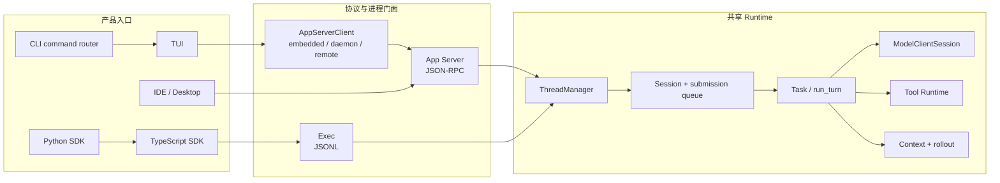
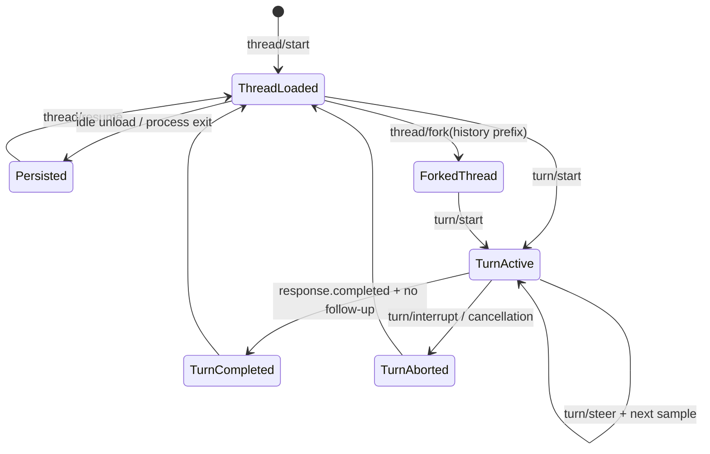
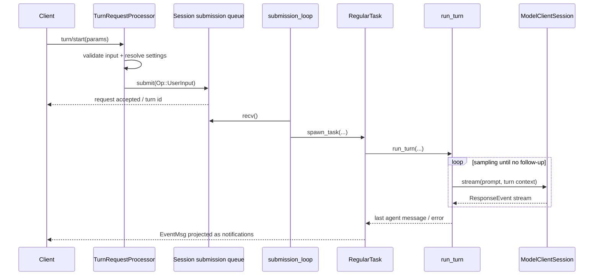
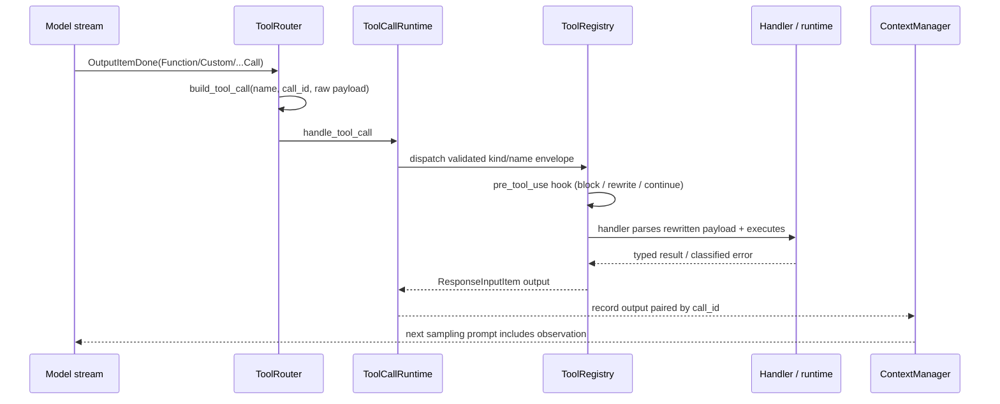
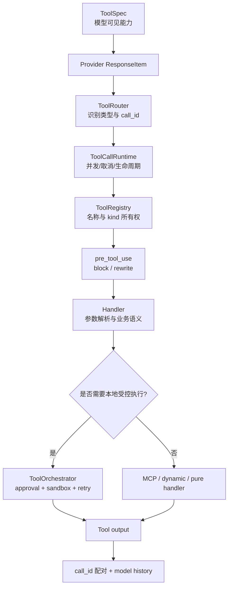
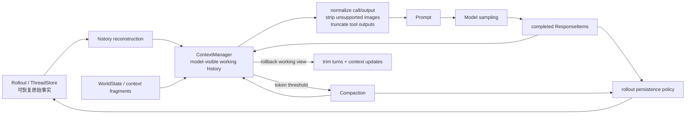
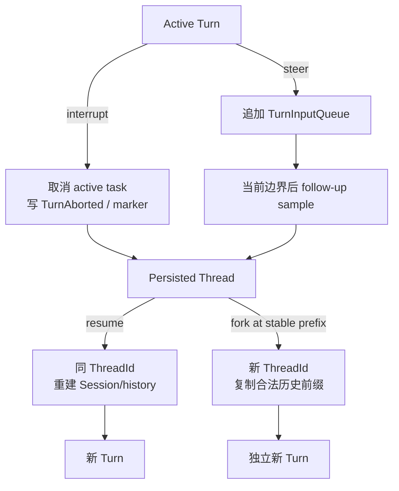
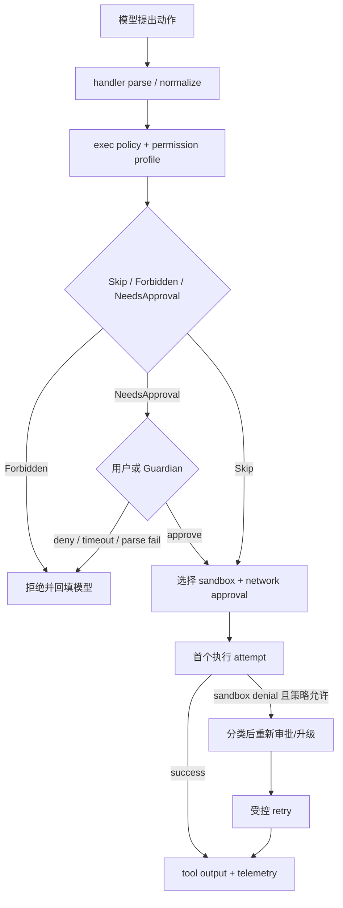
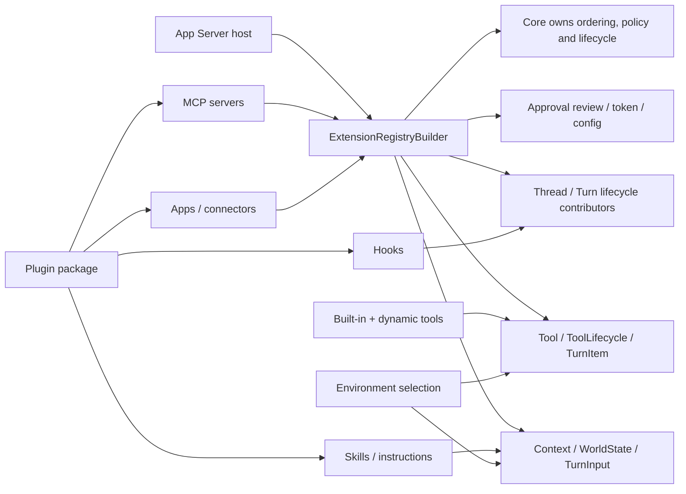
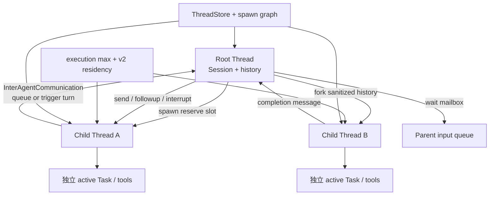

# Codex Agent 架构详细报告

## 1. 报告目的

本报告回答的不是“Codex 有哪些文件”，而是：

- 一个成熟 Agent Runtime 需要哪些稳定边界？
- Codex 为什么把一次模型调用扩展成 Thread / Turn / Task / Item / Event？
- 当前 AI SEO Agent 已经走到哪里？
- 哪些设计应迁移到云端 NestJS 项目，哪些不应照搬？

研究基于本地 Codex fork `ab6a7eb87cc8a816c88b86c44cf291e251ed2136` 与当前项目研究起点 `5f2ad11f2c65425e84392e81048364d55ec626ef`。每个领域按“源码事实—架构解释—迁移建议”组织；完整取证规则见 [research-method.md](./research-method.md)。

## 2. 执行摘要

Codex 可以被理解为一个事件驱动、工具增强、可持续运行的 Agent Runtime。它把多个产品入口收敛到共同核心，并围绕以下不变量组织系统：

1. 用户看到的 Thread 与一次执行的 Turn 分开。
2. 协议对象与内部运行对象分开。
3. 模型只提出工具调用；系统拥有执行权。
4. 工具调用结果必须回到 model history，才能形成 Agent loop。
5. model history、UI transcript、runtime event、durable log 不是同一种数据。
6. 中断、失败、审批、权限和 sandbox 都有独立语义。
7. 持久化服务于恢复和审计，不服务于复制每个流式 delta。
8. 核心 runtime 被 CLI、App、IDE、SDK 等多个入口复用。
9. 状态机和协议靠大量聚焦测试保护。

当前 AI SEO Agent 已经具备第 1、2、5、6、7 项的一部分基础，但仍然是“单次文本采样 Runtime”，还没有真正进入“模型—工具—Observation—再次采样”的 Agent loop。

## 3. Codex 的宏观分层

**源码事实**：`codex` CLI 分派交互 TUI、`exec` 与 `app-server`；当前 TUI 通过 `AppServerClient` 连接 embedded、local daemon 或 remote app-server。app-server 再持有 `ThreadManager`，把版本化请求映射到 core。TypeScript SDK 启动 Codex executable 的 `exec` JSONL 门面；Python SDK 启动 pinned Codex binary 的 `app-server` stdio JSON-RPC 门面。两者都没有复制 Rust Agent loop。



**架构解释**：复用的是生命周期、状态机和副作用所有权，不要求所有产品都使用同一种传输。TUI 改为 app-server client 进一步证明 UI 不是 canonical runtime。

**迁移建议**：NestJS 项目应让 Web、同步 API、定时任务和 Webhook 共用一个 application runtime；无需复制 JSON-RPC、Rust crate 粒度或本地进程拓扑。

| 层 | Codex 职责 | 当前项目对应 | 迁移判断 |
| --- | --- | --- | --- |
| 产品入口 | CLI、TUI、App、IDE、SDK | Vue Web、未来定时任务/Webhook | 多入口共享 runtime 的思想值得学 |
| 协议门面 | app-server JSON-RPC、exec JSONL、SDK types | Nest Controller、contracts、NDJSON | 不复制 JSON-RPC，学习稳定 contract |
| 生命周期 | ThreadManager、Thread、Turn、Task | Conversation、AgentRun、AgentStep | 已有基础，需补状态不变量 |
| Agent loop | `run_turn`、sampling、follow-up | `AgentRuntimeService` | 当前只采样一次，Tool loop 是最近缺口 |
| 模型适配 | ModelClientSession、ResponseEvent | LLMService、OpenAICompatibleClient | 需从文本 delta 升级为结构化 provider event |
| 工具体系 | spec、router、registry、runtime、orchestrator | 尚未实现 | 当前最高优先级 |
| 上下文 | ContextManager、token budget、compaction | SeoContextBuilder + 固定 12 条 history | 需从拼数组升级为上下文策略 |
| 持久化 | rollout、ThreadStore、state db | PostgreSQL Message/Run/Step | 需补恢复、幂等和查询投影 |
| 安全 | approval、permissions、sandbox、execpolicy | 尚无通用策略 | 先做业务权限和审批，不做 OS sandbox |
| 扩展 | skills、plugins、MCP、hooks | 尚无 | 内置工具稳定后再学习 |
| 协作 | child threads、agent control、mailbox | 尚无 | 单 Agent 稳定后再进入 |
| 质量 | telemetry、protocol tests、state tests、snapshots | typecheck/lint，无测试文件 | 测试是明显短板，应提前补齐 |

## 4. 核心主链路

### 4.1 客户端连接与协议初始化

Codex app-server 先完成连接级 `initialize`，再接受 thread / turn 请求。协议层负责：

- 请求、响应与通知的结构。
- client capability 协商。
- 稳定方法名和版本化类型。
- 把内部事件映射成客户端可理解的 item / delta / completion。

这说明协议门面不能直接等同于 runtime。当前项目已经用 `seo-chat-stream-event.mapper.ts` 将 `AgentRuntimeEvent` 映射为 `ChatStreamEvent`，方向正确；后续加入工具事件时，也应先扩内部事件，再谨慎决定是否暴露给前端。

关键源码与测试：

- `codex-rs/cli/src/main.rs`：`main` 对 TUI、Exec、AppServer 的命令分派。
- `codex-rs/tui/src/lib.rs`：`AppServerTarget`、`start_app_server`，选择 embedded / local daemon / remote。
- `codex-rs/app-server-protocol/src/protocol/common.rs`
- `codex-rs/app-server/src/message_processor.rs`
- `codex-rs/app-server/src/request_processors/initialize_processor.rs`
- `codex-rs/app-server/src/bespoke_event_handling.rs`
- `codex-rs/app-server/tests/suite/v2/initialize.rs`
- `codex-rs/cli/src/main.rs` 内 app-server transport/auth 参数测试。

### 4.2 Thread 生命周期

Thread 是长期工作线，负责承载多次 Turn 和可恢复历史。`ThreadManager` 负责创建、恢复、fork、加载和管理活跃线程；`Codex::spawn` 创建真正的 Session 运行态。

```text
thread/start
  -> ThreadRequestProcessor
  -> ThreadManager.start_thread_with_options
  -> spawn_thread_with_source
  -> Codex::spawn
  -> Session + submission/event channels + persistence
```



图中的 Thread 是长期身份；Turn 是一次活动边界；Response Item 是历史内容；`EventMsg` 与 app-server notification 是状态变化的投影。设计不变量是：一个 Session 同时最多一个 active Task，`TurnCompleted` 与 `TurnAborted` 不应同时成为同一 Turn 的最终事实。

设计价值：

- Thread 身份与进程内 Session 实例分离。
- 一个持久化 Thread 可以被 unload，再 resume。
- fork 明确表达“复制历史后形成新工作线”，而不是修改原历史。
- archive/delete/read/list 属于 Thread 资源管理，不混进 Turn 执行。

当前快照还把 **Goal** 建模为 Thread 级长期目标，而不是 Turn 或隐藏 prompt。`thread/goal/set|get|clear` 经 `ThreadGoalRequestProcessor` 调用 `GoalService`；Goal 保存 objective、status、token budget、tokens/time usage，并具有 Active、Paused、Blocked、UsageLimited、BudgetLimited、Complete 状态。`GoalExtension` 通过 thread/turn/tool/token contributors 计量进度、注入 continuation，并把 `ThreadGoalUpdated` 写为 durable event。Goal resume 后从 state 重新挂接 runtime，和某一次 active Turn 的内存状态分离。

**架构解释**：Thread 是身份与历史容器，Goal 是可替换的长期意图/预算状态，Turn 是一次执行。Goal 不能被当作模型 chain-of-thought；Goal 状态变化必须由 API/tool/lifecycle policy 决定并可恢复。

当前项目 `Conversation` 已经是最小 Thread，但还缺：所有权、归档、恢复语义、并发控制和运行中的 Thread 状态投影。

关键源码与测试：

- `codex-rs/core/src/thread_manager.rs`：`ThreadManager::start_thread_with_options`、`resume_thread_with_history`、`fork_thread_from_history`、`spawn_subagent`。
- `codex-rs/app-server/src/request_processors/thread_processor.rs`
- `codex-rs/thread-store/src/store.rs`：`ThreadStore`。
- `codex-rs/app-server/tests/suite/v2/thread_start.rs`：正常创建及配置/环境失败。
- `codex-rs/app-server/tests/suite/v2/thread_resume.rs`、`thread_fork.rs`：恢复、历史前缀、未物化/ephemeral 边界。
- `codex-rs/core/src/thread_manager_tests.rs`：active/stopped resume 与 interrupted fork snapshot。
- `codex-rs/app-server/src/request_processors/thread_goal_processor.rs`：Goal 协议门面与 snapshot notification。
- `codex-rs/ext/goal/src/api.rs`、`extension.rs`、`runtime.rs`、`tool.rs`：Goal state、计量与 typed extension。
- `codex-rs/ext/goal/tests/goal_extension_backend.rs`：create/update、并行 tool 计量、error/usage limit、resume/clear。
- `codex-rs/app-server/tests/suite/v2/thread_resume.rs`：paused/budget-limited Goal 的 resume 与持久化边界。

### 4.3 Turn 进入 submission queue

`turn/start` 不直接调用模型。`TurnRequestProcessor::turn_start` / `turn_start_inner` 先校验、映射输入，并允许 `TurnStartParams.model` 等 thread settings 覆盖，再把 `Op::UserInput` 提交给 Session queue。

```text
turn/start params
  -> validate and map input
  -> Op::UserInput
  -> submit
  -> submission_loop
  -> user_input_or_turn
  -> RegularTask
```



设计不变量是：协议请求只负责提交操作，active Task 的启动、中断和终态由 Session 串行所有者决定；模型 transport 不能直接决定产品层 Turn 状态。

为什么需要 queue：

- 中断、steer、approval response、tool response 都是运行期间可能到来的操作。
- runtime 需要单一顺序点维护 active turn 状态。
- 客户端请求生命周期不应直接等于模型请求生命周期。
- 后续可做背压、调度、公平性和并发限制。

当前项目的 HTTP 请求仍直接持有整个 async generator 生命周期。学习 queue 的重点不是立刻上消息队列，而是先建立“请求进入”和“运行执行”之间的可替换边界。

关键源码与测试：

- `codex-rs/app-server/src/request_processors/turn_processor.rs`：`TurnRequestProcessor::turn_start_inner` 构造并提交 `Op::UserInput`。
- `codex-rs/core/src/session/handlers.rs`：`submission_loop` 是 `Op` 的顺序消费点。
- `codex-rs/core/src/tasks/regular.rs`：`RegularTask::run`。
- `codex-rs/core/src/session/turn.rs`：`run_turn`、`try_run_sampling_request`。
- `codex-rs/app-server/tests/suite/v2/turn_start.rs`、`turn_steer.rs`、`turn_interrupt.rs`。
- `codex-rs/core/tests/suite/abort_tasks.rs`：长工具中断、历史记录与 `<turn_aborted>` 恢复标记。

### 4.4 Task 与 Turn 的分工

Codex 用 `RegularTask` 承接普通 Turn。Task 负责：

- 发送 TurnStarted。
- 准备或复用模型 session。
- 调用 `run_turn`。
- 处理运行中追加的输入。
- 返回最后的 agent message。

`run_turn` 则负责一次 Turn 内的循环、上下文、采样、工具续跑、压缩和完成条件。

Turn 内部还有两层快照：`TurnContext` 固定本 Turn 的 model、provider、approval/permission、cwd 等运行配置；`StepContext` 在每次 sampling 前捕获当时可用的 environments、selected capability roots、MCP runtime/tool list 和 `AGENTS.md`。同一 Turn 的后续 sampling 可以看见新就绪能力，但一次 sampling 广告的工具与实际执行使用同一个 Step snapshot。

**架构解释**：Step 不是数据库 `AgentStep` 的同义词。Codex StepContext 是 request-scoped capability snapshot，用来防止“模型看到的工具”和“执行时的工具”在同一次采样中漂移。

这种分层避免一个巨型 service 同时处理请求接入、调度、上下文、模型协议、工具执行和持久化。当前 `AgentRuntimeService.runTurnStream()` 已经开始承担 Task + Turn 两层职责，后续功能增多时应拆出明确的 `AgentTurnRunner` 或等价内部边界，但不要在 Tool Calling 第一小步就过早抽象。

关键源码：

- `codex-rs/core/src/tasks/regular.rs`：`RegularTask` / `SessionTask::run`。
- `codex-rs/core/src/session/turn.rs`：`run_turn`。
- `codex-rs/core/src/session/turn_context.rs`：`TurnContext`。
- `codex-rs/core/src/session/step_context.rs`：`StepContext` 与固定 MCP tool snapshot。
- `codex-rs/app-server/tests/suite/v2/selected_capability_stack.rs`：能力在两次 sampling 间变为可用，但 step 内保持一致。

### 4.5 Model Sampling 与 Agent loop

成熟 Agent 与普通 Chat 的关键差别在于：模型输出工具调用时，Turn 不结束。

```text
build prompt
  -> ModelClientSession::stream
  -> ResponseEvent stream
  -> assistant message ? complete candidate
  -> tool call ? dispatch tool
  -> record tool output into history
  -> needs_follow_up = true
  -> next sampling request
```

`run_turn` 的外层循环根据 `needs_follow_up` 决定是否继续采样。工具调用、服务端 `end_turn=false`、运行中追加输入，都可能要求继续。

当前项目的 `LLMService.chatStream()` 只 yield 文本字符串，导致 runtime 看不到 tool call、finish reason 或 usage。阶段 5 必须先升级 LLM 边界，让上层接收结构化事件，再实现 Tool loop。

该内部 contract 应只有一个故障所有者：`ModelStreamEvent` 只表达正常 text/tool/usage/completed 值；provider/network/abort 从 async iterator throw，runtime 再分类为唯一终态。OpenAI-compatible Chat Completions 还应显式请求 `include_usage`，容纳 finish reason 后到达的 `choices=[]` usage-only chunk，并在 usage 后合成唯一 completed。

当前快照还明确了一个容易遗漏的边界：`ModelClientSession` 是 **turn-scoped**，在同一 Turn 的多次采样间复用 WebSocket、sticky routing 与连接状态，但不能跨 Turn 复用，否则会把 `previous_response_id` 等 transport 状态泄漏给下一 Turn。

关键源码与测试：

- `codex-rs/core/src/client.rs`：`ModelClient`、`ModelClientSession`、`new_session`、SSE/WebSocket stream 与 retry。
- `codex-rs/codex-api/src/common.rs`：`ResponseEvent`。
- `codex-rs/core/src/session/turn.rs`：`run_turn`、`try_run_sampling_request`、`SamplingRequestResult`。
- `codex-rs/core/src/stream_events_utils.rs`：完成 item 到 runtime/UI item 的映射。
- `codex-rs/core/src/client_tests.rs`：认证刷新、WebSocket handshake、metadata 与失败路径。
- `codex-rs/core/tests/suite/pending_input.rs`：steer/mailbox 触发 follow-up 的边界测试。

### 4.6 Tool Call 处理

**源码事实**：完成的 provider item 先被识别为路由信封，再由 turn-scoped `ToolCallRuntime` 查询 registry。handler 在真正执行时解析/验证自己的 payload；结果统一转换成与 `call_id` 配对的 `ResponseInputItem`，写入历史并令 `needs_follow_up = true`。



**架构解释**：Tool call 不是 RPC 直通。模型只能提出带 raw arguments 的候选动作；registry/handler/policy 保留解释、验证和执行权。hook 改写发生在 registry dispatch 中，但改写后仍回到具体 handler 的 payload 解析与 ToolOrchestrator/policy，不获得绕过安全层的捷径。

模型输出先由 `ToolRouter::build_tool_call` 转换为内部 `ToolCall { tool_name, call_id, payload }`，再通过 registry 找到确定性 runtime。这里的 `ToolCall` 是路由信封：普通 function payload 仍含 raw JSON arguments，并不自动等于“已按具体工具 schema 验证”。Tool 结果作为 `ResponseInputItem` 写回 conversation history，触发下一次采样。

重要边界：

1. **ToolSpec**：模型可见契约。
2. **ToolRouter**：识别 provider output 并生成未验证的路由调用信封。
3. **ToolRegistry**：工具名到 runtime 的确定性映射，拒绝重复注册。
4. **Tool handler/runtime**：参数解析、业务执行、结果序列化。
5. **ToolOrchestrator**：为 shell、apply_patch、unified exec 等需要 sandbox/approval 的本地 runtime 编排审批、sandbox、特定 retry/elevation 和 telemetry；它不是所有 registry handler 的全局必经层。
6. **Observation**：回填给模型的结构化结果。

Tool search 也是同一闭环的特殊工具：client-executed `ResponseItem::ToolSearchCall` 被 router 解析为 `ToolPayload::ToolSearch`，`ToolSearchHandler` 在当前 step 的可加载 catalog 上检索并返回 `ToolSearchOutput` / loadable specs，下一轮模型才获得新增工具。它解决“大 catalog 不应全部塞进 prompt”，不改变 registry 和 policy 的最终执行权。

参数流式增量只用于可选预览。`try_run_sampling_request` 在 `OutputItemAdded` 时向 runtime 申请 `ToolArgumentDiffConsumer`；例如 apply-patch consumer 将 partial input 解析成 `PatchApplyUpdated`。真正 dispatch 仍等待 `OutputItemDone` 和完整 payload，partial arguments 不能触发副作用。



设计不变量是：spec 暴露、名称路由、参数验证、副作用授权、执行与 observation 配对属于不同责任；`ToolOrchestrator` 只覆盖实现 `ToolRuntime` 的本地受控执行，不是所有工具的万能中间件。

当前阶段 5 文档已经提出 `ToolDefinition / ToolRegistry / ToolExecutor`，方向正确。还应显式补上 `UnvalidatedToolCallEnvelope -> ValidatedToolInvocation`、`ToolResult/Observation` 和 provider event adapter，否则 registry 只是一个孤立容器，raw arguments 也可能绕过验证。

关键源码与测试：

- `codex-rs/tools/src/tool_spec.rs`：`ToolSpec`。
- `codex-rs/core/src/tools/router.rs`：`ToolCall`、`ToolRouter::build_tool_call` 与 dispatch。
- `codex-rs/core/src/tools/parallel.rs`：`ToolCallRuntime`、取消与 ordered future。
- `codex-rs/core/src/tools/registry.rs`：`ToolRegistry::dispatch_any_with_terminal_outcome`、pre/post hooks 与 handler。
- `codex-rs/core/src/tools/orchestrator.rs`：本地 `ToolRuntime` 的 approval/sandbox/attempt。
- `codex-rs/core/src/tools/handlers/tool_search.rs`：deferred catalog search 与 loadable specs。
- `codex-rs/core/src/tools/handlers/apply_patch.rs`：`ApplyPatchArgumentDiffConsumer` 只生成预览事件。
- `codex-rs/core/src/tools/router_tests.rs`、`registry_tests.rs`：unsupported/kind/parallel/hook contract。
- `codex-rs/core/tests/suite/tool_harness.rs`：正常执行与 malformed payload。
- `codex-rs/core/tests/suite/hooks.rs`：执行前阻断、shell/apply_patch/function input rewrite。
- `codex-rs/core/tests/suite/plugins.rs`、`tools/handlers/mcp_search_tests.rs`：tool search provenance 与 catalog metadata。

### 4.7 并行工具与顺序一致性

**源码事实**：Session submission 使用有界 `async_channel`，`active_turn` 只容纳一个 active Task；steer、mailbox 与其他 pending input 进入 `TurnInputQueue`。一次 sampling 内，声明可并行的工具可提前创建 future，但 `FuturesOrdered` 在 response completion 前 drain，并以可预测顺序把 output 写回 history。每个 tool future 继承 child `CancellationToken`，terminal lifecycle 通过原子标志避免完成与 aborted 双发。

这背后的学习点不是“越并行越好”，而是：

- 工具必须声明是否安全并行。
- 共享状态更新需要顺序和原子性。
- 并行执行结果写回模型时仍要保证 call/output 配对。
- 中断要能传播到所有 in-flight tool。

当前 SEO Agent 第一版只应顺序执行一个只读工具。等单工具 loop、错误语义和 step 记录稳定后，再实现有界并行。

测试证据：`core/tests/suite/tool_parallelism.rs` 覆盖并行启动、mixed tools 与结果分组；`core/src/tools/parallel.rs` 的模块测试覆盖 dispatch 前取消、handler 已完成后的取消和等待 runtime cleanup 的 aborted 生命周期。

`core/src/session/tests.rs::submission_loop_channel_close_aborts_active_turn_before_thread_stop_lifecycle` 证明 channel 关闭时先取消 active Turn 再停止 Thread；`core/tests/suite/pending_input.rs` 证明 steer/mailbox 只能在合法 sampling 边界触发 follow-up；`app-server/tests/suite/v2/thread_unsubscribe.rs` 证明客户端 unsubscribe 不等于取消正在运行的 Turn。

**架构解释**：背压存在于 submission/runtime channel 与 agent 容量边界，不能简单推导为“所有内部 channel 都有界”；app-server listener 仍有 unbounded channel，因此 slow consumer 的产品级治理是另一层问题。

### 4.8 Runtime Event 与 UI Item

Codex 区分：

- provider 的 `ResponseEvent`
- core 的 `EventMsg`
- app-server 的 notification
- UI 的 `TurnItem`
- rollout 的持久化 item

Item 与 Event 不是同义词：Item 是有身份、内容和完成形态的语义对象；Event/notification 描述 item 或 turn 的 started/delta/completed 等生命周期。`ResponseEvent::OutputItemDone(item)` 恰好说明“事件携带一个完成 item”，不是把两层合并。

这种分层避免 provider chunk 直接污染产品协议。当前项目已具备 `LLM delta -> AgentRuntimeEvent -> ChatStreamEvent -> Vue state` 的最小版本，但内部事件仍只有文本生命周期。工具阶段应先增加内部工具事实，外部是否展示另行决策。

### 4.9 ContextManager 与历史不变量



设计不变量是：durable append-only facts、恢复投影与当前模型窗口不是同一份数组；compaction/rollback 可以改变 model view，但必须保留足以恢复、审计和继续配对的事实。

Codex 的 ContextManager 不只是“截取最近 N 条”，它负责：

- 保存 model-visible ResponseItem。
- 估算 token 使用。
- 规范化 call/output 配对。
- 移除孤立 tool output。
- 根据模型能力移除图片。
- 截断过大的 tool output。
- rollback 时维护 context baseline。
- 记录 world state diff。

关键不变量：每个 tool call 必须有对应 output，每个 output 必须能找到 call。这个不变量应成为当前项目阶段 5 的测试重点。

关键源码与测试：

- `codex-rs/core/src/context_manager/history.rs`：`ContextManager`、`normalize_history`、rollback/token 视图。
- `codex-rs/core/src/context_manager/normalize.rs`：补 call output、移除 orphan output、图片能力归一化。
- `codex-rs/core/src/context/world_state`：跨 Turn 的可替换 context fragments。
- `codex-rs/core/src/context_manager/history_tests.rs`：call/output 成对删除、图片、截断、rollback/context update。
- `codex-rs/core/tests/suite/truncation.rs`：tool/MCP output 上限与只截断一次。

### 4.10 Token 预算与 Compaction

Codex 在每次采样后收集 token 状态，达到阈值且仍需 follow-up 时执行 compaction，再继续 Turn。它把 compaction 视为 runtime 能力，而不是 UI 的“清空聊天”。

当前项目固定读取最近 12 条消息，简单但无法回答：

- system prompt、历史、tool output 各占多少预算？
- 一个超长 tool output 如何处理？
- 压缩后保留哪些业务事实？
- summary 是否能被审计和替换？

因此 Context 阶段应从预算模型开始，而不是直接做复杂摘要算法。

当前快照还把 token-budget compaction 统一建模为 `ContextCompaction` 生命周期：manual 与 inline auto-compaction 都运行 compact hooks、建立新 window，并在 follow-up 前复位预算。`core/tests/suite/token_budget.rs` 验证阈值、hooks、新 window 和 mid-turn follow-up；`compact_resume_fork.rs` 验证压缩后 resume/fork 得到相同 model history view。

### 4.11 Durable Facts 与 Rollout

**源码事实**：`rollout::policy::is_persisted_rollout_item` 明确筛选 durable facts。高频 delta、approval request、临时 begin、warning 和大部分 UI 状态不写入；Response Item、Turn start/complete/abort、token、goal、settings、compaction、world state 与 turn context 构成恢复输入。`ThreadStore` 是 storage-neutral trait，负责 create/resume/append/persist/flush/load/list；local、in-memory 或远端实现必须共享 rollout persistence policy。

当前快照同时支持 `ThreadHistoryMode::Legacy` 与 `Paginated`：legacy 依赖部分旧 EventMsg；paginated 以完成的 `TurnItem` 投影历史。`app-server-protocol/protocol/thread_history_projection.rs` 负责投影，不应让 UI notification 反向成为 canonical history。

当前项目将 `Message`、`AgentRun`、`AgentStep` 落 PostgreSQL，方向正确。但未来工具 loop 需要决定：

- 工具 call arguments 是否作为 step input 持久化？
- output 是否需要脱敏、截断或外部存储？
- 每次模型采样是一个 step 还是 attempt？
- 重试后如何避免重复副作用？
- 服务重启后如何识别僵尸 RUNNING？

其中 provider transport retry、Agent sampling follow-up 和 tool execution retry 必须分开。可靠性阶段只记录 idempotent/version/attempt 并默认执行一次；直到 durable checkpoint、幂等键和“工具可能已成功”的 outcome reconciliation 成立后，恢复阶段才能安全决定第二 attempt。

关键源码与测试：

- `codex-rs/rollout/src/policy.rs`：`is_persisted_rollout_item` / `should_persist_*`。
- `codex-rs/rollout/src/recorder.rs`：append、flush 与失败传播。
- `codex-rs/thread-store/src/store.rs`：`ThreadStore` trait。
- `codex-rs/app-server-protocol/src/protocol/thread_history_projection.rs`：paginated history 投影。
- `codex-rs/rollout/src/recorder_tests.rs`：append/flush/损坏与持久化失败。
- `codex-rs/core/src/session/rollout_reconstruction_tests.rs`、`compact_resume_fork.rs`：恢复与历史合法性。
- `codex-rs/app-server-protocol/src/protocol/thread_history_projection_tests.rs`：Item/Turn 投影边界。

### 4.12 中断、Steer、Resume 与 Fork

这四个概念不能混为一个“继续聊天”按钮：

- interrupt：停止当前 Turn。
- steer：当前 Turn 尚未结束时追加输入。
- resume：重新加载已有 Thread 并继续新 Turn。
- fork：复制一段历史形成新 Thread。



设计不变量是：interrupt 改变当前 Turn 终态；steer 只进入当前 Turn 的输入队列；resume 保留 Thread 身份；fork 必须产生新身份且不回写源历史。mid-turn fork 会先物化/截断到合法边界，不能复制半个无 output 的工具调用。

当前项目已支持浏览器断开触发 AbortSignal，并把 Message / Run / Step 收为 `ABORTED`。这是 interrupt 的基础。下一步应先处理服务端重启和重复请求，再考虑 steer/fork；否则只增加 API 名称，没有一致性基础。

### 4.13 Approval、Permission 与 Sandbox

Codex 的 ToolOrchestrator 对使用它的本地 sandbox runtime 明确先决定 Approval，再选择 sandbox 执行，失败后是否升级也有独立策略。不要把这条局部执行路线描述为所有 Codex 工具的统一全局管线；MCP 等 handler 有各自路径。

```text
tool call
  -> permission / policy decision
  -> approval if required
  -> sandbox selection
  -> first attempt
  -> classified failure
  -> optional re-approval / retry
```



设计不变量是：模型、hook 或工具输入都不能自行扩大 permission profile；approval 是一次动作决策，sandbox 是强制执行边界，exec policy 是规则判断，Guardian 是可选 reviewer。任何输入改写都必须在最终执行参数上重新经过 handler 和 policy。

云端 SEO Agent 的翻译：

- permission：用户/租户是否能用这个工具、访问这份资源。
- approval：有外部副作用的动作是否获得本次确认。
- isolation：HTTP 超时、出站域名、凭证隔离、worker 权限和容器边界。

现在不执行 shell，因此无需照搬 OS sandbox，但不能因此跳过鉴权、审批和审计。

关键源码与测试：

- `codex-rs/core/src/config/permissions.rs`：permission profile 编译与继承。
- `codex-rs/core/src/exec_policy.rs`：命令规则与 approval requirement。
- `codex-rs/core/src/tools/approvals.rs`：用户/Guardian reviewer 选择。
- `codex-rs/core/src/tools/orchestrator.rs`：approval、sandbox、network approval 与 retry。
- `codex-rs/core/src/tools/sandboxing.rs`
- `codex-rs/core/src/guardian`：风险审查、失败关闭与拒绝 circuit breaker。
- `codex-rs/core/src/config/permissions_tests.rs`、`exec_policy_tests.rs`、`tools/sandboxing_tests.rs`。
- `codex-rs/core/tests/suite/request_permissions.rs`：临时 grant 的 scope、拒绝与跨 Turn 边界。
- `codex-rs/core/tests/suite/guardian_review.rs`：允许复用与拒绝回填。

### 4.14 扩展系统

**源码事实**：Codex 支持 built-in tools、dynamic tools、MCP、skills、plugins、hooks、Apps、Environments，以及新的 typed `ExtensionRegistry`。registry 允许 host 按注册顺序贡献 thread/turn lifecycle、config、token usage、skill invocation、context/world state、MCP server、turn input、tool、tool lifecycle、turn item 与 approval review；扩展拿到稳定 ID 和私有 `ExtensionData`，而不是随意持有整个 Session。



设计不变量是：扩展只能贡献自己拥有的能力，host 保留排序、冲突处理、权限和生命周期控制；Plugin 是分发/组合单元，Skill 是指令资源，MCP 是外部工具/资源协议，Hook 是生命周期拦截，App/Environment 是能力来源，不能互换术语。

1. 内置工具验证最小闭环。
2. registry 和统一 result contract 稳定。
3. 外部工具协议接入。
4. 可复用指令包和生命周期 hook。
5. 插件分发、版本和信任策略。

当前项目到第 1 步都未完成，所以 MCP 和插件系统应明确放到后期。

关键源码与测试：

- `codex-rs/ext/extension-api/src/registry.rs`、`contributors.rs`：typed registry 与贡献点。
- `codex-rs/core/src/tools/spec_plan.rs`、`handlers/dynamic.rs`、`handlers/mcp.rs`、`handlers/extension_tools.rs`：工具汇合。
- `codex-rs/core/src/context/world_state`：Apps/Plugins 等动态上下文投影。
- `codex-rs/hooks/src`、`codex-rs/plugin/src`、`codex-rs/core/src/skills.rs`、`environment_selection.rs`。
- `codex-rs/ext/extension-api/tests/registry.rs`：所有 contributor category 与注册顺序。
- `codex-rs/core/tests/suite/hooks.rs`、`rmcp_client.rs`、`plugins.rs`，以及 app-server 的 skills/plugins/hooks/dynamic-tools tests。

### 4.15 Multi-agent

**源码事实**：Codex 的 subagent 是独立 Thread，有 `parent_thread_id` / spawn graph、自己的 Session/history/permission inheritance、执行容量与 v2 residency。`AgentControl` 负责 spawn/resume/send/interrupt/list，spawn 可从空上下文或父历史的 full/last-N snapshot 开始；fork 前先 materialize/flush 父 rollout，并清除不应继承的 usage hints。v2 的 `InterAgentCommunication` 可只入队 mailbox，也可触发 Turn；child completion 会向直接 parent 入队消息。



设计不变量是：工具并行共享一个 Turn/context；Multi-agent 则创建独立 Thread 和执行容量。子 Agent 的 permission/environment 可以继承或收窄，但模型不能借 spawn 扩权；parent/child 消息是持久化通信事实，不等于共享可变 history。

迁移前置条件：

- 单 Agent tool loop 稳定。
- Run/Step 可恢复。
- 工具权限可继承或收窄。
- 并发和成本预算可控。
- 父子任务结果有确定 contract。

因此 Multi-agent 是学习路线后段，而不是阶段 5 的延伸任务。

测试证据：`codex-rs/core/src/agent/control_tests.rs` 覆盖 fork 清洗、flush-before-snapshot、max threads、slot release、child completion 和 v2 parent mail；`codex-rs/core/src/agent/control/execution_tests.rs` 与 `residency_tests.rs` 覆盖运行容量与 idle eviction；`codex-rs/core/tests/suite/pending_input.rs` 覆盖 mailbox 在 reasoning/commentary 边界触发 follow-up。

### 4.16 SDK 与多入口共享 Runtime

Codex SDK 复用已有 runtime 和协议，不在 SDK 内重新实现 Agent loop。当前项目未来若增加：

- 定时 SEO 巡检
- webhook 触发任务
- 内部运营批处理
- 第三方 SDK

这些入口都应调用同一个 application runtime，而不是复制 `LLMService.chatStream()`。

当前项目已经存在一个具体反例：同步 `SeoService.chat()` 直接调用 `LLMService.chat()`，streaming 入口才走 `AgentRuntimeService`。Tool loop 阶段必须让同步接口消费同一个 turn runner 到 terminal，或明确禁用 tool mode；不能维持两套 context、persistence 和错误语义。

### 4.17 测试与可观测性

Codex 的架构可信度很大程度来自测试密度：core、app-server、rollout、SDK 都有聚焦测试。测试覆盖协议、状态机、工具路由、并发、中断、压缩、持久化和失败路径。

当前项目只有 typecheck 和 lint，没有任何 `.test` / `.spec` 文件。这意味着阶段 5 如果直接实现 Tool Calling，会在最需要状态机保护时继续扩大无测试代码。

建议在 Tool Contract 阶段先建立：

- 纯函数单元测试。
- fake LLM event stream。
- fake tool executor。
- runtime 状态机集成测试。
- NDJSON contract 测试。
- recorder transaction 测试。

**源码事实**：可观测性并非单一日志模块。`ModelClientSession` 记录 transport retry/usage；`try_run_sampling_request` 建立 receiving/handle_response spans；ToolRegistry/Orchestrator 记录 tool name、call id、sandbox、decision source、result 与延迟；`TurnTimingState` 维护 TTFT、sampling/tool/profile 时间；rollout persistence 有独立 metrics；app-server notifications 还会进入 analytics reducer。trace-safe 与 log-only target 在 OTEL provider 中分开，避免把任意日志自动当可导出 trace。

质量保护分四层：protocol 序列化/投影 tests，模块状态单测，使用 fake Responses/MCP 的 core/app-server integration suite，以及 snapshot tests。`core/tests/common/responses.rs` 和 streaming SSE helpers 让复杂状态机无需真实 provider 即可复现失败顺序。

### 4.18 产品层投影：Core Event 不是 UI Canonical State

**源码事实**：Core 的 `EventMsg` 由 `app-server/src/bespoke_event_handling.rs` 转成版本化 `ServerNotification`。`ItemStarted` / delta / `ItemCompleted` 描述展示生命周期；durable paginated history 则由 `thread_history_projection::project_rollout_line` 从 `TurnStarted`、`TurnComplete`、`TurnAborted` 与完成的 `TurnItem` 无状态投影。unsubscribe 只移除连接订阅，不停止 active Turn。

**架构解释**：实时 notification、当前连接缓存与 canonical rollout 是三层状态。重连客户端应从 Thread history/status 恢复，再继续订阅增量；不能把“最后收到的 delta”当完成事实，也不能把 analytics reducer 反向当业务状态所有者。

关键证据：

- `codex-rs/core/src/event_mapping.rs`：内部 item/event 兼容映射。
- `codex-rs/app-server/src/bespoke_event_handling.rs`：Core event 到 notification。
- `codex-rs/app-server-protocol/src/protocol/thread_history_projection.rs`：paginated rollout 到 Thread/Turn/Item change set。
- `thread_history_projection_tests.rs`：completed/failed/aborted/item 投影与无 turn-id abort 忽略。
- `app-server/tests/suite/v2/thread_unsubscribe.rs`、`thread_read.rs`、`thread_status.rs`：连接与 canonical state 边界。

### 4.19 App Server 并发协议：按资源串行，而不是全局串行

**源码事实**：`ClientRequest` 的协议定义同时声明请求参数、稳定/实验状态和 `serialization_scope()`。scope 不是一个布尔锁，而是带资源标识的枚举：全局配置、Thread、ThreadPath、命令进程、通用进程、模糊搜索会话、文件监听与 MCP OAuth 各自形成队列键。`GlobalSharedRead` 与同名 `Global` 共用资源键，但前者以 shared read 进入队列；没有 scope 的请求直接并发执行。连接级 `ConnectionRpcGate` 仍包裹每个已初始化请求，因此“资源顺序”和“连接关闭/请求取消”是两个独立维度。

```text
ClientRequest
  -> initialized / experimental capability check
  -> serialization_scope()
      -> None: spawn concurrently
      -> key + SharedRead/Exclusive
          -> RequestSerializationQueues
          -> ConnectionRpcGate
          -> request processor
```

这避免了两个相反错误：把所有 RPC 放进单一全局队列会让无关 Thread 互相阻塞；完全并发又会让同一 Thread 的 resume、goal、interrupt 或同一配置资源的读写失序。`thread_or_path` 还处理尚未物化 Thread 只有 rollout path 的阶段，使冷恢复和已加载 Thread 能落到可比较的资源所有权上。

**重连顺序不变量**：运行中 Thread 的 `resume response` 不是先读 history、再另行订阅。它被封装为 `ThreadListenerCommand::SendThreadResumeResponse`，在 listener 上下文内读取 `active_turn_snapshot()`、组装历史、检查 pending unload、把 connection 加入订阅并发送响应。Goal 更新/清除、server request resolution 也进入同一 listener command 流，从而与 resume 建立明确先后关系。unsubscribe 只移除连接；只有 Thread 同时“无订阅者且 inactive”超过延迟，才取消待处理回调、shutdown、移除 watch 并发出 `thread/closed`。

**能力协商不变量**：`initialize` 必须先完成；实验请求只有连接声明 `experimentalApi` 后才能执行。`optOutNotificationMethods` 是逐连接的通知过滤，不改变 Runtime 或 durable history。`mcpServerOpenaiFormElicitation` 和 attestation 也属于客户端能力，不能由服务端从客户端名称猜测。

关键证据与失败测试：

- `codex-rs/app-server-protocol/src/protocol/common.rs`：scope 宏、资源键提取和 experimental 标注。
- `codex-rs/app-server/src/request_serialization.rs`：shared read / exclusive 队列与连接 gate。
- `codex-rs/app-server/src/message_processor.rs`：initialized、experimental 与调度入口。
- `codex-rs/app-server/src/thread_state.rs`、`request_processors/thread_lifecycle.rs`：listener generation、原子 resume/subscribe、延迟 unload。
- `app-server-protocol` 的 scope tests 覆盖 keyed/unkeyed 请求；`thread_resume.rs` 覆盖运行中重连、pending approval 重放、历史冲突和关闭中拒绝；`thread_unsubscribe.rs` 与 `thread_status.rs` 覆盖连接退出不终止 Turn、通知 opt-out 与 status 生命周期。

映射到当前项目：未来若支持同一会话多客户端、后台 Run 或管理端控制，不应先造一个全局 mutex。应先列出资源所有者（Conversation、AgentRun、Tool approval、全局 provider config），只对会改变同一资源状态的命令串行；读取可在证明快照一致后共享。

### 4.20 模型传输：三种状态寿命与两层重试

`ModelClient` 看似只是 provider client，实际刻意分开三种寿命：

| 状态 | 寿命 | 例子 | 不能越界的原因 |
| --- | --- | --- | --- |
| Session | Codex Thread/Session | provider、auth、conversation id、WebSocket→HTTP fallback 开关 | fallback 后继续反复尝试 WS 会制造抖动 |
| Turn | `ModelClientSession` | WS connection、last request/response、`x-codex-turn-state` | sticky routing token 跨 Turn 会路由到错误服务端状态 |
| Sampling attempt | 单次 request/stream | inference trace attempt、SSE/WS telemetry、已完成 output items | retry 必须能区分失败、取消与完成 |

**增量请求不是“有 response id 就用”**。只有上次 response 已完成、当前 input 以前次 input 加前次 output 为前缀，并且 model、instructions、tools、tool choice、reasoning、store、service tier、text 等上下文字段一致时，才发送 `previous_response_id + delta input`。任一条件不满足、上次 response 报错或连接重建，都会退回 full `response.create`。`client_metadata` 和 stream delivery options 不参与上下文等价判断，因为它们描述本次传输而非 server-side response context。

**preconnect 与 prewarm 不同**：preconnect 只建立连接，不发送 prompt；v2 prewarm 发送 `generate=false` 并等待 `Completed`，为首个真实请求建立可复用 response id，但不记为模型推理 trace。若真实请求沿用这个未追踪的 response id，inference trace 仍记录逻辑上的完整 request，而不是线上压缩后的 delta，保证 rollout 可审计。

**两层失败恢复**：

1. 建连/首请求遇到 `401` 时，auth manager 可以刷新一次认证并重建 client setup；`426 Upgrade Required` 明确切到 HTTP。
2. 已进入 sampling loop 后，只有 `CodexErr::is_retryable()` 的 stream 错误进入有上限的 backoff。WS retry 预算耗尽时先激活一次 session-scoped HTTP fallback、清零计数并继续；HTTP 预算也耗尽才把错误返回。`ContextWindowExceeded` 与 `UsageLimitReached` 不重试，前者把 token 状态标 full，后者先保存 rate-limit snapshot。

`map_response_events` 使用有界 channel 把 provider stream 转成 Core `ResponseStream`：收集 `OutputItemDone` 作为本次 attempt 的可审计输出；只有 `Completed` 才发布 `LastResponse` 供下一次增量；consumer drop 记录 cancelled，provider error 记录 failed，stream 无 `Completed` 则由 sampling 层判为断流。这样“收到一些 delta”不会错误地晋升成可复用完成事实。

关键测试：

- `client_websockets.rs::responses_websocket_uses_incremental_create_on_prefix` 与 non-prefix/non-input-field variants 证明增量判定。
- `responses_websocket_v2_after_error_uses_full_create_without_previous_response_id` 证明失败后清除 server-side continuation 假设。
- `responses_websocket_connection_limit_error_reconnects_and_completes` 证明连接级错误可在预算内重连。
- preconnect/prewarm、session drop、turn metadata、rate limit 与 terminal error tests 证明传输优化不改变逻辑请求。
- `client.rs::incomplete_response_emits_content_filter_error_message` 与 `history_dedupes_streamed_and_final_messages_across_turns` 保护断流错误和 streamed/final 去重。

映射到当前项目：`OpenAICompatibleClient` 可以先只实现 HTTP SSE，但 `LLMService` 必须把 provider error 分类为“不可重试业务错误 / 可重试传输错误 / 用户取消”，并让 AgentRuntime 拥有 retry 上限。不要在 axios/fetch adapter、Runtime 和 Controller 各重试一次；三层相乘会重复扣费，也无法证明已落盘的 delta 属于哪次 attempt。

### 4.21 持久化写屏障：JSONL 事实先于 SQLite 索引

Codex 本地持久化不是把同一份状态随意双写到 JSONL 和 SQLite，而是给两者不同职责：rollout JSONL 保存可恢复的顺序事实，state DB 保存列表、搜索、Goal 等派生/运营状态。`LocalThreadStore::append_items` 先把按 history mode 过滤后的 canonical items 交给 `RolloutRecorder`，随后等待 `flush()`；只有 flush 成功后，`LiveThread` 才更新 metadata。因此 SQLite 不会宣称存在一个 JSONL 尚未接受的 live append。

```text
canonical RolloutItem
  -> bounded writer queue
  -> pending_items
  -> JSONL write + file flush       durable barrier
  -> metadata/state DB update       searchable projection

startup / repair
  -> scan JSONL metadata
  -> leased backfill + watermark
  -> state DB becomes readable
```

**延迟物化**：新 Thread 创建 recorder 时只预计算路径和 `SessionMeta`，不会立刻创建空文件。首批可持久化 item 到来后，`persist/flush/shutdown` 才创建目录、写 metadata 和 pending items。空而未使用的会话因此不会污染 thread list；`persist()` 可重复调用。

**失败不丢后缀**：writer 独占 file handle，通过容量 256 的 channel 接收命令。item 先进入 `pending_items`，只有单条写成功才从队首移除并推进 ordinal。I/O 失败会丢弃 handle、保留未写 suffix，再 reopen 重试一次；二次失败通过 barrier ack 返回，但 writer 仍可接受未来的 flush/shutdown 重试。background task 真正终止时，`terminal_failure` 被 recorder clones 读取，避免 channel closed 把根因抹成泛化错误。

**Paginated ordinal 是追加序列，不是假定连续数组**：新文件从 0 开始；resume 时先从首条 `SessionMeta` 判 history mode，再用 8 KiB 逆向 scanner 找最后一条可解析 JSONL，下一 ordinal 取 `last + 1`。中间 gap 合法，尾部坏 JSON 可跳过，非换行结尾会先补换行；`u64` overflow 在写入前失败。这样 crash 留下的坏尾部不会覆盖既有事实，也不会把历史长度误当序号。

**State DB 启动门**：初始化 SQLite、迁移后，进程必须通过 rollout metadata backfill gate 才拿到 handle。backfill 用单例 row、lease、watermark 和 completed 状态支持多进程竞争与断点续作；超时会让初始化失败，而不是暴露半填充索引。thread list/read 在 DB 缺失、查询失败或 path stale 时有带 telemetry 的 filesystem scan/repair fallback。

**损坏恢复是定点的**：只在 SQLite 明确返回 corruption/not-a-database code 或 message 时，入口层才把出错数据库及其 sidecars 移入唯一 backup 目录后重建；“database locked/busy”不算 corruption，路径字符串里含 `corrupt` 也不算。state、logs、goals、memories 是独立数据库，恢复一个不应顺带删除其余数据。

关键测试：

- `rollout/src/recorder_tests.rs`：deferred materialization、persist retry、writer reopen、ordinal gap/坏尾/overflow、stale path repair。
- `reverse_jsonl_scanner_tests.rs`：坏 JSON 后继续、EOF 无换行、空行和跨 8 KiB chunk record。
- `thread-store/src/local/live_writer.rs` 的 flush barrier 保证 SQLite 不超前。
- `rollout/src/state_db_tests.rs`、`metadata_tests.rs` 与 `state/src/runtime/backfill.rs`：单 worker lease、watermark、缺失 singleton 修复、startup completion gate。
- `state/src/runtime/recovery_tests.rs`：仅备份目标 DB、区分 corruption 与 lock、保留其他 runtime DB。

映射到当前项目：当前 Prisma transaction 能保证单库 Run/Step/Message 原子性，但未来若增加事件日志或对象存储，必须指定一个 canonical writer 和显式 barrier。不能先提交 `AgentStep=COMPLETED`，再异步写 tool output；进程崩溃时会得到“步骤完成但 observation 不存在”的不可恢复状态。

### 4.22 安全决策组合：扩展建议、权限交集、执行强制

Codex 的安全不是一条 `if approved`，而是多个不同可信度的决策源按固定顺序组合：

```text
model proposes tool input
  -> PreToolUse hook: block / validated rewrite / context
  -> exec policy + approval policy
  -> user or Guardian review
  -> PermissionProfile + sandbox selection
  -> managed network decision
  -> handler executes
  -> PostToolUse hook: filter model-visible result / context
```

**Hook 不是最终安全边界**：PreToolUse 任一明确 deny 会阻止 handler；多个 rewrite 以“实际最后完成的 hook”为准，而不是配置顺序，然后必须经过对应 handler 的 `with_updated_hook_input` 重新解析。hook 输出 JSON 无法解析、使用不支持字段或 serialization 失败时会标记 hook failed，但工具流程 fail-open；因此真正的禁止必须仍由 exec policy、approval、PermissionProfile 或 sandbox 强制。PostToolUse 发生在 handler 成功之后，它的 block 只能拒绝/替换交给模型的 result，不能声称已经撤销文件或进程副作用。

**动态权限只取交集**：`request_permissions` 先把相对路径解析到所选 environment 的 cwd，正规化 additional permissions，并拒绝空请求或未知/非本机 environment。`Never` 或 granular policy 禁用该能力时自动返回空权限。客户端/Guardian 回应即使给得更多，也要与“模型原始请求”求交集；`strict_auto_review + Session scope` 被降为无授权，避免一次自动评审产生跨 Turn 长期权力。

授权按 scope 进入不同所有者：Turn grant 写入发起请求的 `TurnState`，Session grant 才写入 `SessionState`；response 到达时以 pending call id 取回原始 request/environment，unmatched id 被忽略。即使 active Turn 已推进，代码仍持有 originating turn state，避免异步 approval 把权限误授给后来 Turn。

**Sandbox escalation 不是盲目重跑**：Orchestrator 先计算 `Skip / Forbidden / NeedsApproval`，再选首个 sandbox。只有错误确认为 `SandboxErr::Denied`、tool 声明可 escalation、policy 允许 unsandboxed 或可解释的 network prompt 时，才构造第二次 attempt。strict auto-review 的首轮批准只覆盖 sandboxed attempt，绕过 sandbox 必须再评审；普通已批准请求仅在明确的 bypass 条件下复用，避免同一 call 重复弹窗。

**网络授权比 host 字符串更细**：pending/session key 包含 environment、lowercase host、protocol、port；相同 key 的并发请求共享 owner decision，不同端口或 environment 不合并。managed proxy 把 blocked request 归因到 execution registration；多 active call 且无法归因时不会猜测。Immediate mode 在命令返回前 finalize，Deferred mode 把 cancellation/outcome 句柄带到后续消费点；用户 deny 与 policy deny 都会使工具结果失败。

**Guardian 是隔离的自动 reviewer**：review session 固定 read-only、`AskForApproval::Never`，关闭 hooks、skills instructions、memories、MCP、apps、plugins、web search、multi-agent/code mode 等非必要能力，并有 90 秒 deadline。timeout、执行失败或 malformed structured output 均 fail closed。为避免模型反复请求形成拒绝循环，同一 Turn 连续 3 次 denial，或最近 50 次 review 中累计 10 次 denial，会只触发一次 Turn interrupt；一次非 denial 只重置连续计数，不抹去滑动窗口。

关键测试：

- `hooks/events/pre_tool_use.rs`：deny、last-completed rewrite、invalid output fail-open；`post_tool_use.rs` 与 ToolRegistry 证明 post block 不撤销执行。
- `session/tests.rs` 与 `session/tests/guardian_tests.rs`：pending call id、originating Turn、权限交集、session cwd materialization、granular auto-deny、Guardian cancellation/strict review。
- `tools/sandboxing_tests.rs` 与 Orchestrator tests：granular prompt、policy skip、deny-read、首轮/二轮 sandbox。
- `tools/network_approval_tests.rs`：host/protocol/port/environment key、waiter dedupe、attribution ambiguity、deferred idempotent finish。
- `guardian/tests.rs`：3 次连续、50 中 10 次窗口、review config 能力收缩与 timeout。

映射到当前项目：第一版 Tool Calling 不需要复制 Guardian，但必须把 `ToolDefinition` 的副作用等级、approval requirement、运行时权限和 handler 输入验证放在模型之外。若以后增加 hook，明确标注它是可观测/策略扩展还是强制安全控制；不能让一个配置错误就 fail-open 的 hook 成为唯一授权层。

### 4.23 Typed Extension：扩展点由生命周期所有者定义

Codex 的 `ExtensionRegistry` 不注册一个万能 `onEvent(any)`，而是把宿主愿意开放的能力拆成 typed contributors：Thread/Turn lifecycle、config、token usage、skill invocation、context、MCP server、turn input、native tool、tool lifecycle、turn item 与 approval review。Builder 完成后 registry 不可变，运行中只读取固定 contributor 序列，避免插件在半个 Turn 中动态改写扩展拓扑。

**状态按宿主生命周期分箱**：`ExtensionData` 是以 Rust `TypeId` 为 key 的 attachment map，Session、Thread、Turn 各有独立实例和 `level_id`。值以 `Arc<dyn Any + Send + Sync>` 保存，同类型一个槽；`get_or_init` 在锁内只初始化一次。`ExtensionDataInit` 用于宿主在 Thread 构造前冻结输入，clone 共享已有值，但它不是持久化层。扩展若要跨进程恢复，仍必须在 lifecycle gate 中显式 rehydrate/flush，不能误以为 attachment 自动写进 rollout。

**贡献合并规则不是统一的**：

- Context、turn item 与 lifecycle contributors 按注册顺序全部执行。
- approval review 是 first-claim：第一个返回 `Some(ReviewDecision)` 的 contributor 短路后续 reviewer。
- MCP overlay 按注册顺序应用，同名后写覆盖前写，也可显式 Remove；selected plugin 必须携带 package provenance/selection order。
- TurnItem contributor 可顺序修改 canonical item；单个 contributor 返回错误只记录 warning，后续仍执行。
- ToolLifecycle 只观察 host 已接受的 call，不拿 payload，也不负责 rewrite；`Aborted` 可能没有对应 start，因此观察者不能假定严格二元配对。

**Thread-scoped 与 request-scoped 输入分开**：ContextContributor 有稳定 thread context、变化的 turn context 和 world-state 三个入口；TurnInputContributor 得到本次 user input 与 environment 摘要。MCP 的 global resolution 没有 thread fallback，step resolution 只暴露当前可用 environment IDs。这个 API 形状迫使扩展说明“我的数据在何时有效”，比传整个 `Session` 给插件更容易审计。

**流式 Item 的代价显式化**：存在 TurnItem contributors 时，Runtime 会暂缓把 streaming item 直接当最终投影，完成后按顺序执行贡献。否则 contributor 若在 `ItemCompleted` 才修改内容，客户端可能已经看到无法撤回的旧 delta。扩展能力因此会影响首屏实时性，不能把它当零成本 middleware。

关键测试与事实：

- `ext/extension-api/tests/registry.rs`：所有 contributor 类别、注册顺序与 approval first-claim。
- `tests/state.rs`：typed replace/remove、并发单次 init、scope 隔离、panic 后 mutex poison recovery。
- `core/src/session/tests.rs`：Thread/Turn lifecycle gate、context/prompt order、MCP contribution 与 config change。
- `stream_events_utils_tests.rs`：TurnItem contributors 只在指定 policy 运行、失败隔离与最终 item 修改。
- `tool_lifecycle` tests 覆盖 Direct/CodeMode source、Blocked/Failed/Aborted，以及 cancellation 先于 start 的边界。

映射到当前项目：短期不需要公共 plugin API，但 `AgentRuntime` 内部可以借鉴 typed contributor 思路：分别定义 tool registry、context contributor、run observer，而不是一个能修改所有状态的“AgentPlugin”。每个 extension point 应先写清执行顺序、失败策略、状态寿命和是否能改变 canonical facts。

### 4.24 Multi-agent V2：身份、驻留、执行是三套容量

`AgentControl` 不是全局 agent singleton，而是每棵 root Thread 树最多一个 control plane；root 与所有 child 共享同一个 `SessionId`、AgentRegistry、V2Residency、AgentExecutionLimiter 和 rollout budget。它只以 `Weak<ThreadManagerState>` 回指全局 manager，避免 `ThreadManager → Thread → Session → AgentControl → ThreadManager` 的引用环。

需要分清三种“agent 数量”：

| 维度 | 所有者 | 保护对象 | 释放/淘汰条件 |
| --- | --- | --- | --- |
| 身份与树 | `AgentRegistry` | task path、nickname、parent/child metadata、spawn reservation | 关闭/死亡后显式 release；reservation 未 commit 时 Drop 回滚 |
| 内存驻留 | `V2Residency` | 已加载的 V2 child `CodexThread` | LRU；仅 terminal、无 active Turn、无 pending mailbox 才可 unload |
| 同时执行 | `AgentExecutionLimiter` | 正在运行的 V2 subagent Turn | task guard Drop 释放；root、V1、queue-only mail 不计入 |

这三者不能合并成一个 semaphore：已完成但需接收 follow-up 的 child 可以占身份、不占执行；被 LRU unload 的 completed child 仍可从 rollout 恢复；一个已加载 idle child 不应阻止另一个 child 运行。V2 residency reservation 还把 `residents + pending_slots` 一起计数，并用 RAII slot 防止 spawn/resume 失败泄漏容量。

**恢复有资格条件**：`ensure_v2_agent_loaded` 先确认 registry 认识该 id，再读 stored Thread，要求 rollout 明确标记 V2，预留 residency 后用原 session source、parent、environment 和 exec policy 恢复。同一 id 已被并发加载时把它视为成功并 touch LRU。源码测试同时记录一个重要限制：某些 interrupted V2 agent 在被 residency eviction 后可能无法再恢复，调用方不能把“ThreadNotFound”自动解释为从未创建。

**fork 不是复制所有 rollout line**：fork 前强制 parent materialize + flush；child history 只保留 system/developer/user、final assistant、SessionMeta/必要 Event/Compaction，以及在 full-history 时可复用的 TurnContext/WorldState。tool calls、outputs、reasoning、旧 inter-agent mail 和 UI-oriented items 被过滤。`LastNTurns` 截断后必须首 Turn 重建 reference context；full-history 才能沿 parent durable baseline 做 diff。V2 默认 full fork，因此禁止同时改 role/model/reasoning；partial/no fork 才允许对子配置应用这些 override。

**mailbox 有 answer boundary**：

- `send_message` 生成 queue-only communication，不启动 idle child Turn。
- `followup_task` 设置 `trigger_turn=true`，会检查执行容量，但不能以 root 为 target。
- 两者先确保 V2 target 已加载，再通过同一个 `Op::InterAgentCommunication` 入口入队。
- child 的 completion notification 是 queue-only，每个完成 Turn 各发一次；interrupted Turn 不伪装成 completion。

InputQueue 把 user steer 保存在 active Turn state，把 inter-agent mail 保存在 session mailbox。Agent 已输出 final answer 后，`MailboxDeliveryPhase::NextTurn` 阻止迟到 mail 延长已完成语义；显式 steer 会重新开放本 Turn 的 mailbox drain。`wait_agent` 监听的是 activity watch，只报告 mailbox/steer/timeout，不把 child 完成文本偷偷当自己的 tool result。

**V1/V2 不是兼容别名**：V1 的 depth limit、completion watcher、close/resume graph 与 V2 的 task path、residency、follow-up mailbox 不同；测试明确 V2 spawn 忽略旧 `agent_max_depth`。迁移代码不能用一个 `if feature` 只换 tool name，却沿用 V1 的资源或恢复假设。

关键测试：

- `agent/control/execution_tests.rs`：V2 subagent active Turn 计数，root/V1 不计。
- `agent/control/residency_tests.rs`：LRU unload、root 保护、interrupted eviction 限制。
- `agent/registry_tests.rs`：spawn reservation commit/drop、task path/nickname 与 capacity。
- `multi_agents_tests.rs`：fork 参数、task target、queue-only/follow-up、每 Turn completion、interrupt、wait 与 V1/V2 depth 差异。
- `session/tests.rs` 的 mailbox tests：answer boundary、steer reopen、stale defer 不覆盖新 steer、FIFO drain。

映射到当前项目：现在不该引入 Multi-agent。若未来确有需要，第一步不是 `Promise.all` 多个 LLM call，而是先把 AgentRun 的身份、持久化、active execution、可恢复 residency 和 message delivery 分开建模；否则“最多 4 个 agent”究竟限制费用、内存还是历史节点会始终含混。

### 4.25 Context 是可修复的模型投影，不是消息数组

`ContextManager` 同时维护五类状态：按时间排序的 `ResponseItem`、rewrite 版本号、token usage、`reference_context_item` 和 world-state baseline。后两者都是“下次如何产生 diff”的缓存，不是历史本身；compaction、rollback 或移除旧项后若无法证明 baseline 仍存在于 surviving history，就必须清空并在下一 Turn 全量注入。

**进入 history 与发给模型是两步**：`record_items` 只接受 API message 形状，并在写入时截断 function/custom tool output；`for_prompt` 在 snapshot 上做最终 normalization：为缺 output 的 call 插入合成结果，删除没有 call 的 client output，并按新模型 input modality 剥离消息和 tool output 中的 image。Debug tests 对部分非法 pairing 会主动 panic 暴露内部 bug，release path 仍以生成合法 prompt 为目标。

移除最旧 item 不能直接 `shift()`：如果它属于 call/output pair，counterpart 一并删除。rollback 的“Turn”边界也不只是 role=user；结构化 inter-agent assistant instruction 是新指令边界，legacy 普通 assistant 不是。rollback 还向前清理紧邻的 contextual developer/user update，但不越过首个真实 Turn 破坏 session prefix；若清掉了混合 persistent/contextual developer bundle，reference baseline 同时失效。

**WorldState 与 TurnContext 是两套 diff**：WorldState 首次写 full snapshot，之后基于上次 snapshot 生成 merge patch 和 model-visible fragments；任意 history replace 会清 baseline，避免 patch 应用在不存在的 base 上。TurnContext reference 则描述 cwd、权限、协作模式等设置基线。两者可以同时变化，不能用“上一条 developer message”模糊代替。

**token 不是只相信最后一次 usage**：provider 的 `last_token_usage` 已覆盖到最后 model item，但其后的 user steer/tool output 还没进入该 usage，需要本地估算；若服务端未声明 reasoning 已包含，还要加上旧 Turn 的 encrypted reasoning estimate。image data URL、encrypted output 等使用专门估算，避免 base64 大小直接当模型 token。所有估算都是近似下界，full context window 仍是硬停止线。

`AutoCompactTokenLimitScope` 有两种预算：`Total` 对 active context 总量计数；`BodyAfterPrefix` 记录新 window 的 prefill baseline，只对其后增长量应用 auto-compact 阈值，同时仍检查完整 context window。`tokens_until_compaction` 取 scoped remaining 与 full-window remaining 的较小值。

**Compaction 有三种实现但一个生命周期**：

- Local/remote summarization：保留最近真实 user messages（总预算 20k tokens）并追加 summary。
- Token-budget compaction：不调用模型摘要，直接开启新 context window，但仍发 `ContextCompaction` item 和 pre/post compact hooks。
- Model switch pre-compaction：comp compatibility hash 改变，或从大窗口模型降到小窗口且当前历史装不下时，优先用 previous model compact，必要时在满足 provider/auth 条件下用 current model fallback。

位置不变量比 summary 文案更关键：pre-turn/manual compaction 使用 `DoNotInject`，替换后清 reference，下一 regular Turn 全量注入；mid-turn 使用 `BeforeLastUserMessage`，把 initial context 插在最后真实 user message之前，若没有真实 user 则放在 summary/compaction item 前，保证模型训练期望的 summary 仍是最后一项。compaction 中若 provider 报 context exceeded，会从最老 history 开始删，并通过 pair-aware removal 保住 call/output 合法性；只剩一项仍失败才终止。

每次替换记录 `CompactedItem` 的 replacement history、window number、first/previous/current window id，再重新计算 token usage。窗口身份让“第几次压缩”和“当前 token baseline”可恢复，不靠进程内计数猜测。

关键测试：

- `context_manager/history_tests.rs`：pair repair/orphan removal、rollback prefix、mixed bundle baseline、image modality、tail token 与 output truncation。
- world-state tests：首次 full、后续 patch、history rewrite 后 full reinjection。
- `compact_tests.rs`：user 选择预算、summary-last、initial context 位置、model switch message 与 legacy warning 过滤。
- session/turn tests：BodyAfterPrefix、comp hash、model downshift、pre/mid-turn compaction 和失败 fallback。

映射到当前项目：现有 `SeoContextBuilderService` 适合继续做业务上下文，但 AgentRuntime 需要另一个 model-history owner，负责 call/output pairing、retry attempt、truncate/compact 与 durable facts。不要让 UI `Message[]` 同时承担 provider request、stream delta 和恢复历史三种角色。

### 4.26 Tool 并发：执行可并行，Observation 顺序仍确定

一个 sampling response 可以产生多个 tool calls，但 Codex 没有简单地对所有 call `join_all`。`ToolCallRuntime` 为本次 Step 持有一个 `RwLock`：声明 `supports_parallel_tool_calls` 的 handler 取得 read guard，可彼此并发；未声明的 handler 取得 write guard，会等现有并行 call 结束并阻止新的 call 进入。默认是串行，只有 registry 中真实存在且 handler 明确 opt-in 才并行；同名但 namespace 不同不会错误继承能力。

```text
model output order:  call A -> call B -> call C
execution gate:      A(read) || B(read) -> C(write)
completion order:    B -> A -> C
history observation: output A -> output B -> output C
```

确定性来自两处：模型的 tool call item 在 handler 启动前立即写 history/rollout；每个执行 future 按出现顺序放进 `FuturesOrdered`。底层完成可乱序，但 `drain_in_flight` 按原 call 顺序写 output，随后才发下一次 sampling。这样 provider 看到的 call/output 序列稳定，TurnDiff 和外部副作用仍可真实并行。

`ToolCallRuntime` 捕获的是“广告这些 tools 的 StepContext”，而不是执行完成时重新读取当前 config。动态 MCP/tool search/permission 可能在后续 Step 改变，但已被模型选中的 call 必须由原快照路由，否则会出现 spec 与 handler 不一致的 TOCTOU。

**取消需要唯一 terminal outcome**：dispatch task 与 cancel branch 共享 `AtomicBool`。若 handler 已完成，即使 lifecycle contributor 还在运行，最终仍是 Completed；若取消先赢，普通 handler task被 abort，并生成带同一 call id 的 `AbortedToolOutput`，维持 pairing。声明 `waits_for_runtime_cancellation` 的 process handler会收到 token并完成资源清理，但 cancel branch预先取得 terminal ownership，最终只发一次 Aborted，而不会再发 Completed/Failed。

取消发生在 execution gate 前时，timing 明确 `execution_started=false`、handler duration 为 0，所有耗时归 dispatch；CodeMode 内嵌 call 不另发 direct timing，避免父 cell 与子 tool 重复计时。Fatal handler error上升为 Turn error，普通 parse/policy/tool error转换为 `success=false` 的 output交回模型，仍满足 call/output 合约。

**argument delta 只是预览**：stream 中 `ToolCallInputDelta` 只有在当前 call id 与 handler 提供的 `ToolArgumentDiffConsumer` 匹配时才转成协议事件；`OutputItemDone` 到来时 consumer finish。实际执行始终使用 provider 完成后的 canonical arguments，并再次经过 parse、hook rewrite、approval 和 handler validation，不能根据半截 JSON 提前执行。

等待所有 in-flight tools 后才发送 token count，是为了避免 `request_user_input` 等工具仍在等人时 UI 收到误导性的“继续进展”事件；即使 Turn 此时被 cancel，已收到的 provider usage 仍先持久化。TurnDiff 也在 tools drain 后汇总，保证看到完整文件副作用。

关键测试：

- `tools/router_tests.rs`：namespace、MCP handler opt-in、无 handler 默认 false、extension tool 可见/可执行。
- `tools/parallel.rs` tests：gate 前取消 timing、handler 完成与 cancel 竞态、等待 runtime cleanup、terminal lifecycle exactly-once。
- `tools/registry_tests.rs`：hook rewrite、tool lifecycle outcome、typed CodeMode result。
- session/turn integration tests：多 call 完成乱序但 output 有序、cancel 后合成 output、token count 与 TurnDiff 时序。

映射到当前项目：第一版可以完全串行。准备并行时，`ToolDefinition` 增加显式 `supportsParallel`，Runtime 仍按 model call order提交 `AgentStep`/observation；不要把“数据库 promise 返回顺序”当对话顺序。对文件写、shell 和需要 approval 的工具，除非证明资源隔离，否则保持 exclusive。

### 4.27 ActiveTurn：任务所有权比 Tokio handle 更重要

`submission_loop` 是每个 Thread 的单消费者控制面：所有 `Op` 依次 dispatch，但 Task 自身在后台运行，因此 approval、interrupt、steer 和 tool response 不会被长 sampling 阻塞。channel 关闭也不是静默退出；若没有显式 `Shutdown`，loop 仍依次 teardown runtime、发 ThreadStop lifecycle、shutdown persistence。

`ActiveTurn` 不是一个 `JoinHandle`，而是 `{ task: Option<RunningTask>, turn_state: Arc<Mutex<TurnState>> }`。`task=None` 有真实语义：idle work 正在预留 Turn，或 task 已完成但 terminal lifecycle 尚在收口。多处用 `Arc::ptr_eq(turn_state)` 验证仍在操作同一代 Turn，防止旧 task 的迟到 finish 清掉新 task。

**新 user input 优先 steer，而非默认 replace**：入口先建立/应用本次 Turn settings，再尝试注入 active Regular task。只有没有 active task 才 spawn 新 `RegularTask`；Review/Compact 明确不可 steer，expected turn id 不匹配也拒绝。steer 将 additional context 与 user input 原子加入该 TurnState，并重新开放 mailbox delivery。RegularTask 外层循环在一次 `run_turn` 返回后仍检查 pending input；有新输入就以同一 TurnContext 再跑一次，而不是伪造第二个并发 Turn。

`spawn_task` 用于真正的新 workflow，先以 `Replaced` abort 当前 task、清 connector selection，再安装新 task。start 时先抓 token baseline、清 Guardian breaker、把 session mailbox 中允许消费的 items 转移到 TurnState、发 extension start lifecycle，最后才创建 RunningTask；V2 execution guard 与 task handle同寿命。

**完成路径先 durable，再 terminal**：task `run()` 返回后先 `flush_rollout()`，失败会发 warning且 writer继续重试；只有 token 未 cancel 才调用统一 `on_task_finished`。finish 先从 active slot 取走 task并 detach自己的 handle，再把尚未 sampling 的 pending input经过 hook 写入 history，计算本 Turn token delta/profile，发 TurnComplete/TurnAborted，最后仅在 turn_state identity 仍匹配时清 ActiveTurn和发 ThreadIdle。terminal event后再次 flush，因为之前的 barrier不包含刚追加的 terminal line。

**中断路径给清理一个短窗口**：先从 active slot拿走所有权并 cancel token，最多等待 100ms让 task/tool观察取消，然后强制 abort Tokio task，再调用 task-specific `abort()`。之后按配置写 interrupted-history marker并 flush，再发 `TurnAborted` 并再次 flush。pending approval/user-input holders 要在 task观察到 cancellation 后才清，否则等待中的 tool 会先得到“拒绝”并把它误写成正常 model observation。

`Interrupted` 与 `Replaced` 的后续调度不同：用户 interrupt 后若 mailbox 中有 trigger-turn work，可以立即启动新 regular Turn；replace 是新 workflow自己接管。按 turn id 的 `abort_turn_if_active` 只在 id匹配时取得所有权，Guardian等异步控制不会误杀后来 Turn。

**自动 idle work 用两阶段 reservation**：extension 想在 idle 时启动 Turn，必须同时满足无 active、非 Plan mode、没有更高优先级 trigger-turn mail。代码先放一个 task=None的 ActiveTurn reservation，构造 context后再次检查 mail/plan/busy，再以 identity确认 reservation没被别人夺走；失败会清自己的 reservation并把 pending work重新交给 scheduler。这是典型的“检查—异步准备—再验证”模式。

关键测试：

- submission loop channel-close tests：active Turn先 abort，再 ThreadStop，再 persistence shutdown。
- spawn/abort tests：graceful与强制取消、marker before TurnAborted、terminal event flush。
- steer tests：无 active、turn id mismatch、Review/Compact拒绝、pending loop继续。
- idle reservation tests：busy、Plan、trigger mail竞争，失败不把输入注入错误 Turn。
- task finish tests：剩余 pending input lifecycle、stale task不清新 ActiveTurn、ThreadIdle顺序。

映射到当前项目：`AgentRuntimeService` 后续应有明确的 active-run ownership token或版本号。仅靠 `AbortController` 无法判断迟到 promise属于哪个 Run；数据库 terminal 更新、stream done 和下一请求开始会产生同类竞态。Run结束必须有“flush Steps/Message → terminal Run → stream terminal”的明确屏障。

### 4.28 ThreadHistory 有两条投影路径，不能混用

Codex 同时支持 legacy event-rich rollout 与 paginated canonical rollout，因此产品历史有两种算法：

| 输入格式 | 投影器 | 是否有状态 | 处理内容 |
| --- | --- | --- | --- |
| Legacy / live stream | `ThreadHistoryBuilder` | 有：turns、current turn、item index | begin/end、delta、旧 ResponseItem、review/compaction compatibility |
| Paginated | `project_rollout_line` | 单 line 无状态 | TurnStarted/Complete/Aborted + canonical `ItemCompleted(TurnItem)` |

Paginated projector刻意忽略 raw ResponseItem、Compacted、TurnContext、WorldState 和大多数 EventMsg。因为新格式已把完成的产品 Item作为 canonical record，再重放 exec begin/end 或 text delta会制造重复/中间态。调用者按 ordinal顺序逐 line投影，并在存储层独立维护某 item的 first/latest timestamp。

**Legacy builder 是兼容 reducer**：旧 rollout 可能没有显式 TurnStarted，于是 user message会创建 implicit Turn，id用 rollout index稳定合成；空 implicit Turn通常丢弃，但 compaction-only Turn通过 `saw_compaction` 保留。显式 TurnStarted永远关闭前 Turn并使用真实 id。legacy hook prompt还可能藏在 ResponseItem user message里，因此 builder单独解析这种形状。

**异步完成按 turn id归属**：PTY command可能在新 Turn开始后才发 ExecCommandEnd；builder先查 current id，再查已完成 turns，将同 id item upsert到原 Turn。找不到目标 id的 turn-scoped item会 warning并丢弃，而不是污染当前 Turn。TurnComplete/Abort也优先精确匹配：迟到的旧 Turn terminal会更新旧 Turn但不关闭新 active Turn；只有为兼容无 id/未知 id旧事件，stateful builder才回退到 current。paginated无状态 projector对 `TurnAborted(turn_id=None)`直接忽略，因为它无法安全猜目标。

**Item 是 snapshot upsert，不是 append-only UI row**：exec、file change、MCP、dynamic tool等 begin/approval/end共享 item id，后事件替换同 Turn中的 snapshot。`active_turn_snapshot()`因此可在运行中 resume时带出最新 in-progress file/command状态；客户端不必重放所有 delta才能画当前卡片。

**ChangeSet 为增量存储设计**：builder可为单 event/rollout item返回 changed items、changed turns、removed turn ids。批量 accumulator保留第一次变更出现的位置，但同 `(turn_id,item_id)` 或 turn id只留最新 snapshot；rollback一旦移除 Turn，会删除该 batch中此前积累的 item/turn changes，最终不会同时说“更新 T”和“删除 T”。rollback后 item counter也按 surviving items重新计算。

Error与terminal同样有所有权：只有 `affects_turn_status()` 的 Error才把 current Turn标 Failed；之后 TurnComplete不会把 Failed洗回 Completed。rollback自身失败等 out-of-turn Error不应创建/污染 Turn。canonical paginated TurnComplete若携带 error，stateless projector直接产出 Failed snapshot，避免依赖前序 Error是否被保留。

关键测试：

- `thread_history_projection_tests.rs`：无前置状态的 lifecycle/failed/item投影、无 id abort/context record忽略。
- `thread_history.rs` tests：late exec归原 Turn、unknown id丢弃、late complete/abort不关闭 active、compaction-only、review无 TurnStarted、rollback。
- changed snapshot tests：streaming同 item覆盖、turn metadata覆盖、dedupe顺序、removed Turn清理本批变化。
- running resume tests：pending command/file approval与active snapshot重放。

映射到当前项目：AgentStep是系统事实，前端 Tool card是产品投影。若第一版只持久化完成Step，恢复可用无状态投影；若要恢复in-progress卡片，就需要一个明确的stateful reducer。不要一边保存delta、一边保存最终snapshot，恢复时却把两者都append成两张卡。

### 4.29 App Server 连接：入站 RPC、出站事件和待决请求是三种所有权

App Server 把一条连接拆成两份状态：processor loop 持有 `ConnectionState`（初始化能力与 RPC gate），outbound loop 持有 `OutboundConnectionState`（writer、慢客户端断连 token 与发送过滤快照）。两者只通过 control channel 和共享的 atomic/RwLock 快照同步，慢 writer 不会直接阻塞入站请求调度。

**Initialize 是一次性状态提交，不只是握手响应**：每条连接用 `OnceLock<InitializedConnectionSessionState>` 固化 experimental API、notification opt-out、attestation、client name/version 等能力。重复 initialize 与 initialize 前的普通请求都会得到 `invalid_request`。WebSocket 路径先发送 initialize response，再把 capability 快照镜像给 outbound router，排入 config warning 与 remote-control snapshot，注册 connection capability，最后才把 `outbound_initialized` 置为 true；broadcast 只选择该 flag 已开启的连接。因此“能处理 RPC”和“能接收全局广播”是两个有意分开的阶段。进程内 embedder 没有 transport loop，才由 shared handler 直接完成 outbound-ready。

**断连先关 admission，再异步清理资源**：transport 收到 close 后立刻从 processor connection map 移除连接、关闭 `ConnectionRpcGate` 并通知 outbound router删 writer。已经取得 gate token 的 handler允许完成；还在资源序列化队列中的 future即使以后轮到，也不会被 poll。cleanup task最多等 30 秒 drain，再分别清理 request tracing context、file watch、command/process handle和 thread listener。迟到 response会投递到已删除连接并被 router丢弃，而不会重新广播。进程优雅退出会等待所有 gate、cleanup、后台任务和 Thread；强制退出才 abort cleanup。

`ConnectionRpcGate` 与资源序列化队列解决的是不同竞态：前者回答“此连接还允许开始新 RPC 吗”，后者回答“同一 Thread/配置/进程资源上的操作能否同时执行”。因此一个已断连请求可以在全局队列中被跳过，而后续来自活连接的同 key 请求仍继续，不能用每连接 queue替代资源 queue。

**两类 request id 不能混淆**：

- client → server 的入站请求用 `(ConnectionId, RequestId)` 做稳定 key。相同 JSON-RPC id可在不同连接同时存在；response/error只回原连接，trace context在终态发送或连接关闭时移除。
- server → client 的 approval/user-input 请求使用进程全局递增 `RequestId`，callback按该 id唯一登记，可携带 `ThreadId`。运行中 resume会按 id排序把该 Thread 的未决请求重放给新连接；第一个 response/error原子 `remove_entry` 并唤醒 waiter，重复或迟到响应只 warning。Turn transition按 Thread批量取消并用结构化 reason结束 waiter。

这也暴露出当前快照的一条边界：peer response进入 `process_response` 后只按全局 request id取 callback，没有校验“响应连接是否曾是目标连接”。全局单调 id降低偶然碰撞，first-response-wins支持多连接重放，但它不是连接级授权证明；若未来把互不信任的租户放进同一 App Server进程，必须把 responder connection纳入 pending request ownership，或在 transport边界完成等价隔离。

**通知是连接投影，不是 durable fact**：broadcast只发给已初始化连接；experimental notification按 capability过滤，客户端还可按 method opt-out。command approval中的 experimental字段也会按连接剥离。过滤发生在 outbound router，不能反向改变 Core history。可断连 transport使用 `try_send`：单连接 writer队列满时主动断开慢客户端，避免其拖住全局广播；无 disconnect能力的 in-process/stdio writer则保留 await背压。

关键测试与事实：

- `connection_rpc_gate.rs`：close不等待、shutdown等待 in-flight、late future完全不 poll。
- `request_serialization.rs`：closed-gate item被跳过但同 key后续活请求继续，shared-read批处理与 exclusive FIFO。
- `outgoing_message.rs`：入站 response按连接路由并清 trace context；断连只清该连接 context；Thread pending request有序重放与批量取消。
- `transport_tests.rs`：未初始化连接不收 broadcast、notification opt-out/experimental capability过滤、approval字段降级，以及慢 WebSocket queue满后断连。
- `lib.rs` transport loop：initialize镜像顺序、unknown connection消息丢弃、close后的异步 cleanup和 graceful/forced shutdown分叉。

映射到当前项目：NestJS 第一版即使只有 HTTP/SSE，也应区分 request correlation、conversation subscription和pending tool approval三种所有权。SSE断开只能卸载连接投影，不能删除 `AgentRun` durable facts；approval若允许重连重放，就必须有全局唯一 id、Thread/Run scope、first-terminal原子更新和过期策略，不能把一个 controller里的 Promise resolver当事实来源。

### 4.30 MCP Runtime：配置可以热换，正在执行的 Step 不能换底座

Codex 的 MCP 不是一个全局 mutable client map。每个 Step 持有 `Arc<McpRuntimeSnapshot>`，其中冻结本次可见的 config、`McpConnectionManager`、runtime cwd/environment和available environment ids。Thread检测到extension contribution、selected environment、connector snapshot或显式refresh变化时，在 `mcp_projection_lock` 内构建并发布新snapshot；已开始的Step继续引用旧manager，直到最后一个snapshot handle释放才取消旧startup token和client。这样工具spec、approval metadata与实际call始终来自同一代runtime。

并非每个输入变化都重启server：若available environment ids变化，但没有enabled MCP server依赖该环境，且resolved server catalog与connector snapshot相同，Runtime只发布一个复用旧manager的新snapshot。反之先计算effective servers、auth status和runtime context，再并发启动各client，旧manager仍可服务in-flight call。`mcp_refresh_cleanup`集成测试明确验证refresh不会杀死正在执行的旧server call。

**Catalog 是多来源解析结果，不是直接覆盖 HashMap**：config、兼容内置Codex Apps、loaded plugin、selected-plugin registration与typed extension overlay共同形成catalog。extension Set/Remove带contributor id和全局action order；selected plugin还保留package provenance与selection order。冲突被记录并产生确定resolved outcome。global control-plane config没有Thread originator/环境fallback，active Step projection才接收Thread extension data、originator和精确可用环境，防止跨Thread泄漏动态server。

**Startup failure不等于工具立刻消失**：manager为每个enabled server立即发Starting，再独立产出Ready/Failed/Cancelled，最终汇总StartupComplete。`required=true`的server在Session初始化阶段聚合失败并阻止继续；optional server失败只降低能力。Codex Apps可用shared disk/in-process tool cache在client尚未ready或startup失败时先暴露上次工具，并在后台共享single reconnect；hard refresh用fetch ticket保证只有最新accepted结果覆盖cache，失败保留旧cache。普通无cache server的list仍会等待startup。

Tool exposure还有三层过滤：server的enabled/disabled tool filter、MCP `_meta.ui.visibility`是否包含model、以及Codex Apps connector/access policy。启用tool search时这些工具进入deferred catalog，不直接塞进每次provider request；未启用search才全部direct exposure。名称规范化为namespace/tool，并处理非法字符、重复名和legacy `mcp__`前缀，避免模型名碰撞后路由到错误server。

**Tool call沿用Step snapshot做完整决策**：先解析arguments与metadata，计算app/custom/selected-plugin approval mode；被policy禁用时仍产生明确skipped Item。允许后才做approval、OpenAI file argument rewrite、Thread id/trace/sandbox-state meta注入，再由同一snapshot manager按server/tool调用。server声明parallel或tool annotation为read-only时才允许并行。结果按模型image capability清洗；外部context server还可把Thread memory mode标记为polluted，阻止后续把不可信外部内容沉淀为memory。

MCP elicitation也属于active Turn state：pending key是 `(server, request_id)`，发事件前写入holder并标记本Turn请求过用户输入；response优先从当前Turn取，找不到才交给shared manager router。refresh继承旧router与auto-deny状态，因此server换代期间仍能把response送到精确pending request。权限完全禁用时只对空form schema自动accept空对象，有requested fields时不能伪造用户答案。

资源聚合与工具列表的失败策略不同：resources/templates跨server并行、单server分页，重复cursor立即终止该server并保留其他结果；tool call指向未知/failed server直接返回错误。shutdown先cancel startup，再把逐client cleanup放进独立task，所以即使调用shutdown的上层future被abort，stdio child等资源清理仍继续。

关键测试：

- `core/tests/suite/mcp_refresh_cleanup.rs`：新旧Runtime跨refresh共存，in-flight call完成后旧server才退出。
- `connection_manager_tests.rs`：required/optional startup、cache pending/failure/reconnect、single reconnect、shutdown抗caller cancellation、tool name/filter/provenance。
- `mcp_tool_exposure.rs` tests：direct/deferred切换、background recovery在同Turn/后续Turn的可见性。
- `mcp_tool_call_tests.rs`：approval mode、policy block、file rewrite、sandbox meta、auth elicitation、结果清洗与Item事件。
- `session/mcp_tests.rs`：environment projection无效变更复用manager、有效变更refresh、elicitation routing与Guardian review。

映射到当前项目：以后接MCP时不要把它直接塞进singleton `ToolRegistry`并原地refresh。更稳的最小模型是每个Agent Step拿到不可变`ToolRuntimeSnapshot`，新配置只影响后续Step；若要cache工具定义，还要同时记录来源版本、可见性policy和实际executor generation，避免模型看到旧spec却调用新server。

### 4.31 Config 与 Requirements：偏好覆盖和安全约束是两条管线

Codex 没有把“企业配置优先级高”笼统实现为一个最终TOML overlay。`ConfigLayerStack`先合并普通偏好，`ConfigRequirements`再约束合并结果；两者有独立provenance与错误语义。普通config回答“用户最终选择了什么”，requirements回答“这个选择允许到什么范围”。

普通层的precedence从低到高为：MDM、system、enterprise-managed cloud、user base、user profile、从repo root到cwd的多级project `.codex`、session flags、legacy managed file、legacy managed MDM。后层覆盖前层；table递归merge，scalar与array整体替换，key alias在merge前规范化，network domain key还先做host normalization。MDM/enterprise普通层因此可以提供默认值，但真正不可绕过的限制必须进入requirements，而不是依赖“managed”这个名字。

Layer顺序本身是被验证的不变量：整体precedence必须有序，project layer必须沿祖先链root→cwd，同一profile v2允许base user后再叠profile user。每层保存source、version、disabled reason和相对路径base；`origins()`按规范化字段路径记录最终winner。编辑API只改active user/profile layer，然后把非user层和requirements原样带回，不能把effective config反序列化后整份写回用户文件，否则会把系统/项目值偷拷成用户配置。

**Requirements是composition，不是普通覆盖**：大多数字段仍low→high merge并追踪winning/composite source，但有四类领域规则：

- exec prefix rules按高优先级在前追加，而不是数组替换。
- managed hook event groups也高优先级在前追加；当前平台只能有一个managed directory，不同值冲突直接fail closed，另一平台字段只first-fill。
- filesystem `deny_read`跨层做高优先级优先的去重并集，低层不能被高层清空。
- remote sandbox config先在每层内按同一个lazy-resolved hostname求值，再参与合并，避免把不同host分支混成一个配置。

cloud bundle输入是highest-first，构建requirements stack前会reverse成low-first。来源不是装饰信息：constraint error、startup warning、disabled MCP reason、managed policy诊断都携带`RequirementSource`；table由多层拼成时用composite source，避免错误地把整张network/permission表归功于最后一层。

**约束有 normalize、fallback和fatal三种结果**：`Constrained<T>`保存当前合规值以及validator/normalizer。approval、reviewer、permission profile、web search等若configured value不在allow-list，会warning并回退到requirements给出的安全值；若fallback自身也不合法则启动失败。MCP allow-list使用normalizer把不匹配server设为disabled并记录reason，而不是从诊断视图删除。无效requirements、managed hook目录冲突、未知required permission profile、managed/user profile同名、以及`never + 被迫read-only`导致无法请求必要授权等组合直接fatal。

Permission尤其不是单个sandbox枚举：requirements可提供managed profile catalog与allowed/default selection；同名managed/user profile冲突被拒绝，disallowed selection回退并清掉旧active profile identity/workspace roots。之后再追加managed filesystem deny-read和Runtime helper readable roots，重新物化effective `PermissionProfile`并再次通过constraint。若fallback从full access缩到更小权限，还保留原policy中的deny-read限制，不能在转换中意外放宽。

动态refresh也必须重建两条管线：`rebuild_preserving_session_layers`重新获取managed/cloud/project inputs，再把原session flags放回正确precedence并重新应用最新requirements。直接修改已经构造好的`Config`字段会绕过constraint，源码因此明确把早期auth bootstrap限定为少数场景，并警告普通调用必须走完整loader。

关键测试：

- `merge_tests.rs`、`state_tests.rs`：table/array/key alias、field origins、layer排序、nested project与profile-aware user edit。
- `cloud_config_layers_tests.rs`、`cloud_config_bundle_tests.rs`：enterprise层位置、strict unknown field、bundle顺序与路径解析。
- `requirements_layers/stack_tests.rs`：regular merge、composite source、remote host、rule/hook/deny-read专用合并和冲突。
- `core/config/config_tests.rs`：constraint fallback、permission catalog、MCP allow-list、network/filesystem组合与refresh保留session layer。
- `config_loader_tests.rs`：managed/user/project/session加载边界和startup warning。

映射到当前项目：将来若做组织级Agent策略，应把“默认模型/默认工具”与“允许的模型/工具/权限上限”分开建模。前者可以按租户→用户→会话覆盖，后者应做交集/约束并保留source；否则一个请求级override很容易把管理员默认值误当可覆盖偏好，从而绕过安全边界。

### 4.32 Environment：稳定 ID 不足以保证一次 Step 的执行一致性

Codex 把environment分成三层：`EnvironmentManager`是进程级named registry，`ThreadEnvironments`保存Thread选择与共享startup future，`TurnEnvironmentSnapshot`/`StepContext`冻结一次模型请求真正可用的handle。一个environment id用于配置和协议身份，但实际执行必须携带当时捕获的`Arc<Environment>`；否则registry在等待期间upsert同名远端，readiness检查可能来自旧连接、文件操作却落到新连接。

Manager可从local、WebSocket remote、pending URL或Noise rendezvous构造environment。provider snapshot同时声明available list、default和是否注入local；`CODEX_EXEC_SERVER_URL=none`是显式“无执行环境”，不是“回退local”。配置校验拒绝空id、保留名`local`、重复id和不存在的default。remote在注册时可background connect，stdio为避免无用child process保持lazy；pending registration用must-use completion capability，未完成就永远不能连接。

**初次失败与后续断线不是同一恢复语义**：`LazyRemoteExecServerClient.startup`是OnceCell，首次connect所有调用共享，失败对该Environment实例是terminal，不自动反复烧资源。首次成功后`current_client`可在断线时恢复；同一outage的调用共享一个reconnect attempt，失败attempt完成后被清除，因此后续操作仍可再次尝试。fail-fast filesystem view只用现有ready client，不启动、不等待、不reconnect，适合catalog/inspection路径。

Thread selection按environment id去重；相同selection且旧resolution未失败时复用同一个shared future，cwd变化则创建新`TurnEnvironment`并异步构建对应shell snapshot。远端shell通过environment info探测，失败只让shell未知，不抹掉整个environment。默认模式的snapshot等待所有selected environment；Deferred Executor模式非阻塞，把未完成项放进`starting`，使模型可以先使用已ready能力。

```text
Thread selections
  -> shared environment resolution
      -> ready TurnEnvironment --------┐
      -> StartingTurnEnvironment       │
                                       v
StepContext = exact ready handles + starting set + capability roots + MCP generation
```

Deferred Executor下，每个sampling前重新capture StepContext并刷新environment-derived AGENTS.md/world state。starting environment会以`<status>starting</status>`进入模型上下文，同时注册`wait_for_environment`；尚无ready environment时不广告shell/apply_patch/request_permissions等执行工具。模型等待成功后，下一轮sampling重新capture，才会出现该environment的工具。`wait_for_environment`只允许等待本Step snapshot中明确starting的id，不能用任意字符串触发registry连接。

**Capability root也必须绑定handle**：selected root持久化的是`{id, environment_id, PathUri}`，`ResolvedSelectedCapabilityRoot`则额外持有当前Step的Environment Arc，明确禁止持久化。resolve先尊重captured map：ready用原handle，starting直接omit；未在Turn snapshot中的root可从registry找到并为后续Step lazy start，但本Step仍不可用。多个root共享同environment时只检查/启动一次。

Inspection与execution故意分开：`inspect_selected_capability_roots`不启动也不等待，只返回已ready roots和missing/terminal warnings；execution resolve可以触发lazy startup，但不会阻塞当前Step等一个尚未开始的环境。这样“列可用skill/MCP dependency”不会产生隐藏外部副作用，真正使用才建立连接。

Path语义仍在迁移：远端cwd是`PathUri`，但少数MCP/legacy sandbox消费者仍尝试转成本机absolute path，失败时回退host cwd。源码用TODO明确标记这一兼容债；任何新功能若把remote URI强转`PathBuf`，都可能把操作错误路由到本机。

关键测试：

- `environment_selection.rs` tests：selection dedupe/reuse、cwd变化、blocking/non-blocking snapshot、远端shell与失败跳过。
- `exec-server/tests/pending_environment.rs`、`environment.rs`：pending completion、disabled/default校验、startup生命周期。
- `client.rs` tests：single initial attempt、shared reconnect、failed reconnect后可再试、fail-fast行为。
- `selected_capability_roots.rs`：inspect无副作用、starting omit/later ready、captured handle抗registry变化。
- Core session/world-state tests：Deferred Executor下starting→wait→ready、AGENTS.md/world-state更新和多environment工具参数。

映射到当前项目：未来若Agent工具可在本机、容器或远端浏览器执行，`environmentId`只能做选择键，`AgentStep`开始时还要冻结executor generation/capability snapshot。重连可替换transport，但不能让已审批的Step在不知情时换到另一台机器；UI状态、模型工具列表和最终executor必须来自同一快照。

### 4.33 Unified Exec：Tool Call 结束不等于 Process 结束

`exec_command`有三种身份：model tool call id标识一次Agent observation，session-level integer process id标识后续`write_stdin`句柄，随机chunk id只标识某次返回的输出块。三者不能互换。长命令初次yield后，tool call可以先返回`process_id`，后台process继续运行；同一个process的后续poll/write产生新的tool call与chunk id，但最终ExecCommandEnd仍归属最初call id和原Turn。

Process id在argument/permission校验前预留，任何早退都显式release。生产用随机1000–99999并检查reservation碰撞，测试用递增id。Sandbox retry复用这个用户可见id，但exec-server实际process id在每个sandboxed attempt追加UUID，避免前一次被拒/迟到cleanup与新attempt冲突。命令开始后若仍alive，manager在等待初次yield之前就把`Arc<UnifiedExecProcess>`存入Session store，因此用户interrupt当前Turn不会因handler future drop而杀死后台任务。

**输出同时服务增量响应与最终事实**：Process内部broadcast原始chunk，并维护可drain的`HeadTailBuffer`。初次exec和每次write/poll只drain“自上次读取后的输出”，最多保留1 MiB对称head/tail并记录中间omitted bytes；之后model output再按`max_output_tokens`与模型truncation policy二次截断。独立stream watcher累计transcript、按UTF-8边界发最多固定数量delta，exit watcher等cancel signal后再给尾部100ms drain窗口，最后用transcript生成唯一ExecCommandEnd。也就是说delta、每次poll body与terminal aggregate是三个投影，不能把任一项单独当完整stdout。

`collect_output_until_deadline`在锁内drain并预注册Notify，避免“检查为空→输出到达→开始等待”的lost wakeup。进程exit后最多再等50ms output-close，解决exit通知先于stdout/stderr reader关闭；若MCP/user elicitation暂停Turn，deadline与post-exit deadline同步延长，不把等待人类的时间算作command yield超时。

**远端执行靠序列恢复，不靠notification可靠性**：exec-server为每个process给output、Exited、Closed分配单调seq，并保留有界输出。client notification可能乱序或lag，`OrderedSessionEvents`先缓存gap后的事件，只按连续seq发布；buffer条目数/字节超限则将session置Failed。发现gap、notification lag或Exited缺sandbox verdict时，Core按`after_seq`调用`process/read`补齐。连接resume后client从每个recoverable process的`last_published_seq`读取，重复seq被丢弃，Closed发布后才移除route。

stdin write需要额外幂等：client为每次write生成单调write id；transport断线重试复用同一id。server在真正把bytes同步送入writer后、任何下一次await之前把id写入每process有界dedupe cache，重复request只回Accepted而不二次输入。signal/terminate设计为可重复；未知或已退出process不会把迟到terminate变成新错误。

本地exec-server区分Starting/Running entry，spawn成功前terminate可删除reservation并使迟到spawn自杀。stdout/stderr都关闭且exit已知后才发Closed，随后保留30秒供重连补读；不是进程一exit就删除。retained output按bytes淘汰旧chunk，`process/read`的`next_seq`仍让客户端识别已经前进的事实。

**后台process有独立资源政策**：Session最多保存64个，达到上限时保护最近8个，先淘汰最旧已退出，否则淘汰最旧未保护live process，并在锁外注销network approval、terminate。`last_used`在poll/write时更新。非TTY unified exec不开放普通stdin，只允许Ctrl-C映射interrupt；TTY才写字节。Session shutdown/显式终止会清store、approval registration和process，不能依赖Turn结束清理。

Deferred network approval与process同寿命：network denial token可能在process exit附近迟到，exit后额外给100ms grace再finish approval；拒绝会给process设置唯一failure并terminate。终态路径在释放store前完成approval，避免后台process已经消失但pending network request仍悬挂。

关键测试：

- `unified_exec/process_manager_tests.rs`：初始yield前store、poll drain、pause deadline、capacity/LRU、interrupt与network denial竞态。
- `head_tail_buffer_tests.rs`、`async_watcher_tests.rs`：head/tail omission、UTF-8 chunk、delta上限、trailing output和single terminal event。
- `exec-server/local_process.rs` tests：Starting取消、late output、Exited/Closed顺序、30秒retention、stdin write dedupe。
- `exec-server/client.rs` 与 `client_recovery_tests.rs`：乱序seq、gap recovery、same write id retry、resume active processes和bounded reorder failure。
- App Server ThreadHistory tests：后台command在新Turn后结束仍upsert回原Turn。

映射到当前项目：Tool Calling第一版可以只执行短命令，但若以后支持background job，必须把`AgentStep`终态与external process终态拆开。至少需要稳定process handle、增量cursor、幂等stdin id、最终terminal event和Session级cleanup；仅保存“exec工具返回了processId”无法在重连后安全恢复。

### 4.34 可观测性：OTEL、产品 Analytics 与 Feedback 不能共用数据契约

Codex 有三条目的不同的观测管线：OTEL用于运维时序与诊断，Analytics把协议事实reduce成产品事件，Feedback在用户明确提交时上传高保真现场。它们共享少量Thread/Turn/call correlation，但可靠性、内容敏感度与生命周期完全不同，不能抽象成一个`track(event:any)`。

| 管线 | 数据形状 | 可靠性 | 内容策略 | 适合用途 |
| --- | --- | --- | --- | --- |
| OTEL metrics/traces/logs | span/event/counter/histogram | batch exporter，进程结束flush | trace-safe与log-only分流 | 延迟、错误率、调用链 |
| Analytics | typed facts → stateful reducer → HTTP events | 256内存队列，full即drop，无重试 | 以计数、状态、metadata为主 | 产品漏斗、功能使用 |
| Feedback | 4 MiB full-fidelity ring +显式附件 | 用户触发，10秒Sentry flush | 可含日志/rollout/诊断 | 个案排障 |

**OTEL先按signal，再按敏感度分流**：log、trace、metrics exporter独立配置，启用`/v1/logs`不会自动把span发到同一endpoint。`codex_otel.log_only`事件只进log exporter；`codex_otel.trace_safe`事件和所有span才进trace exporter。Session event因此常成对发：log版可带MCP server列表、tool arguments/output、可选user prompt和account email，trace版只带数量、长度、类型、成功状态等。`log_user_prompt`默认false，即使log exporter启用也记录`[REDACTED]`与字符数。

这个边界是API约定而非自动DLP：普通span总会进入trace exporter，若调用方把secret写成span field，target filter不会替它删除；用户配置的span attributes也会附到每个span。源码只验证key/tracestate协议合法性，并把无效条目降级为startup warning。因此新埋点必须先决定“可进trace还是只能进log”，不能只依赖exporter配置兜底。

Metrics使用受控tag而不复制event payload；originator等先sanitize，计数/时长同时记录。内建Statsig metrics在release默认开启、debug build解析为None，避免本地开发无意发流量；显式OTLP仍可启用。provider初始化会安装process-global tracer/propagator/metrics，先完整校验再mutate，shutdown与Drop都force flush。

**Analytics是协议旁路reducer**：App Server只把initialize、Thread/Turn关键request/response、approval、Item和terminal notification等typed fact塞入bounded queue。单消费者维护connection→thread→turn→item/review关联，只有thread metadata、resolved config、profile、input image count和terminal状态齐全时才发Turn event；缺context就warning并drop，不猜测。accepted-line fingerprint单独request，app/plugin-used按`(turn,id)`去重，dedupe set到4096会整体清空。

发送只在有Codex backend auth且未显式关闭analytics时发生。每个fact经reducer后同步等待最多10秒HTTP，失败只warning，无disk spool/backoff/retry；queue满也drop。因此Analytics绝不能反向驱动Run状态、计费事实或UI，甚至不能假设每个Turn都有event。debug capture file会以0600 JSONL替代网络发送，用于测试真实payload。

**Feedback故意比Telemetry更敏感**：独立tracing layer忽略调用方`RUST_LOG`，除特定高频timing target外抓全量TRACE到4 MiB tail ring；metadata layer最多保留64个结构化tag。上传可附当前Thread及最多7个最近descendant rollout、Guardian rollout、SQLite feedback logs、Windows sandbox log、redacted doctor report和connectivity diagnostics。proxy环境诊断保留原始值，可能包含用户名/密码，正因为如此UI必须在`include_logs`前展示同意范围。

同意门位于调用方/UI而不在`FeedbackUploadOptions`类型内部；App Server processor只检查`feedback_enabled`与request参数。协议的`extra_log_files: Vec<PathBuf>`会被server进程直接读取并作为附件上传，即使它不是resolved rollout路径。因此当前设计隐含“已初始化App Server client是本机可信控制面”的部署边界；若开放给远程或多租户client，必须移除任意路径参数，改成server生成的attachment id/allow-listed根目录，并把consent proof放进服务端状态。

Feedback上传失败不会影响Thread；path附件单个读取失败独立skip。附件目前没有统一总字节cap，rollout子树只按Thread数限制，因此大文件仍可能放大内存/Sentry envelope。这是排障能力与资源防护之间的明确后续审计点。

关键测试：

- `otel/tests/suite/otel_export_routing_policy.rs`：log-only与trace-safe不会串signal。
- `core/tests/suite/otel.rs`、`session_telemetry` tests：prompt redaction、tool长度/内容分流、token/transport metrics。
- `analytics/client_tests.rs`、`analytics_client_tests.rs`：auth/disable/capture、batch isolation、dedupe与queue输入。
- `analytics/reducer` tests：乱序request/notification、missing context drop、approval与Turn complete join。
- `feedback` tests和TUI consent snapshots：ring cap、tag cap、include_logs附件清单、raw connectivity diagnostics与path MIME。

映射到当前项目：第一版先保证业务日志有`runId/stepId`，再分别设计低敏metrics与显式debug export。不要把stream payload、prompt或tool output默认写进云端trace；也不要让Analytics发送成功成为业务事务的一部分。若提供“一键反馈”，服务端只接受已知artifact id，不接受客户端任意文件路径。

### 4.35 App Server Protocol：版本号不在 URL，兼容性写进类型与能力

App Server wire并非严格JSON-RPC 2.0：Request/Response/Error形状相似，但不发送也不要求`"jsonrpc":"2.0"`。协议只有一个method namespace，`v1`/`v2`是Rust/生成schema的类型分区；同一个`ClientRequest` union同时包含新v2方法和deprecated v1方法。迁移不是切`/v2`endpoint，而是长期让旧method与新method共存、在mapper/response payload处显式兼容。

`client_request_definitions!`是协议的单一登记表：每个method同时声明wire name、params、response、experimental gate、field inspection和serialization scope。宏由此生成typed request/response/payload、JSONRPC转换、response visitor以及TS/JSON schema入口。新增method若只改processor而不进登记表，就不会有稳定反序列化、响应类型、并发规则或SDK schema；新增字段若忘记ExperimentalApi/serde策略，也会绕过capability或破坏旧client。

Request先以宽松`JSONRPCRequest { method, params?: Value, trace? }`解码，再序列化/反序列化成tagged `ClientRequest`。unknown method、缺字段或类型错误统一成为invalid request。多数协议DTO未启用`deny_unknown_fields`，旧server可忽略新client附加字段；对工具arguments等需要严格输入的局部类型才显式deny。兼容性因此是逐类型选择，不能全局打开strict JSON。

**Experimental有运行时与生成时两层门**：Rust binary始终编译experimental method/field。Initialize capability关闭时，入站request在typed params上递归计算`experimental_reason`并拒绝；method级annotation优先，稳定method可用`inspect_params`只在某个optional/nested字段实际出现时拒绝。`Option::Some(empty)`仍算使用该字段，Vec/Map nested则查第一个真正experimental child。

出站notification在每连接router按同一trait整体过滤；稳定approval request里的experimental字段采用专门`strip_experimental_fields`降级，而不是把整个approval丢掉。这种不对称是产品语义要求：可选实时notification可不发，但审批主流程不能因为client较旧而消失。每个新增出站类型都应明确选择“drop whole message、strip field、fallback method”之一。

默认TS/JSON schema还会后处理删除experimental request union arm、experimental字段及只被实验method引用的类型文件；`--experimental`才导出完整树。运行时gate保护server，schema filtering保护普通SDK作者不误用。过滤器需要同时prune unused import/definition；vendored fixture测试重新生成完整file set，比较路径与canonicalized内容，防止删了method却遗留孤儿类型或忘记提交schema。

Fixture canonicalization只用于测试：JSON object排序；仅当array每项都有稳定scalar/ref/title key时才排序，否则保留顺序，避免把tuple schema语义抹掉。TS统一换行、忽略generated banner，解决Windows/生成器噪音。写fixture前先清空目录，确保已删除协议类型不会作为陈旧文件继续发布。

Server→client request也由宏绑定params与typed response decoder。收到plain JSONRPC `result`后，必须根据原pending `ServerRequest` variant解成对应response；错误类型或错误shape不会被当任意JSON交给等待者。client→server response序列化失败则转internal error，并从request context取走trace，保证一个request只有一个终态。

deprecated不是立即删除：legacy `InterruptConversationResponse`甚至作为`ClientResponsePayload`特例保留，Analytics conversion明确忽略它；旧fuzzy search取消保持无serialization scope以维持“新request取消旧request”的历史行为。协议重构必须连同并发和旁路消费者一起审计，不能看到deprecated就机械迁移到统一queue。

关键测试：

- `protocol/common_tests.rs`：wire method/field命名、experimental method/optional/nested field reason、notification gate与稳定Goal反例。
- `tests/schema_fixtures.rs`：TS/JSON完整file set和内容与fresh generation一致。
- `export.rs` tests：union arm/field/type/import pruning，stable/experimental bundle差异。
- `message_processor_tracing_tests.rs`：raw JSONRPC到typed request、invalid request与trace context。
- `outgoing_message.rs` tests：pending request按原variant typed decode、response serialization和字段降级。

映射到当前项目：共享contracts不能只生成TypeScript interface，还要把运行时校验、事件版本、能力协商和兼容测试绑定起来。第一版可用显式`protocolVersion`，但字段级实验功能仍应独立capability；否则任何小字段都迫使整套API升版本，旧前端也无法安全忽略或降级。

### 4.36 Auth：401 恢复是一条有账户身份约束的独立状态机

Codex 没有让每个 HTTP/WS client各自读取 `auth.json`。`AuthManager`持有进程内缓存、认证变更 revision、refresh semaphore、永久失败缓存、agent identity注册状态和可选 external provider；调用方拿到的是某一时刻的 `CodexAuth` 快照。外部文件变化不会被自动监听，只有显式 reload、401 recovery或主动 refresh 路径才会进入缓存。`auth()`会在ChatGPT access token距过期不足5分钟、或距上次refresh超过8天时尝试刷新；主动刷新失败时仍返回旧快照，让真正请求的401路径决定是否恢复，而不是把一次后台刷新故障变成无条件登出。

认证类型比UI里的“API key / ChatGPT”更细：`ApiKey`、`Chatgpt`、内存型`ChatgptAuthTokens`、任意headers、agent identity、personal access token和Bedrock key都能成为实际credential。`auth_mode()`可把若干Bearer形态归一到产品层ChatGPT，`api_auth_mode()`保留准确wire credential；遥测也只记录mode、header是否存在及header名，不记录值。存储可选file、keyring和ephemeral；external ChatGPT auth还会镜像到进程内ephemeral store，使connectors等独立构造的manager看到同一身份，但不会把外部token落盘。

每次Responses HTTP请求或WebSocket建连只创建一个 `UnauthorizedRecovery`，并在loop每轮重新调用 `current_client_setup()`，所以恢复后会重新构造provider、auth header、transport和遥测，而不是只重发带旧header的request。managed ChatGPT状态机是：

```text
401
  -> Reload guarded by expected account id
       -> retry request with current disk/cache snapshot
           -> 401
               -> RefreshToken serialized by semaphore
                    -> persist -> reload cache -> retry request
                         -> 401 -> original unauthorized error
```

第一步即使reload发现内容没变，也仍消费一次恢复phase并允许重试；只有第二次401才向authority refresh。这样另一进程已经更新磁盘token时不必再调用OAuth，而旧token确实失效时最多再进行一次权威刷新。external bearer manager只有`ExternalRefresh`一步；API key、PAT等不提供managed recovery。恢复步骤耗尽后返回原401映射错误，不进入无限循环。`PendingUnauthorizedRetry`把下一请求标为由哪个mode/phase触发，但它只是遥测关联，不改变普通transport/stream retry预算；401恢复发生在建流之前，与断流后的SSE/WS重试是两套状态机。

**账户身份是reload/refresh的安全边界**：recovery创建时捕获expected account id。guarded reload只有磁盘身份仍匹配时才提交新缓存；若期间换成另一账户，返回permanent mismatch，既不覆盖缓存，也不拿新账户refresh token替旧请求续跑。`refresh_token()`在拿到全局semaphore后还会先guarded reload：若别的调用已刷新并改变快照，本调用跳过authority；否则才提交refresh。永久refresh失败也只绑定失败时的exact auth snapshot，认证revision变化后旧失败不再阻塞新凭据。

并发串行化并不等于把失败永久全局缓存。transient authority错误直接返回、后续可再试；permanent failure仅当attempted auth仍是current auth时记录，避免迟到失败污染已经更新的账户。managed refresh先持久化再reload，确保memory与storage从同一反序列化路径重建。logout则best-effort revoke后无论网络结果都清理file/keyring/ephemeral与external auth；“撤销远端失败”不能阻止本地退出。

WebSocket当前只对**建连阶段**401走这条recovery。连接已经建立后，`stream_request`的错误会映射并返回；不会在未知服务端消费状态下自动刷新并重放同一个generation request。`UPGRADE_REQUIRED`则单独降级到HTTP。这是防止把认证恢复误当任意流错误幂等重试的重要边界。

关键测试：

- `login/tests/suite/auth_refresh.rs`：磁盘改变时reload不调用authority、未改变时再refresh、account mismatch、永久/瞬时错误与旧失败失效。
- `login/src/auth/auth_tests.rs`：mode/phase名称、失败按auth snapshot隔离、external bearer缓存与401 refresh、PAT不提供recovery、workspace restriction。
- `core/tests/suite/client.rs::provider_auth_command_refreshes_after_401`：首请求用旧token得401，external refresh后第二请求必须带新token并完成。
- client HTTP/WS实现：每轮重建`ClientSetup`，401 recovery telemetry附着到下一attempt，WS upgrade fallback与建连后stream error分流。

映射到当前项目：不要把access token直接塞进长寿命Axios实例或AgentRun。应由认证管理器提供versioned snapshot，一次request失败后按受限状态机重新解析；恢复必须校验tenant/user identity，并重建header。普通网络重试、stream resume与401 refresh要分开计数，否则既可能用旧token空转，也可能在不安全的位置重复模型请求。

### 4.37 Agent Role：角色不是 Prompt 模板，而是受约束的 Config Layer

Codex 的role声明与role配置故意分成两部分。`AgentRoleConfig`只保存给父Agent选择时看的description、nickname candidates和可选config file；真正的role file在spawn时按完整`ConfigToml`解析，可修改developer instructions、model/reasoning、service tier、skills、sandbox等配置。它因此不是一句persona prompt，而是一份会改变子Thread能力与权限的配置层。

Role来源跟随普通config layer。每一层先读取`[agents.<name>]`声明，再递归发现该层config folder下`agents/**/*.toml`；显式声明已经引用的文件不会重复发现。同一层出现重复最终name会warning并忽略后者。层间按低→高precedence合并：高层role只覆盖自己提供的description/config file/nickname candidates，缺失字段继承低层；role file中的name、description、nickname又覆盖声明metadata，所以一个文件可把声明key重命名为实际role name。

standalone role file必须有非空name、description和developer instructions；旧式`[agents.x] + config_file`允许description来自声明、role file不含developer instructions，以维持兼容。坏文件、空字段、重复role和非法nickname只产生startup warning并丢弃该role，不拖垮整个Session。nickname限制为去空白后唯一的ASCII字母、数字、空格、连字符和下划线，降低协议展示和引用歧义；未配置则从内建名字池预约一个唯一名称。

用户role优先于同名built-in，既影响工具spec展示，也影响spawn实际resolve。工具描述会读取role file，把固定model、reasoning和service tier明确标成不可由spawn参数改变；但这个“locked”不是只靠文案：普通spawn先应用caller请求的model override，再把role作为新的`SessionFlags`层插到已有同名层之后，最后用完整loader重新构造Config并重新应用原requirements。因此role能覆盖CLI/session choice，却不能绕过managed allow-list、permission constraint或其他requirements。

重载时有两个sticky例外：role未显式设置`model_provider`或`service_tier`时，保留父Turn当前已解析的runtime选择，避免重建后悄悄回到持久化默认；role显式设置时则由role获胜。cwd、sandbox helper路径等必要runtime override也重新注入。只把role TOML字段直接赋值到已有Config会漏掉相对路径解析、skills/plugin snapshot、constraint和派生权限，因此实现坚持“插层→effective config→完整load”。

```text
parent Turn config
  -> requested child model / tier
  -> role SessionFlags layer
  -> existing requirements re-applied
  -> runtime overrides + environment/exec-policy inheritance
  -> immutable child Thread config snapshot
```

Full-history fork是例外：V1的`fork_context=true`与V2的`fork_turns=all`拒绝agent type、model和reasoning override，因为保留父历史prompt prefix却更换developer instructions/model会让“历史来自哪个配置”失真。V2默认就是full fork；只有`fork_turns=none`或有限turn fork才可应用新role。resume则从stored Thread恢复agent role/nickname metadata，不按当前父配置重新随机命名。

安全上，role file能改变工具与sandbox，信任等级等同可执行项目配置，而不是普通内容文件。当前发现路径来自有效config layers，加载后requirements仍会收紧权限；若未来允许从远端marketplace安装role，必须先把metadata展示与config生效拆成审核步骤，不能因description看起来无害就自动加载其中的权限设置。

关键测试：

- `core/config/config_tests.rs`：相对路径、file metadata优先、standalone发现、同层重复、跨层字段继承、warning降级与nickname校验。
- `agent/role_tests.rs`：role layer高于既有session flags、provider/tier sticky、requirements保留、sandbox默认字段不被错误物化、skills开关生效。
- `tools/handlers/multi_agents_tests.rs`：full-history fork拒绝role/model覆盖，V2默认full fork语义。
- spawn/control tests：role nickname候选预约、stored role/nickname恢复与child config snapshot。

映射到当前项目：将来若支持“研究员/审核员”Agent模板，应把展示metadata与可执行配置分开。模板生效必须经过同一Config/权限校验器，并在`AgentRun`记录最终effective model、tools、prompt version和policy source；不能只存`roleName`后在恢复时重新读取一份可能已变化的模板。

### 4.38 Skills：Catalog、Authority、Snapshot 与 Prompt Body 是四种不同事实

Codex 的skill链路不是“扫描所有`SKILL.md`然后拼进system prompt”。host loader只读取frontmatter和可选metadata形成catalog；模型平时看到name、description、locator与使用规则，只有本Turn显式选择的skill才读取main prompt body。新skills extension又把来源统一成Host、Executor、Orchestrator和Custom四类authority，每个entry用`(authority, package id)`去重，resource id保持opaque；远端skill不能被调用方假装成本机路径读取。

Host roots来自有效config layers、`$HOME/.agents/skills`、内建system cache、plugin roots、runtime extra roots，以及project root到cwd之间每级`.agents/skills`。项目root marker只从非project层解析，防止仓库自己改变“哪里算仓库边界”并扩大扫描范围。Repo/User/Admin目录可跟随directory symlink，System不跟；hidden directory默认跳过。canonical path用于identity，合并只按相同`SKILL.md`路径去重，不按name删除；plugin manifest会给name加最近有效namespace，降低跨plugin同名冲突。

每个host skill要求frontmatter description，name缺失时用目录名；某些未引号的单行YAML scalar会做有限修复，但任意坏YAML仍报错。可选`agents/openai.yaml`里的interface、dependencies、policy采取fail-open：缺失/损坏不会阻止核心SKILL加载；icon路径必须解析在skill/plugin允许范围。product restriction在catalog进入snapshot前过滤，`allow_implicit_invocation=false`只禁止模型自行路由，不等于禁用显式选择。

Config开关也不是一个最终map：只有User和SessionFlags层的`skills.config`会形成有序enable/disable rules，selector必须二选一为canonical path或name；后规则覆盖前规则。name规则作用于所有同名skill，path规则只作用于一个文件。禁用skill既不进入模型可隐式调用列表，也不能被显式mention选中，但仍保留在完整load outcome供UI诊断。

**Snapshot按消费者寿命不同**：

- Host `SkillsService`按`roots + scope/plugin namespace + skill config rules`缓存immutable snapshot；每个Turn从当时的Config和primary environment filesystem重新取snapshot，role/session局部开关不会因cwd相同串到别的Session。
- App Server本机watcher递归监听非plugin roots，10秒throttle后清cache并发`skills/changed`；当前Turn仍持有旧Arc，下一Turn才看到新内容。remote environment不注册本机watcher。
- Executor selected capability root第一次列出的catalog在Thread内永久缓存；root被视为稳定能力，environment暂时不可用只影响本Step是否投影，不触发内容刷新。
- Orchestrator catalog按MCP resource client generation用OnceCell冻结；generation变化建新cache。resource正文最多缓存100项/8 MiB，超限仍返回本次结果但不缓存。

```text
Host roots --Turn snapshot-----------------------┐
Executor roots --Step world-state snapshot-------+--> merged catalog
Orchestrator --MCP generation snapshot-----------┘       |
                                                         v
explicit path/name selection -> authority-routed read -> bounded SkillInstructions
```

Catalog merge允许不同authority出现同名entry；可靠选择必须用structured `UserInput::Skill`或带locator的link。legacy host plain `$name`只有在enabled skill全局唯一且不与connector slug冲突时生效；extension catalog的plain name当前取第一个enabled match，因此UI应优先产生路径/opaque resource link，不能把name当全局主键。linked app/mcp/plugin mention也不会被误当skill。

Prompt有两级预算。Host catalog旧renderer默认占context window 2%，必要时先尝试root alias缩短路径、截description，最后省略entry并发warning/metrics。统一extension目前对available catalog固定8 KiB、单description最多1024字符；显式skill main prompt也截到8 KiB，name/path分别限256/1024 bytes并发warning。Skills指令要求遇到截断继续读到EOF，因此main prompt注入只是首段，不是“完整skill已加载”的证明；filesystem-backed skill还需用对应environment filesystem继续读，orchestrator则通过`skills.read`按resource读取。

迁移期存在双注入保护：extension成功注入host main prompt后，在Turn store记录normalized path；legacy core仍做mention解析、dependency elicitation和analytics，但过滤同path正文，避免两份`<skill>`进入模型。非host同名skill还会标记对应host path，防止resource skill与旧host副本同时注入。

关键测试：

- `core-skills/loader_tests.rs`、`environment_loader.rs`：root顺序、symlink/hidden策略、namespace、frontmatter repair、metadata fail-open和remote filesystem。
- `core-skills/service_tests.rs`：config-aware cache、product filter、enable/disable rule与implicit path index。
- `ext/skills/tests/skills_extension.rs`：多authority catalog、explicit selection、body截断、orchestrator generation/resource cache和双注入。
- App Server executor/skills list tests与watcher tests：selected root、remote不watch、cache clear和changed notification。

映射到当前项目：Tool Registry以后若扩展成skill，至少分开存catalog metadata、source authority、immutable run snapshot和按需正文。数据库只保存`skillId/version/source`不保存任意本机path；一次AgentRun开始后固定版本，文件更新只影响后续Run。name只用于展示和自然语言匹配，执行与审计必须使用不可歧义id。

### 4.39 TUI：持久化 Thread、事件投影与终端 Scrollback 是三层状态

Codex TUI并不是把App Server notification直接render。`AppEvent`是widget→top-level App的内部命令总线，负责picker、配置持久化、线程切换和退出等进程级动作；`AppCommand`才表达发往某个Thread的用户意图。App Server notification/request先按thread id分为Thread、AppScoped、Global或Invalid，再进入对应thread channel；无效id被丢弃，account/rate limit等app级事件直接更新共享UI，不能误挂到当前对话。

每个Thread有`ThreadEventStore`：server返回的session/turn snapshot、bounded增量buffer、active turn id、composer input state和pending interactive replay状态。当前可见Thread拿走channel receiver实时驱动ChatWidget；切走时receiver和composer归还store，其他Thread继续收事件但不render。再次激活会用canonical turn snapshot重建widget，再replay buffer。这使“哪个Thread在运行”与“用户正在看哪个Thread”分离，footer和快捷键以displayed thread为准。

buffer容量有限，淘汰最旧事件；如果被淘汰的是interactive request，replay state也同步删除。approval、request_user_input、permission和MCP elicitation不能仅靠“request曾出现”判断是否重放：`PendingInteractiveReplayState`同时消费入站request、`ServerRequestResolved`、Item/Turn终态、用户发出的response op和eviction。request_user_input的response只带turn id，所以同Turn多问题按FIFO移除；否则切换回来会重新展示已回答问题。

Session refresh后，旧snapshot中的canonical item会由server全量turns取代，buffer只保留无法从turn history完整恢复的request、hook运行、MCP startup和feedback等旁路事件。rollback则直接替换turns、清buffer/replay/active turn。这个rebase规则避免“全量历史 + 旧增量”重复渲染，同时承认不是所有UI状态都已经进入durable Thread DTO。

**终端显示又有独立commit边界**：`HistoryCell`是可重排的逻辑渲染单元，App保存已提交transcript cells；`ChatWidget.active_cell`是当前可原地变化的exec/tool/hook或stream tail。普通cell可按当前宽度重新生成rich/raw lines，source-backed `AgentMarkdownCell`保留原Markdown和当时cwd，使resize后链接和wrap仍稳定。Ctrl+T transcript overlay展示committed cells外加active cell的render-only缓存；任何原地mutation必须递增revision或提供animation tick，否则overlay会比主viewport陈旧。

Agent文本stream采用stable/tail两区：完整newline source才进入append-only raw source并重render；已稳定行排入scrollback animation queue，未稳定尾部只放active cell。tail起点是`enqueued_stable_len`而不是`emitted_stable_len`，否则“已入队但未显示”的行会同时出现在tail造成重复。finalize从完整raw source重render，提交尚未emitted部分并reset controller，最终source-backed cell才是resize和transcript consolidation的canonical representation。

Markdown table是反例：新row可能改变之前所有column宽度，所以从header开始保持mutable tail直到结构稳定/finalize；非Markdown code fence内的pipe不当table。resize时不做byte→line映射，而以新width全量render，再根据已emitted行数重建pending queue；测试覆盖partial drain、table tail和压缩成更少行时不丢remainder。

动画背压只影响显示速度，不影响协议事实。Smooth每tick提交一行；queue深度或最老年龄越阈值后进入CatchUp批量drain，退出使用hysteresis并有re-entry hold，严重积压可越过hold。两个stream controller的depth相加、age取最大。用户看到的逐字/逐行节奏因此不能用来推断模型仍在生成，也不能把已render行数当server item进度。

App Server client自身若broadcast lag会报告`Lagged { skipped }`；当前TUI记录warning并结束可能悬挂的MCP startup UI，但不会为每类丢失delta做逐项补读。断连则fatal exit。可靠恢复依赖server的Thread/Item canonical snapshot和终态notification，而不是UI buffer；这也暴露一个边界：只存在于非durable delta且未被终态完整覆盖的展示细节可能丢失，所以新增事件必须明确可从snapshot重建，或实现sequence/resync。

关键测试：

- `app/thread_events.rs`与`pending_interactive_replay.rs`：active turn、buffer eviction、resolved/answered request过滤、refresh rebase和rollback。
- `app/app_server_event_targets.rs`、`thread_routing.rs`：thread/app/global路由、inactive approval与切换replay。
- `streaming/controller.rs`、`table_holdback.rs`、`commit_tick.rs`：stable/tail不变量、resize、table、smooth/catch-up和final render等价。
- `history_cell`/`transcript_reflow` snapshots：source-backed markdown、raw/rich、hyperlink、active tail revision与宽度变化。

映射到当前项目：Vue端不要把NDJSON delta直接追加成最终Message文本。Store应分为server canonical run/item、per-run transient stream和render/composer状态；重连先用GET snapshot替换canonical层，再只replay带cursor的缺口。审批是否pending由server事实决定，不能因为弹窗组件还在就认为未回答。

### 4.40 Plugin Marketplace：来源准入、包物化与能力激活是三次不同决策

Codex plugin不是单个动态库，而是可同时声明skills、MCP servers、apps和hooks的资源包。Marketplace只负责列出候选、source和policy；`PluginStore`把选中的版本复制到`$CODEX_HOME/plugins/cache/<marketplace>/<plugin>/<version>`；Config中的`plugins.<name@marketplace>.enabled`才决定runtime是否激活。看到catalog entry、磁盘已安装和当前Thread可调用能力因此是三个不同状态。

Marketplace来源可为local path、Git URL/ref/path或npm。组织requirements可开启`restrict_to_allowed_sources`，允许项是精确Git URL+可选ref、Git hostname regex或normalized local path；无效allow-list编译会让受限策略整体拒绝，而不是忽略坏规则。受限模式安装前还要求marketplace已进入effective user config，配置source通过policy，resolved root与请求path一致；OpenAI managed marketplace另有固定name/path映射。只在listing隐藏不允许源不够，install路径再次验证。

添加Git marketplace时先在staging clone，设置`GIT_TERMINAL_PROMPT=0`避免后台挂交互；支持sparse checkout。验证marketplace manifest和安全name后rename到受控install root，再写user config；写配置失败会尝试把destination移回staging。local source不复制，由canonical path配置直接引用。source allow-list解决“可从哪里拿”，不验证其中每次提交内容；允许floating branch意味着之后upgrade仍可获得不同代码。

安装一个plugin时先从marketplace解析manifest fallback、source、product/install/auth policy，再由`MarketplacePolicy.validate_install`复核。source materialize后，Store要求真实/生成manifest name与marketplace plugin name一致，version只能含安全ASCII segment；复制到同一父目录的temp tree，最后rename切换。已有cache先备份，activation失败尝试rollback；同version更新会替换整棵plugin root，新增version后删除旧版本，若旧高优先级版本删不掉则拒绝假装新版本已active。

Manifest所有资源路径必须以`./`开头、不得含`..`或绝对root，解析后仍需位于plugin root。远端Executor plugin进一步把每个resource绑定`environment_id + PathUri`，构造时拒绝越过selected root。普通目录copy只复制file/dir，symlink等特殊entry不会进入cache；remote tar解压更严格拒绝symlink/hardlink、absolute/parent path和unsupported type，并限制50 MiB下载、250 MiB解压、60秒下载。

Remote plugin安装还有双状态事务：先从认证backend读取detail和download URL，校验remote id、availability、install policy、release version与HTTPS scheme，在本地物化bundle成功后才调用backend enable。backend enable失败时本地cache可残留，但remote installed state仍是激活gate；后台随后刷新remote installed snapshot并发布effective change。这个顺序避免“云端已启用但本地包缺失”，代价是需要垃圾回收无效cache。

**当前信任链不等于内容签名链**：所读remote bundle路径验证HTTPS、backend返回的identity/version和archive结构，但未见对bundle digest或发布者signature的校验；local/Git/npm更依赖source policy和用户选择。HTTPS保证传输端点，不保证后台URL对应内容在下载前后不可替换。高安全部署应让catalog返回不可变digest/签名，在staging校验后再activate，并把source commit SHA、digest和manifest hash写入安装记录。

安装成功后才写user plugin enabled config并上报analytics；若Store成功、config edit失败，cache可能存在但未激活。App Server完成install/uninstall后会重载config、清Plugins/Skills cache并触发MCP OAuth/app auth流程。`PluginsManager`的load cache key包含configured plugins、skill rules和remote catalog状态，且用generation避免clear期间迟到load重新写回旧entry；auth不进cache key，cached package在返回前按当前auth重新裁剪apps/MCP routing。

Product restriction只在marketplace admission/list/install/curated refresh时执行；源码明确假设一个`CODEX_HOME`只服务一个product，runtime不会重新过滤已经进入共享cache/config的plugin。若两个产品共用home，先前准入的插件可能继续暴露能力。这是部署假设，不是每次tool call都验证的安全策略。

关键测试：

- `marketplace_policy_tests.rs`与`marketplace_add` tests：exact/ref/host/local allow-list、拒绝时不clone不写config、destination containment和rollback。
- `store_tests.rs`：name/version验证、atomic replace/rollback、旧版本选择和config失败后的状态。
- `plugin_bundle_archive`、`remote_bundle` tests：tar traversal/link/size、HTTPS/final redirect、download cap与manifest identity。
- App Server plugin install/uninstall/share tests：local/remote状态顺序、admin availability、cache invalidation、MCP/app auth和协议错误。

映射到当前项目：现阶段不要引入plugin marketplace。未来若需要第三方SEO工具，先做server-owned registry；安装记录必须固定source revision/digest，激活另走租户管理员批准，并在Run snapshot记录实际版本。仅用“用户点了安装”同时授权下载、启用工具和发送凭据，边界过宽。

### 4.41 Realtime：语音会话是 Thread 旁路，不是把普通 Turn 换成 WebSocket

Realtime是Thread级单实例manager，内部同时维护transport input task、event fanout task、音频/文本/后台Agent输出channel、handoff状态和session identity。再次start会先从mutex取走旧state，取消并等待旧input/fanout，再建立新连接；结束时用`Arc::ptr_eq(realtime_active)`确认回收的仍是本代Session，旧fanout迟到不能清掉新Session。

App Server的start/append/stop request先load Thread、确保当前connection listener已attach并检查`RealtimeConversation` feature，再提交普通Core `Op`。RPC response只表示op成功入队；真正started、SDP、item、transcript/audio delta、error和closed都以Thread notification返回。WebSocket和WebRTC共享上层状态，但WebRTC走offer→call API→sideband连接，当前AVAS路径强制v1 conversational；text output只允许v2，voice也按version allow-list验证。

输入背压按媒体特性不同：audio queue 256满时直接drop frame并warning，保持麦克风采集不阻塞；text和handoff queue各64，用await施加producer backpressure；output event queue 256满会反压transport reader。音频允许有损，但文本/控制意图不应静默丢弃。所有channel关闭或transport error都会结束input loop，fanout drain已经解析的events后才发closed。

V2 `response.create`本身需要串行状态机：已有default response时新请求只把`pending_create=true`，response done/cancel后再发一次；server返回“active response”竞态也转成pending。它是coalescing boolean而非计数器，多次create意图折叠成一次。用户开始说话时，client用已输出audio frame累计的sample/channel/rate估算`audio_end_ms`，发`conversation.item.truncate`打断对应item；无法解码duration则不伪造truncate位置。

Realtime模型可以请求handoff给普通Codex Agent。fanout把handoff input/transcript XML escape后包装成`<realtime_delegation>`，调用`route_realtime_text_input`进入常规Turn/tool loop；Agent的commentary/final再经handoff channel送回语音Session。V2若已有active handoff又收到新handoff，把新call作为steer：回function output acknowledgement并排队下一response，而不是并行启动第二个后台任务。后台progress只在handoff id仍匹配时发送，旧任务迟到update被drop。

`client_managed_handoffs`关闭Core自动回传；`codex_responses_as_items`可把后台Agent输出作为developer conversation item而非function output。V1/V2的role/prefix/complete ack也不同，源码用`RealtimeOutbound` union集中转换，避免在Agent loop里散布wire版本判断。assistant回传每项限制约1000 token，防止后台长答塞爆低延迟会话。

Session结束可选择把server parser保留的transcript tail送回普通Agent，附上“会话刚结束”的低优先说明；这与实时transcript notification分开，确保最后尚未形成handoff的用户意图仍可落到Thread。但tail channel容量只有1，且该补偿依赖input task正常进入收尾；强制进程退出仍不能保证持久化。

启动上下文最多约5300 token，来自当前Thread可见对话、最近40个Thread按workspace分组和本机目录两层树；它显式排除AGENTS/project-doc/memory summary，且header说明可能陈旧。每section有独立budget、单Turn最多300 token，最新优先，长文本保留头尾。需要注意：当前实现用`info!`记录完整startup context，其中可能含近期用户文本、项目名和目录结构；即使不含API key，也应视为敏感内容，改为shape/count日志或受显式debug consent控制。

```text
mic/text -> bounded realtime input loop <-> realtime backend
                                         |
                                         | handoff request
                                         v
                              regular Thread Turn/tool loop
                                         |
                                         +-- progress/final --> handoff output queue
```

关键测试：

- App Server `v2/realtime_conversation.rs`：WS/WebRTC、feature gate、SDP、text/audio notification、stop closed、handoff tool execution和sideband不被Agent阻塞。
- 同套测试的active response/cancel/steer/progress顺序：response.create coalescing与function output协议。
- `realtime_conversation_tests.rs`：handoff input优先级、XML escape、header/version与active handoff clear。
- `realtime_context_tests.rs`：最新Turn选择、头尾truncate、section budget、workspace tree和total blob行为。

映射到当前项目：Streaming chat先不要与Realtime混为一谈。若以后做语音SEO助手，应把media session作为Conversation旁路，handoff时创建普通AgentRun；音频可丢帧，文本与approval不可丢。启动上下文必须走租户过滤和低敏日志，不能扫全机recent threads后直接写info日志。

### 4.42 Remote Control：Pairing Code 只建立 Client 身份，不缩小 App Server 权限

Remote Control把远端设备的每个`(client_id, stream_id)`映射成普通App Server `ConnectionId`，后续JSONRPC走同一initialize、request gate、approval和Thread路由。它不是独立只读API；一旦backend认可paired client，该client获得该App Server connection可调用的能力。所读路径未展示按remote client进一步裁剪method的capability token，因此配对本质上授予本机Agent控制面访问，必须按高权限设备授权对待。

功能有三道开启门：managed requirements可完全禁用；本地SQLite state DB不可用时不能enable；desired state还区分persisted preference与本进程ephemeral override。持久化key是`(normalized websocket URL, ChatGPT account id, app-server client name)`，换账户不会继承另一个账户的enabled状态。CLI `--enable/--disable`可覆盖本次启动而不改长期偏好，普通enable/disable RPC则先持久化再切desired state。

Remote endpoint严格限制为ChatGPT生产/预发域的HTTPS，只有localhost可HTTP；据此派生enroll/refresh/pair/status和WSS URL，拒绝`chatgpt.com.evil.com`等后缀欺骗。认证只支持带account id的ChatGPT backend auth，request headers会删除provider可能带的多个account header并写入当前选定account。401恢复复用AuthManager有限状态机，且只把自己造成的一个revision标为seen，后续并发账户变化仍会唤醒外层reconnect。

Server enrollment与client pairing分开：App Server先用账户token登记installation，获得`server_id/environment_id/短寿命server token`；SQLite只保存server/environment/name和enabled偏好，不保存server token/expiry，重启后需refresh。Pairing用server token向backend申请普通pairing code或manual code，并校验返回server/environment完全匹配。pair/status必须二选一code；响应后再次核对当前account未变化且desired state仍enabled，避免用户在网络等待期间切账户/关闭remote control却仍接受结果。

pairing与websocket共享`CurrentRemoteControlEnrollment` semaphore，同一时刻只能选定/刷新/替换一个server。token临近5分钟refresh，过期则未refresh成功前禁止pair；401清token后refresh，明确404才替换stale enrollment，generic websocket 404不会轻率删除本地身份。Server token不是client长期身份；已配对client由backend列出和revoke，client management即使remote control当前disabled仍可进行，方便先撤销再重开。

**传输可靠性按虚拟stream实现**：backend client必须先发送initialize，Core才创建Connection；相同client/stream重新initialize会关闭旧Connection。inbound chunk按seq去重，out-of-order/metadata mismatch丢弃并允许从完整序列重放；单wire segment最大150 KiB、重组最大100 MiB/1024段，同时最多128个assembly。这个100 MiB上限对高权限paired client仍偏大，是内存DoS审计点。

Server→client每stream单调seq，消息大于阈值会分段；未ack envelope保存在内存，最多128个后停止从App Server writer取新消息形成背压。断线重连先重发全部未ack，subscribe cursor让backend补发client→server消息；ack可精确到segment。`write_complete`在payload写入WebSocket后完成，不代表remote client已经ack或处理，调用方不能把它当端到端提交。

WebSocket每10秒ping、60秒无pong重连，backoff最高30秒；虚拟client10分钟无活动被关闭，每30秒sweep。Connection close进入普通App Server teardown，所以pending request/approval遵循连接所有权规则；client随后用新stream initialize可建立新Connection。Remote relay只使用TLS/WSS和backend bearer认证，所读protocol envelope是普通JSON/JSONRPC，未见client↔本机端到端内容加密层；因此backend relay处于明文信任边界，而不是只转发opaque ciphertext。

```text
ChatGPT account auth -> enroll server -> short-lived server token -> WSS relay
                                                          |
pair code -> backend client identity -> (client, stream) -> App Server ConnectionId
                                                          -> full connection capabilities
```

关键测试：

- remote control transport tests：persisted/ephemeral/managed state、账户隔离、enroll/refresh/404替换、reconnect与outbound ack。
- `pairing_tests.rs`：token deadline、401恢复、server/environment mismatch、auth切换后丢弃响应和manual code。
- `segment_tests.rs`与websocket state tests：分段大小、乱序/重复、重放、stream invalidation和buffer ack。
- `clients_tests.rs`与App Server v2 tests：list/revoke、单次401 retry、virtual Connection生命周期和RPC路由。

映射到当前项目：不要用短码直接给远程浏览器签发“Agent用户token”。如果以后做远程控制，应把device enrollment、用户登录和Agent权限scope拆开；paired device只得到明确tenant/project/tool集合，所有副作用仍需server审批。中继若不做端到端加密，就必须在威胁模型中声明服务端可见prompt、代码和tool output。

### 4.43 Config Mutation：写入的是可写 Layer，不是屏幕上看到的 Effective Config

App Server 的 `config/read` 同时返回 effective config、每个 key 的 origin 和各 layer；`config/valueWrite` / `config/batchWrite` 却只允许写当前 active user layer。启用 profile v2 时，active user layer 是 profile 文件而非基础 `$CODEX_HOME/config.toml`。即使调用方传了 `filePath`，服务端仍把它与 loader 选出的唯一 writable path 做规范化比较，不允许借协议改 system、project、enterprise 或 managed layer。

每个 layer 的 `version` 不是文件 mtime 或原始文本 hash，而是把解析后的 TOML 转成 key 排序的 canonical JSON，再计算 SHA-256。注释、空白或 table 排版变化不会改变版本；配置语义变化才会。客户端可把上次 read 的 user-layer version 放进 `expectedVersion`，服务端在重新加载完整 layer stack 后比较，不匹配则返回 `ConfigVersionConflict`，要求重新读取再合并。

写入先在内存中的 raw user config 上依次应用全部 edits，再验证三遍边界：raw TOML schema、feature requirements、与其他 layers 合并后的 effective config。任一项失败都不落盘。`Replace`替换目标值；`Upsert`只在新旧值均为 table 时递归合并，否则退化为替换；`null`表示清除路径。legacy `profile` / `profiles` selector被显式拒绝，防止旧配置模型绕过新的profile文件边界。

持久化层重新读取原始文件为`toml_edit::DocumentMut`，因此能保留注释与相邻顺序；一批 `ConfigEdit` 在同一document应用，只在确有变化时序列化一次。symlink链会解析到最终目标，写入用目标同目录临时文件加persist/rename，避免读者看到半个文件；解析失败则报错，不会用新文档覆盖坏文件。删除不存在路径是no-op，也不会无意义改写文件。

成功写入仍不代表新值生效。服务端用修改后的stack重新计算effective值；若更高优先级managed/session/project layer覆盖该key，返回`OkOverridden`、overriding layer和effective value。只返回第一条被覆盖edit，因此batch UI若需要逐项解释，仍应重新`config/read`检查所有origins，而不能把单个metadata外推到整批。

`reloadUserConfig`只存在于batch write：写盘成功后重新构建Config，并逐个调用已加载Thread的`refresh_runtime_config`。刷新失败只warning，写入response仍可能成功；skills/plugins cache则在mutation成功后统一clear。也就是说“文件事务”“当前App Server缓存失效”“所有活跃Thread已刷新”是三个不同完成条件。

**并发边界仍有TOCTOU窗口**：`expectedVersion`检查发生在`load_thread_agnostic_config`之后，真正writer随后再次读取文件并原子替换；两者之间没有跨进程锁或第二次版本比较。它能拒绝客户端读取之前已经发生的修改，但不能保证另一个进程在检查后、落盘前的更新不被覆盖。若Codex需要强多写者语义，应把compare-and-swap放到持久化层，在同一锁/文件事务内再次验证fingerprint。

```text
read layers -> compare expected user version -> apply all edits in memory
            -> validate raw + requirements + effective
            -> reread DocumentMut -> one atomic replace
            -> report override metadata -> clear caches -> optional Thread refresh
```

关键测试：

- `config_manager_service_tests.rs`：注释/顺序保留、空clear no-op、profile写入拒绝、version conflict、active profile path、managed override、Upsert/Replace和requirements冲突。
- `core/src/config/edit.rs` tests：精确path set/clear、table清理、symlink目标、无变化不写和atomic document行为。
- `config/src/fingerprint.rs` / loader tests：canonical key order、稳定layer fingerprint、disabled layer与origin/effective投影。
- `request_processors/config_processor.rs`集成路径：plugin toggle事件、skills/plugins cache invalidation和`reloadUserConfig`对loaded threads的best-effort刷新。

映射到当前项目：未来管理SEO Agent模型、工具和权限配置时，API应返回effective value与provenance，同时只允许写租户/用户自己的layer。更新接口使用语义版本做乐观并发，并在数据库事务中CAS；写成功但被组织策略覆盖要明确返回“已保存但未生效”。不要把缓存清理或运行中Agent热刷新伪装成与配置提交同一个原子事务。

### 4.44 Memories：生成资格、读取能力与遗忘触发是三条独立管线

Codex memories不是把全部对话自动塞进system prompt。写路径在一个符合资格的root session启动时异步触发：ephemeral、sub-agent、feature关闭或state DB缺失都会跳过。启动任务先清理过期raw rows，再查询后端额度；查询失败采取fail-open继续生成，明确达到限制或primary/secondary任一窗口低于配置阈值才停止。它消费用户模型额度，却不阻塞当前Thread初始化。

Phase 1从state DB扫描最近、已idle、`memory_mode=enabled`、legacy history且来自允许interactive source的旧Thread，排除触发本次任务的当前Thread。每个候选先拿带ownership token的一小时lease，单次最多扫描5000、实际claim数由配置限制；8个job并行抽取。失败写入retry backoff，空结构化输出记为`succeeded_no_output`，而不是永远重试“没有可记内容”。

抽取不是复用完整Agent loop，而是创建独立`ModelClient`，JWT-only、低reasoning、严格JSON schema且没有tool execution。rollout先只保留memory-relevant response item与inter-agent communication，丢弃session meta、turn context、world state、event和compaction记录；developer message完全排除，user里的完整AGENTS/skill标记块排除，但environment context和普通tool output仍会进入。序列化后先做secret redaction，再按模型effective window的70%截断头尾；模型输出解析成功后对raw memory、summary和slug再次redact。

这种过滤减少了指令污染，却不是强数据隔离：第三方tool output、用户粘贴的未被secret detector识别的敏感文本以及项目路径仍可能进入memory model和本地文件。Phase 1 prompt明确把rollout当data而非instructions，但安全性仍依赖模型遵守与后处理；高敏部署应在模型调用前做结构化字段allow-list和租户级DLP，而非只依赖prompt。

Phase 2先取得全局单worker lease，再碰共享`~/.codex/memories`。输入按usage count、最近使用/生成时间和retention窗口选top-N；同步`raw_memories.md`和每Thread summary，删除不再入选的summary与过期extension资源。目录本身是一个git baseline workspace，是否需要consolidation由实际git diff决定，DB watermark只做完成簿记，不能把“时间戳没变”当workspace clean。

有diff时启动专用internal consolidation Agent：ephemeral、memory read/write feedback关闭、apps/plugins/MCP/collab/spawn/network关闭、approval=never；managed parent只允许写memory root。若parent显式使用Disabled/External permission profile，代码保留该选择，因而不能宣称consolidator始终由Codex sandbox收紧。运行期间每90秒heartbeat；丢lease、status channel退出或artifact校验失败均不得reset baseline。只有Agent Completed、`MEMORY.md`是文件、`memory_summary.md`首行是`v1`，并再次确认lease后，才删除4 MiB上限的diff artifact、reset git baseline并将精确selected snapshot与watermark标为成功。

读取路径是独立extension。Thread start/config refresh捕获`MemoryTool && use_memories`与`dedicated_tools`；若`memory_summary.md`存在，把最多2500 tokens作为developer policy注入。dedicated mode再注册namespaced list/read/search/ad-hoc-note工具；read单次最多约20000 tokens，search最多200结果，并拒绝`..`、absolute、hidden component和沿途symlink。普通shell仍可读memory root，但额外read-only filesystem policy不扩大write root，shell usage telemetry也只识别解析为known-safe的read/search命令。

模型若使用memory，必须在最终输出尾部生成隐藏citation块。Core在finalize时把markup从用户可见文本剥离，解析文件行范围和rollout UUID，写入结构化`AgentMessage.memory_citation`；有效rollout UUID会更新对应stage-1 output的usage count/time，反过来影响Phase 2 selection。格式畸形的entry会逐行忽略；即使只有不可解析UUID之外的citation entry，Turn仍记为“使用了memory”，但不会更新具体raw row。

`disable_on_external_context`是一条**遗忘资格**规则：tool output声明external、tool search/web search item，或MCP server标记polluting时，Thread变成`polluted`，不再参与Phase 1/Phase 2 selection。若该Thread已在上次successful Phase 2 baseline中，即使早已polluted，再次触发也会enqueue global consolidation，让workspace diff删除其影响。它不是清除当前模型context，也不能证明已经从模型服务端日志或旧git objects消失。

`memory/reset`也不是单数据库事务：先清memory DB rows，再分别清`memories`和legacy `memories_extensions`目录；拒绝symlink root，但第二步失败时DB已经清空、文件可能残留。它保留每个Thread的memory mode。需要强删除语义的产品应设计可重试tombstone/job，并在所有存储层完成后报告最终一致，而不是一个RPC里串行两次best-effort delete。

```text
eligible old rollouts --leased Phase 1--> DB stage1 outputs
                                           | usage-ranked selection
                                           v
external-context pollution ----------> global Phase 2 lease
                                           |
                                  git workspace + locked-down Agent
                                           v
                         MEMORY.md / summary / skills + new baseline
                                           |
                       Thread prompt + scoped tools + hidden citations
                                           +--> usage feedback to selection
```

关键测试：

- `memories/write/startup_tests.rs`、`phase1` tests和state memory tests：root gate、idle/source/history/mode selection、lease/backoff、过滤、strict output与secret redaction。
- `phase2_*_tests.rs`、workspace/storage tests：global lock、usage selection、polluted forgetting、stable ordering、diff cap、heartbeat、sandbox和artifact/baseline提交顺序。
- `ext/memories` local/tool tests：path traversal、hidden/symlink、read token/line cap、search cursor/match window和ad-hoc filename/create-new。
- `stream_events_utils_tests.rs`：citation只在final item结构化、visible text剥离、rollout usage和Turn metric。
- App Server `memory_reset` / `thread_memory_mode_set` tests：DB缺失、目录失败、mode持久化与reset保留mode。

映射到当前项目：短期不要做跨会话自动memory。需要时先把“候选事实抽取”“管理员/用户确认”“运行时检索”“删除/遗忘”分成可审计状态；按tenant加密和过滤，citation必须指向canonical Conversation/Message版本。外部网页参与过的Run不应直接沉淀为可信偏好，删除操作用后台job跨数据库、向量索引与对象存储收敛。

### 4.45 Apply Patch：预览可以是推测，已提交 Delta 必须是事实

Codex同时支持模型原生freeform `apply_patch`工具和从shell/exec命令中拦截的兼容形式。兼容parser只接受直接`apply_patch <body>`，或shell中唯一顶层statement为heredoc（可选`cd ... &&`）；把裸patch当命令会明确报`ImplicitInvocation`，`apply_patch || ...`、pipe、额外命令不会被误当成结构化patch。多environment模式还把`environment_id`放在patch envelope中，路径必须在目标environment自己的filesystem/PathUri语义下解析。

模型参数流式到达时，`StreamingPatchParser`每500ms最多发一份`PatchApplyUpdated`，给UI显示最新结构化changes；最后argument完成会flush pending并验证parser结束。这个事件只代表“目前看起来模型想改什么”，不是权限批准、更不是文件事实。真正执行前，PreToolUse hook还可以重写整个patch；因此approval、runtime和post-hook必须使用重写后的input，UI不能把早期preview当最终审计记录。

验证阶段会解析全部hunk、把相对路径绑定effective cwd，读取delete/update的旧内容并预计算update的新内容与unified diff，形成`ApplyPatchAction`。这让Core freeform路径能在任何写入前发现多数missing file/context错误，并给approval展示精确Add/Delete/Update。但验证与执行之间filesystem仍可变化；runtime会重新解析patch和重新读取旧内容，不把预计算结果当写入CAS。

权限决策覆盖source与move destination全部路径。落在当前effective writable roots内的patch可自动批准，但managed profile仍在platform sandbox执行，因为硬链接可能把看似安全的路径指向root外文件。Disabled/External profile明确不加Codex outer sandbox。root外写入会请求按`(environment_id, path)`缓存的approval并可生成临时additional write roots；Never或granular禁止sandbox escalation时直接拒绝。foreign PathUri当前跳过本地path matching，但managed模式依赖目标平台sandbox fail-closed，这是显式兼容缺口。

真正文件写入**不是事务**。hunk按patch顺序执行：Add可覆盖现有文件；Update写整文件并补结尾换行；Move先写destination（可覆盖），再删除source；Delete只允许文件、非递归。后续hunk失败不会回滚前面已成功的add/update/delete，独立CLI fixture就固定了“先创建文件、后续missing update失败但created仍存在”的语义。原子性不能从一个tool call或一个approval推导出来。

为避免失败被错误显示成“什么都没改”，writer同步累积`AppliedPatchDelta`。每项记录旧/新内容、覆盖目标和move path；失败也随`ApplyPatchFailure`返回已经确定提交的prefix。若write可能先truncate再报ENOSPC、读取旧值失败、symlink/非普通文件或remove结果无法确认，`exact=false`。Runtime在sandbox retry/escalation之间继续append delta；handler无论成功失败都把committed delta交给ToolEmitter和TurnDiffTracker。

这个retry行为尤其需要谨慎：第一次sandbox attempt可能已提交前几个hunk后因权限失败，orchestrator随后审批并重跑完整patch。Add/Update往往幂等地覆盖，但Delete或Move的第二次执行可能因source已经不存在而失败；runtime记录事实，却没有通用rollback或resume-from-hunk机制。审批系统应尽可能在执行前覆盖全部path，不能把“sandbox denied后重试”当无副作用。

TurnDiffTracker不重新读取workspace，而是把精确delta归并成Turn baseline→current净diff，按environment区分同名路径，识别rename与覆盖，并用revision cache避免重复diff。单个diff计算超过100ms会走content-exact粗粒度fallback；任何delta `exact=false`就使tracker整体invalid并不再展示可能错误的净diff。最终diff是UI便利投影，不替代git status或磁盘验收。

```text
argument deltas -> provisional PatchApplyUpdated
       -> pre-hook may rewrite -> parse/read/verify complete action
       -> path policy + approval + sandbox attempt
       -> sequential filesystem mutations
       -> success OR failure + committed prefix delta (+ exact flag)
       -> tool event / turn net-diff projection / post-hook
```

关键测试：

- `apply-patch/tests/suite` scenarios：多operation、context匹配、覆盖、move、目录拒绝、Unicode、结尾换行，以及失败后partial success保留。
- `invocation.rs` tests：direct/heredoc/optional cd、implicit body、额外shell statement、Windows path convention和environment id。
- Core safety/runtime tests：writable root、hardlink防护、Never/granular、permission grant、sandbox denial retry和partial delta传播。
- handler tests：streaming preview节流/final flush、hook rewrite、remote environment、approval事件和PostToolUse响应。
- `turn_diff_tracker_tests.rs`：连续edit折叠、rename/overwrite、多environment、inexact invalidation与diff timeout fallback。

映射到当前项目：SEO Agent暂不需要任意文件patch。未来若让Agent编辑站点内容，应把preview、approved intent和committed mutations三层分开；数据库更新用真正事务或每步幂等saga，失败响应必须列出已提交部分。单凭tool返回error就回滚前端乐观状态，会掩盖真实副作用。

### 4.46 Goals：持久目标靠 Idle Turn 续跑，不是一个永不结束的 Turn

Goal是Thread旁挂的持久状态行，不是AgentRun本身。每个Thread至多一条，`goal_id`充当generation：新建只在没有目标或旧目标`complete`时成功；外部API可替换/编辑现有目标，替换生成新id并把usage清零。所有迟到的status update和usage accounting都可携带`expected_goal_id`，旧generation即使在并发中完成，也不能收费或终结新目标。

状态分为`active / paused / blocked / usage_limited / budget_limited / complete`。只有active会自动续跑；budget_limited和complete在state model中算terminal，paused/blocked/usage_limited则是可由用户恢复的stopped状态。Agent自己只能用`update_goal`标记complete或blocked，pause/resume/预算/平台usage limit由用户或系统控制；`create_goal`又明确要求用户或system/developer显式请求，避免普通长任务被模型擅自升级成无限续跑。

Goal工具只在有持久Thread state且不是review subagent时可见，ephemeral Thread在App Server接口也直接拒绝。Feature config refresh可以隐藏工具并停止runtime自动续跑，但DB goal仍存在；恢复feature或Thread后，runtime重新读DB，只有active goal重新标为idle-active。Plan mode Turn虽然能看现有会话，却明确不计goal token并清除当前Turn的active binding，防止规划阶段被当作执行预算。

一次goal执行仍是普通Turn。Turn开始把当前active/budget-limited goal id绑定到accounting state；模型token usage snapshot持续更新内存。每个真正执行过handler的tool完成/失败后，以及Turn stop/abort时，runtime在per-Thread semaphore内取“上次已记账→当前”的delta，带expected goal id原子写SQLite，然后移动内存baseline。被policy blocked、未进handler、aborted tool和`update_goal`自身不触发中途收费，避免approval等待/重复终态工具造成额外切点。

token charge只计算`non-cached input + output`，不把cached input重复收费，也未单独加入reasoning字段；wall time用monotonic `Instant`从上次accounting计算整秒。并发tool finish共享accounting permit，防止同一token/time delta记两次。进程崩溃会丢失尚未flush的内存delta，恢复后无法从DB精确重建每个Turn的未记账usage，因此这些计数是控制/产品指标，不是账单级事实。

达到token budget时，SQLite同一次usage update把status切为budget_limited；阈值是`tokens_used + delta >= budget`，所以最后一次会超出预算而不是硬截断在精确token。tool finish后首次发现budget limited，会向仍在运行的Turn注入一次internal steering，要求尽快收尾；同goal id用`budget_limit_reported_goal_id`去重。Turn stop则清active binding，不再自动开下一Turn。预算是soft stop，不是模型流的实时kill switch。

若Turn正常结束而goal仍active，Thread进入idle lifecycle；Goal runtime持有goal-state semaphore，从DB再次确认同一状态仍active，再调用`try_start_turn_if_idle`注入内部continuation item。它不把旧Turn永远挂住，且若用户输入、external mutation或其他idle work已占位，启动会被拒绝。set/clear同样持锁覆盖“先读goal、再启动continuation”的窗口，并先flush当前/idle usage，避免用户暂停时漏掉最后一段耗时。

非retryable Turn error或重试耗尽把active goal标为blocked，平台usage limit标为usage_limited；如果token budget已先触发，usage limit仍可把budget_limited升级为usage_limited。普通模型语义上的“遇到困难”不会由runtime自动判断blocked，工具说明要求同一阻塞连续三轮且真正无路可走才允许Agent标记。这条三轮规则是prompt policy，不是SQLite计数器强制验证，host不能把模型调用本身当形式证明。

App Server对goal set/clear的response、notification和resume snapshot有额外顺序协议。外部set先reconcile rollout→持锁写DB→尽力append `ThreadGoalUpdated` rollout item→先回RPC response→通过Thread listener FIFO发notification→最后应用runtime effect/可能continue；resume先发response与goal snapshot，再触发idle continuation。rollout append失败只warning，DB已成功，因此SQLite是当前goal权威源，JSONL event是历史投影，不能反过来覆盖更新的DB generation。

```text
active goal row (goal_id generation)
      -> ordinary Turn -> token/tool snapshots -> serialized usage CAS
             | active at stop                 | budget/error/limit
             v                                v
        idle lifecycle                   stopped status
             |
       re-read under goal lock
             -> inject continuation -> next ordinary Turn
```

关键测试：

- state `runtime/goals.rs` tests：insert-only-unless-complete、replace generation、expected id、预算即时/累计切换和各accounting mode。
- `ext/goal/tests/accounting.rs`：cached token排除、并发tool flush、time delta、budget steering去重和Turn baseline。
- extension backend tests：idle continuation、external pause/clear race、resume、feature toggle、review/ephemeral工具不可见和turn error/usage limit。
- App Server goal suite：response/notification/listener FIFO、resume snapshot先于continuation、live rollout append与SQLite reconcile。
- TUI goal validation/menu snapshots：状态可操作性、预算/用量显示、ESC pause和完成后的replace确认。

映射到当前项目：如果未来支持“持续SEO巡检”，应建独立Job/Run调度，不要保持一个HTTP stream或AgentRun永久active。每轮都用generation id、幂等usage checkpoint和soft budget；用户pause/replace与自动调度必须共享锁。运行计数要承认crash窗口，真正计费另用provider账单或append-only ledger。

### 4.47 Model Catalog：可选模型、请求模型与服务端实际模型不是同一个事实

ModelsManager管理的是模型能力metadata，不直接保证后端接受某个slug。OpenAI manager启动时先载入bundled `models.json`，可再从5分钟disk cache或远端`/models`更新；Static manager则把provider给定catalog视为权威。Picker list按priority排序、auth过滤和visibility投影；`includeHidden`只控制App Server是否把隐藏项返回，隐藏不等于不可请求。

默认模型选择也按manager类型不同。动态OpenAI manager只要调用方显式给model就原样保留，`allow_provider_model_fallback`目前不替换它；Static provider在允许fallback时会检查requested model是否存在，不存在则选catalog default/first。这个差异是provider contract，不应在上层UI假设所有provider都用同一fallback语义。

远端刷新只有当前auth可用Codex backend或endpoint具备command auth时执行。`Offline`只尝试fresh cache，`OnlineIfUncached`先cache后network，`Online`强制network；失败保留已有内存catalog并只记录error。App Server另有每3分钟Online worker，drop时cancel。响应流还可能携带`x-models-etag`：相同ETag只续cache TTL，不同则立即Online refresh。

ETag refresh当前在Turn的ResponseEvent消费循环中`await`，因此慢`/models`请求会暂停后续stream event处理；它不应影响已经发送给模型的本次request metadata，却可能增加当前Turn完成延迟和transport buffer压力。更稳妥的实现应把catalog刷新放到generation任务，流循环只提交信号，下一Turn再捕获新snapshot。

ChatGPT auth下，远端只要包含至少一个`visibility=List`模型，就整体替换bundled catalog；空列表或全hidden列表则按slug覆盖/追加到bundled。API key/其他auth也走merge。这既避免异常空响应清空picker，也意味着“服务端想只返回hidden模型并删除旧列表”无法表达。cache文件只验证完整client version和TTL，源码TODO明确尚未把provider identity纳入eligibility；同一`CODEX_HOME`切provider可能在5分钟内复用另一个provider的fresh catalog。

disk cache保存`fetched_at/etag/client_version/models`，普通`fs::write`而非tempfile replace；损坏JSON会被当cache miss，网络可用时恢复。ETag相同会重写整个cache以续TTL；cache写失败不回滚已更新的内存catalog。内存models与disk durability是两个状态，不能从一次`model/list`成功推断重启后仍相同。

Turn构建时用requested slug查metadata：先在当前catalog做最长prefix匹配，再允许恰好一个简单namespace segment（`provider/model`）后重试；命中后保留完整requested slug用于API request，但继承base candidate的context window、tools、instructions等能力。完全未知则使用保守fallback metadata：272k context、95% effective、无parallel/search、10k bytes tool truncation，并标`used_fallback_model_metadata`触发warning。最长prefix方便dated/variant slug，却可能把名称碰巧同前缀的模型错误归类，provider自定义catalog应提供精确条目。

配置override最后应用：context window只能被`max_context_window`封顶，auto compact/tool output limit可改；自定义base instructions会清personality instruction template，禁用personality也清相关message。Thread/Turn实际持有解析后的`ModelInfo` snapshot，所以后台catalog刷新不会在一个Turn中途改变tool spec或budget；新Turn重新构建context时才取得新metadata。

服务端实际执行模型来自Responses header或`response.created.headers.OpenAI-Model`事件。若与requested slug大小写无关比较后不同，Core每Turn只发一次`ModelReroute`和warning；当前reason固定映射为`HighRiskCyberActivity`并写死trusted-access文案。这依赖后端“任何model mismatch都只代表cyber downgrade”的强约定，若未来有容量/区域/退役fallback，必须让backend传typed reason，不能继续从不等推断安全原因。

`ModelVerification`是另一条独立server metadata，当前只有`TrustedAccessForCyber`等typed值；每Turn只发一次，不产生warning、reroute或history user item。verification描述账户/请求校验结果，不代表本次实际模型；reroute描述实际model mismatch，不代表用户已经/未完成verification。产品层应分别展示，不能合成一个布尔“模型安全状态”。

```text
bundled catalog + fresh disk cache + remote catalog
                    -> auth/visibility picker presets
                    -> Turn-time requested slug -> capability metadata snapshot
Responses request ---------------------------------------> backend
                    <- actual ServerModel / verification / models ETag
                         | reroute event      | next catalog generation
```

关键测试：

- `models-manager/manager_tests.rs`：三种refresh、remote-only/merge、cache TTL/version、static/dynamic fallback、longest prefix/namespace和auth visibility。
- `model_info_*_tests.rs`：unknown fallback、context cap、tool truncation、personality/base instruction override。
- App Server `models_refresh_worker_tests.rs`与model list tests：周期生命周期、hidden/pagination/default/reasoning/service tier投影。
- Core `safety_check_downgrade.rs`：header/response model、大小写、每Turn一次reroute，以及verification不产生warning。
- transport SSE/WS tests：`x-models-etag`和server model如何转为ResponseEvent。

映射到当前项目：Provider adapter需要把“配置选择”“本次请求”“实际执行”分别记录到AgentRun。模型目录cache key必须含provider/account/region和schema version，并用原子写；能力metadata按Run snapshot固定。实际fallback必须由provider给typed reason，不能仅比较model字符串后猜测安全事件。

### 4.48 State DB：拆库降低锁竞争，也放弃跨域原子事务

Codex本地状态不是一个SQLite文件。当前runtime列出state、logs、goals、memories和paginated thread-history五个DB；`StateRuntime::init`同步打开前四个，thread-history由paginated projector自行接管。每库独立migration和WAL，logs/history拆分的直接目的就是减少高频写与Thread metadata互相争锁。

通用连接参数是WAL、`synchronous=NORMAL`、5秒busy timeout、每pool最多5连接，新库启用incremental auto-vacuum。NORMAL WAL是在崩溃耐久和交互延迟之间取舍，不等于每次提交都fsync；auto-vacuum也不会在启动时对旧库强制full VACUUM，避免前台启动与大维护争用。任何需要账单/安全审计级耐久的事实不应无条件复用这组参数。

初始化按state→logs→goals→memories顺序；任一open/migrate/post-init query失败会关闭此前pools并整体返回错误。logs startup maintenance是例外，失败只warning继续。backfill singleton row和Thread时间high-water mark在所有业务DB迁移后建立；这些步骤不是跨库transaction，因此进程可留下“前几库已升级、后几库未升级”的合法中间状态，下次启动依靠各库migration history继续。

拆库意味着一次逻辑动作跨域时没有ACID。例如goal的SQLite row与rollout event、memory DB selection与state DB Thread mode、Thread metadata与logs都可能一边成功一边失败。代码用generation、reconciliation、idempotent upsert或best-effort telemetry收敛，而不是分布式事务。设计评审必须逐条指定哪一个库是权威源，不能把`StateRuntime`这个Rust对象名误认为单事务边界。

runtime migrator设置`ignore_missing=true`，允许旧Codex binary打开已被并行新binary迁移到更高version的DB；它仍校验自己认识的migration checksum，只放宽“数据库比我新”。这提高桌面多版本并行容忍度，却不保证旧binary理解新schema语义；迁移必须保持旧查询依赖的表/列兼容，至少覆盖支持窗口。另有定点修复：旧发行曾把recency migration作为version 38写入，当前根据checksum把它改登记为39，避免重复执行。

状态读审计与正常runtime刻意分开：`read_thread_state_audit_rows`、`sqlite_integrity_check`使用`create_if_missing=false + read_only`且单连接，不创建、不迁移、不repair。`codex doctor`遍历五库执行`PRAGMA integrity_check`并报告每行；缺文件只记skipped。诊断工具若复用普通`StateRuntime::init`反而可能修改现场，因此只读入口本身是取证边界。

open/migrate错误被包装成带DB label、operation和精确path的`RuntimeDbInitError`。corruption识别优先SQLx database error code 11/26，再匹配一组明确message；仅仅路径中含`corrupt`不会触发。`database is locked/busy`单独分类，不自动搬走文件，CLI提示先关闭其他Codex。把锁竞争误判成损坏会丢掉一个健康数据库，这个分类是恢复安全的核心。

App Server遇到真正corruption或SQLite home本身被普通文件占住时，会把**仅失败的DB**及`-wal/-shm`rename到时间戳+序号的唯一backup目录，然后循环重启初始化；若下一库也坏再单独备份，每个path最多尝试一次。未损坏的state/logs/goals/memories不会一起清空。SQLite home是文件时则把整个blocking file移到同级`.db-backups`再重建目录。

“备份后fresh start”不是页级修复。它保留坏文件供人工恢复，但新库只会从migration建空schema；Thread state可随后从rollout backfill，logs通常不可恢复，goals/memories能否重建取决于各自投影/pipeline。恢复notice必须告诉用户具体database path和backup folder。自动恢复前也没有先跑完整integrity check；通常是在open/migrate已经返回可识别corruption后触发。

备份动作自身也不是多文件事务：按main、wal、shm顺序rename，中途I/O失败可能已移动prefix；下一次人工处理需检查返回的backup目录和原目录，而不能假设三文件要么全在要么全走。正常运行的进程仍持有DB时强行搬sidecar更危险，所以lock error明确不走此路径。

```text
state.sqlite   logs.sqlite   goals.sqlite   memories.sqlite   thread_history.sqlite
   |              |              |               |                    |
 independent WAL/pool/migrations; no cross-file transaction
   \______________ init failure identifies one exact DB ______________/
                                  |
                        corruption only -> move db+wal+shm
                                  -> fresh schema + domain reconciliation
```

关键测试：

- `state/src/runtime.rs` tests：各init phase telemetry、future migration容忍、known checksum、integrity check与pool收口。
- `migrations_tests.rs`：recency migration backfill/trigger以及38→39 history修复。
- `runtime/recovery_tests.rs`：只搬指定DB、main/wal/shm、blocking home、corruption/lock分类和path provenance。
- App Server/TUI/CLI recovery tests：逐库循环、notice、非TTY继续、lock指导与一次尝试上限。
- `codex doctor` tests：五库read-only integrity、缺失/失败detail和rollout inventory。

映射到当前项目：PostgreSQL当前足够，不应按Codex照搬拆库。若未来把Run、审计日志和向量索引分离，先明确canonical DB与outbox/rebuild路径。任何“自动修复”都必须区分锁、schema不兼容和corruption，先保留原数据并给可定位的恢复证据。

### 4.49 Apps / Connectors：目录可见、账户已连接、配置启用与本轮调用是四个状态

Codex connector不是plugin本体，也不是普通MCP server name。Directory API提供“可安装/可发现”的全量AppInfo；host-owned `codex_apps` MCP实际列出的tool metadata证明当前账户“可访问”；plugin manifest只声明它依赖哪些connector id；Apps config再决定某个app/tool是否启用和如何审批。四者按稳定connector id合并，不能靠display name关联。

Directory先遍历public分页，workspace账户再best-effort追加workspace列表；workspace endpoint失败被当空，不拖垮public结果。同id重复条目按字段规则合并、过滤hidden、规范化name/description并补ChatGPT install URL。一个进程只有单项内存cache，但key包含base URL、account id、ChatGPT user id和workspace flag；TTL一小时。disk cache按同一key的SHA-1分文件并带schema version，却不保存时间，重启后可作为任意陈旧snapshot读取；live fetch成功才让内存entry获得TTL。

“accessible”不是从directory字段推断，而是从当前`codex_apps` MCP tools按connector id归并。发现流程若已有缓存直接返回；否则只启动host-owned server，startup tools为空才最多等配置timeout（默认30秒），ready或拿到非空tools后更新cache。force refetch调用hard refresh；失败退回startup/cache tools。accessible cache也绑定account/base/workspace身份，但仍可能在链接刚撤销后短暂陈旧，真正tool call的401/metadata才是最终事实。

App Server `apps/list`同时异步加载directory和accessible两条线，最长90秒。若有cache先发`app/list/updated` interim notification；每条线完成后再发变化，最终两者都完成才回原RPC response。force refetch期间若新directory尚未回来，会用旧directory搭配新的accessible，避免UI短暂丢卡；一旦all directory已加载，会丢弃“不在directory但声称accessible”的未知id。plugin声明的connector可生成placeholder用于展示，但runtime tool exposure仍只保留实际accessible的id。

Apps还有三道总门：feature必须对当前auth开放；workspace `codex_plugins_enabled`允许；thread-specific list会沿用该Thread捕获的Apps feature。workspace setting读取失败当前fail-open为允许，这偏向可用性而非企业fail-closed；若它承担强合规禁用，错误策略应反过来。`is_accessible`与`is_enabled`分开返回：已连接但管理员/用户禁用的App不应被建议为“尚未安装”。

每次构建ToolRouter时从Step MCP snapshot重新枚举tool，要求model-visible、含connector id、connector位于当前accessible/plugin合并集合，并应用不可变config layer policy。policy优先级是managed per-tool approval→user per-tool name/title→app default→global default；managed requirements可强制app disabled。tool enablement先看精确tool、app default，再按destructive/open-world hints；缺hint默认按`true`处理，因此当用户关闭高风险类别时未知tool会保守隐藏。若无任何配置，默认enabled且approval Auto。

Tool Search打开时，所有合格MCP/App tools不直接塞给模型，而放入deferred index，模型先search再解析具体tool；关闭时直接暴露。tool-suggest列的是plugin声明但尚不可访问的connector，并排除所有accessible connector——即使它被config disabled，也不误导为需要重新安装。显式`app://`/skill mention会注入本轮guidance并在Session task内累计connector selection，用于把后续实际调用analytics标记为Explicit；它不会绕过accessibility、enablement或approval。新Task开始会清空selection，避免上轮mention污染归因。

Tool call请求给host-owned server附加call id、resource URI等`_codex_apps` metadata以及当前Thread id；MCP返回的普通content始终是不可信tool data。若结果`is_error=true`且meta声明connector auth failure，Core只在以下条件弹URL elicitation：确为host-owned server、AuthElicitation feature开、approval不是Never且granular允许MCP elicitation。它使用可信tool metadata中的connector id/name构造install URL，并要求result里可选connector id与之相同；不会相信result自报的“Untrusted Calendar”名字。

用户Accept只表示已同意打开/完成ChatGPT认证流程。Core随后hard-refresh tools和accessible cache，把原tool result替换为仍然`is_error=true`的“认证已请求并接受，请重试”文本；不会自动重放原副作用调用，避免认证前后重复create/update。Decline/Cancel/refresh失败则保留原始错误。UI必须区分“elicitation accepted”“tools refresh observed”“retry succeeded”三步。

```text
directory catalog -----------+--> App card (known/install URL)
plugin connector declaration +
codex_apps MCP tools --------+--> accessible/account linked
config + managed policy -----+--> enabled + approval
Turn tool exposure/search ---+--> model can discover/call
auth-failure elicitation ----+--> refresh tools; original call still failed
```

关键测试：

- `connectors` directory/cache/snapshot/merge tests：分页、workspace fallback、account key、disk schema、同id合并和plugin provenance。
- `app_tool_policy_tests.rs`：managed disable/approval、title fallback、destructive/open hints缺失和层级优先级。
- Core connector/MCP exposure tests：accessible-only、disabled、direct/deferred、tool suggest去重和explicit mention analytics寿命。
- App Server apps suite：cached interim notification、双加载完成、force-refetch、timeout、workspace gate和pagination。
- `mcp_tool_call_tests.rs` / `auth_elicitation` tests：host ownership、policy gate、id mismatch、URL/message可信字段、accept后refresh与显式retry。

映射到当前项目：第三方SEO数据源至少拆为CatalogEntry、TenantCredential/Connection、ToolPolicy和RunInvocation。安装/登录不能自动授权所有工具；tool metadata缺风险标注时默认高风险。OAuth完成后只刷新能力并要求用户/Agent重新发起幂等调用，绝不自动重放未确认副作用。

### 4.50 File Watch：变化通知是缓存失效提示，不是可重放事实流

`codex-file-watcher`在单个OS `RecommendedWatcher`上实现多subscriber复用。每个subscriber有独立path集合和channel；全局按实际OS path维护recursive/non-recursive ref count，只要任一消费者要求recursive就升级watch，最后一个recursive guard drop后可降级。`FileWatcherSubscriber`和`WatchRegistration`都是RAII owner，任一drop都会准确减少引用并unwatch，不依赖调用方记得手工清理。

注册保留三种路径身份：调用方原始requested、用于匹配OS事件的canonical matched、真正交给OS的actual。这样macOS可能返回`/private/var`时仍能向客户端回`/var`命名空间。目标不存在时不递归watch宽泛祖先，而是选择最近现存directory做non-recursive fallback；create/delete发生后把事件归一为requested path，并逐步把actual watch迁到新出现的更近节点。

底层只转发Create/Modify/Remove，忽略Open等Access事件；每个subscriber的changed path进入`BTreeSet`去重排序。它没有event id、mtime、内容hash或sequence，也不持久化。OS watcher错误只warning继续，构造失败甚至降级为noop watcher，App Server API仍可能返回watch success但永远没有notification。因此任何事件都只能触发“重新读取权威状态”，不能直接当文件变化日志；没有事件也不能证明文件没变。

两个合并器语义不同。`DebouncedWatchReceiver`从首个事件起固定等待200ms，把窗口内burst合成一次，适合客户端`fs/changed`；持续写不会无限延长deadline。`ThrottledWatchReceiver`首个立即发，此后至少10秒才发下一批，等待期间底层Set继续累积，适合Skills全量cache invalidation。shutdown时两者都会flush已经排队的paths，再返回closed。

App Server `fs/watch`只允许non-recursive单path，key是`(ConnectionId, watchId)`：同connection重复id拒绝，不同connection可复用同id；foreign unwatch是no-op。显式unwatch先移除entry，再通过oneshot等watch task完全退出，保证response之后不再发该watch notification。connection teardown直接drop该connection全部entry，保留其他connection。这是典型resource ownership，不应把watchId当全局身份。

`fs/changed`在发送前把底层相对/归一path重新join到请求root并排序，然后等待目标connection的outgoing完成；慢连接会拖住该watch task，但不阻塞共享OS watcher给其他subscriber收集事件。当前watch接口只校验协议的absolute path，所读manager未见permission profile/workspace root限制；任意已获App Server connection权限的client可观察任意本机path的变更时序和文件名，虽不读内容，仍是信息泄露面。Remote Control已等同完整control plane时尤其需要显式scope。

SkillsWatcher是另一消费者。Thread listener启动时只看第一environment；remote environment直接跳过local watch。它根据当前config/plugin outcome计算所有skill roots，但排除plugin roots——plugin install/uninstall自行clear cache；host/runtime extra roots用一个可替换registration管理。每10秒最多一次收到任意变更后，直接清整个SkillsService cache并广播无path的`skills/changed`。

这个广播不热改正在运行的Turn：Turn已经持有skills snapshot和注入正文，cache clear只让下一次catalog/load看到新文件。Thread listener持有对应WatchRegistration，idle unload或listener generation替换时自动drop。若watcher不可用，用户仍可显式list/refresh重新读取；产品不能把“没有skills/changed”作为继续使用旧权限/指令的安全证明。

plugin、config、model和MCP并未统一走同一个watch truth。plugin lifecycle用显式generation/cache clear，config write主动刷新，models用timer/ETag，MCP用runtime generation。强行把所有变化塞进filesystem watcher会丢失远端、账户和事务语义；Watcher只适合本地文件hint。

```text
OS events -> shared path ref-count matcher -> per-subscriber sorted set
                       |                         |
              canonical/requested map     debounce or throttle
                                                 |
                        fs/changed(client) OR skills cache clear
                                                 -> consumer rereads truth
```

关键测试：

- `file_watcher_tests.rs`：ref-count升级/降级、RAII drop、canonical namespace、missing ancestor迁移、create/delete、recursive边界和mutating filter。
- receiver tests：throttle/debounce时序、去重和shutdown flush。
- App Server `fs_watch.rs` tests：connection owner、duplicate id、foreign unwatch、connection close和unwatch后notification barrier。
- Skills watcher/thread lifecycle tests：unknown/remote environment、plugin root排除、registration替换、cache clear和listener unload。

映射到当前项目：Web端若未来watch爬虫产物，应优先用数据库outbox/SSE cursor；本地fs watch只能触发refetch。每个订阅绑定用户/tenant/connection并限制root，返回sequence或snapshot version。任何权限/配置变更都不能只靠“文件事件应该到了”来生效。

### 4.51 Config Lock：锁定的是可重放的有效配置，不是原始配置文件快照

Config lock 位于 debug 能力而非普通用户配置主线。首次会话可把有效配置导出成 `<thread-id>.config.lock.toml`；重放时先读取并校验 `version`，把 lock 中的 `config` 作为唯一用户层重新走完整 `Config::load_config_with_layer_stack`，随后在 Session 完成模型、prompt、feature 和环境相关解析后，再把新生成的 lock 与原 lock 做严格比较。它验证的是“当前 binary 是否重建出同一行为配置”，而不是两份输入 TOML 是否文本相同。

导出从原 `config_layer_stack.effective_config()` 开始，再覆盖两类运行时解析结果。Session 级字段包括最终 model、reasoning、service tier、base/developer/compact prompt、personality、approval policy；Config 级字段包括 provider、web search、instructions 开关、后台终端 timeout、memories、agents、skills/orchestrator 以及所有 feature 的显式 enabled 状态和结构化参数。后者通过 TOML round-trip 验证不能无损表达就直接失败，防止序列化悄悄丢字段。

模型目录解析字段由 `save_fields_resolved_from_model_catalog` 控制，默认开启。关闭后 model、prompt、approval 等 Session 字段不写入，适合刻意允许 catalog 演进的调试，但重放保证也相应变弱。feature alias 会物化成当前规范 key；Multi-agent V2 启用时不再同时保存 legacy `agents.max_threads`，避免两个所有者产生伪差异。已移除的 compatibility feature 在比较前清理，属于明确的 schema 兼容窗口。

lock 会主动丢弃生成过程输入：profile/profiles、debug lock 控制、prompt/catalog 文件路径、sandbox/default permissions、permissions 和 legacy unified-exec 开关。profile 与 include path 已被解析成值，不应再依赖原机器文件；sandbox/permissions 被排除则说明该锁**不是安全策略快照**，重放环境仍需独立施加 managed requirements 和 invocation permission boundary。把 config lock 当作“可携带权限授权”会越权。

load path 一旦配置，普通层栈不再参与有效配置；但原层栈的 requirements 与 requirements TOML 被保留，并与 lock layer 重新组合。这样用户偏好可冻结，管理员强约束仍能在新环境重新归一化。代价是 requirements 演进可能使当前有效配置不同，最终 strict diff 会让 Session 初始化失败，而不是静默接受 drift。

验证发生在 plugins/skills warmup、Agents instructions refresh 和 thread title lookup 之后、`SessionState` 建立与 Session 对外可用之前。root Session 会校验并可导出；non-root agent 跳过校验，避免每个 child 用继承/role 派生配置与 root lock 冲突。这也意味着 lock 只证明 root 起点，不能证明后续 `SessionSettingsUpdate`、权限动态变化、catalog refresh 后下一 Turn 或 child role 的配置一直相同。

metadata 当前只含 lock schema `version=1` 与 Codex package version。schema version 不匹配总是拒绝；Codex version 默认也拒绝，可用 `allow_codex_version_mismatch` 仅忽略 binary 版本字段，实际 config 仍逐字段比较。差异用 compact unified diff 报告。文件读取、解析、metadata、重建、序列化、比较或导出目录/写入任一步失败都会阻止 Session 启动；导出使用普通 `tokio::fs::write`，没有临时文件 + rename，因此崩溃可能留下截断 lock，下次 load 会明确 parse failure。

```text
original layers -> effective ConfigToml -> runtime/session resolved values
                         |                         |
                         +------ materialize -----+
                                      |
                           drop generation inputs
                                      |
                       versioned config.lock.toml
                                      |
replay: lock as sole user layer + current managed requirements
                                      |
                         rebuild SessionConfiguration
                                      |
                       strict regenerated-lock diff
```

关键测试：

- `core/src/session/config_lock.rs`：prompt/model/feature materialization、关闭 catalog resolved fields、config diff、removed compatibility entry 与 Codex version mismatch。
- `core/src/config/config_tests.rs`：nested debug 设置、相对 export path 解析、load path 替换普通层并保留 replay flags。
- Session 构建顺序：校验/导出在 Session 发布前失败，且只对 root source 生效。

映射到当前项目：若未来需要 AgentRun 可复现性，应保存版本化 `RunExecutionSnapshot`，内容是 model/provider、tool schema hash、prompt/template version、feature flags 与 tenant policy revision；API key、动态授权和管理员策略不能被快照赋权。重放先重新执行当前安全策略，再比较行为快照；快照写入必须原子化并绑定 Run，而不是依赖一份可被覆盖的全局配置文件。

## 5. 当前项目最应该吸收的架构原则

### 原则一：对外协议稳定，内部事件可演进

Tool Calling 第一版可以保持现有 `start/delta/done/error/aborted` 不变，只把工具事件记录到 Run/Step。等 UI 真需要展示过程，再新增版本化事件。

但“类型形状不变”不等于 streaming 行为完全兼容：若为避免 mixed text/tool call 泄漏而把一轮文本缓冲到 terminal 后再 replay，首 token 延迟和实时性已经变化，必须在验收中明确记录。mixed assistant text 即使不进 UI，也要保留在 model history 的 assistant tool-call item 中。

### 原则二：先建立单 Agent loop，再做扩展

```text
model event
  -> build unvalidated call envelope
  -> lookup + parse + schema validate invocation
  -> execute one tool
  -> persist step
  -> append observation
  -> sample again
  -> final assistant message
```

这是当前唯一 P0 架构闭环。

### 原则三：Provider adapter 不泄漏到 Runtime

Runtime 应看到项目自己的 `ModelStreamEvent`，而不是 OpenAI SDK chunk。这样未来才能替换 DeepSeek、OpenAI 或其他兼容实现。

### 原则四：持久化状态机必须可证明

每个 Run、Step、Message 最终必须到达终态；异常收口不能靠“finally 应该会执行”的想象，要靠测试和恢复任务证明。

### 原则五：权限从工具元数据开始

即使第一版只有只读工具，也应给 definition 加最小 metadata：`version`、`riskLevel`、`sideEffect`、`timeoutMs`、`requiresApproval`、`idempotent`。第一版值可以简单，但边界要存在。

Observation 仍是不可信数据。网页或外部工具返回的“忽略之前指令”等内容只能保持 tool-result role，不能升级为 system/developer instruction；授权、审批、租户 scope 和副作用限制始终由 server policy 执行。raw Error/cause 即使只进日志，也必须限长、脱敏，不能把 stack、raw arguments/result 整体展开。

### 原则六：云端隔离优先于本地 sandbox

最先学习的是用户身份、租户资源范围、凭证隔离、超时和审计，而不是 macOS/Linux sandbox 系统调用。

## 6. 不应照搬 Codex 的部分

| Codex 能力 | 不直接照搬的原因 | 当前项目替代 |
| --- | --- | --- |
| app-server JSON-RPC 全量协议 | 当前只有 Web 客户端，Nest HTTP 足够 | 保持 REST + NDJSON，内部事件独立 |
| rollout JSONL | 云端需要查询、权限和事务 | PostgreSQL 保存 canonical facts |
| shell / patch 工具 | SEO Agent 当前不需任意代码执行 | 先做只读 SEO 业务工具 |
| OS sandbox | 没有不可信本地进程 | 先做服务权限、超时、出站限制 |
| TUI item 系统 | 产品是 Vue Web | 只借鉴 item lifecycle 和事件映射 |
| Plugin marketplace | 运维和信任成本过高 | 内置 registry -> MCP adapter，逐步演进 |
| Multi-agent v2 | 单 Agent 尚无 tool loop | 后期以独立 child run 实验 |
| 全部 Codex Item 类型 | 业务语义不匹配 | 定义最小 ToolCall/Observation/Approval 类型 |

## 7. 推荐优先级

| 优先级 | 架构主题 | 原因 |
| --- | --- | --- |
| P0 | 测试基座、ModelStreamEvent、Tool Contract、单工具 loop | 构成真正 Agent 的最小闭环 |
| P1 | Tool step 持久化、错误分类、审批、Context 预算 | 保证闭环可观察、可控 |
| P2 | 幂等、恢复、并发、可观测性、多租户 | 云端可靠性基础 |
| P3 | MCP/skills/hooks、Multi-agent | 建立在稳定单 Agent 之上 |

## 8. 最终判断

当前项目不是要“变成 Codex”，而是要借 Codex 学会把模型能力装进一个可靠运行系统。下一阶段的成功标准也不应只是“模型能调用函数”，而应是：

> 一次工具增强的 AgentRun，从用户输入、模型提出 Tool Call、后端执行、Observation 回填、再次采样到最终回复，全链路有稳定类型、确定状态、持久化事实、失败语义和自动化测试。

这条闭环完成后，Context、Approval、Recovery、Observability 和 Multi-agent 才有可靠的承载体。
