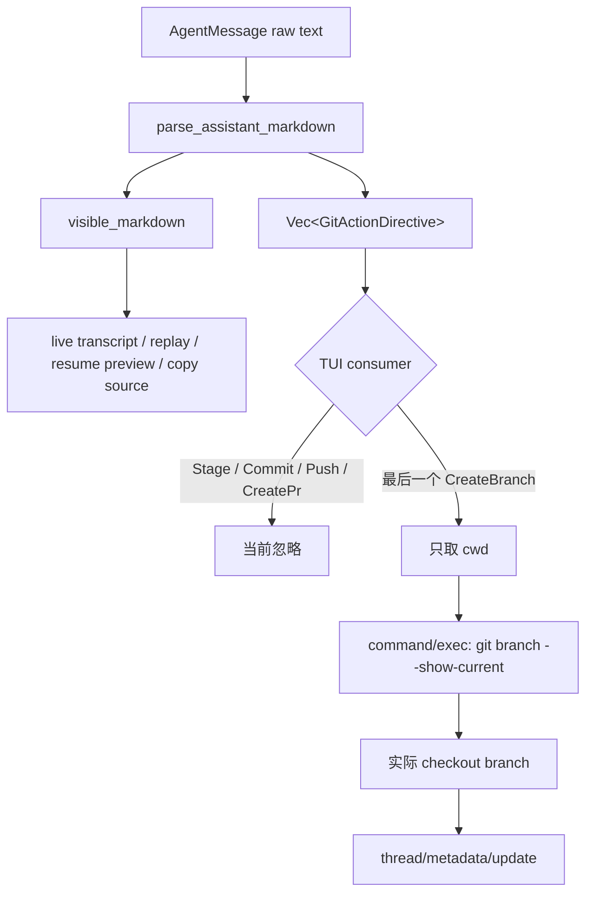

# Assistant Markdown Directives 与产品投影

Codex App 会把一组不可见指令嵌入 assistant markdown。TUI 为兼容这些消息，在显示前解析 `git-*` 和 `code-comment` 指令。本专题关注的不是 Git 命令本身，而是一个更通用的问题：**模型输出中的控制信息，应该如何从可见文本中分离，并安全地变成产品状态？**

研究快照：`main@ab6a7eb87cc8a816c88b86c44cf291e251ed2136`。

## 1. 协议形态

`tui/src/git_action_directives.rs` 识别五种 Git action：

```rust
enum GitActionDirective {
    Stage { cwd: String },
    Commit { cwd: String },
    CreateBranch { cwd: String, branch: String },
    Push { cwd: String, branch: String },
    CreatePr { cwd: String, branch: String, url: Option<String>, is_draft: bool },
}
```

wire format 却不是 `ThreadItem`、tool call 或 typed event，而是 assistant 文本中的 magic syntax：

```text
::git-stage{cwd="/repo"}
::git-create-branch{cwd="/repo" branch="feature/x"}
::git-create-pr{cwd="/repo" branch="feature/x" url="..." isDraft="true"}
```

此外，App 的 code review 注释使用：

```text
::code-comment{title="..." body="..." file="..." start=10 end=12 priority="P2"}
```

TUI 把它降级为普通 Markdown 列表，从而在不支持原生 review card 的终端里仍能阅读。

## 2. 真实处理链



调用点包括：

- `chatwidget/streaming.rs::on_agent_message_item_completed`：最终消息完成时解析；
- `chatwidget/turn_runtime.rs::on_task_complete`：清洗通知和 copy source；
- `thread_transcript.rs::thread_to_transcript_cells`：从持久化 Thread 重建 transcript；
- `resume_picker.rs`：预览旧会话时隐藏指令；
- `chatwidget/streaming.rs::flush_answer_stream_with_separator`：最终 consolidation 再生成 canonical visible markdown。

raw AgentMessage 仍保留在 rollout / App Server Thread 中；TUI 只改变产品投影。这个边界很重要：**存储事实不因某个 client 的降级显示规则而丢失**。

## 3. 值得学习的代码与设计

### 3.1 不相信模型声明的 branch

`CreateBranch` 同时带 `cwd` 和 `branch`，但 TUI 不把声明的 `branch` 直接写进 metadata。它只以 `cwd` 触发：

```text
current_branch_name
  -> WorkspaceCommand argv ["git", "branch", "--show-current"]
  -> 成功且非空
  -> SyncThreadGitBranch
  -> thread/metadata/update
```

metadata 最终保存的是 workspace 的实际 checkout 状态，而不是模型声称自己创建了什么。这是非常值得迁移的 **claim → observe → persist** 模式：模型输出可以提示系统重新观察，但不能直接成为副作用成功事实。

### 3.2 Replay 不重复触发外部观察

`on_agent_message_item_completed` 只有 `from_replay=false` 才启动 branch probe。恢复旧 transcript 只重建 UI，不重复执行 workspace command，也不重写 metadata。

这体现了 event projection 的关键不变量：replay 应重放事实，而不是重放副作用。当前 Agent 项目的 Web reconnect、历史恢复和 event replay 也应明确区分这两条路径。

### 3.3 迟到状态更新携带 Thread owner

branch probe 在后台 task 中执行，完成后发送 `SyncThreadGitBranch { thread_id, branch }`。即使用户已经切换到另一个 widget，metadata update 仍指向原 Thread。

owner capture 比“完成时读取当前 Thread”更可靠。不过它还缺 operation generation，后文会说明。

### 3.4 Workspace command 使用 argv、timeout 与 output cap

`WorkspaceCommand::new` 默认：

- argv 直接传递，不经过 shell 插值；
- 5 秒 timeout；
- stdout/stderr 各受 64 KiB 级 capture policy 约束；
- Git probe 设置 `GIT_OPTIONAL_LOCKS=0`；
- GitHub probe设置 `GH_PROMPT_DISABLED=1` 和 `GIT_TERMINAL_PROMPT=0`。

这是后台 metadata probe 的好模板：固定 executable/argv、禁止交互、限制时间和输出、失败只让可选 UI 缺席。

### 3.5 Code comment 的 progressive enhancement

支持原生 review card 的 App 可以消费 structured directive；TUI 至少把 title、priority、file range 和 body 转为可读 Markdown。这比直接丢弃未知产品能力更友好，也说明跨 client protocol 应提供“typed semantic + text fallback”。

当前实现只有 text magic，没有真正的 typed semantic；但 fallback 方向本身值得保留。

## 4. 当前行为的准确边界

### 4.1 TUI 并不会执行 Git action

虽然 enum 有 Stage、Commit、CreateBranch、Push、CreatePr，当前 TUI 只对 `CreateBranch` 做一次只读 branch probe；它不会因为 assistant 文本自动 `git add`、`git commit`、创建 branch、push 或创建 PR。

因此不能把 parser 的类型表误写成 TUI 的副作用能力表。更准确的三层区分是：

| 层 | 当前事实 |
| --- | --- |
| 文本语法 | 能表达五类 Git action |
| TUI parser | 能解析、去重并从显示文本隐藏五类 action |
| TUI executor | 只把最后一个 CreateBranch 的 cwd 用于重新观察实际 branch |

### 4.2 Malformed 与 unknown directive 会从 UI 消失

`strip_line_directives` 一旦找到 `::git-...{...}` 和闭合 `}`，无论 `parse_git_action` 是否成功，都会消费这段文本。测试 `hides_malformed_directives_without_materializing_rows` 明确固定了这一行为：缺少 branch 的 push directive 被隐藏，同时不生成 action。

未知名称、缺必要字段、错误 boolean 或重复 attribute 也可能静默消失。用户看到的是“清洗后文本”，没有 unsupported/malformed placeholder，也无法知道模型输出过什么。

### 4.3 Parser 不理解 Markdown 语境

Git directive 扫描逐行查找 `::git-`，不判断当前位置是否在：

- fenced code block；
- inline code；
- Markdown link/title；
- 引用或普通说明文本。

因此 assistant 只是演示语法时，示例也会被隐藏并进入 action 列表。`code-comment` 只在去掉缩进后以 1–3 个冒号开头时识别，语境规则与 git directive 又不一致。

更可靠的实现应先走 Markdown AST，再只在顶层 dedicated directive node 解析 control data；最理想是让 control data 根本不进入 markdown 字符串。

### 4.4 Streaming 与最终投影短暂分叉

`StreamCore` 对 newline-complete raw markdown 直接渲染，只有 item completed / stream consolidation 时才调用 `parse_assistant_markdown`。所以一行 directive 如果已流式稳定提交，可能短暂出现在 live transcript，最终又在 canonical cell 中消失。

这说明 display sanitizer 必须作用在所有投影阶段，或者 protocol 从一开始就把 text delta 与 action item 分流。只在 final payload 清洗会制造 UI 闪烁和 copy/reflow 不一致。

### 4.5 Model-controlled cwd 仍是 authority input

branch 名不会被模型直接持久化，但 `cwd` 会被转换为 `PathBuf` 并传给 `command/exec`。App Server 使用 `config.cwd.join(cwd)`；绝对路径可以替换 base，代码没有 canonical containment check。

实际 argv 固定为只读 `git branch --show-current`，并受默认 sandbox policy、timeout 和 output cap 约束，所以风险小于任意命令执行；但它仍允许模型触发 workspace 外目录的 Git metadata probe。远程 App Server 场景下，路径还属于远端 host，而不是 TUI 本机。

正确边界应是 directive 引用一个已注册 workspace ID，server 从 registry 解析 cwd，不能让模型提交 host path。

### 4.6 Last matching directive 与异步陈旧写入

同一消息多个 `CreateBranch` 只取最后一个 cwd。随后异步读取当前 branch，再无 revision/CAS 地写 Thread metadata：

- probe 开始后用户可能再次 checkout；
- 后一 Turn 可能已经产生更新的 branch directive；
- 旧 probe 可以晚于新 probe完成并覆盖 metadata。

`thread_id` 防止跨会话错投，却不能防止同一 Thread 内的 old-operation/new-state race。更新至少需要 `observedAt + HEAD sha`，更稳妥的是以 repository state generation 做 compare-and-set。

### 4.7 Metadata 字段缺少输入预算

App Server `normalize_thread_metadata_git_field` 只 trim 并拒绝空字符串，没有 branch/SHA/origin URL 的长度、control character 或格式限制。当前 TUI branch 来自 Git stdout且 output capped，但其他 App Server client 可直接调用 `thread/metadata/update`。

UI metadata 仍是跨入口协议，需要服务端 canonical validation，而不是依赖一个 client 的 probe 足够正常。

## 5. Parser 细节与可演进性

### Git attributes

`parse_attributes` 支持 quoted/unquoted value，但 quoted value直接找下一个 `"`，不支持 escaped quote；重复 key 由后值覆盖。`isDraft` 只有精确字符串 `true` 才为真，其他值静默当 false。

### Code comment attributes

`parse_code_comment_attributes` 单独实现了另一套 parser，并只对 `\"` 做 escape。整数 parse 失败会 fallback：start 默认 1、end 默认 start、end 小于 start 会被 clamp。priority 可从 title 已有 `[P?]` 或 attribute 推导。

两套相似 parser 已出现语义漂移。若保留文本协议，应共享 tokenizer、显式 version、大小预算和 typed parse error；否则每个 client 都会产生稍有不同的兼容实现。

## 6. 测试证据

### 已有测试

| 测试 | 覆盖内容 |
| --- | --- |
| `strips_and_parses_git_action_directives` | 多 action、去重和 Windows path |
| `hides_malformed_directives_without_materializing_rows` | malformed action 静默隐藏 |
| `renders_code_comment_directives_as_markdown` | priority、range clamp、quoted body 与降级显示 |
| `preserves_non_directive_and_malformed_code_comment_text` | code comment 解析失败时保留原文 |
| `last_created_branch_cwd_uses_the_last_matching_directive` | 多 CreateBranch 的 last-match 规则 |

### 缺失测试

1. fenced code、inline code、blockquote 和链接中的 literal directive 不应触发 action。
2. streaming 中 directive 不应先显示后消失。
3. model cwd 为 absolute、`..`、symlink、远端不存在路径时的 containment。
4. branch probe old/new completion 乱序时不能覆盖更新 metadata。
5. replay、resume picker、copy、notification、raw mode 和 rich mode 得到一致 visible text。
6. 重复 attribute、escaped quote、超长 line、数万 directives 和 Unicode/control 输入。
7. `thread/metadata/update` 对 branch/SHA/origin URL 的服务端长度与格式约束。
8. Stage/Commit/Push/CreatePr 当前无 executor 的行为应有明确 contract test，防止未来无意启用副作用。

## 7. 架构解释

这里同时存在三种数据：

1. `raw assistant text`：模型真正输出、需要持久化和审计；
2. `visible markdown`：某个 client 的可读投影；
3. `proposed action`：模型建议产品执行或重新观察的结构化意图。

把三者编码进一个字符串可以快速兼容旧协议，却会让 Markdown parser 承担控制面职责。Codex TUI 通过“不执行高风险 action、CreateBranch 只 observe 实际状态、replay 禁止副作用”控制了主要风险；长期更稳的形态仍应是 typed item：

```ts
type AssistantProductItem =
  | { type: 'text'; markdown: string }
  | { type: 'codeComment'; title: string; body: string; location: SourceRange }
  | { type: 'proposedGitAction'; action: GitAction; workspaceId: string; proposalId: string };
```

client 不支持某个 typed item 时，由协议携带明确的 `fallbackMarkdown`，而不是重新扫描自由文本。

## 8. 迁移建议

当前 NestJS Agent 可以直接吸收以下原则：

- 模型的成功声明只能触发 server observation，不能直接写 durable success；
- reconnect/replay 只重建投影，不重复外部副作用；
- async result 捕获原 `conversationId/agentRunId`，并带 operation generation；
- proposed action 与 visible message 使用不同 contract；
- workspace 使用 server-issued ID，不接受模型提供绝对路径；
- unsupported action 必须可见降级或明确记录，不能静默吞掉；
- service 端验证所有入口，不能把安全性寄托在官方 Web client。

当前项目不需要实现 Git directives。它真正值得学习的是 claim、observation、durable fact 和 client projection 之间的分层。

## 9. 推荐阅读与 Teach-back

阅读顺序：

1. `tui/src/git_action_directives.rs`；
2. `chatwidget/streaming.rs::on_agent_message_item_completed`；
3. `branch_summary.rs::current_branch_name`；
4. `workspace_command.rs::{WorkspaceCommand,AppServerWorkspaceCommandRunner}`；
5. `app-server/src/request_processors/command_exec_processor.rs::exec_one_off_command_inner`；
6. `app_server_session.rs::thread_metadata_update_branch`；
7. `app-server/src/request_processors/thread_processor.rs::thread_metadata_update_response_inner`；
8. `thread_transcript.rs` 与 `resume_picker.rs` 的 replay 投影。

Teach-back：

1. 为什么 enum 中存在 `Push` 不能证明 TUI 会 push？
2. 为什么忽略模型给出的 branch，再运行 `git branch --show-current` 是更可靠的事实采集？
3. 为什么 `from_replay` 是副作用边界，而不只是渲染优化？
4. `thread_id` 已经正确时，旧 branch probe 仍可能怎样覆盖新状态？
5. 为什么 Markdown AST 感知 parser 仍不如 typed protocol item？
