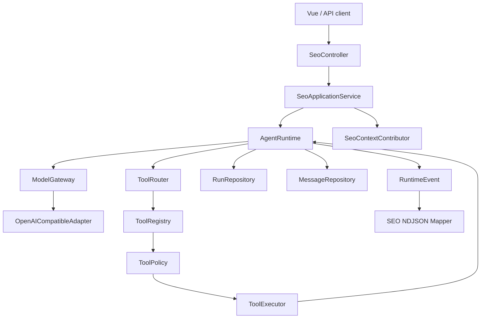

# 从 Codex 客户端架构到云端 NestJS Agent

本页主要属于 **迁移建议**。Codex 源码事实以 `ab6a7eb87cc8a816c88b86c44cf291e251ed2136` 为基线，当前项目事实以 `5f2ad11f2c65425e84392e81048364d55ec626ef` 为起点；建议不表示任一系统已经采用目标设计。

## 1. 转换原则

Codex 主要在用户设备上运行，天然拥有本地工作区、进程、文件系统和交互式审批。当前 AI SEO Agent 是云端服务，面对的是 HTTP 客户端、PostgreSQL、用户身份、租户数据和服务端资源。

因此迁移公式不是：

```text
Codex Rust 类型 -> TypeScript 同名类型
```

而是：

```text
Codex 解决的约束
  -> 判断约束在云端是否存在
  -> 用 NestJS/PostgreSQL/worker/HTTP 的方式表达
  -> 保留最小可验证边界
```

## 2. 运行位置差异

| 维度 | Codex 客户端 | 当前云端 Agent | 设计影响 |
| --- | --- | --- | --- |
| 身份 | 本机登录账户 | 多用户/多租户请求 | 每条资源都要 server-side scope |
| 状态 | 本地 thread/session | 数据库 + 多实例内存 | canonical state 必须持久化 |
| 工具 | 文件、shell、Git、MCP | SEO 数据、HTTP 服务、业务写操作 | 权限和幂等比 OS sandbox 更早 |
| 流式连接 | 本地 stdio/ws | 浏览器 HTTP NDJSON | 断连不等于任务一定停止 |
| 进程 | 单机 runtime | API/worker 多实例 | 取消、锁、恢复不能只靠内存 |
| 存储 | rollout JSONL + state | PostgreSQL | 需要查询、租户隔离和事务 |
| 成本 | 用户订阅额度 | 服务账户模型/工具成本 | 每 Run 归因和预算 |
| 扩展 | 本地 skills/plugins/MCP | 服务端 registry / connector | 信任、凭证和版本治理 |

## 3. 分层映射

### 3.1 Entrypoint

Codex：CLI / App / IDE / SDK。

云端建议：

```text
REST / NDJSON Controller
Cron trigger
Webhook trigger
Admin replay endpoint
  -> AgentApplicationService
  -> AgentRuntime
```

规则：入口只做鉴权、DTO 校验、请求映射和传输，不实现模型工具循环。

### 3.2 Protocol facade

Codex：app-server JSON-RPC。

云端建议：继续使用 Nest HTTP + NDJSON；内部定义 provider-neutral events。只有出现多个复杂双向客户端时，才评估 WebSocket 或独立 protocol server。

### 3.3 Thread

Codex：Thread + ThreadStore。

云端建议：

```text
Conversation
  id
  tenantId / ownerId
  status
  metadata
  createdAt / updatedAt
```

Conversation 是业务资源，任何 read/write 必须携带从认证上下文得到的 scope。

### 3.4 Turn / Run

Codex：Turn 是一次请求及其后续 Agent 工作。

云端建议：保留 `AgentRun`，逐步增加：

- `clientRequestId` / idempotency key
- model / provider / prompt version
- trigger source
- terminal reason
- usage / cost summary
- trace id
- lease / heartbeat（进入 worker 后）

### 3.5 Item / Step

Codex：丰富的 TurnItem 和 EventMsg。

云端建议：不复制所有 item，按业务恢复需求增加 AgentStep：

- `model_sampling`
- `tool_call`
- `tool_execution`
- `approval_wait`
- `observation_append`
- `context_compaction`

每个 step 只保存可审计摘要；大 payload 另存或截断。

### 3.6 Agent loop

Codex：`run_turn` 中根据 `needs_follow_up` 循环。

云端建议：

```ts
while (!completed && budget.allowsNextStep()) {
  const modelEvents = await model.sample(context, tools)
  const decision = reduceModelEvents(modelEvents)

  if (decision.finalAnswer)
    return complete(decision.finalAnswer)

  const observations = await executeToolCalls(decision.toolCalls)
  context = appendObservations(context, observations)
}
```

真实实现可以继续使用 async generator，但循环、预算、状态和持久化必须显式。

### 3.7 Tool architecture

Codex：ToolSpec -> ToolRouter -> ToolRegistry -> Runtime -> Orchestrator。

云端最小版本：

```text
ToolDefinition
  name / version / description / inputSchema
  timeoutMs / requiresApproval / idempotent / risk metadata

ToolRouter
  provider event -> ModelToolCallCandidate
  candidate + server samplingAttemptId -> UnvalidatedToolCallEnvelope
  registry lookup + parse + schema validation -> ValidatedToolInvocation

ToolRegistry
  name -> ToolExecutor

ToolExecutor
  accept validated invocation -> authorize -> execute -> ToolResult

ToolPolicy
  allow / approval_required / deny
```

第一版可把 policy 简化为只允许 `riskLevel=LOW && sideEffect=NONE`，但不要把 policy 判断散在每个 controller。

Envelope 必须保留 rawArgumentsJson、callId、samplingAttemptId；validated invocation 才携带 typed input 和 server registry 给出的 toolVersion。executionAttempt 属于执行边界。三者不能用一个“全是 optional 字段”的 ToolCall 混在一起。

### 3.8 Context

Codex：ContextManager + normalization + token budget + compaction。

云端建议逐步形成：

```text
AgentContextBuilder
  -> system instructions
  -> conversation messages projection
  -> business context
  -> tool call/output pairs
  -> summary
  -> current input
  -> token budget policy
```

`SeoContextBuilder` 可以先演进为 domain-specific contributor，由通用 ContextBuilder 负责预算和 normalization。

### 3.9 Persistence

Codex：rollout canonical items + ThreadStore。

云端建议：

- PostgreSQL 是 canonical state。
- NDJSON delta 是 transport，不作为每 token 事实。
- Message 保存用户可见最终内容。
- Run/Step 保存执行事实。
- ToolCall / Approval 若查询和恢复需求增大，再独立建模。
- outbox / event store 只在真实跨进程投递需求出现时引入。

### 3.10 Cancellation

Codex：CancellationToken 贯穿 sampling 和 tools。

云端阶段化：

1. 当前单实例：AbortSignal 贯穿 provider 和 executor。
2. 多实例：持久化 `cancelRequestedAt`，worker 周期检查。
3. 外部 tool：调用支持取消的 API，或标记不可取消并等待完成。
4. 最终状态由 server canonical state 决定，不由浏览器本地猜测。

单机 timeout 也不能只触发 signal 后继续等待 executor。Execution boundary 要主动 race executor/user abort/deadline；不配合取消的 executor 不应阻塞 outer Run，晚到 resolve/reject 不能再次更新终态或触发下一轮。

## 4. 安全映射

### 4.1 Approval

Codex 的本地弹窗转换为云端 approval resource：

```text
ApprovalRequest
  id
  tenantId
  runId
  toolCallId
  requestedActionSummary
  status
  expiresAt
  decidedBy
  decidedAt
```

前端只提交 decision；后端重新加载原 ToolCall 和身份，不信任前端回传完整参数。

### 4.2 Permission

建议三层：

1. 用户是否能访问 Conversation。
2. 租户是否启用某工具。
3. 该 Run 是否满足工具资源条件。

模型不能提供 `tenantId` 来决定访问范围。

### 4.3 Sandbox 替代层

当前不做 OS sandbox，先做：

- HTTP domain allowlist。
- timeout / response size limit。
- worker 使用最小权限凭证。
- secret 不进入 model context。
- tool output 脱敏。
- 外部副作用幂等。

只有通用代码执行、用户脚本或不可信插件出现时，才进入容器/VM sandbox。

Tool output 本身也是不可信输入：网页中嵌入的命令式文字只能保持 tool-result data role，不能拼成 system/developer instruction，也不能修改 tenant scope、approval 或 write policy。raw cause/stack 即使只记录在服务端日志，也必须先限长、脱敏，不展开 raw arguments/result。

## 5. 可靠性映射

### 5.1 从本地 Session 到 Durable Run

| 本地假设 | 云端风险 | 云端措施 |
| --- | --- | --- |
| 进程与 Thread 同寿命 | 实例随时重启 | DB terminal state + recovery |
| 一个客户端控制运行 | 多端/重试 | idempotency + optimistic lock |
| 断开即停止 | 代理断连不等于任务取消 | cancel API / persisted flag |
| 本地文件顺序写 | 多 worker 并发写 | transaction / lease / version |
| 用户自己承担成本 | 服务端统一付费 | per-run usage attribution |

### 5.2 Worker 迁移门槛

满足以下条件前，不建议引入 BullMQ / Kafka / workflow engine：

- Run 状态机有自动化测试。
- 请求幂等。
- cancellation 有持久化表达。
- tool side effect 可重试。
- worker 能从 DB 重建 context。
- API 能通过查询/stream 观察后台状态。

## 6. 不照搬清单

- 不把 app-server JSON-RPC 作为当前 Web 项目的必要前置。
- 不把 rollout JSONL 与 PostgreSQL 双写。
- 不为 SEO 工具实现 shell permission profile。
- 不为一个只读工具引入插件 marketplace。
- 不把每个 Codex TurnItem 建成一张表。
- 不在没有测试时做并行 tool calls。
- 不在没有租户边界时开放任意外部 connector。
- 不在单 Agent loop 未稳定时做 supervisor/worker Multi-agent。

## 6.1 同步与 Streaming 入口必须同源

当前 `/seo/chat` 与 `/seo/chat/stream` 分别走 direct LLM 与 AgentRuntime。进入 tool loop 后必须共享一个 turn runner：stream 入口转发 events，同步入口消费到 terminal 后只返回 final。若 tool-mode sync 尚未迁移，宁可明确返回 unsupported，也不能保留一套无 tools/steps 的旁路。

若 MVP 为识别 mixed text/tool call 而把本轮内容缓冲到 terminal，再 replay delta，它只保持外部 event schema/content，不保持首 token/实时性；产品验收必须明确这项取舍。

## 7. 建议目标架构



注意：这是方向图，不是下一次 commit 的文件清单。当前阶段只实现图中与 Tool loop 直接相关的最小部分。

## 8. 演进触发条件

| 何时发生 | 再引入什么 |
| --- | --- |
| 第二个工具出现 | registry 与 tool module 组织成熟化 |
| 第一个写操作工具出现 | approval + idempotency + audit |
| history/tool output 接近 context 上限 | token budget + compaction |
| active Run 跨 API 实例 | worker + lease + persistent cancel |
| 多个外部工具提供方 | MCP adapter / connector abstraction |
| 单 Agent 指标稳定且任务天然可并行 | Multi-agent experiment |

架构升级应由真实约束触发，而不是由 Codex 已经拥有某个功能触发。
