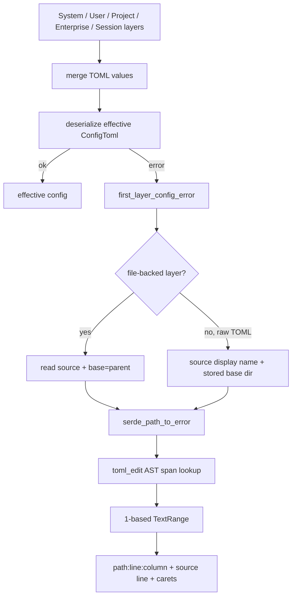

# 分层 Config 的源码级诊断

Codex 配置来自 system、user、project、enterprise/MDM、session flags 和 CLI overrides。真正困难的不只是把 TOML 反序列化，而是当合并后的 typed config 失败时，指出“哪个来源、哪一行、哪一列、哪个字段错了”，同时兼容 raw cloud fragments、relative path 和 strict unknown-field policy。本专题研究 `codex-config` 的诊断链。

研究快照：`main@ab6a7eb87cc8a816c88b86c44cf291e251ed2136`。

## 1. 错误模型

`config/src/diagnostics.rs` 定义：

```text
ConfigError
  path: PathBuf
  range: TextRange
    start: line + column
    end: line + column
  message

ConfigLoadError
  ConfigError
  optional original toml::de::Error source
```

`ConfigError` 是可展示、可定位的domain error；`ConfigLoadError` 保留底层error chain并可包装为 `io::Error`。调用者既能给用户源码片段，也能让日志/错误框架沿 `source()` 看到原始parser原因。

## 2. 从 merged failure 回到具体 layer



`first_layer_config_error` 以 lowest-precedence-first 读取启用layer：

- file layer：按 source file读取，parent作为relative path base；
- raw enterprise/MDM fragment：使用可读的 synthetic source name，并使用fragment携带的base dir；
- missing/unreadable file：跳过并debug记录；
- disabled layer：不参与定位；
- SessionFlags等没有可重放source的layer：不能生成source diagnostic。

这条路径只在effective config已经失败时启动，避免正常启动为诊断重复读所有文件。

## 3. Typed error 如何映射到 TOML span

### 3.1 `serde_path_to_error` 提供业务路径

普通 `toml::de::Error` 可能只有最终value span。Codex使用 `serde_path_to_error::deserialize` 得到类似：

```text
profiles.work.features.foo
mcp_servers.example.command
permissions.network.allowed_domains[2]
```

该path更接近typed config结构，能回答“哪个嵌套字段失败”。

### 3.2 `toml_edit` 重新建立source AST

`span_for_config_path` 把同一contents再parse为 `toml_edit::Document`，然后沿：

- table/item；
- inline table；
- array；
- array of tables；
- enum/map/seq serde segment；

寻找具体 `Item/Table/Value.span()`。若AST定位失败，再fallback到底层 TOML error span，最后fallback `1:1`。

这种双parser组合很实用：serde负责类型语义，toml_edit负责保留source位置。

### 3.3 Strict unknown field定位key而不是value

`strict_config.rs` 使用 `serde_ignored` 收集未消费字段，再调用 `span_for_toml_key_path`，优先返回最后一个key token的span。

所以：

```toml
unknown_key = true
```

caret会覆盖 `unknown_key`，而不是 `true`。对“字段拼错”来说，这是更正确的交互反馈。

### 3.4 Features table的特殊兼容

Feature解析的typed path有时只落到 `features` table。`span_for_features_value` 会寻找第一个非boolean value，避免把整张table或header标红。Strict mode又单独枚举root/profile下的unknown feature key，因为feature registry不是普通serde struct字段。

## 4. 值得学习的代码

### 4.1 Type semantics 与 source semantics分工

Codex没有尝试自己写TOML parser：

- `toml` / serde判断类型是否合法；
- `serde_path_to_error`提供typed property path；
- `toml_edit`提供source-preserving span；
- 自己只写薄的path traversal和fallback。

这是高质量基础设施代码的典型取舍：组合成熟库，让自定义逻辑只负责领域间的缺口。

### 4.2 Relative path诊断复用真实base语义

Config含 `AbsolutePathBuf` 时，诊断重放必须和正常loader使用相同base。代码在同步deserialize作用域内持有 `AbsolutePathBufGuard`：file用parent，raw fragment用metadata base dir。

否则正常加载时合法的 `instructions.md`，在diagnostic重放中可能报“不是absolute path”，把真实type error掩盖掉。

### 4.3 Raw cloud layer保留可读provenance

Enterprise fragment没有本地文件path时，`ConfigDiagnosticSource::DisplayName` 会生成：

```text
enterprise-managed (Base policy, cfg_123)
```

测试 `raw_toml_diagnostics_use_enterprise_layer_name` 验证第二行第九列的integer type error，同时不伪造一个不存在的文件路径。

### 4.4 Error fallback是单调降级

最佳证据到最差证据依次为：

```text
typed path AST span
  -> toml parser span
  -> 1:1 default range
  -> header-only display if source unavailable
```

定位精度下降时仍保留path和message，不因渲染失败丢掉原始配置错误。

### 4.5 Type error优先于unknown field

Strict validation先运行typed deserialize；只有成功后才报告ignored/unknown field。测试 `type_errors_take_precedence_over_ignored_fields` 固定了这一优先级。

这避免用户先修一个无关拼写，下一次才看到配置根本无法反序列化的主错误。

### 4.6 Forward-compatible opaque namespace

Strict config仍显式接受 `[desktop]` opaque keys。测试 `strict_config_accepts_opaque_desktop_keys` 说明strict不等于“拒绝所有当前crate不认识的字段”；协议拥有者可以保留其他产品端的namespace。

这是多client共享配置文件的重要边界。

## 5. Renderer 细节

`format_config_error` 输出：

```text
/path/config.toml:3:1: unknown configuration field `unknown_key`
  |
3 | unknown_key = true
  | ^^^^^^^^^^^
```

实现处理：

- 1-based line/column；
- CRLF行尾；
- empty/out-of-range span；
- multi-line error只在start位置放一个caret；
- source读取失败时只输出header。

输出形态兼容常见compiler diagnostics，也便于IDE/terminal识别 `path:line:column`。

## 6. 精确性与并发边界

### 6.1 Lowest-precedence first不等于causal provenance

Effective config失败后，代码逐个独立deserialize layer并返回第一个错误。一个低优先级layer的坏值可能已被高优先级layer覆盖；effective failure实际来自另一个字段/来源。此时“找到一个真实layer error”不一定等于“找到导致merged failure的那一条”。

更精确的算法应从effective typed error path出发，查询merge provenance：哪个最高优先级layer最终提供了该path/value，再只重放该source。

当前实现是可操作heuristic，不应被解释为因果证明。

### 6.2 `node_for_path` 跳过缺失map segment可能误定位

为兼容serde flatten，path traversal在中间map segment找不到、且后面还有segment时，会跳过当前segment并在同一node继续。它能修复一些flatten path，却可能命中另一个层级的同名key，给出错误caret。

应记录exact/flatten-skipped/fallback的定位confidence，或让flatten mapping由schema metadata显式描述。

### 6.3 Features错误只选择第一个非boolean value

当多个feature value类型错误时，special handler返回source顺序第一个非boolean，不一定与serde error的实际key一致。Strict unknown feature有完整path，type error path却可能粗化。

报告至少应在message中保留实际field名，测试多个bad feature的选择语义。

### 6.4 Caret column不等于terminal display column

`position_for_offset`按Unicode scalar count计算column，renderer用普通spaces。以下内容会错位：

- tab；
- CJK wide character；
- combining mark；
- emoji ZWJ；
- bidi/control character。

Source location的逻辑column仍可用于机器跳转，但terminal caret需要按tab stop和Unicode display width渲染，并过滤控制序列。

### 6.5 Mid-codepoint span fallback成byte column

TOML parser正常应返回UTF-8 boundary；若第三方span或out-of-range index落在multi-byte codepoint中，`from_utf8`失败后column改用byte offset。API没有显式标明column unit。

应定义column是UTF-8 byte、Unicode scalar还是UTF-16，并在protocol/IDE适配时转换。

### 6.6 Source reread存在TOCTOU

`format_config_error_with_source` 根据 `error.path` 再读文件。ConfigError生成后文件可能被编辑或原子替换，旧range会标到新contents。

错误对象应携带source snapshot/hash/version或已渲染snippet。对raw synthetic source，path本来就不可读，调用该helper只会退化为header-only。

### 6.7 `AbsolutePathBufGuard` 不是nested-safe

guard基于thread-local `Option<PathBuf>`：new覆盖，drop直接清None，不恢复前一个base。注释也要求同线程、single-threaded deserialize。

当前diagnostic在guard scope内同步parse且不await，满足约束；未来若嵌套guard或把parse移进spawn/await，会错误解析relative path。更稳实现应保存previous value并在Drop恢复，或把base作为Deserializer context显式传入。

### 6.8 一次只返回一个错误

Strict mode收集多个ignored path，却只取第一个；typed deserialize也在首错停止。适合快速修复，但大配置可能经历多轮“修一处再跑一次”。

若要batch diagnostics，应区分parser fatal error和可独立收集的unknown/deprecated fields，并保持每项provenance/span。

## 7. 安全边界

### 7.1 Source line可能包含secret与terminal control

`format_config_error`原样打印出错行。若错误发生在API key、Bearer token、proxy URL或带ANSI/OSC control的value，诊断会把secret/terminal escape输出到屏幕、日志或support paste。

Config diagnostics需要field-sensitivity registry：

- secret field显示key和类型，不显示value；
- URL移除userinfo/query；
- control character可视化转义；
- error message中的serde debug value也要redact。

### 7.2 Synthetic source name不应伪装成filesystem path

当前统一用`PathBuf`保存真实path和display name，`format_config_error_with_source`无法区分。类型应改为：

```ts
type ConfigSource =
  | { kind: 'file'; path: string; contentVersion: string }
  | { kind: 'managed'; label: string; fragmentId: string };
```

这也方便权限审计和UI跳转能力协商。

### 7.3 File read没有显式size budget

Layer loader通常已经读过配置，但diagnostic会再次 `read_to_string` 并再次parse为TOML/toml_edit AST。异常超大config可能造成重复内存和CPU。应复用已捕获source snapshot，并有配置文件size/depth/key count上限。

## 8. 测试证据

### 已有测试

| 测试 | 覆盖内容 |
| --- | --- |
| `ignored_toml_field_errors_accept_non_file_source_names` | synthetic source和unknown key span |
| `type_errors_take_precedence_over_ignored_fields` | type error优先级与value span |
| `strict_config_rejects_unknown_feature_key` | root feature key定位 |
| `strict_config_rejects_unknown_profile_feature_key` | profile feature嵌套path定位 |
| `strict_config_accepts_opaque_desktop_keys` | desktop namespace forward compatibility |
| `raw_toml_diagnostics_use_enterprise_layer_name` | raw enterprise provenance、relative base和准确line/column |

### 应补测试

1. lower invalid但被higher有效覆盖，同时effective error来自另一layer的causal provenance。
2. nested flatten出现同名key时不误定位。
3. 多个features类型错误、unknown fields的deterministic选择。
4. tab/CJK/combining/emoji/control的logical column与render caret。
5. source在error生成后变化，snippet拒绝错误version。
6. nested `AbsolutePathBufGuard`恢复previous base；guard跨await/thread明确失败。
7. API key/proxy URL/ANSI/OSC所在error line的redaction与escape。
8. raw synthetic source不尝试filesystem read。
9. huge/deep TOML的bytes/AST/node budget。
10. array/array-of-table/inline-table/enum path span。
11. CRLF、empty document、EOF span、mid-codepoint和out-of-range span。
12. disabled/unreadable layer与SessionFlags的provenance fallback。

## 9. 架构解释

Config error不是一个字符串，而是：

```text
effective validation failure
  + field path
  + merge provenance
  + immutable source revision
  + source range with declared units
  + sensitivity classification
  + audience-specific rendering
```

Codex已经把typed path、source AST和layer source组合起来，形成了很强的基础；尚缺的是merge-level provenance、immutable source snapshot和敏感字段类型。

## 10. 迁移建议

当前NestJS/Vue Agent的环境变量、provider config、tool policy或workspace settings也会逐步分层。建议迁移：

- validation error包含stable code、property path、source和range；
- effective merge记录每个field provenance；
- API返回typed error，前端负责不同UI投影；
- source revision与error绑定，避免TOCTOU；
- secret field只显示key/expected type；
- unknown field与type error分开收集；
- managed policy显示label/ID而不是伪文件path；
- strict namespace允许明确的opaque client-owned区域。

不必照搬TOML/toml_edit；TypeScript可用Zod/Valibot path、JSON pointer、source map或表单field ID实现相同边界。

## 11. 推荐阅读与 Teach-back

阅读顺序：

1. `config/src/diagnostics.rs::{ConfigError,ConfigLoadError}`；
2. `config_error_from_typed_toml_for_source`；
3. `first_layer_config_error_for_entries`；
4. `span_for_config_path` / `node_for_path`；
5. `span_for_toml_key_path`；
6. `text_range_from_span` / `format_config_error`；
7. `config/src/strict_config.rs`；
8. `config/src/loader/mod.rs` merged failure fallback；
9. `utils/absolute-path::AbsolutePathBufGuard`；
10. strict/cloud layer tests。

Teach-back：

1. serde path与toml_edit span分别解决什么问题？
2. 为什么诊断重放relative path必须使用与loader相同base？
3. lowest-precedence第一个error为什么不一定是merged failure的cause？
4. logical character column为什么可能和terminal caret错位？
5. source rere读为什么会让range失去意义？
6. strict config为什么仍要允许opaque `[desktop]` namespace？
7. 如何让secret配置出错时既可定位又不显示value？
