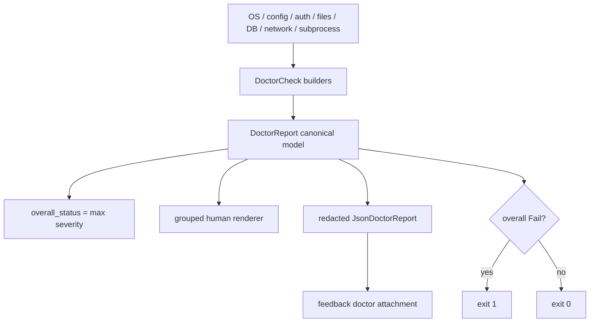

# Codex Doctor：可诊断系统的架构与隐私边界

`codex doctor` 是一个很好的“生产级诊断面”案例。它不是把几十条 `println!` 堆在 CLI 中，而是先生成统一的诊断模型，再分别投影为人类报告、JSON support artifact 和 Feedback 附件。本专题分析其证据模型、并发执行、降级策略、redaction 与可演进性。

研究快照：`main@ab6a7eb87cc8a816c88b86c44cf291e251ed2136`。

## 1. 产品承诺

`DoctorCommand` 支持：

- `--json`：输出 machine-readable、经过 redaction 的 report；
- `--summary`：只改变 human render 密度，不减少实际检查；
- `--all`：展开长列表；
- `--no-color` / `--ascii`：适配日志、CI 与低能力 terminal。

命令是 read-mostly 而不是 repair command。Fail 会令进程退出 1，Warning 仍退出 0；脚本可以区分“环境损坏”和“有建议但可继续”。

## 2. 统一诊断模型

`cli/src/doctor.rs` 先构造：

```text
DoctorReport
  schema_version
  generated_at
  overall_status
  codex_version
  checks: Vec<DoctorCheck>

DoctorCheck
  id / category / status / summary
  details[]
  issues[]
  remediation
  duration_ms

DoctorIssue
  severity / cause
  measured / expected / remedy
  fields[]
```

`summary` 负责一句话结论；`details` 保存观测值；`issue` 把 cause、measured、expected 和 remedy 配对。它比“error message + stack”更适合支持场景，因为每条失败都能回答：测到了什么、期望是什么、下一步是什么。



## 3. Build pipeline 与降级

### 3.1 前置基础检查

`build_report` 先同步检查 system、installation、runtime 和 search。这些检查不依赖完整 Config，确保配置完全损坏时仍有基础证据。

### 3.2 Config 成功路径

Config load 成功后，一次 `tokio::join!` 并发构造：

- config；
- auth；
- updates；
- network；
- WebSocket reachability；
- MCP；
- sandbox；
- terminal；
- Git；
- terminal title；
- state DB / rollout；
- thread inventory；
- background App Server；
- provider reachability。

独立检查并行能把总延迟压到最慢支路附近，而不是所有网络/DB probe 的总和。

### 3.3 Config 失败路径

Config load 失败不直接终止：它生成 `config.load=Fail`，同时使用 fallback cwd / default reachability plan 继续检查 network、terminal、Git、state 和 provider route。

这是诊断工具最值得学习的特性之一：**被诊断对象的主启动路径失败时，诊断路径必须拥有更小的依赖闭包**。否则最需要 doctor 时反而无法运行。

### 3.4 Progress 与最终 stdout 分离

`DoctorProgress` 是独立 port：

- JSON 模式永远 Quiet；
- 非 TTY 或 `TERM=dumb` 也 Quiet；
- interactive human 模式只在 stderr 写可覆盖的 transient line；
- 最终 report 独占 stdout。

这样 `codex doctor --json > report.json` 不会被 spinner 或 heartbeat 污染。`run_async_check` 对慢检查定期 heartbeat，但进度完全不进入最终 schema。

## 4. 值得学习的代码

### 4.1 Canonical report 与 renderer 分离

Human output可以按 category重新排序、加 Notes、做颜色和 summary；JSON则以 check ID作为 key。两者都源自同一个 `DoctorReport`，不会让 CLI 文案成为机器解析协议。

这与 Agent Runtime 中“canonical state + UI projection”是同一种思想：不要让人类文本承担 durable contract。

### 4.2 `--summary` 不改变证据收集

summary只控制 human renderer，不跳过慢检查，也不生成“看起来健康但实际没检查”的缩水结果。报告密度与检查语义正交，是很好的 CLI contract。

如果未来需要 fast mode，应另设明确 flag，并在 report 中列出 skipped checks。

### 4.3 Severity 是有序格

`CheckStatus` 的顺序是 `Ok < Warning < Fail`。整体状态取所有 check 的最大值，单 check 内也用 `status.max(Warning)` 合并次级问题。

这个简单格结构比大量 boolean 更易组合，也很适合 NestJS health/readiness 报告。

### 4.4 JSON 兼容旧字符串细节

内部 detail 仍是 `"label: value"` 字符串，`structured_json_details` 在 JSON 投影时：

- 有 label 的变成 map；
- 重复 label 从 scalar提升为 array；
- 没有 label 的保留到 `notes`，不静默丢弃。

这是一个务实 migration adapter：先稳定机器输出，再逐步把 check builder 改成 typed detail。不过它应该是过渡形态，不应永久让冒号决定 schema。

### 4.5 Best-effort 检查有明确失败等级

Update freshness、optional MCP、stale daemon socket 等降级为 Warning；DB integrity、明确的 config load failure等才是 Fail。缺失的 ephemeral daemon不是错误。

诊断不是“任何异常都红色”，而是把产品能否继续工作的语义编码进 status。

### 4.6 Background server probe 保持被动

`doctor/background.rs` 只读取现有 state/PID/settings/socket；socket存在才尝试 bounded version probe，不启动、不停止 daemon。诊断动作不自动改变被诊断状态，避免 Heisenbug。

### 4.7 Config 使用 ephemeral override

Doctor 复用正常 ConfigBuilder和 CLI overrides，但设置 `ephemeral=true`。检查得到与真实启动接近的 effective config，又不应触发持久 session 状态。

## 5. Redaction pipeline

### 5.1 当前做法

`output.rs::redact_detail`：

- label/value 中出现常见 `token`、`secret`、`authorization`、OpenAI/Codex key名时，把冒号后的部分替换为 `<redacted>`；
- true/false/present/absent 等 presence value保留；
- URL移除 userinfo、query、fragment；多层 path只保留第一段，其余变为 `<redacted>`；
- JSON中的 VISUAL/EDITOR/PAGER/GIT_PAGER/GH_PAGER/LESS只输出 `set`，避免命令参数与inline env泄漏；
- issue的 cause/measured/expected/remedy/fields和 top-level remediation都会在 JSON投影时 redaction。

测试 `redacted_json_report_structures_and_sanitizes_details` 覆盖 URL credential/query、API key、editor/pager inline secret、重复字段与 freeform note。

### 5.2 “redacted” 不等于匿名

JSON仍可包含：

- `CODEX_HOME`、cwd、SQLite path、rollout sample path；
- OS、locale、terminal、版本、feature flag；
- repository metadata、MCP server host；
- account/auth mode是否存在。

这些数据可能没有凭据，却仍能识别用户名、组织目录、项目名和企业环境。Feedback UI只列出 doctor filename，不展示字段级敏感度。

正确文案应区分 secret-redacted 与 privacy-anonymized；当前实现属于前者。

### 5.3 Human headline 未统一 redaction

detail rows 会先过 `redact_detail`，但 human `row_description` 直接使用 raw：

- `check.summary`；
- `issue.cause`；
- `check.remediation`。

JSON对 issue/remediation会redact，Human headline却不一定。若某个check把带userinfo/query的URL写进 issue cause，interactive output可能泄漏。所有输出字段应在 model边界先变成 `SensitiveString` / `PublicString`，而不是靠renderer逐字段记忆。

### 5.4 字符串启发式有绕过与误伤

`redact_detail` 依赖 substring和第一个冒号：

- 无冒号文本若包含secret，输出会把原文本作为“name”保留，再追加 `<redacted>`；
- label含`env var`会提前只做URL redaction，若未来把值也写进去可能漏secret；
- 非URL DSN、base64、cookie、private key、Windows path/UNC、无`://` endpoint不在URL规则内；
- 普通单词包含`token`也可能整行误伤；
- summary/category/id默认被认为安全，没有类型或runtime验证。

结构化producer应直接声明 field sensitivity；字符串扫描只能作为最后一道防线。

### 5.5 Duplicate check ID 会让 JSON 与 overall status 分叉

内部 `checks` 是 Vec，JSON投影 collect 到 `BTreeMap<String, ...>`。若两个check共享ID，后者覆盖前者，而 `overall_status`是在覆盖前对完整Vec计算。

于是 JSON可能显示 overall Fail，却看不到被覆盖的 failing check。当前ID看起来是手工唯一，但构造时没有注册表或断言。Report build结束应验证唯一性并把collision本身变为Fail。

## 6. 资源、并发与副作用边界

### 6.1 `run_async_check` 有 heartbeat，没有统一 deadline

wrapper只记录duration并显示慢检查 heartbeat，不提供 timeout/cancellation。每个check必须自己实现边界。当前 Git、HTTP、WebSocket等多数有局部timeout，但一个新check漏掉timeout会让整个 doctor永久等待。

诊断框架应有 per-check默认deadline、check-specific override和 global deadline；timeout应变为structured Warning/Fail，而不是 task cancellation丢记录。

### 6.2 Sync check 会阻塞 async orchestration

`updates_check`被包装成sync check放入 `tokio::join!`，内部会执行 `npm root -g`、`curl --max-time 5` 等 blocking process；`run_command`使用 `std::process::Command::output`，没有统一timeout或output cap。

虽然curl自身有5秒参数，spawn/pipe/output仍是blocking，其他program也可能挂起。所有process probe应走统一async bounded executor。

### 6.3 Read-mostly 仍包含外部观察副作用

Doctor会：

- 发HTTP / WebSocket；
- 运行git、curl、npm、tmux等process；
- 打开SQLite integrity check；
- 连接现有App Server socket；
- 读取环境、config、rollout和state files。

它不主动repair，但绝不是纯函数。企业环境中应明确显示将访问哪些hosts/commands，允许 `--offline` / `--no-process`，并在report记录哪些check未运行。

### 6.4 Human group是手工静态索引

renderer注释明确：新category未加入`GROUPS`时，JSON仍有，human report会隐藏。新增check缺少compile-time exhaustiveness。

应在测试中断言每个已注册check category都映射到恰好一个human group，或者让group成为check descriptor的一部分。

### 6.5 `std::process::exit` 跳过正常析构

Fail后 `run_doctor`直接 `std::process::exit(1)`。最终stdout已同步写入字符串，但进程级buffer、tracing guard或临时资源没有正常drop保证。更可组合的CLI入口应返回 `ExitCode` / typed error，由main统一退出。

## 7. 测试架构

### 已有证据

| 测试类型 | 示例与价值 |
| --- | --- |
| severity reducer | `overall_status_prefers_fail` |
| progress port | sync/async begin-finish、JSON/non-TTY quiet |
| redaction | URL、path segment、env name、presence boolean、editor/pager |
| renderer snapshots | detailed/summary/ascii/color/notes/fields |
| installation/update | npm root match/mismatch、semver |
| config | override保持、warning分类 |
| MCP | disabled忽略、optional reachability warning、required command failure |
| state/thread inventory | DB/rollout匹配与不一致 |
| environment | system、terminal、Git、title、daemon modules各自unit tests |

### 应补测试

1. 每个check ID唯一、每个category都进入human group。
2. summary/issue/remediation/id/category分别包含secret/URL credential时，Human与JSON都不泄漏。
3. 无冒号secret、`env var ...: secret`、DSN、private key、cookie、UNC和Unicode control。
4. per-check/global timeout；timeout后仍生成完整structured check。
5. blocking child永不退出、写无限stdout/stderr、派生child时doctor能收口。
6. `--offline`语义：network check明确Skipped而非假Ok。
7. duplicate detail labels从One升级Many的schema兼容。
8. Feedback attachment明确列出secret-redacted但含local path/host metadata。
9. config failure fallback路径不触发依赖损坏Config的check。
10. JSON schema/version fixture和unknown future fields兼容。

## 8. 架构解释

一个可维护的诊断系统至少有五层：

```text
Check descriptor
  -> bounded observation
  -> typed finding (status + evidence + remedy)
  -> canonical report
  -> audience-specific privacy projection
  -> human / JSON / support attachment
```

Codex已经很好地具备后四层的雏形：canonical report、严重度、并发、fallback、双renderer和progress隔离。主要技术债是 observation executor不统一、detail仍是字符串、privacy classification仍靠renderer启发式。

## 9. 迁移建议

当前NestJS Agent未来需要 `/health`、support bundle、Run诊断或管理员故障页时，可以迁移：

- check model包含稳定ID、status、evidence、remedy、duration；
- config/DB/provider失败时继续生成部分报告；
- UI报告与JSON API共享canonical model；
- optional subsystem失败不覆盖主系统诊断；
- slow check并行、每项和整体都有deadline；
- machine output stdout保持纯净；
- sensitive字段在类型/producer层标注，按audience生成不同projection；
- support bundle必须有用户可见manifest和审计receipt。

不应照搬本地PATH/process/terminal检查；云端版本应诊断tenant ownership、queue、provider credential reference、DB schema、stream continuity和tool policy。

## 10. 推荐阅读与 Teach-back

阅读顺序：

1. `cli/src/doctor.rs::{DoctorReport,DoctorCheck,DoctorIssue}`；
2. `build_report`和Config failure分支；
3. `run_sync_check` / `run_async_check` / `overall_status`；
4. `cli/src/doctor/progress.rs`；
5. `redacted_json_report` / `structured_json_details`；
6. `cli/src/doctor/output.rs::{render_human_report,redact_detail}`；
7. `doctor/background.rs`作为passive check范例；
8. `doctor/updates.rs`作为blocking/process边界反例；
9. `state_check`与provider/WebSocket reachability；
10. renderer/redaction/progress/fallback tests。

Teach-back：

1. 为什么 `--summary` 不应该减少实际check？
2. Config已经失败时，doctor怎样保持更小依赖闭包？
3. 为什么 progress必须写stderr而JSON独占stdout？
4. secret-redacted与privacy-anonymized有什么区别？
5. `duration_ms + heartbeat` 为什么仍不等于bounded check？
6. 为什么一个duplicate check ID能让overall status与JSON细节矛盾？
7. 如何用类型系统替代 `redact_detail` 的substring启发式？
