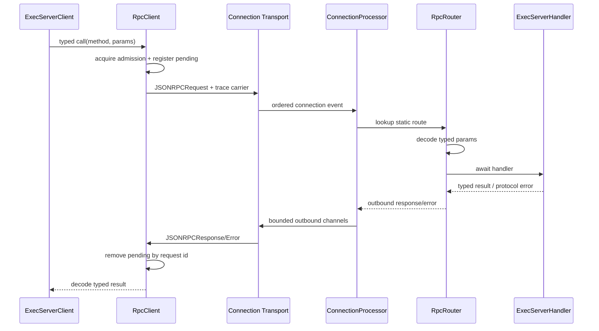
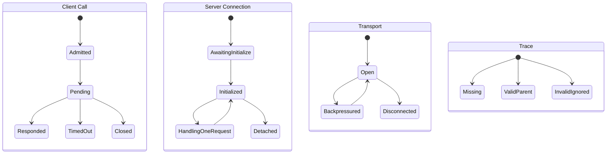
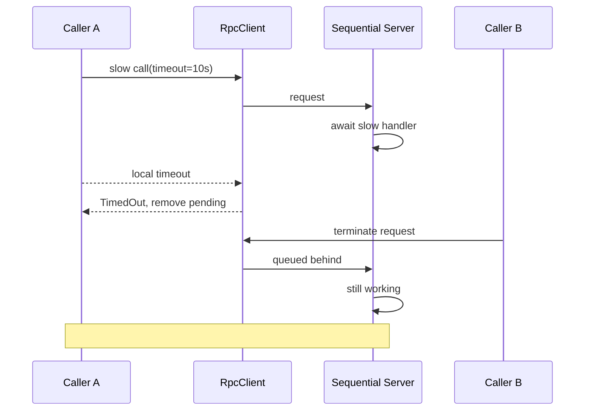

# Exec Server RPC路由、Admission、Framing与Trace边界

Exec Server对外看起来是一组JSON-RPC method，但真正决定其可靠性的不是method数量，而是下面几层是否对齐：

-wire envelope是否能稳定区分Request、Notification、Response与Error；
-typed registry是否把动态JSON尽早收敛为Rust类型；
-client admission是否限制未完成调用并为cleanup保留逃生通道；
-server scheduler是否允许慢请求拖住整条连接；
-transport framing是否对单消息、队列和断线给出一致语义；
-timeout、caller drop与wire cancellation是否真能终止远端工作；
-trace propagation是否既能串起调用链，又不把外部输入升级为authority。

本文不是重复各个Exec/Filesystem/HTTP method的业务语义，而是研究它们共同依赖的RPC substrate。这个substrate决定了“远程能力”在拥塞、恶意输入、慢请求和断线时究竟表现为一个可恢复系统，还是一条容易发生head-of-line blocking的长管道。

## 1. 证据范围

本文基于Codex fork `main@ab6a7eb87cc8a816c88b86c44cf291e251ed2136`，主要阅读：

- `codex-rs/exec-server-protocol/src/rpc.rs`
- `codex-rs/exec-server/src/rpc.rs`
- `codex-rs/exec-server/src/connection.rs`
- `codex-rs/exec-server/src/server/registry.rs`
- `codex-rs/exec-server/src/server/processor.rs`
- `codex-rs/exec-server/src/server/transport.rs`
- `codex-rs/exec-server/src/telemetry.rs`
- `codex-rs/exec-server/src/trace_context.rs`
- `codex-rs/exec-server/src/noise_relay/message_framing.rs`
- `codex-rs/protocol/src/protocol.rs`
- `codex-rs/otel/src/trace_context.rs`
- `codex-rs/exec-server/src/client.rs`
- `codex-rs/exec-server/src/client/rpc_http_client.rs`

结论分三类：

-“当前实现”来自上述代码和测试；
-“风险”是由队列、状态机与失败路径推导的可复现后果；
-“迁移建议”是面向当前NestJS Agent项目的设计翻译，不代表Codex已有实现。

## 2. 先看完整数据路径



这条链有两个容易误判的地方：

1. Client能够并发发出请求，不等于server并发执行请求。
2. Client本地timeout，不等于server收到cancel并停止工作。

## 3. Exec Server使用Codex JSON-RPC方言

协议注释明确说明，wire上省略：

```json
{"jsonrpc":"2.0"}
```

Request实际类似：

```json
{
  "id": 1,
  "method": "process/read",
  "params": {"processId":"7","afterSeq":10},
  "trace": {"traceparent":"00-...-...-01"}
}
```

这是一种JSON-RPC-inspired dialect，而不是要求调用方机械套用完整JSON-RPC 2.0 envelope。

## 4. Envelope有四种互斥形态

`JSONRPCMessage`用untagged enum反序列化：

```text
Request      = id + method + params? + trace?
Notification = method + params?
Response     = id + result
Error        = id + error
```

`RequestId`允许：

-String；
-i64 Integer。

Codex内置client只生成从1开始递增的Integer，但协议允许外部client使用String或负整数。

## 5. Untagged解析依赖字段形状而非显式type

优点是wire紧凑，也兼容方言；代价是分类依赖字段组合。Serde会按enum variant尝试解析。

因此协议演进要特别谨慎：

-给Response增加`method`可能造成形状重叠；
-把Request的`id`改为optional会与Notification重叠；
-增加宽松flatten字段可能让错误对象被错误分类；
-没有显式batch envelope。

稳定协议不只是“字段能反序列化”，还要维护各variant的可判别性。

## 6. Serde默认会忽略未知字段

这些struct没有`deny_unknown_fields`。因此标准client额外发送`jsonrpc: "2.0"`通常不会仅因这个字段失败，server发出的消息则仍省略它。

这形成一种单向宽容：

-读取时容忍部分未知字段；
-写出时坚持Codex方言；
-但并不承诺标准JSON-RPC所有行为，例如batch和双向request。

## 7. 协议不支持Batch Message

顶层类型只接受单个JSON object，没有array batch分支。一次transport frame/stdio line对应一个RPC message。

这简化了：

-request ID路由；
-每消息长度预算；
-顺序语义；
-错误关联。

但不能把多个FS调用靠JSON-RPC batch变成一个调度单元。

## 8. Client与Server是方向受限的

Client reader只接受：

-Response；
-Error；
-Notification。

若remote server反向发Request，client reader返回protocol error并关闭读取循环。

Server processor只接受：

-Request；
-已注册Notification。

若client发Response或Error，server关闭连接。

所以这不是App Server那种完整双向request channel；Exec Server的反向流只用Notification。

## 9. 未知Request与未知Notification的失败语义不同

未知Request：

-返回`-32601 method not found`；
-连接继续；
-telemetry method归为`unknown`。

未知Notification：

-没有request ID可回复；
-processor把它视为protocol error；
-关闭连接。

这个差异合理但很重要。Notification不是“随便发的fire-and-forget event”，而是严格协议动作。

## 10. Malformed JSON不会立即关闭Server连接

stdio或WebSocket解析失败会产生`MalformedMessage` connection event。Server：

1. 记录warning；
2. 返回`invalid request`；
3. 使用合成Request ID `-1`；
4. 继续读取后续消息。

这让单个坏frame不必杀死整个session。

## 11. 合成ID -1并非保留命名空间

协议允许caller合法使用Integer `-1`。因此malformed error的`id=-1`可能与真实请求碰撞。

它只是一种“无法关联时的占位值”，不是有协议保护的sentinel。更严格的设计可以：

-允许error id为null；
-定义保留ID空间并在admission时拒绝；
-或把framing error变成connection-level event，不伪装成request response。

## 12. Malformed策略在Client侧更严格

RpcClient收到`MalformedMessage`后直接结束reader loop：

-不把具体reason公开给上层；
-标记closed；
-drain全部pending；
-发Disconnected event；
-terminate transport。

同一种frame error在server端可恢复，在client端是connection-fatal。这是方向性协议策略，不应被抽象成“所有malformed都继续”。

## 13. Typed Router是Dynamic Wire到Static Handler的收敛点

`RpcRouter<S>`内部维护两个HashMap：

```text
request_routes: method -> typed request closure
notification_routes: method -> typed notification closure
```

Registry集中注册：

-initialize / initialized；
-HTTP request；
-process exec/read/write/signal/terminate；
-filesystem read/open/readBlock/close/write/...。

业务handler不需要自己解析`serde_json::Value`。

## 14. 普通Request Route封装了完整response contract

`router.request<P, R>`负责：

1. 取出request ID；
2. 把params解码成`P`；
3. await handler；
4. 把`R`编码成JSON Value；
5. 生成Response或Error。

handler签名只表达：

```text
P -> Result<R, JSONRPCErrorError>
```

这与NestJS Controller使用DTO后返回业务对象很像：transport envelope不应该散落到每个业务方法。

## 15. request_with_id是特殊的Response Authority转移

HTTP streaming使用`request_with_id`。Router把request ID交给handler，成功时返回`None`，意味着标准router不再自动回复。

Handler负责：

-用原ID发送headers response；
-再通过notification发送body delta；
-在失败时保证适当终态。

这个API很强，但也扩大了“谁有权结束request”的边界。它适用于流式协议，不应被普通method滥用。

## 16. request_with_id成功不等于Response已经被client消费

Processor对route返回`None`记为success。这里的success表示handler完成其发送职责，而不是：

-client已收到headers；
-body stream已读完；
-consumer已确认；
-网络请求副作用已提交。

Telemetry的result必须按层命名，否则一个`success`会被误读成end-to-end成功。

## 17. Params缺失统一转为Null

`decode_params`先执行：

```text
None -> JSON null
```

然后尝试反序列化为目标类型。

这使unit params `()`可以接受省略或null。

## 18. 空Object有一次兼容性fallback

若直接解码失败，且params是`{}`，Router会再用`null`解码一次。

因此`environment/info`这类unit params同时接受：

```json
null
```

和：

```json
{}
```

这是有意的兼容层，但会把两种调用形状折叠成同一语义。

## 19. Params兼容fallback不应扩散到业务修复

它只处理“空object vs null”的无字段参数差异，不会：

-忽略错误字段类型；
-替调用方填业务默认值；
-把任意object转成unit；
-自动升级旧schema。

真正的协议版本迁移仍需要显式DTO/version策略。

## 20. Request与Notification解码失败的后果不同

Request params错误：

-生成`-32602 invalid params`；
-带原request ID；
-连接继续。

Notification params错误：

-没有response channel；
-route返回String protocol error；
-processor关闭连接。

因此把重要可恢复动作建模成Notification会牺牲精确错误回执。

## 21. Router注册重复method会静默覆盖

底层使用HashMap `insert`，没有assert或Result。若构建函数意外对同一method注册两次：

-后注册route覆盖前者；
-编译器不报错；
-启动时也没有冲突诊断。

当前registry是单一静态函数，风险较低；未来插件化route若复用这个机制，应把duplicate变成启动失败。

## 22. Registry是静态快照，不支持运行时热插拔

每条connection开始时创建`Arc<build_router()>`。Method set固定，执行期间不修改。

优点：

-无需route读写锁；
-method name可用`&'static str`；
-telemetry cardinality可控；
-连接内行为稳定。

代价是runtime capability negotiation不能仅靠动态注册route完成。

## 23. Client Pending Map是Request Correlation事实源

每次call：

1. 生成request ID；
2. 创建oneshot；
3. 在`pending` map注册`id -> sender`；
4. 发送Request；
5. 等待oneshot；
6. response reader按ID remove并投递。

因为map按ID路由，response可以乱序到达。

## 24. Request ID从1开始单调递增

`AtomicI64.fetch_add(1, SeqCst)`生成ID。

它具备：

-connection-local唯一性；
-并发安全；
-无需持锁取号；
-日志易读。

它不包含：

-session ID；
-method；
-generation；
-caller identity。

跨重连不能只看request ID关联事实。

## 25. Request ID没有显式溢出策略

i64计数在极端长期连接最终会wrap。现实中需要约2920亿年才能以每秒10亿请求耗尽，所以不是近期工程风险，但协议实现仍没有：

-wrap前关闭连接；
-检测pending碰撞；
-跳过仍占用ID；
-generation tuple。

这说明ID contract依赖“连接生命周期远短于计数空间”。

## 26. Pending注册与断线检查在同一Mutex临界区

这是一个值得学习的并发细节。

若顺序是：

```text
check disconnected
unlock
reader drain pending
insert pending
```

新call可能在drain后插入，随后永远等待。

当前实现把：

-closed/disconnected检查；
-清理receiver已关闭的旧entry；
-插入新pending；

放在与reader `drain_pending`共用的Mutex下，封住这个竞态窗口。

## 27. Serialize失败会撤销Pending注册

Params是在pending注册后转成JSON Value。若序列化失败：

-remove request ID；
-返回`RpcCallError::Json`；
-不向transport发送消息。

同样，outbound channel send失败也remove pending。

这是最小事务补偿：只要request没成功进入transport queue，就不留下孤儿waiter。

## 28. 已关闭Oneshot会在新调用时被惰性清理

Caller future被drop时，oneshot receiver关闭，但pending sender未必立即被map删除。下一次call注册时执行`retain`，清理closed sender。

这避免永久积累，但它不是主动cancel：

-远端request仍可能继续；
-late response到达时remove sender并发送失败；
-若之后没有新call，closed entry会保留到late response或断线。

## 29. Client允许Response乱序

测试显式让`fast`响应先于`slow`返回，RpcClient按request ID把结果送回对应oneshot。

因此client correlation层支持并发server。

但真实Exec Server processor当前顺序执行请求，正常单连接上通常还是按接收顺序完成。测试证明的是client能力，而不是server scheduler现状。

## 30. 1024个Regular Call Slot是Admission上限

每个RpcClient有：

```text
shared_call_slots = 1024
cleanup_call_slots = 1
```

普通call使用`try_acquire`：

-有slot立即继续；
-无slot立即返回`PendingRequestLimitExceeded`；
-不会排队等permit。

这是fail-fast admission，不是吞吐队列。

## 31. Permit持有到整个Call返回

Permit不是Request写入outbound queue后释放，而是直到：

-收到response/error；
-timeout；
-transport close；
-decode结果完成。

注释指出一个安全原因：恶意executor不能靠猜request ID并提前伪造response，来过早释放admission容量，然后让尚未写出的请求无限堆积。

## 32. Admission防的是Client内存，不是Server工作量

1024限制了未完成client calls及pending map规模，但不代表：

-server最多并发1024个handler；
-transport最多缓存1024条消息；
-每个method有独立公平性；
-每个tenant有配额；
-总payload bytes受限。

它是request-count budget，不是综合resource budget。

## 33. Regular Admission不等待是一种反压信号

调用方看到`PendingRequestLimitExceeded`时应该：

-降低生产速率；
-合并重复查询；
-取消不再需要的工作；
-把失败归类为local saturation；
-避免无抖动立即重试。

若上层把它当普通transient error无限重试，fail-fast会退化成busy loop。

## 34. Cleanup有一个保留Slot

`call_for_cleanup`先尝试shared slot；shared已满时再尝试专用cleanup slot。

当前用于：

-process terminate；
-filesystem close。

这保证普通工作饱和时仍有机会释放远端资源。

## 35. Cleanup Slot也满时直接熔断Transport

若1024 regular和1 cleanup全部占用，第二个cleanup不会等待，而是：

1. `close_transport()`；
2. 标记closed；
3. terminate底层transport；
4. abort transport tasks；
5. drain全部pending；
6. 返回Closed。

这是fail-closed策略：宁可牺牲连接，也不让资源释放永久饿死。

## 36. 单个Cleanup Slot形成自己的串行瓶颈

当shared全满时，只能有一个保留cleanup在飞。若这个cleanup本身无deadline且server被慢请求挡住：

-第二个cleanup触发全连接关闭；
-所有regular call同时失败；
-可能依赖session recovery重新建立控制面。

这个设计有明确逃生语义，但代价是故障半径较大。

## 37. 默认Call没有隐式Deadline

测试把虚拟时间推进61秒，普通`call`仍保持pending，直到server返回。

除了显式使用`call_with_timeout`的少数路径，下面调用可无限等待：

-process exec/read/write/signal；
-filesystem操作；
-HTTP request的RPC headers阶段；
-cleanup call。

底层transport存活不代表业务request有进展。

## 38. 当前显式Timeout只覆盖少数控制动作

连接与初始化有独立timeout，`environment/info`使用30秒`call_with_timeout`。大多数RPC走无deadline的`call`。

这说明timeout contract还没有method-class统一：

-短metadata query；
-长poll read；
-filesystem mutation；
-process lifecycle；
-stream setup；

需要不同预算，而不是一个全局数字。

## 39. 本地Timeout只删除Pending，不发送Wire Cancel

`call_with_timeout`超时后：

-remove pending entry；
-返回TimedOut；
-保持connection打开；
-不向server发送cancel notification/request。

Late response到达后，因为ID不在pending map，client静默忽略。

## 40. Timeout后Server可能继续阻塞整条连接

这是当前scheduler下最重要的组合风险：

1. client对一个慢request设置10秒timeout；
2. server已进入handler；
3. client 10秒后本地放弃；
4. server不知道caller已放弃；
5. processor仍顺序await该handler；
6. 同连接后续request和cleanup继续排队。

所以local timeout解决caller等待，不解决server资源占用和head-of-line blocking。

## 41. Caller Drop同样不是远端Cancel

若上层future被abort/drop：

-admission permit随future释放；
-oneshot receiver关闭；
-pending sender等待惰性清理或late response；
-已发出的server work继续。

需要区分：

```text
stop waiting != stop execution
```

## 42. Transport Disconnect才会取消当前Server Handler Future

Processor对当前route使用`tokio::select!`：

-handler完成；
-或disconnected watch变化。

连接真正断开时，当前route future被drop，handler的async工作有机会取消。

但是否终止底层副作用取决于handler：

-Tokio future drop可能取消尚未完成的await；
-已spawn task不会自动取消；
-已启动process不会因request future drop自动消失；
-外部HTTP服务可能已经收到请求。

## 43. Disconnect与Response按Ordered Reader Queue收口

RpcClient没有让每个call直接race `disconnected_rx`。原因是transport reader已把：

-Response/Error；
-最终Disconnected；

放进同一个有序incoming queue。

Reader先处理已读到的response，再drain真正未完成的pending。这样“EOF前已到达的response”仍能赢，不会被watch调度顺序错误覆盖。

## 44. Unknown或Late Response被静默忽略

Client收到Response/Error时只做：

```text
pending.remove(id)
```

不存在对应entry就不记录、不报错、不关闭连接。

优点是timeout后的late response不会伤害连接；缺点是：

-重复response不可见；
-伪造ID尝试不可见；
-server bug缺少诊断；
-没有late-response metric。

## 45. Client Event Queue容量是128

Server Notification不会按request ID进入pending，而是转发到`RpcClientEvent` channel，容量128。

Reader在`event_tx.send(...).await`上等待。若上层notification consumer很慢：

-event queue填满；
-reader停止读取connection incoming queue；
-后续Response/Error也无法被分派；
-所有pending call表现为卡住。

这是一种notification对response的head-of-line blocking。

## 46. Response与Notification共享Transport顺序是双刃剑

共享顺序可以保留“先headers response、后body delta”这类协议关系，但也把：

-高频process output；
-HTTP body delta；
-低频control response；

放进同一reader调度路径。

当前上层为具体stream又做了256项、bytes预算等隔离，但最前面的RpcClient event queue仍是连接级共享点。

## 47. Client遇到反向Request会关闭，但丢失具体原因

`handle_server_message`会生成：

```text
unexpected JSON-RPC request from remote server: <method>
```

Reader却只执行`let _ = err`，最终Disconnected reason通常为None。

这保护上层不暴露任意remote error文本，但损失可诊断性。更好的做法是结构化内部reason并在对外层做redaction。

## 48. Server Processor当前严格顺序执行Inbound Event

代码注释明确：

```text
Process inbound events sequentially to preserve initialize/initialized ordering.
```

Processor不会为每个request spawn独立task。它在route future返回前，不读取下一条inbound event。

## 49. 顺序执行把Handshake正确性扩大成全生命周期串行

真正需要顺序的主要是：

```text
Connected -> initialize request -> initialized notification -> Ready
```

但当前实现把同一规则应用到Ready后的所有method。结果是一个长`process/read waitMs`可以阻塞：

-process/write；
-process/terminate；
-fs/close；
-environment/info；
-后续HTTP request；
-session control notification。

## 50. Client并发能力与Server实际吞吐不匹配

Client允许1024个in-flight regular call，transport channel有128容量，server却一次执行1个handler。

粗略形态是：

```text
1024 caller futures
  -> 128-slot client outbound channel
  -> socket/kernel buffers
  -> 128-slot server incoming channel
  -> 1 active handler
```

这不是1024并发吞吐，而是多层排队加单worker。

## 51. Long Poll是最明显的Head-of-line触发器

`process/read`允许`waitMs`，而wait没有协议上限。若一个caller要求很长等待：

-server processor停在read；
-同连接write/interrupt/terminate进不来；
-本来用于唤醒read的控制动作可能被排在read之后。

Push notification在部分路径能缓解读取需求，但并不能消除generic RPC scheduler问题。

## 52. HTTP Request也能长期占住Processor

`request_with_id`只有在handler完成headers setup职责后才返回。DNS、connect、TLS、上游headers等待若无有效timeout，都发生在当前顺序handler里。

即使body后续由独立task推送，headers前的慢请求仍能阻塞整个连接。

## 53. Filesystem操作共享同一串行Lane

递归copy/remove、helper process、慢磁盘读取等也由同一processor await。之前专题确认部分操作缺少总deadline/entry budget，因此它们不仅是自身风险，还会扩大为connection control-plane风险。

## 54. Server没有Request级并发爆炸，但有队列背压

顺序执行的一个好处是不会为原始client每条request创建无限task。Incoming channel容量128，满后transport reader等待，从而把背压传到socket。

所以当前系统更像“有界排队、单worker”，而不是“无界spawn”。问题是公平性和取消，而不是task数量爆炸。

## 55. Server Outbound有两级128项Channel

Processor创建：

```text
handler/RpcNotificationSender
  -> RpcServerOutboundMessage channel(128)
  -> serializer task
  -> JSONRPCMessage connection channel(128)
  -> stdio/WebSocket/Noise writer
```

慢transport最终会填满两级channel，让handler notification或processor response发送await。

## 56. 慢Writer会反压当前Processor

Response发送不是best-effort：`outgoing_tx.send(...).await`会等待容量。

这是可靠传递优先的选择，但也意味着：

-慢client可以拖住server connection task；
-process output producer可能间接受影响；
-当前request telemetry直到成功排入第一层queue才结束；
-并不代表wire flush完成。

## 57. Stdio使用Newline-delimited JSON

每条消息：

1. 序列化为单行JSON；
2. 写入newline delimiter；
3. flush。

Reader接受LF与CRLF，跳过空白行。JSON string内部换行会被escape，因此一行一消息成立。

## 58. Stdio Inbound单消息上限64MiB

Reader最多读取`limit + 1` bytes，并对CRLF多看一个byte，避免：

-无终止符超长输入一直等待；
-合法边界处CRLF被误判；
-攻击者靠巨大line无限增长buffer。

超过上限会产生Disconnected并关闭连接，而不是Malformed后继续。

## 59. Stdio Outbound没有对称的显式长度检查

Writer直接`serde_json::to_string`后write all。没有在`connection.rs`再检查64MiB。

业务层对大FS/HTTP结果有若干独立限制，但RPC substrate并未强制“所有outbound message <= 64MiB”。如果server生成更大消息：

-本地stdio writer可能成功发送；
-对端reader可能按64MiB断开；
-不同transport行为可能不一致。

## 60. Noise JSON-RPC Framing显式限制64MiB

Noise数据面先把JSON序列化，再加4-byte authenticated big-endian length prefix。单个JSON-RPC message最大64MiB。

之后切成最多60KiB plaintext record，以适配底层Noise message限制。

## 61. Noise Decoder在分配前验证声明长度

Decoder收到4-byte prefix后先拒绝：

-零长度；
-大于64MiB；
-单record大于60KiB；
-重组buffer超过prefix + 64MiB。

这是典型的“先验证length，再等待payload”，避免认证peer声明超大长度后诱导无限buffer。

## 62. Plain WebSocket的大小约束未在Exec Server代码中固定

`from_websocket_stream`直接解析Text/Binary frame；plain Axum upgrade和tokio-tungstenite client没有在这里显式传自定义message-size常量。

因此plain WebSocket依赖所用库/upgrade的默认限制，而不是像stdio和Noise JSON framing那样由Exec Server协议层明确声明。依赖升级可能改变有效边界。

## 63. Noise Relay WebSocket另有256KiB帧上限

Noise Relay外层WebSocket配置256KiB message/frame，因为真正的大JSON会先被拆成60KiB加密record。不要把这个256KiB误解成Exec JSON-RPC业务消息上限。

层次是：

```text
JSON-RPC <= 64MiB
  -> Noise records <= 60KiB plaintext
  -> Relay WebSocket frame <= 256KiB
```

## 64. WebSocket同时处理Outbound、Ping与Inbound

Plain WebSocket connection只有一个task，用`tokio::select!`驱动：

-outgoing channel；
-keepalive interval；
-incoming websocket frame。

Axum server连接每30秒发送Ping；普通client-side `from_websocket`不配置这层Ping。

## 65. Ping是Keepalive触发，不是完整Liveness FSM

该task会忽略收到的Ping/Pong，发送Ping失败才断开。Plain WebSocket路径没有在此实现“超过N秒未收到Pong主动断开”的watchdog。

相比Noise multiplexing的Pong超时逻辑，plain WebSocket keepalive更轻量。

## 66. WebSocket Outbound被阻塞时Inbound也可能饿死

单task在调用`websocket.send(...).await`期间不能回到select读取incoming。测试验证outbound send被backpressure时，inbound Pong不会立刻被处理。

因此慢写不仅影响发送，还能延迟读取和断线发现。

## 67. Origin Header被拒绝以降低浏览器跨站风险

Plain WebSocket listener在upgrade前拒绝任何带`Origin` header的request，返回403。

这可以阻止普通浏览器页面直接连接本地exec server，但它不是完整authentication：

-非浏览器client可不发Origin；
-listener参数允许绑定任意IP；
-连接后method本身没有principal字段；
-plain WebSocket不具备Noise authenticated identity。

## 68. Ready Endpoint只表示Listener可响应

`/readyz`返回200。它不证明：

-某个session已initialize；
-executor业务能力健康；
-sandbox helper存在；
-filesystem/HTTP可用；
-queue未饱和。

这是process-level readiness，不是capability readiness。

## 69. Stdio Child Transport有2秒Graceful Termination

若RpcClient关联了child process：

-terminate先结束process group；
-等待最多2秒；
-超时后kill process tree；
-Drop最终也会触发terminate。

这让transport lifecycle拥有OS进程cleanup authority，而普通plain connection的terminate是no-op。

## 70. Error Code集合小而稳定

RPC helper当前定义：

| Code | 语义 |
| --- | --- |
| `-32600` | invalid request |
| `-32601` | method not found |
| `-32602` | invalid params |
| `-32603` | internal error |
| `-32004` | resource not found |
| `-32010` | session already attached |

`data`当前统一为None，细节主要放在message string。

## 71. Error Message承担了过多非结构化信息

Client可区分：

-Closed；
-JSON encode/decode；
-Server error object；
-TimedOut；
-PendingRequestLimitExceeded。

但Server error内部通常只有code + free-form message，没有：

-retryable；
-operation ID；
-resource generation；
-partial effect；
-safe public message vs internal cause；
-structured validation fields。

上层若靠字符串匹配做恢复，会非常脆弱。

## 72. Error Message没有RPC级输出预算

Invalid params会包含Serde错误，method not found会插入raw method，业务错误可能插入path或上游描述。RPC层没有统一：

-最大message bytes；
-control character清理；
-secret redaction；
-path脱敏；
-error data schema。

目前安全性依赖各handler和日志层自律。

## 73. Client的JSON Error混合了两个阶段

`RpcCallError::Json`既可能表示：

-request params序列化失败；
-response result无法解码成期望类型。

调用方若只记录“JSON错误”，会丢失direction。更清晰的error taxonomy应区分encode request与decode response。

## 74. Server Telemetry按静态Method控制Cardinality

已知request从router拿到`&'static str` method，未知request统一记为`unknown`。Metric tags是：

```text
method=<static or unknown>
result=success|error|disconnected
```

这避免攻击者用任意method name制造无限metric label cardinality。

## 75. Trace Span Name同样使用Canonical Method

Server span名固定为`codex.exec_server.request`，`otel.name`使用registry返回的canonical method；未知method用`unknown`。

这是优质实现：span operation name不直接采用不可信wire value。

## 76. Raw Wire Method仍写入Span Attribute

Span字段`method`使用request原始字符串。它方便排查未知method，但如果trace backend把attribute当高基数索引，攻击者仍可制造大量不同值。

所以“bounded span name”不等于所有telemetry字段都bounded。Raw value应：

-限制bytes；
-清理控制字符；
-可能只在sampled error span保留；
-或另存hash与安全preview。

## 77. Client自动传播当前Span的W3C Context

发送Request时调用：

```text
current_span_w3c_trace_context()
```

若当前span有效，Request携带：

-traceparent；
-tracestate。

Server把它设置为request span parent，从而把Core调用与remote Exec handler串成同一trace。

## 78. Invalid Trace Carrier被忽略而不是拒绝业务请求

Server验证W3C context；无效时：

-记录warning；
-不设置parent；
-继续处理request。

Trace metadata不是业务authority，因此不应因为观测字段损坏而拒绝有效Exec请求。

## 79. Trace Carrier本身没有字段长度限制

`W3cTraceContext`只是两个`Option<String>`，协议类型没有对traceparent/tracestate设置独立bytes cap。

总体transport message上限最终会约束它，但plain WebSocket边界未在协议代码固定，而且在解析前仍可能占用较大内存。

标准trace字段应在DTO层应用接近W3C规范的紧凑长度限制。

## 80. Inbound Trace是Correlation Input，不是Identity

任何能连到plain Exec Server的client都能提供格式合法的trace ID，并把server span接到任意trace树上。

这不会授予filesystem/process权限，但会影响观测关联。因此不能用trace ID作为：

-认证principal；
-session owner；
-idempotency key；
-审计不可抵赖证据。

## 81. Trace Context会继续注入Exec HTTP请求

Exec Server HTTP path会从当前server request span生成HTTP `traceparent`和`tracestate` headers。

链路可能是：

```text
Core Turn span
  -> Exec RPC client span
  -> Exec Server request span
  -> outbound HTTP span/header
  -> remote service
```

这是完整trace propagation，但也意味着外部caller提供的合法trace可被转发到下游HTTP系统。

## 82. Trace Propagation不携带Security Context

Request envelope只有trace，没有：

-actor ID；
-tenant ID；
-Tool call ID；
-Run ID；
-permission decision ID；
-policy generation。

这些业务/安全身份必须走独立、受验证的contract，不能塞进tracestate后当授权依据。

## 83. Telemetry的Success发生在不同提交点

普通request success：handler返回、result序列化且response进入server outbound queue。

`request_with_id` success：handler返回Ok，可能只完成headers response发送职责。

都不代表：

-socket flush；
-client decode；
-业务副作用durable；
-stream terminal到达。

所以应该把metric解释为“server handler outcome”，而非end-to-end receipt。

## 84. Disconnect只记录当前Active Request

Processor顺序执行，因此同一时间最多一个handler被request telemetry标为disconnected。仍排在transport/incoming queue里的request：

-可能从未进入route；
-没有逐request server metric；
-client侧统一Closed。

队列中的丢失工作在server telemetry里不可逐项观察。

## 85. Connection Metrics按Transport区分

Exec Server记录active/total connections，transport tag为：

-relay；
-stdio；
-websocket。

这能区分远程relay与本地/直接连接的故障模式，但没有：

-queue depth；
-pending call count；
-admission rejection；
-late response；
-notification lag；
-outbound backpressure duration。

这些恰好是RPC substrate最关键的运行指标。

## 86. 最关键的状态机不是一个，而是四个



可靠性问题往往来自状态机错位，例如Client进入TimedOut，而Server仍在HandlingOneRequest，Transport也仍是Open。

## 87. 一个典型的Timeout错位时间线



这比“加一个timeout”更值得学习：timeout必须明确作用在哪一层。

## 88. 可改进方向：Handshake Gate后Bounded Concurrent Executor

不必放弃initialize顺序。可以拆成：

1. Connection进入Handshake状态，严格顺序接受initialize/initialized；
2. Ready后把Request送入bounded scheduler；
3. 为process control、long poll、filesystem、HTTP设置独立class；
4. 每class有并发和bytes budget；
5. Notification/control仍走明确串行lane；
6. Connection shutdown统一取消active tasks。

这样保留协议状态机，又不让handshake约束永久变成单worker。

## 89. 并发化不能只做spawn-per-request

直接对每条request `tokio::spawn`会引入新问题：

-initialize与业务request竞态；
-同一process的write/terminate顺序不确定；
-递归FS操作放大CPU/IO；
-HTTP连接暴涨；
-response乱序需要client contract确认；
-connection close时task ownership复杂。

正确方向是有界、分类、可取消的scheduler，而不是无界并发。

## 90. 可改进方向：显式Request Cancellation

协议可以引入：

```text
request/cancel { requestId, generation, reason }
```

Server维护：

```text
request identity -> cancellation token + lifecycle
```

并定义：

-未开始：从队列移除；
-运行中：触发cooperative cancel；
-已完成：返回AlreadyTerminal；
-副作用已提交：返回Committed/Unknown而非假装Cancelled；
-cancel本身有独立control lane。

## 91. Request Cancellation需要Generation避免ABA

仅靠connection-local request ID，在重连、wrap或caller bug下不够。更稳妥的identity是：

```text
connection/session generation + request id
```

或由client生成不可复用operation ID。Cancel必须命中精确generation，不能误杀新请求。

## 92. 可改进方向：Deadline进入Wire Contract

本地timeout与wire deadline不同。Request可携带：

-absolute deadline；
-或剩余budget；
-server接收时间；
-queue wait budget；
-handler execution budget。

Server在开始前若已过期，直接不执行。对跨主机时钟不可信的场景，可传播duration budget并记录每hop消耗。

## 93. 可改进方向：把Long Poll移出通用RPC Lane

`process/read waitMs`适合：

-独立stream；
-专用long-poll并发池；
-或基于notification + bounded replay的pull/push组合。

不应占住connection唯一worker。即使暂不并发全部method，也可先隔离long poll。

## 94. 可改进方向：Response与Notification分流

Client reader可以优先完成Response/Error correlation，再把Notification送入有界dispatcher。可选策略：

-control response永不被普通event queue阻塞；
-按process/HTTP stream分片队列；
-高频delta使用byte budget；
-队列满时生成明确stream terminal failure；
-保留transport-order sequence以便重建顺序。

不能简单drop notification，因为有些notification是输出事实或stream终态。

## 95. 可改进方向：统一Framing Budget

协议层应明确：

| 层 | 建议预算 |
| --- | --- |
| envelope | method/id/trace/error独立小预算 |
| params/result | 按method class预算 |
| serialized message | 所有transport统一硬上限 |
| connection queues | count + bytes双预算 |
| stream | frame + total + lifetime |
| decomposed records | 保持transport特有小frame |

只限制“消息数量”无法防一个64MiB message占满内存。

## 96. 可改进方向：Typed Error Data

保留稳定code，同时给`data`结构化字段：

```json
{
  "category": "saturated",
  "retryable": true,
  "operationId": "...",
  "phase": "queue",
  "partialEffect": "none",
  "safeDetails": {"limit":1024}
}
```

内部cause、路径和secret不直接进入public message。这样恢复逻辑不依赖字符串。

## 97. 可改进方向：Duplicate Route在启动时失败

Router注册API可以返回Result或使用entry检查：

```text
Vacant -> insert
Occupied -> startup error
```

若未来extension提供route，还需要：

-namespace ownership；
-schema/version冲突；
-method capability discovery；
-稳定order；
-unload generation。

## 98. 可改进方向：Trace Trust Boundary显式化

推荐区分：

-`traceparent`：仅观测关联，可接受外部合法值；
-`actor/tenant/run/tool`：由可信gateway签发或从session state取得；
-`policyDecisionId`：来自授权层；
-`operationId`：来自幂等/恢复层。

并对raw method、tracestate和error preview做长度与cardinality治理。

## 99. 对当前NestJS Agent项目的直接启示

当前项目不需要复制Rust Exec Server，但在Agent Run、Tool Calling与Streaming阶段应提前建立这些边界。

### 99.1 DTO Router只做协议收敛

NestJS Controller/WS gateway负责：

-验证DTO；
-确定authenticated actor；
-建立request context；
-调用application service；
-映射稳定错误。

不要让Tool handler到处解析raw JSON envelope。

### 99.2 Run Admission与Tool Admission分开

建议至少区分：

```text
per-user active Runs
per-conversation active Run
per-Run concurrent Tools
global provider calls
cleanup/control reserved capacity
```

一个Semaphore不能表达所有资源。

### 99.3 HTTP Timeout不等于Job Cancel

前端请求超时、浏览器断线或SSE关闭时，要明确：

-Run继续后台执行；
-还是请求取消Run；
-Tool副作用是否已提交；
-如何重新attach查看状态。

不能用Controller promise被drop来隐式推断业务取消。

### 99.4 Streaming需要Control Plane优先级

Token delta、Tool stdout等高频数据不应挡住：

-interrupt；
-approval response；
-Run terminal；
-error terminal；
-heartbeat。

可以共享WebSocket/SSE连接，但必须有队列策略、sequence和终态保障。

### 99.5 Trace ID不能代替Run ID

Run ID是业务身份和持久化key；Trace ID是观测关联。两者都应该记录，但职责不同：

```text
Run ID -> 状态、恢复、权限、幂等
Trace ID -> 跨服务性能与错误关联
```

### 99.6 Error必须说明提交点

尤其Tool Calling需要区分：

-未准入；
-已排队；
-已开始；
-已产生外部副作用；
-结果回传失败；
-终态未知。

只返回500会让上层无法决定是否重试。

## 100. 推荐的NestJS抽象草图

```ts
type OperationPhase =
  | 'admission'
  | 'queued'
  | 'running'
  | 'committed'
  | 'responding'
  | 'terminal'

interface OperationContext {
  operationId: string
  runId: string
  actorId: string
  traceId?: string
  deadlineAt?: Date
  cancellation: AbortSignal
}

interface AdmissionLease {
  resourceClass: 'model' | 'tool' | 'control'
  release(): void
}
```

重点不是照搬代码，而是让“身份、deadline、cancel、admission、trace”成为显式字段。

## 101. 推荐的验证场景

如果未来为当前项目实现类似RPC/Tool Runtime，测试至少覆盖：

1. response乱序仍回到正确request；
2. pending注册与disconnect无永远等待竞态；
3. admission满时control/cleanup仍可执行；
4. 第二个cleanup是否熔断及故障半径；
5. caller timeout后server work是否真的停止；
6. slow notification consumer是否阻塞response；
7. long poll是否阻塞interrupt；
8. duplicate route是否启动失败；
9. malformed frame后连接策略；
10. oversize request在分配前被拒绝；
11. outbound oversize是否所有transport一致；
12. invalid trace不影响业务，但不会污染security identity；
13. unknown method不产生metric高基数；
14. late response有可观测计数；
15. disconnect时active与queued request均有明确终态。

## 102. 当前实现中最值得学习的部分

1. Dynamic JSON在typed router边界立即收敛。
2. Response按request ID路由，支持乱序。
3. Pending注册与disconnect drain共用Mutex，封住永久等待竞态。
4. Serialize/send失败会补偿移除pending。
5. 1024 regular admission使用fail-fast而非无界排队。
6. 为cleanup保留独立slot，饱和时仍保留释放资源的机会。
7. cleanup也饱和时fail-closed断transport，避免永久饿死。
8. Ordered reader queue保证EOF前response优先于disconnect drain。
9. stdio超长未终止line会尽快失败。
10. Noise length在等待payload前验证，重组buffer有硬上限。
11. Known method使用静态canonical name控制metric/span cardinality。
12. Invalid W3C trace被忽略而不影响业务。
13. Origin header gate降低浏览器页面直接连接本地listener的风险。
14. Stdio child transport持有process-group cleanup authority。

## 103. 当前实现中最需要警惕的部分

1. Server为保证handshake顺序而把所有request永久串行。
2. Long poll、HTTP headers、递归FS操作会形成连接级head-of-line blocking。
3. Client 1024并发admission与Server单worker实际吞吐不匹配。
4. 普通call与cleanup大多没有deadline。
5. Local timeout和caller drop都没有wire cancellation。
6. Timeout后的server work继续，并可能挡住后续control request。
7. Notification event queue满会阻塞Response/Error分派。
8. 两级server outbound queue共享同一故障域，慢writer反压handler。
9. Plain WebSocket大小限制没有在Exec协议层显式固定。
10. Stdio outbound没有与inbound 64MiB相同的硬检查。
11. Malformed synthetic ID `-1`可能与合法caller ID碰撞。
12. Duplicate route注册静默覆盖。
13. Late/unknown/duplicate response静默忽略，缺少审计metric。
14. Error data基本为空，恢复逻辑只能依赖code和message。
15. Raw method attribute和trace strings缺少独立长度/cardinality预算。
16. Trace correlation可能由不可信client注入，不能承担identity职责。
17. Server telemetry success只到handler/outbound queue，不是client receipt或副作用durable。
18. Disconnect时尚未进入route的queued requests缺少逐项server终态。

## 104. 最终心智模型

Exec Server RPC不是“一次函数调用穿过WebSocket”。更准确的模型是：

```text
Typed Intent
  -> Local Admission Lease
  -> Pending Correlation Entry
  -> Bounded Transport Queues
  -> Connection-level Sequential Scheduler
  -> Typed Handler
  -> Outbound Queue Commit
  -> Client Decode
```

并行存在另一条观测链：

```text
Ambient Client Span
  -> W3C Carrier
  -> Canonical Server Span
  -> Optional Downstream HTTP Carrier
```

当前实现最成熟的是typed boundary、pending竞态封堵、cleanup escape hatch和framing防御；最明显的结构性限制是**client可并发、server却全连接串行，而timeout与cancel又没有跨wire闭环**。

对云端Agent最重要的迁移结论不是“实现一个JSON-RPC库”，而是：

-把admission、queue、execution、response、durability分成不同提交点；
-给control/cleanup保留独立容量；
-让取消成为可回执协议，而不是caller不再等待；
-让stream数据面不能饿死control plane；
-让trace只负责观测关联，Run/actor/policy使用独立可信身份；
-用有界分类scheduler替代无界spawn或全连接单worker。
