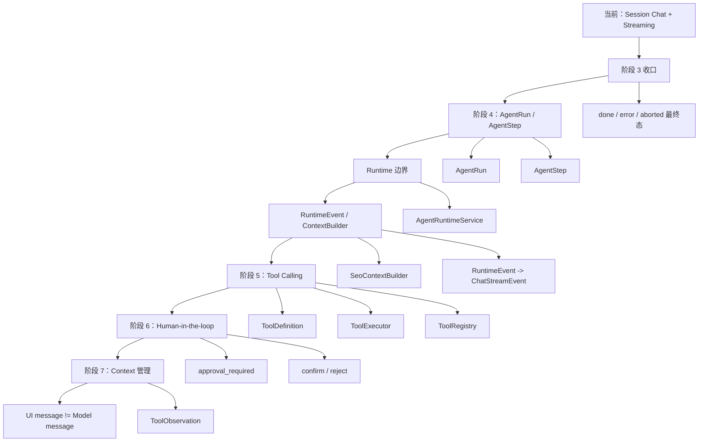

# AI SEO Agent 迁移路线图

```mermaid
flowchart TD
  A["当前：Session Chat + Streaming"] --> B["阶段 3 收口"]
  B --> C["阶段 4：AgentRun / AgentStep"]
  C --> D["Runtime 边界"]
  D --> E["RuntimeEvent / ContextBuilder"]
  E --> F["阶段 5：Tool Calling"]
  F --> G["阶段 6：Human-in-the-loop"]
  G --> H["阶段 7：Context 管理"]

  B --> B1["done / error / aborted 最终态"]
  C --> C1["AgentRun"]
  C --> C2["AgentStep"]
  D --> D1["AgentRuntimeService"]
  E --> E1["SeoContextBuilder"]
  E --> E2["RuntimeEvent -> ChatStreamEvent"]
  F --> F1["ToolDefinition"]
  F --> F2["ToolExecutor"]
  F --> F3["ToolRegistry"]
  G --> G1["approval_required"]
  G --> G2["confirm / reject"]
  H --> H1["UI message != Model message"]
  H --> H2["ToolObservation"]
```

## 当前原则

- 不改变用户体验，先改变内部边界。
- 不引入多协议，继续用 NDJSON。
- 不保存所有 delta，只保存最终事实和关键过程。
- 不一开始做 MCP，先做内置工具闭环。
- 不一开始做 OS sandbox，先做 human-in-the-loop。
