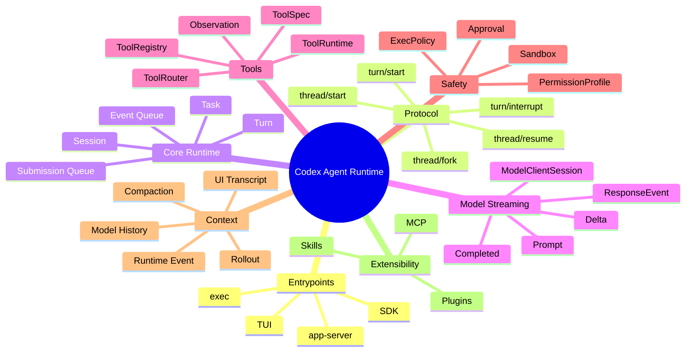

# Codex Runtime 架构图

## 关键分界

- Entrypoints 只负责输入和展示。
- Protocol 负责稳定契约。
- Core Runtime 才执行 Agent loop。
- ToolSpec 和 ToolRuntime 必须分开。
- UI transcript、model history、runtime event、persistent log 是四种数据。
