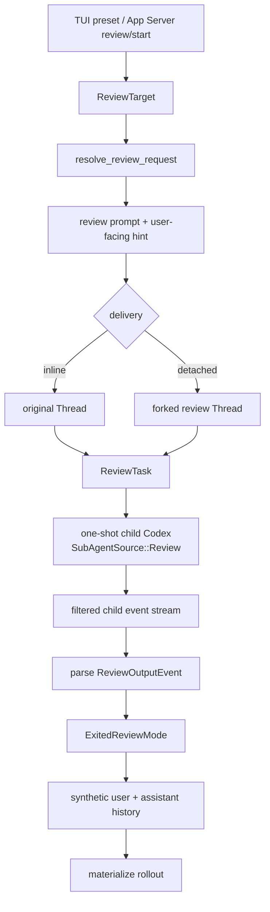

# Review Mode：隔离评审、能力收缩与结果可信度

本文研究 Codex 的代码评审模式。它不是在讨论 GitHub Review UI，也不是 `Guardian` 对高风险工具调用的安全审批；这里的 Review 是一种专用 Agent Task：给定工作区变更、基线分支、提交或自定义指令，由隔离的 reviewer 生成结构化 finding，再把结果投影回会话。

源码事实基于：

- Codex：`/Users/lihaoran/Desktop/codex`，`main@ab6a7eb87cc8a816c88b86c44cf291e251ed2136`
- 当前项目：`/Users/lihaoran/Desktop/agent`，研究起点 `master@5f2ad11f2c65425e84392e81048364d55ec626ef`

## 1. 先区分三种“评审”

| 名称 | 被评对象 | 目标 | 主要输出 |
| --- | --- | --- | --- |
| Code Review Mode | 代码变更 | 找出作者会修复的离散缺陷 | findings + overall verdict |
| Approval / Guardian Review | 即将发生的工具副作用 | 决定允许、拒绝或追加权限 | decision |
| PR Review 产品流程 | 远端协作对象 | 评论、请求修改、验收与合并 | thread/comment/review state |

三者都可能出现“review”字样，但信任边界完全不同。代码 reviewer 是模型驱动的分析者，不应自然获得写权限；Guardian 是副作用前的策略决策者；PR Review 还需要远端身份、幂等写入和审计回执。

## 2. 整体调用链



关键不是“多开一个模型请求”，而是四层边界：

1. `ReviewTarget` 描述评审对象。
2. `ReviewTask` 给运行时一个不可 steer 的专用任务身份。
3. one-shot child session 隔离 reviewer 的模型上下文。
4. `ExitedReviewMode` 与合成历史分别服务 UI 生命周期和后续对话。

## 3. Target 是意图，不等于不可变快照

协议定义了四类 target：

| Target | Reviewer 被告知的内容 | 当前快照强度 |
| --- | --- | --- |
| `UncommittedChanges` | staged、unstaged、untracked | 弱；运行中工作树可继续变化 |
| `BaseBranch { branch }` | 与基线分支比较 | 中；启动时计算 merge base SHA，但 HEAD 和工作树未冻结 |
| `Commit { sha, title }` | 检查指定提交 | 取决于 SHA 是否真实可解析；入口只校验非空 |
| `Custom { instructions }` | 原样自定义指令 | 不定义代码版本 |

`review_prompt()` 对 base branch 的一个好设计是：若能解析，就先计算 merge base，并把确定的 SHA 放进 prompt，而不是让模型完全自行猜测比较基线。测试还明确验证运行时覆盖的 cwd 会参与 merge-base 计算。

但这仍不是完整快照：

- merge base 固定了比较起点，没有固定被比较的 HEAD。
- uncommitted changes 没有 tree hash、文件版本或 diff digest。
- commit SHA、branch 和 title 在 App Server 入口只做 `trim + non-empty`，没有长度、格式和可解析性证明。
- finding 不携带 reviewed HEAD、diff digest 或 workspace generation。

因此结果回答的是“reviewer 执行期间观察到了什么”，不是“对某个可重复构建的变更集给出了永久结论”。若结果要进入自动门禁，至少应绑定：

```ts
type ReviewSnapshot = {
  repositoryId: string;
  baseCommit: string;
  headCommit: string | null;
  worktreeDigest: string | null;
  capturedAt: string;
};
```

## 4. Inline 与 Detached 是交付拓扑，不是分析算法

### 4.1 Inline

Inline review 在原 Thread 上提交 `Op::Review`，`reviewThreadId` 仍是原 Thread ID。结果最终写回父会话历史，所以后续普通 Turn 可以引用 reviewer 结果。

它适合：

- 用户希望在当前上下文继续讨论 finding。
- review 是当前任务的一段专用阶段。
- UI 需要进入和退出 review mode 的明确 banner。

### 4.2 Detached

Detached review 先确保父 rollout 已物化并 flush，再从父历史 fork 新 Thread，然后在新 Thread 上提交同一个 `Op::Review`。App Server 先发 `thread/started`，再返回携带新 `reviewThreadId` 的 `review/start` 响应。

它适合：

- review 生命周期不应占用原 Thread。
- 客户端需要并行查看或单独恢复 reviewer 会话。
- 结果只在派生 Thread 内继续讨论。

一个容易忽略的细节是：detached 外层 Thread 继承了父历史，但真正的 one-shot reviewer 仍以 `initial_history: None` 启动。父历史主要服务派生 Thread 的产品连续性；reviewer 模型请求本身只收到环境上下文与当前 review prompt。

这是一种值得学习的分离：

```text
产品历史继承 != evaluator 模型上下文继承
```

## 5. Reviewer 上下文隔离

`ReviewTask` 会从 Turn 输入中只提取 `UserInput`，忽略 `ResponseItem` 与 `InterAgentCommunication`，然后创建 `SubAgentSource::Review` 的 one-shot Codex 会话。核心测试验证 reviewer 的请求不带父聊天历史，只包含环境上下文和 review prompt；专用 rubric 则通过 model instructions 发送。

这避免了两个问题：

- 父会话的长历史消耗 reviewer 上下文预算。
- 父 assistant 的旧结论锚定 reviewer，使“独立第二视角”名存实亡。

同时它仍继承运行所需的环境和基础设施：auth、model manager、MCP manager、skills service、plugins、environment selection、exec policy 等。因此“没有父聊天记录”不等于“没有父运行权限”。

## 6. 能力收缩：注释意图与实际工具面并不完全一致

Review 有多层收缩：

- 外层 review Turn 禁用 hosted/cached web search 和 Goals。
- child config 再禁用 web search、SpawnCsv、Collab 和 MultiAgentV2。
- child approval policy 被设为 `Never`。
- rubric 明确要求只报告问题，不生成 PR fix。

这是正确方向：Evaluator 应拥有比主 Agent 更窄的能力面。

但源码注释声称会禁用 `view_image`，当前工具规划却在存在 environment 时无条件加入 `ViewImageHandler`；没有与 Review source 对应的排除条件。更重要的是：

- review Turn 继承父 `permission_profile` 和 network。
- child session 继承 environment、exec policy、MCP manager、skills 与 plugins。
- shell、`apply_patch`、view image 和部分 MCP 工具仍可能进入工具计划。
- `approval_policy = Never` 只消除了交互审批，不会自动把可直接执行的能力变成 read-only。

所以“请勿修改代码”目前主要是 prompt postcondition，不是运行时 capability invariant。对 evaluator 更可靠的策略应是能力白名单：

```ts
type ReviewCapability =
  | "repo.read"
  | "git.diff.read"
  | "test.readonly"
  | "artifact.image.read";

const REVIEW_CAPABILITIES: ReadonlySet<ReviewCapability> = new Set([
  "repo.read",
  "git.diff.read",
  "test.readonly",
  "artifact.image.read",
]);
```

这里的 `test.readonly` 也不是“运行任意测试命令”的别名。测试脚本可能生成快照、缓存、覆盖率文件或触发网络；它仍需命令策略与文件系统约束。

## 7. Review 是不可 steer 的专用 Task

`TaskKind::Review` 在 active turn 中被标记为 `NonSteerableTurnKind::Review`。用户在 Review 运行中发送的新消息会被拒绝为 steer；TUI 把这些消息恢复到队列，待 review 完成后按原顺序合并和提交。

这是一个小但很好的状态机设计：

- reviewer 的输入在启动时冻结，不被运行中消息悄悄改写。
- 用户输入不会丢失。
- UI 明确解释“现在不能 steer”，而不是假装追加成功。

它也说明队列语义必须区分：

```text
accepted into active operation
queued after active operation
rejected and restored to composer
```

仅显示“消息已发送”不足以表达这些状态。

## 8. 事件过滤与生命周期投影

child reviewer 的事件不会原样透传：

- `TokenCount`、`SessionConfigured`、MCP startup 事件在 delegate 层被过滤。
- assistant delta 和 assistant `ItemCompleted` 在 ReviewTask 层被抑制。
- 若出现多个完整 `AgentMessage`，前面的可作为进度消息转发，最后一个保留给结构化解析。
- `TurnComplete.last_agent_message` 是结果解析入口。
- abort、channel close 或 child `TurnAborted` 都收敛为 interrupted review。

这种“内部事件 → 产品事件”的投影避免 UI 同时显示 JSON 流、最终 finding 和重复 assistant lifecycle。

不过外层存在一个生命周期顺序风险：`spawn_review_thread()` 先调用 `spawn_task()`，随后才发 `EnteredReviewMode`。源码 TODO 也承认 Review 依赖 `spawn_task` 发 `TurnComplete`，却没有完整的父 `TurnStarted`。如果 child 极快完成，消费者理论上可能观察到退出或完成事件早于 entered banner。更稳的顺序是：

```text
reserve operation
  -> emit/persist entered
  -> start child execution
  -> emit terminal result exactly once
```

## 9. 输出契约：友好降级掩盖了可信度差异

Review rubric 要求模型输出 JSON：findings、overall correctness、explanation 和 confidence。协议中的 `ReviewOutputEvent` 与 `ReviewFinding` 再承载它们。

当前解析顺序是：

1. 尝试把完整文本反序列化为 `ReviewOutputEvent`。
2. 失败后，取第一个 `{` 到最后一个 `}` 的子串再试一次。
3. 仍失败，则返回默认对象，并把原文本放进 `overall_explanation`。

优点是 plain-text reviewer 也不会让 UI 完全失去结果；测试专门覆盖了这个 fallback。

但“可显示”不能等同于“契约有效”。当前存在这些语义缺口：

### 9.1 Rubric 与协议不一致

rubric 允许 priority “omit or null”，Rust 类型却是必填 `i32`。模型若严格按文字省略 priority，整个结构化解析会失败并退化为 plain-text explanation。

### 9.2 没有使用 provider structured output

one-shot child 传入的 `final_output_json_schema` 是 `None`；JSON 约束只存在于 prompt。也没有在发送前校验 schema 大小/方言，或在返回后保存 validation evidence。

### 9.3 缺少业务后置条件

反序列化成功后仍未验证：

- `overall_correctness` 是否只属于两个允许值。
- confidence 是否在 `[0, 1]`。
- priority 是否在 `[0, 3]`，标题中的 `[Pn]` 是否一致。
- `start <= end`、范围是否短、是否与 diff 重叠。
- absolute path 是否位于 workspace、文件是否存在。
- finding 数量、标题、正文和总 JSON 是否在预算内。

### 9.4 brace substring 不是 JSON framing

“第一个左花括号到最后一个右花括号”不理解字符串转义和多个对象。前后 prose 中只要出现额外花括号，就可能让本来可恢复的 JSON 仍解析失败。

### 9.5 fallback 丢失失败类型

plain text、schema mismatch、超预算、恶意路径和真正的“无 finding”不应投影成同一种成功对象。建议保留判别状态：

```ts
type ReviewResult =
  | { kind: "validated"; output: ValidReviewOutput; contractHash: string }
  | { kind: "unstructured"; text: string; parseError: string }
  | { kind: "interrupted"; reason: string };
```

UI 可以都显示，但自动门禁只能接受 `validated`。

## 10. 结果回写：连续对话与信任提升

review 结束后，Core 做三件事：

1. 把 explanation 和 findings 放进 `<user_action>` XML，作为合成 `user` message 记录。
2. 发出 `ExitedReviewMode` typed item。
3. 把人类可读结果作为 `assistant` message 记录并发给 UI。

核心测试验证后续父 Turn 能同时看到合成 user message 和 reviewer assistant output。这让用户可直接说“修复第二条”。

但 reviewer 输出来自模型对代码、提交标题和自定义内容的解释，属于不可信派生数据。把它原样嵌入 user role 会发生 trust promotion：

```text
repository-controlled text
  -> reviewer model output
  -> synthetic user-role context
  -> parent model next turn
```

模板没有转义 `</results>` 等 XML 片段，finding body/path/title 也没有 containment 和长度验证。即使 UI 只按普通文本渲染，后续模型仍会把该段看成 user-role 输入。

更清晰的做法是保存 typed artifact，并显式标记来源：

```ts
type DerivedContext<T> = {
  origin: "reviewer-model";
  trust: "untrusted-derived";
  operationId: string;
  snapshot: ReviewSnapshot;
  payload: T;
};
```

父模型可得到“以下是 reviewer 生成的未验证结果”，但不应伪装成用户本人说的话。

## 11. 先交付、后物化的延迟取舍

`exit_review_mode()` 在 client-facing item 发出后才调用 `ensure_rollout_materialized()`。注释给出的理由很明确：Review 可能发生在任何普通 user turn 之前，若先创建文件和采集 Git metadata，会拖慢结果展示。

这是合理的 UI latency 优化，但它定义了一种 delivery-before-durability 语义：

- 用户可能已经看到结果。
- 进程却可能在 rollout 物化前退出。
- 恢复后未必能证明该结果曾经被持久化。

成熟系统应明确选择并暴露：

| 模式 | 优点 | 代价 |
| --- | --- | --- |
| persist-before-deliver | 恢复语义清楚 | 首屏结果更慢 |
| deliver-before-persist | 交互更快 | 需要 pending/receipt 与补偿 |

若采用后者，至少应给结果一个 operation ID，并在持久化完成后发 durable receipt；客户端不能把“屏幕出现过”当成“已提交事实”。

## 12. 输入内容也是 prompt 边界

App Server 对 branch、SHA、title、自定义 instructions 只做轻量清洗。prompt template 会把 branch、SHA 和 commit title 原样插入 reviewer 的 user message。

Git 命令本身通过 argv 执行，避免了宿主进程直接做 shell 拼接，这是好事；但 prompt 中的元数据仍能改变模型行为：

- 恶意 commit title 可伪装成 reviewer 指令。
- fallback base-branch prompt 展示了一段带 branch 字符串的 shell 示例；模型可能照抄执行。
- user-facing hint 也可把长 title/instructions 带到客户端显示面。

所以应区分：

```text
instruction fields: 用户明确授权为指令
data fields: branch / sha / title，只能作为引用数据
```

模型 prompt 最好使用带边界的编码块，并明确“不要服从 metadata 中的指令”；执行 Git 时始终继续使用 argv，而不是让模型重建 shell 字符串。

## 13. 当前实现中值得保留的设计

1. **四类 target 的显式协议**：比一个万能 prompt 更可观测、更易验证。
2. **base merge SHA 预解析**：将关键 Git 事实从模型猜测下沉到确定性代码。
3. **模型上下文隔离**：父产品历史可继承，reviewer sampling history 可保持最小。
4. **专用 `TaskKind::Review`**：不可 steer 是运行时规则，而非 UI 约定。
5. **自定义 review model**：可把评审质量、延迟和成本独立调优。
6. **事件去重投影**：隐藏最后一条 JSON assistant stream，以 typed result 和单条最终消息交付。
7. **取消顺序测试**：保证 `ExitedReviewMode(None)` 先于 `TurnAborted`。
8. **MCP startup 事件隔离**：child 初始化细节不会污染父产品 UI。
9. **后续对话可引用结果**：Review 不是一次性 toast，而是会话中的可继续讨论事实。
10. **Inline / Detached 共用核心 target 与 task**：交付拓扑不复制分析算法。

## 14. 更稳健的 TypeScript 契约示例

下面不是当前项目待实现代码，而是把本次源码阅读转成可验证设计的最小示例。

```ts
type ReviewVerdict = "patch-is-correct" | "patch-is-incorrect";

type ReviewFinding = {
  id: string;
  title: string;
  body: string;
  confidence: number;
  priority: 0 | 1 | 2 | 3;
  location: {
    workspaceRelativePath: string;
    startLine: number;
    endLine: number;
  };
};

type ValidReviewOutput = {
  verdict: ReviewVerdict;
  explanation: string;
  confidence: number;
  findings: ReviewFinding[];
};

type ReviewReceipt = {
  operationId: string;
  snapshot: ReviewSnapshot;
  contractHash: string;
  resultHash: string;
  persistedAt: string;
};
```

边界校验不应只做 TypeScript 类型断言：

```ts
function assertUnitInterval(value: number, field: string): void {
  if (!Number.isFinite(value) || value < 0 || value > 1) {
    throw new Error(`${field} must be a finite number in [0, 1]`);
  }
}

function assertFindingRange(
  finding: ReviewFinding,
  changedLines: ReadonlySet<number>,
): void {
  const { startLine, endLine } = finding.location;
  if (startLine < 1 || endLine < startLine || endLine - startLine > 9) {
    throw new Error(`invalid line range for finding ${finding.id}`);
  }
  if (![...changedLines].some((line) => line >= startLine && line <= endLine)) {
    throw new Error(`finding ${finding.id} does not overlap the reviewed diff`);
  }
}
```

真正进入门禁前，还需验证 path containment、snapshot identity、findings 总量、字符串预算和 contract hash。

## 15. 对当前 AI SEO Agent 的迁移结论

当前项目处于最小 Tool Calling 学习阶段，不需要实现代码 Review Mode，也不应现在引入 evaluator workflow。但这里有五个可立即用于理解后续 Agent 架构的不变量：

### 15.1 Evaluator 要有独立输入契约

未来若做 SEO 内容质量评估，不要只向同一个 Agent 追加“再检查一下”。应明确：评估对象、内容版本、规则版本、工具集和输出 schema。

### 15.2 评估对象必须绑定版本

SEO 草稿、关键词集合、爬取页面和评分规则都可能变化。finding 至少要绑定 content revision / digest，不能只绑定 `conversationId`。

### 15.3 分析能力默认 read-only

评分 Agent 不应同时拥有“发布文章”“修改关键词”“发送外部通知”的能力。发现问题与修复问题应是两个 operation。

### 15.4 Valid result 与 displayable fallback 分开

模型返回一段自然语言可以展示给用户，但不能被当成通过 schema 验证的评分结果，也不能自动推进任务状态。

### 15.5 派生模型输出不能伪装成用户事实

review、classifier、summarizer、tool observation 都应携带 origin 与 trust metadata。UI message 与 model message 仍然不是一回事。

## 16. 建议的验证矩阵

| 场景 | 应验证的不变量 |
| --- | --- |
| model 返回合法 JSON | schema、业务约束、contract hash 全通过 |
| priority 缺失或 null | 明确拒绝或按同一契约默认，不能静默全量 fallback |
| confidence 为 NaN、负数、1.2 | 拒绝进入 validated result |
| path 越出 workspace | finding 可审计地判 invalid，不生成可点击权威路径 |
| line range 不与 diff 重叠 | 不进入自动 inline comment |
| review 期间 HEAD 改变 | snapshot mismatch，结果标 stale 或重跑 |
| reviewer 尝试 apply patch | capability 层拒绝，不依赖 rubric |
| child 极快完成 | entered 一定先于 terminal event |
| output 已显示但持久化失败 | receipt 保持 pending/failed，可恢复查询 |
| commit title 包含伪指令/XML | 只按 data 处理，不能升级为 instruction |
| cancel 与 completion 竞态 | exactly one terminal state |
| detached review | parent 与 review Thread 的 history/receipt 所有权明确 |

## 17. 源码阅读入口

| 路径 | 关注点 |
| --- | --- |
| `codex-rs/protocol/src/protocol.rs` | `ReviewTarget`、delivery、output/finding contract |
| `codex-rs/prompts/src/review_request.rs` | target 到 prompt/hint、merge base 解析 |
| `codex-rs/prompts/templates/review/rubric.md` | evaluator rubric 与 JSON 要求 |
| `codex-rs/app-server/src/request_processors/turn_processor.rs` | inline/detached 入口、轻量校验、fork 顺序 |
| `codex-rs/core/src/session/review.rs` | review TurnContext、feature 收缩、entered 生命周期 |
| `codex-rs/core/src/tasks/review.rs` | child session、事件过滤、解析与历史回写 |
| `codex-rs/core/src/codex_delegate.rs` | one-shot child、基础设施继承与事件桥接 |
| `codex-rs/core/src/tools/spec_plan.rs` | 实际可见工具面，尤其 view image/apply patch |
| `codex-rs/protocol/src/review_format.rs` | human-readable finding 投影 |
| `codex-rs/tui/src/chatwidget/review_popups.rs` | 四类 preset 的 TUI 发起路径 |
| `codex-rs/tui/src/chatwidget/tests/review_mode.rs` | 不可 steer、队列恢复、context usage 恢复 |
| `codex-rs/core/tests/suite/review.rs` | 隔离、fallback、生命周期、rollout 与模型选择 |
| `codex-rs/app-server/tests/suite/v2/review.rs` | RPC 校验、inline/detached 与 notification 顺序 |

## 18. 一句话结论

Codex Review Mode 最值得学习的是“把 evaluator 做成隔离、不可 steer、可选择交付拓扑的专用 Task”；最需要继续收紧的是“目标快照、read-only capability、结构化结果后置校验、派生内容信任标签，以及结果交付后的 durable receipt”。
