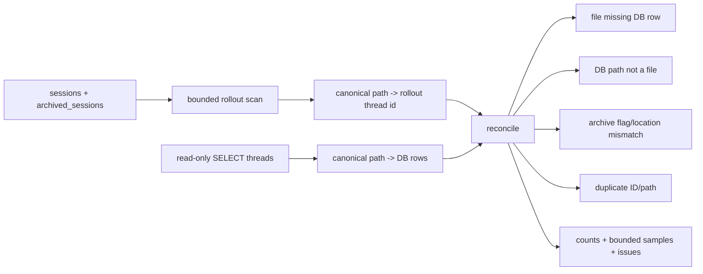

# Rollout 与 State DB 的双索引对账

Codex 同一 Thread 同时存在两种持久化表示：rollout JSONL 是可恢复事件事实，SQLite `threads` 是可查询索引。`codex doctor` 的 thread inventory check 不尝试自动修复，而是读取两边、建立 canonical identity、分类不一致并给出有限样本。本专题把它作为“事件日志 + 查询投影”系统的对账案例。

研究快照：`main@ab6a7eb87cc8a816c88b86c44cf291e251ed2136`。

## 1. 为什么需要对账

Rollout 和 State DB 的职责不同：

| 表示 | 优势 | 可能漂移 |
| --- | --- | --- |
| JSONL rollout | append-oriented、可恢复完整Thread事实、可独立存在 | 被移动、归档、删除、截断、部分写或复制 |
| SQLite `threads` | 快速分页/筛选/排序、保存归档和metadata投影 | backfill遗漏、路径陈旧、archive flag漂移、重复索引 |

因此“DB能查询到”不等于“Thread可恢复”，“文件还在”也不等于“产品列表能发现”。健康条件必须同时检查 path、Thread ID 和 archive location。



## 2. 真实调用链

入口：`cli/src/doctor/thread_inventory.rs::thread_inventory_check`。

```text
scan sessions
  -> scan archived_sessions
  -> identify rollout-*.jsonl
  -> load rollout items
  -> derive canonical Thread ID
  -> normalize path key
read state DB audit rows (read-only, no create/migrate/repair)
  -> SELECT id, rollout_path, archived, source, model_provider
group both sides by normalized path
compare path + id + archive location
summarize source/provider distribution
emit DoctorCheck(state.rollout_db_parity)
```

`state/src/audit.rs::read_thread_state_audit_rows` 刻意绕开 `StateRuntime::init`：SQLite connection使用 `create_if_missing(false)`、`read_only(true)`、单连接，并关闭statement logging。Doctor不会因为检查而创建或迁移被诊断数据库。

## 3. 对账维度

### 3.1 File missing DB row

对每个 rollout，只有同一个 normalized path 下存在相同 Thread ID 的 DB row 才算匹配。仅 path相同但ID不同不会误判成功。

active与archived分别计数，便于区分普通backfill缺口和归档索引缺口。

### 3.2 Stale DB row

完整scan时，DB row的 `rollout_path.is_file()` 为false即stale。scan达到cap时跳过这项，避免“没扫到”被误写成“文件不存在”。

### 3.3 Archive mismatch

rollout在 `archived_sessions` 下时，DB `archived` 应为true；在 `sessions` 下则应为false。它以实际文件位置为准，而不是相信数据库自己的flag。

### 3.4 Duplicate identity

- rollout侧：相同Thread ID出现在多个文件；
- DB侧：多个row指向同一个normalized path。

这两类都破坏“一Thread一rollout path”的索引不变量。

### 3.5 Distribution context

报告还汇总 model provider 和 session source。Structured subagent source会被粗化为 `subagent:review`、`subagent:thread_spawn` 等类别，不把parent Thread ID/depth等高基数字段直接放进summary。

## 4. 值得学习的代码

### 4.1 Audit query 与 runtime init 分离

诊断层使用专门的 minimal audit row和read-only connection，而不是启动完整StateRuntime。它避免：

- 自动migration改变现场；
- backfill在检查期间掩盖缺口；
- writer/background worker引入新竞态；
- 无关columns和业务对象扩大内存。

这是生产数据诊断的核心原则：**观察接口不能顺便修复被观察对象。**

### 4.2 先标记scan completeness，再决定能否下否定结论

达到10,000 candidate cap后，报告不会继续计算 stale row和archive mismatch，而是输出 `skipped (scan cap reached)`。它没有把partial scan的“不知道”写成0。

这比“为了有数字而填0”可靠得多。任何有budget的inventory/scan都应把 completeness作为一等字段。

### 4.3 Canonical path + business identity双重匹配

`path_key`尝试 `canonicalize`（并做WSL normalization），失败才fallback原path。匹配又要求DB ID等于rollout-derived ID。

路径回答“是不是同一个artifact”，Thread ID回答“artifact属于谁”。两者缺一不可。

### 4.4 故障分类而不是一个 parity boolean

Missing、stale、archive mismatch、duplicate、scan error、malformed filename和cap分别进入details/issues。不同类型对应不同恢复策略：

- State DB完全缺失而rollout存在：提示启动Codex触发backfill；
- DB存在但局部缺row：只报告，不错误承诺restart会修复；
- duplicate：建议附报告让support分析；
- scan error：检查权限/异常文件。

测试还明确断言局部不一致不会给出“Restart Codex”这种未经证明的remedy。诊断建议必须服从真实恢复语义。

### 4.5 有界样本和低基数summary

- 每类path/error sample最多5条；
- provider/source summary最多8类，其余合并为 `other=<rows> across <categories>`；
- source结构被coarsen。

报告保留可操作证据，又避免把数万路径或parent identity塞进stdout/feedback附件。

### 4.6 Missing DB 的空态不是错误

State DB不存在、rollout也不存在且scan完整时返回Ok：“no inventory to compare”。全新安装没有持久化数据是合法状态，不应被诊断成损坏。

## 5. Scan budget 与实现边界

### 5.1 10,000 cap不是完整资源budget

candidate计数只包含：

- 已识别rollout文件；
- malformed rollout filename；
- scan error。

普通非rollout文件和directory不计数。一个包含百万空目录/无关文件的树仍可无界遍历。`std::fs::read_dir`又运行在async函数内，会阻塞Tokio worker。

真正的budget应同时限制：directory entries、depth、files、bytes、wall time和errors，并把每项消耗写入report。

### 5.2 每个rollout都会完整读取

`thread_id_from_rollout` 调用 `RolloutRecorder::load_rollout_items`：

- 流式读到EOF；
- 每行parse JSON和`RolloutLine`；
- 把所有`RolloutItem`收集进Vec；
- 最后再由 `builder_from_items` 查找SessionMeta。

Inventory只需要canonical Thread ID，却为每个候选解析完整历史。10,000个大型/压缩rollout可能产生巨大I/O、解压、CPU和峰值内存，而且没有单文件bytes/lines/parse-time cap。

应增加只读header API：bounded扫描到第一个canonical SessionMeta即可；若必须fallback filename，再只解析filename。完整history validation属于另一个显式check。

### 5.3 DB side没有row cap

Audit query `SELECT ... FROM threads` 使用 `fetch_all`，没有row limit或streaming aggregation。filesystem cap为10,000，但损坏/敌对DB可以包含远更多rows；内存、path canonicalization和HashMap仍无界。

对账应对两边使用对称budget，或在SQLite中按path/id分页并做外部merge。

### 5.4 Report sample顺序不稳定

`read_dir`顺序未定义，scan使用LIFO directory stack，sample直接取发现顺序前5个。两次运行可能展示不同path样本，给support diff和复现带来噪音。

可在保留总budget的前提下选择lexicographically smallest、按mtime最近或stable hash reservoir sample，并在report说明策略。

## 6. 正确性缺口

### 6.1 Existing-but-outside-root DB path会逃过检查

Stale只检查 `row.rollout_path.is_file()`；archive mismatch只有path能归类到 `sessions` / `archived_sessions` 时才产生。

若DB row指向workspace任意现存文件：

- 不是stale；
- archive location返回None，跳过mismatch；
- 只要scan中没有对应rollout，也不会作为missing file-side row出现。

最终check可能为Ok。对账必须新增 `outside managed rollout roots` 分类，并校验extension/name/owner ID，而不只是is_file。

### 6.2 Disk与DB不是同一snapshot

流程先扫描rollout，再读DB；并发Writer/archive/backfill可能在中间改变两边。真实一致系统也可能被报告missing/stale。

本地文件与SQLite无法简单共享事务，至少可以：

1. 记录scan start/end和DB read time；
2. 读取DB revision或backfill lease；
3. 对疑似差异做第二次定点验证；
4. 只有两次稳定存在的差异才升级Warning。

### 6.3 Canonicalization成功与失败会产生不对称key

存在路径可canonicalize；已删除DB path只能fallback lexical path。symlink、case、WSL path或稍后消失的文件可能让同一逻辑路径获得不同key。fallback不是错误，但report应标记identity confidence。

### 6.4 Rollout path alias没有完整分类

scan忽略symlink entry（`file_type.is_file`为false），但DB `is_file()`会跟随symlink。hardlink/symlink/同inode多path不会作为artifact alias报告；duplicate check只看Thread ID和DB normalized path。

若安全模型要求rollout不可越root，应检查canonical containment、symlink policy和可选file identity。

### 6.5 Parse errors被降格为可用

`load_rollout_items`会跳过部分坏行并返回 `parse_errors`，inventory忽略这个计数；只要仍有item/metadata，就把文件视为可用。对于只取Thread ID合理，但“rollout可恢复”并未被证明。

报告应区分：

- identity-readable；
- fully-parseable；
- recovery-safe。

不要让parity check的Ok被理解成history integrity Ok。

### 6.6 `rollout_by_key`会覆盖重复canonical key

filesystem map由 `collect::<HashMap>` 构造。同一canonical target若通过不同path alias进入scan，后项覆盖前项；目前没有duplicate filesystem path key分类。

应保留 `HashMap<PathKey, Vec<RolloutAuditFile>>`，与DB侧做对称duplicate检测。

## 7. 状态与恢复语义

这个check永远只给Ok或Warning；SQLite integrity本身由独立`state.paths` check决定Fail。拆分很好：

- DB坏了不能读：storage integrity问题；
- DB能读但与rollout不同：projection parity问题；
- rollout有局部坏行：history integrity问题。

把三种问题混成一个Fail，会让用户不知道应该备份DB、重建index还是保留原文件交给support。

另一个重要边界是“自动重建只在什么条件发生”。代码只对“DB整体缺失且rollout存在”给出startup backfill remedy；对局部missing row不承诺restart修复。这说明恢复流程不是万能reconciliation loop。

## 8. 测试证据

### 已有测试

| 测试 | 证明内容 |
| --- | --- |
| `thread_inventory_check_ok_when_rollouts_match_db` | active/archived path+ID完整匹配 |
| `thread_inventory_check_warns_for_missing_stale_and_mismatched_rows` | 三类差异分别计数并生成3个issue |
| 同一测试的remedy断言 | 局部差异不错误承诺restart修复 |
| `source_category_coarsens_structured_sources` | subagent结构转低基数category |
| `count_summary_caps_distinct_values` | 超过8类时稳定合并other |
| State audit实现 | read-only、no-create、单连接、minimal columns |

### 应补测试

1. DB path为managed roots外现存文件，必须Warning。
2. DB path为symlink/hardlink/alias，canonical containment与duplicate分类。
3. 10,000 rollout外加百万无关entries，entry/time budget生效。
4. 单个超大/压缩炸弹rollout，header reader在bytes/lines/decode budget内停止。
5. DB百万rows，分页/streaming和row cap不会OOM。
6. scan达到cap时，所有依赖完整性的字段都显示unknown/skipped。
7. disk/DB在检查中途archive/backfill，二次定点验证消除瞬时误报。
8. rollout有parse errors但Thread ID可读时，identity parity与history integrity分开。
9. duplicate canonical filesystem key不被HashMap静默覆盖。
10. stable sample strategy在不同read_dir顺序下输出一致。
11. malformed filename但有效SessionMeta的期望分类。
12. Windows case、UNC、WSL和missing-path normalization confidence。

## 9. 架构解释

Event log与query projection的对账不是“数量相等”检查，而是一个typed join：

```ts
interface DurableArtifactIdentity {
  ownerId: string;
  logicalPath: string;
  canonicalPath?: string;
  contentId?: string;
  lifecycle: 'active' | 'archived';
  identityConfidence: 'canonical' | 'lexical';
}

type ReconciliationFinding =
  | { type: 'missingProjection'; artifact: DurableArtifactIdentity }
  | { type: 'staleProjection'; rowId: string; path: string }
  | { type: 'outsideManagedRoot'; rowId: string; path: string }
  | { type: 'lifecycleMismatch'; ownerId: string }
  | { type: 'duplicateIdentity'; key: string }
  | { type: 'scanIncomplete'; budget: ScanBudgetUsage };
```

每条finding都需要completeness和observation window；只有这样才能决定自动repair、人工review还是未知。

## 10. 迁移建议

当前NestJS Agent使用PostgreSQL作为canonical事实，不一定需要本地JSONL。但未来若出现：

- Object Storage中的artifact + DB metadata；
- queue job + AgentRun row；
- vector index + source document；
- analytics projection + runtime events；

都可迁移本页原则：

- audit path专用read-only接口，不启动repair worker；
- identity同时包含owner与artifact key；
- missing、stale、mismatch、duplicate、outside-root分别分类；
- partial scan明确unknown，不填0；
-样本/类别有界且稳定；
- repair建议只写已经证明的恢复路径；
-跨存储对疑似差异做二次稳定性确认；
-完整性、可恢复性和projection parity分成不同check。

## 11. 推荐阅读与 Teach-back

阅读顺序：

1. `cli/src/doctor/thread_inventory.rs::thread_inventory_check_for_roots`；
2. `scan_rollout_files` / `scan_rollout_root`；
3. `thread_id_from_rollout`；
4. `rollout/src/recorder.rs::load_rollout_items`；
5. `rollout/src/metadata.rs::builder_from_items`；
6. `state/src/audit.rs::read_thread_state_audit_rows`；
7. `parity_check_from_scan_and_rows`；
8. path/source/sample helpers；
9. matching与mismatch integration tests。

Teach-back：

1. 为什么同path还必须比较Thread ID？
2. 为什么scan incomplete时不能报告stale rows为0？
3. read-only DB connection避免了哪些“诊断改变现场”的问题？
4. 10,000 candidate cap为什么仍不能限制百万空目录？
5. DB path指向roots外现存文件时，当前算法为什么可能返回Ok？
6. parity Ok为什么不能证明rollout history完全可恢复？
7. 哪些局部差异可以自动repair，哪些只能报告？
