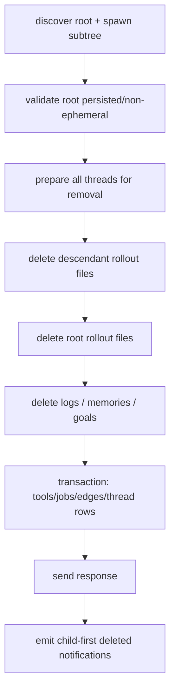

# Thread Archive、Unarchive 与 Delete：多存储提交和可重试清理

本文研究 Codex 的 Thread 归档、恢复归档和硬删除。重点不是文件移动本身，而是 live runtime、rollout、SQLite metadata、spawn graph、logs、memories、goals、jobs 和客户端通知如何形成一个跨资源生命周期操作。

源码事实基于：

- Codex：`/Users/lihaoran/Desktop/codex`，`main@ab6a7eb87cc8a816c88b86c44cf291e251ed2136`
- 当前项目：`/Users/lihaoran/Desktop/agent`，研究起点 `master@5f2ad11f2c65425e84392e81048364d55ec626ef`

## 1. Archive、Delete、Unload 不是同义词

| 操作 | Rollout | State DB | Live Thread | 可恢复性 |
| --- | --- | --- | --- | --- |
| Unload / Close | 不移动、不删除 | 保留 | 从 ThreadManager 移除 | 可 resume |
| Archive | 从 `sessions/` rename 到 `archived_sessions/` | best-effort 标记 archived/path | 先请求 shutdown，再移除 | 可 unarchive |
| Delete | active/archived plain 与 zstd rollout 都删除 | 清 logs/memory/goal/tool/job/edges/thread row | 先请求 shutdown，再移除 | 不应恢复 |

Archive 是可见性和生命周期分类，不是隐私删除；Delete 才尝试物理删除已知持久对象，但仍不自动撤销 Thread 曾经造成的工作区或远端副作用。

## 2. 公共控制面先串行化列表状态

Archive、unarchive、delete 和部分 metadata 更新都会持有同一个 `thread_list_state_permit`。这避免两个列表结构变更同时修改文件/metadata 后，`thread/list` 投影看到无序中间状态。

它不是完整事务锁：

- Turn 执行、外部文件系统、State DB 其他写入不一定共享该 permit。
- shutdown timeout 后操作仍继续。
- 多个进程之间不共享内存 semaphore。

所以它是 App Server 进程内的 UI/list mutation serialization，不是全局一致性证明。

## 3. 移除 live Thread 的顺序

Archive 和 Delete 共用 `prepare_thread_for_removal()`：

1. 先从 `ThreadManager` map 中移除 `Arc<CodexThread>`。
2. 若原来是 active Thread，最多等 10 秒 `shutdown_and_wait()`。
3. submit shutdown 失败或 timeout 只记录日志，仍继续 archive/delete。
4. 取消该 Thread 的 pending app-server requests。
5. 删除 ThreadState、listener/watch projection。

优点是：一旦生命周期操作开始，新请求不再从 manager 获得这个 Thread；UI subscription 和 callback 也会被清理。

但 `ThreadManager::remove_thread()` 注释明确承认其他位置可能仍持有 `Arc`。shutdown 又不是 hard barrier。若 10 秒超时后旧任务仍执行，后续可能出现：

- rollout 已移动或删除，旧 writer 仍尝试 flush。
- shell/process/MCP side effect 在“删除成功”后继续发生。
- 客户端请求被取消，但后台任务仍消耗资源。

对 Hard Delete，更强的不变量应是：

```text
revoke capability -> prove execution quiescent -> delete durable state
```

如果无法证明 quiescent，应返回 `pending-deletion`，而不是继续宣称完成。

## 4. Spawn subtree 是 lifecycle ownership

Archive/Delete 不只处理 root Thread。`list_agent_subtree_thread_ids()` 合并：

- State DB 中所有 open/closed spawn descendants。
- AgentControl 当前 live graph 中的 descendants。
- HashSet 去重。

这比只删除父会话更合理，因为 sub-agent Thread 是父 operation 创建的生命周期资源。测试覆盖 parent → child → grandchild，并验证 closed/open edge 都会进入 subtree。

但 archive 与 delete 对 partial failure 采用不同策略：

| 操作 | Root 顺序 | Descendant 失败 | 总体响应 |
| --- | --- | --- | --- |
| Archive | root 先移动 | warning，继续其他 descendant | 仍成功，通知成功项 |
| Delete | descendants 逆序，root 最后 | 任意 store error 立即失败 | 无成功响应/通知，可重试 |

Archive 是 best-effort tree classification；Delete 更接近 strict cleanup，但仍不是跨文件/DB原子事务。

## 5. Archive 的文件安全检查

LocalThreadStore archive 会：

- 根据 Thread ID 找 active rollout。
- canonicalize 并要求 source 位于 `CODEX_HOME/sessions`。
- 校验文件名以目标 Thread ID 的 `.jsonl` 或 `.jsonl.zst` 后缀结尾。
- 创建 archive 目录。
- 用同一文件名 rename 到 `archived_sessions/`。
- best-effort 更新 State DB archived timestamp 和新路径。

Containment + ID filename match 是优质边界：State DB 的陈旧/恶意路径不能让 archive 移动任意宿主文件。

但是 destination 没有显式 `must_not_exist` 校验。Unix `rename` 可能替换已存在的普通文件；测试为了制造冲突，特意把 destination 建成目录，而不是同名文件。这意味着若 active 与 archived collection 异常地同时存在同 ID 文件，archive 可能覆盖旧 archive。更稳的是 no-replace rename 或先比较内容 identity。

## 6. Archive 是 filesystem-first、metadata-best-effort

文件 rename 成功后：

```rust
let _ = state_db.mark_archived(...).await;
```

State DB 失败被忽略，API 仍成功。这让“文件位置”成为归档事实，SQLite 只是可修复索引；前文的 rollout/state reconciliation 正是这类架构的必要配套。

优点：metadata 故障不会阻止用户整理 Thread。

代价：

- `thread/list` 若只信 DB 可能暂时显示 active 路径。
- archived filter 和实际文件 collection 分叉。
- API response 没有 `metadataRepairPending` 证据。

Best-effort projection 可以接受，但必须有定期 backfill/audit，而不是静默永久分叉。

## 7. Archive subtree 的 partial success 是公开语义

Archive 先要求 root 是已物化且未归档的 rollout。Fresh Thread 在第一条用户消息前没有文件，archive 会失败；Delete 却允许关闭并清理这种 non-ephemeral live Thread。

对 descendants：

- 缺失或读取失败会 warning 并跳过。
- root 先 archive。
- 其余 descendants 逆序 archive。
- 单个 descendant rename 失败不会回滚已完成项。
- response 仍是空成功对象；随后只为成功项发送 `thread/archived`。

测试验证 child 冲突时，parent 和 grandchild 已 archive，child 仍 active，总 RPC 仍成功。

客户端若只看空 response，会误以为整个 subtree 已归档。更完整的 response 应返回 per-resource outcome：

```ts
type SubtreeArchiveResult = {
  operationId: string;
  requestedRootId: string;
  archived: string[];
  alreadyArchived: string[];
  failed: Array<{ threadId: string; reason: string }>;
};
```

## 8. Unarchive 的多阶段 partial commit

Unarchive：

1. 找 archived rollout。
2. containment + filename/ID 校验。
3. 从文件名提取 year/month/day，创建原 sessions 日期目录。
4. rename 回 active collection。
5. touch mtime，使列表 recency 更新。
6. best-effort `mark_unarchived()`。
7. 重新读取 rollout，构造返回 Thread。

这里有两个 commit-after-error 窗口：

- rename 成功但 touch mtime 失败，RPC 返回错误，文件却已 unarchive。
- rename/touch 成功但 rollout 重新解析失败，RPC 返回错误，文件仍已移动。

客户端盲重试会在 archived collection 找不到源文件。操作需要 status query 或 idempotent recovery：发现 active path 已存在且 identity 匹配时，应返回 `already-unarchived`，而不是只查 archive source。

Unarchive 只恢复请求的一个 Thread，不会自动恢复 archive 时被归档的整个 spawn subtree；partial tree archive 后，恢复 root 不等于恢复 children。

## 9. Delete 的资源顺序



Delete order采用 grandchild → child → root。文件都移除后，State DB 才删除 graph 和 thread rows。这样 cleanup 中途失败时，spawn graph 还在，下一次请求仍能发现同一 subtree。

这是一个值得学习的可重试顺序：

```text
先删除可按 identity 重试的叶子资源
最后删除用于发现剩余工作的索引/关系
```

## 10. Delete 处理 active、archived 与压缩 sibling

Local store 会同时查：

- active rollout path。
- archived rollout path。
- 对每个发现的路径，同时尝试 plain `.jsonl` 与 `.jsonl.zst`。

每个真实存在的文件都经过 sessions/archive containment 和 filename ID match。discovery 后文件若已消失，视作 already deleted，支持并发删除重试。

完成文件删除后还会清 Thread name index，并移除 live recorder。

App Server 对 store `ThreadNotFound` 在 subtree delete loop 中只 warning，允许继续 State DB cleanup。这使：

- 已被另一请求删掉的 rollout 不阻塞重试。
- 只有 State DB zombie row 的 Thread 也能被清理。
- root rollout 缺失但仍有 descendants 时，仍可清整个树。

完全没有 rollout、descendant 和 State DB row 的未知 ID 则返回 not found，不把任意请求伪装成功。

## 11. State DB cleanup 不是一个数据库事务

`delete_threads_strict()` 先对每个 Thread 顺序执行：

- logs DB 删除。
- memories 删除。
- goal 删除。

然后才在主 SQLite transaction 中：

- 取消 parent runner 与 child worker 同时被删除的 agent job。
- 将仍 running 的 assigned job item 退回 Pending，清 assigned Thread，写 last_error。
- 删除 dynamic tools。
- 删除 spawn edges。
- 最后删除 thread rows。

主 DB 部分是事务，但 logs、memories、goals 可能在不同 pool/存储，已在事务前部分提交。失败后的状态可能是“日志已删、memory 未删、thread row 仍在”。

这是刻意可重试，而非原子：测试关闭 logs DB 触发失败后，验证 thread row 和 spawn graph 仍保留，保证后续能重新发现 subtree。

需要用 operation journal 表达 progress，而不是把函数名 `strict` 理解为全局事务。

## 12. Job compensation 是删除语义的一部分

Thread 被删除时，关联 agent job 不能保持 Running：

- 若 runner 和 worker Thread 都在删除集合中，job 被 Cancelled。
- 分配给被删 Thread 的 running item 退回 Pending，`assigned_thread_id = NULL`。
- last_error 记录 “assigned thread was deleted”。

这是少见但很优质的地方：删除 execution owner 时同步修复工作队列 ownership，而不是留下永远等待一个不存在 worker 的任务。

它仍需 generation/idempotency：若旧 worker 在 shutdown timeout 后继续提交 job result，必须因 assignment generation 已撤销而被拒绝。

## 13. Delete 的 ambiguous success

App Server 完成所有存储清理后先发送 RPC response，再逐个发送 child-first `thread/deleted` notifications。

协议 response 是空对象，没有：

- operation ID。
- 删除的 subtree IDs。
- durable receipt / tombstone。
- 每个存储的 cleanup 状态。

如果服务端已删除成功但 response 丢失，客户端重试可能得到 `thread not found`。它无法区分“上次已成功”和“从未存在”。Hard Delete 应保留最小 tombstone/receipt，且不包含已删除内容：

```ts
type DeleteReceipt = {
  operationId: string;
  rootId: string;
  deletedIdsHash: string;
  completedAt: string;
  retentionUntil: string;
};
```

这与隐私删除不冲突：receipt 只证明 operation，不保留 payload。

## 14. 删除失败后的通知缺口

Delete 只有整个函数成功后才填充 `deleted_thread_ids` 并发送 notification。若：

- grandchild 文件已删。
- child 删除失败。
- RPC 返回 error。

客户端不会收到 grandchild deleted notification，但它实际已消失。重试可以最终收口存储，却不能修复第一次实时 UI 的事实缺口，除非客户端重新 list/reconcile。

这进一步说明通知是投影提示，不是 durable source of truth；客户端在 destructive operation error 后应重新同步列表。

## 15. Ephemeral Thread 的特殊语义

Ephemeral Thread 没有持久化状态，所以 delete 请求明确拒绝，且 Thread 保持 loaded。产品要“关闭” ephemeral Thread 应调用 unload/shutdown，而不是 hard delete。

这保持了 API 语义纯度：delete 是删除 durable resource，不是万能 stop。

普通 non-ephemeral Thread 即使 first rollout 尚未物化，delete 仍可成功：root 在 manager 中被识别为可持久类型，shutdown/teardown 后 store missing 被当作 already absent，再清 State DB。这比 archive 更适合“刚创建就放弃”。

## 16. Archive/Delete 不是副作用补偿

两种操作都不会：

- 回退 workspace 文件。
- 撤销 Git commit/push。
- 删除远端 PR/comment/email。
- 终止 shutdown timeout 后仍存活的任意孙进程。
- 回收上传到外部 provider 的 artifact。

因此 Thread 生命周期与业务资源生命周期必须分开：

```ts
type ResourceEffect = {
  resourceType: string;
  resourceId: string;
  reversible: boolean;
  compensationOperation?: string;
  committedAt: string;
};
```

Hard Delete 可以删除 Agent 的本地记录，却不能假装从未发生过这些 effect。

## 17. 当前实现中值得学习的设计

1. **Archive 与 Delete 语义分开**：可恢复分类不冒充物理删除。
2. **Thread list mutation permit**：进程内列表结构变更串行化。
3. **先 revoke manager visibility**：生命周期操作开始后不接受新 Thread 请求。
4. **spawn subtree ownership**：closed/open/live descendants 一并发现。
5. **containment + filename ID 双校验**：防陈旧索引移动/删除错误文件。
6. **Delete 查 active/archive/plain/zstd**：清理多形态 artifact。
7. **child-first delete**：先叶子后 root。
8. **graph/thread row 最后删**：失败后保留 retry discovery。
9. **主 DB cleanup transaction**：jobs/tools/edges/thread rows 一起提交。
10. **job ownership compensation**：worker 消失时 requeue/cancel。
11. **response 先于 notifications**：请求者先获得命令结果，其他投影随后更新。
12. **missing file during delete 可幂等继续**：处理 discovery-to-delete race。

## 18. 需要继续收紧的边界

| 边界 | 当前风险 | 更稳方向 |
| --- | --- | --- |
| Shutdown | timeout 后仍继续删除 | revoke generation + quiescence proof |
| Archive destination | Unix rename 可覆盖同名文件 | no-replace + identity compare |
| Archive metadata | DB update失败被吞 | repair-pending evidence |
| Subtree archive | partial success但空response | per-thread outcomes |
| Unarchive | rename后touch/read失败导致重试歧义 | idempotent status recovery |
| Delete storage | 多DB/文件非原子 | operation journal + resumable phases |
| Delete response | 无receipt/tombstone | idempotency key + minimal receipt |
| Partial notification | 已删项在error时无通知 | error后强制reconcile/version bump |
| External effects | 不补偿 | effect ledger / compensation plan |
| Multi-process | semaphore只在单进程 | store-level lease/CAS |

## 19. 对当前 AI SEO Agent 的迁移结论

当前项目不需要实现 subtree archive/delete engine。但以后删除 Conversation / AgentRun 时，应提前决定：

### 19.1 Conversation 归档默认软操作

用 `archivedAt` 控制列表可见性即可，不要移动业务数据文件或删除 Message/Run。

### 19.2 Hard Delete 使用后台 operation

涉及 Conversation、Message、AgentRun、Step、tool audit、artifact 多表时，不应在一个 HTTP request 内同步假装全局事务。创建 delete operation，按 phase 重试并提供 receipt。

### 19.3 先冻结 execution owner

删除 Run 前先 CAS 将其置为 cancelling/deleting，撤销 worker lease/generation；旧 worker 的迟到写入必须失败。

### 19.4 外部副作用单独列账

删除本地记录前，向用户说明哪些远端效果不会撤销，哪些可以请求补偿。

## 20. TypeScript operation 示例

```ts
type DeletePhase =
  | "requested"
  | "execution-revoked"
  | "artifacts-deleted"
  | "relations-cleaned"
  | "completed";

type DeleteOperation = {
  id: string;
  tenantId: string;
  rootResourceId: string;
  expectedVersion: number;
  phase: DeletePhase;
  attempts: number;
  failures: Array<{ phase: DeletePhase; code: string }>;
};

function canAdvance(from: DeletePhase, to: DeletePhase): boolean {
  const order: DeletePhase[] = [
    "requested",
    "execution-revoked",
    "artifacts-deleted",
    "relations-cleaned",
    "completed",
  ];
  return order.indexOf(to) === order.indexOf(from) + 1;
}
```

每个 phase 内部仍需幂等；operation row 不是自动正确性的魔法。

## 21. 建议验证矩阵

| 场景 | 应验证的不变量 |
| --- | --- |
| Archive fresh unmaterialized Thread | 明确拒绝且 live state 不丢 |
| Delete fresh non-ephemeral Thread | 成功 teardown，不要求假文件 |
| Delete ephemeral Thread | 拒绝且保持 loaded |
| Archive active Turn | shutdown 完成后才移动 |
| Shutdown timeout | 不宣称 completed，旧 writer 被撤权 |
| Parent/child/grandchild archive | 成功项与失败项完整返回 |
| Descendant archive 冲突 | partial result 可恢复，不只靠 notification |
| Archive destination 同名文件 | 不覆盖，比较 identity 后决策 |
| State DB mark archive 失败 | 文件事实可被 reconciliation 修复 |
| Unarchive touch/read 失败 | 重试返回 already-unarchived 或继续 phase |
| Delete active + archived duplicates | plain/zstd 全清且不越 containment |
| Delete 中途文件失败 | graph 保留，可重试发现同一 subtree |
| Logs/memory/goal cleanup 失败 | 已完成 phase 幂等，thread row/graph 未提前删 |
| 删除 worker Thread | running item requeue，旧 generation 迟到提交被拒 |
| Response 丢失后重试 | 通过 operation receipt 返回同一成功 |
| Delete error 后 UI | list version/reconcile 反映已实际删除的部分 |
| 外部 PR/邮件已创建 | delete 不声称撤销，显示 effect ledger |

## 22. 源码阅读入口

| 路径 | 关注点 |
| --- | --- |
| `codex-rs/app-server/src/request_processors/thread_processor.rs` | archive/unarchive、permit、shutdown/teardown、subtree 顺序 |
| `codex-rs/app-server/src/request_processors/thread_delete.rs` | delete phases、partial failure 与 notifications |
| `codex-rs/app-server/src/request_processors/thread_lifecycle.rs` | 10 秒 shutdown wait |
| `codex-rs/core/src/thread_manager.rs` | remove Arc 语义与 persistent/live subtree 合并 |
| `codex-rs/thread-store/src/local/archive_thread.rs` | containment、rename、best-effort metadata |
| `codex-rs/thread-store/src/local/unarchive_thread.rs` | date path、touch、read-after-rename |
| `codex-rs/thread-store/src/local/delete_thread.rs` | active/archive/plain/zstd 删除与 name cleanup |
| `codex-rs/thread-store/src/local/helpers.rs` | scoped path 与 matching filename |
| `codex-rs/state/src/runtime/threads.rs` | job compensation、graph/thread row last-delete transaction |
| `codex-rs/app-server/tests/suite/v2/thread_archive.rs` | materialization、subtree partial success、subscription cleanup |
| `codex-rs/app-server/tests/suite/v2/thread_unarchive.rs` | restored path/mtime/notification |
| `codex-rs/app-server/tests/suite/v2/thread_delete.rs` | descendant order、fresh/ephemeral 差异 |

## 23. 一句话结论

Codex Thread 删除最值得学习的是“先撤销运行入口、按 subtree 清叶子、最后删除用于重试发现的 graph/thread rows，并补偿 job ownership”；最需要继续完善的是 shutdown quiescence、跨存储 operation journal、partial result、unarchive 幂等恢复和不含敏感 payload 的 durable delete receipt。
