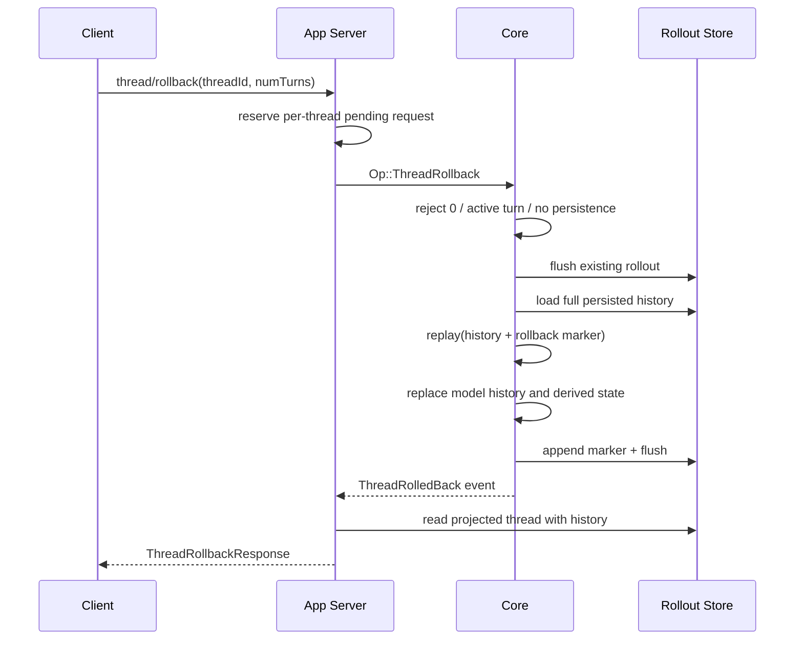

# Thread Fork、Rollback 与 Replay：历史分支不是副作用回滚

本文研究 Codex 如何从 append-only rollout 重建有效会话历史，以及 fork 和已废弃 rollback API 如何在不改写原始日志的情况下形成新的历史视图。

源码事实基于：

- Codex：`/Users/lihaoran/Desktop/codex`，`main@ab6a7eb87cc8a816c88b86c44cf291e251ed2136`
- 当前项目：`/Users/lihaoran/Desktop/agent`，研究起点 `master@5f2ad11f2c65425e84392e81048364d55ec626ef`

## 1. 最重要的边界

Codex 的 Thread rollback 只回退模型历史，不会撤销 Agent 已经写入的文件、执行的命令、发出的网络请求或其他外部副作用。协议注释明确把本地文件恢复责任交给客户端。

```text
history rollback != filesystem rollback != external side-effect compensation
```

这也是理解 Agent“撤销”功能时最容易犯的错误：删掉聊天记录不能让世界回到过去。

## 2. 三种不同操作

| 操作 | Thread identity | 原 rollout | 有效历史 | 外部副作用 |
| --- | --- | --- | --- | --- |
| Resume | 保持 | 不改写 | 从原日志恢复 | 不撤销 |
| Fork | 新 Thread ID | 原文件不变，新 Thread 物化自己的 rollout | 复制全部或指定 terminal Turn 前缀 | 不复制世界快照，也不撤销 |
| Rollback | 保持 | append `ThreadRolledBack` marker | replay 时忽略最近 N 个 instruction turns | 不撤销 |

Fork 是建立新时间线；rollback 是在同一日志上追加一个“有效视图缩短”事件；二者都不是删除事实。

## 3. Rollback 的真实执行顺序



Core 在允许 rollback 前检查：

- `num_turns >= 1`。
- 当前没有 active turn。
- Thread 已有可持久化的 live rollout。
- 旧日志 flush 和完整历史加载成功。

App Server 还用 `pending_rollbacks: Option<ConnectionRequestId>` 保证同一 Thread 同时只有一个 rollback RPC。成功或明确的 `ThreadRollbackFailed` 会释放 slot。

## 4. Append-only marker 的优点

Rollback 不截断 JSONL，也不覆盖旧消息，而是追加：

```ts
type ThreadRolledBack = {
  type: "thread_rolled_back";
  numTurns: number;
};
```

这种设计保留了：

- 原始发生事实。
- rollback 本身的操作事实。
- 多次 rollback 的顺序。
- resume、fork 和 thread projection 使用同一 replay 语义的可能。

核心测试验证两个连续 rollback marker 在冷恢复后会累积生效；rollback 数量超过现存 user turns 时采用饱和语义，保留首个真实 turn 之前的 session prefix。

它不提供隐私删除：被回退的 prompt 和结果仍在原始 rollout 中。若产品提供“删除敏感内容”，必须另设物理擦除、密钥销毁或保留策略，不能复用 rollback。

## 5. Replay 不是简单 `array.slice()`

有效历史同时包含：

- user / assistant / tool ResponseItems。
- TurnStarted、TurnComplete、TurnAborted。
- TurnContext 与 previous turn settings。
- compaction replacement history。
- reference context baseline。
- world state 与 context window metadata。
- inter-agent instruction boundaries。
- rollback markers。

`reconstruct_history_from_rollout()` 从新到旧扫描，遇到 rollback marker 就增加 `pending_rollback_turns`；随后每完成一个真正的 instruction-turn segment，才消耗一个待回退计数。没有真实 UserMessage 的 standalone task 不应误吃掉 rollback 名额。

它还同步恢复：

- 最新存活 Turn 的 model / comp hash / realtime settings。
- reference context 是从哪个 Turn 建立、是否被 compaction 清除。
- 最新存活 replacement-history checkpoint。
- world-state replay 片段。
- context window number 和 UUID 链。

这说明“恢复历史”至少有两层：

```text
visible/model messages
derived execution baseline used by the next turn
```

只截消息而不重算后者，会让下一 Turn 用已经被回退的模型配置、上下文 diff baseline 或 world state。

## 6. Instruction turn 不是所有 user-role 文本

Codex 的 rollback boundary 包含普通用户 prompt，也包含结构化 inter-agent instruction。紧邻被删 Turn 之前的 contextual developer/user messages 也会被一并裁掉；否则下一次模型调用可能看到没有对应用户 Turn 的环境差异片段。

一个细节很值得学习：如果被裁掉的是混合了持久 developer text 和 contextual fragment 的 initial-context bundle，代码会清除 `reference_context_item`。下一 Turn 必须完整重注入环境，而不是对陈旧 baseline 继续做 diff。

这是典型的安全降级：

```text
无法证明增量基线仍成立 -> 丢弃基线 -> 回退到完整重建
```

## 7. Rollback 的提交顺序存在 durable gap

Core 目前先把 `history + marker` 应用到内存，再把 marker 放入 rollout writer 并 flush。若 flush 失败：

- 内存 Thread 已经回退。
- Core 发 Warning，说明后台会继续重试。
- `ThreadRolledBack` 成功事件仍会交付。
- 进程若在重试成功前退出，冷恢复可能重新出现被回退 Turn。

这是一种 memory-commit-before-durable-commit。它优化了可用性，却让成功回执不代表 durable success。

App Server 收到成功事件后还会重新读 StoredThread 来构造响应。若持久层尚未包含 marker，响应投影与 Core 内存状态也可能短暂分叉。更稳的协议应把状态拆开：

```ts
type HistoryRewriteStatus =
  | { state: "applied-in-memory"; operationId: string }
  | { state: "durable"; operationId: string; revision: number }
  | { state: "persist-failed"; operationId: string; retrying: boolean };
```

客户端若要显示“已永久回退”，必须等 durable receipt。

## 8. Count-based rollback 缺少目标 CAS

TUI 根据当前 transcript 中 user message 数量计算 `numTurns`。它会：

- 保存发起时的 Thread ID。
- 阻止同一个 UI 再发 rollback。
- 等 Core 成功后才裁本地 transcript。
- Thread 已切换时忽略旧成功事件。

这些 guard 能防 thread-level ABA，却没有绑定“我想回到哪个 Turn”。如果另一个客户端在用户选择后、请求执行前完成了新 Turn，`numTurns = 2` 可能删除与预览时不同的尾部。

更可靠的请求应携带预期尾部和目标 boundary：

```ts
type RewindRequest = {
  threadId: string;
  expectedRevision: number;
  expectedTailTurnId: string;
  rewindBeforeTurnId: string;
  idempotencyKey: string;
};
```

服务端只有在 revision/tail 都匹配时提交 marker，否则返回 conflict 并让客户端刷新预览。

`thread/rollback` 已在 App Server 协议中标记 deprecated；非 `codex-tui` 客户端会收到 deprecation notice，TUI 因仍把它作为内部 backtrack 实现而暂时不显示。这个迁移状态本身也说明 count-based rewrite 不适合作为长期公开协议。

## 9. Backtrack UI 的两阶段提交

TUI 的 backtrack 实现有一个值得保留的原则：预览与事实提交分开。

1. 用户在 transcript overlay 中选择历史 user message。
2. UI 可立即把原 prompt、text elements 和图片恢复到 composer，作为编辑便利。
3. UI 记录 `pending_rollback { selection, thread_id }`。
4. Core 未确认前，不裁 committed transcript。
5. 成功且仍是同一 Thread，才真正 trim cells、清 token/rate-limit pending projection、修正 copy history 和 overlay。
6. 失败时清 pending guard，但 composer prefill 可保留，方便重试。

这避免了“UI 先假装回退，服务端失败后两边分叉”。即时 composer prefill 也被明确标注为 UX convenience，不代表 Core 已接受。

仍需注意：UI 恢复的本地图片路径可能已被删除或内容已经变化；它恢复的是引用，不是不可变附件快照。

## 10. Fork 的协议能力

`thread/fork` 支持：

- 以 `threadId` 读取 source；实验性入口也可直接给 rollout path，非空 path 会忽略 threadId。
- `lastTurnId`：只复制到指定 terminal Turn，包含该 Turn。
- model、provider、service tier、cwd、workspace roots、approval、sandbox/permissions、base/developer instructions 等覆盖。
- persistent 或 `ephemeral` fork。
- `excludeTurns`：响应不展开完整 turns。
- thread source 分类与 lineage。

所以 fork 不是“完全克隆”：

```text
copied history + newly resolved config + optional overrides + fresh identity
```

配置通过当前 `ConfigManager.load_for_cwd()` 重新求值，使用 source history cwd 和本次 overrides。fork 时配置层、requirements 或全局默认若已变化，新 Thread 的 authority 可能不同于 source 当时实际使用的 authority。

这既是能力也是风险：需要把“继承历史”和“继承权限”分开审计。

## 11. `lastTurnId` 是比 `numTurns` 更好的边界

fork prefix 使用 `truncate_rollout_after_turn_id()`，它要求：

- Turn ID 存在于有效 post-rollback history。
- 原 rollout 中存在真实 `TurnStarted` boundary，拒绝 projection 临时合成的 ID。
- 目标 Turn 不是 InProgress。
- 截断发生在下一个 `TurnStarted` 之前，因此保留目标 Turn 的完整 terminal segment。

这是更稳定的资源寻址：客户端选的是持久化实体 ID，不是一个会随并发变化的相对数量。

不过 request 仍没有 source rollout revision/hash。相同 Turn ID 对应的 prefix 通常稳定，但若底层文件被外部改写，协议没有 immutable content digest 可证明读取的是原版本。

## 12. Mid-turn fork 的显式 interrupted boundary

Fork 使用 `ForkSnapshot::Interrupted`。若 source snapshot 结束在一个未完成 Turn 中，forked history 会追加与实时 interrupt 同形的 `TurnAborted(reason = Interrupted)` boundary，而不会把半截 Turn 伪装成 completed，也不会修改 source Thread。

这是优质恢复语义：

```text
partial evidence + explicit terminal marker
```

比直接丢掉半截 history 或假装成功更有利于 replay、UI 和审计保持一致。

## 13. Persistent 与 Ephemeral fork

| 属性 | Persistent | Ephemeral |
| --- | --- | --- |
| 新 rollout path | 有，立即物化 | 无 |
| thread/list | 可见 | 不列出 |
| 进程重启恢复 | 可以 | 不保证 |
| response turns | 默认可展开 | 从复制 history 现场投影 |

source rollout 不会因 fork 被修改，测试会逐字比较 fork 前后原文件内容。

Persistent fork 的 lineage 通过 `forked_from_id` 记录。Thread name 若 source 有显式名字会单独复制到 metadata；这不是从 preview 猜出的新名字。

## 14. Response 与 Notification 的负载分工

Fork response 可以携带完整 copied turns；随后 `thread/started` notification 故意把 turns 清空，避免把同一大历史再次广播。`excludeTurns = true` 会让 response 也省略 turns，并跳过 restored token usage notification。

这是很好的 projection 设计：

- 创建者通过 response 得到它请求的详细结果。
- 其他订阅者通过 notification 得到新 Thread identity/metadata。
- 大历史按需用 turns/list 拉取。

但 `excludeTurns` 只是 wire/read projection 的便宜路径，不代表 source history 没有被完整读取、复制和用于 fork materialization；不能把它当成端到端 O(1) fork。

## 15. Path-based fork 的 authority 边界

实验性的 `path` 输入会：

- 相对路径以 `CODEX_HOME` 解析。
- 要求目标是存在的 rollout 文件。
- canonicalize symlink 后读取。
- 从文件内容解析 Thread ID 和 history。

普通 read-by-path 路径没有调用 archive/delete 所使用的 `scoped_rollout_path()` containment helper，因此绝对路径可以指向 `CODEX_HOME` 之外的可解析 rollout。它不是任意文本读取接口，但仍扩大了“谁能指定本机持久化会话来源”的 authority。

公开服务端不应接受宿主文件路径作为资源 identity。更安全的是 opaque artifact/thread ID，由服务端在租户范围内解析。

## 16. Fork 与 world state 的根本错位

Fork 复制历史，却不复制 source Turn 当时的文件系统、Git 工作树、远端服务或进程状态。新 Thread 可能：

- 在旧 prompt 历史上观察到当前新文件。
- 继续引用已经不存在的临时路径。
- 重复一个原时间线已提交的非幂等工具操作。
- 继承不同的 cwd、permissions 或 tool catalog generation。

所以 forked history 只能表述“模型曾看过什么”，不能证明“世界仍与当时一致”。如果未来做可恢复业务 Agent，fork point 需要同时绑定 world snapshot/version：

```ts
type ForkPoint = {
  sourceRunId: string;
  terminalStepId: string;
  eventRevision: number;
  businessStateVersion: string;
  toolRegistryGeneration: string;
};
```

没有可复制 world state 时，至少应把 fork 标成 simulation/analysis，禁止自动重放写工具。

## 17. 当前实现中值得学习的设计

1. **append-only rollback marker**：不破坏原始审计历史。
2. **先 flush 再 replay**：基于持久事实而非任意内存片段重建。
3. **replay 同步派生状态**：history、settings、reference context、world state、window metadata 一起恢复。
4. **真实 instruction boundary**：standalone task 不误算为用户 Turn。
5. **不可在 active Turn 中 rollback**：避免与正在追加的历史竞争。
6. **App Server per-thread pending slot**：并发 rewrite 串行化。
7. **TUI confirmation-before-trim**：UI 不领先于 Core 事实。
8. **TUI stale Thread guard**：切换 Thread 后忽略旧成功。
9. **fork source 不变**：测试验证原 rollout byte-for-byte 未修改。
10. **canonical terminal Turn ID**：prefix fork 拒绝临时合成和 in-progress boundary。
11. **mid-turn fork 显式 interrupted**：不把半完成状态伪装成功。
12. **response/notification 负载分层**：避免大 history 重复广播。

## 18. 需要继续收紧的边界

| 边界 | 当前风险 | 更稳方向 |
| --- | --- | --- |
| rollback target | 相对 count，可并发漂移 | expected revision + exact Turn ID |
| rollback durability | 内存先提交，flush 失败仍成功 | durable receipt 或明确 pending |
| external effects | 完全不撤销 | compensation plan / checkpoint |
| privacy | marker 不删除原文 | 独立 erasure 语义 |
| fork config | 用当前层重新求值 | 记录 source config hash 与 authority diff |
| fork world state | 只复制 history | world version/snapshot 或 write-tool quarantine |
| path source | 本机绝对路径可指定 | opaque tenant-scoped identity |
| fork revision | 无 source content hash | event revision / rollout digest |
| `excludeTurns` | 名称容易被理解为不复制 history | 明确叫 `omitTurnsFromResponse` |
| response projection | command 等交互本就有损 | 暴露 projection completeness |

## 19. 对当前 AI SEO Agent 的迁移结论

当前阶段不应实现通用 event-sourcing、fork 或 rollback 框架。但后续做 Agent Run 恢复时应先守住四点：

### 19.1 重试、续跑、分支、撤销是四种操作

- retry：同一 operation 再尝试。
- resume：从 durable checkpoint 继续。
- fork：从历史点创建新 identity。
- undo：对已提交副作用执行补偿。

不能都叫“重新运行”。

### 19.2 数据库回退不等于业务回退

SEO Agent 若已创建任务、抓取页面、写入内容或调用发布 API，仅删除 `AgentStep` 不能撤销这些事实。每个写工具要定义是否可逆、如何补偿、如何查询提交状态。

### 19.3 使用 exact ID 和 revision

不要设计 `rollbackLastN: 2` 作为长期公开 API。优先 `rewindToStepId + expectedRunVersion`。

### 19.4 投影要说明完整度

UI transcript、model history、runtime event 和 durable business fact 的保留范围不同。恢复响应不能因为只显示消息就宣称“完整恢复了 Run”。

## 20. TypeScript 状态机示例

```ts
type RewriteCommand = {
  operationId: string;
  runId: string;
  expectedVersion: number;
  targetStepId: string;
};

type RewriteResult =
  | { kind: "committed"; newVersion: number; markerEventId: string }
  | { kind: "conflict"; actualVersion: number; actualTailStepId: string }
  | { kind: "rejected"; reason: "active-run" | "unknown-step" }
  | { kind: "pending-durability"; retryAfterMs: number };

function assertRewriteTarget(
  command: RewriteCommand,
  state: { version: number; terminalStepIds: ReadonlySet<string>; active: boolean },
): void {
  if (state.active) throw new Error("cannot rewrite an active run");
  if (command.expectedVersion !== state.version) throw new Error("version conflict");
  if (!state.terminalStepIds.has(command.targetStepId)) {
    throw new Error("target must be a persisted terminal step");
  }
}
```

这个例子仍只处理 history rewrite；外部副作用要由单独的 compensation workflow 管理。

## 21. 建议验证矩阵

| 场景 | 应验证的不变量 |
| --- | --- |
| rollback 0 Turn | 无状态变化，明确 invalid request |
| active Turn rollback | 不插 marker，不裁历史 |
| rollback 数量超出 | 饱和到首个 instruction Turn，保留 session prefix |
| 连续 rollback | 冷恢复后累计生效 |
| compaction 后 rollback | replacement history、reference baseline 与 window 一致 |
| marker flush 失败 | 不把 durable success 误报给客户端 |
| 两客户端并发回退 | exact target/CAS 冲突，不误删新 Turn |
| rollback 后重启 | 内存和持久投影一致 |
| rollback 后检查文件 | 明确证明文件副作用未自动恢复 |
| fork source mid-turn | child 带 interrupted terminal boundary |
| fork at in-progress ID | 拒绝 |
| fork at synthetic ID | 拒绝 |
| fork at terminal ID | 只含完整 prefix，source byte 不变 |
| fork with config drift | 暴露 authority/config diff |
| ephemeral fork | 无 path、不列出、重启不可恢复 |
| path 指向 scope 外 rollout | 按公开 threat model 拒绝或显式授权 |
| exclude turns | 只改变响应投影，不误称未复制 history |

## 22. 源码阅读入口

| 路径 | 关注点 |
| --- | --- |
| `codex-rs/app-server-protocol/src/protocol/v2/thread.rs` | fork/rollback wire contract 与 deprecated 注释 |
| `codex-rs/core/src/session/handlers.rs` | rollback 校验、replay、marker 持久化顺序 |
| `codex-rs/core/src/session/rollout_reconstruction.rs` | reverse replay、compaction 与派生状态恢复 |
| `codex-rs/core/src/context_manager/history.rs` | instruction-turn 截断和 baseline 失效 |
| `codex-rs/core/src/thread_rollout_truncation.rs` | rollback-aware user/fork boundary、lastTurnId prefix |
| `codex-rs/core/src/thread_manager.rs` | ForkSnapshot、lineage、mid-turn interrupted marker |
| `codex-rs/app-server/src/request_processors/thread_processor.rs` | pending rollback、fork config/response/notification 顺序 |
| `codex-rs/app-server/src/bespoke_event_handling.rs` | rollback terminal event 到 RPC response |
| `codex-rs/thread-store/src/local/read_thread.rs` | path source 解析与 canonicalization |
| `codex-rs/tui/src/app_backtrack.rs` | backtrack UI 两阶段提交与 transcript 修复 |
| `codex-rs/core/src/session/tests.rs` | rollback settings/reference/compaction/cumulative marker 测试 |
| `codex-rs/app-server/tests/suite/v2/thread_rollback.rs` | RPC、resume 与 deprecation 行为 |
| `codex-rs/app-server/tests/suite/v2/thread_fork.rs` | source 不变、terminal prefix、ephemeral 与负载顺序 |

## 23. 一句话结论

Codex 的 append-only marker、replay 重建和 terminal-ID fork 展示了“历史视图如何可恢复地分支”；同时它也清楚暴露了 Agent 撤销的底线：历史可以重写投影，已经发生的世界副作用只能靠版本校验、补偿动作和 durable receipt 管理。
