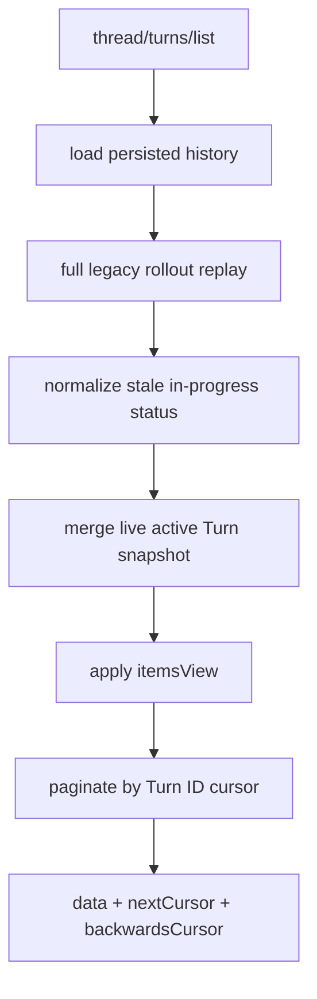

# Thread History Pagination：有界传输不等于有界重放

本文研究 Codex App Server 如何把 rollout 投影为 Thread / Turn / Item 分页结果，重点区分网络分页、存储分页、实时 active turn 合并和历史完整度。

源码事实基于：

- Codex：`/Users/lihaoran/Desktop/codex`，`main@ab6a7eb87cc8a816c88b86c44cf291e251ed2136`
- 当前项目：`/Users/lihaoran/Desktop/agent`，研究起点 `master@5f2ad11f2c65425e84392e81048364d55ec626ef`

## 1. 四个名字相近但不同的层

| 层 | 主要对象 | 当前职责 |
| --- | --- | --- |
| Rollout record | `RolloutLine / RolloutItem` | append-only 持久事实与恢复材料 |
| Thread history builder | `ThreadHistoryBuilder` | 从 rollout 归并 Turn 和可显示 Item |
| Turn page | `thread/turns/list` | 对已重建 Turn 做 25/100 条网络分页 |
| Item page | `thread/items/list` | 面向 projected store 的 item 级分页接口，目前本地 store 未实现 |

最重要的结论是：当前 `thread/turns/list` 只是 wire pagination。它每次请求仍加载并 replay 整份 legacy rollout，再对内存 Turn 数组切页。

```text
bounded response size != bounded server work
```

## 2. Turn list 调用链



源码注释直接说明，rollback 和 compaction 会改变较早 Turn，所以在 Turn metadata 尚未独立索引前，每页都要重建完整 Turn list。

## 3. 三种 Items View 是投影完整度

| `itemsView` | 返回内容 | 适合场景 |
| --- | --- | --- |
| `NotLoaded` | 空 items，但保留 Turn ID、status、timing、error | 时间线骨架、虚拟列表 |
| `Summary` | 第一个 UserMessage + 最后一个 AgentMessage | 会话列表和快速预览 |
| `Full` | 持久历史能投影出的全部 ThreadItems | 展开某个 Turn |

默认是 `Summary`，默认页长 25，最大 100。

`Summary` 的实现不是字符串截断，而是语义选取：找到第一个 UserMessage 和最后一个 AgentMessage；若两者 ID 不同则都保留。测试验证一个 Turn 中存在 `draft` 和 `final` 两条 AgentMessage 时，Summary 只返回 `final`。

这是优质设计，因为客户端无需通过位置猜测“最终回答”。但它仍只是 display summary，不应拿来恢复模型 history 或证明工具执行过程。

## 4. `Full` 也不是完整运行记录

协议注释谨慎地写的是“every ThreadItem available from persisted app-server history”。Rollout persistence policy 会丢弃大量 transient 事件，例如：

- command output delta、terminal interaction。
- approval request、request-user-input pending 状态。
- warning、stream error、MCP startup。
- exec command begin/end 的部分 legacy 事件。
- view image 和许多实时状态。

测试还明确断言 shell command 不会出现在 thread/read、resume、fork 和 turns/list 的持久历史投影中。

因此应把完整度写成：

```ts
type ProjectionCompleteness =
  | "timeline-only"
  | "display-summary"
  | "persisted-items";
```

不要把 `Full` 翻译成“完整执行审计”。

## 5. 双向 cursor 的语义

Turn cursor 当前是一个 JSON 字符串：

```ts
type ThreadTurnsCursor = {
  turnId: string;
  includeAnchor: boolean;
};
```

### 向历史更深处翻页

`nextCursor` 绑定当前页最后一个 Turn，并设置 `includeAnchor = false`，下一页从它之后继续，避免重复。

### 反向刷新新内容

`backwardsCursor` 绑定当前页第一个 Turn，并设置 `includeAnchor = true`。客户端把排序方向反过来请求时，会重新包含 anchor，从而捕获这个 Turn 本身在两次请求之间的状态或 item 更新，再继续拿更新的 Turn。

测试覆盖了：

1. Desc 获取 `third, second`。
2. `nextCursor` 继续得到 `first`。
3. 追加 `fourth`。
4. 用首个页面的 backwards cursor + Asc 得到 `third, fourth`。

这比单纯 offset pagination 更适合追加式时间线。

## 6. Cursor 不是 snapshot token

Cursor 不携带：

- Thread ID。
- sort direction。
- items view。
- history revision / rollout digest。
- contract version 或过期时间。

当 rollback 删除 anchor Turn 时，服务端会明确返回 `invalid cursor: anchor turn is no longer present`，这是好的 fail-closed 语义。但在不删除 anchor 的 compaction、item 更新或并发追加下，多页结果仍不是同一快照。

协议称 cursor opaque，实际却是客户端可读写 JSON；`includeAnchor` 可被自行篡改。它不是安全凭证，但若服务端希望提供稳定查询，应封装并绑定 query shape：

```ts
type StableCursorPayload = {
  threadId: string;
  anchorTurnId: string;
  direction: "asc" | "desc";
  includeAnchor: boolean;
  snapshotRevision: number;
  schemaVersion: 1;
};
```

当前 parse error 还会把原始 cursor 全量回显到错误文本，入口没有 cursor 专用长度上限；超长输入可能放大错误响应和日志。

## 7. Active Turn 是第二数据源

Persisted history 可能尚未包含当前运行 Turn。App Server 因此：

1. 从 ThreadStore 加载持久 history。
2. 查询 ThreadManager 中该 Thread 是否 running。
3. 从 ThreadState 获取 `active_turn_snapshot()`。
4. 先重建 persisted turns，再按 ID 删除旧版本并把 active Turn 放到尾部。

这是正确的 product projection：客户端翻页时仍能看到正在运行的 Turn，而无需等 flush。

但这些读取不是同一个 generation snapshot。可能发生：

- history 读取后，active Turn 已完成并从 ThreadState 清除，但 terminal 记录尚未持久化。
- agent status 与 active snapshot 在两次 await 之间变化。
- persisted 版本和 active snapshot 的 item 集合来自不同时间点。

当 Thread 不再 active 时，projection 会把遗留的 `InProgress` Turn 规范化为 `Interrupted`。在完成事件与持久化短暂错位时，这可能造成瞬时误判。

更稳的读取结果应返回 `projectionRevision` 和 source watermarks：

```ts
type TurnPageEvidence = {
  persistedOrdinal: number;
  liveGeneration: number;
  capturedAt: string;
  snapshotConsistent: boolean;
};
```

## 8. Replay projection 与 Core rollback 语义可能分叉

Core history reconstruction 把 rollback 定义为“删除最近 N 个真正 instruction turns”，没有 UserMessage 的 standalone task 不消耗计数。

App Server 的 `ThreadHistoryBuilder::handle_thread_rollback()` 当前却先 `finish_current_turn()`，再直接截掉最后 N 个 projected Turn。Builder 会保留没有可显示 items 但带 compaction marker 的 standalone Turn。

因此在以下序列中存在需要测试确认的语义风险：

```text
user Turn A
standalone compaction Turn
rollback(1)
```

Core model history 应删除 A；App Server projection 可能只删除 compaction Turn，仍显示 A。这里不是简单 UI bug，而是两个 replay reducer 对同一 marker 的 boundary 定义不同。

成熟 event-sourced 系统必须共享同一个 boundary classifier，或至少用同一组 golden fixtures 验证所有投影。

## 9. Legacy 与 Paginated 是两套持久契约

`ThreadHistoryMode` 有 `Legacy` 与 `Paginated`：

### Legacy

- 持久化 ResponseItems 和选定 legacy events。
- `thread/read(includeTurns)`、resume、fork、rollback、`thread/turns/list` 通过全量 replay 工作。
- 每个 Turn 页面都在 App Server 内存中切分。

### Paginated

- 每条 rollout record 带单调 `ordinal`。
- `ItemCompleted` 对应的 TurnItem 也会持久化。
- 设计目标是由 store 投影 Turn / Item 分页，避免读全 history。

但当前快照仍处于未接通状态：

- ThreadStore trait 已有 `list_turns()` 和 `list_items()` port。
- App Server `thread/turns/list` 没有调用 store `list_turns()`，仍走 legacy replay。
- LocalThreadStore 没有实现 `list_turns/list_items`。
- paginated Thread 可以被 list/read metadata 发现，但 includeTurns、resume 和 turns/list 都返回 unsupported。
- `thread/items/list` 在本地 store 明确返回 `-32601 method not found`。

这是一条正在建设的架构缝，不是可直接迁移的完成方案。

## 10. Ordinal 提供顺序，但不自动提供事务

Paginated rollout 为每条 record 分配 u64 ordinal：

- 新文件从 0 开始。
- 每次 append 后 `checked_add(1)`。
- 恢复 writer 时反向扫描最后一条可解析 record，使用 `last + 1`。
- 最后一条 paginated record 缺 ordinal 会拒绝恢复。
- u64 overflow 会让后续持久化失败。

Ordinal 是稳定分页和 materialized item key 的基础，但它只解决单日志内顺序：

- 不等于 Turn revision。
- 不证明 SQLite projection 已追上 JSONL。
- 不绑定 active in-memory generation。
- 不自动处理同一 item 的 upsert、rollback removal 或 compaction replacement。

需要 projection checkpoint：`projectedThroughOrdinal`。

## 11. `thread/items/list` 的理想边界与当前缺口

接口已经定义：

- 可选 `turnId` 过滤。
- 默认 Asc。
- 25/100 item page limit。
- item store 返回 `item_key`、`item_ordinal`、`item_created_at_ms` 和 materialized JSON。
- App Server 将 materialized JSON 再反序列化为 typed `ThreadItem`。

这使 store 可以把 rollout append 增量投影为可查询 item，而不是每页重放。

当前边界仍需处理：

- materialized JSON schema version 与迁移。
- item update 与 removal 的版本语义。
- rollback/compaction 后 cursor 是否失效。
- live active items 如何与 durable page 合并。
- corrupted 单条 JSON 是否应让整页失败；当前实现会整页失败。
- item body、总 page bytes 和反序列化深度预算。

## 12. Resume bootstrap 的好设计

`thread/resume` 可以同时指定：

- `excludeTurns = true`：主 Thread 对象不展开完整 turns。
- `initialTurnsPage { limit, sortDirection, itemsView }`：在同一 response 中附带一页 turns/list 结果。

测试验证 initial page 与单独调用 `thread/turns/list` 的等价结果。这能减少一次网络往返，又避免历史在 `thread.turns` 与 page 中重复传输。

如果 Thread 正在运行，resume lifecycle 还会把 listener 维护的 active snapshot 合入 initial page。

需要注意：当前 initial page 仍依赖已加载的完整 legacy history；它优化的是 wire bootstrap，不是 store read cost。

## 13. 未物化与 Ephemeral 的显式拒绝

Fresh Thread 在第一条用户消息前 rollout 文件可能尚未创建。`thread/turns/list` 不返回空页，而是明确报：在 first user message 前不可用。

Ephemeral Thread 即使当前进程内存在，也明确不支持 turns/list。

这种行为避免客户端把“尚无 durable source”误判为“durable empty history”，但错误类型仍是字符串映射。更稳定的协议可提供：

```ts
type HistoryAvailability =
  | { kind: "available"; durableThrough: number }
  | { kind: "not-materialized" }
  | { kind: "ephemeral" }
  | { kind: "unsupported-mode"; mode: string };
```

## 14. 成本模型

设 rollout 有 `R` 条记录、投影后 `T` 个 Turn、客户端读取 `P` 页：

```text
当前 legacy turns/list 服务端工作量约为 O(P × (R + T))
wire 量约为 O(P × pageSize)
```

limit clamp 只保护 wire page，不保护：

- 每次完整文件读取。
- JSONL parse 数量。
- ThreadHistoryBuilder 内存。
- itemsView 在分页前对所有 Turn 做 clone/clear 的成本。
- cursor 查找的线性扫描。

更合理的目标是：

```text
append -> incremental projection
query -> indexed seek + pageSize
repair -> explicit backfill/reconciliation
```

## 15. 当前实现中值得学习的设计

1. **Turn 与 Item 分页协议分开**：列表骨架和详情读取不是一个负载。
2. **三档 itemsView**：明确表达 projection completeness。
3. **Summary 语义选取**：首 user + 末 assistant，而非随意截断。
4. **双向 anchor cursor**：反向时包含 anchor，能捕获 anchor 更新。
5. **anchor 消失明确拒绝**：rollback 后不悄悄跳页。
6. **active snapshot merge**：持久历史与 live UI 状态分层。
7. **stale in-progress normalization**：无 live Thread 时不永久显示 running。
8. **resume initial page**：减少往返且避免重复传完整 turns。
9. **response page size clamp**：默认 25、最大 100。
10. **paginated ordinal fail-closed**：缺 ordinal 或 overflow 不继续伪造顺序。

## 16. 需要继续收紧的边界

| 边界 | 当前事实 | 建议 |
| --- | --- | --- |
| 服务端成本 | 每页全量 replay | store-native list_turns |
| Cursor | 不绑 thread/query/revision | versioned snapshot cursor |
| Cursor budget | 无专用长度 cap，错误回显 | 输入 cap + opaque error |
| Live merge | persisted/status/active 非同代 | dual watermark/generation |
| Rollback reducer | Core 与 App projection boundary 可能不同 | 共享 classifier + golden tests |
| `Full` 命名 | 仅 persisted available items | 暴露 completeness，不称 audit-full |
| Paginated mode | metadata 可见但 resume/list 未接通 | feature gate 到端到端可用 |
| Items JSON | 单条损坏整页失败 | corruption evidence + partial policy |
| Page bytes | 只限制条数 | 总 serialized bytes cap |
| Ephemeral | 当前内存也不可 page | 明确产品语义或专用 live endpoint |

## 17. 对当前 AI SEO Agent 的迁移结论

当前项目不需要马上实现分页历史或 event projection。等 Agent Run / Step 数量真正增长时，应先明确：

### 17.1 列表投影和恢复事实分开

前端 Run timeline 可只读 summary projection；恢复 runner 必须读 durable execution facts，不能从 UI 列表拼回模型 history。

### 17.2 Cursor 绑定租户、查询和 revision

服务端 cursor 至少绑定 user/tenant、conversation、sort、filter 和 snapshot revision，避免跨查询误用。

### 17.3 分页要保护服务器，不只保护网络

如果每一页都 `SELECT *` 再 slice，仍不是真分页。数据库应使用 `(createdAt, id)` 或 monotonic ordinal 做 keyset pagination。

### 17.4 显式显示数据完整度

`summary`、`persisted`、`live-merged`、`audit` 不能混成一个 `steps` 字段。缺失工具输出时应说明 projection 是有损的。

## 18. TypeScript cursor 示例

```ts
type RunStepCursor = {
  version: 1;
  tenantId: string;
  runId: string;
  snapshotVersion: number;
  direction: "asc" | "desc";
  anchor: { ordinal: number; stepId: string };
  includeAnchor: boolean;
};

type StepPage<T> = {
  data: T[];
  completeness: "summary" | "persisted";
  snapshotVersion: number;
  nextCursor: string | null;
  backwardsCursor: string | null;
};
```

编码后的 cursor 仍需签名或服务端 opaque storage，且先做 decoded bytes/depth 上限再解析。

## 19. 建议验证矩阵

| 场景 | 应验证的不变量 |
| --- | --- |
| 1、25、100、101 条 limit | clamp 与 cursor 连续性 |
| Desc 后用 nextCursor | 无重复、无遗漏 |
| Desc 后反向 Asc | anchor 重含且能看到新 Turn |
| rollback 删除 anchor | 明确 stale cursor error |
| compaction-only Turn + rollback | Core history 与 App projection 一致 |
| active Turn 完成竞态 | 不瞬时误投影 Interrupted |
| persisted 与 active 同 ID | active snapshot 替换而非重复 |
| Summary 多 assistant | 只留 final assistant |
| NotLoaded | items 空但 metadata 不缩水 |
| Full | 明确证明 transient command output 不在其中 |
| 超长/畸形 cursor | 有界错误，不回显完整输入 |
| 单条 materialized item 损坏 | partial/error 策略可观测 |
| paginated Thread resume | feature 未完成时入口一致拒绝 |
| initialTurnsPage | 与独立 turns/list 同语义 |
| unmaterialized / ephemeral | typed availability，不伪装空历史 |
| 大 rollout 多页 | 服务端工作量随 pageSize 而非完整 history 增长 |

## 20. 源码阅读入口

| 路径 | 关注点 |
| --- | --- |
| `codex-rs/app-server-protocol/src/protocol/v2/thread.rs` | turns/items params、双 cursor 与 initial page |
| `codex-rs/app-server-protocol/src/protocol/v2/thread_data.rs` | Turn、itemsView、historyMode |
| `codex-rs/app-server/src/request_processors/thread_processor.rs` | 全量 replay、active merge、items view 与 cursor |
| `codex-rs/app-server/src/request_processors/thread_lifecycle.rs` | resume active snapshot 合并 |
| `codex-rs/app-server-protocol/src/protocol/thread_history.rs` | ThreadHistoryBuilder reducer |
| `codex-rs/rollout/src/policy.rs` | Legacy/Paginated 持久化差异与 transient 事件 |
| `codex-rs/rollout/src/ordinal.rs` | paginated ordinal 恢复与 overflow |
| `codex-rs/thread-store/src/store.rs` | storage-neutral list_turns/list_items ports |
| `codex-rs/thread-store/src/types.rs` | StoredTurn、StoredThreadItem 与 page evidence |
| `codex-rs/thread-store/src/error.rs` | paginated full-history 路径的显式拒绝 |
| `codex-rs/app-server/tests/suite/v2/thread_read.rs` | 双向分页、itemsView、anchor rollback 与迁移缺口 |
| `codex-rs/app-server/tests/suite/v2/thread_shell_command.rs` | “Full” 持久投影的有损边界 |

## 21. 一句话结论

Codex 已把 Turn/Item 负载、Summary/Full 投影和双向 cursor 设计得较清楚；真正尚未收口的是存储原生分页、live/durable 同代快照、所有 reducer 的统一 rollback 语义，以及“Full 只代表持久投影完整度”的明确产品契约。
