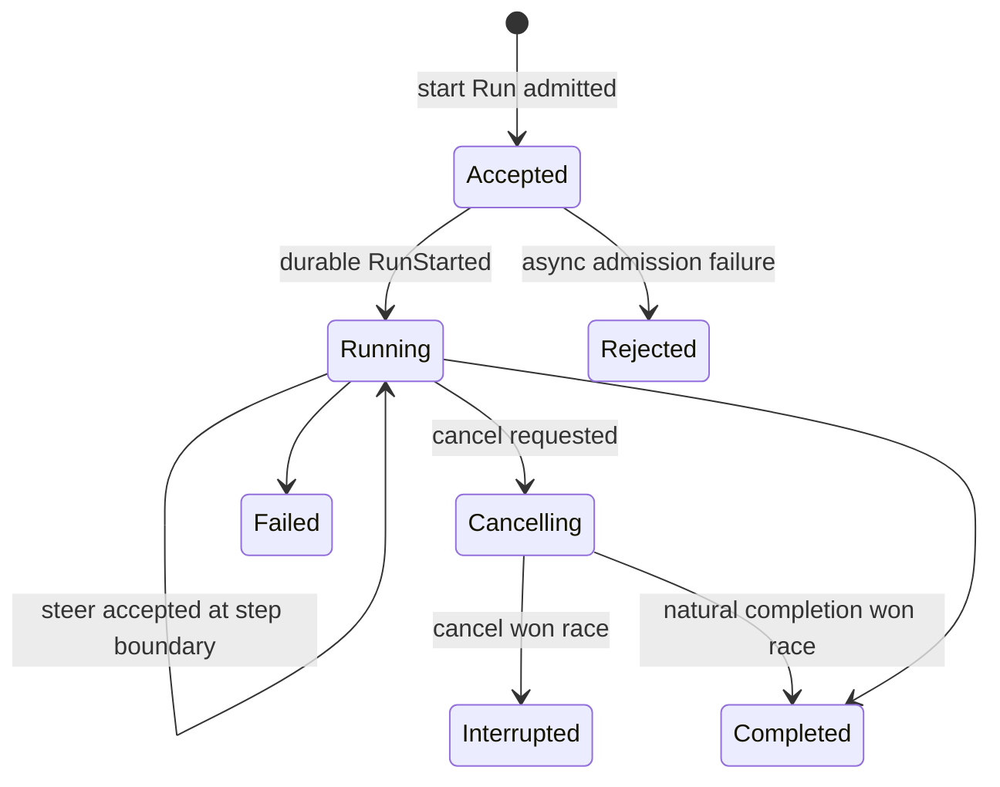

# Turn Input Admission：Start、Steer 与 Interrupt 不是三个独立按钮

本文研究 Codex App Server 的 `turn/start`、`turn/steer` 和 `turn/interrupt` 如何穿过 Core submission queue、ActiveTurn 与 pending input。重点是请求成功、Turn 身份、当前运行归属和取消结果之间的差异。

源码事实基于：

- Codex：`/Users/lihaoran/Desktop/codex`，`main@ab6a7eb87cc8a816c88b86c44cf291e251ed2136`
- 当前项目：`/Users/lihaoran/Desktop/agent`，研究起点 `master@5f2ad11f2c65425e84392e81048364d55ec626ef`

## 1. 三个 API 的表面契约

| 方法 | 关键参数 | 直接响应 |
| --- | --- | --- |
| `turn/start` | `threadId`、input、可选 settings/output schema | 一个 `InProgress + NotLoaded` Turn skeleton |
| `turn/steer` | input、必填 `expectedTurnId` | 实际 active `turnId` |
| `turn/interrupt` | `turnId`；空字符串另作 startup sentinel | `{}`，普通 Turn 延迟到 terminal event 才回复 |

客户端很容易把它们理解为“创建新 Turn / 给当前 Turn 追加消息 / 取消指定 Turn”。源码中的真实语义更紧密：Start 和 Steer 都可能汇入同一个 ActiveTurn input queue；Interrupt 的成功也不证明目标最终以 Interrupted 结束。

## 2. `turn/start` 先返回 submission ID

App Server 在完成同步校验后：

1. 生成 Core `Op::UserInput`。
2. 通过 bounded submission channel 入队。
3. 把 submission ID 当作 Turn ID 返回。
4. 构造一个本地 skeleton：`InProgress`、`NotLoaded`、无时间戳。

Core 真正处理该 submission 时，才会：

- 应用 sticky Thread settings。
- 创建 TurnContext。
- 启动 RegularTask。
- 发出 canonical `TurnStarted`。

因此 start response 是 admission/enqueue receipt，不是 execution-start receipt。`startedAt: null` 已经暗示这个边界，但 `status: InProgress` 容易让客户端误以为任务已经运行。

如果 Core 在异步阶段应用 setting 失败，会按该 ID发 Error event；先前的 RPC success 不会被撤回。

更准确的状态应是：

```ts
type StartAdmission = {
  turnId: string;
  status: "accepted";
};
```

只有 `turn/started` 才将它推进为 running。

## 3. 第二个 Start 可能变成第一个 Turn 的 Steer

Core handler 名叫 `user_input_or_turn_inner()`，因为 `Op::UserInput` 并不保证创建新 Turn：

1. 先为本次 submission 创建新的 TurnContext，并应用 Thread settings。
2. 调用 `Session::steer_input(..., expected_turn_id = None)`。
3. 若已有 active RegularTask，就把本次 user input 加入旧 Turn pending queue。
4. 只有返回 `NoActiveTurn` 时，才使用新 TurnContext spawn 新 RegularTask。

Core 测试明确覆盖：第一条 prompt 正在 streaming 时再次 `submit(Op::UserInput)`，第二条 prompt 会进入同一 Turn 的 follow-up model request。

这带来一个协议层身份风险：两个并发或快速连续的 `turn/start` 请求都先拿到不同 submission ID，但第二个 submission 在真正 dispatch 时可能被并入第一个 active Turn，不会以自己的 ID形成独立 Turn lifecycle。

```text
start A -> response turnId=A
start B -> response turnId=B

Core dispatch A -> ActiveTurn A
Core dispatch B -> pending input of A

model follow-up still belongs to A
```

对只消费 RPC response、不核对 `turn/started` 的客户端，B 会成为 orphan claim。

## 4. Start 的 setting override 与被并入 Turn 可以错位

`turn/start` 能携带 model、effort、cwd、workspace roots、permission、sandbox、environment、collaboration mode 和 output schema。Core 在尝试 steer 前已经把 sticky settings 应用到 Session，并创建了新的 TurnContext。

若本次 Start 被并入旧 active Turn：

- 新 user input 由旧 active `TurnContext` 的 model/permission/output schema 执行。
- 新 settings 已写入 Session configuration，影响未来真正创建的 Turn。
- 新建但未 spawn 的 TurnContext 不成为 active owner。
- `responsesapiClientMetadata` 会改写 active Turn metadata。
- `final_output_json_schema` 只在新 TurnContext 上，随后不参与旧 active Turn。

于是一个请求中的“输入”和“配置”可能落到不同 generation：输入进入当前 Turn，settings 留给未来 Turn。

对云端 Agent 更安全的规则是二选一：

1. `start` 在 active 时明确返回 conflict，客户端改用 steer。
2. `start` 被定义为 mailbox enqueue，并返回 `disposition: steered-active` 与实际 Turn ID，同时拒绝本次 Turn-only overrides。

不能让调用者以为新 model/output schema 已约束这条被 steer 的输入。

## 5. `turn/steer` 的 admission 更严格

App Server 要求 `expectedTurnId` 非空，Core 在持有 ActiveTurn lock 时原子检查：

- active task 必须存在。
- expected ID 必须等于 active task TurnContext ID。
- TaskKind 必须是 Regular。
- input 不能为空。

Review 和 Compact 会返回 typed non-steerable error。成功 response 也返回实际 active Turn ID。

这是一个很好的 generation precondition：客户端基于旧 UI 状态发出的 steer 不会静默进入已经切换的新 Turn。

但它仍不是 durable receipt。成功只表示 pending queue 已接收，不证明：

- 已记录进 rollout。
- 已进入下一次模型请求。
- Turn 未在随后立即 abort。

因此应该把 `acceptedTurnId` 看作 queue ownership proof，而不是 model consumption proof。

## 6. Pending input 在 Step 边界消费

Steer 会把 additional context 放在前、user input 放在后，然后追加到 `TurnState.pending_input`，同时发 `InputQueueActivity::Steer`。

RegularTask 的规则是：

- fresh Turn input 先完成第一次 sampling，不在开头抢先 drain steer。
- 每次 sampling 后检查 pending input；存在时强制 follow-up。
- auto-compaction 后若模型本身还需 continuation，会先恢复旧 continuation，再消费 steer。
- Task 即将结束时仍会检查 queue，避免末尾到达的输入丢失。

这种 step-boundary consumption 比直接修改正在构造的 request 安全，模型请求具有稳定 snapshot。但它意味着产品文案不应承诺“立刻打断当前生成并改答”。很多时候是当前 response 完成后，再发一个包含新输入的 follow-up request。

某些 sleep/wait 类工具会订阅 `InputQueueActivity` 并提前结束等待，这是工具自己的 cooperative interruption，不等于所有 sampling 和工具都可抢占。

## 7. `clientUserMessageId` 是展示关联，不是幂等键

该字段最终进入 `UserMessageItem.client_id`，让 UI 将 optimistic message 与 server item 对齐。测试验证它会出现在 user message item notification 中。

但当前路径没有：

- 非空校验。
- 长度/字符集限制。
- Thread 内唯一约束。
- 重复请求去重。
- body hash conflict。

客户端重试同一个 `clientUserMessageId` 仍可能产生两条 user input。应把它命名理解为 presentation correlation ID，而不是 operation/idempotency ID。

当前 SEO Agent 若需要防止表单重发或网络重试重复启动 Run，应另建 `operationId` 唯一约束，不能只复用 UI message ID。

## 8. 输入长度限制只覆盖文本字符

Start 和 Steer 都累计 `UserInput::Text.text.chars().count()`，超过 `MAX_USER_INPUT_TEXT_CHARS` 时返回结构化 error，包含 max 与 actual。这是很好的可操作错误契约。

但以下 variant 计数为 0：

- Image data URL。
- LocalImage path。
- Skill name/path。
- Mention name/path。

数组 item 数、JSON bytes、textElements 数量和 byte range 也没有在该方法的 admission 中形成统一总预算。remote HTTP(S) image 会被单独拒绝，但 inline image 仍需要图像处理层承担资源限制。

所以 `MAX_USER_INPUT_TEXT_CHARS` 是 text semantic budget，不是 request resource budget。

## 9. `textElements` 是 UI metadata，当前入口信任客户端

TextElement 声明的是 parent UTF-8 text 的 byte range。App Server 只是类型转换并保留这些范围，没有在 Turn admission 中验证：

- `start <= end`。
- end 不超过 text bytes。
- 两端是否落在 UTF-8 char boundary。
- ranges 是否重叠或数量超限。

TUI 渲染处会 clamp 部分范围，但其他客户端不一定如此。UI-only metadata 也需要 schema invariant；否则同一 persisted item 在不同 renderer 中会有不同降级甚至 panic 风险。

## 10. Direct input 只在入口拦截 V2 sub-agent

`turn/start` 与 `turn/steer` 都调用 `ensure_direct_input_allowed()`：Multi-agent V2 的 ThreadSpawn sub-agent 不允许 App Server 直接写输入，必须通过 root control plane / inter-agent communication。

这是好的 authority boundary：Thread ID 可见不等于可以绕过父 Agent 给 child 下指令。

需要注意这个 guard 只在特定 App Server 入口。Core 内部 `Op::UserInput`、history injection、realtime 或其他 bridge 是否允许写入，要分别审计；不能从一个 handler guard 推导全 runtime 都拥有同一权限策略。

## 11. Interrupt 有两种协议复用一个字符串

`turn/interrupt` 把空 `turnId` 解释为 startup interrupt：

- 不登记 pending Turn interrupt。
- 提交同一个 `Op::Interrupt`。
- submission 成功后立即响应。
- Core 若没有 active Turn，会取消 MCP startup。

非空 ID 则被解释为 active Turn interrupt，RPC response 延迟到 Turn terminal event。

空字符串 sentinel 保持 wire 简单，却把两种不同资源操作塞进同一 contract。更清晰的请求应是 discriminated union：

```ts
type InterruptTarget =
  | { kind: "startup"; startupGeneration: string }
  | { kind: "turn"; expectedTurnId: string };
```

这样不会把“缺少 ID”和“有意取消 startup”混为一谈。

## 12. 普通 Interrupt 的 response 是 terminal barrier，不是结果证明

非空 interrupt 的处理顺序：

1. 读取 ThreadState active snapshot 与 Core agent status。
2. 若 snapshot 有 active Turn，校验 ID。
3. 将 RPC request ID 加入 per-Thread `pending_interrupts`。
4. 提交 `Op::Interrupt`。
5. 暂不返回 RPC response。
6. listener 收到 `TurnAborted` 或 `TurnComplete` 后，统一回复所有 pending interrupt `{}`。

把 response 延迟到 terminal event 是优质设计：客户端不会在取消信号刚入队时就误以为 Turn 已经停止。

但 pending interrupt 同时在 `TurnComplete` 和 `TurnAborted` 上成功回复。这处理了“取消与自然完成竞态”，避免 RPC 永久悬挂；代价是 response 不说明到底发生了什么。

一个 `{}` 可能表示：

- interrupt 导致 Turn 进入 Interrupted。
- Turn 在 interrupt 生效前自然 Completed。
- 多个 interrupt 请求被同一个 terminal event 一起收口。

客户端必须再观察 `turn/completed.status`，不能从 interrupt response 推断 outcome。

## 13. Interrupt admission 仍有非快照窗口

若 ThreadState 没有 active snapshot，但 Core `agent_status` 显示 Running，只要请求 ID不是已知 terminal Turn，handler 仍会接受并登记 pending interrupt。

这是为 listener 投影稍慢于 Core runtime 的窗口留余地；否则刚启动但 snapshot 尚未 materialize 时无法取消。

但 ThreadState 与 agent status 是两次独立读取，不是同一 generation snapshot。接受后 Turn 可能自然结束或切换，最终由任一 terminal event 清空整个 pending queue。

当前 queue 只保存 request ID，不保存 expected Turn ID。admission 时做过检查，但 terminal resolution 时没有再次核对 event Turn ID。因此多个竞态请求最终获得的是“这个 Thread 到达了某个 terminal barrier”，而不是“我指定的 Turn 确认被中断”。

## 14. Abort 会先清理 Thread 级交互请求

收到 TurnComplete 或 TurnAborted 时，App Server 会先 `abort_pending_server_requests()`，清理 approval、request-user-input 等与当前 Turn 绑定的 outbound 请求，再回复 pending interrupts 并发 terminal notification。

这是重要的不变量：Turn 结束后不能留下仍可被用户点击的旧 approval capability。

值得继续强化的地方是 terminal receipt 应携带：

```ts
type InterruptReceipt = {
  requestedTurnId: string;
  terminalTurnId: string;
  outcome: "interrupted" | "already-completed";
  completedAt: string;
};
```

同时 pending queue 应按 Turn ID分组，避免依赖“单 active Turn”这一隐含条件来关联所有请求。

## 15. 云端 Agent 的建议状态机



建议 API 分工：

```ts
type StartRunResponse = {
  runId: string;
  operationId: string;
  state: "accepted";
};

type SteerRunResponse = {
  runId: string;
  inputId: string;
  disposition: "queued-next-step";
};

type CancelRunResponse = {
  runId: string;
  outcome: "interrupted" | "already-terminal";
  terminalStatus: "interrupted" | "completed" | "failed";
};
```

关键约束：

1. Start 在已有 active Run 时明确 conflict，不暗中变 Steer。
2. Steer 必填 expected Run ID，并返回独立 input ID。
3. Start/Steer 都用 operation ID 去重，UI message ID 只负责渲染关联。
4. Cancel response 返回 terminal outcome，不只返回信号已处理。
5. setting override、output schema 和 input 必须属于同一 Run generation。
6. `accepted`、`running`、`terminal` 三个状态由不同事实推进。

## 16. 建议测试矩阵

| 场景 | 关键断言 |
| --- | --- |
| 两个并发 Start | 第二个是 conflict、排队新 Run或明确转 Steer；不能返回 orphan ID |
| Start accepted 后 Core setting失败 | 有 durable Rejected terminal fact，客户端不会永远停在 InProgress |
| Start with override while active | override 不得与实际处理输入的 RunContext错位 |
| duplicate operation | 同 body复用 receipt，不同 body conflict |
| duplicate client message ID | 不影响 operation dedup 语义 |
| Steer 与 Turn切换竞态 | stale expected ID fail-closed |
| Steer after auto-compact | 明确在哪个 step 生效 |
| Interrupt 与自然完成竞态 | outcome 为 already-completed，不伪装 interrupted |
| 两个 concurrent Interrupt | 两个 receipt 都绑定同一 terminal Turn/outcome |
| malformed textElements | admission 拒绝越界、非UTF-8 boundary和过多 ranges |

## 17. 对当前项目的学习结论

当前项目已经区分 Conversation、Message、AgentRun 和 AgentStep，下一步实现 streaming / steer / cancel 时最值得提前固定的是：

- `AgentRun.id` 只能代表真实 lifecycle owner，不能把 queue submission ID无条件冒充为 Run。
- 新建 Run 与给 active Run追加输入必须是两个显式命令。
- input receipt 与 Run receipt 分开。
- cancel 是与 completion 竞争的状态转换，response 要报告谁赢了。
- settings/output contract 与处理该输入的 RunContext必须同代。

Codex 的 ActiveTurn lock、expected Turn ID、step-boundary queue 和 terminal barrier 值得学习；`turn/start` 自动汇入 active Turn、空字符串 startup sentinel、空 interrupt response 则更适合作为反例和兼容性背景。
