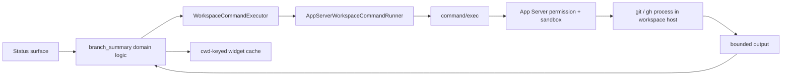

# Workspace Command 与 Git Status Probe

Codex TUI 的 Git branch、PR number 和 branch diff 不是直接在 TUI 进程里运行 `git` / `gh`。它们经由 `WorkspaceCommandExecutor` 转发到当前 App Server，使同一套状态栏逻辑可以观察本地或远端 workspace。本专题研究这条读模型，重点保留其中优秀的 remote-capable abstraction，也审视“只读状态栏”背后的进程、网络、凭据与一致性成本。

研究快照：`main@ab6a7eb87cc8a816c88b86c44cf291e251ed2136`。

## 1. 为什么需要 Workspace Command

TUI 所在机器不一定拥有 workspace：

```text
local TUI + embedded App Server       -> workspace 在本机
local TUI + remote App Server         -> workspace 在远端
future UI / IDE + App Server          -> UI 不应假设能直接访问 repo
```

因此 `tui/src/workspace_command.rs` 定义 object-safe `WorkspaceCommandExecutor`，状态栏只描述：

- `argv`；
- optional `cwd`；
- env override；
- timeout；
- output cap。

`AppServerWorkspaceCommandRunner` 再把它翻译为 App Server `command/exec`。这是典型的 **location-transparent capability**：调用者知道要观察什么，不知道进程实际在哪里运行。



## 2. 三类状态的真实调用链

### 2.1 当前 branch

`branch_summary.rs::current_branch_name`：

```text
git branch --show-current
  -> exit 0
  -> trim stdout
  -> non-empty => branch
  -> detached HEAD / error / empty => None
```

status line 与 terminal title 共用这份 branch cache，避免两个 surface 各自启动 probe。

### 2.2 committed branch changes

`branch_diff_stats_to_default_branch`：

```text
git rev-parse --git-dir
  -> enumerate git remote
  -> for each remote:
       symbolic-ref refs/remotes/<remote>/HEAD
       verify resolved remote ref
       fallback: git remote show <remote>
       verify discovered remote ref
  -> fallback local refs/heads/main or refs/heads/master
  -> git merge-base HEAD <verified-default-ref>
  -> git diff --numstat <merge-base>..HEAD
  -> sum additions / deletions
```

这里只计算已提交 branch 相对 default branch merge base 的变化，明确排除 dirty worktree。用户文案也写成 “Committed branch changes”，产品语义与实现一致。

### 2.3 Open PR

`open_pull_request` 先尝试：

```text
gh pr view --json number,url,state
```

若当前 branch 推断失败，再：

```text
git rev-parse HEAD
gh repo view --json nameWithOwner,parent
gh api repos/<parent-or-fork>/commits/<HEAD>/pulls
```

parent repository 先于 fork 查询，适配“代码 checkout 在 fork，PR 开在 upstream”的真实协作场景。只接受 state 为 open 的结果。

PR probe 与 diff probe 通过 `tokio::join!` 并发；其中一个失败不会丢掉另一个结果。

## 3. 值得学习的代码

### 3.1 Port / adapter 隔离执行位置

`branch_summary` 只依赖 `WorkspaceCommandExecutor`，测试用 `FakeRunner` 精确断言 argv 与响应，不需要启动真实 Git 仓库或 App Server。生产 adapter 才知道 JSON-RPC。

这与前端开发中的 repository interface 很像：组件依赖 query port，Electron、Browser 或 remote backend 分别提供 adapter。当前 NestJS Agent 的 tool metadata、artifact inspection 或 remote environment probe 也应采用此结构。

### 3.2 argv 而非 shell string

repo name、SHA、ref 和 endpoint 都作为独立 argv 元素传递，不拼进 shell。即使值来自 repository 或 `gh` 输出，也不会发生 shell interpolation。

安全边界仍需验证业务格式，但“数据不能突然变成 shell 语法”已经由类型形态保证。

### 3.3 后台 probe 的保守默认值

`WorkspaceCommand::new` 默认 5 秒 timeout、64 KiB output cap、non-TTY、无 stdin/stdout streaming。Git 设置 `GIT_OPTIONAL_LOCKS=0`，GH 设置 `GH_PROMPT_DISABLED=1` 与 `GIT_TERMINAL_PROMPT=0`。

后台状态查询不应抢锁、不应等待用户输入、不应无限输出，也不应让错误打断主任务。这些默认值集中在 command abstraction，而不是依赖每个调用点自觉。

### 3.4 Default branch 不是猜一个字符串

实现优先读取 remote-tracking symbolic HEAD，且在接受前 `rev-parse --verify --quiet`；没有时才看 `remote show`，最后才 fallback 到经过验证的 local `main` / `master`。

它避免两个常见错误：

- 把所有 repo 的 default branch 都假设为 `main`；
- 用可能 stale 或根本不存在的 `origin/HEAD` 进入后续 merge-base。

### 3.5 Partial availability 是正式状态

`StatusLineGitSummary` 的 PR 与 diff stats 都是 `Option`。并发 probe 后分别保留成功项，renderer 只省略暂不可用 segment，不把 optional metadata failure 升级为用户可见错误。

这是产品级 telemetry / decoration 的正确失败等级：核心 Agent Turn 不应因 `gh` 未登录而失败。

### 3.6 Cwd 随结果回传

`StatusLineBranchUpdated` 和 `StatusLineGitSummaryUpdated` 都携带 lookup cwd。widget 切目录后会拒绝不同 cwd 的迟到结果。现有测试 `stale_status_line_git_summary_update_is_ignored` 固定了这条最低限度的不变量。

## 4. 执行与权限边界

### 4.1 `command/exec` 不是纯查询 API

Workspace runner 最终调用通用 `command/exec`。App Server 会：

- 合并 shell environment policy 和 client env override；
- 解析 timeout/output capture；
- 选择 effective permission profile；
- 可能启动 managed network proxy；
- 构造 sandboxed process。

因此 status line 不是“读取一个内存字段”，而是在 workspace host 启动真实进程。它继承 Git config、credential helpers、PATH executable resolution、sandbox 和 network policy。

好的架构抽象隐藏位置，不应隐藏成本和 authority。产品设置中启用 PR/diff status，实际是在授权后台 probe。

### 4.2 `git remote show` 可能访问网络

当 remote symbolic HEAD 不存在时，`get_remote_default_branch_from_remote_show` 执行 `git remote show <remote>`，没有 `-n`。Git 可能联系 remote；Git command path只设置 `GIT_OPTIONAL_LOCKS=0`，没有像 `gh` 一样设置 `GIT_TERMINAL_PROMPT=0`。

这意味着用户只想显示本地 branch changes，也可能触发：

- 网络连接；
- credential helper；
- 每个 remote 最长一份 command timeout；
- 代理/企业网络审计事件。

状态栏应优先使用纯本地 ref/config；若要联网刷新 default branch，必须作为显式、可缓存的 network capability。

### 4.3 PATH 与 repository config 都是信任输入

runner 使用字符串 `git` / `gh`，由远端 App Server 的 PATH 解析。恶意或错误环境可以放置同名 executable。Git 又会读取 system/global/local config，`gh` 会读取登录态与 host config。

这不等于命令注入，因为 argv 固定；但它说明 command identity 不只是 argv。审计一条 probe 还需要 executable provenance、sanitized env、config scope 和 network decision。

### 4.4 Cwd 的 containment 由调用约定而非类型保证

`WorkspaceCommand.cwd` 是任意 `PathBuf`。App Server 使用 `config.cwd.join(cwd)`，绝对路径可以替换 base，也没有在 command processor 内 canonicalize 后验证 workspace root。

status line 自己使用当前 session cwd，属于可信应用状态；assistant directive 路径则能把模型文本引入同一个 runner。port 应改收 `WorkspaceRef` 或 `PathUri` capability，而不是 host path。

## 5. 一致性与生命周期边界

### 5.1 Cwd key 不能防 ABA

迟到结果只按 `cwd` 比较：

```text
lookup A1 in /repo
  -> user switches /other
  -> user switches back /repo, starts A2
  -> old A1 returns
  -> cwd matches, A1 is accepted as A2 result
```

需要单调 `lookupGeneration` 或 request ID；cwd 只是 cache key，不是 operation identity。

当前不同 cwd 的 stale result 还会把全局 `pending=false`，即使新 cwd 的请求仍在运行。后续 refresh 可能再启动重复 probe。

### 5.2 Branch、PR 与 diff 不是同一个 repository snapshot

branch 是单独 task；summary 内 PR 与 diff 又并发启动。用户在中途 checkout/commit 时，三个 segment可能分别观察不同 HEAD。当前结构没有返回：

- git dir identity；
- HEAD SHA；
- branch；
- observedAt；
- default ref SHA。

UI 能拼出 `branch A · PR #x · +n -m`，却不能证明这些字段属于同一个快照。domain query 应返回带 observation identity 的聚合快照，再整体 commit 到 cache。

### 5.3 Cache 基本是 cwd 级 one-shot

`lookup_complete=true` 后，同一 cwd 的普通 refresh 不再 probe。只有禁用/重启用 item、cwd 变化或 widget 重建才清空状态。现有“after turn complete / interrupt refreshes”测试是在 cache 尚未绑定 cwd 的初次场景，并没有证明已经完成的同 cwd lookup 会再次刷新。

外部 checkout、用户手动 push、PR 新建/关闭或 default ref 更新后，状态可无限 stale。应使用：

- repo watcher / HEAD identity invalidation；或
- 明确 TTL + stale marker；或
- 用户触发 refresh。

不要在每个 render frame运行进程。

### 5.4 每条命令有 timeout，整个 query 没有 budget

remote 遍历是顺序的，PR fallback 也是多步顺序。一个 repo 可声明很多 remotes，每一步各自拥有 5 秒 timeout。`tokio::join!` 只让两条分支并行，不限制总 subprocess 数或整次 query wall time。

状态栏 query 需要总 budget：例如 2 秒内优先返回 branch/local diff，网络 PR 延后更新；超出 budget 取消剩余 child processes。

禁用 item 或切 cwd 时，现有 spawned task也不会取消，只在结果阶段丢弃。

## 6. 数据正确性边界

### 6.1 `--numstat` 被截断后仍像精确答案

默认 output cap 保护内存，但 `git diff --numstat` 可超过 64 KiB。processor 返回截断文本后，parser 仍逐行求和：

- 截断后的尾行可能只含一个 column；
- binary file 的 `-` 被当作 0；
- malformed / overflow number 被当作 0；
- 没有 `truncated` flag 参与 domain result。

最终 UI 会显示一个偏小但看似精确的 `+N -M`。资源上限必须进入业务语义：输出截断时返回 unavailable/partial，或改用 Git 能直接汇总的 bounded format。

累加使用普通 `u64 +=`，没有 checked/saturating add；敌对或异常超大数值在不同 build profile 下可能 panic 或 wrap。

### 6.2 PR URL 与 repo identity 未做本地 domain validation

`gh` JSON 只被 serde parse，open state 后直接保存 number/url。URL 后续成为 status-line hyperlink。虽然 `gh` 是预期可信 producer，domain layer仍应校验 HTTPS、GitHub host或明确支持的 enterprise host，并绑定 repo identity。

commit-to-PR API 返回多个 open PR 时取第一项，排序语义未写入 contract；fork/upstream 多 PR 场景可能显示非预期一条。

### 6.3 Project root 仍走 TUI 本地 filesystem

Git branch/PR/diff 已经 remote-capable，但 `status_line_project_root_for_cwd` 仍调用同步 `codex_git_utils::get_git_repo_root(cwd)`，直接在 TUI host 上向上查找 `.git`。代码库其实已有 `get_git_repo_root_with_fs` 支持 remote filesystem，但该 status path 没使用。

当 TUI 连接 remote App Server 时，remote cwd 在本机可能不存在，project name 会 fallback 到 config layer或目录名，与远端真实 repo root 不一致。这个例子提醒我们：**只抽象一半 I/O 会让同一状态栏同时展示两个世界的事实。**

## 7. 测试证据

### 已有测试

| 测试 | 价值 |
| --- | --- |
| `branch_diff_stats_prefers_remote_default_ref_over_stale_local_branch` | remote verified default ref 优于 stale local branch |
| `open_pull_request_uses_current_branch_view_first` | cheap current-branch PR lookup优先 |
| `open_pull_request_falls_back_to_parent_repo_commit_lookup` | fork 场景 parent-first fallback |
| `status_line_pr_view_parser_requires_open_pr` | closed/merged 不投影为 open PR |
| `status_line_pr_fallback_searches_parent_repo_first` | repository search order稳定 |
| `stale_status_line_git_summary_update_is_ignored` | different-cwd stale result拒绝 |
| `status_line_branch_changes_render_no_changes` | 0/0 的用户文案 |
| status surface preview tests | cache value能稳定进入配置 preview |

### 应补测试

1. `/repo → /other → /repo` 同 cwd ABA，旧 generation 不得覆盖新 query。
2. 已完成 cache 在同 cwd 新 commit/checkout 后的 invalidation。
3. `--numstat` truncated、binary、malformed、u64 overflow 和巨大 file count。
4. 100 个 remotes、每个 timeout、item disabled/cwd switched 后的 cancellation与总 deadline。
5. 缺 remote HEAD 时保证纯本地模式不执行 network `remote show`。
6. credential helper/PATH fake executable不能弹交互、无限派生子进程或泄露环境。
7. branch/PR/diff 在一次 checkout race 中必须共享 HEAD identity，或明确标为来自不同 observation。
8. remote App Server 下 project root、branch、PR、diff 都来自同一 remote filesystem。
9. PR URL scheme/host、enterprise GitHub、自建 GH_HOST 和多 open PR排序。
10. stale result不得清除当前 generation 的 pending state。

## 8. 架构解释

Status metadata 是“可丢弃 projection”，但生成 projection 的过程仍可能拥有高权限。成熟设计应把四件事分开：

1. Query semantics：想知道 branch、PR 还是 committed diff；
2. Execution capability：在哪个 workspace、允许哪个固定 probe；
3. Observation identity：这些字段属于哪个 repo/HEAD/generation；
4. Cache policy：fresh、stale、partial、unavailable 和何时 invalidated。

`WorkspaceCommandExecutor` 已经很好地解决了执行位置和可测试性；下一步不应把更多 shell 字符串塞进它，而应在上层建立 typed `WorkspaceProbe`：

```ts
type WorkspaceProbe =
  | { type: 'gitSnapshot'; workspaceId: string }
  | { type: 'openPullRequest'; workspaceId: string; headSha: string };

interface GitSnapshot {
  workspaceId: string;
  repositoryId: string;
  headSha: string;
  branch?: string;
  defaultRef?: string;
  diff?: { additions: number; deletions: number; complete: boolean };
  observedAt: string;
  generation: number;
}
```

固定 typed probe 能让 App Server控制 executable、cwd、network、budget 和输出 parser，TUI 只消费 domain result。

## 9. 迁移建议

当前云端 NestJS Agent 没有终端 status line，但会遇到类似问题：运行页的 GitHub branch、PR、deployment、SEO crawl 或外部数据 badge 都是可选投影。

建议迁移：

- domain query port 与 transport adapter 分离；
- optional decoration失败不影响 Agent Run；
- async result携带 owner + generation；
- 并行独立 probe，但整体有 deadline、取消和 resource budget；
- result携带 source revision、freshness 和 partial状态；
- 不让前端提交任意 executable/cwd，只提交 server-issued workspace/resource ID；
- cache 由数据 revision/TTL失效，不由组件生命周期碰运气。

不应照搬：通用 `command/exec` RPC、Git CLI解析和本地 PATH信任。这些属于桌面 workspace Agent 的环境约束。

## 10. 推荐阅读与 Teach-back

阅读顺序：

1. `tui/src/workspace_command.rs`；
2. `tui/src/branch_summary.rs::current_branch_name`；
3. `branch_diff_stats_to_default_branch` 与 default branch helpers；
4. `open_pull_request` 与 GitHub fallback；
5. `chatwidget/status_surfaces.rs::sync_status_surface_shared_state`；
6. `request_status_line_branch` / `request_status_line_git_summary`；
7. `chatwidget/status_controls.rs::{set_status_line_branch,set_status_line_git_summary}`；
8. `app-server/src/request_processors/command_exec_processor.rs::exec_one_off_command_inner`；
9. `git-utils/src/info.rs::{get_git_repo_root,get_git_repo_root_with_fs}`；
10. `branch_summary` fake-runner tests与 status widget stale tests。

Teach-back：

1. 为什么 argv-based runner 降低了注入风险，却没有消除 PATH/config/credential 风险？
2. `cwd` 为什么是 cache key，却不是 async operation identity？
3. 为什么 64 KiB cap 既是优点，又会让 diff 数值变成“精确外观的部分结果”？
4. `git remote show` 为什么让本地 status item拥有网络副作用？
5. 如何让 branch、PR、diff证明自己属于同一个 HEAD snapshot？
6. 为什么 local project-root lookup 会破坏 remote App Server 的位置透明性？
