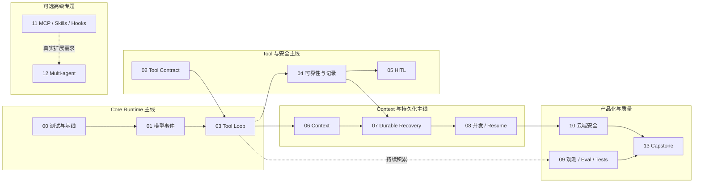

# Codex Agent Runtime 学习指南

## 1. 定位：推荐学习顺序，不是项目任务看板

本目录把 Codex `main@ab6a7eb87cc8a816c88b86c44cf291e251ed2136` 的架构域翻译为适合 Vue / TypeScript / NestJS 开发者的学习模块。`phase-*` 是为兼容既有链接保留的模块编号，不表示当前项目必须逐项实施或按编号发布。

- **Core**：理解单 Agent Runtime 必需的协议、状态机、Tool loop、Context 与安全边界。
- **Advanced**：在可靠单 Agent 之上学习恢复、并发、观测与云端治理。
- **Optional**：只有真实需求出现时才实验扩展协议和 Multi-agent。
- 项目正式实施状态只看 `docs/tasks/**` 与 `docs/roadmap.md`；本目录的练习是学习建议。

## 2. 五条学习主线

图只表达知识依赖。可以只读某条高级专题，也可以在不实现 Phase 07-13 的情况下完成 Core teach-back。

## 3. 模块索引与建议深度

| 模块 | 分类 | 主要问题 | 当前项目建议 |
| --- | --- | --- | --- |
| [00 基线与测试](./phase-00-baseline-and-testing/README.md) | Core | 如何用 fake provider 和状态机测试读复杂 Runtime？ | 近期需要 |
| [01 模型事件](./phase-01-model-event-contract/README.md) | Core | provider stream 如何归一化而不泄漏 SDK 类型？ | 近期需要 |
| [02 Tool Contract](./phase-02-tool-contract-and-registry/README.md) | Core | spec、router、registry、handler 各拥有何种控制权？ | 近期需要 |
| [03 单 Agent Tool Loop](./phase-03-single-agent-tool-loop/README.md) | Core | ToolCall 如何回填 observation 并触发下一次 sampling？ | 近期需要 |
| [04 Tool 可靠性](./phase-04-tool-reliability-and-recording/README.md) | Core | timeout、cancel、error、recording 如何形成唯一终态？ | 近中期需要 |
| [05 Human-in-the-loop](./phase-05-human-in-the-loop/README.md) | Core | permission、approval、sandbox 为什么不同？ | 中期需要；OS sandbox 只理解 |
| [06 Context](./phase-06-context-engineering/README.md) | Core | model history、compaction 与 durable facts 如何分层？ | 中期需要 |
| [07 Durable Recovery](./phase-07-durable-execution-and-recovery/README.md) | Advanced | crash 后从哪些 canonical facts 恢复？ | 长任务/worker 前需要 |
| [08 并发、重连与 Resume](./phase-08-concurrency-streaming-and-resume/README.md) | Advanced | active run、queue、cancel、resume 如何避免竞态？ | 多实例前需要 |
| [09 可观测性、评测与测试](./phase-09-observability-evaluation-and-testing/README.md) | Advanced | 如何证明状态机可安全演进？ | 测试从 Core 起做，体系后置 |
| [10 云端安全与多租户](./phase-10-cloud-security-and-multi-tenancy/README.md) | Advanced | 本地权限如何翻译为 tenant scope 与资源治理？ | 对外多用户前必须 |
| [11 扩展体系](./phase-11-extensibility-mcp-skills-hooks/README.md) | Optional | MCP、Skill、Plugin、Hook、App 如何分工？ | 当前只理解 |
| [12 Multi-agent](./phase-12-multi-agent-experiment/README.md) | Optional | child Thread 何时优于单 Agent + 工具？ | 当前不实现 |
| [13 生产化 Capstone](./phase-13-production-capstone/README.md) | Advanced | 如何把证据、演示和工程取舍组成可交付作品？ | 按真实项目成熟度选择 |

每个目录固定包含：

- `README.md`：问题、边界、前端类比、建议深度与非目标。
- `source-reading.md`：当前快照的真实调用链、稳定符号、正常/失败测试和阅读问题。
- `practice-and-acceptance.md`：teach-back、小型实验与可选实现验收；不是正式 task。

完整三文件索引：

| 模块 | 总览 | 源码 | 练习 |
| --- | --- | --- | --- |
| 00 | [README](./phase-00-baseline-and-testing/README.md) | [source-reading](./phase-00-baseline-and-testing/source-reading.md) | [practice](./phase-00-baseline-and-testing/practice-and-acceptance.md) |
| 01 | [README](./phase-01-model-event-contract/README.md) | [source-reading](./phase-01-model-event-contract/source-reading.md) | [practice](./phase-01-model-event-contract/practice-and-acceptance.md) |
| 02 | [README](./phase-02-tool-contract-and-registry/README.md) | [source-reading](./phase-02-tool-contract-and-registry/source-reading.md) | [practice](./phase-02-tool-contract-and-registry/practice-and-acceptance.md) |
| 03 | [README](./phase-03-single-agent-tool-loop/README.md) | [source-reading](./phase-03-single-agent-tool-loop/source-reading.md) | [practice](./phase-03-single-agent-tool-loop/practice-and-acceptance.md) |
| 04 | [README](./phase-04-tool-reliability-and-recording/README.md) | [source-reading](./phase-04-tool-reliability-and-recording/source-reading.md) | [practice](./phase-04-tool-reliability-and-recording/practice-and-acceptance.md) |
| 05 | [README](./phase-05-human-in-the-loop/README.md) | [source-reading](./phase-05-human-in-the-loop/source-reading.md) | [practice](./phase-05-human-in-the-loop/practice-and-acceptance.md) |
| 06 | [README](./phase-06-context-engineering/README.md) | [source-reading](./phase-06-context-engineering/source-reading.md) | [practice](./phase-06-context-engineering/practice-and-acceptance.md) |
| 07 | [README](./phase-07-durable-execution-and-recovery/README.md) | [source-reading](./phase-07-durable-execution-and-recovery/source-reading.md) | [practice](./phase-07-durable-execution-and-recovery/practice-and-acceptance.md) |
| 08 | [README](./phase-08-concurrency-streaming-and-resume/README.md) | [source-reading](./phase-08-concurrency-streaming-and-resume/source-reading.md) | [practice](./phase-08-concurrency-streaming-and-resume/practice-and-acceptance.md) |
| 09 | [README](./phase-09-observability-evaluation-and-testing/README.md) | [source-reading](./phase-09-observability-evaluation-and-testing/source-reading.md) | [practice](./phase-09-observability-evaluation-and-testing/practice-and-acceptance.md) |
| 10 | [README](./phase-10-cloud-security-and-multi-tenancy/README.md) | [source-reading](./phase-10-cloud-security-and-multi-tenancy/source-reading.md) | [practice](./phase-10-cloud-security-and-multi-tenancy/practice-and-acceptance.md) |
| 11 | [README](./phase-11-extensibility-mcp-skills-hooks/README.md) | [source-reading](./phase-11-extensibility-mcp-skills-hooks/source-reading.md) | [practice](./phase-11-extensibility-mcp-skills-hooks/practice-and-acceptance.md) |
| 12 | [README](./phase-12-multi-agent-experiment/README.md) | [source-reading](./phase-12-multi-agent-experiment/source-reading.md) | [practice](./phase-12-multi-agent-experiment/practice-and-acceptance.md) |
| 13 | [README](./phase-13-production-capstone/README.md) | [source-reading](./phase-13-production-capstone/source-reading.md) | [practice](./phase-13-production-capstone/practice-and-acceptance.md) |

## 4. 三种使用方式

### 只读理解

读模块 README 与 source-reading，画调用链并完成 teach-back。适合 Optional 主题，不要求改项目。

### 小型实验

用纯 TypeScript、fake stream 或内存 store 验证一个不变量；实验可以丢弃，不自动升级为正式任务。

### 转为项目实施

只有业务价值、前置能力和风险边界都成立时，才把最小任务写入 `docs/tasks/**` 并走 Issue/PR。阶段练习不能作为项目 Completed 证据。

## 5. 推荐阅读组合

- 第一次理解 Agent：00 → 01 → 02 → 03。
- 理解安全工具：02 → 04 → 05 → 10。
- 理解长上下文与恢复：06 → 07 → 08。
- 理解成熟产品：09 → 10 → 13。
- 研究扩展：11；只有基线问题明确时再读 12。

学习方法见 [learning-method.md](./learning-method.md)，架构域映射见 [checklist-phase-matrix.md](./checklist-phase-matrix.md)，个人证据记录见 [progress-tracker.md](./progress-tracker.md)。

## 6. 横切学习实验

| 专题 | 分类 | 适合何时阅读 |
| --- | --- | --- |
| [Operation Identity](./operation-identity-lab.md) | Advanced | 学习异步竞态、写副作用、幂等重试、跨连接恢复时 |
| [Turn Admission Race](./turn-admission-race-lab.md) | Advanced | 学习Run准入、active steer、cancel/completion竞态和输入回执时 |

横切实验不会增加新的实施Phase。它们用多个Codex案例提炼一个可复用不变量，并通过纯TypeScript小实验验证理解。
