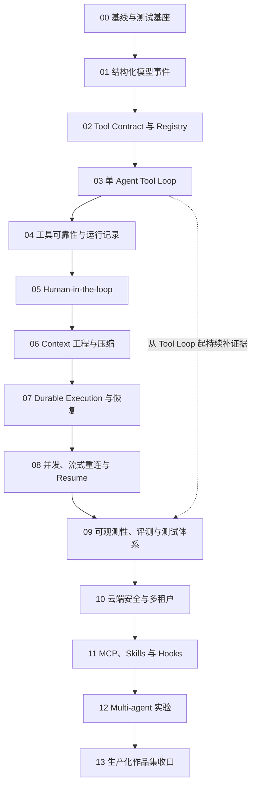

# AI SEO Agent 分阶段学习路线

## 1. 路线定位

这条路线从当前项目真实状态出发：阶段 1-4 已完成，项目正在准备阶段 5 最小 Tool Calling。它不会重新安排基础聊天页面，也不会直接跳到 Multi-agent。

路线把 Codex 的生产级架构拆成适合 TypeScript / NestJS / Vue 学习的渐进阶段。每个阶段都必须满足：

- 每阶段只围绕一个主要学习问题；同一问题下只保留形成闭环不可缺少的 contract、状态和测试。
- 先建立类型与测试，再接真实 provider / tool。
- 保持外部协议稳定，除非阶段目标明确要求升级。
- 有可执行练习和可审计验收证据。
- 明确哪些 Codex 能力只学习思想、不复制实现。

架构清单与阶段的完整追踪关系见 [`checklist-phase-matrix.md`](./checklist-phase-matrix.md)。

> 安全发布门槛：Phase 00-09 可以在本地、单用户学习环境中逐步建立 approval、Run 查询和恢复协议，但这些接口在 Phase 10 完成真实 Authentication、ActorContext 与 tenant scope 前，不得作为共享多用户云服务对外开放。前期文档出现的“actor/scope”是待接入的服务端边界，不代表当前项目已经有登录或租户隔离。

## 2. 总体路线



图中的实线表示正式阶段退出顺序；Phase 09 的测试、trace metadata 和 eval fixture 从 Phase 03 起持续积累，到 Phase 08 后再系统收口。

## 3. 阶段索引

| 阶段 | 主题 | 对应当前项目 | 核心产物 | 进入条件 |
| --- | --- | --- | --- | --- |
| [00](./phase-00-baseline-and-testing/README.md) | 基线与测试基座 | 阶段 4 复盘 / 阶段 5 前置 | test harness、fake model、状态机基线 | 当前即可开始 |
| [01](./phase-01-model-event-contract/README.md) | 结构化模型事件 | 阶段 5 前置 | `ModelStreamEvent`、provider adapter | 00 完成 |
| [02](./phase-02-tool-contract-and-registry/README.md) | Tool Contract 与 Registry | 阶段 5 Task 1-2 | definition/call/result、registry、只读工具 | 01 完成 |
| [03](./phase-03-single-agent-tool-loop/README.md) | 单 Agent Tool Loop | 阶段 5 Task 3 | sampling -> tool -> observation -> sampling | 02 完成 |
| [04](./phase-04-tool-reliability-and-recording/README.md) | 工具可靠性与运行记录 | 阶段 5 Task 4 / 收口 | tool steps、budget、timeout、error taxonomy | 03 完成 |
| [05](./phase-05-human-in-the-loop/README.md) | Human-in-the-loop | 项目阶段 6 | risk policy、approval resource、confirm/reject | 04 完成 |
| [06](./phase-06-context-engineering/README.md) | Context 工程与压缩 | 项目阶段 7 | model history、token budget、summary | 05 可并行部分完成 |
| [07](./phase-07-durable-execution-and-recovery/README.md) | Durable Execution | 可靠性扩展 | idempotency、checkpoint、stale-run recovery | 04、05、06 完成 |
| [08](./phase-08-concurrency-streaming-and-resume/README.md) | 并发与 Resume | 云端运行增强 | active-run policy、reconnect、resume/cancel | 07 完成 |
| [09](./phase-09-observability-evaluation-and-testing/README.md) | 可观测性与评测 | 项目阶段 8 扩展 | trace、metrics、eval set、regression gate | 03 起持续建设 |
| [10](./phase-10-cloud-security-and-multi-tenancy/README.md) | 云端安全与多租户 | 生产化前置 | auth scope、tenant isolation、quotas | 07、08、09 完成 |
| [11](./phase-11-extensibility-mcp-skills-hooks/README.md) | 扩展架构 | 后期 | MCP adapter、skill instructions、hooks | 内置工具与安全稳定 |
| [12](./phase-12-multi-agent-experiment/README.md) | Multi-agent 实验 | 后期实验 | child runs、task contract、budget | 10、11 完成 |
| [13](./phase-13-production-capstone/README.md) | 生产化作品集收口 | 最终整合 | 可演示产品、架构报告、运行证据 | 前述核心阶段完成 |

### 3.1 阶段文档全索引

每个阶段按“先定边界 -> 再读源码 -> 最后实践验收”的顺序阅读：

| Phase | 阶段设计 | 源码阅读 | 实践与验收 |
| --- | --- | --- | --- |
| 00 | [README](./phase-00-baseline-and-testing/README.md) | [source-reading](./phase-00-baseline-and-testing/source-reading.md) | [practice-and-acceptance](./phase-00-baseline-and-testing/practice-and-acceptance.md) |
| 01 | [README](./phase-01-model-event-contract/README.md) | [source-reading](./phase-01-model-event-contract/source-reading.md) | [practice-and-acceptance](./phase-01-model-event-contract/practice-and-acceptance.md) |
| 02 | [README](./phase-02-tool-contract-and-registry/README.md) | [source-reading](./phase-02-tool-contract-and-registry/source-reading.md) | [practice-and-acceptance](./phase-02-tool-contract-and-registry/practice-and-acceptance.md) |
| 03 | [README](./phase-03-single-agent-tool-loop/README.md) | [source-reading](./phase-03-single-agent-tool-loop/source-reading.md) | [practice-and-acceptance](./phase-03-single-agent-tool-loop/practice-and-acceptance.md) |
| 04 | [README](./phase-04-tool-reliability-and-recording/README.md) | [source-reading](./phase-04-tool-reliability-and-recording/source-reading.md) | [practice-and-acceptance](./phase-04-tool-reliability-and-recording/practice-and-acceptance.md) |
| 05 | [README](./phase-05-human-in-the-loop/README.md) | [source-reading](./phase-05-human-in-the-loop/source-reading.md) | [practice-and-acceptance](./phase-05-human-in-the-loop/practice-and-acceptance.md) |
| 06 | [README](./phase-06-context-engineering/README.md) | [source-reading](./phase-06-context-engineering/source-reading.md) | [practice-and-acceptance](./phase-06-context-engineering/practice-and-acceptance.md) |
| 07 | [README](./phase-07-durable-execution-and-recovery/README.md) | [source-reading](./phase-07-durable-execution-and-recovery/source-reading.md) | [practice-and-acceptance](./phase-07-durable-execution-and-recovery/practice-and-acceptance.md) |
| 08 | [README](./phase-08-concurrency-streaming-and-resume/README.md) | [source-reading](./phase-08-concurrency-streaming-and-resume/source-reading.md) | [practice-and-acceptance](./phase-08-concurrency-streaming-and-resume/practice-and-acceptance.md) |
| 09 | [README](./phase-09-observability-evaluation-and-testing/README.md) | [source-reading](./phase-09-observability-evaluation-and-testing/source-reading.md) | [practice-and-acceptance](./phase-09-observability-evaluation-and-testing/practice-and-acceptance.md) |
| 10 | [README](./phase-10-cloud-security-and-multi-tenancy/README.md) | [source-reading](./phase-10-cloud-security-and-multi-tenancy/source-reading.md) | [practice-and-acceptance](./phase-10-cloud-security-and-multi-tenancy/practice-and-acceptance.md) |
| 11 | [README](./phase-11-extensibility-mcp-skills-hooks/README.md) | [source-reading](./phase-11-extensibility-mcp-skills-hooks/source-reading.md) | [practice-and-acceptance](./phase-11-extensibility-mcp-skills-hooks/practice-and-acceptance.md) |
| 12 | [README](./phase-12-multi-agent-experiment/README.md) | [source-reading](./phase-12-multi-agent-experiment/source-reading.md) | [practice-and-acceptance](./phase-12-multi-agent-experiment/practice-and-acceptance.md) |
| 13 | [README](./phase-13-production-capstone/README.md) | [source-reading](./phase-13-production-capstone/source-reading.md) | [practice-and-acceptance](./phase-13-production-capstone/practice-and-acceptance.md) |

## 4. 与现有项目 Roadmap 的关系

| 现有项目阶段 | 本研究路线 |
| --- | --- |
| 阶段 1-3 | 作为已完成基础，不重新实施 |
| 阶段 4 Agent Runtime | Phase 00 复盘并补测试证据 |
| 阶段 5 Tool Calling | Phase 01-04 |
| 阶段 6 Human-in-the-loop | Phase 05 |
| 阶段 7 Context 管理 | Phase 06 |
| 阶段 8 可观测性与作品集 | Phase 09 + Phase 13 |
| 尚未定义的云端可靠性 | Phase 07、08、10 |
| 暂不做的 MCP / Multi-agent | Phase 11、12，保持后置 |

研究路线比执行 roadmap 更细，因为一个“Tool Calling”产品阶段包含模型协议、工具 contract、循环和可靠性四个不同学习问题。执行时仍以 `docs/tasks/README.md` 为准。

## 5. 每阶段统一文件结构

```text
phase-xx-name/
  README.md
  source-reading.md
  practice-and-acceptance.md
```

### README.md

- 阶段问题和学习目标。
- 当前项目起点。
- Codex 设计启发。
- 建议架构和任务拆分。
- 明确非目标。
- 退出标准。

### source-reading.md

- Codex 真实调用链。
- 当前项目对应入口。
- 推荐阅读顺序。
- 阅读问题和可跳过细节。

### practice-and-acceptance.md

- Red / Green / Refactor 练习。
- 单元、集成和 contract 测试矩阵。
- 运行验证。
- 验收证据清单。
- 复盘问题。

## 6. 学习节奏

每个阶段建议按以下节奏推进，不用按自然周机械安排：

1. **概念课**：用一条真实调用链理解职责。
2. **源码课**：Codex 只读关键文件和测试。
3. **设计课**：画当前项目最小边界，不写代码。
4. **Red**：先写失败测试或验证缺口。
5. **Green**：实现一个最小闭环。
6. **Refactor**：只整理已经被第二个用例证明的抽象。
7. **复盘**：用 Run/Step/事件和测试证据讲清楚发生了什么。

## 7. 三条硬门槛

### 不以“文件存在”作为完成

例如出现 `ToolRegistry` 文件，不代表 Tool Calling 完成。必须证明 observation 回填后模型进行了下一轮 sampling。

### 不以“手动试过一次”作为稳定

状态机、取消、错误和幂等必须由自动化测试覆盖。

### 不以“Codex 有”作为当前需要

MCP、Plugin、Multi-agent、OS sandbox 都必须等当前前置条件满足后再进入。

## 8. 近期建议

当前最应执行 Phase 00，然后进入 Phase 01。原因是阶段 5 即将把线性文本流升级为循环状态机，而仓库目前没有任何自动化测试，也没有结构化模型事件边界。
