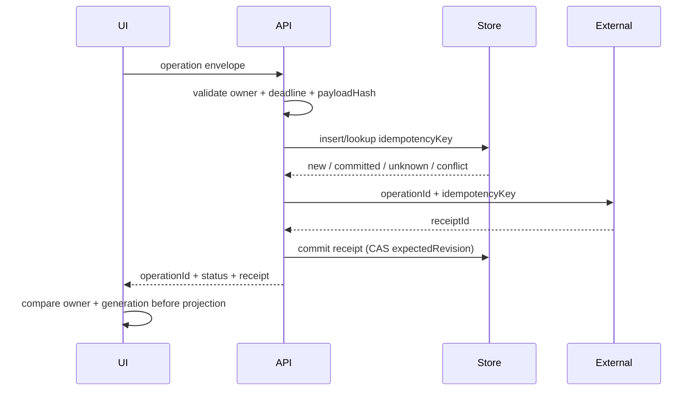

# Operation Identity 学习实验

这个专题把 Codex 多条源码链中反复出现的一个问题抽出来：**异步结果怎样证明自己仍属于原来的用户、资源、请求和状态版本？**

它是 Advanced 学习实验，不是当前项目任务。阅读目标是能区分 entity ID、request ID、operation ID、idempotency key、generation、attempt 和 receipt，避免用一个局部计数器承担所有职责。

## 1. 前端类比

Vue页面最常见的竞态：

```ts
watch(userId, async (id) => {
  const profile = await fetchProfile(id)
  currentProfile.value = profile
})
```

若A请求慢、切到B后B先返回、最后A返回，A会覆盖B。最小修正是比较请求generation：

```ts
let generation = 0

watch(userId, async (id) => {
  const mine = ++generation
  const profile = await fetchProfile(id)
  if (mine !== generation || id !== userId.value) return
  currentProfile.value = profile
})
```

Agent系统只是把这个问题放大：一个操作可能跨UI、App Server、backend、数据库、重试、Thread切换和进程重启。

## 2. 七种身份不要混用

| 身份 | 回答的问题 | 例子 |
| --- | --- | --- |
| Entity ID | 这是哪个长期对象？ | `threadId`、`accountId`、`agentRunId` |
| Request ID | 这次RPC消息是哪一条？ | JSON-RPC request ID |
| Operation ID | 这是哪次业务意图？ | “发送这封nudge邮件” |
| Idempotency key | 重试是否属于同一次操作？ | reset credit redeem UUID |
| Generation / revision | 结果是否仍针对当前版本？ | widget generation、config fingerprint |
| Attempt ID | 同一operation的第几次传输/执行？ | model retry attempt |
| Receipt ID | 外部系统确认了哪次提交？ | email message ID、Sentry event ID |

这些值可能相关，但不能互相代替：

- `threadId`相同，不代表旧请求仍新鲜；
- JSON-RPC request ID不同，不代表业务操作不同；
- idempotency key相同，不证明请求仍属于当前account；
- UI generation正确，不证明backend副作用已提交；
- HTTP 200不等于durable receipt。

## 3. Codex 源码中的六个对照案例

### 3.1 Feedback：有Thread owner，没有operation receipt

源码：

- `tui/src/app/background_requests.rs::submit_feedback`
- `app-server/src/request_processors/feedback_processor.rs`
- `feedback/src/lib.rs::FeedbackSnapshot::upload_feedback`

优秀点：TUI在请求前捕获 `origin_thread_id`，迟到结果回投原Thread buffer。

缺口：App Server只返回Thread ID；没有operation ID、attachment manifest hash、Sentry event ID或partial receipt。Thread归属正确，不等于上传事务可审计。

详见 [Feedback专题](../codex/feedback-and-diagnostics.md)。

### 3.2 Reset credit：有idempotency key，但只活在popup closure

源码：

- TUI `reset_credits.rs` / `usage.rs`
- App Server `account_processor/rate_limit_resets.rs`

优秀点：每个credit option生成UUID，retry closure复用同一个key。

缺口：关闭popup、切Thread或重启后key丢失；server处理时读取current account。operation可以保持幂等，却漂移到另一个owner；ambiguous commit后重建UI又会生成新key。

### 3.3 Owner nudge：只有transient request，没有业务operation identity

源码：

- `chatwidget/turn_runtime.rs` / `rate_limits.rs`
- App Server `account_processor.rs`
- backend client nudge POST

TUI默认No确认是好设计，但Finished event不回显request ID/type/account，POST也无idempotency。旧结果能consume新slot；实际发送后网络断开会诱导重复邮件。

### 3.4 Status probe：cwd是cache key，不是generation

源码：

- `chatwidget/status_surfaces.rs`
- `chatwidget/status_controls.rs`
- `branch_summary.rs`

结果携带cwd，可拒绝不同目录的stale result；但 `/repo → /other → /repo` 会发生ABA，old `/repo`结果重新匹配。需要额外generation。

详见 [Workspace command专题](../codex/workspace-command-and-git-status.md)。

### 3.5 Assistant branch observation：Thread owner正确，同Thread revision仍会竞争

源码：

- `git_action_directives.rs`
- `chatwidget/streaming.rs::on_agent_message_item_completed`
- `thread/metadata/update`

模型声明branch后，TUI重新运行Git并持久化真实branch，体现claim→observe→persist；后台事件又携带原Thread ID。但连续两个Turn的probe可以乱序，旧branch观察覆盖新branch metadata。

详见 [Assistant directives专题](../codex/assistant-directives.md)。

### 3.6 Request User Input：call ID、Turn pending slot与UI queue的粒度不同

源码入口：Core request-user-input tool、App Server outbound request routing、TUI interactive prompt queue。

Core按Turn维护单个pending response sender，而App Server/TUI能按call排队；多个并发call可能覆盖或错投。这里不是“有没有UUID”，而是状态owner用什么粒度建key。

## 4. Operation envelope

一个跨层副作用至少携带：

```ts
interface OperationEnvelope<TPayload> {
  operationId: string
  idempotencyKey: string
  owner: {
    tenantId: string
    userId: string
    accountId?: string
    conversationId?: string
    agentRunId?: string
  }
  target: {
    resourceId: string
    expectedRevision?: string
  }
  generation: number
  attempt: number
  payloadHash: string
  createdAt: string
  deadlineAt: string
  payload: TPayload
}
```

关键不是字段越多越好，而是每个校验点明确负责什么：



## 5. 一个 operation 的最小状态机

```text
Prepared
  -> Submitted
  -> Committed(receipt)
  -> Failed(retryable | terminal)
  -> Unknown(reconcile by key)
  -> Cancelled(before commit only)
```

禁止的状态组合：

- 同一idempotency key绑定两个payload hash；
- owner改变但operation ID不变；
- 已Committed又显示Failed并允许新key重试；
- deadline过期后仍开始新attempt；
- old generation更新当前UI；
- receipt存在但store状态仍Prepared。

## 6. 小型TypeScript实验

不改当前项目，单独写一个纯TS reducer即可。

### 实验A：同resource ABA

输入：

```text
start op A(resource=/repo, generation=1)
switch /other
switch back /repo
start op B(resource=/repo, generation=3)
finish A
finish B
```

断言：只比较resource会接受A；比较resource+generation只接受B。

### 实验B：commit后timeout

模拟external先记录receipt，再让HTTP超时。

断言：client不能生成新idempotency key盲重试；先以旧key查询，得到Committed receipt。

### 实验C：same key + different body

同一key先提交 `{creditId: A}`，再提交 `{creditId: B}`。

断言：store返回Conflict，不能把第二次当幂等成功。

### 实验D：owner漂移

UI在account A创建operation，提交前切到B。

断言：API验证expected account revision并拒绝；不能读取“处理时current account”。

## 7. 推荐Reducer

```ts
type OperationState =
  | { status: 'prepared'; envelope: OperationEnvelope<unknown> }
  | { status: 'submitted'; envelope: OperationEnvelope<unknown> }
  | { status: 'committed'; envelope: OperationEnvelope<unknown>; receiptId: string }
  | { status: 'unknown'; envelope: OperationEnvelope<unknown>; lastAttempt: number }
  | { status: 'failed'; envelope: OperationEnvelope<unknown>; retryable: boolean }
  | { status: 'cancelled'; envelope: OperationEnvelope<unknown> }

function acceptResult(
  current: OperationState,
  result: { operationId: string; generation: number; payloadHash: string },
): boolean {
  return (
    result.operationId === current.envelope.operationId &&
    result.generation === current.envelope.generation &&
    result.payloadHash === current.envelope.payloadHash
  )
}
```

练习重点是写出非法transition测试，不是搭框架或数据库。

## 8. 何时需要durable operation record

只影响当前组件显示的read-only query，内存generation足够；满足任一条件就应持久化：

- 可能产生外部副作用；
- client/进程可能在结果前退出；
- commit outcome可能ambiguous；
- 需要跨device/worker重试；
- 涉及稀缺额度、邮件、支付、写操作；
- 用户需要审计receipt。

不要把每个GET都做成事务表，也不要把外部副作用只存在Vue ref中。

## 9. 测试矩阵

| 维度 | 必测情况 |
| --- | --- |
| Owner | account/tenant切换、权限撤销、Thread切换 |
| Generation | A→B→A ABA、old response late、widget重建counter归零 |
| Idempotency | same key same body、same key different body、crash后retry |
| Attempt | transient retry、deadline、max attempts、out-of-order result |
| Commit | response lost after commit、partial receipt、status query |
| Cancel | before dispatch、in-flight、after external commit |
| Replay | reconnect/history replay不重复副作用 |
| Projection | old result不覆盖current UI，但durable receipt仍可查询 |

## 10. Teach-back

不看文档回答：

1. `threadId`、`operationId`、`generation`分别解决什么问题？
2. 为什么JSON-RPC request ID不能代替email idempotency key？
3. 同一cwd结果为什么仍会stale？
4. “HTTP失败”为什么可能进入Unknown而不是Failed？
5. idempotency key为什么必须绑定owner和payload hash？
6. 哪些read-only UI query只需内存generation，哪些操作必须durable？
7. replay为什么只能重建projection，不能重放side effect？

## 11. 当前项目判断

- 当前最小Tool Calling阶段：理解即可，不新增operation framework。
- 当出现可重试写工具、长任务worker、HITL跨连接恢复或外部邮件/API副作用时：把本实验转为最小TDD任务。
- 优先给一个真实高风险操作建立完整identity，不先抽象通用workflow engine。
