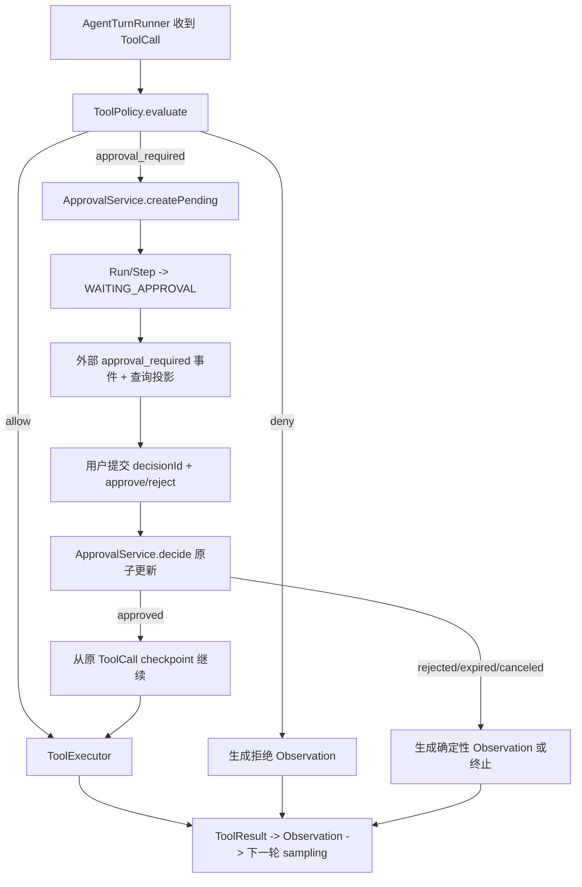

# Phase 05：Human-in-the-loop 与可审计审批

> 模块分类：**Core**。当前项目中期需要业务审批；Guardian 与 OS sandbox 目前只需理解控制权。

## 1. 阶段问题

> 当模型提出一个可能修改业务数据或触发外部副作用的 Tool Call 时，系统怎样在不信任模型、不丢失运行状态、也不重复执行动作的前提下，把决定权交还给用户？

本阶段把阶段 04 已经可靠运行的 Tool loop，从“系统自动执行低风险工具”升级为“系统先评估风险，必要时创建审批资源，等待明确决策，再从同一个 `toolCallId` 继续”。核心不是做一个确认弹窗，而是建立一条可持久化、可重放、可审计的控制链。

## 2. 在总路线中的位置

```text
Phase 04 工具可靠性与运行记录
  -> Phase 05 Human-in-the-loop
  -> Phase 06 Context 工程
  -> Phase 07 Durable Execution 与通用恢复
```

Phase 05 会实现一个“等待审批后继续”的最小 checkpoint，但不把它扩张成通用工作流引擎。Phase 07 再把这里学到的 checkpoint、幂等和恢复原则推广到进程崩溃、工具重试和僵尸 Run 清理。

## 3. 学习目标

完成本阶段后，应能用自己的话解释并用测试证明：

1. Authentication、Authorization、Tool Policy、Approval、Isolation 分别解决什么问题。
2. 风险等级来自服务端工具定义和解析后的参数，模型不能自行声明“安全”。
3. `allow / approval_required / deny` 是策略结果，不是工具实现里的零散 `if`。
4. Approval 是一个有 ID、有状态、有过期时间的业务资源，不是一段临时 UI 状态。
5. 前端只提交 decision，不回传权威工具参数；后端必须从数据库重载原始 Tool Call。
6. 同一个 approval 的重复 decision 请求为什么必须幂等。
7. 批准只授权一次具体调用，不默认授权同名工具的未来调用。
8. reject、expire、cancel 与 tool failure 的语义不同，最终 Run/Step 状态也应不同。
9. HTTP 流不能被无限挂起等待用户；等待状态必须成为可查询的 canonical fact。
10. 当前云端 SEO Agent 应优先做业务授权、租户隔离、超时和审计，而不是照搬 Codex 的 OS sandbox。

## 4. 前置条件

只有以下证据已经成立，才进入本阶段实现：

- [ ] Phase 02 已有稳定的 `ToolDefinition / ToolCall / ToolResult`，并包含最小风险元数据。
- [ ] Phase 03 已证明 observation 会进入第二轮 sampling，而不是工具执行后直接结束 Run。
- [ ] Phase 04 已有 tool step、timeout、cancel、错误分类和 loop budget。
- [ ] 工具执行器能接收 `AbortSignal`，且用户取消不会被当成普通失败。
- [ ] `toolCallId` 在 provider adapter、runtime、step 和 observation 之间保持一致。
- [ ] 至少一个只读、无副作用工具被策略自动允许。
- [ ] 测试中可注入 fake model、fake tool 和 fake clock。
- [ ] Run/Step/Message 的终态一致性已有自动化测试。

若这些条件尚未满足，不应靠审批 UI 掩盖 Tool loop 基础不稳的问题。

## 5. 当前项目起点

### 5.1 已有基础

| 当前能力 | 真实入口 | 可复用价值 |
| --- | --- | --- |
| 一次输入对应一个 Run | `apps/api/src/agent-runtime/agent-runtime.service.ts` | 审批可绑定 `runId` |
| Run/Step 持久化 | `apps/api/src/agent-runtime/agent-run-recorder.service.ts` | 可新增 policy/approval/tool step |
| 用户可见 Message 与 Step 分离 | `prisma/schema.prisma` | 审批过程不必伪装成聊天气泡 |
| 内部事件映射到外部事件 | `agent-runtime.types.ts`、`seo-chat-stream-event.mapper.ts` | 先增加内部事件，再决定前端协议 |
| 浏览器断开传递 AbortSignal | `seo.controller.ts` | 可区分取消与审批等待 |
| 前端有稳定的流状态入口 | `apps/web/src/hooks/useSeoWorkspace.ts` | 可增加 approval 状态，而不把策略放进组件 |

### 5.2 当前缺口

- Prisma 中没有 `ApprovalRequest` 或同等 durable resource。
- `AgentRunStatus` / `AgentStepStatus` 不能表达等待审批。
- 当前外部 `ChatStreamEvent` 只有 `start/delta/done/error/aborted`。
- Controller 与 service 没有审批查询、决策和继续运行入口。
- 项目没有身份与租户边界；第一版至少要避免相信前端传入的资源 scope。
- 当前同步 `SeoService.chat()` 绕开 `AgentRuntimeService`；审批能力不能再复制一条同步实现。
- 前端只有请求级 `AbortController`，刷新页面后不能恢复等待中的决定。

## 6. 从 Codex 学什么

Codex 的关键启发不是审批弹窗长什么样，而是把安全流程拆成独立职责：

```text
tool call
  -> policy / permission decision
  -> approval request（如需要）
  -> decision
  -> isolation / execution boundary
  -> classified result
  -> observation
```

值得吸收的设计不变量：

- 先判断是否需要批准，再执行副作用。
- request 和 response 都有稳定 ID，可在运行期间异步到达。
- deny、timeout、abort 是显式 decision，而不是异常字符串。
- 审批逻辑与具体 shell/tool handler 分开。
- 运行中断可以打断等待审批。
- 对**仍加载且仍在运行的 Thread**，重新订阅时可以把进程内 pending approval request 再投影给客户端；这不是 rollout 已持久化审批，也不证明 cold resume 能恢复 waiter。

这条边界很重要：Codex 当前测试覆盖的是 running Thread 的内存 pending request replay。当前云端项目需要跨进程、跨部署恢复，所以必须额外把 Approval 建成 PostgreSQL canonical resource，不能把 Codex 的运行中重放误写成 durable approval recovery。

不应照搬的部分：

- 不复制 shell command、patch permission、macOS/Linux sandbox profile。
- 不复制“本 session 永久允许”作为第一版功能。
- 不把本地用户身份等同于云端服务的 tenant/user scope。
- 不在本阶段引入通用策略 DSL、规则编辑器或第三方 policy engine。

## 7. 需要掌握的概念边界

| 概念 | 回答的问题 | 当前项目最小实现 |
| --- | --- | --- |
| Authentication | 调用者是谁？ | 后续真实 auth；本阶段接口仍保留 server-side actor 边界 |
| Authorization | 该 actor 能否访问这次 Conversation/Run？ | 所有查询从服务端 scope 过滤，不信任 body 中的 userId |
| Tool Policy | 这次已解析的调用应 allow、审批还是 deny？ | 纯函数 `ToolPolicy.evaluate()` |
| Approval | 用户是否同意这一次具体副作用？ | durable `ApprovalRequest` + decision API |
| Isolation | 即使获批，执行环境如何限制损害？ | timeout、域名 allowlist、凭证隔离、响应上限 |
| Audit | 事后能否说明谁在何时批准了什么？ | 参数摘要、actor、时间、结果，不保存 secret |

## 8. 目标架构



### 8.1 建议模块职责

```text
apps/api/src/tool-policy/
  tool-policy.types.ts       # 风险与 policy decision
  tool-policy.service.ts     # 纯策略判断；无 Prisma、无 UI

apps/api/src/approvals/
  approvals.controller.ts    # 查询与 decision 协议门面
  approvals.service.ts       # 状态机、幂等、过期、actor 审计
  approval-resume.service.ts # 从已持久化 checkpoint 继续一次调用

apps/api/src/agent-runtime/
  ...                        # 只消费 policy/approval 结果并驱动 Run
```

目录名是建议，不是强制答案。职责边界和测试证据比文件名重要。

## 9. 最小领域类型

以下 TypeScript 只表达学习目标，不要求逐字复制：

```ts
interface ToolRiskMetadata {
  level: 'low' | 'medium' | 'high'
  sideEffect: 'none' | 'external_write'
  network: boolean
}

type ToolPolicyDecision
  = { type: 'allow'; reasonCode: string }
  | { type: 'approval_required'; reasonCode: string; actionSummary: string }
  | { type: 'deny'; reasonCode: string; userMessage: string }

type ApprovalStatus = 'PENDING' | 'APPROVED' | 'REJECTED' | 'EXPIRED' | 'CANCELED'
type ApprovalDecision = 'APPROVE' | 'REJECT'
```

关键约束：

- `ToolRiskMetadata` 沿用 Phase 02 已落下的同一份 contract：`level / sideEffect / network`，字段名、大小写和值域都不能在本阶段另起一套。
- `requiresApproval` 不是模型可见 metadata，也不是第二个权威布尔值；是否审批由 `ToolPolicy` 根据 risk metadata、已验证参数和 actor scope 计算。若未来确实要细分 reversible/irreversible，应先迁移 Phase 02 的共享 contract，而不是只在 Phase 05 局部扩枚举。
- policy 可以读取“已经通过 schema 校验的参数”，不能直接信任 provider 的原始 JSON 字符串。
- `actionSummary` 是脱敏后的用户可读摘要，不是完整 arguments。
- `reasonCode` 稳定用于测试、指标和 UI 文案映射。

## 10. ApprovalRequest 持久化设计

建议最小字段：

| 字段 | 目的 | 约束 |
| --- | --- | --- |
| `id` | approval resource ID | 服务端生成 |
| `conversationId` | 权限查询与投影 | 必须和 Run 一致 |
| `runId` | 关联一次运行 | 必填 |
| `stepId` | 关联等待中的 step | 建议必填 |
| `toolCallId` | 绑定一次具体调用 | 唯一或与 run 组成唯一键 |
| `toolName` | 展示与审计 | 从 ToolCall 复制，不信任客户端 |
| `arguments` | 继续运行所需 canonical input | 加密/脱敏策略需明确 |
| `actionSummary` | 给用户看的摘要 | 不含 secret |
| `risk` / `reasonCode` | 解释为何审批 | `risk` 快照保持 Phase 02 的 `{ level, sideEffect, network }` 形状，reason 来自服务端 policy |
| `status` | PENDING 到终态 | 原子条件更新 |
| `expiresAt` | 防止永久等待 | fake clock 可测 |
| `decidedBy` / `decidedAt` | 审计 | 只有终态填写 |
| `decisionId` | 请求幂等 | 同一 decision 重放返回相同结果 |
| `createdAt` / `updatedAt` | 查询排序 | 标准审计字段 |

不要把原始 access token、API Key、完整网页隐私内容放进 `arguments` 或 `actionSummary`。如果工具需要 secret，只保存 secret reference，执行时由服务端重新解析。

## 11. 状态机

### 11.1 Approval 状态机

```text
PENDING -> APPROVED
PENDING -> REJECTED
PENDING -> EXPIRED
PENDING -> CANCELED
```

任何终态都不能再变为另一个终态。重复提交相同 `decisionId` 返回已有结果；不同 `decisionId` 试图改变终态返回稳定冲突错误。

### 11.2 Run / Step 状态

本阶段推荐显式增加 `WAITING_APPROVAL`，否则外部只能从一条 PENDING approval 猜测 Run 为什么仍为 RUNNING。

```text
Run: RUNNING -> WAITING_APPROVAL -> RUNNING -> COMPLETED
                         |-> ABORTED
                         |-> FAILED（只用于系统失败，不用于用户拒绝）

Tool Step: RUNNING -> WAITING_APPROVAL -> RUNNING -> COMPLETED
                                  |-> ABORTED
```

对“用户拒绝后 Run 是否失败”必须先做产品决定。推荐第一版把拒绝转换为结构化 observation，让模型解释未执行原因并正常完成；如果业务要求立即结束，也应使用独立 reason code，不能伪装成 provider failure。

## 12. 一次完整时序

1. 模型输出 `ToolCall(callId=C1, name=publishSeoDraft, args=...)`。
2. Router 完成 JSON 拼接和 runtime schema 校验。
3. `ToolPolicy` 基于 definition、已解析参数和服务端 actor scope 返回 `approval_required`。
4. 在一个事务中创建 `ApprovalRequest(PENDING)`，并把 Run/Step 更新为 `WAITING_APPROVAL`。
5. Runtime 发出内部 `approval_required`；mapper 再决定外部字段。
6. 当前 NDJSON 请求结束，前端保存 `approvalId`，页面刷新后也可重新查询。
7. 用户提交 `{ decision: 'APPROVE', decisionId }`。
8. 后端验证 actor 能访问 approval，重新加载原 ToolCall；不接受客户端回传的工具参数。
9. 条件更新 `PENDING -> APPROVED`；随后用独立、可持久化的 execution claim（至少 `toolCallId` 唯一键/状态 CAS，Phase 07 再升级为 ToolExecution lease）取得一次执行资格。`APPROVED` 本身不等于“工具已经执行”。
10. Executor 执行原调用，记录 result/observation，继续第二轮 sampling；若进程在“批准已提交、执行结果未提交”之间崩溃，只能依据 execution fact 与工具幂等能力恢复，不能凭 Approval 状态盲目重做。
11. 重复的同一 decision 请求只返回当前执行/最终状态，不重复调用工具。

## 13. API 与外部事件建议

### 13.1 查询

```text
GET /api/agent-runs/:runId/approvals
GET /api/approvals/:approvalId
```

### 13.2 决策

```text
POST /api/approvals/:approvalId/decision
{
  "decision": "APPROVE",
  "decisionId": "client-generated-id"
}
```

### 13.3 Stream contract

这是第一次 UI 必须知道内部工具等待状态，可以在现有 union 上向后兼容地增加：

```ts
interface ChatStreamApprovalRequiredEvent {
  type: 'approval_required'
  conversationId: string
  runId: string
  approvalId: string
  toolName: string
  actionSummary: string
  expiresAt: string
}
```

事件只携带展示和查询需要的字段，不暴露完整 arguments、secret 或内部 policy 细节。前端收到事件后应以服务端查询结果为准，而不是永远相信内存状态。

## 14. 前端学习边界

建议组件/状态职责：

- `useSeoWorkspace`：保存当前 `runId/approvalId`，调用查询/decision API，处理刷新恢复。
- `ApprovalCard`：只渲染 action summary、过期时间、批准/拒绝按钮和提交状态。
- API 层：解析 `approval_required`，提交 decisionId，处理 409/410 等稳定错误。
- 页面：组合，不写 policy，不重新拼 ToolCall。

必须覆盖的 UX：

- 提交 decision 时按钮禁用，避免双击。
- 重复请求返回已有状态时，界面收敛到 canonical state。
- 审批已过期显示“已过期”，不再允许批准。
- 另一个标签页已决定时，当前页面刷新为终态。
- 用户取消 Run 后，审批卡片显示 canceled。
- action summary 可读但不泄漏 secret。

## 15. 任务拆解

### Task 05.1：风险 contract

- 定义 risk level、side effect 和稳定 reason code。
- 给现有工具 definition 增加 metadata。
- 用纯单元测试证明模型参数不能覆盖服务端 metadata。

### Task 05.2：ToolPolicy

- 输入只包含已验证 ToolCall、definition 和 server-side actor scope。
- 输出严格为 allow / approval_required / deny。
- 覆盖低风险自动允许、写操作需要审批、禁止资源直接拒绝。

### Task 05.3：Approval 数据模型与 store

- 增加 approval 状态和唯一性约束。
- 创建/查询/终态更新都通过集中 service/store。
- 先写并发 decision 测试，再决定事务或 optimistic update 方式。

### Task 05.4：Runtime checkpoint

- policy 要求审批时，持久化 ToolCall 和 approval。
- Run/Step 进入明确 waiting 状态。
- 当前流返回 `approval_required`，不让 HTTP 连接无限等待。

### Task 05.5：Decision 与继续

- 后端重载 canonical ToolCall。
- approve 只取得一次执行权。
- reject/expire/cancel 产生确定性结果。
- observation 继续进入下一轮 sampling。

### Task 05.6：前端确认体验

- 加入 approval event、API 与 UI 卡片。
- 页面刷新后可查询待审批项。
- 双击、过期、其他标签页已决定均能正确收敛。

### Task 05.7：审计与脱敏

- 记录 actor、时间、tool name、参数摘要、decision 和执行结果。
- 明确完整 arguments 的保存策略。
- 日志、事件和 Step output 均不写 secret。

### Task 05.8：阶段收口

- 用 fake clock、fake tool、并发请求完成测试矩阵。
- 记录一条 approve、一条 reject、一条 expire、一条 cancel 的证据。
- 将真正执行任务落到 `docs/tasks/`，再更新 progress tracker。

## 16. 明确非目标

本阶段不做：

- OS 级 sandbox、shell 命令权限或任意代码执行。
- 完整 RBAC/ABAC 管理后台。
- 通用 policy DSL 或 Open Policy Agent 集成。
- “永远允许此工具”“对整个租户永久允许”等持久规则。
- 多级审批、会签、审批转交。
- 邮件、Slack 等外部审批通知。
- 分布式工作流引擎、队列和多 worker lease。
- Multi-agent 的跨 Agent 审批继承。
- 把模型的自然语言“用户已经同意”当成真实授权。

## 17. 风险与防错

| 风险 | 失败表现 | 防线 |
| --- | --- | --- |
| TOCTOU | 审批后工具参数或资源已变化 | approval 绑定 canonical args；执行前重新授权 |
| 双击批准 | 写操作执行两次 | decisionId + 条件更新 + tool idempotency key |
| 流断开 | 用户看不到 approval | approval 先落库，事件只是投影 |
| 参数泄漏 | secret 出现在 UI/日志 | action summary 独立生成，字段级脱敏 |
| 永久等待 | Run 长期 WAITING | expiresAt + lazy/scheduled expiry |
| 取消竞态 | cancel 后仍执行工具 | 决策与取消争夺一次性状态迁移；executor 检查 signal/state |
| 批准后进程崩溃 | APPROVED 被误当作已执行，或恢复时重复副作用 | Approval 与 ToolExecution 分开；持久 execution claim/result；无幂等/查询能力时进入人工核对，Phase 07 覆盖完整 crash matrix |
| 身份伪造 | 前端传 tenantId 越权 | 服务端身份与 scope；body 不作为权威来源 |
| 将 reject 当异常 | 指标污染、用户文案错误 | 独立 decision/result code |

## 18. 退出标准

只有以下全部有自动化或运行证据，Phase 05 才算完成：

- [ ] 一个低风险只读工具自动执行且不创建 approval。
- [ ] 一个写/外部副作用工具必定创建 `PENDING` approval，执行前没有副作用。
- [ ] `approval_required` 事件可被前端解析，刷新后仍能从 API 查询。
- [ ] approve 后执行原始 `toolCallId`，observation 进入下一轮 sampling。
- [ ] reject 后工具从未执行，Run 按约定正常收口。
- [ ] expire 后无法再 approve，返回稳定错误码。
- [ ] cancel 后 approval 与 Run/Step 状态一致，工具不在后台继续。
- [ ] 相同 decisionId 重放不重复执行；冲突 decision 被拒绝。
- [ ] 前端没有回传或修改权威 Tool arguments。
- [ ] action summary、日志、Step input/output 不泄漏测试 secret。
- [ ] Run、Step、Approval、ToolCall 的关联可通过 ID 完整查询。
- [ ] 测试与文档明确 `APPROVED != EXECUTED`；批准提交后崩溃的剩余风险、幂等前提和 Phase 07 接力点已记录，未宣称 exactly-once。
- [ ] typecheck、lint、单元、集成和 contract tests 全部通过。

## 19. 阶段产物

- 风险与审批领域类型。
- `ToolPolicy` 纯策略边界。
- Approval durable resource 与状态机。
- 等待审批 checkpoint 和最小继续入口。
- `approval_required` 外部 contract 与 Vue confirmation UX。
- approve/reject/expire/cancel/duplicate decision 测试。
- 一份不照搬 Codex sandbox 的云端取舍记录。

## 20. 进入下一阶段前的复盘

进入 Phase 06 前，应能回答：

1. 为什么 approval event 不是 canonical fact？
2. 为什么批准后还要重新做 authorization？
3. 为什么同名工具的下一次调用不能复用本次批准？
4. 用户拒绝是否应该让 Run FAILED？当前选择的理由是什么？
5. 如果 action summary 与真实参数不一致，系统以哪个为准，如何防止误导？
6. 浏览器关闭后，系统通过哪些数据库字段知道 Run 正在等待什么？
