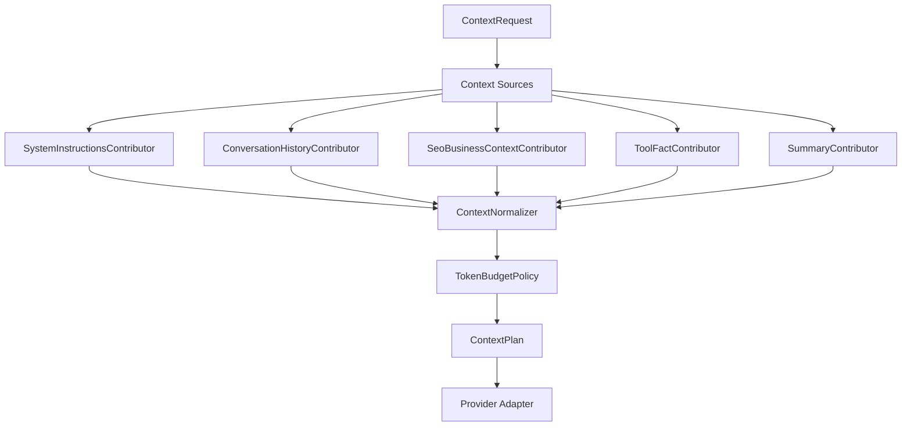

# Phase 06：Context 工程、预算、规范化与压缩

## 1. 阶段问题

> 当会话、工具结果和业务资料持续增长时，系统如何构造一份合法、可解释、受 token 预算约束的 model history，而不是简单截取最近 12 条消息？

Context 工程不是“把更多内容塞给模型”。它是一个受约束的投影过程：从 UI 消息、运行事实、工具 observation、业务资料和摘要中，选择模型本轮真正需要看到的项目，并保证顺序、call/output 配对、预算与来源可解释。

## 2. 路线位置

```text
Phase 03 单 Agent Tool loop
  -> Phase 04 工具可靠性
  -> Phase 05 Approval facts
  -> Phase 06 Context 工程
  -> Phase 07 Durable recovery
```

Phase 05 与本阶段部分可并行：风险策略与 Approval 数据模型可以先做；但在把 denial/approval/tool observation 纳入模型历史前，必须完成本阶段的 model item 与 normalization 设计。

## 3. 学习目标

完成后应能解释和证明：

1. UI transcript、model history、runtime event、persistent fact 是四种不同数据。
2. 为什么当前 `Message[] -> ChatMessage[]` 无法合法表达 tool call / observation。
3. ContextBuilder 为什么应输出“模型输入计划 + 预算报告”，而不只是数组。
4. system instructions、summary、recent history、business context、tool output、current input 的优先级如何确定。
5. token 数通常是估算值，如何保守分配 completion reserve 和 safety margin。
6. 每个 ToolCall 必须有对应 Observation，孤立 output 必须拒绝或修复。
7. 过大 tool output 为什么应先结构化裁剪/摘要，再进入 model history。
8. Compaction 是 runtime 能力，不是 UI 删除历史；摘要也不是原始事实的替代品。
9. 摘要如何记录来源范围、版本、生成模型和可替换状态。
10. 压缩失败为什么不能破坏原 conversation 或当前 Run。

## 4. 前置条件

- [ ] Phase 00 已有测试 runner、fake model 与固定时钟/fixture 能力。
- [ ] Phase 01 已有 provider-neutral `ModelStreamEvent`。
- [ ] Phase 02/03 已定义 ToolCall 与 ToolResult/Observation，并完成第二轮 sampling。
- [ ] ToolCall/Observation 使用稳定 `callId`。
- [ ] Phase 04 已限制 tool output 大小或至少有明确上限策略。
- [ ] 已明确哪些 Message 状态可以进入历史：COMPLETED、ABORTED、FAILED 如何处理。
- [ ] 同步 `chat()` 与 streaming 路径是否合并已有计划，不能长期维护两套 Context 规则。

## 5. 当前项目证据

### 5.1 已有良好起点

| 能力 | 文件 | 价值 |
| --- | --- | --- |
| SEO prompt 集中 | `apps/api/src/seo/prompts/seo-agent.prompt.ts` | system instruction 没散落在 Controller |
| Context 有独立 service | `apps/api/src/seo/seo-context-builder.service.ts` | 可演进为 domain contributor |
| Runtime 接收 builder callback | `agent-runtime.types.ts` | 已有解耦雏形 |
| Message 与 Run/Step 分离 | `prisma/schema.prisma` | 能区分 UI 与执行事实 |
| Tool/Approval 后续会有独立事实 | Phase 02-05 | 可以构造合法 model items |

### 5.2 当前限制

- `ChatMessage` 只有 `system/user/assistant + string content`。
- `SeoContextBuilder` 只调用 `buildSeoAgentChatMessages(historyMessages)`。
- `SeoService` 固定 `CHAT_HISTORY_LIMIT = 12`，不看 token 和内容重要性。
- `AgentRuntimeService.listRecentChatMessages()` 只读取 Message，不读取 ToolCall、Observation、Summary。
- 当前用户消息先落库，再从 recent list 读取，容易在未来 builder 重构时重复加入 current input。
- `MessageStatus.STREAMING/FAILED/ABORTED` 是否进入 model history 没有明确规则。
- 同步 `SeoService.chat()` 与流式 `chatStream()` 仍有两条运行路径。
- 没有 prompt version、context source、estimated token、truncation reason 或 compaction 记录。

## 6. Codex 带来的设计启发

Codex 的 `ContextManager` 不是简单数组，它承担：

- record model-visible items。
- 发模型前 normalization。
- call/output 配对修复。
- 不支持模态过滤。
- 过大 output 截断。
- token 估算。
- rollback 后基线修复。
- compaction 后替换 model-visible history。

值得迁移的是不变量与职责，不是 Rust 的 `ResponseItem` 全量类型。当前项目只需定义适合 SEO Agent 的最小 item union。

## 7. 四层数据必须分开

| 层 | 示例 | 谁消费 | 是否全部持久化 |
| --- | --- | --- | --- |
| UI transcript | 用户气泡、最终 assistant 文本 | Vue / 用户 | Message 持久化 |
| Model history | system、user、assistant、tool call、observation、summary | Model gateway | 从事实投影，可缓存但非唯一事实源 |
| Runtime event | delta、tool started、approval required | Mapper / stream | 高频事件不全落库 |
| Persistent fact | Message、Run、Step、ToolCall、Approval、Summary metadata | Recovery / audit | 选择性持久化 |

错误设计示例：

- 把 tool output 拼成一条 assistant 文本气泡。
- 把 system prompt 存成用户 Message。
- 为每个文本 delta 建数据库行。
- 直接把数据库所有 Message 原样发送给 provider。
- 用摘要覆盖或删除原始审计事实。

## 8. 最小 ModelInputItem

建议用项目自己的 discriminated union，而不是让 OpenAI SDK 类型进入 Runtime：

```ts
type ModelInputItem
  = { type: 'system'; content: string; source: string }
  | { type: 'user_message'; messageId: string; content: string }
  | { type: 'assistant_message'; messageId: string; content: string }
  | { type: 'tool_call'; toolCallId: string; callId: string; name: string; arguments: unknown }
  | { type: 'tool_observation'; observationId: string; toolResultId: string; callId: string; content: string; isError: boolean }
  | { type: 'summary'; summaryId: string; content: string; sourceUntilItemSequence: number }
  | { type: 'business_context'; sourceId: string; content: string; priority: number }
```

Provider adapter 再把这些 item 映射成对应 SDK 的 messages/input。这样：

- Runtime 不依赖 OpenAI chunk/message shape。
- call/output pairing 可以在 provider 之前验证。
- 不同 provider 的模态/工具格式由 adapter 处理。
- Context 单元测试只断言项目自有类型。

### 8.1 ToolCall 与 Observation 必须是可重建事实

`ModelInputItem` 只是本轮投影；它的工具分支必须来自数据库中的 canonical records，而不是旧 runtime 的数组、闭包或已拼好的 SDK message：

```text
ToolCallFact(id, runId, turnId, callId, name, validatedArguments, itemSequence)
ToolResultFact(id, toolCallId, executionId, status, outputRef/projectableOutput)
ObservationFact(id, toolCallId, toolResultId, callId, content/projectorVersion, itemSequence)
```

最小约束：

- ToolCall 在执行前持久化；Observation 在 ToolResult 已有事实后持久化。
- `callId` 用于 provider 配对，数据库主键用于审计关联；二者不要混为一个偶然字符串。
- `(turnId, itemSequence)` 唯一且严格递增，表达一次 Turn 内真正的 item stream。
- builder 从数据库读取 facts 后按 item sequence 投影；不能先按“message/tool”分类再拼接，从而改变模型真实看到的发生顺序。
- 仅在旧 runtime 仍存活时能找到的 ToolCall/Observation 不算完成本阶段。

若摘要需要覆盖多个 Turn，再为 conversation history 分配单调的 `conversationItemSequence`；下面 Summary 的 source range 使用这个 item sequence。Phase 08 的 `RunEvent.sequence` 是 observation/replay 序号，不能拿来代替 model-history item sequence。

## 9. ContextPlan：结果不只是数组

建议 builder 返回：

```ts
interface ContextPlan {
  items: ModelInputItem[]
  budget: {
    contextWindow: number
    reservedForCompletion: number
    safetyMargin: number
    inputLimit: number
    estimatedInputTokens: number
  }
  sources: Array<{
    kind: string
    id: string
    estimatedTokens: number
    decision: 'included' | 'truncated' | 'summarized' | 'excluded'
    reasonCode: string
  }>
  promptVersion: string
  summaryId?: string
}
```

这份 plan 让测试、trace 和调试可以回答“为什么模型看到了这些、没有看到那些”。它不需要完整暴露给前端。

## 10. ContextBuilder 分层



建议职责：

- `AgentContextBuilder`：编排 sources、normalizer 和 budget。
- `SeoContextContributor`：只提供 SEO 业务 prompt/资料，不拥有通用 history 规则。
- `ContextNormalizer`：顺序、配对、状态过滤、模态兼容。
- `TokenEstimator`：可替换估算接口；不假装绝对精确。
- `ContextBudgetPolicy`：分配额度并选择 include/truncate/summary。
- `ContextSummaryService`：在触发时创建可追踪摘要。

第一版可以仍在较少文件中实现，但上述职责必须在类型和测试中可辨认。

## 11. 输入与顺序规则

建议初始顺序分为两层：

```text
外层固定前缀：system/developer instructions
历史起点：有效 active summary（若有）
动态事实：必要业务约束/当前 SEO 资源事实
历史主体：summary 边界之后的 Turn，Turn 间按 conversation sequence，Turn 内按 itemSequence 原顺序
当前输入：作为当前 Turn item，恰好一次
```

业务 context 插在 summary 与 history 之间还是作为 system/developer item，需要用 provider contract 与评测决定；但不得因此重排历史 Turn 内 item stream。不可变要求是：

- 当前输入恰好一次。
- call 在对应 observation 之前。
- 不拆散一个 call/output pair。
- 同一 Turn 中的 user/assistant/tool call/observation 按 canonical `itemSequence` 保序，不因类型分组而移动。
- system instruction 不被低优先级 history 挤掉。
- summary 与其已覆盖的原始 model history 不重复发送。
- 等待审批但尚无 observation 的 ToolCall 不触发下一轮 sampling；审批状态从当前 canonical Approval projection 读取，不从旧 summary 推断。真正继续前先产生拒绝/取消 observation，或批准后执行得到 observation。

## 12. Token 预算模型

### 12.1 预算公式

```text
inputLimit
  = modelContextWindow
  - reservedForCompletion
  - providerFixedOverhead
  - safetyMargin
```

再在 `inputLimit` 中分配：

```text
system + currentInput          必保留
toolCall/observation pairs     当前 Turn 必保留，过大 output 可裁剪
business critical facts       高优先
active summary                高优先
recent history                从近到远选择完整 Turn
optional enrichment           最先丢弃
```

### 12.2 不要追求伪精确

- Provider 返回实际 usage 时记录实际值。
- 构建前可以用 tokenizer 或保守字符估算。
- 估算失败时使用保守 fallback，不允许无限输入。
- 预留 completion token，避免把窗口全部占满。
- tool schema、response formatting 等 provider overhead 也要有 safety margin。

### 12.3 预算结果要可解释

每个 source 记录：估算 token、是否纳入、是否截断、reasonCode。不要只记录总数，否则无法诊断回答为什么忽略了某条关键资料。

## 13. History normalization 不变量

### 13.1 Message 状态

建议第一版规则：

- `COMPLETED`：可进入历史。
- `ABORTED` assistant：只有内容非空且产品明确需要时，作为带标记的可见文本；默认不当作可靠完成答案。
- `FAILED` assistant：错误兜底文案不应作为模型事实，默认排除。
- `STREAMING/PENDING`：排除，除非正在恢复同一 Run 且有专门 checkpoint。

### 13.2 Tool pairing

- 每个 observation 必须找到先前同 `callId` 的 ToolCall。
- 每个需要进入下一轮的 ToolCall 必须有一个终结 observation，包括 error/denied/canceled。
- duplicate call/output 按稳定规则拒绝，不静默覆盖。
- 裁剪历史时以 pair 或完整 Turn 为单位，不能只裁一半。

### 13.3 模态和大小

- provider 不支持的图片/结构化模态在 adapter 前被明确转换或排除。
- 大 tool output 先提取业务需要字段，再做字符/token 上限。
- 截断结果必须带 `truncated=true` 或明确标记，不能假装完整。
- 原始大结果可保留引用，model history 只放受限 observation。

## 14. Compaction 设计

### 14.1 先定义触发，再定义算法

可选触发条件：

- 构建后预计输入超过 `inputLimit`。
- recent history 可用预算低于设定阈值。
- tool outputs 连续占用过高比例。
- 手动调试触发（只用于测试/运维）。

不要因为“对话超过 12 条”就无条件摘要；条数与 token、信息密度没有稳定对应关系。

### 14.2 摘要必须保留什么

- 用户长期目标与当前任务。
- 已确认的业务事实和约束。
- 关键 SEO 对象、URL、关键词、语言/市场。
- 已执行工具及重要结论，而不是所有原始输出。
- 未完成动作和 approval/toolCall 引用；审批当前状态必须在 build 时读取 canonical projection，不能固化进摘要文本。
- 用户明确拒绝或取消的动作。
- 来源边界和不确定性。

摘要不能编造新事实，也不能把失败的工具结果写成成功。

### 14.3 建议 Summary 元数据

| 字段 | 用途 |
| --- | --- |
| `id` / `conversationId` | 身份与归属 |
| `content` | model-visible summary |
| `sourceFromItemSequence` / `sourceUntilItemSequence` | 覆盖 conversation item stream 的闭区间；不能只用 Message ID，因为范围内还包含 ToolCall/Observation |
| `sourceRunIds` | 关键运行来源（可选） |
| `promptVersion` / `model` | 可复现性 |
| `estimatedTokens` | 预算 |
| `status` | ACTIVE/SUPERSEDED/FAILED |
| `createdAt` | 审计 |

原始 Message/Run/Step 不因 summary 创建而删除。新的 summary 可 supersede 旧版本。

Approval 的 `PENDING/APPROVED/...` 是会变化的 workflow projection，不应被固化为“当前状态”写进长期 summary。摘要可以保留“存在未完成发布意图”和 `approvalId/toolCallId` 引用，但每次 build 都必须在 summary 之后叠加最新 canonical Approval 状态；一旦 decision 变化，旧 summary 不能继续声称 pending 或 approved。终态 decision 若确实影响后续模型，应从不可变 decision/observation fact 投影，而不是相信摘要里的旧形容词。

### 14.4 原子替换

压缩流程建议：

1. 在一致 snapshot 中读取 `[sourceFromItemSequence, sourceUntilItemSequence]`，记录边界版本；范围覆盖 Message、ToolCall、Observation 等 model-visible canonical items。
2. 生成 candidate summary。
3. 校验必需事实和大小。
4. 在事务中写入新 summary，并将旧 active 标为 superseded。
5. 下一次 ContextPlan 才开始引用新 summary。

任何失败都保留旧 active summary/原历史，不把 conversation 留在半替换状态。

## 15. Context 与 Tool/Approval 的关系

| 事实 | 是否进入 UI Message | 是否进入 model history | 规则 |
| --- | --- | --- | --- |
| ToolCall | 否 | 是 | 必须与 observation 配对 |
| 成功 observation | 通常否 | 是 | 脱敏、受大小限制 |
| tool error | 可通过 UI 状态展示 | 是 | 结构化 isError，不能伪装结果 |
| approval pending | UI 卡片 | 不触发下一轮 sampling | 每次读取当前 Approval projection；不得仅靠 summary 固化状态 |
| approval rejected | UI 卡片/最终说明 | denial observation | 让模型知道动作未执行 |
| approval approved | 审计状态 | 不是独立内容 | 真正 tool result 才进入模型 |
| summary | 通常不显示成气泡 | 是 | 版本化、带来源 |

## 16. 建议任务拆解

### Task 06.1：数据分层与 model item contract

- 定义 `ModelInputItem`。
- 为 ToolCall/ToolResult/Observation 定义可持久、可按 item sequence 重建的 canonical facts。
- 明确 UI Message、Tool facts、Summary 到 model item 的 mapper。
- Provider adapter 支持 tool call/output，而 Runtime 不依赖 SDK 类型。

### Task 06.2：ContextNormalizer

- 实现 Message 状态过滤。
- 实现 call/output 配对与重复检查。
- 保证 current input 恰好一次。
- 同一 Turn 按 item sequence 保序，以完整 Turn/pair 为裁剪单位。

### Task 06.3：TokenEstimator 与预算策略

- 建立可注入 estimator。
- 定义 context window、completion reserve、safety margin。
- 输出 source decision report。
- 先做确定性粗估，再根据真实 usage 校准。

### Task 06.4：Tool output 限制

- 为不同工具定义 observation projector。
- 限制字段、字符/token 与敏感内容。
- 保存 `truncated` 和原始结果引用策略。

### Task 06.5：统一 Context 入口

- streaming 和同步入口使用同一 AgentRuntime/ContextBuilder。
- `SeoContextBuilder` 降为业务 contributor。
- 删除或收口固定 `CHAT_HISTORY_LIMIT` 的唯一规则。

### Task 06.6：Compaction 实验

- 先实现 fake summarizer 和触发策略。
- 再做一个真实模型摘要实验。
- 摘要与原始事实分离，记录 source range/version。
- source range 使用 conversation item sequence；构建时从 canonical Approval overlay 最新可变状态，不把 pending 状态固化进 summary。
- 失败时继续使用旧 plan 或返回明确预算错误。

### Task 06.7：评测与收口

- 建立 long conversation、large tool output、pairing error fixtures。
- 比较“固定 12 条”与“预算 + summary”在固定 SEO 问题集上的结果。
- 记录实际 usage、遗漏事实和幻觉回归。

## 17. 明确非目标

- 不做向量数据库、语义检索或复杂 RAG。
- 不做无限长期记忆或用户画像系统。
- 不复制 Codex 全部 ResponseItem 与多模态逻辑。
- 不把所有数据库记录都发给模型。
- 不用 LangChain/LangGraph 代替理解 context boundary。
- 不追求所有 provider token 数完全一致。
- 不在没有触发/质量测试前自动删除历史。
- 不让摘要成为权限绕过：无权访问的原始事实也不能通过摘要泄漏。

## 18. 风险与防线

| 风险 | 表现 | 防线 |
| --- | --- | --- |
| current input 重复 | 模型重复回答/工具调用 | builder invariant test |
| call/output 被拆 | provider 拒绝或模型混乱 | pair normalization |
| summary 幻觉 | 错误事实长期传播 | 来源范围、评测、可替换版本 |
| summary 固化可变审批 | 已批准/拒绝后模型仍认为 pending | summary 只保存意图/引用；每次叠加 canonical Approval/decision/observation |
| Tool facts 只在内存 | 重启后第二轮 sampling 缺 call/output | ToolCall/Result/Observation 落库 + fresh-runtime DB rebuild test |
| item 类型分组重排 | observation 跑到错误 call/Turn 后 | `(turnId,itemSequence)` 唯一 + ordered projection test |
| tool output 挤满窗口 | system/用户目标丢失 | per-source budget + projector |
| 固定字符估算偏差 | context window exceeded | safety margin + actual usage 校准 |
| FAILED 文案进入历史 | 模型把错误当事实 | status filter |
| 两条 context 路径漂移 | sync/stream 行为不同 | 单一 builder/runtime |
| secret 进入 prompt | provider/日志泄漏 | source-level redaction |

## 19. 退出标准

- [ ] `ModelInputItem` 能合法表达 message、tool call、observation 和 summary。
- [ ] Runtime/Context 不依赖 OpenAI SDK 的具体 message/chunk 类型。
- [ ] ContextPlan 包含 items、预算、source decisions 和 prompt version。
- [ ] current input 恰好出现一次。
- [ ] call/output 配对、孤立 output、duplicate call 均有测试。
- [ ] ToolCall/ToolResult/Observation 是数据库 canonical facts；销毁旧 runtime 后，新 runtime 只读 DB 能重建同一有序 model input。
- [ ] 同一 Turn 的 model-visible items 按 canonical item sequence 保序，分类/裁剪不会重排。
- [ ] FAILED/STREAMING/PENDING Message 的规则有测试。
- [ ] system/current input 不会被低优先 history 挤掉。
- [ ] 大 tool output 被确定性投影、脱敏、截断并带标记。
- [ ] fixed 12 messages 不再是唯一预算规则。
- [ ] provider actual usage 可记录并与估算比较。
- [ ] compaction 触发、成功、失败、版本替换都有自动化测试。
- [ ] summary 用 item sequence 追踪覆盖范围，原始事实未被删除；可变 Approval 状态不被 summary 固化。
- [ ] 同步与 stream 使用同一 ContextBuilder/Runtime 规则。
- [ ] 长会话固定评测没有遗失核心 SEO 目标或伪造工具结果。

## 20. 阶段产物

- ModelInputItem 与 provider mapper。
- ContextNormalizer 和不变量测试。
- TokenEstimator / ContextBudgetPolicy / ContextPlan。
- SEO business contributor。
- Tool observation projector/truncation。
- versioned ContextSummary 实验。
- 长上下文 fixture、质量对比和预算报告。

## 21. 进入 Phase 07 前的复盘

1. 哪些 model-visible 数据能从数据库 canonical facts 重建？
2. summary 创建到一半崩溃时，旧 history 为什么仍然可用？
3. tool side effect 已发生但 observation 未写入时，ContextBuilder 能否安全恢复？
4. 哪些 ContextPlan 字段需要持久化，哪些可每次重算？
5. provider 实际 usage 与估算差异如何进入 Phase 09 指标？
6. 如果多 worker 同时 compact，同一 Conversation 如何避免两个 active summary？
