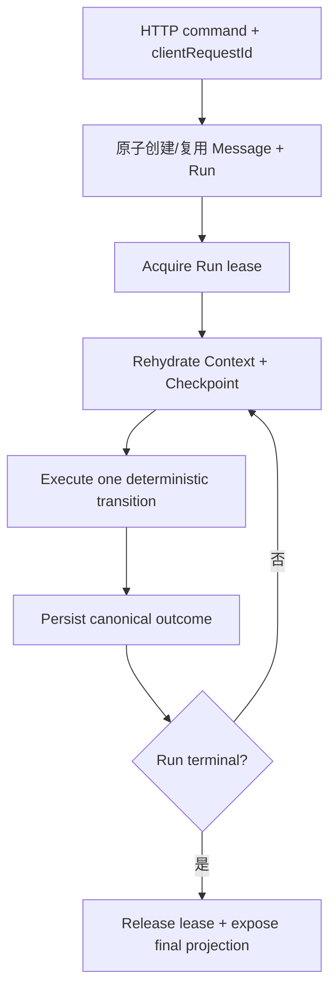

# Phase 07：Durable Execution、幂等与崩溃恢复

## 1. 阶段问题

> 当 API 进程在模型调用、工具执行、Observation 写入或最终 Message 落库之间崩溃时，系统如何从 PostgreSQL 判断“已经发生了什么、下一步能否安全继续、哪些动作绝不能重做”？

Durable Execution 不是把 JavaScript generator 序列化到数据库，也不是立刻引入队列。它要求在不可逆副作用之间建立 durable checkpoints，使新进程可以从 canonical facts 重建下一步，并用幂等、lease 和状态机避免重复工作。

## 2. 路线位置

```text
Phase 04 可靠 Tool loop
  + Phase 05 Approval checkpoint
  + Phase 06 可重建 Context
  -> Phase 07 Durable Execution
  -> Phase 08 并发、重连与 Resume
```

Phase 08 会在这里的 canonical state、lease 和恢复语义上增加 conversation 并发策略、客户端重连和显式 resume/cancel。没有 Phase 07，所谓 resume 只能是“再发一次请求”，很容易重复创建 Message 或重复副作用。

## 3. 学习目标

完成后应能解释并证明：

1. Durable fact、runtime event、checkpoint、snapshot、lease、heartbeat、idempotency key 的区别。
2. 为什么客户端请求重试与工具副作用重试需要两类不同幂等键。
3. 一个 Run 在哪些边界可以安全重建，而不是从任意代码行继续。
4. 为什么“工具成功但 Observation 未持久化”是最危险的 crash window。
5. 如何按工具声明 `PURE / IDEMPOTENT / REQUIRES_KEY / NON_RETRYABLE`。
6. stale `RUNNING` 不能永久存在，reconciler 如何分类为可继续或终止。
7. 为什么内存 `AbortController` 不是持久化取消事实。
8. API request、runtime execution 与 stream connection 的生命周期为何必须逐步解耦。
9. 何时 repository/store boundary 有真实价值，何时只是过早抽象。
10. 在满足哪些门槛后才值得引入 BullMQ、Redis 或 workflow engine。
11. 为什么“需要人工核对”必须是可查询、可解决的 durable workflow 状态，而不是 FAILED 行上的一个临时 boolean。

## 4. 前置条件

- [ ] Tool loop 每个 sampling/call/result/observation 有稳定 ID。
- [ ] Tool step 有 timeout、cancel 和结构化错误分类。
- [ ] 写/外部副作用工具已经有 Approval 与 risk policy。
- [ ] Context 可从 canonical Message/Tool/Summary facts 重建。
- [ ] Run/Step/Message 的状态机有自动化测试。
- [ ] Approval decision 与工具执行具备最小幂等设计。
- [ ] 已明确哪些 delta 不持久化，哪些 terminal facts 必须持久化。
- [ ] 测试可以在指定 checkpoint 抛出模拟 crash，并重新创建 service 实例。

## 5. 当前项目起点

### 5.1 可复用基础

- `Conversation / Message / AgentRun / AgentStep` 已落 PostgreSQL。
- `AgentRunRecorderService` 集中处理部分状态迁移。
- Message 创建/更新和 Conversation touch 已使用事务。
- 浏览器断开能传递 `AbortSignal`。
- `AgentRunStatus` 有 `RUNNING/COMPLETED/FAILED/ABORTED`。
- `AgentStep` 的 string `type` 允许扩展 sampling/tool/approval/checkpoint 步骤。

### 5.2 明显缺口

- 发送消息没有 `clientRequestId/idempotencyKey`。
- 创建用户 Message 与 AgentRun 虽在局部事务中完成，但整个请求重放会创建第二套事实。
- Run 没有 `failureCode`、`heartbeatAt`、`leaseOwner`、`leaseExpiresAt`、`version` 等恢复信息。
- 没有 `MANUAL_REVIEW` durable 状态、review case/原因/解决动作，也没有可供前端和运维查询的投影。
- 工具调用/结果的 canonical schema 需要由前序阶段补齐。
- 进程启动或定时任务没有扫描 stale `RUNNING`。
- 当前 abort 只在 HTTP 请求内存中存在；进程退出后没有 `cancelRequestedAt`。
- Runtime 直接使用 Prisma 查询/写入多个表，恢复逻辑继续增加后会散落事务边界。
- 没有“查询 Run 当前 checkpoint 并继续”的 application boundary。

## 6. 从 Codex 学什么

Codex 的 rollout 与 ThreadStore 说明：

- 并非所有事件都值得持久化；要筛选能恢复 Thread/Turn 的 canonical items。
- append、flush、load、resume 有明确边界。
- loaded runtime 与 persisted Thread 是不同对象。
- resume 从持久历史重建 Session，而不是恢复某个 future 的堆栈。
- fork/resume/interrupt 在历史边界上有不同语义。
- recorder 的失败、重试和幂等行为由专门测试保护。

需要准确限定：Codex app-server 对 pending command/file approval 的 replay 是**仍在运行、仍加载 Thread 的进程内 pending request 投影**，不是 rollout 中的 durable Approval，也不覆盖进程重启后的 cold recovery。云端项目的 Approval/ManualReview 必须自行落 PostgreSQL，不能从那两条 running-resume 测试推导出 durable workflow 已解决。

当前项目不复制 JSONL rollout。PostgreSQL 已经是 canonical store，应利用事务、唯一约束和查询能力。

## 7. Durable execution 的基本模型



关键规则：每次只从一个已持久化 checkpoint 执行到下一个 checkpoint。进程可以在任意时刻崩溃，但恢复器只需要理解有限状态，不需要理解任意堆栈位置。

## 8. 两层幂等

### 8.1 请求幂等

保护：网络重试/双击不会重复创建用户 Message 和 Run。

建议字段：

```text
clientRequestId
conversationId
requestFingerprint
runId
createdAt
```

约束建议：`@@unique([conversationId, clientRequestId])`。同 key + 同 fingerprint 返回原 Run；同 key + 不同 payload 返回 `IDEMPOTENCY_KEY_REUSED`，不能静默复用。

### 8.2 Tool 副作用幂等

保护：恢复/重试不会重复发布、写 CMS 或调用外部计费动作。

建议派生：

```text
toolExecutionKey = runId + toolCallId + attemptPurpose
```

这与 `clientRequestId` 不同：一个 Run 可以有多个 tool calls，每个副作用需要自己的 key。

## 9. Tool retry safety contract

```ts
type ToolRetrySafety =
  | 'PURE'
  | 'IDEMPOTENT'
  | 'REQUIRES_IDEMPOTENCY_KEY'
  | 'NON_RETRYABLE'
```

| 分类 | 示例 | crash 后策略 |
| --- | --- | --- |
| PURE | 本地纯计算 | 可重做 |
| IDEMPOTENT | 按资源 ID 的读取/覆盖 | 可有界重试，仍需测试 |
| REQUIRES_IDEMPOTENCY_KEY | 外部发布 API 支持 key | 使用原 key 查询/重试 |
| NON_RETRYABLE | 无查询能力的一次性动作 | 不自动重做，标记需人工核对 |

模型不能决定 retry safety。它来自 ToolDefinition/Executor 的服务端 contract。

## 10. 建议 checkpoint

| Checkpoint | 必须持久化的事实 | 安全继续方式 |
| --- | --- | --- |
| `RUN_CREATED` | request key、user Message、Run | 构建 context，开始 sampling |
| `SAMPLING_STARTED` | attempt ID、model/config/prompt version | 无 provider result 时可按 policy 重试 |
| `MODEL_ITEM_RECORDED` | final text 或 ToolCall | 不重复解释同一 provider item |
| `WAITING_APPROVAL` | ToolCall、Approval PENDING | 等 decision，不执行 |
| `TOOL_EXECUTION_STARTED` | execution key、attempt | 根据 retry safety 决定 |
| `TOOL_RESULT_RECORDED` | result status、output/reference | 不再重做工具，生成 observation |
| `OBSERVATION_RECORDED` | callId 对应 model item | 继续下一轮 sampling |
| `FINAL_MESSAGE_RECORDED` | final assistant Message | 只需收口 Run/Step |
| `RUN_TERMINAL` | status、endedAt、reason | 不再执行 |
| `MANUAL_REVIEW` | review case、未知边界、关联 execution/approval、待解决原因 | 自动执行冻结；等待人工 resolve/abort/reconcile command |

不是每个 checkpoint 都必须新建一张表；可以由 ToolCall/Execution/Step/Run 的组合推导。但必须有单一 reducer/recovery planner 能确定下一步。

## 11. Crash window 分析

| 崩溃位置 | 已知事实 | 恢复判断 |
| --- | --- | --- |
| user Message 前 | 无 | 客户端重试创建 |
| Message 已写、Run 未写 | 不允许出现 | 同事务创建或 reconciler 修复 |
| Run 已写、sampling 未开始 | RUN_CREATED | 可安全开始 |
| provider 请求中 | attempt started，无完成 item | 依据 provider/idempotency 与 retry policy；通常新 attempt |
| ToolCall 已写、审批未写 | policy 可重算 | 创建/复用 approval，不能执行写工具 |
| approval approved、工具未开始 | APPROVED + no execution | 领取 execution lease 后执行 |
| approval 已 APPROVED、进程在 execution claim 前崩溃 | 只有授权事实 | `APPROVED != EXECUTED`；创建/领取唯一 ToolExecution 后才能执行 |
| execution claim 已写、外部调用前崩溃 | execution STARTED、无外部 receipt | 按 retry safety 与 adapter 证据恢复，不能仅凭 Approval 再建第二 execution |
| 工具请求发出、结果未写 | 最危险 | 查询外部 idempotency status；否则人工核对，禁止盲重做 |
| result 已写、observation 未写 | canonical result | 安全投影 observation |
| final Message 已写、Run 未完成 | final fact exists | 安全收口 Run |
| Run 已 terminal、stream 断开 | terminal fact | 客户端查询恢复，不重新执行 |

## 12. Run lease 与 heartbeat

单实例也可以先定义语义，多实例前再启用完整 lease：

```text
leaseOwner
leaseExpiresAt
heartbeatAt
version
```

获取 lease 使用条件更新：Run 非终态，且 lease 为空/过期/属于自己。每次状态迁移验证 `version` 或 lease owner。heartbeat 只说明 worker 仍活跃，不是业务 checkpoint。

不要让 HTTP request ID 直接作为永久 worker identity。worker instance/attempt 应有独立 ID。

## 13. Persisted cancellation

阶段 08 会完成客户端 cancel API，本阶段先建立事实：

```text
cancelRequestedAt
cancelRequestedBy
cancelReason
```

运行器在 sampling、tool、checkpoint 之间检查取消；可取消 API 同时接 `AbortSignal`。不可取消外部动作仍要等待/查询结果，然后以正确事实收口，不能仅因用户点击取消就声称副作用未发生。

尤其要覆盖“取消到达时副作用已经被外部系统接受，但本地 Result 尚未写入”：

- 有 query/idempotency receipt：先确认并持久化真实 ToolResult/Observation，再用稳定 reason（例如 `CANCEL_REQUESTED_AFTER_SIDE_EFFECT`）收口；不得回滚事实或声称工具没执行。
- 外部结果未知且不可查询：迁移到 `MANUAL_REVIEW`，保留 cancel request 与 execution evidence，禁止自动重试。
- 只有确认副作用尚未开始时，才可直接以 ABORTED 收口。

## 14. Recovery planner

建议一个纯决策边界：

```ts
type RecoveryAction
  = { type: 'no_op_terminal' }
  | { type: 'start_sampling'; fromCheckpoint: string }
  | { type: 'wait_for_approval'; approvalId: string }
  | { type: 'execute_tool'; executionKey: string }
  | { type: 'project_observation'; toolResultId: string }
  | { type: 'finalize_run'; messageId: string }
  | { type: 'enter_manual_review'; code: string; executionId?: string; approvalId?: string }
  | { type: 'mark_failed'; code: string }
```

输入是数据库 snapshot，不执行副作用；输出由 Run executor 执行。这样 crash matrix 可以用纯单元测试覆盖。

## 15. Stale Run reconciler

最小流程：

1. 查询 `RUNNING/WAITING_APPROVAL` 且 heartbeat/updatedAt 超阈值的 Run。
2. 尝试取得 recovery lease。
3. 读取 Run、Step、ToolCall、Approval、ToolExecution、Message、Summary。
4. 交给 `RecoveryPlanner`。
5. 可安全继续则执行一个 transition；已知不可恢复错误可 `FAILED`，但外部副作用结果未知必须进入 `MANUAL_REVIEW`，不能用 FAILED 掩盖不确定性。
6. 记录 recovery attempt、旧/新 checkpoint；进入人工核对时原子创建/复用 ReviewCase。

等待审批和等待人工核对都不是 stale failure。`WAITING_APPROVAL` 只在 approval 过期/取消或状态矛盾时迁移；`MANUAL_REVIEW` 只能由显式 resolution policy/command 迁移，scanner 不得自动重试其副作用。

### 15.1 Manual review 是 durable workflow state

最小设计不能只在 FAILED Run 上放 `requiresManualReview=true`。建议：

```text
Run.status = MANUAL_REVIEW
ManualReviewCase(id, runId, toolExecutionId?, approvalId?, reasonCode,
                 evidenceSummary, status=PENDING|RESOLVED|ABANDONED,
                 resolution, resolvedBy, resolvedAt, createdAt)
```

要求：

- `GET Run` 返回脱敏 `manualReview { caseId, reasonCode, status, createdAt }`，不泄漏完整 arguments/secret。
- runner/reconciler 对 PENDING case 一律 no-op；只有带 actor 审计的 resolve command 才能选择“外部已成功并补 Result”“确认未发生后重试”“终止/放弃”。
- 在 Phase 08 的“一会话一个 active Run”策略中，PENDING `MANUAL_REVIEW` 默认计入 active，阻止后续 Run 越过未决副作用污染 history；若产品选择释放 active slot，必须显式终止旧 Run 并记录 abandoned resolution，不能悄悄忽略。
- `MANUAL_REVIEW` 是否最终属于 terminal 是 contract 决定；本路线把它视为 durable nonterminal wait state，`endedAt` 为空，直到 resolve 后进入真实终态。

## 16. Store boundary 的触发条件

当前 `AgentRuntimeService` 和 recorder 已直接依赖 Prisma。到了本阶段，以下情况表明需要集中 store/repository：

- 创建/恢复 Run 需要跨多表一致 snapshot。
- 多个服务重复拼相同 `where status/version/lease` 条件。
- 事务边界是业务不变量的一部分。
- 单元测试需要注入内存 snapshot，集成测试再验证 Prisma。

建议按能力拆：`RunStore`、`ToolExecutionStore`、`ApprovalStore`，不要创建一个包含所有 Prisma model 的万能 repository。

## 17. 队列/Worker 的进入门槛

只有下面全部成立才评估 BullMQ/Redis/外部 workflow engine：

- [ ] request idempotency 已完成。
- [ ] Run 状态机和 recovery planner 有测试。
- [ ] cancellation 有持久化表达。
- [ ] Tool retry safety 完整。
- [ ] context 可从 DB 重建。
- [ ] API 可查询 Run/Step/Approval/Result。
- [ ] lease/heartbeat 语义明确。
- [ ] 真实负载证明 HTTP 进程执行不够。

队列不会自动解决幂等；它通常会让 at-least-once delivery 更明确，因此更依赖本阶段基础。

## 18. 任务拆解

### Task 07.1：Canonical facts / checkpoint inventory

- 列出每个 checkpoint 和恢复所需字段。
- 标出当前 schema 可表达/缺失项。
- 决定大 output 的引用策略。

### Task 07.2：请求幂等

- shared request 增加 `clientRequestId`。
- 原子创建或返回已有 Message/Run。
- payload fingerprint 冲突返回稳定错误。

### Task 07.3：Tool execution contract

- 为工具声明 retry safety。
- 定义 execution key、attempt 和 result canonical fact。
- 对副作用工具接入 idempotency key 或 manual-review fallback。
- 把 manual review 建成 durable state/resource/query/resolution policy，而不是故障日志上的 boolean。

### Task 07.4：RecoveryPlanner

- 纯 snapshot -> action。
- 覆盖 crash window matrix。
- 状态矛盾时 fail closed。

### Task 07.5：Lease/heartbeat/cancel facts

- 条件领取 lease。
- version/owner 保护状态迁移。
- 记录 persisted cancel request。

### Task 07.6：Stale Run reconciler

- 手动命令或受控 service 先实现，不急着 cron/queue。
- dry-run 列出计划动作。
- 实际模式逐个领取并处理。

### Task 07.7：Crash simulation

- 每个 checkpoint 前后注入 crash。
- 重建 Nest service/runtime 实例。
- 证明 terminal facts、执行次数和 context 均正确。

## 19. 明确非目标

- 不序列化 AsyncGenerator、Promise 或调用栈。
- 不承诺 exactly-once delivery；目标是 durable facts + effectively-once side effects。
- 不立刻引入 Kafka、Temporal、BullMQ、Redis lock。
- 不做跨区域灾备、数据库 PITR 或完整 SRE 方案。
- 不自动重试 `NON_RETRYABLE` 工具。
- 不把所有 runtime event 写成 event sourcing 日志。
- 不把 stale `RUNNING` 一律直接改成 COMPLETED 或 ABORTED。
- 不实现 in-flight steer/fork；Phase 08/后期再做。

## 20. 退出标准

- [ ] 同 `clientRequestId + payload` 重放返回同一个 user Message/Run。
- [ ] 同 key 不同 payload 返回稳定冲突。
- [ ] Tool retry safety 由服务端 definition 决定。
- [ ] 写/外部副作用工具有 execution idempotency key 或明确 manual review 策略。
- [ ] RecoveryPlanner 覆盖所有 crash windows。
- [ ] result 已写但 observation 未写时只补 observation，不重做工具。
- [ ] final Message 已写但 Run 未 terminal 时只收口 Run。
- [ ] 危险未知状态进入可查询 `MANUAL_REVIEW`/ReviewCase；自动 runner 不再推进，resolution 有 actor 与审计。（不再只依赖临时 `requiresManualReview` boolean。）
- [ ] stale Run 扫描不会把合法 WAITING_APPROVAL 当失败。
- [ ] lease 条件更新保证一个 worker 执行 transition。
- [ ] persisted cancel 能被新进程观察。
- [ ] cancel-after-side-effect 场景保留真实外部结果；结果未知时进入 manual review，不虚假 ABORTED，也不自动重做。
- [ ] crash simulation 重建 service 后仍能到达一致终态。
- [ ] 每个 Run 最终 terminal，或有明确 waiting/manual-review 状态和原因。

## 21. 阶段产物

- Checkpoint/canonical fact 清单。
- Request idempotency contract 与唯一约束。
- Tool retry safety / execution key contract。
- RecoverySnapshot / RecoveryAction / RecoveryPlanner。
- Lease、heartbeat、persisted cancellation 最小模型。
- Stale Run reconciler（先手动/dry-run 也可）。
- 全 crash window 自动化测试报告。

## 22. 进入 Phase 08 前的复盘

1. 客户端断流后为什么不应重新 POST 同一任务以外的新 key？
2. 哪些 Run 可以自动 resume，哪些必须人工核对？
3. active Run 并发策略应该在哪一层使用 lease/唯一约束？
4. reconnect 时前端需要哪些 canonical projection？
5. persisted cancel 与内存 AbortSignal 如何协作？
6. 什么证据证明系统不会因两个 worker 同时恢复而重复执行工具？
