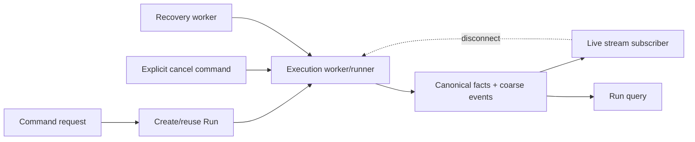

# Phase 08：并发策略、可重连 Streaming 与 Resume

> 模块分类：**Advanced**。多实例与断线恢复约束成立时再实施；fork/steer 保持可选。

## 1. 阶段问题

> 当用户重复点击发送、刷新页面、切换设备、网络断开，或多个 API 实例同时处理同一 Conversation 时，系统如何保证只有允许的 Run 在执行，并让客户端重新观察已有 Run，而不是误创建新 Run？

本阶段把“HTTP 连接就是运行”拆开为三件事：

1. **Command**：创建或复用一个 Run。
2. **Execution**：持有 lease，从 durable checkpoint 推进 Run。
3. **Observation**：客户端订阅事件或查询 canonical projection。

## 2. 路线位置

```text
Phase 07 durable Run + idempotency + lease + recovery
  -> Phase 08 active-run policy + reconnect + resume/cancel
  -> Phase 09 traces/metrics/evals
```

没有 Phase 07 的 canonical state，断流重连只能依赖内存 buffer；没有 request idempotency，客户端“重试”会创建第二个 Run。

## 3. 学习目标

完成后应能解释和证明：

1. 同一 Conversation 是否允许多个 active Run，以及选择该策略的业务理由。
2. `retry command`、`resume observation`、`resume execution` 三者的区别。
3. transport disconnect 不等于业务 cancel；取消必须是显式、持久化 command。
4. interrupt、cancel、resume、reconnect、steer、fork 的语义差异。
5. 为什么 canonical Run/Message 查询是重连的第一层保证。
6. 若要 replay progress，为什么事件必须有 `runId + sequence` 和 retention policy。
7. 慢客户端、断开的客户端不能阻塞 runtime 或无限累积内存。
8. 多实例中 active-run policy 不能只靠进程内 Map/AbortController。
9. cancel/complete、send/send、resume/recovery 等竞态如何原子收口。
10. 什么时候只恢复最终状态就够，什么时候才值得持久化可重放 event stream。

## 4. 前置条件

- [ ] clientRequestId 幂等已经完成。
- [ ] Run 可从 PostgreSQL checkpoint 恢复。
- [ ] lease/version 防止两个 worker 同时推进同一 Run。
- [ ] `cancelRequestedAt` 等持久化取消事实已存在。
- [ ] Tool side effects 有 retry-safety/idempotency 策略。
- [ ] Context 可从 canonical facts 重建。
- [ ] Run/Step/Approval/Message 有查询 projection。
- [ ] 所有 terminal status 与原因均有稳定 contract。

本阶段仍按单用户学习环境验收。Run query/cancel API 必须把“调用者 scope”保留为应用层输入边界，但真实用户、租户和角色校验在 Phase 10 接入；在此之前不得把这些按 ID 查询的接口部署成共享多用户服务。

## 5. 当前项目起点

### 5.1 已有能力

- NDJSON `start/delta/done/error/aborted` contract。
- `fetch + ReadableStream` parser，能处理跨 chunk 行缓冲。
- Vue composable 有 active request/assistant ID 与 AbortController。
- 浏览器断开会传递 AbortSignal，后端尝试把 Message/Run/Step 标 ABORTED。
- Conversation/Message 可以重新查询。
- Run/Step 已持久化，但当前还没有公开完整运行查询入口证据。

### 5.2 现状问题

- `response.on('close')` 直接 abort，连接生命周期等于运行生命周期。
- 页面刷新会丢失内存 active stream state。
- 同一 Conversation 可并发发起多个 Run，没有明确规则或数据库约束。
- `activeStreamRequestId` 只在单个浏览器内有效，不是服务端幂等。
- NDJSON 事件没有 runId 和 sequence（外部 mapper 当前还隐藏 runId）。
- 没有 reconnect/resume endpoint 或 event cursor。
- 前端流提前 EOF 只会报错，不能先查询 canonical Run。
- 多实例下内存 AbortController 无法取消另一实例中的任务。

## 6. 总体设计：推荐 active-run 策略

当前学习项目第一版采用：

> 同一 Conversation 同时最多一个非终态 Run；`WAITING_APPROVAL` 与 PENDING `MANUAL_REVIEW` 都属于 active，不能被新 Run 越过。

理由：

- Conversation history 有顺序依赖。
- Tool/Approval/Context 都基于当前 history snapshot。
- 多个并发输入会产生“谁先写 observation/assistant message”的歧义。
- 用户当前 UI 也只支持一个 active generation。

遇到第二个发送请求：

- 相同 clientRequestId：返回已有 Run。
- 不同 clientRequestId、已有 active Run：返回 `409 RUN_ALREADY_ACTIVE`，包含 active run ID 和可重试建议。
- 不自动把它当 steer，也不静默排队。

`MANUAL_REVIEW` 在本路线中是 durable nonterminal wait state，因此默认占用 active slot。人工明确 resolve 后才能继续/终止；若产品决定允许用户放弃旧 Run，必须先以审计 command 把 ReviewCase 标为 ABANDONED 并把旧 Run 迁移到真实终态，再创建新 Run。

后期确有需求时，才引入 queued input 或 steer；那是新的产品语义，不是并发 bug fix。

## 7. 数据库约束

仅应用层先查后写会竞态。可选实现：

1. PostgreSQL partial unique index：Conversation 上非终态 Run 唯一。
2. Conversation 保存 `activeRunId/version`，在事务中 compare-and-set。
3. 独立 conversation lease/lock row。

Prisma schema 对 partial index 表达有限时，可用明确 migration SQL，并为数据库错误映射稳定业务 code。不能退回进程内 Map。

## 8. 三个生命周期



- Command 可以很短：返回/开始观察 runId。
- Execution 可以比任何单个连接活得更久。
- Observation 可重复建立；断开不改变业务状态。

## 9. 语义词典

| 操作 | 当前定义 | 是否本阶段实现 |
| --- | --- | --- |
| Disconnect | transport 断开 | 是；不自动 cancel |
| Reconnect | 重新建立 observation channel | 是 |
| Resume observation | 从 cursor 或 canonical state 继续看同一 Run | 是 |
| Resume execution | recovery runner 从 checkpoint 推进 | Phase 07 已有，本阶段接入 |
| Cancel/Interrupt | 请求停止当前 Run | 是；显式 API + persisted fact |
| Retry command | 同 clientRequestId 重放 | 是；返回同 Run |
| Steer | active Turn 中加入新输入 | 否 |
| Fork | 复制历史为新 Conversation | 否 |

## 10. 两级重连方案

### Level 1：Canonical reconciliation（必须）

客户端断流后：

1. `GET /api/agent-runs/:runId`。
2. 若 terminal，读取最终 Message/Run/Step 并更新 UI。
3. 若 active，显示“仍在运行”，可重新订阅或轮询。
4. 若 WAITING_APPROVAL，恢复 ApprovalCard。
5. 若 manual review/failure，显示稳定状态。

Level 1 不保证重放每个 delta，但保证最终事实不会丢。

### Level 2：Event replay（按产品需要）

若需要平滑恢复过程，必须使用 transactional outbox，而不是“先更新 Run，再尽力插一条 event”：

```text
RunEvent
  runId
  sequence        # 每个 Run 单调递增
  type
  payload         # 脱敏、受大小限制
  createdAt
```

客户端携带 `afterSequence` 重新订阅。服务端先 replay retained events，再切 live tail。事件是 observation log；Run/Message/Tool facts 仍是 canonical state。

每个可重放 coarse event 必须和它所描述的 canonical transition 在**同一个 PostgreSQL 事务**写入：

```text
BEGIN
  compare-and-set Run/Step/Approval/Tool/Message canonical state
  allocate next per-run sequence atomically
  INSERT RunEventOutbox(runId, sequence, type, payload, createdAt, publishedAt=null)
COMMIT
outbox publisher -> live pub/sub（失败可重试）
```

- `(runId, sequence)` 唯一；sequence 由锁住 Run row 后递增、原子 counter 或等价数据库机制分配，不能用 `max(sequence)+1` 的无锁先查后写。
- COMMIT 成功后，canonical state 与 replay event 同时可见；COMMIT 失败则两者都不存在。
- publisher crash 只造成低延迟通知延后；replay 仍从 outbox 读取，重发由 sequence 去重。
- Level 1 可不创建 outbox/sequence。Level 2 一旦承诺无边界漏事件，就不能只靠内存 EventEmitter 或“fact 先写、event 后写”的两次独立提交。

不要为每个 token 永久建行。可选择：

- 聚合文本 chunk（按大小/时间批次）。
- 只持久化 coarse lifecycle/tool/approval 事件，最终文本从 Message 查询。
- 短 retention 后删除 replay event，但保留 canonical facts。

## 11. 外部 contract 建议

### 11.1 Run projection

```ts
interface AgentRunView {
  id: string
  conversationId: string
  status: string
  checkpoint: string
  assistantMessageId?: string
  lastEventSequence?: number // 仅启用 Level 2 durable replay 时存在
  cancelRequestedAt?: string
  activeApproval?: { approvalId: string; actionSummary: string; expiresAt: string }
  manualReview?: { caseId: string; reasonCode: string; status: 'PENDING' | 'RESOLVED' | 'ABANDONED'; createdAt: string }
  startedAt: string
  endedAt?: string
  error?: { code: string; message: string }
}
```

### 11.2 Stream envelope

若做 replay，所有外部事件统一包含：

```ts
interface RunEventEnvelope<T> {
  runId: string
  sequence: number
  occurredAt: string
  event: T
}
```

sequence 是去重/排序依据，不能用客户端到达时间代替。

`lastEventSequence` 不是 Level 1 canonical query 的必填装饰字段。未启用 transactional outbox 时应省略/用版本化 contract 表达“不支持 replay”，不能返回伪造的 `0` 让客户端误以为 cursor 语义存在。

### 11.3 API 草图

```text
POST /api/conversations/:id/runs          # command；clientRequestId
GET  /api/agent-runs/:runId               # canonical projection
GET  /api/agent-runs/:runId/events?after= # NDJSON replay/live（可选）
POST /api/agent-runs/:runId/cancel        # idempotent cancel command
```

也可保留现有 `/seo/chat/stream` 作为兼容门面，内部仍必须创建/复用 Run 并遵守同一策略。

## 12. Runtime 与 stream 解耦

当前 `async generator -> response.write` 是直接耦合。目标可渐进实现：

```text
RunExecutor emits internal events
  -> Level 1: persist canonical fact, publish best-effort live event
  -> Level 2: persist canonical fact + sequenced outbox in same transaction
  -> outbox publisher publishes bounded observation event
  -> zero or more subscribers consume
```

重要顺序：

- Level 1 的 terminal fact 先持久化，再 best-effort 发布 done；Level 2 的 terminal fact 与 sequenced done outbox 必须同事务提交。
- subscriber 写失败只断开 subscriber，不 abort Run。
- cancel API 才写 `cancelRequestedAt` 并通知 active executor。
- executor 崩溃由 Phase 07 recovery 继续。

单实例第一版可用 in-process pub/sub + DB query fallback，但接口和状态不能依赖它；多实例再用 PostgreSQL LISTEN/NOTIFY、Redis pub/sub 或消息系统。Pub/sub 负责低延迟，不负责 canonical truth。

## 13. Backpressure

慢客户端不能拖慢模型/tool：

- 每 subscriber 使用有界 buffer。
- buffer 满时断开该 subscriber，并让其通过 query/replay 恢复。
- 文本 delta 可合并，不丢 terminal/tool/approval coarse event。
- response.write/backpressure 有明确处理，不能无限堆 Promise/字符串。
- 记录 dropped subscriber/backpressure metric（Phase 09）。

## 14. Cancel 语义

`POST /runs/:id/cancel`：

1. 验证 actor/Conversation scope。
2. 幂等写 `cancelRequestedAt`。
3. 若 Run 已 terminal，返回 canonical terminal，不改状态。
4. 若 active，通知/唤醒 executor；executor 在 checkpoint 检查。
5. 可取消 provider/tool 同时触发 AbortSignal。
6. 最终由 executor/recovery 写 ABORTED 或更准确结果。

HTTP disconnect 不再直接调用这条业务 cancel。

## 15. 关键竞态

| 竞态 | 允许结果 | 不变量 |
| --- | --- | --- |
| 两次 send | 一个 Run + 一个 409/同 key 复用 | active policy 原子化 |
| cancel vs complete | 一个 terminal 赢 | terminal 不可改写 |
| cancel vs tool start | cancel 赢则不开始；tool 已发出则按结果收口 | 不虚构副作用 |
| cancel vs external success/result persist | 查询/记录真实结果；未知则 MANUAL_REVIEW | 不能把已发生副作用虚假标成 ABORTED |
| reconnect vs terminal | replay/query 最终收敛 terminal | sequence 去重 |
| recovery vs live worker | lease owner 唯一 | transition 一次 |
| approval decision vs cancel | 一种迁移取得执行权 | tool 最多一次 |
| outbox persist vs canonical transition（Level 2） | 同事务、同 sequence allocation | replay 不出现永久缺口；publish 可重试 |

## 16. 前端状态模型

不要只保留 `thinking/generating/done/error`。建议 UI projection 至少能表达：

```text
submitting
running
waiting_approval
cancel_requested
reconnecting
completed
failed
aborted
manual_review
```

前端职责：

- 保存 active `runId` 到 conversation cache/route state。
- 解析 sequence，忽略重复/旧事件。
- stream EOF 先 query Run，而非立即显示通用错误。
- 页面 mount/切换 Conversation 时查询 active Run。
- stop 按钮调用 cancel API，不只 abort fetch。
- 本地 optimistic state 最终被 canonical projection 覆盖。

## 17. 任务拆解

### Task 08.1：Active Run policy

- 选择“一会话一个 active Run”。
- 数据库原子约束。
- 同 key 复用、不同 key 409。

### Task 08.2：Run query projection

- 返回 status/checkpoint/final message/error/approval。
- 返回 durable manualReview projection；PENDING review 按 active policy 阻止新 Run。
- 应用服务显式接收 server-side scope；本阶段可用单用户 trusted scope，Phase 10 替换为认证层生成的 ActorContext。
- terminal 与 active projection contract tests。

### Task 08.3：显式 cancel

- persisted cancel command。
- active executor 通知只是加速。
- complete/cancel race tests。

### Task 08.4：Connection 与 execution 解耦

- response close 只取消 subscription。
- runner 由 lease/canonical state 驱动。
- process crash 后 recovery 接管。

### Task 08.5：Level 1 reconciliation

- EOF/network error 后查询 Run/Message。
- 页面刷新恢复 running/waiting/terminal。
- 先证明最终事实可恢复。

### Task 08.6：Level 2 replay（确有 UX 需要时）

- sequence/event retention。
- canonical transition + per-run sequence + outbox 同事务；publisher 独立重试。
- replay then live tail，边界无漏/重可去重。
- bounded buffer/backpressure。

### Task 08.7：竞态与多实例验证

- 两 executor、两 subscriber、双标签页。
- kill/restart + reconnect。
- 指标接入 Phase 09。

## 18. 明确非目标

- 不实现 steer、fork 或输入队列。
- 不允许同一 Conversation 任意并行多个 Run。
- 不保存每 token 的永久事件。
- 不把 WebSocket 当作可靠性解决方案；transport 可后换。
- 不用前端 localStorage 作为 canonical active state。
- 不让断流自动 cancel。
- 不在没有真实吞吐需求时引入 Kafka。
- 不做并行 tool calls；它属于独立工具调度问题。

## 19. 退出标准

- [ ] 同一 Conversation 的 active-run 约束由数据库/原子 CAS 证明。
- [ ] 同 key 重放返回原 Run，不同 key 得到稳定 conflict。
- [ ] response close 不自动改变 Run 为 ABORTED。
- [ ] explicit cancel 可跨连接/进程生效且幂等。
- [ ] 页面刷新可恢复 running/waiting approval/terminal 状态。
- [ ] stream EOF 通过 Run query 收敛，而非直接丢失结果。
- [ ] Run query 与 Message/Step/Approval canonical facts 一致。
- [ ] 若实现 replay：sequence 单调、去重、无边界漏事件、retention 明确。
- [ ] 若实现 replay：每个 coarse event 与对应 canonical transition 在同一事务写入 outbox，publisher crash 后可从 DB 重放。
- [ ] `lastEventSequence` 仅在 Level 2 启用；Level 1 contract 不伪装支持 cursor。
- [ ] MANUAL_REVIEW 有 durable projection，PENDING case 的 active-slot/abandon/resolve policy 有 contract 与竞态测试。
- [ ] 慢 subscriber 不阻塞 executor，buffer 有界。
- [ ] cancel/complete、send/send、recovery/live worker race 有自动化测试。
- [ ] 多实例模拟下副作用与 terminal transition 最多一次。

## 20. 阶段产物

- active-run concurrency policy 与数据库约束。
- Run status/checkpoint projection API。
- persisted cancel API。
- execution/subscription 解耦边界。
- Level 1 reconnect/reconciliation UX。
- 可选 bounded replay event stream。
- 竞态、多标签页、kill/restart 测试报告。

## 21. 进入 Phase 09 前的复盘

1. 如何度量 reconnect 成功率、event lag 和 dropped subscribers？
2. requestId、runId、subscriberId、workerAttemptId 应如何关联？
3. 哪些竞态失败需要告警？
4. active-run conflict 是产品错误、用户行为还是容量指标？
5. replay retention 与存储成本如何量化？
6. 哪些 eval 要覆盖“最终答案正确但过程恢复失败”的情况？
